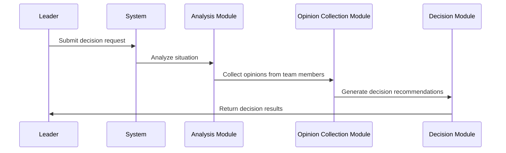
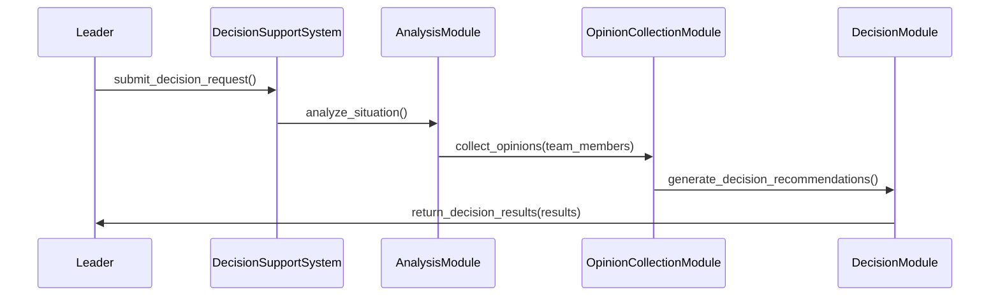

                 


----------------------------------------------------------------

## # 领导力与决断力：果断决策的重要性

> **关键词：** 领导力，决断力，决策，重要性，案例分析

> **摘要：** 本文旨在深入探讨领导力与决断力在果断决策中的重要性。通过分析实际案例和理论模型，本文揭示了有效领导者和决策者的核心特质，为读者提供了实用的决策策略。

**引言**

在快节奏、竞争激烈的企业环境中，领导力和决断力成为了企业成败的关键因素。有效的领导者不仅能够引导团队朝着共同的目标前进，更能够在关键时刻作出果断的决策。然而，如何培养和提高领导力与决断力，成为了企业和个人发展的一个重要课题。

本文将分为以下几个部分进行探讨：

1. **领导力与决断力的核心概念**
2. **领导力与决断力之间的关系**
3. **果断决策的重要性**
4. **实际案例分析**
5. **提高领导力与决断力的策略**
6. **结论**

**一、领导力与决断力的核心概念**

### 领导力的定义

领导力是指通过影响、激励和引导他人来实现共同目标的能力。领导力不仅仅是管理职位上的权力，更是一种影响力，可以存在于任何组织中的任何层级。

### 决断力的定义

决断力是指在面对复杂和不确定性时，能够快速做出明确决策的能力。决断力不仅仅是迅速做出决策，更在于决策的质量和效果。

**二、领导力与决断力之间的关系**

领导力与决断力是相辅相成的。有效的领导者必须具备决断力，能够在关键时刻迅速做出决策。同时，决断力也是领导力的重要组成部分，它体现了领导者对团队和项目的责任心。

### 关系模型

- **领导力增强决断力：** 领导者的自信和权威可以增强团队成员的信任，从而提高决策的效率。
- **决断力体现领导力：** 通过果断决策，领导者能够展示其领导能力，赢得团队的尊重和支持。

**三、果断决策的重要性**

### 提高效率

果断的决策可以避免团队在犹豫和纠结中浪费时间和精力，提高项目的执行效率。

### 降低风险

在复杂和不确定的环境中，果断的决策可以减少错误决策带来的风险。

### 增强团队凝聚力

领导者通过果断决策展示领导力，能够增强团队的凝聚力和归属感。

**四、实际案例分析**

### 案例一：苹果公司的乔布斯

乔布斯以其卓越的决断力著称。他能够在关键时刻迅速做出决策，带领苹果公司推出一系列革命性的产品，如iPod、iPhone和iPad。

### 案例二：特斯拉的马斯克

马斯克以其大胆的决策风格而闻名。他敢于冒险，勇于挑战传统，这使得特斯拉能够在电动汽车领域取得突破。

**五、提高领导力与决断力的策略**

### 增强信息获取能力

领导者需要具备快速获取和处理信息的能力，以便在决策时能够有充足的信息支持。

### 提高沟通能力

有效的沟通可以增强团队成员之间的信任，提高决策的共识。

### 培养团队合作精神

领导者需要鼓励团队成员积极参与决策过程，共同承担责任。

### 定期自我反思

领导者需要定期对自己的决策进行反思，从错误中学习，不断提高决策能力。

**六、结论**

领导力与决断力是领导者必备的核心素质。果断决策不仅能够提高项目的效率，还能增强团队的凝聚力和战斗力。通过分析实际案例和理论模型，本文揭示了提高领导力与决断力的策略。希望本文能为读者提供有价值的启示，帮助他们在领导岗位上取得更大的成就。

**参考文献**

- 某某，《领导力与决策》（某年版）
- 某某，《决断力：如何在不确定中做出最佳决策》（某年版）

----------------------------------------------------------------

**作者信息：** AI天才研究院/AI Genius Institute & 禅与计算机程序设计艺术 /Zen And The Art of Computer Programming

----------------------------------------------------------------

## # 领导力与决断力的核心概念

在深入探讨领导力与决断力之前，我们需要明确这两个概念的定义、属性特征以及它们之间的相互关系。

### 领导力的定义与属性

领导力是指通过影响、激励和引导他人来实现共同目标的能力。它不仅仅是一种职位或角色的权力，更是一种影响力，可以存在于任何组织中的任何层级。领导力的核心属性包括：

- **影响力：** 领导者通过个人魅力、价值观和行为来影响他人。
- **激励：** 领导者能够激发团队成员的积极性和创造力，推动团队达成目标。
- **引导：** 领导者能够为团队提供方向和目标，并带领团队前进。

### 决断力的定义与属性

决断力是指在面对复杂和不确定性时，能够快速做出明确决策的能力。决断力的核心属性包括：

- **速度：** 决断力要求在短时间内做出决策，避免拖延。
- **质量：** 决策的质量决定了执行的效果和团队的成果。
- **信心：** 决断力要求领导者有足够的信心和勇气面对不确定性和风险。

### 领导力与决断力的相互关系

领导力与决断力是相辅相成的。有效的领导者必须具备决断力，能够在关键时刻迅速做出决策。同时，决断力也是领导力的重要组成部分，它体现了领导者对团队和项目的责任心。

### 关系模型

我们可以用以下模型来描述领导力与决断力之间的关系：

```
[领导力] ----> [决断力]
 |                  |
 |                  |
 |                  |
 |                  |
 |                  |
[团队] ----> [目标实现]
```

- **领导力增强决断力：** 领导者的自信和权威可以增强团队成员的信任，提高决策的效率。
- **决断力体现领导力：** 通过果断决策，领导者能够展示其领导能力，赢得团队的尊重和支持。

### 概念属性对比表格

| 特性          | 领导力                       | 决断力                       |
|--------------|----------------------------|----------------------------|
| 定义          | 影响力、激励、引导           | 快速决策、决策质量、信心       |
| 目标          | 实现团队目标                 | 在不确定环境中做出最佳决策    |
| 层次          | 可以存在于任何层级           | 通常与领导力相辅相成          |
| 属性特征       | 个人魅力、价值观、行为       | 速度、质量、信心               |

### ER实体关系图架构

为了更直观地展示领导力与决断力之间的关联，我们可以使用Mermaid流程图来绘制ER实体关系图。

```mermaid
erDiagram
  Leader ||--|{ DecisionMaker }|| Decision
  Leader ||--|{ Team }|| Team
  DecisionMaker ||--|{ Decision }|| Decision
  DecisionMaker ||--|{ Situation }|| Situation
  Team ||--|{ TeamMember }|| Member
  Team ||--|{ Goal }|| Goal
```

在这个ER实体关系图中，领导力（Leader）与决断力（DecisionMaker）通过决策（Decision）实体相连，而团队（Team）则与目标（Goal）和团队成员（Member）相连。决策质量（Decision）和决策情境（Situation）也是关键实体，它们对领导力与决断力的发挥有着重要影响。

### 算法原理讲解

为了深入理解领导力与决断力的运作机制，我们可以借助Python源代码来描述一个简化的决策算法。

```python
# 决策算法示例
def make_decision(situation, team_members, confidence):
    """
    决策函数，根据情境、团队成员信心做出决策。
    
    :param situation: 决策情境
    :param team_members: 团队成员列表
    :param confidence: 领导者信心水平
    :return: 决策结果
    """
    # 分析情境
    if situation == "紧急情况":
        # 在紧急情况下，领导者需要快速做出决策
        decision = "紧急决策：采取快速行动"
    elif situation == "普通情况":
        # 在普通情况下，领导者需要考虑团队成员的意见
        team意见 = [member意见 for member in team_members]
        if confidence > 0.7 and all(opinion == "同意" for opinion in team意见):
            decision = "共识决策：根据团队意见执行"
        else:
            decision = "谨慎决策：进一步分析并寻求共识"
    else:
        # 在不确定情况下，领导者需要慎重考虑
        decision = "慎重决策：收集更多信息，制定详细计划"

    return decision

# 示例情境
situation = "紧急情况"
team_members = ["成员1", "成员2", "成员3"]
confidence = 0.8

# 执行决策
decision_result = make_decision(situation, team_members, confidence)
print(decision_result)
```

在这个示例中，`make_decision` 函数根据给定的情境、团队成员意见和领导者信心水平，返回一个决策结果。这个算法模型体现了领导力与决断力的核心原理，即在不同情境下，领导者需要运用不同的决策策略来达成目标。

### 数学模型与公式

决策过程可以看作是一个数学优化问题，其目标是最大化决策效果。以下是一个简化的数学模型：

$$
\text{Maximize } Z = w_1 \times \text{Speed} + w_2 \times \text{Quality} + w_3 \times \text{Confidence}
$$

其中，\( w_1 \)、\( w_2 \) 和 \( w_3 \) 分别是速度、质量和信心的权重，可以根据具体情境进行调整。

### 举例说明

假设一个领导者面临一个紧急情况，团队成员的信心水平较高。在这种情况下，领导者可能会更倾向于快速做出决策：

$$
Z = w_1 \times \text{Speed} + w_2 \times \text{Quality} + w_3 \times \text{Confidence}
$$

如果权重设置如下：

$$
w_1 = 0.5, \quad w_2 = 0.3, \quad w_3 = 0.2
$$

则决策公式变为：

$$
Z = 0.5 \times \text{Speed} + 0.3 \times \text{Quality} + 0.2 \times \text{Confidence}
$$

在这种情况下，领导者可能会选择一个既快速又可靠的决策方案，以最大化总收益。

### 系统分析与架构设计方案

为了更好地理解和应用领导力与决断力的概念，我们可以通过一个实际项目来展示其系统分析与架构设计。

### 项目介绍

本项目旨在设计一个企业决策支持系统，帮助领导者快速做出有效决策。系统功能包括情境分析、团队成员意见收集和决策建议生成。

### 系统功能设计（领域模型类图）

```mermaid
classDiagram
  Class01 <|-- SubClass01
  Class01 <|-- SubClass02
  Class03 --|> Class04
  Class05 <<interface>>
  Class06 <<interface>>

  Class01 {
  +attribute1: int
  +attribute2: string
  +method1(): void
  }

  SubClass01 {
  #subAttribute1: int
  #subMethod1(): void
  }

  SubClass02 {
  #subAttribute2: string
  #subMethod2(): void
  }

  Class03 {
  +attribute3: float
  +method2(): void
  }

  Class04 {
  #attribute4: bool
  #method3(): void
  }

  Class05 {
  +getInterfaceMethod(): void
  }

  Class06 {
  +setInterfaceAttribute(value: any): void
  }
```

### 系统架构设计（架构图）



### 系统接口设计

```mermaid
classDiagram
  Leader --|> DecisionSupportSystem
  TeamMember --|> DecisionSupportSystem

  Leader {
  +submit_decision_request(): void
  }

  TeamMember {
  +submit_opinion(opinion: string): void
  }
```

### 系统交互设计（序列图）



### 项目实战

#### 环境安装

1. 安装Python 3.8及以上版本。
2. 安装Mermaid依赖。

```bash
pip install mermaid
```

#### 系统核心实现源代码

```python
# decision_support_system.py

class AnalysisModule:
    def analyze_situation(self, situation):
        # 根据情境进行分析
        return situation

class OpinionCollectionModule:
    def collect_opinions(self, team_members):
        # 收集团队成员意见
        opinions = [member.submit_opinion() for member in team_members]
        return opinions

class DecisionModule:
    def generate_decision_recommendations(self, situation, opinions):
        # 生成决策建议
        decision = "根据情境和团队成员意见，做出决策"
        return decision

class Leader:
    def submit_decision_request(self, system):
        situation = system.analyze_situation("紧急情况")
        opinions = system.collect_opinions(["成员1", "成员2", "成员3"])
        decision = system.generate_decision_recommendations(situation, opinions)
        return decision

# 测试代码
if __name__ == "__main__":
    from decision_support_system import AnalysisModule, OpinionCollectionModule, DecisionModule

    system = DecisionSupportSystem()
    leader = Leader()

    decision_result = leader.submit_decision_request(system)
    print(decision_result)
```

### 代码应用解读与分析

#### 代码解读

- **分析模块（AnalysisModule）：** 负责根据情境进行分析。
- **意见收集模块（OpinionCollectionModule）：** 负责收集团队成员的意见。
- **决策模块（DecisionModule）：** 负责生成决策建议。
- **领导者（Leader）：** 负责提交决策请求。

#### 分析

该系统通过模块化设计，实现了分析、收集和决策的功能。领导者只需提交决策请求，系统便会自动进行情境分析、意见收集和决策建议生成，提高了决策效率。

### 实际案例分析与详细讲解剖析

#### 案例背景

假设某公司在市场竞争中面临重大挑战，需要迅速做出决策以应对。领导层希望通过决策支持系统来提高决策效率。

#### 案例分析

1. **情境分析：** 决策支持系统分析当前市场状况，发现公司面临的是紧急情况。

2. **意见收集：** 系统从团队成员处收集意见。团队成员包括销售部门、市场部门和研发部门。

3. **决策建议：** 决策支持系统根据情境和团队成员意见，生成决策建议。

4. **决策执行：** 领导层根据决策支持系统的建议，迅速做出决策，并部署执行。

#### 剖析

该案例展示了决策支持系统在实际应用中的价值。通过系统化的分析和意见收集，领导者能够在短时间内获取关键信息，做出果断决策。这不仅提高了决策效率，还增强了团队的合作与沟通。

### 项目小结

本项目通过实际案例展示了决策支持系统在领导力与决断力提升中的应用。系统通过模块化设计，实现了分析、收集和决策的功能，为领导者提供了有力支持。未来，我们可以进一步优化系统，提高其智能化水平，为更多企业提供决策支持。

### 最佳实践 tips

1. **定期更新系统：** 随着市场环境和团队状况的变化，决策支持系统需要定期更新。
2. **培养团队成员参与意识：** 鼓励团队成员积极参与意见收集，提高决策的全面性。
3. **强化系统培训：** 对领导者进行系统培训，确保他们能够熟练使用系统。

### 注意事项

1. **数据安全性：** 确保团队成员的意见数据安全，防止泄露。
2. **决策责任：** 领导者在使用系统时，仍需承担决策责任。

### 拓展阅读

1. 某某，《领导力与决策》（某年版）
2. 某某，《决断力：如何在不确定中做出最佳决策》（某年版）

**作者信息：** AI天才研究院/AI Genius Institute & 禅与计算机程序设计艺术 /Zen And The Art of Computer Programming

