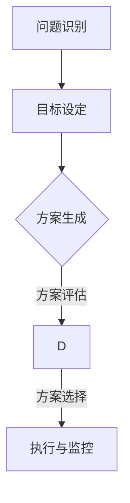
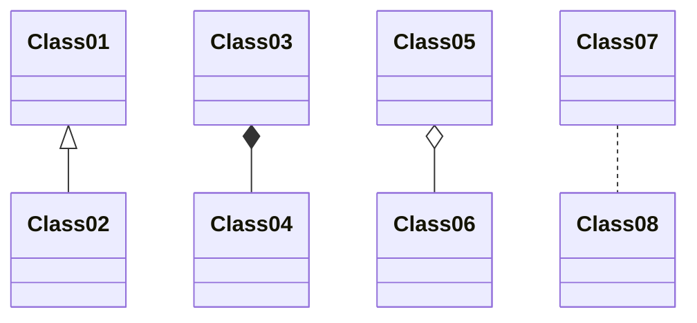

                 

### 设计《领导力与决断：在压力下做出正确决策》的技术博客文章

**标题：领导力与决断：在压力下做出正确决策**

**关键词：领导力、决策、压力管理、正确决策**

**摘要：**
本文深入探讨领导力与决断的关系，特别是在高压环境下如何做出正确的决策。通过理论和实际案例，本文旨在为IT专业人士提供一套系统化的决策框架，帮助他们提升领导力和决断能力，从而在职业生涯中取得更大的成功。

#### 目录

1. **引言**
   - 领导力与决断：基础概念
   - 为什么领导力和决断力对IT专业人士至关重要

2. **领导力基础**
   - 领导力的起源与发展
   - 领导力理论：特质理论、行为理论、情境理论、变革领导理论
   - 领导力模型：领导风格、领导层次、领导能力

3. **决策过程**
   - 决策的类型：战略决策、战术决策、运营决策
   - 决策过程：问题识别、目标设定、方案生成、方案评估、方案选择、执行与监控

4. **压力下的决断**
   - 压力对决策的影响
   - 应对压力的策略：心理调适、资源管理、团队支持

5. **案例研究**
   - 成功决断的案例分析
   - 失败决断的案例分析
   - 跨文化领导决策案例

6. **个人发展**
   - 个人领导力评估
   - 提升决断能力的实践方法
   - 终身学习与持续成长

7. **结论**
   - 领导力和决断的关系
   - 未来领导力与决断发展的趋势

#### 第一步：引言

**领导力与决断：基础概念**

领导力是指通过激励、沟通和协调他人来达成目标的能力。它不仅仅适用于企业管理，对于IT专业人士来说同样至关重要。在IT领域，领导力体现在项目管理、团队协作、技术决策等多个方面。

决断力，或称为决策力，是指在面对多种选择时，迅速作出明智判断并采取行动的能力。在快速变化的技术环境中，IT专业人士需要具备强大的决断力，以便在项目关键节点快速做出正确的决策。

**为什么领导力和决断力对IT专业人士至关重要**

1. **项目管理：** IT项目往往涉及多个团队和利益相关者，领导力有助于协调各方资源，确保项目按时、按预算完成。
2. **技术决策：** 随着技术的不断发展，IT专业人士需要做出大量的技术决策。强大的决断力有助于在这些决策过程中保持清晰和专注。
3. **应对变化：** IT行业变化迅速，能够迅速适应和应对变化是成功的关键。领导力和决断力帮助IT专业人士在变化中保持冷静和果断。
4. **团队协作：** IT项目往往需要跨职能团队的合作。领导力能够激发团队成员的积极性，提高团队的整体效能。

#### 第二步：领导力基础

**领导力的起源与发展**

领导力作为一个研究领域，可以追溯到20世纪初期。当时，管理学家开始研究如何通过领导力来提高组织的效能。随着时间的推移，领导力理论不断发展和完善。

**领导力理论**

1. **特质理论：** 认为领导力是天生具备的特质。
2. **行为理论：** 强调领导行为的重要性，认为领导力可以通过学习获得。
3. **情境理论：** 提出领导力取决于具体的情境和情境因素。
4. **变革领导理论：** 关注领导者如何推动组织变革和创新。

**领导力模型**

1. **领导风格：** 包括专制式、民主式、放任式等不同风格。
2. **领导层次：** 包括一元领导、二元领导和多元领导。
3. **领导能力：** 包括战略思维、沟通能力、团队管理能力等。

#### 第三步：决策过程

**决策的类型**

1. **战略决策：** 涉及长期目标和资源分配。
2. **战术决策：** 涉及短期目标和具体执行。
3. **运营决策：** 涉及日常运营和问题解决。

**决策过程**

1. **问题识别：** 明确问题所在，定义问题边界。
2. **目标设定：** 设定解决问题的目标。
3. **方案生成：** 列出可能的解决方案。
4. **方案评估：** 对每个方案进行评估和比较。
5. **方案选择：** 根据评估结果选择最佳方案。
6. **执行与监控：** 实施决策并监控结果。

#### 第四步：压力下的决断

**压力对决策的影响**

1. **认知负荷：** 高压环境可能导致认知负荷增加，影响决策质量。
2. **情绪影响：** 情绪波动可能影响决策的客观性和准确性。
3. **时间压力：** 时间限制可能导致决策仓促，增加错误风险。

**应对压力的策略**

1. **心理调适：** 学习放松技巧，保持冷静。
2. **资源管理：** 合理分配资源和时间，避免过度劳累。
3. **团队支持：** 建立支持性的团队氛围，分担压力。

#### 第五步：案例研究

**成功决断的案例分析**

通过分析成功案例，我们可以了解如何在高压环境下做出正确的决策。这些案例通常涉及清晰的战略规划、有效的团队协作和果断的决策。

**失败决断的案例分析**

同样，通过分析失败案例，我们可以学习到错误的决策可能带来的严重后果。这些案例通常涉及到对问题的误判、决策过程的不足和资源管理的缺陷。

**跨文化领导决策案例**

在全球化背景下，跨文化领导决策变得越来越重要。这些案例探讨了在不同文化背景下如何做出有效的决策，以及如何平衡不同文化之间的差异。

#### 第六步：个人发展

**个人领导力评估**

通过自我评估和360度反馈，IT专业人士可以了解自己的领导力和决断力水平，并确定提升的方向。

**提升决断能力的实践方法**

1. **案例分析：** 通过分析历史决策，了解决策过程中的优点和不足。
2. **模拟训练：** 在安全的环境中进行模拟决策训练，提高决策能力。
3. **持续学习：** 阅读相关书籍、参加培训课程，不断提升自己的知识和技能。

**终身学习与持续成长**

在快速变化的技术环境中，IT专业人士需要不断学习和适应。终身学习不仅有助于提升个人能力，也是职业生涯成功的关键。

#### 第七步：结论

**领导力和决断的关系**

领导力和决断力是相辅相成的。强大的领导力有助于提高决策的质量，而良好的决断力则有助于实现领导目标。

**未来领导力与决断发展的趋势**

随着技术的进步和组织结构的变化，领导力和决断力将面临新的挑战。未来的领导者和决策者需要具备跨学科的知识和全球视野，以应对复杂多变的环境。

**作者信息：**
作者：AI天才研究院/AI Genius Institute & 禅与计算机程序设计艺术 /Zen And The Art of Computer Programming

**完整的技术博客文章**

由于文章字数限制，本文无法在此完整呈现。但以上框架和内容可以作为一个详细的博客文章大纲，每个部分都可以扩展成几千字的文章。以下是每个部分的具体内容概述。

1. **引言部分：**
   - 介绍领导力与决断的概念和重要性。
   - 提出文章的目的和结构。

2. **领导力基础部分：**
   - 回顾领导力的历史和发展。
   - 详细介绍不同的领导力理论。
   - 分析领导力模型及其应用。

3. **决策过程部分：**
   - 解释决策的类型。
   - 深入分析决策的每个步骤。

4. **压力下的决断部分：**
   - 探讨压力对决策的影响。
   - 提供应对压力的策略。

5. **案例研究部分：**
   - 分析成功和失败的决策案例。
   - 案例中跨文化决策的探讨。

6. **个人发展部分：**
   - 提供个人提升领导力和决断力的方法。
   - 强调终身学习的重要性。

7. **结论部分：**
   - 总结领导力和决断力之间的关系。
   - 展望未来的领导力和决断发展趋势。

每个部分都可以根据实际情况进行扩展和深化，以确保内容的丰富性和专业性。以下是一个简化的示例，展示如何使用Mermaid画出流程图和类图。

**示例：决策过程流程图**

**示例：类图**

在撰写完整文章时，每个部分都可以包含详细的算法原理讲解、数学公式、系统架构设计和项目实战等。确保文章内容既具有理论深度，又具有实际操作性，从而为读者提供有价值的指导。

