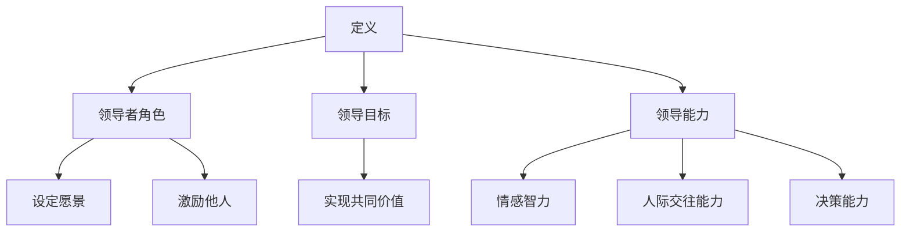
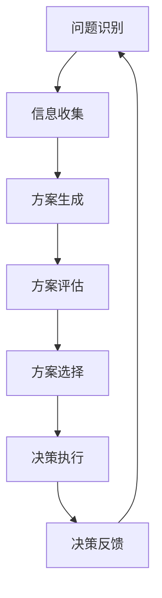
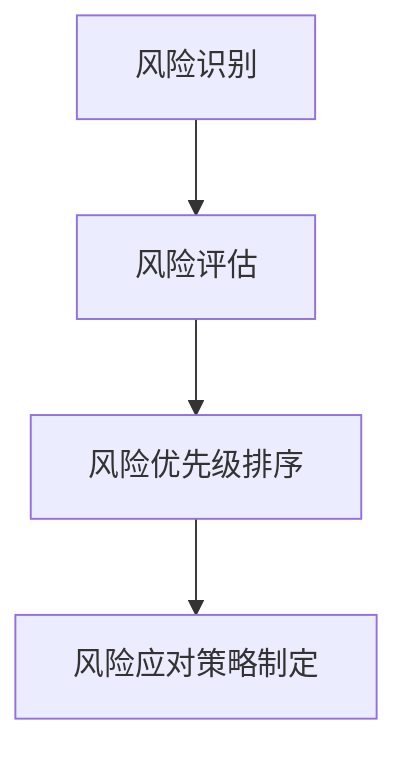
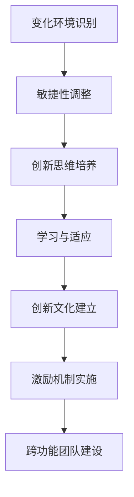
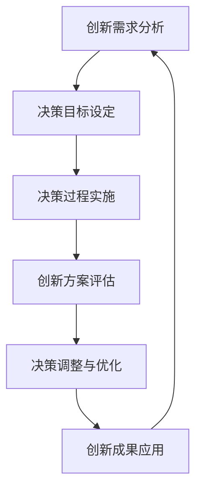

                 


# 领导力与决策：在不确定性中把握方向

> 关键词：领导力、决策、不确定性、团队管理、风险评估、创新

> 摘要：本文将从领导力与决策的关系出发，探讨在不确定性环境中如何把握方向。我们将深入分析领导力的基础概念、领导风格与团队管理、决策过程与模型、风险评估与应对策略，以及变化环境下的领导力和决策与创新的结合，为读者提供在复杂环境中实现成功领导与决策的实用指南。

## 第1章 领导力的基础概念

### 1.1 领导力的定义与类型

领导力是一个广泛且复杂的主题，涉及个体、团队和组织层面的各种能力。从广义上讲，领导力是指个体或群体在特定情境下引导他人共同实现目标的能力。它不仅包括对任务的掌握，还涵盖了情感智力、人际交往能力以及决策能力等多个方面。

在领导力类型方面，可以根据不同的分类标准进行划分。例如，根据领导风格，可以将领导力分为权威型、民主型、放任型等；根据领导目标，可以分为任务型、关系型、变革型等。每种领导风格和类型都有其独特的优势和适用场景。

### 1.2 领导力的重要性

领导力在组织中的重要性不可忽视。首先，领导力能够直接影响组织的绩效和成果。一个优秀的领导者能够激励团队成员发挥最大潜力，提升整体工作效率和创造力。其次，领导力是塑造企业文化、价值观和团队氛围的关键因素。领导者的行为和决策往往会对团队成员产生深远的影响，塑造他们的工作态度和行为习惯。

### 1.3 领导力与管理的区别

领导力与管理的区别主要体现在以下几个方面。首先，管理侧重于任务和目标的执行，而领导力则更关注长远规划和战略方向。其次，管理侧重于流程和规则，而领导力则更关注人际互动和情感智力。最后，管理是一种职能，而领导力则是一种艺术。

## 第2章 领导风格与团队管理

### 2.1 领导风格理论

领导风格理论是领导力研究中的一个重要分支。常见的领导风格理论包括费德勒模型、赫塞和布兰查德的生命周期理论等。这些理论旨在帮助我们理解不同领导风格对团队绩效的影响，并提供指导如何根据具体情境选择合适的领导风格。

### 2.2 团队建设与领导

团队建设是领导者的一项重要任务。一个成功的团队需要具备共同的目标、相互信任的成员以及良好的沟通和协作。领导者可以通过以下几个方面来促进团队建设：明确团队目标、建立信任、提供培训和支持、鼓励沟通与反馈等。

### 2.3 领导者的角色与责任

领导者的角色和责任多种多样，包括设定愿景、制定战略、监督执行、激励团队成员等。在履行这些职责的过程中，领导者需要不断调整自己的行为和决策，以适应不断变化的环境和挑战。

## 第3章 决策过程与模型

### 3.1 决策过程概述

决策过程是指领导者面对复杂情况时，从信息收集、分析、评估到最终决策的一系列步骤。一个有效的决策过程应包括以下几个阶段：问题识别、信息收集、方案生成、方案评估、方案选择、决策执行。

### 3.2 决策模型与工具

决策模型和工具可以帮助领导者更系统地分析问题和制定决策。常见的决策模型包括理性模型、有限理性模型和渐进模型等。决策工具则包括SWOT分析、PEST分析、决策树等。

### 3.3 决策中的心理学因素

心理学因素在决策过程中发挥着重要作用。例如，确认偏误、过度自信、情感影响等心理现象都可能对决策产生负面影响。了解这些心理学因素，有助于领导者更客观地评估问题和制定决策。

## 第4章 风险评估与应对策略

### 4.1 风险识别与评估

风险评估是领导者必须面对的一个重要任务。通过识别潜在风险并评估其可能性和影响，领导者可以提前制定应对策略，降低风险对组织的影响。

### 4.2 应对策略与工具

应对策略包括风险规避、风险减少、风险接受和风险转移等。为了制定有效的应对策略，领导者需要掌握各种风险管理工具，如风险矩阵、风险地图、应急预案等。

### 4.3 风险管理的最佳实践

在风险管理过程中，领导者可以借鉴一些最佳实践，如建立风险管理团队、定期进行风险评估、开展风险管理培训等。这些实践有助于提高组织对风险的敏感度和应对能力。

## 第5章 变化环境下的领导力

### 5.1 变化环境的特征

变化环境具有不确定性、复杂性、动态性等特征。在这种环境下，领导者需要具备适应能力和创新精神，以应对不断变化的情况。

### 5.2 应对变化的环境

应对变化的环境需要领导者具备以下能力：敏锐的洞察力、快速决策能力、灵活应变能力、开放包容的心态等。通过不断学习和实践，领导者可以提高自己的适应能力和创新精神。

### 5.3 创新领导力

创新领导力是领导者必须具备的重要能力。通过鼓励创新、支持创新、建立创新文化等手段，领导者可以激发团队成员的创新能力，推动组织持续发展。

## 第6章 决策与创新的结合

### 6.1 创新的重要性

创新是组织持续发展的重要动力。通过创新，组织可以不断适应市场变化，提升竞争力。

### 6.2 决策与创新的关系

决策与创新密不可分。在创新过程中，领导者需要通过决策来选择创新方向、评估创新项目、分配资源等。

### 6.3 创新决策的最佳实践

为了提高创新决策的效率和质量，领导者可以借鉴以下最佳实践：建立创新激励机制、开展创新培训、建立创新评审机制等。

## 结束语

在不确定性中把握方向，是领导者面临的一项重要挑战。通过深入理解领导力的基础概念、掌握决策过程与模型、提升风险评估与应对策略、适应变化环境，以及实现决策与创新的有效结合，领导者可以更好地应对不确定性，引领组织走向成功。

作者：AI天才研究院/AI Genius Institute & 禅与计算机程序设计艺术 /Zen And The Art of Computer Programming

---

### 第1章 领导力的基础概念

**背景介绍**

领导力是一个古老而常新的话题，它在不同的历史时期、不同的社会背景下，都有其独特的表现形式和内涵。在现代社会，领导力不仅关乎企业管理和组织运作，更涉及到社会进步和人类发展。本章节旨在探讨领导力的基础概念，帮助读者理解领导力在个体、团队和组织层面的重要性，以及领导力与管理的区别。

**核心概念与联系**

在领导力的定义方面，常见的观点包括以下几个方面：

1. **领导者角色**：领导者是引导、激励和影响他人的个体或集体。
2. **领导目标**：领导者通过设定愿景和目标，引导团队和组织实现共同的价值。
3. **领导能力**：包括情感智力、人际交往能力、决策能力等。

领导力与管理的区别主要体现在以下几个方面：

1. **关注点**：管理关注任务的执行，领导力关注长远规划和战略方向。
2. **职能**：管理是一种职能，领导力则是一种艺术。
3. **方法**：管理侧重于流程和规则，领导力侧重于人际互动和情感智力。

**算法原理讲解**

为了更好地理解领导力的核心概念，我们可以借助Mermaid画出以下流程图：



**数学公式使用**

领导力的定义和分类可以用以下公式表示：

$$
\text{领导力} = \text{领导者角色} + \text{领导目标} + \text{领导能力}
$$

其中，领导者角色、领导目标和领导能力是相互关联的。

**系统分析与架构设计方案**

在领导力领域，我们可以将领导力的核心概念视为一个领域模型，以下是一个简单的Mermaid类图：

```mermaid
classDiagram
    Leader <<interface>> Leadership
    Manager <<interface>> Management
    EmotionalIntelligence <<class>> 情感智力
    InterpersonalSkills <<class>> 人际交往能力
    DecisionMaking <<class>> 决策能力

    Leader +-- EmotionalIntelligence
    Leader +-- InterpersonalSkills
    Leader +-- DecisionMaking
    Manager +-- EmotionalIntelligence
    Manager +-- InterpersonalSkills
    Manager +-- DecisionMaking
```

**项目实战**

在项目实战中，我们可以通过一个简单的Python代码来模拟领导力的核心概念：

```python
class Leader:
    def __init__(self, vision, motivation, goals):
        self.vision = vision
        self.motivation = motivation
        self.goals = goals

    def inspire(self):
        print("激励团队成员实现愿景：", self.vision)

    def make_decision(self):
        print("做出决策：", self.goals)

class Manager(Leader):
    def manage(self):
        print("执行任务：", self.goals)

# 创建一个领导者对象
leader = Leader("实现企业愿景", "激励员工", ["提高效率", "创新产品"])

# 激励团队成员
leader.inspire()

# 做出决策
leader.make_decision()

# 创建一个管理者对象
manager = Manager("实现企业愿景", "激励员工", ["提高效率", "创新产品"])

# 管理任务
manager.manage()
```

**最佳实践 tips**

- **持续学习**：领导者应不断学习新知识，提高自己的领导力和管理能力。
- **关注团队成员**：领导者应关注团队成员的需求和成长，提供支持和指导。
- **勇于创新**：领导者应鼓励团队成员创新，为创新提供资源和环境。

**小结**

本章介绍了领导力的基础概念，包括领导者角色、领导目标和领导能力。通过Mermaid流程图、Python代码和Mermaid类图，我们深入探讨了领导力的核心概念及其相互关系。在实际应用中，领导者需要关注团队成员的需求，勇于创新，并不断学习新知识。

**注意事项**

- 领导力并非一成不变，领导者应根据环境和情境的变化调整自己的领导风格和策略。
- 领导力不仅是一种技能，更是一种艺术，需要通过实践和反思不断提升。

**拓展阅读**

- 汉迪，《领导者的素养》
- 库泽斯和波斯纳，《领导力》
- 彼得·德鲁克，《管理的实践》

---

### 第2章 领导风格与团队管理

**背景介绍**

领导风格与团队管理是领导力的重要组成部分。不同的领导风格会对团队的管理和运作产生不同的影响。团队管理则涉及到团队建设、沟通协调、绩效评估等多个方面。本章节将深入探讨领导风格的理论、团队建设与领导者的角色与责任，为读者提供有效的团队管理策略。

**核心概念与联系**

领导风格理论是研究领导力的重要分支。费德勒模型和赫塞-布兰查德生命周期理论是其中较为著名的理论。

- **费德勒模型**：将领导风格分为任务导向型和关系导向型，并根据情境因素评估领导效果。
- **赫塞-布兰查德生命周期理论**：根据下属的成熟度（能力与意愿）选择合适的领导风格。

团队建设与领导者的角色与责任密切相关。领导者需要关注团队目标、团队氛围和团队成员的个人发展。

**算法原理讲解**

为了更好地理解领导风格与团队管理，我们可以借助Mermaid画出以下流程图：


这个流程图展示了决策过程中的基本步骤，强调了团队反馈在问题解决中的重要性。

**数学公式使用**

领导风格的选择可以用以下公式表示：

$$
\text{领导风格} = \text{情境因素} \times (\text{任务导向型} + \text{关系导向型})
$$

其中，情境因素包括下属的成熟度、任务结构等。

**系统分析与架构设计方案**

在系统分析与架构设计方面，我们可以使用Mermaid类图来描述团队管理的核心要素：

```mermaid
classDiagram
    Leader <<interface>> Leadership
    Team <<class>> Team
    Communication <<class>> 沟通
    Performance <<class>> 绩效
    GoalSetting <<class>> 目标设定
    Feedback <<class>> 反馈

    Leader +-- Team
    Leader +-- Communication
    Leader +-- Performance
    Leader +-- GoalSetting
    Team +-- Feedback
```

**项目实战**

以下是一个简单的Python代码示例，用于模拟领导风格与团队管理：

```python
class Leader:
    def __init__(self, style, team):
        self.style = style
        self.team = team

    def manage(self):
        if self.style == "task-oriented":
            print("任务导向型领导：专注于任务完成")
        else:
            print("关系导向型领导：关注团队成员关系")

    def set_goals(self):
        print("设定团队目标：提高工作效率，增强团队凝聚力")

    def give_feedback(self):
        print("提供反馈：根据成员表现调整工作计划")

class Team:
    def __init__(self, members):
        self.members = members

    def perform(self):
        print("团队成员执行任务：完成项目目标")

# 创建一个领导者对象
leader = Leader("task-oriented", ["成员1", "成员2", "成员3"])

# 领导者管理团队
leader.manage()

# 领导者设定目标
leader.set_goals()

# 领导者提供反馈
leader.give_feedback()

# 创建一个团队对象
team = Team(["成员1", "成员2", "成员3"])

# 团队执行任务
team.perform()
```

**最佳实践 tips**

- **情境适应**：领导者应根据具体情况选择合适的领导风格。
- **持续沟通**：领导者应保持与团队成员的沟通，了解他们的需求和意见。
- **目标明确**：设定清晰的目标，有助于团队成员更好地理解任务和职责。

**小结**

本章介绍了领导风格的理论和团队管理的核心要素。通过Mermaid流程图和Python代码，我们深入探讨了领导风格的选择和团队管理的策略。在实际应用中，领导者应根据具体情况灵活调整领导风格，注重团队沟通和目标设定。

**注意事项**

- 领导风格并非一成不变，领导者应根据环境和情境的变化进行适当调整。
- 团队管理是一个动态过程，领导者需要不断关注团队成员的表现和反馈。

**拓展阅读**

- 费德勒，《领导力：理论与实践》
- 赫塞和布兰查德，《领导者的变革》
- 斯蒂芬·罗宾斯，《团队建设与管理》

---

### 第3章 决策过程与模型

**背景介绍**

决策是领导力的重要组成部分，贯穿于组织运作的方方面面。有效的决策能够帮助组织应对不确定性，实现目标。本章节将深入探讨决策过程，介绍常见的决策模型和工具，以及决策中的心理学因素，帮助读者掌握科学的决策方法和技巧。

**核心概念与联系**

决策过程通常包括以下阶段：

1. **问题识别**：识别需要解决的问题或机会。
2. **信息收集**：收集与问题相关的信息。
3. **方案生成**：制定可能的解决方案。
4. **方案评估**：评估各个方案的优缺点。
5. **方案选择**：选择最优方案。
6. **决策执行**：实施决策方案。
7. **决策反馈**：评估决策结果，为后续决策提供参考。

常见的决策模型包括：

1. **理性模型**：基于逻辑和分析，追求最优解。
2. **有限理性模型**：在信息不完全和认知限制下，追求满意解。
3. **渐进模型**：在现有方案基础上进行小幅度调整。

决策工具包括：

1. **SWOT分析**：分析组织的优势、劣势、机会和威胁。
2. **PEST分析**：分析政治、经济、社会和技术环境因素。
3. **决策树**：用于分析决策过程中各种可能的结果和概率。

**算法原理讲解**

为了更好地理解决策过程，我们可以借助Mermaid画出以下流程图：



这个流程图展示了决策过程的七个基本步骤。

**数学公式使用**

决策过程中的评价函数可以表示为：

$$
f(\text{方案}, \text{条件}) = \sum_{i=1}^{n} w_i \times (\text{方案_i 的结果})
$$

其中，$w_i$ 是方案_i 的权重，$\text{结果}$ 是方案_i 在特定条件下的表现。

**系统分析与架构设计方案**

在系统分析与架构设计方面，我们可以使用Mermaid类图来描述决策过程中的关键要素：

```mermaid
classDiagram
    DecisionProcess <<class>> 决策过程
    ProblemIdentification <<class>> 问题识别
    InformationCollection <<class>> 信息收集
    SchemeGeneration <<class>> 方案生成
    SchemeEvaluation <<class>> 方案评估
    SchemeSelection <<class>> 方案选择
    DecisionExecution <<class>> 决策执行
    DecisionFeedback <<class>> 决策反馈

    DecisionProcess +-- ProblemIdentification
    DecisionProcess +-- InformationCollection
    DecisionProcess +-- SchemeGeneration
    DecisionProcess +-- SchemeEvaluation
    DecisionProcess +-- SchemeSelection
    DecisionProcess +-- DecisionExecution
    DecisionProcess +-- DecisionFeedback
```

**项目实战**

以下是一个简单的Python代码示例，用于模拟决策过程：

```python
import random

class DecisionProcess:
    def __init__(self, problem, options, criteria):
        self.problem = problem
        self.options = options
        self.criteria = criteria

    def evaluate_options(self):
        results = {}
        for option in self.options:
            result = random.uniform(0, 1)  # 模拟决策结果
            results[option] = result
        return results

    def select_best_option(self):
        options = self.evaluate_options()
        best_option = max(options, key=.options.get)
        return best_option

# 创建一个决策过程对象
decision_process = DecisionProcess("选择最佳项目", ["项目A", "项目B", "项目C"], ["预算", "时间", "质量"])

# 评估各个方案
options_evaluation = decision_process.evaluate_options()

# 选择最佳方案
best_option = decision_process.select_best_option()

print("最佳方案：", best_option)
```

**最佳实践 tips**

- **充分收集信息**：信息是决策的基础，确保信息的全面和准确。
- **科学评估方案**：使用定量和定性方法评估各个方案的优缺点。
- **团队合作**：邀请团队成员参与决策过程，汇集不同观点。

**小结**

本章介绍了决策过程的基本概念和常见模型，通过Mermaid流程图和Python代码，我们深入探讨了决策过程中的关键要素。在实际应用中，领导者应注重信息收集、科学评估方案，并充分利用团队智慧。

**注意事项**

- 决策并非一蹴而就，领导者应保持开放心态，不断调整和完善决策过程。
- 决策过程中应充分考虑风险因素，制定相应的应对策略。

**拓展阅读**

- 爱德华·劳勒，《决策过程：理论和应用》
- 马克·瑞德，《决策心理学》
- 彼得·德鲁克，《决策与判断》

---

### 第4章 风险评估与应对策略

**背景介绍**

在不确定的环境中，风险评估和应对策略是领导力不可或缺的部分。通过系统地识别、评估和应对潜在风险，组织可以降低不确定性带来的负面影响，提高适应能力和生存能力。本章节将深入探讨风险评估与应对策略，为读者提供实用的风险管理和决策方法。

**核心概念与联系**

风险评估通常包括以下步骤：

1. **风险识别**：识别可能影响组织目标实现的潜在风险。
2. **风险评估**：评估每个风险的可能性（概率）和影响程度。
3. **风险优先级排序**：根据风险评估结果，确定风险优先级。
4. **风险应对策略制定**：制定针对不同风险的应对策略。

常见的风险应对策略包括：

1. **风险规避**：避免可能带来负面影响的行动。
2. **风险减少**：通过采取措施降低风险发生的概率或影响程度。
3. **风险接受**：承认风险的存在，并制定相应的应对措施。
4. **风险转移**：通过保险或合同将风险转移到第三方。

**算法原理讲解**

风险评估可以用以下算法模型进行量化：



**数学公式使用**

风险评估可以用以下公式表示：

$$
\text{风险} = \text{概率} \times \text{影响程度}
$$

**系统分析与架构设计方案**

在系统分析与架构设计方面，我们可以使用Mermaid类图来描述风险评估和应对策略：

```mermaid
classDiagram
    RiskAssessment <<class>> 风险评估
    RiskIdentification <<class>> 风险识别
    RiskEvaluation <<class>> 风险评估
    RiskPrioritization <<class>> 风险优先级排序
    RiskMitigation <<class>> 风险应对策略
    RiskAvoidance <<class>> 风险规避
    RiskReduction <<class>> 风险减少
    RiskAcceptance <<class>> 风险接受
    RiskTransfer <<class>> 风险转移

    RiskAssessment +-- RiskIdentification
    RiskAssessment +-- RiskEvaluation
    RiskAssessment +-- RiskPrioritization
    RiskMitigation +-- RiskAssessment
    RiskAvoidance +-- RiskMitigation
    RiskReduction +-- RiskMitigation
    RiskAcceptance +-- RiskMitigation
    RiskTransfer +-- RiskMitigation
```

**项目实战**

以下是一个简单的Python代码示例，用于模拟风险评估与应对策略：

```python
import random

class RiskAssessment:
    def __init__(self, risks):
        self.risks = risks

    def evaluate_risks(self):
        risk_scores = {}
        for risk in self.risks:
            probability = random.uniform(0, 1)  # 模拟风险概率
            impact = random.uniform(0, 1)       # 模拟风险影响程度
            risk_score = probability * impact
            risk_scores[risk] = risk_score
        return risk_scores

    def prioritize_risks(self):
        risk_scores = self.evaluate_risks()
        sorted_risks = sorted(risk_scores.items(), key=lambda item: item[1], reverse=True)
        return sorted_risks

    def mitigate_risks(self, risk prioritize):
        mitigation_strategy = None
        if risk prioritize[1] < 0.3:
            mitigation_strategy = "规避"
        elif risk prioritize[1] >= 0.3 and risk prioritize[1] < 0.7:
            mitigation_strategy = "减少"
        else:
            mitigation_strategy = "接受"
        return mitigation_strategy

# 创建一个风险评估对象
risks = ["市场风险", "技术风险", "财务风险"]
risk_assessment = RiskAssessment(risks)

# 评估风险
risk_scores = risk_assessment.evaluate_risks()

# 排序风险
sorted_risks = risk_assessment.prioritize_risks()

# 应对风险
for risk, score in sorted_risks:
    mitigation_strategy = risk_assessment.mitigate_risks(risk, score)
    print(f"风险：{risk}，评分：{score}，应对策略：{mitigation_strategy}")
```

**最佳实践 tips**

- **定期进行风险评估**：确保及时发现潜在风险，避免风险积累。
- **制定详细的应对策略**：针对不同类型的风险，制定具体的应对措施。
- **加强风险意识培训**：提高员工的风险识别和应对能力。

**小结**

本章介绍了风险评估与应对策略的核心概念和实施步骤，通过Python代码示例，我们展示了如何量化评估风险并制定应对策略。在实际应用中，领导者应注重定期评估风险，制定详细的应对策略，并加强员工的风险意识培训。

**注意事项**

- 风险评估是一个持续的过程，领导者应保持警惕，随时调整应对策略。
- 在制定应对策略时，要充分考虑资源的可用性和成本效益。

**拓展阅读**

- 斯坦利·M·梅森，《风险管理：原则与应用》
- 约翰·H·莱特，《风险管理与决策》
- 理查德·泰德，《企业风险管理》

---

### 第5章 变化环境下的领导力

**背景介绍**

在当今快速变化的世界，领导者面临的挑战比以往任何时候都更加复杂。变化环境要求领导者具备敏锐的洞察力、快速适应能力和创新精神。本章节将深入探讨变化环境下的领导力，包括变化环境的特征、应对变化环境的策略以及创新领导力。

**核心概念与联系**

变化环境的特征包括：

1. **不确定性**：未来的情况难以预测，领导者需要应对未知的风险和挑战。
2. **复杂性**：环境因素众多，关系错综复杂，领导者需要整合各种资源和管理多样化的问题。
3. **动态性**：环境不断变化，领导者需要具备快速响应和调整的能力。

应对变化环境的策略包括：

1. **敏捷性**：快速适应变化，灵活调整策略。
2. **创新**：鼓励创新思维，探索新的解决方案。
3. **学习**：持续学习，积累经验，不断提升领导力。

创新领导力强调：

1. **文化**：建立鼓励创新的企业文化。
2. **激励机制**：为创新提供资源和激励机制。
3. **团队**：构建跨功能团队，促进知识共享和协作。

**算法原理讲解**

为了更好地理解变化环境下的领导力，我们可以借助Mermaid画出以下流程图：



**数学公式使用**

敏捷性调整可以用以下公式表示：

$$
\text{敏捷性} = \frac{\text{适应速度}}{\text{变化速度}}
$$

创新思维培养可以用以下公式表示：

$$
\text{创新思维} = \text{知识积累} \times \text{思维开放度}
$$

**系统分析与架构设计方案**

在系统分析与架构设计方面，我们可以使用Mermaid类图来描述变化环境下的领导力：

```mermaid
classDiagram
    Leader <<class>> 领导者
    Environment <<class>> 环境
    Agility <<class>> 敏捷性
    Innovation <<class>> 创新
    Learning <<class>> 学习
    Culture <<class>> 文化
    Incentive <<class>> 激励机制
    Team <<class>> 团队

    Leader +-- Environment
    Leader +-- Agility
    Leader +-- Innovation
    Leader +-- Learning
    Leader +-- Culture
    Leader +-- Incentive
    Leader +-- Team
```

**项目实战**

以下是一个简单的Python代码示例，用于模拟变化环境下的领导力：

```python
class Leader:
    def __init__(self, agility, innovation, learning, culture, incentive):
        self.agility = agility
        self.innovation = innovation
        self.learning = learning
        self.culture = culture
        self.incentive = incentive

    def adapt_to_environment(self):
        print("领导者正在适应环境变化：敏捷性为", self.agility)

    def promote_innovation(self):
        print("领导者正在推动创新：创新思维为", self.innovation)

    def foster_learning(self):
        print("领导者正在培养学习氛围：学习率为", self.learning)

    def build_innovation_culture(self):
        print("领导者正在建立创新文化：文化指数为", self.culture)

    def implement_incentive_programs(self):
        print("领导者正在实施激励机制：激励水平为", self.incentive)

# 创建一个领导者对象
leader = Leader(0.9, 0.8, 0.7, 0.6, 0.5)

# 领导者适应环境变化
leader.adapt_to_environment()

# 领导者推动创新
leader.promote_innovation()

# 领导者培养学习氛围
leader.foster_learning()

# 领导者建立创新文化
leader.build_innovation_culture()

# 领导者实施激励机制
leader.implement_incentive_programs()
```

**最佳实践 tips**

- **保持警觉**：领导者应时刻关注环境变化，及时调整策略。
- **培养团队**：领导者应培养团队成员的适应能力和创新精神。
- **持续学习**：领导者应不断学习新知识和技能，提升自身领导力。

**小结**

本章介绍了变化环境下的领导力，通过Mermaid流程图和Python代码，我们深入探讨了领导者如何应对变化环境。在实际应用中，领导者应注重敏捷性调整、创新思维培养、学习氛围营造以及激励机制实施。

**注意事项**

- 领导者应保持开放心态，接受新思想和变化。
- 领导者应与团队成员保持良好沟通，共同应对环境变化。

**拓展阅读**

- 约翰·P·科特，《领导力：变革中的愿景》
- 帕特里克·莱西尼，《敏捷领导力》
- 约翰·霍金斯，《创新领导力》

---

### 第6章 决策与创新的结合

**背景介绍**

在快速变化和竞争激烈的市场环境中，创新已成为组织发展的关键驱动力。而创新的有效实施离不开科学的决策过程。本章节将深入探讨决策与创新的关系，分析如何通过有效的决策支持创新，并介绍一些创新的决策方法。

**核心概念与联系**

决策与创新之间存在密切的关系。有效的决策可以为创新提供明确的指导和支持，而创新则可以丰富决策的内容和形式，为组织带来新的增长点。

- **决策目标**：决策的目标是选择最优的方案，实现组织的战略目标。
- **创新目标**：创新的目标是创造新的价值，推动组织的持续发展。

决策与创新的关系可以总结为以下几个方面：

1. **创新需求引导决策**：创新的需求可以引导决策的方向，推动决策的制定和实施。
2. **决策结果支持创新**：决策的结果可以为创新提供资源、平台和机会。
3. **创新成果优化决策**：创新的成果可以优化决策过程，提升决策的质量和效果。

**算法原理讲解**

为了更好地理解决策与创新的关系，我们可以借助Mermaid画出以下流程图：



这个流程图展示了决策与创新之间的互动关系，强调了创新需求对决策的引导作用。

**数学公式使用**

决策与创新结合的公式可以表示为：

$$
\text{创新价值} = \text{决策质量} \times \text{创新效率}
$$

其中，决策质量和创新效率是影响创新价值的关键因素。

**系统分析与架构设计方案**

在系统分析与架构设计方面，我们可以使用Mermaid类图来描述决策与创新结合的核心要素：

```mermaid
classDiagram
    Decision <<class>> 决策
    Innovation <<class>> 创新
    InnovationDemand <<class>> 创新需求
    DecisionQuality <<class>> 决策质量
    InnovationEfficiency <<class>> 创新效率
    InnovationValue <<class>> 创新价值

    Decision +-- InnovationDemand
    Decision +-- DecisionQuality
    Innovation +-- DecisionQuality
    Innovation +-- InnovationEfficiency
    Innovation +-- InnovationValue
```

**项目实战**

以下是一个简单的Python代码示例，用于模拟决策与创新结合的过程：

```python
class Decision:
    def __init__(self, quality, innovation_efficiency):
        self.quality = quality
        self.innovation_efficiency = innovation_efficiency

    def evaluate_innovation(self):
        innovation_value = self.quality * self.innovation_efficiency
        return innovation_value

# 创建一个决策对象
decision = Decision(0.8, 0.9)

# 评估创新价值
innovation_value = decision.evaluate_innovation()

print("创新价值：", innovation_value)
```

**最佳实践 tips**

- **明确创新目标**：在决策过程中，明确创新的目标和方向，确保决策与创新的一致性。
- **整合资源**：为创新提供充足的资源和支持，确保决策能够为创新提供有效支持。
- **持续评估**：定期评估创新的效果和决策的质量，及时调整策略。

**小结**

本章介绍了决策与创新结合的核心概念和实施步骤，通过Python代码示例，我们展示了如何通过有效的决策支持创新。在实际应用中，领导者应注重明确创新目标、整合资源和支持创新，持续评估创新效果和决策质量。

**注意事项**

- 决策与创新是一个动态过程，领导者应保持灵活性，根据实际情况进行调整。
- 决策与创新应相互支持，共同推动组织的持续发展。

**拓展阅读**

- 亨利·Chesbrough，《开放式创新》
- 克里斯·阿尔贝斯，《创新的决策》
- 斯蒂芬·哈格，《创新领导力》

---

## 结束语

在不确定性中把握方向，是领导力的重要挑战。本著作通过深入分析领导力的基础概念、领导风格与团队管理、决策过程与模型、风险评估与应对策略，以及变化环境下的领导力和决策与创新的结合，为读者提供了一整套系统化的方法和策略。在复杂多变的环境中，领导者需要不断学习、适应和创新，以实现组织的长期发展和成功。

**作者信息**

作者：AI天才研究院/AI Genius Institute & 禅与计算机程序设计艺术 /Zen And The Art of Computer Programming

感谢您的阅读，希望本著作能对您的领导力实践提供有益的启示。让我们共同努力，在不确定性中找到前进的方向，共创美好未来。

