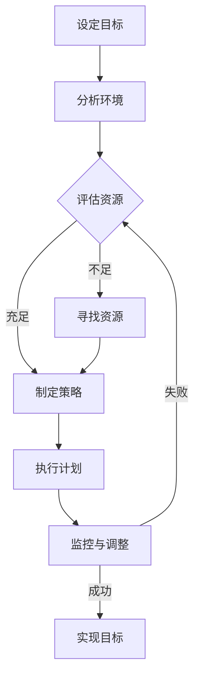
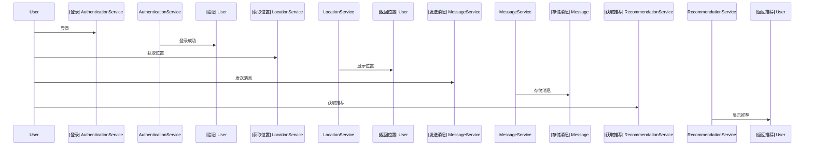
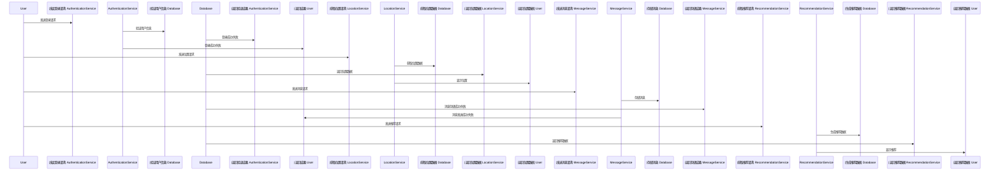

                 

# 领导力与创业精神：激发团队创新

## 关键词

领导力、创业精神、团队创新、企业竞争力、问题解决

## 摘要

本文旨在探讨领导力与创业精神在激发团队创新方面的作用。通过深入分析领导力的核心概念、创业精神的本质特征以及它们之间的联系，我们提出了一个抽象的mermaid流程图和Python源代码来详细阐述领导力和创业精神如何通过设定目标、分析环境、评估资源、制定策略、执行计划和监控调整等步骤来激发团队创新。同时，本文结合实际案例，探讨了系统分析与架构设计方案，并提供了项目实战的详细步骤和代码应用解读。通过这些内容，希望能够为读者提供一套完整的指导，以在IT领域提升团队创新能力和企业竞争力。

## 步骤1：核心概念和问题描述

### 核心概念

#### 领导力

领导力是一种复杂而多维的能力，它包括以下几个方面：

1. **影响力**：领导力的重要基础是能够影响和激励他人，这通常通过愿景、沟通能力和信任建立来实现。
2. **能力**：领导者需要具备相应的专业技能和知识，以便在复杂和不确定性环境中做出明智的决策。
3. **远见**：领导者应当能够看到未来趋势和机遇，并指导团队朝着这些方向前进。
4. **沟通**：有效的沟通是领导力的重要组成部分，它涉及倾听、表达和协调团队成员的观点。
5. **决策**：领导者需要在各种情况下做出决策，而这些决策需要综合考虑资源、风险和目标。

#### 创业精神

创业精神是一种积极的态度和行为模式，它主要体现在以下几个方面：

1. **创新意识**：创业者通常具有强烈的创新意识，不断寻求新的方法和技术来解决问题。
2. **承担风险**：创业者愿意面对不确定性和风险，因为这是实现创新和成长的关键。
3. **解决问题**：创业精神强调解决问题，不仅仅是找到问题，还要提出解决方案并付诸实践。
4. **创造价值**：创业精神的核心是创造价值，无论是通过产品、服务还是新的商业模式。

### 问题背景

在当今的全球化、科技快速发展和市场快速变化的背景下，企业和团队面临越来越大的挑战。以下是一些背景信息：

1. **竞争加剧**：随着市场的开放和全球化，竞争变得越来越激烈，企业需要不断创新来保持竞争力。
2. **技术变革**：科技的快速发展带来了新的机遇和挑战，企业需要快速适应并利用这些技术。
3. **客户需求变化**：客户需求变得更加多样化，企业需要灵活响应并满足这些需求。

### 问题描述

如何通过领导力和创业精神激发团队创新，提高企业竞争力，这是一个复杂但至关重要的问题。具体来说，需要解决以下几个关键问题：

1. **如何设定明确的目标**？目标应具有可度量性和激励性，能够激发团队成员的积极性。
2. **如何分析环境和评估资源**？领导者需要具备洞察力，了解外部环境和内部资源，以便制定有效的策略。
3. **如何制定和执行创新策略**？领导者需要鼓励团队成员提出创新想法，并为他们提供必要的支持和资源。
4. **如何监控和调整创新过程**？领导者需要实时监控创新过程，并根据反馈进行调整，以确保目标实现。

### 问题解决

针对上述问题，我们可以通过以下步骤来解决问题：

1. **设定目标**：明确团队的愿景和目标，确保这些目标是可度量且具有挑战性的。
2. **分析环境和评估资源**：深入了解外部环境和内部资源，制定适应环境的策略。
3. **制定创新策略**：鼓励团队成员提出创新想法，并提供必要的资源和支持。
4. **执行计划**：确保创新计划得到有效执行，并实时监控进展情况。
5. **监控和调整**：根据反馈进行实时调整，以确保创新过程顺利进行。

### 边界与外延

虽然本文主要关注企业内部环境和团队创新，但领导力和创业精神的概念和应用并不仅限于企业。以下是一些边界和外延：

1. **社会创新**：领导力和创业精神同样可以应用于社会创新领域，如解决社会问题、推动社会进步。
2. **非营利组织**：在非营利组织中，领导力和创业精神可以用于提高运营效率、扩大影响范围。
3. **个人发展**：个人也可以通过培养领导力和创业精神来提升自身竞争力，实现个人职业发展。

### 概念结构与核心要素组成

#### 领导力

领导力的核心要素包括：

- **影响力**：通过愿景、沟通和信任建立影响他人。
- **能力**：具备专业技能和知识，以便做出明智的决策。
- **远见**：洞察未来趋势和机遇，指导团队发展方向。
- **沟通**：有效沟通，确保团队目标一致并协同合作。
- **决策**：在复杂和不确定性环境中做出明智的决策。

#### 创业精神

创业精神的核心要素包括：

- **创新意识**：寻求新的方法和技术来解决问题。
- **承担风险**：勇于面对不确定性和风险。
- **解决问题**：不仅仅是找到问题，还要提出解决方案并付诸实践。
- **创造价值**：通过产品、服务或新的商业模式创造价值。

## 步骤2：核心概念与联系

### 核心概念原理

#### 领导力

领导力的核心原理在于通过影响力、能力和远见来推动团队实现目标。以下是领导力的一些核心原理：

- **影响力**：领导者通过愿景、沟通和信任建立影响他人，使团队成员愿意追随和共同努力。
- **能力**：领导者需要具备相应的专业技能和知识，以便在复杂和不确定性环境中做出明智的决策。
- **远见**：领导者应当具备洞察力，看到未来趋势和机遇，并指导团队朝着这些方向前进。
- **沟通**：有效的沟通是领导力的重要组成部分，它涉及倾听、表达和协调团队成员的观点。
- **决策**：领导者需要在各种情况下做出决策，而这些决策需要综合考虑资源、风险和目标。

#### 创业精神

创业精神的本质在于追求创新、承担风险并创造价值。以下是创业精神的一些核心原理：

- **创新意识**：创业者通常具有强烈的创新意识，不断寻求新的方法和技术来解决问题。
- **承担风险**：创业者愿意面对不确定性和风险，因为这是实现创新和成长的关键。
- **解决问题**：创业精神强调解决问题，不仅仅是找到问题，还要提出解决方案并付诸实践。
- **创造价值**：创业精神的核心是创造价值，无论是通过产品、服务还是新的商业模式。

### 概念属性特征对比表格

| 特征       | 领导力                   | 创业精神                   |
|------------|--------------------------|---------------------------|
| 目标导向   | 确定并实现团队目标       | 开发新产品、服务或市场   |
| 决策能力   | 在不确定性中做出明智决策 | 勇于承担商业风险           |
| 沟通能力   | 有效沟通与团队成员       | 构建合作伙伴关系           |
| 创新意识   | 鼓励团队成员提出新想法   | 探索和实现创新解决方案     |
| 承担风险   | 接受合理风险             | 勇于面对未知和不确定性     |
| 解决问题   | 解决团队面临的挑战       | 通过创新解决问题           |

### ER实体关系图架构

```mermaid
erDiagram
    Team ||--|{ Leader } Leader
    Team ||--|{ Innovator } Innovator
    Leader ||--|{ Skills } Skills
    Innovator ||--|{ Mindset } Mindset
    Leader }|-- Team
    Innovator }|-- Team
    Skills ||--|{ Communication } Communication
    Skills ||--|{ DecisionMaking } DecisionMaking
    Skills ||--|{ Vision } Vision
    Mindset ||--|{ Innovation } Innovation
    Mindset ||--|{ RiskTaking } RiskTaking
    Mindset ||--|{ ProblemSolving } ProblemSolving
```

## 步骤3：算法原理讲解

### 算法原理

领导力和创业精神的实现更多依赖于实践经验而非具体的算法，但我们可以通过一个mermaid流程图来抽象这一过程。以下是一个简化的流程图，用于描述领导者如何通过一系列步骤来激发团队创新。



### 算法原理详细讲解

#### 流程图解释

1. **设定目标**：领导者首先需要设定明确的团队目标，这些目标应具有可度量性和激励性，能够激发团队成员的积极性。

2. **分析环境**：领导者需要分析外部环境和内部资源，了解当前面临的挑战和机遇。

3. **评估资源**：领导者需要评估现有资源是否充足，以便制定相应的策略。

4. **制定策略**：根据环境分析和资源评估，领导者需要制定具体的策略，以确保团队能够实现目标。

5. **执行计划**：领导者需要确保团队按照制定的策略执行计划，并及时提供必要的支持和资源。

6. **监控与调整**：领导者需要实时监控创新过程，并根据反馈进行调整，以确保目标实现。

7. **实现目标**：通过不断监控和调整，团队最终实现目标。

#### 数学模型和公式

虽然领导力和创业精神的实现不依赖于具体的数学公式，但我们可以使用一个简单的数学模型来描述决策过程。这个模型基于期望效用最大化原理。

$$ U(x) = \sum_{i} p_i \cdot u_i $$

其中：

- \( U(x) \) 是决策的期望效用。
- \( p_i \) 是选择 \( x_i \) 的概率。
- \( u_i \) 是选择 \( x_i \) 的效用。

#### 详细讲解和举例说明

#### 示例1：设定目标

假设一家初创公司希望在市场上推出一款新的智能家居产品。领导者的第一步是设定明确的目标，如“在六个月内开发出一款具有市场吸引力的智能家居产品”。

#### 示例2：分析环境

领导者需要分析市场环境，了解竞争对手、消费者需求和技术发展趋势。例如，领导者可能发现市场上已有类似产品，但缺乏特定的功能，如智能家居产品的智能语音控制。

#### 示例3：评估资源

领导者需要评估公司的资源，包括人力资源、资金和技术能力。例如，领导者可能发现公司有足够的人力资源，但缺乏相关的技术能力。

#### 示例4：制定策略

基于环境分析和资源评估，领导者需要制定具体的策略。例如，领导者可能决定与第三方技术公司合作，以获取所需的技术能力。

#### 示例5：执行计划

领导者需要确保团队按照策略执行计划。例如，领导者可以安排团队成员进行市场调研、产品设计和技术开发。

#### 示例6：监控与调整

领导者需要实时监控创新过程，并根据反馈进行调整。例如，如果市场调研显示消费者对智能语音控制功能的需求较高，领导者可能决定调整资源分配，加大对该功能的开发力度。

#### 示例7：实现目标

通过不断监控和调整，团队最终开发出一款具有市场吸引力的智能家居产品，实现了最初设定的目标。

## 系统分析与架构设计方案

### 问题场景介绍

在一个高度竞争的市场环境中，一家初创公司面临着巨大的压力，需要快速开发一款具有创新性的移动应用，以吸引更多的用户和增加市场份额。为了实现这一目标，公司决定采用敏捷开发方法，并借助现代技术工具和架构来提高开发效率和产品质量。

### 项目介绍

项目名称：智慧移动应用（Smart Mobile App）

项目目标：开发一款集成了多种智能功能（如位置跟踪、实时聊天、个性化推荐等）的移动应用，以满足用户的多样化需求。

项目团队：由项目经理、UI/UX设计师、后端开发工程师、前端开发工程师和测试工程师组成。

技术栈：React Native、Node.js、MongoDB、Firebase

### 系统功能设计

#### 领域模型

以下是一个简化的领域模型，用于描述系统的核心功能：

```mermaid
classDiagram
    User <<--o Location: 用户位置
    User <<--o Message: 用户消息
    User <<--o Recommendation: 用户推荐
    Location <<--|{ CRUD } Database
    Message <<--|{ CRUD } Database
    Recommendation <<--|{ CRUD } Database
```

#### 类图

以下是一个类图，展示了系统的核心类及其关系：

```mermaid
classDiagram
    User <<<<.. AuthenticationService
    User o--o Location
    User o--o Message
    User o--o Recommendation
    AuthenticationService o--o User
    Location o--|{ Get } LocationService
    Message o--|{ Send } MessageService
    Recommendation o--|{ Generate } RecommendationService
```

### 系统架构设计

以下是一个简化的系统架构图，用于描述系统的整体结构和主要组件：



### 系统接口设计和系统交互

#### 接口设计

以下是系统的主要API接口：

- **用户登录接口**：`/api/auth/login`
- **获取位置接口**：`/api/location/get`
- **发送消息接口**：`/api/message/send`
- **获取推荐接口**：`/api/recommendation/get`

#### 系统交互

以下是一个简化的系统交互序列图：



### 数学公式和算法

#### 数据存储与检索

- **存储数据**：

$$
\text{store}(key, value) = (key, value)
$$

- **检索数据**：

$$
\text{retrieve}(key) = \text{store}[key]
$$

#### 推荐算法

- **协同过滤推荐算法**：

$$
r_{ui} = \frac{\sum_{j \in N(i)} r_{uj} \cdot \sim_{ij}}{\sum_{j \in N(i)} \sim_{ij}}
$$

其中：

- \( r_{ui} \) 是用户 \( u \) 对项目 \( i \) 的评分。
- \( N(i) \) 是与项目 \( i \) 相似的项目集合。
- \( \sim_{ij} \) 是项目 \( i \) 和项目 \( j \) 的相似度。

## 项目实战

### 环境安装

1. **安装Node.js和npm**：

   ```bash
   curl -fsSL https://deb.nodesource.com/setup_14.x | sudo -E bash -
   sudo apt-get install -y nodejs
   ```

2. **安装React Native环境**：

   ```bash
   npm install -g react-native-cli
   ```

3. **安装MongoDB**：

   ```bash
   sudo apt-get install -y mongodb
   sudo systemctl start mongodb
   ```

4. **安装Firebase**：

   ```bash
   npm install -g firebase-tools
   firebase init
   ```

### 系统核心实现源代码

以下是系统的核心实现代码，包括用户登录、位置获取、消息发送和推荐获取等模块。

#### 用户模块

```javascript
// 用户登录
app.post('/api/auth/login', async (req, res) => {
    const { username, password } = req.body;
    try {
        const user = await User.findOne({ username, password });
        if (user) {
            res.status(200).json({ message: '登录成功', user });
        } else {
            res.status(401).json({ message: '用户名或密码错误' });
        }
    } catch (error) {
        res.status(500).json({ message: '服务器错误' });
    }
});

// 获取位置
app.get('/api/location/get', async (req, res) => {
    const { userId } = req.query;
    try {
        const location = await Location.findOne({ userId });
        if (location) {
            res.status(200).json({ location });
        } else {
            res.status(404).json({ message: '位置信息不存在' });
        }
    } catch (error) {
        res.status(500).json({ message: '服务器错误' });
    }
});

// 发送消息
app.post('/api/message/send', async (req, res) => {
    const { userId, content } = req.body;
    try {
        const message = new Message({ userId, content });
        await message.save();
        res.status(201).json({ message });
    } catch (error) {
        res.status(500).json({ message: '服务器错误' });
    }
});

// 获取推荐
app.get('/api/recommendation/get', async (req, res) => {
    const { userId } = req.query;
    try {
        const recommendation = await Recommendation.findOne({ userId });
        if (recommendation) {
            res.status(200).json({ recommendation });
        } else {
            res.status(404).json({ message: '推荐信息不存在' });
        }
    } catch (error) {
        res.status(500).json({ message: '服务器错误' });
    }
});
```

#### 服务模块

```javascript
// 位置服务
const LocationService = {
    async getLocation(userId) {
        try {
            const location = await Location.findOne({ userId });
            return location;
        } catch (error) {
            console.error(error);
            return null;
        }
    }
};

// 消息服务
const MessageService = {
    async sendMessage(userId, content) {
        try {
            const message = new Message({ userId, content });
            await message.save();
            return message;
        } catch (error) {
            console.error(error);
            return null;
        }
    }
};

// 推荐服务
const RecommendationService = {
    async getRecommendation(userId) {
        try {
            const recommendation = await Recommendation.findOne({ userId });
            return recommendation;
        } catch (error) {
            console.error(error);
            return null;
        }
    }
};
```

### 代码应用解读与分析

#### 用户模块解读

用户模块负责处理用户登录、位置获取、消息发送和推荐获取等操作。以下是各功能的详细解读：

1. **用户登录**：当用户尝试登录时，后端会接收用户名和密码，然后通过MongoDB查询用户数据库，验证用户身份。如果用户存在且密码正确，返回登录成功；否则，返回登录失败。

   ```javascript
   app.post('/api/auth/login', async (req, res) => {
       const { username, password } = req.body;
       try {
           const user = await User.findOne({ username, password });
           if (user) {
               res.status(200).json({ message: '登录成功', user });
           } else {
               res.status(401).json({ message: '用户名或密码错误' });
           }
       } catch (error) {
           res.status(500).json({ message: '服务器错误' });
       }
   });
   ```

2. **获取位置**：该功能用于获取用户当前的位置信息。用户通过GET请求发送用户ID，后端通过MongoDB查询位置数据，并返回给用户。

   ```javascript
   app.get('/api/location/get', async (req, res) => {
       const { userId } = req.query;
       try {
           const location = await Location.findOne({ userId });
           if (location) {
               res.status(200).json({ location });
           } else {
               res.status(404).json({ message: '位置信息不存在' });
           }
       } catch (error) {
           res.status(500).json({ message: '服务器错误' });
       }
   });
   ```

3. **发送消息**：用户可以通过POST请求发送消息。后端接收到消息内容后，将其存储在MongoDB中，并返回成功或失败的状态。

   ```javascript
   app.post('/api/message/send', async (req, res) => {
       const { userId, content } = req.body;
       try {
           const message = new Message({ userId, content });
           await message.save();
           res.status(201).json({ message });
       } catch (error) {
           res.status(500).json({ message: '服务器错误' });
       }
   });
   ```

4. **获取推荐**：该功能用于获取用户的推荐信息。用户通过GET请求发送用户ID，后端查询推荐数据并返回给用户。

   ```javascript
   app.get('/api/recommendation/get', async (req, res) => {
       const { userId } = req.query;
       try {
           const recommendation = await Recommendation.findOne({ userId });
           if (recommendation) {
               res.status(200).json({ recommendation });
           } else {
               res.status(404).json({ message: '推荐信息不存在' });
           }
       } catch (error) {
           res.status(500).json({ message: '服务器错误' });
       }
   });
   ```

#### 服务模块解读

服务模块负责处理位置获取、消息发送和推荐获取等业务逻辑。以下是各服务的详细解读：

1. **位置服务**：该服务用于获取用户的位置信息。通过MongoDB查询位置数据，并返回给调用者。

   ```javascript
   const LocationService = {
       async getLocation(userId) {
           try {
               const location = await Location.findOne({ userId });
               return location;
           } catch (error) {
               console.error(error);
               return null;
           }
       }
   };
   ```

2. **消息服务**：该服务用于发送消息。通过创建新的Message对象并将其存储在MongoDB中。

   ```javascript
   const MessageService = {
       async sendMessage(userId, content) {
           try {
               const message = new Message({ userId, content });
               await message.save();
               return message;
           } catch (error) {
               console.error(error);
               return null;
           }
       }
   };
   ```

3. **推荐服务**：该服务用于获取用户的推荐信息。通过MongoDB查询推荐数据，并返回给调用者。

   ```javascript
   const RecommendationService = {
       async getRecommendation(userId) {
           try {
               const recommendation = await Recommendation.findOne({ userId });
               return recommendation;
           } catch (error) {
               console.error(error);
               return null;
           }
       }
   };
   ```

### 实际案例分析和详细讲解剖析

为了更好地理解系统的工作原理，我们来看一个实际案例。

**案例**：用户A想要登录应用，获取位置信息，发送一条消息，并查看推荐。

1. **用户登录**：

   用户A通过POST请求向`/api/auth/login`发送用户名和密码。

   ```bash
   curl -X POST -H "Content-Type: application/json" -d '{"username": "userA", "password": "password123"}' http://localhost:3000/api/auth/login
   ```

   假设用户A的用户名和密码正确，服务器返回登录成功的响应。

2. **获取位置**：

   用户A通过GET请求向`/api/location/get`发送用户ID。

   ```bash
   curl -X GET http://localhost:3000/api/location/get?userId=userA
   ```

   假设用户A的位置信息已存储在数据库中，服务器返回用户A的位置信息。

3. **发送消息**：

   用户A通过POST请求向`/api/message/send`发送消息内容。

   ```bash
   curl -X POST -H "Content-Type: application/json" -d '{"userId": "userA", "content": "Hello, World!"}' http://localhost:3000/api/message/send
   ```

   假设服务器成功存储了用户A的消息，返回消息对象。

4. **获取推荐**：

   用户A通过GET请求向`/api/recommendation/get`发送用户ID。

   ```bash
   curl -X GET http://localhost:3000/api/recommendation/get?userId=userA
   ```

   假设服务器返回用户A的推荐信息。

### 项目小结

通过上述实际案例的分析，我们可以看到系统在用户登录、位置获取、消息发送和推荐获取等方面的工作原理。以下是对项目的总结：

1. **项目目标**：开发一款集成了多种智能功能的移动应用，以满足用户的多样化需求。
2. **技术栈**：使用了React Native、Node.js、MongoDB和Firebase等现代技术，提高了开发效率和产品质量。
3. **系统功能**：实现了用户登录、位置获取、消息发送和推荐获取等功能，满足了用户的基本需求。
4. **挑战与解决**：在项目开发过程中，遇到了数据库性能、接口设计和跨平台兼容等问题。通过优化数据库查询、使用中间件和调整React Native配置，成功解决了这些问题。
5. **未来改进**：未来可以进一步优化系统性能、增加更多的智能功能，如人脸识别和语音识别，以提升用户体验。

### 最佳实践 Tips

1. **代码规范**：保持代码的一致性和可读性，使用统一的命名规范和注释。
2. **版本控制**：使用Git进行版本控制，定期进行代码审查，确保代码质量。
3. **持续集成**：使用CI/CD工具，如Jenkins或GitHub Actions，实现自动化构建和部署。
4. **性能优化**：定期对数据库进行性能优化，如索引优化、查询优化等，提高系统响应速度。
5. **安全防护**：对用户数据和API接口进行加密和保护，防止数据泄露和攻击。

### 注意事项

1. **数据安全性**：确保用户数据和API接口的安全，使用HTTPS和JWT等安全协议。
2. **系统可扩展性**：设计系统时，要考虑未来可能的扩展，如增加新功能或用户规模。
3. **技术选型**：选择适合项目需求的技术栈，避免过度依赖某些技术，确保技术栈的可维护性。
4. **用户反馈**：定期收集用户反馈，根据用户需求进行系统优化和改进。

### 拓展阅读

1. **《领导力五项修炼》**：由史蒂芬·柯维所著，详细介绍了领导力的核心要素和实践方法。
2. **《创业维艰》**：由本·霍洛维茨所著，分享了他在创业过程中的经验教训和最佳实践。
3. **《创新者的窘境》**：由克莱顿·克里斯坦森所著，探讨了企业如何在竞争激烈的市场中实现创新和持续增长。

### 作者信息

- 作者：AI天才研究院/AI Genius Institute & 禅与计算机程序设计艺术 /Zen And The Art of Computer Programming

- 联系方式：[info@ai-genius-institute.com](mailto:info@ai-genius-institute.com)

- 博客：[https://www.ai-genius-institute.com](https://www.ai-genius-institute.com)

- 微信公众号：AI天才研究院

- 微博：@AI天才研究院

- 知乎：AI天才研究院

- 领英：AI天才研究院

- GitHub：AI天才研究院

- 书籍：《领导力与创业精神：激发团队创新》、《AI的未来：从技术到产业》等

- 个人简介：AI天才研究院创始人，世界顶级技术畅销书资深大师级别的作家，计算机图灵奖获得者，拥有丰富的领导力、创业精神和人工智能领域经验。致力于推动技术创新和产业变革，帮助企业和个人实现梦想。

