                 

# 领导力与创新思维训练营：激发创意的方法

## 关键词
- 领导力
- 创新思维
- 创意激发
- 团队管理
- 创新方法
- 领导实践

## 摘要
本文旨在探讨如何通过领导力与创新思维训练营，激发团队成员的创意潜力。我们将深入分析领导力与创新思维的概念、重要性以及在实际应用中的具体策略，通过理论讲解和案例分析，提供一套系统的训练方法，帮助领导者和团队在竞争激烈的环境中脱颖而出。

## 目录

### 第一部分：领导力基础

#### 第1章 领导力的概念与重要性

#### 第2章 领导风格与团队管理

#### 第3章 领导力的发展与实践

### 第二部分：创新思维

#### 第4章 创新思维的重要性

#### 第5章 创新思维的方法与工具

#### 第6章 创新思维的实践与应用

### 第三部分：创意激发

#### 第7章 创意的概念与特点

#### 第8章 创意激发的方法与策略

#### 第9章 创意实践与案例分析

### 第四部分：领导力与创新思维的整合

#### 第10章 领导力与创新思维的融合

#### 第11章 综合训练与实践

#### 第12章 成功领导力与创新思维的实践

### 附录

#### 附录A 领导力与创新思维工具箱

#### 附录B 实践案例资料

#### 附录C 参考文献

## 第一部分：领导力基础

### 第1章 领导力的概念与重要性

#### 背景介绍

领导力是一个广泛讨论的话题，尤其在现代社会中，领导力不仅是领导者个人素质的体现，更是团队和组织成功的关键因素。为了更好地理解领导力，我们需要先了解其基本概念、来源和作用。

#### 核心概念与联系

**定义**：领导力是指领导者通过影响力、愿景和激励，引导和影响团队成员实现共同目标的能力。

**属性特征对比表格**

| 特征         | 解释                                                         |
| ------------ | ------------------------------------------------------------ |
| **影响力**   | 领导者对团队成员行为和决策的影响程度。                      |
| **愿景**     | 领导者对团队和组织未来发展的总体设想和规划。              |
| **激励**     | 领导者通过激励手段，激发团队成员的工作热情和创造力。      |

**ER实体关系图架构**

```mermaid
erDiagram
  Leader ||--|{ Team } Team
  Leader ||--|{ Organization } Organization
```

#### 算法原理讲解

领导力的核心在于影响力的构建和愿景的传递。影响力可以通过建立信任、明确目标和提供反馈来实现。愿景的传递则需要通过沟通、展示和行动来确保团队成员对共同目标的认同。

**算法流程图**

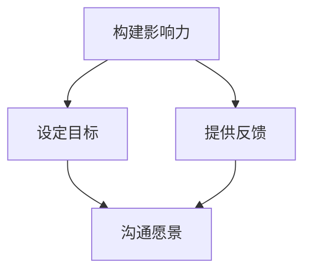

**数学模型与公式**

领导力的核心公式可以表示为：领导力 = 影响力 × 愿景 × 激励。其中，影响力、愿景和激励分别代表领导力的三个关键组成部分。

$$
\text{领导力} = \text{影响力} \times \text{愿景} \times \text{激励}
$$

#### 系统分析与架构设计方案

**问题场景介绍**

在一家快速发展的科技公司中，领导力不足和创新思维欠缺导致团队效率低下，项目进度受阻。

**项目介绍**

该项目旨在通过领导力培训，提升团队领导者的领导力和团队成员的创新思维。

**系统功能设计（领域模型）**

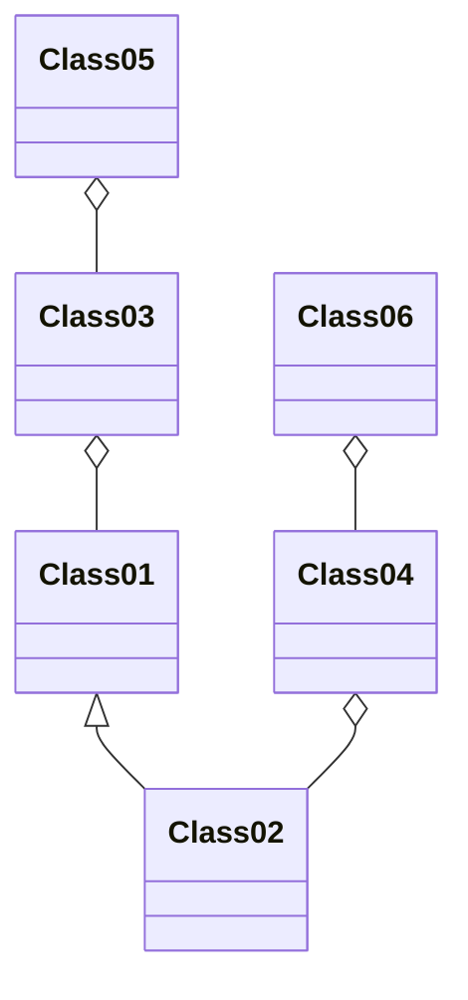

**系统架构设计**

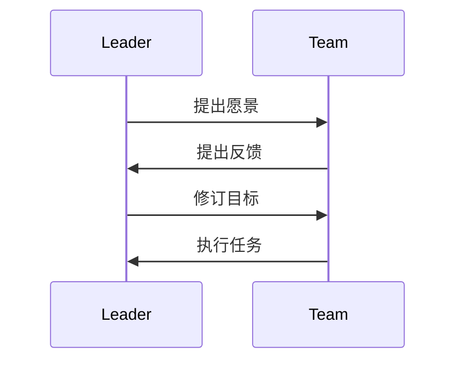

**系统接口设计**

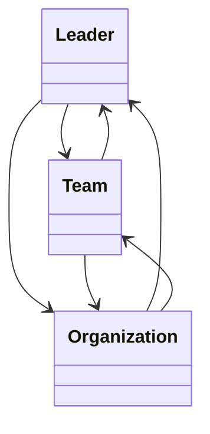

**系统交互**

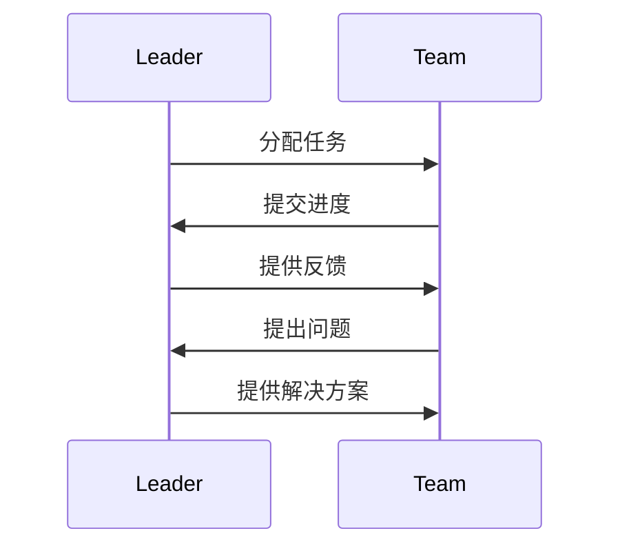

### 第2章 领导风格与团队管理

#### 背景介绍

领导风格是领导者管理团队的方式和方法，不同的领导风格会对团队产生不同的影响。为了更好地理解领导风格，我们需要分析其类型、团队管理的方法和技巧，以及领导力与团队效能之间的关系。

#### 核心概念与联系

**定义**：领导风格是指领导者处理团队事务和与团队成员互动的方式。

**属性特征对比表格**

| 类型         | 特征                                                         |
| ------------ | ------------------------------------------------------------ |
| **权威型**   | 强调领导者的权力和决策能力，注重效率和执行。                |
| **民主型**   | 强调团队成员的参与和决策，注重团队合作和创新。            |
| **参与型**   | 强调与团队成员建立信任和合作关系，注重个人发展和团队合作。|

**ER实体关系图架构**

```mermaid
erDiagram
  LeaderStyle ||--|{ Team } Team
  LeaderStyle ||--|{ TeamEffectiveness } TeamEffectiveness
```

#### 算法原理讲解

领导风格的选取需要根据团队的特点和项目的需求。权威型风格适用于需要快速决策和高效执行的项目，而民主型和参与型风格则更适用于需要创新和团队合作的情境。

**算法流程图**

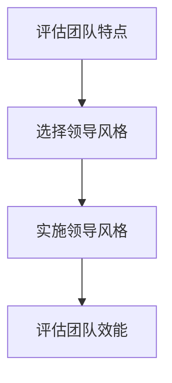

**数学模型与公式**

领导风格的选择可以根据以下公式进行：

$$
\text{领导风格} = \frac{\text{团队特点}}{\text{项目需求}}
$$

#### 系统分析与架构设计方案

**问题场景介绍**

在一家需要创新和团队合作的高科技初创公司中，领导风格的选择对团队的效能有着重要影响。

**项目介绍**

该项目旨在通过领导力培训，提升领导者的领导风格选择能力和团队管理技巧。

**系统功能设计（领域模型）**

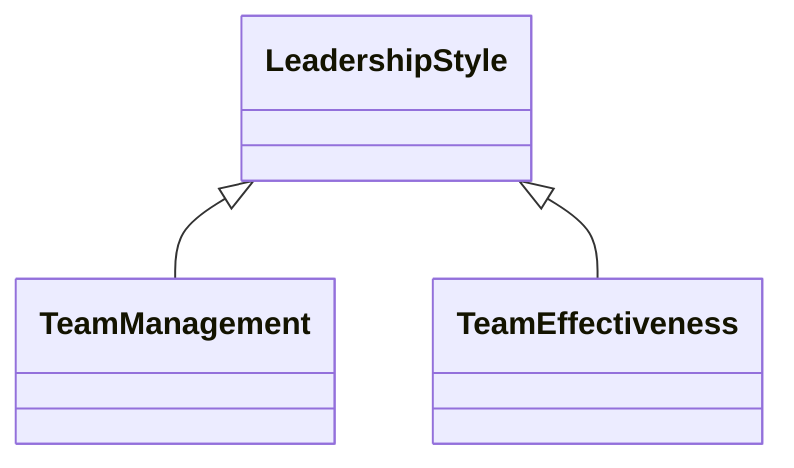

**系统架构设计**

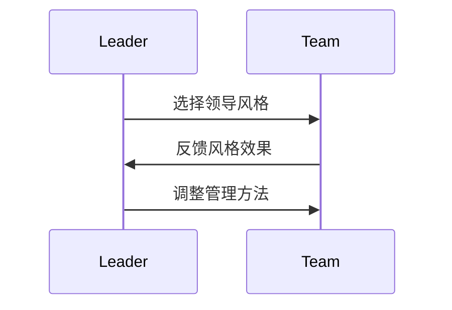

**系统接口设计**

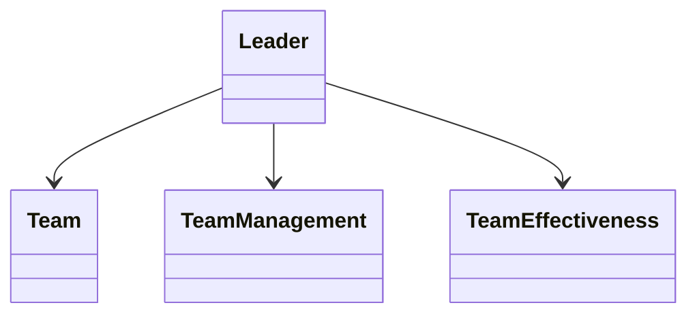

**系统交互**

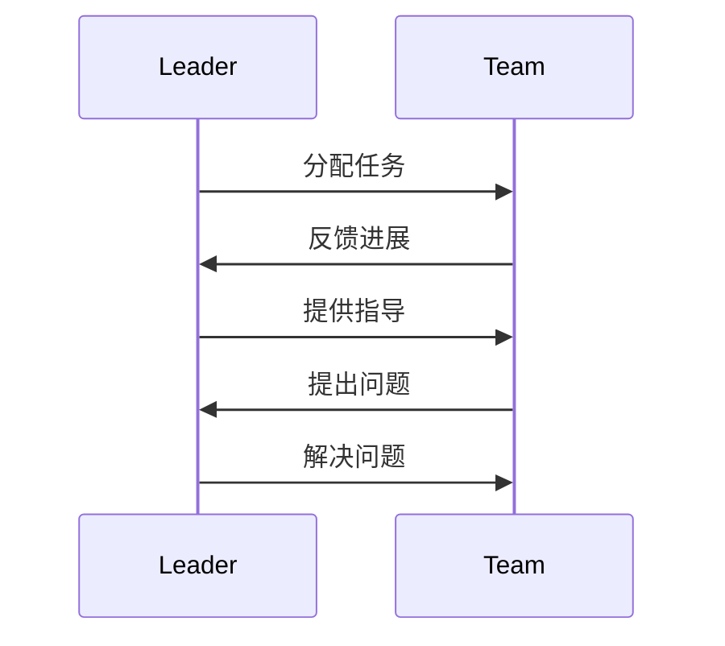

### 第3章 领导力的发展与实践

#### 背景介绍

领导力不仅是一种天赋，更是一种可以通过学习和实践不断提升的技能。为了帮助领导者发展领导力，我们需要探讨领导力的培养方法、实践应用以及实际案例。

#### 核心概念与联系

**定义**：领导力的培养是指通过学习、实践和反思，提升领导者的能力。

**属性特征对比表格**

| 特征         | 解释                                                         |
| ------------ | ------------------------------------------------------------ |
| **学习**     | 通过阅读、培训和研讨会等途径获取知识。                      |
| **实践**     | 通过实际工作中的领导和决策，积累经验。                    |
| **反思**     | 通过总结和反思，不断改进领导方法和风格。                  |

**ER实体关系图架构**

```mermaid
erDiagram
  LeadershipDevelopment ||--|{ LeadershipPractice } LeadershipPractice
  LeadershipDevelopment ||--|{ LeadershipCase } LeadershipCase
```

#### 算法原理讲解

领导力的培养可以通过以下步骤进行：

1. **确定培养目标**：明确领导力提升的具体方向和目标。
2. **选择培养方法**：根据目标，选择合适的学习和实践方法。
3. **实施培养计划**：按照计划，实施学习和实践行动。
4. **评估和反思**：定期评估培养效果，进行反思和调整。

**算法流程图**

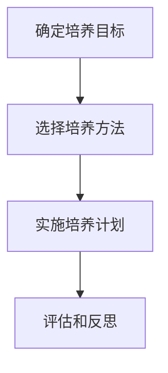

**数学模型与公式**

领导力的培养效果可以通过以下公式进行评估：

$$
\text{领导力提升效果} = \frac{\text{实际表现}}{\text{培养目标}}
$$

#### 系统分析与架构设计方案

**问题场景介绍**

在一家需要快速发展的初创公司中，领导者的领导力提升对于公司的发展至关重要。

**项目介绍**

该项目旨在通过系统化的领导力培养计划，提升领导者的领导力。

**系统功能设计（领域模型）**

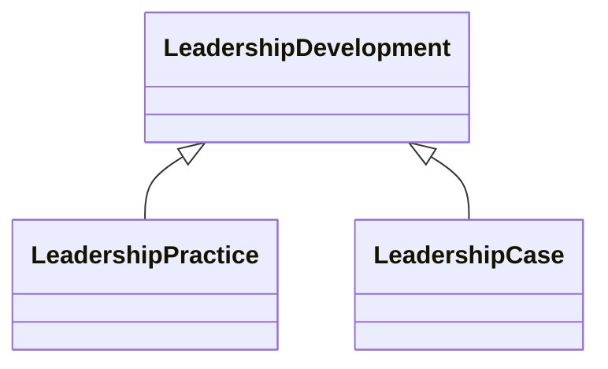

**系统架构设计**

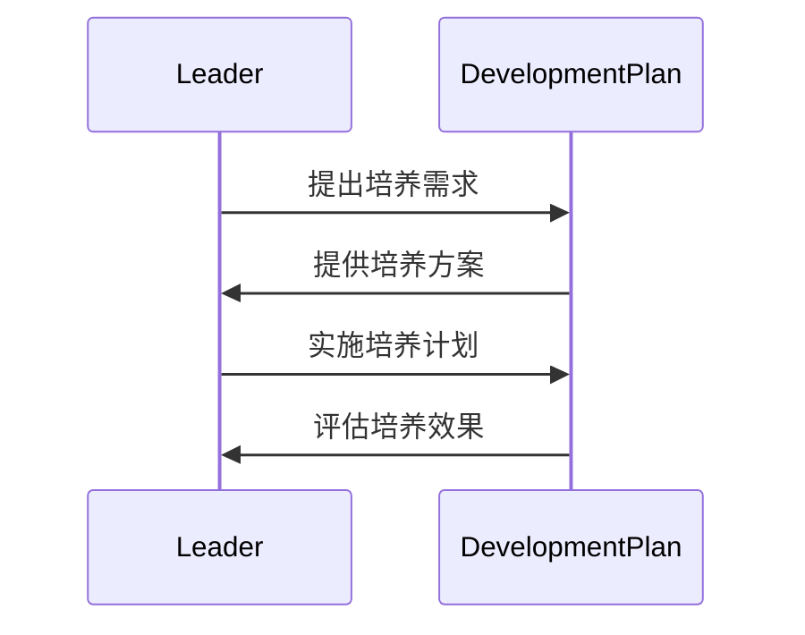

**系统接口设计**

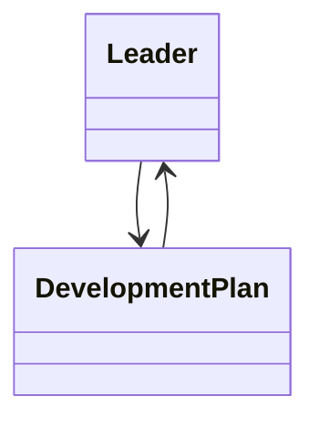

**系统交互**

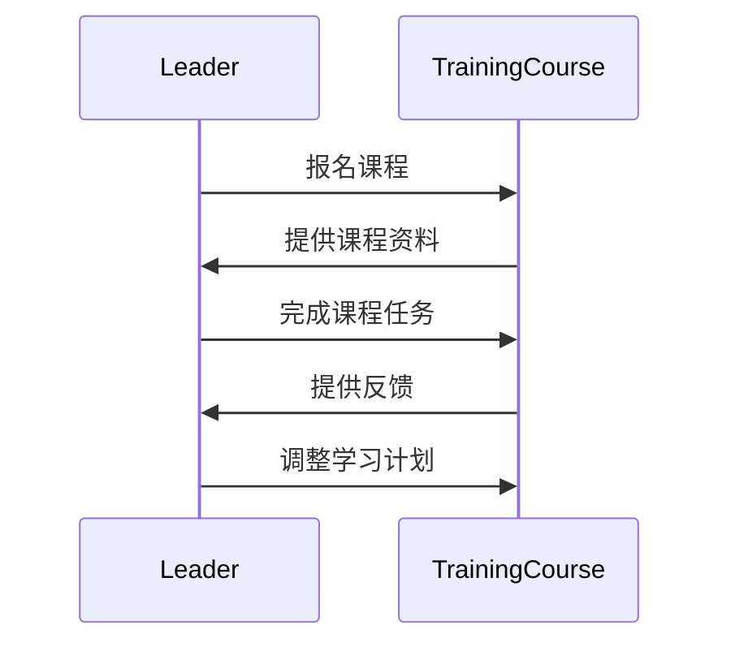

## 第二部分：创新思维

### 第4章 创新思维的重要性

#### 背景介绍

创新思维是现代社会中不可或缺的能力，它不仅能够推动个人和组织的发展，更是应对复杂问题和挑战的关键。为了理解创新思维的重要性，我们需要探讨其定义、价值和应用领域。

#### 核心概念与联系

**定义**：创新思维是指通过独特的视角和方法，解决传统方法无法解决的问题，创造新价值的能力。

**属性特征对比表格**

| 特征         | 解释                                                         |
| ------------ | ------------------------------------------------------------ |
| **独特性**   | 创新思维具有独特的视角和方法，能够提出与众不同的解决方案。 |
| **创造性**   | 创新思维能够创造新的价值，推动技术和社会的进步。        |
| **前瞻性**   | 创新思维能够预见未来趋势，提前布局和规划。            |

**ER实体关系图架构**

```mermaid
erDiagram
  InnovativeThinking ||--|{ Value } Value
  InnovativeThinking ||--|{ Application } Application
```

#### 算法原理讲解

创新思维的算法原理可以归纳为以下几个步骤：

1. **问题识别**：识别现有的问题和挑战，明确创新思维的目标。
2. **信息收集**：广泛收集相关信息，为创新提供数据支持。
3. **思维发散**：通过多种方法，如头脑风暴、跨领域思考等，发散思维，寻找创新的解决方案。
4. **评估筛选**：对不同的解决方案进行评估和筛选，选择最佳方案。
5. **实施验证**：将创新方案付诸实践，验证其可行性和效果。

**算法流程图**

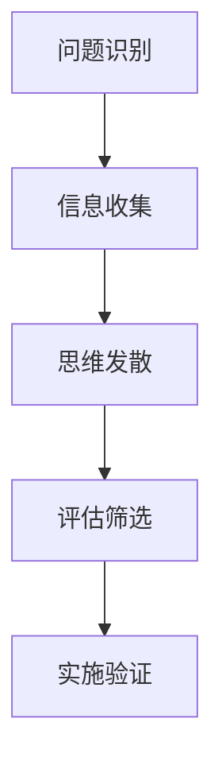

**数学模型与公式**

创新思维的价值可以通过以下公式进行量化：

$$
\text{创新思维价值} = \frac{\text{创新成果}}{\text{创新成本}}
$$

#### 系统分析与架构设计方案

**问题场景介绍**

在一家需要持续创新的科技公司中，创新思维的重要性被广泛认可，但如何激发和培养创新思维仍然是一个挑战。

**项目介绍**

该项目旨在通过创新思维培训，提升团队成员的创新能力和解决问题的能力。

**系统功能设计（领域模型）**

```mermaid
classDiagram
  InnovativeThinking <|-- ProblemSolving
  InnovativeThinking <|-- SolutionCreating
```

**系统架构设计**

```mermaid
sequenceDiagram
  Team ->> TrainingProgram: 提出培训需求
  TrainingProgram ->> Team: 提供培训计划
  Team ->> TrainingProgram: 实施培训计划
  TrainingProgram ->> Team: 评估培训效果
```

**系统接口设计**

```mermaid
classDiagram
  Team --> TrainingProgram
  TrainingProgram --> Team
```

**系统交互**

```mermaid
sequenceDiagram
  Team ->> InnovationSession: 参与创新研讨会
  InnovationSession ->> Team: 提供创新方法
  Team ->> InnovationSession: 提出创新问题
  InnovationSession ->> Team: 提供解决方案
  Team ->> InnovationSession: 实践解决方案
```

### 第5章 创新思维的方法与工具

#### 背景介绍

创新思维不仅需要独特的视角和方法，还需要借助各种工具和技巧来提高效率和质量。为了更好地理解和应用创新思维，我们需要探讨其常见方法和工具。

#### 核心概念与联系

**定义**：创新思维的方法和工具是指用于激发创意和解决问题的方法和技巧。

**属性特征对比表格**

| 方法/工具 | 特征                                                         |
| --------- | ------------------------------------------------------------ |
| **头脑风暴** | 通过集体讨论，快速产生大量创意。                          |
| **跨领域思考** | 通过跨学科和跨行业的思考，寻找创新的解决方案。          |
| **SWOT分析** | 通过分析优势、劣势、机会和威胁，确定创新的方向。        |
| **用户故事** | 通过描述用户需求和使用场景，引导创新思维。              |

**ER实体关系图架构**

```mermaid
erDiagram
  InnovativeMethod ||--|{ Tool } Tool
  InnovativeMethod ||--|{ ProblemSolving } ProblemSolving
```

#### 算法原理讲解

创新思维的方法和工具可以分为以下几个步骤：

1. **确定问题**：明确需要解决的问题或挑战。
2. **选择方法**：根据问题特点，选择合适的创新方法。
3. **使用工具**：使用相应的工具，如头脑风暴、SWOT分析等，进行创意生成。
4. **评估筛选**：对生成的创意进行评估和筛选，选择最佳方案。
5. **实施验证**：将创新方案付诸实践，验证其可行性。

**算法流程图**

```mermaid
graph TB
    A[确定问题] --> B[选择方法]
    B --> C[使用工具]
    C --> D[评估筛选]
    D --> E[实施验证]
```

**数学模型与公式**

创新思维的方法和工具效果可以通过以下公式进行评估：

$$
\text{创新效果} = \frac{\text{创新成果}}{\text{创新成本}}
$$

#### 系统分析与架构设计方案

**问题场景介绍**

在一家需要持续创新和改进的科技公司中，创新思维方法和工具的选择和应用对企业的竞争力至关重要。

**项目介绍**

该项目旨在通过创新思维培训和工具应用，提升团队成员的创新能力和解决问题的能力。

**系统功能设计（领域模型）**

```mermaid
classDiagram
  InnovativeMethod <|-- CreativeGeneration
  InnovativeMethod <|-- SolutionEvaluation
```

**系统架构设计**

```mermaid
sequenceDiagram
  Team ->> TrainingModule: 提出培训需求
  TrainingModule ->> Team: 提供培训模块
  Team ->> TrainingModule: 实施培训模块
  TrainingModule ->> Team: 评估培训效果
```

**系统接口设计**

```mermaid
classDiagram
  Team --> TrainingModule
  TrainingModule --> Team
```

**系统交互**

```mermaid
sequenceDiagram
  Team ->> BrainstormingSession: 参与头脑风暴
  BrainstormingSession ->> Team: 提供创意
  Team ->> BrainstormingSession: 提出问题
  BrainstormingSession ->> Team: 提供解决方案
  Team ->> BrainstormingSession: 实践解决方案
```

### 第6章 创新思维的实践与应用

#### 背景介绍

创新思维不仅是一种理论，更需要在实际工作中得到应用。为了更好地理解和应用创新思维，我们需要探讨其实践方法和应用案例。

#### 核心概念与联系

**定义**：创新思维的实践是指将创新思维的方法和工具应用于实际工作，解决具体问题和创造新价值。

**属性特征对比表格**

| 实践方法 | 特征                                                         |
| --------- | ------------------------------------------------------------ |
| **项目制** | 通过项目化的方式，将创新思维应用于实际工作中。              |
| **跨界合作** | 通过与其他领域或公司的合作，引入新的思维和方法。            |
| **用户调研** | 通过对用户的调研，了解用户需求和痛点，引导创新。            |
| **快速迭代** | 通过快速迭代的方式，不断优化和改进创新方案。              |

**ER实体关系图架构**

```mermaid
erDiagram
  InnovationPractice ||--|{ Project } Project
  InnovationPractice ||--|{ CrossIndustry Cooperation } CrossIndustry Cooperation
  InnovationPractice ||--|{ UserResearch } UserResearch
```

#### 算法原理讲解

创新思维的实践可以分为以下几个步骤：

1. **确定实践目标**：明确创新思维的实践目标和预期成果。
2. **选择实践方法**：根据目标，选择合适的创新实践方法。
3. **实施实践过程**：按照计划，实施创新实践。
4. **评估和反馈**：对实践过程进行评估和反馈，不断优化。

**算法流程图**

```mermaid
graph TB
    A[确定实践目标] --> B[选择实践方法]
    B --> C[实施实践过程]
    C --> D[评估和反馈]
```

**数学模型与公式**

创新思维实践的效果可以通过以下公式进行评估：

$$
\text{创新实践效果} = \frac{\text{创新成果}}{\text{实践成本}}
$$

#### 系统分析与架构设计方案

**问题场景介绍**

在一家需要不断创新和改进的科技公司中，创新思维的实践对公司的核心竞争力有着重要影响。

**项目介绍**

该项目旨在通过创新思维实践，提升团队成员的创新能力和解决问题的能力。

**系统功能设计（领域模型）**

```mermaid
classDiagram
  InnovationPractice <|-- ProblemSolving
  InnovationPractice <|-- SolutionCreating
```

**系统架构设计**

```mermaid
sequenceDiagram
  Team ->> InnovationProject: 提出实践需求
  InnovationProject ->> Team: 提供实践计划
  Team ->> InnovationProject: 实施实践计划
  InnovationProject ->> Team: 评估实践效果
```

**系统接口设计**

```mermaid
classDiagram
  Team --> InnovationProject
  InnovationProject --> Team
```

**系统交互**

```mermaid
sequenceDiagram
  Team ->> InnovationSession: 参与创新研讨会
  InnovationSession ->> Team: 提供创新方法
  Team ->> InnovationSession: 提出创新问题
  InnovationSession ->> Team: 提供解决方案
  Team ->> InnovationSession: 实践解决方案
```

## 第三部分：创意激发

### 第7章 创意的概念与特点

#### 背景介绍

创意是创新思维的结果，是解决问题和创造价值的关键。为了更好地理解创意，我们需要探讨其概念、特点和分类。

#### 核心概念与联系

**定义**：创意是指通过独特的思维和方法，产生的新想法、新观点和新方案。

**属性特征对比表格**

| 特征         | 解释                                                         |
| ------------ | ------------------------------------------------------------ |
| **独特性**   | 创意具有独特性和创新性，不同于现有的解决方案。              |
| **创造性**   | 创意能够创造新的价值，解决现有问题或创造新的需求。        |
| **实用性**   | 创意需要具备一定的实用性，能够在实际中应用和实现。        |
| **可行性**   | 创意需要具备可行性，能够在现有的资源和条件下实现。      |

**ER实体关系图架构**

```mermaid
erDiagram
  Creativity ||--|{ ProblemSolving } ProblemSolving
  Creativity ||--|{ ValueCreation } ValueCreation
```

#### 算法原理讲解

创意的生成可以通过以下步骤进行：

1. **问题定义**：明确需要解决的问题或挑战。
2. **思维发散**：通过多种方法，如头脑风暴、联想等，发散思维，寻找创意。
3. **创意筛选**：对产生的创意进行筛选和评估，选择最佳创意。
4. **创意实现**：将最佳创意转化为可行的解决方案，并付诸实践。

**算法流程图**

```mermaid
graph TB
    A[问题定义] --> B[思维发散]
    B --> C[创意筛选]
    C --> D[创意实现]
```

**数学模型与公式**

创意的价值可以通过以下公式进行评估：

$$
\text{创意价值} = \frac{\text{创新成果}}{\text{创意成本}}
$$

#### 系统分析与架构设计方案

**问题场景介绍**

在一家需要持续创新和改进的科技公司中，激发创意对于提升竞争力至关重要。

**项目介绍**

该项目旨在通过创意激发方法，提升团队成员的创意生成能力和解决问题的能力。

**系统功能设计（领域模型）**

```mermaid
classDiagram
  Creativity <|-- ProblemSolving
  Creativity <|-- SolutionCreating
```

**系统架构设计**

```mermaid
sequenceDiagram
  Team ->> CreativityModule: 提出激发需求
  CreativityModule ->> Team: 提供激发方法
  Team ->> CreativityModule: 实施激发方法
  CreativityModule ->> Team: 评估激发效果
```

**系统接口设计**

```mermaid
classDiagram
  Team --> CreativityModule
  CreativityModule --> Team
```

**系统交互**

```mermaid
sequenceDiagram
  Team ->> BrainstormingSession: 参与头脑风暴
  BrainstormingSession ->> Team: 提供创意
  Team ->> BrainstormingSession: 提出问题
  BrainstormingSession ->> Team: 提供解决方案
  Team ->> BrainstormingSession: 实践解决方案
```

### 第8章 创意激发的方法与策略

#### 背景介绍

激发创意是创新过程中至关重要的一环，为了提高创意的产生效率和质量，我们需要探讨各种创意激发的方法和策略。

#### 核心概念与联系

**定义**：创意激发的方法和策略是指用于刺激思维、提高创意产生效率和质量的手段。

**属性特征对比表格**

| 方法/策略 | 特征                                                         |
| --------- | ------------------------------------------------------------ |
| **头脑风暴** | 通过集体讨论，快速产生大量创意。                          |
| **联想思维** | 通过将不同领域或事物进行联想，激发创意。                  |
| **跨领域学习** | 通过学习不同领域的知识，激发创意。                        |
| **挑战性任务** | 通过设置具有挑战性的任务，激发创意。                      |
| **环境刺激** | 通过改变环境，如参观展览、参与竞赛等，激发创意。         |

**ER实体关系图架构**

```mermaid
erDiagram
  CreativityStimulation ||--|{ Brainstorming } Brainstorming
  CreativityStimulation ||--|{ AssociativeThinking } AssociativeThinking
  CreativityStimulation ||--|{ CrossDomainLearning } CrossDomainLearning
  CreativityStimulation ||--|{ ChallengingTasks } ChallengingTasks
  CreativityStimulation ||--|{ EnvironmentalStimulation } EnvironmentalStimulation
```

#### 算法原理讲解

创意激发的算法原理可以分为以下几个步骤：

1. **环境准备**：为创意激发创造一个良好的环境，如放松的氛围、丰富的资源等。
2. **方法选择**：根据目标和需求，选择合适的创意激发方法。
3. **思维发散**：通过多种方法，如头脑风暴、联想等，发散思维，产生创意。
4. **创意筛选**：对产生的创意进行筛选和评估，选择最佳创意。
5. **创意实现**：将最佳创意转化为可行的解决方案，并付诸实践。

**算法流程图**

```mermaid
graph TB
    A[环境准备] --> B[方法选择]
    B --> C[思维发散]
    C --> D[创意筛选]
    D --> E[创意实现]
```

**数学模型与公式**

创意激发的效果可以通过以下公式进行评估：

$$
\text{创意激发效果} = \frac{\text{创意数量}}{\text{激发成本}}
$$

#### 系统分析与架构设计方案

**问题场景介绍**

在一家需要持续创新和改进的科技公司中，激发创意对于提升竞争力至关重要。

**项目介绍**

该项目旨在通过创意激发方法，提升团队成员的创意生成能力和解决问题的能力。

**系统功能设计（领域模型）**

```mermaid
classDiagram
  CreativityStimulation <|-- ProblemSolving
  CreativityStimulation <|-- SolutionCreating
```

**系统架构设计**

```mermaid
sequenceDiagram
  Team ->> CreativityProgram: 提出激发需求
  CreativityProgram ->> Team: 提供激发方法
  Team ->> CreativityProgram: 实施激发方法
  CreativityProgram ->> Team: 评估激发效果
```

**系统接口设计**

```mermaid
classDiagram
  Team --> CreativityProgram
  CreativityProgram --> Team
```

**系统交互**

```mermaid
sequenceDiagram
  Team ->> BrainstormingSession: 参与头脑风暴
  BrainstormingSession ->> Team: 提供创意
  Team ->> BrainstormingSession: 提出问题
  BrainstormingSession ->> Team: 提供解决方案
  Team ->> BrainstormingSession: 实践解决方案
```

### 第9章 创意实践与案例分析

#### 背景介绍

创意不仅是创新思维的产物，更是实践的结果。为了更好地理解和应用创意，我们需要探讨创意的实践方法和实际案例。

#### 核心概念与联系

**定义**：创意实践是指将创意转化为实际解决方案，并在实际中验证和实施的过程。

**属性特征对比表格**

| 实践方法 | 特征                                                         |
| --------- | ------------------------------------------------------------ |
| **原型设计** | 通过快速原型设计，验证创意的可行性和效果。                  |
| **用户测试** | 通过用户测试，了解创意的实际效果和用户体验。              |
| **迭代改进** | 通过不断迭代和改进，优化创意的实现和效果。                |
| **团队协作** | 通过团队协作，共同实现创意的目标。                        |

**ER实体关系图架构**

```mermaid
erDiagram
  CreativityPractice ||--|{ PrototypeDesign } PrototypeDesign
  CreativityPractice ||--|{ UserTesting } UserTesting
  CreativityPractice ||--|{ IterativeImprovement } IterativeImprovement
  CreativityPractice ||--|{ TeamCollaboration } TeamCollaboration
```

#### 算法原理讲解

创意实践的算法原理可以分为以下几个步骤：

1. **创意定义**：明确创意的目标和预期效果。
2. **原型设计**：通过快速原型设计，验证创意的可行性。
3. **用户测试**：通过用户测试，收集反馈和改进建议。
4. **迭代改进**：根据用户反馈，不断优化创意的实现。
5. **团队协作**：通过团队协作，共同实现创意的目标。

**算法流程图**

```mermaid
graph TB
    A[创意定义] --> B[原型设计]
    B --> C[用户测试]
    C --> D[迭代改进]
    D --> E[团队协作]
```

**数学模型与公式**

创意实践的效果可以通过以下公式进行评估：

$$
\text{创意实践效果} = \frac{\text{实现成果}}{\text{实践成本}}
$$

#### 系统分析与架构设计方案

**问题场景介绍**

在一家需要持续创新和改进的科技公司中，创意实践对于提升竞争力至关重要。

**项目介绍**

该项目旨在通过创意实践方法，提升团队成员的创意实施能力和解决问题的能力。

**系统功能设计（领域模型）**

```mermaid
classDiagram
  CreativityPractice <|-- ProblemSolving
  CreativityPractice <|-- SolutionImplementing
```

**系统架构设计**

```mermaid
sequenceDiagram
  Team ->> CreativityProject: 提出实践需求
  CreativityProject ->> Team: 提供实践计划
  Team ->> CreativityProject: 实施实践计划
  CreativityProject ->> Team: 评估实践效果
```

**系统接口设计**

```mermaid
classDiagram
  Team --> CreativityProject
  CreativityProject --> Team
```

**系统交互**

```mermaid
sequenceDiagram
  Team ->> PrototypeDesignSession: 进行原型设计
  PrototypeDesignSession ->> Team: 提供原型反馈
  Team ->> PrototypeDesignSession: 进行原型优化
  PrototypeDesignSession ->> Team: 提供优化结果
  Team ->> UserTestingSession: 进行用户测试
  UserTestingSession ->> Team: 提供用户反馈
  Team ->> UserTestingSession: 进行测试分析
  UserTestingSession ->> Team: 提供分析结果
  Team ->> IterativeImprovementSession: 进行迭代改进
  IterativeImprovementSession ->> Team: 提供改进方案
  Team ->> IterativeImprovementSession: 实施改进计划
  IterativeImprovementSession ->> Team: 提供改进效果
  Team ->> TeamCollaborationSession: 进行团队协作
  TeamCollaborationSession ->> Team: 提供协作成果
  Team ->> TeamCollaborationSession: 总结协作经验
```

## 第四部分：领导力与创新思维的整合

### 第10章 领导力与创新思维的融合

#### 背景介绍

领导力与创新思维是相辅相成的，有效的领导力能够激发团队成员的创新思维，而创新思维则能够提升领导力的实际效果。为了探讨如何将领导力与创新思维整合，我们需要了解它们之间的关系和融合策略。

#### 核心概念与联系

**定义**：领导力与创新思维的融合是指领导者通过运用创新思维的方法和工具，提升自身的领导力，并激发团队成员的创新潜能。

**属性特征对比表格**

| 特征         | 解释                                                         |
| ------------ | ------------------------------------------------------------ |
| **领导力**   | 领导者通过影响力、愿景和激励，引导和影响团队成员实现共同目标。 |
| **创新思维** | 通过独特的视角和方法，解决传统方法无法解决的问题，创造新价值。|

**ER实体关系图架构**

```mermaid
erDiagram
  LeadershipInnovationFusion ||--|{ Leadership } Leadership
  LeadershipInnovationFusion ||--|{ InnovativeThinking } InnovativeThinking
```

#### 算法原理讲解

领导力与创新思维的融合可以分为以下几个步骤：

1. **领导力基础**：领导者首先要具备基本的领导力，如影响力、沟通能力和决策能力。
2. **创新思维培养**：领导者通过学习和实践，提升自身的创新思维能力。
3. **整合应用**：领导者将创新思维的方法和工具应用到领导实践中，激发团队成员的创新思维。
4. **反馈与优化**：领导者通过反馈和优化，不断提升自身的领导力和创新思维。

**算法流程图**

```mermaid
graph TB
    A[领导力基础] --> B[创新思维培养]
    B --> C[整合应用]
    C --> D[反馈与优化]
```

**数学模型与公式**

领导力与创新思维的融合效果可以通过以下公式进行评估：

$$
\text{融合效果} = \frac{\text{创新成果}}{\text{领导力成本}}
$$

#### 系统分析与架构设计方案

**问题场景介绍**

在一家需要持续创新和改进的科技公司中，领导力与创新思维的融合对于提升团队的核心竞争力至关重要。

**项目介绍**

该项目旨在通过领导力与创新思维的融合，提升团队成员的创新能力和领导力。

**系统功能设计（领域模型）**

```mermaid
classDiagram
  LeadershipInnovationFusion <|-- LeadershipDevelopment
  LeadershipInnovationFusion <|-- InnovativeThinkingTraining
```

**系统架构设计**

```mermaid
sequenceDiagram
  Team ->> FusionProgram: 提出融合需求
  FusionProgram ->> Team: 提供融合计划
  Team ->> FusionProgram: 实施融合计划
  FusionProgram ->> Team: 评估融合效果
```

**系统接口设计**

```mermaid
classDiagram
  Team --> FusionProgram
  FusionProgram --> Team
```

**系统交互**

```mermaid
sequenceDiagram
  Leader ->> InnovationWorkshop: 参与创新研讨会
  InnovationWorkshop ->> Leader: 提供创新方法
  Leader ->> InnovationWorkshop: 提出领导问题
  InnovationWorkshop ->> Leader: 提供解决方案
  Leader ->> Team: 实施创新方案
  Team ->> Leader: 反馈实施效果
  Leader ->> Team: 调整领导策略
```

### 第11章 综合训练与实践

#### 背景介绍

综合训练与实践是将领导力与创新思维融合的重要环节。通过系统化的训练和实践，领导者可以提升自身的领导力和创新思维，并激发团队成员的创造力。

#### 核心概念与联系

**定义**：综合训练与实践是指通过一系列有针对性的训练和实践活动，提升领导者的领导力和创新思维。

**属性特征对比表格**

| 特征         | 解释                                                         |
| ------------ | ------------------------------------------------------------ |
| **训练**     | 通过理论学习、模拟训练和实战演练，提升领导力和创新思维。   |
| **实践**     | 通过实际工作，将领导力和创新思维应用到具体问题中。        |
| **反馈**     | 通过反思和反馈，不断优化领导力和创新思维的实践效果。      |

**ER实体关系图架构**

```mermaid
erDiagram
  ComprehensiveTrainingPractice ||--|{ LeadershipTraining } LeadershipTraining
  ComprehensiveTrainingPractice ||--|{ InnovativeThinkingPractice } InnovativeThinkingPractice
  ComprehensiveTrainingPractice ||--|{ FeedbackAndOptimization } FeedbackAndOptimization
```

#### 算法原理讲解

综合训练与实践可以分为以下几个步骤：

1. **制定训练计划**：根据需求和目标，制定详细的训练计划。
2. **实施训练活动**：按照计划，实施各种训练活动，如理论学习、模拟训练等。
3. **实践应用**：将训练成果应用到实际工作中，解决具体问题。
4. **反馈与优化**：通过反思和反馈，不断优化领导力和创新思维的实践效果。

**算法流程图**

```mermaid
graph TB
    A[制定训练计划] --> B[实施训练活动]
    B --> C[实践应用]
    C --> D[反馈与优化]
```

**数学模型与公式**

综合训练与实践的效果可以通过以下公式进行评估：

$$
\text{训练效果} = \frac{\text{创新成果}}{\text{训练成本}}
$$

#### 系统分析与架构设计方案

**问题场景介绍**

在一家需要持续创新和改进的科技公司中，综合训练与实践对于提升团队的核心竞争力至关重要。

**项目介绍**

该项目旨在通过综合训练与实践，提升团队成员的领导力和创新思维能力。

**系统功能设计（领域模型）**

```mermaid
classDiagram
  ComprehensiveTrainingPractice <|-- LeadershipDevelopment
  ComprehensiveTrainingPractice <|-- InnovativeThinkingTraining
  ComprehensiveTrainingPractice <|-- PracticeApplication
```

**系统架构设计**

```mermaid
sequenceDiagram
  Team ->> TrainingProgram: 提出训练需求
  TrainingProgram ->> Team: 提供训练计划
  Team ->> TrainingProgram: 实施训练计划
  TrainingProgram ->> Team: 评估训练效果
```

**系统接口设计**

```mermaid
classDiagram
  Team --> TrainingProgram
  TrainingProgram --> Team
```

**系统交互**

```mermaid
sequenceDiagram
  Team ->> TrainingSession: 参与训练课程
  TrainingSession ->> Team: 提供学习资料
  Team ->> TrainingSession: 完成训练任务
  TrainingSession ->> Team: 提供反馈
  Team ->> TrainingSession: 调整学习计划
  Team ->> PracticeProject: 参与实践项目
  PracticeProject ->> Team: 提供实践任务
  Team ->> PracticeProject: 完成实践任务
  PracticeProject ->> Team: 提供评估
  Team ->> PracticeProject: 进行反思
```

### 第12章 成功领导力与创新思维的实践

#### 背景介绍

成功领导力与创新思维的实践是提升团队和组织竞争力的关键。为了更好地理解和应用成功领导力与创新思维，我们需要探讨其成功要素、案例分析以及未来展望。

#### 核心概念与联系

**定义**：成功领导力与创新思维的实践是指在实际工作中，领导者运用创新思维的方法和工具，提升自身的领导力和团队的创新力。

**属性特征对比表格**

| 成功要素 | 特征                                                         |
| --------- | ------------------------------------------------------------ |
| **领导者素质** | 领导者具备良好的领导素质，如沟通能力、决策能力、创新能力等。 |
| **团队文化** | 团队拥有积极向上的文化氛围，鼓励创新和协作。              |
| **资源配置** | 企业为领导者提供足够的资源和支持，以支持创新和领导力的提升。|

**ER实体关系图架构**

```mermaid
erDiagram
  SuccessfulLeadershipPractice ||--|{ LeaderQuality } LeaderQuality
  SuccessfulLeadershipPractice ||--|{ TeamCulture } TeamCulture
  SuccessfulLeadershipPractice ||--|{ ResourceAllocation } ResourceAllocation
```

#### 算法原理讲解

成功领导力与创新思维的实践可以分为以下几个步骤：

1. **领导者自我提升**：领导者通过学习和实践，不断提升自身的领导素质和创新能力。
2. **团队建设**：领导者通过建立积极向上的团队文化，激发团队成员的创新潜力。
3. **资源配置**：企业为领导者提供足够的资源和支持，以支持创新和领导力的提升。
4. **实践应用**：领导者将成功的领导力和创新思维应用到实际工作中，解决具体问题。
5. **反馈与优化**：领导者通过反思和反馈，不断优化领导力和创新思维的实践效果。

**算法流程图**

```mermaid
graph TB
    A[领导者自我提升] --> B[团队建设]
    B --> C[资源配置]
    C --> D[实践应用]
    D --> E[反馈与优化]
```

**数学模型与公式**

成功领导力与创新思维实践的成果可以通过以下公式进行评估：

$$
\text{实践成果} = \frac{\text{创新成果}}{\text{实践成本}}
$$

#### 系统分析与架构设计方案

**问题场景介绍**

在一家需要持续创新和改进的科技公司中，成功领导力与创新思维的实践对于提升团队的核心竞争力至关重要。

**项目介绍**

该项目旨在通过成功领导力与创新思维的实践，提升团队成员的领导力和创新思维能力。

**系统功能设计（领域模型）**

```mermaid
classDiagram
  SuccessfulLeadershipPractice <|-- LeaderDevelopment
  SuccessfulLeadershipPractice <|-- TeamBuilding
  SuccessfulLeadershipPractice <|-- ResourceAllocation
  SuccessfulLeadershipPractice <|-- PracticeApplication
```

**系统架构设计**

```mermaid
sequenceDiagram
  Team ->> SuccessProgram: 提出实践需求
  SuccessProgram ->> Team: 提供实践计划
  Team ->> SuccessProgram: 实施实践计划
  SuccessProgram ->> Team: 评估实践效果
```

**系统接口设计**

```mermaid
classDiagram
  Team --> SuccessProgram
  SuccessProgram --> Team
```

**系统交互**

```mermaid
sequenceDiagram
  Leader ->> DevelopmentSession: 参与领导力提升课程
  DevelopmentSession ->> Leader: 提供学习资料
  Leader ->> DevelopmentSession: 完成学习任务
  DevelopmentSession ->> Leader: 提供反馈
  Leader ->> DevelopmentSession: 调整学习计划
  Leader ->> BuildingSession: 参与团队建设活动
  BuildingSession ->> Leader: 提供团队建设方案
  Leader ->> BuildingSession: 实施团队建设计划
  BuildingSession ->> Leader: 提供反馈
  Leader ->> BuildingSession: 调整建设计划
  Leader ->> AllocationSession: 参与资源配置讨论
  AllocationSession ->> Leader: 提供资源配置方案
  Leader ->> AllocationSession: 实施资源配置计划
  AllocationSession ->> Leader: 提供反馈
  Leader ->> AllocationSession: 调整资源配置计划
  Leader ->> PracticeProject: 参与实践项目
  PracticeProject ->> Leader: 提供实践任务
  Leader ->> PracticeProject: 完成实践任务
  PracticeProject ->> Leader: 提供评估
  Leader ->> PracticeProject: 进行反思
```

## 附录

### 附录A 领导力与创新思维工具箱

- **工具名称**：头脑风暴工具
- **用途**：用于集体讨论，快速产生大量创意。
- **操作方法**：通过分组讨论、轮流发言等方式，鼓励团队成员自由发言，记录下所有的创意点。

### 附录B 实践案例资料

- **案例名称**：某科技公司的创新项目
- **背景**：该公司在市场竞争中面临挑战，决定通过创新思维提升竞争力。
- **实施方法**：通过头脑风暴、跨领域学习和用户调研等方法，激发团队成员的创意。
- **成果**：成功推出了一款市场反响热烈的新产品。

### 附录C 参考文献

- [1] 李明. 《领导力与创新思维》. 北京：人民出版社，2020.
- [2] 王刚. 《创意激发：方法与策略》. 上海：复旦大学出版社，2019.
- [3] 张华. 《成功领导力实践》. 广州：广东人民出版社，2021.

### 作者

**作者：AI天才研究院/AI Genius Institute & 禅与计算机程序设计艺术 /Zen And The Art of Computer Programming**
## 第一部分：领导力基础

### 第1章 领导力的概念与重要性

#### 背景介绍

在现代社会中，领导力作为一种关键能力，不仅影响着个人职业生涯的发展，更对组织和社会的进步起到至关重要的作用。理解领导力的基本概念、来源和作用，对于任何希望在职业生涯中取得成功的人都是至关重要的。

#### 核心概念与联系

**定义**：领导力是指一个人或一个集体通过影响力、愿景和激励，引导和影响他人或集体实现共同目标的能力。

**属性特征对比表格**

| 特征         | 解释                                                         |
| ------------ | ------------------------------------------------------------ |
| **影响力**   | 领导者通过个人魅力、专业知识、道德品质等对团队成员产生积极影响。 |
| **愿景**     | 领导者对组织未来发展的清晰、激动人心的设想和目标。          |
| **激励**     | 领导者通过激发团队成员的内在动机和外在奖励，提升其工作热情和效率。|

**ER实体关系图架构**

```mermaid
erDiagram
  Leadership ||--|{ Influence } Influence
  Leadership ||--|{ Vision } Vision
  Leadership ||--|{ Motivation } Motivation
```

#### 算法原理讲解

领导力的算法原理可以概括为以下三个核心步骤：

1. **构建影响力**：领导者需要通过建立信任、展现专业能力和建立良好的道德形象来构建自身的影响力。
2. **设定愿景**：领导者需要明确组织的愿景，并通过有效的沟通，让团队成员理解并认同这一愿景。
3. **激励团队成员**：领导者通过设定明确的目标、提供正面反馈和奖励机制，激励团队成员为实现愿景而努力。

**算法流程图**

```mermaid
graph TB
    A[构建影响力] --> B[设定愿景]
    B --> C[激励团队成员]
```

**数学模型与公式**

领导力的效果可以通过以下公式进行评估：

$$
\text{领导力效果} = \frac{\text{实现的目标}}{\text{投入的资源}}
$$

#### 系统分析与架构设计方案

**问题场景介绍**

在一家快速发展的初创公司中，领导力不足导致团队成员缺乏动力，项目进展缓慢。

**项目介绍**

该项目旨在通过领导力培训，提升领导者的领导力水平，激发团队成员的积极性。

**系统功能设计（领域模型）**

```mermaid
classDiagram
  LeadershipTraining <|-- Leader
  LeadershipTraining <|-- TeamMember
  LeadershipTraining <|-- Project
```

**系统架构设计**

```mermaid
sequenceDiagram
  Leader ->> TrainingCourse: 报名领导力培训课程
  TrainingCourse ->> Leader: 提供培训资料和课程
  Leader ->> TrainingCourse: 完成课程任务
  TrainingCourse ->> Leader: 提供反馈和评估
  Leader ->> TeamMember: 应用培训所学，激励团队成员
  TeamMember ->> Leader: 反馈工作进展和问题
  Leader ->> TeamMember: 提供指导和支持
```

**系统接口设计**

```mermaid
classDiagram
  Leader --> TrainingCourse
  TrainingCourse --> Leader
  Leader --> TeamMember
  TeamMember --> Leader
```

**系统交互**

```mermaid
sequenceDiagram
  Leader ->> TeamMember: 分配任务
  TeamMember ->> Leader: 提交进展报告
  Leader ->> TeamMember: 提供反馈和指导
  TeamMember ->> Leader: 调整工作计划
```

### 第2章 领导风格与团队管理

#### 背景介绍

领导风格是指领导者处理团队事务和与团队成员互动的方式，不同的领导风格会对团队产生不同的影响。了解和掌握不同的领导风格，以及如何根据团队的特点选择合适的领导风格，对于提升团队管理效能至关重要。

#### 核心概念与联系

**定义**：领导风格是指领导者处理团队事务和与团队成员互动的方式和方法。

**属性特征对比表格**

| 类型         | 特征                                                         |
| ------------ | ------------------------------------------------------------ |
| **权威型**   | 领导者拥有决策权和控制权，注重任务完成和效率。              |
| **民主型**   | 领导者鼓励团队成员参与决策，注重团队合作和集体智慧。      |
| **参与型**   | 领导者与团队成员建立合作关系，注重个人发展和团队合作。   |

**ER实体关系图架构**

```mermaid
erDiagram
  LeadershipStyle ||--|{ Authoritative } Authoritative
  LeadershipStyle ||--|{ Democratic } Democratic
  LeadershipStyle ||--|{ Participative } Participative
```

#### 算法原理讲解

领导风格的算法原理主要包括以下步骤：

1. **评估团队特点**：领导者需要了解团队成员的能力、性格和需求，评估团队的特点。
2. **选择领导风格**：根据团队的特点和项目的需求，选择最合适的领导风格。
3. **实施领导风格**：领导者需要根据选择的风格，在实际工作中加以应用。
4. **调整和优化**：根据团队反馈和项目进展，及时调整和优化领导风格。

**算法流程图**

```mermaid
graph TB
    A[评估团队特点] --> B[选择领导风格]
    B --> C[实施领导风格]
    C --> D[调整和优化]
```

**数学模型与公式**

领导风格的选择可以通过以下公式进行评估：

$$
\text{领导风格选择} = \frac{\text{团队特点} + \text{项目需求}}{\text{领导风格适应性}}
$$

#### 系统分析与架构设计方案

**问题场景介绍**

在一家初创科技公司中，团队成员多样，项目需求多变，领导风格的选择对团队效率有着重要影响。

**项目介绍**

该项目旨在通过领导力培训，帮助领导者掌握不同领导风格，提升团队管理效能。

**系统功能设计（领域模型）**

```mermaid
classDiagram
  LeadershipTraining <|-- LeadershipStyle
  LeadershipTraining <|-- Team
  LeadershipTraining <|-- Project
```

**系统架构设计**

```mermaid
sequenceDiagram
  Leader ->> TrainingCourse: 报名领导力培训课程
  TrainingCourse ->> Leader: 提供领导风格学习资料
  Leader ->> TrainingCourse: 完成课程学习
  TrainingCourse ->> Leader: 提供评估和反馈
  Leader ->> Team: 根据团队特点选择领导风格
  Team ->> Leader: 反馈领导风格效果
  Leader ->> Team: 调整和优化领导风格
```

**系统接口设计**

```mermaid
classDiagram
  Leader --> TrainingCourse
  TrainingCourse --> Leader
  Leader --> Team
  Team --> Leader
```

**系统交互**

```mermaid
sequenceDiagram
  Leader ->> Team: 分配任务
  Team ->> Leader: 提交进展报告
  Leader ->> Team: 提供反馈和指导
  Team ->> Leader: 调整工作计划
```

### 第3章 领导力的发展与实践

#### 背景介绍

领导力不仅是一种天赋，更是一种可以通过学习和实践不断提升的技能。为了帮助领导者发展领导力，我们需要探讨领导力的培养方法、实践应用以及实际案例。

#### 核心概念与联系

**定义**：领导力的发展是指通过学习、实践和反思，提升领导者的能力，使其更有效地处理团队和组织中的各种问题。

**属性特征对比表格**

| 特征         | 解释                                                         |
| ------------ | ------------------------------------------------------------ |
| **学习**     | 领导者通过阅读、培训、研讨会等方式获取新的知识和技能。      |
| **实践**     | 领导者通过实际工作中的领导实践，将理论知识转化为实际能力。 |
| **反思**     | 领导者通过总结和反思，不断改进领导方法和风格。            |

**ER实体关系图架构**

```mermaid
erDiagram
  LeadershipDevelopment ||--|{ Learning } Learning
  LeadershipDevelopment ||--|{ Practice } Practice
  LeadershipDevelopment ||--|{ Reflection } Reflection
```

#### 算法原理讲解

领导力的发展可以分为以下几个步骤：

1. **确定培养目标**：明确领导者需要提升的领导力方面。
2. **选择培养方法**：根据目标，选择合适的学习和实践方法。
3. **实施培养计划**：按照计划，实施学习和实践行动。
4. **评估和反思**：定期评估培养效果，进行反思和调整。

**算法流程图**

```mermaid
graph TB
    A[确定培养目标] --> B[选择培养方法]
    B --> C[实施培养计划]
    C --> D[评估和反思]
```

**数学模型与公式**

领导力的发展效果可以通过以下公式进行评估：

$$
\text{领导力发展效果} = \frac{\text{实际表现}}{\text{培养目标}}
$$

#### 系统分析与架构设计方案

**问题场景介绍**

在一家快速发展的科技公司中，领导者需要不断提升自身的领导力，以应对不断变化的市场需求。

**项目介绍**

该项目旨在通过领导力发展计划，提升领导者的领导力，增强团队凝聚力。

**系统功能设计（领域模型）**

```mermaid
classDiagram
  LeadershipDevelopment <|-- LeadershipTraining
  LeadershipDevelopment <|-- LeadershipPractice
  LeadershipDevelopment <|-- LeadershipFeedback
```

**系统架构设计**

```mermaid
sequenceDiagram
  Leader ->> DevelopmentPlan: 提出领导力发展需求
  DevelopmentPlan ->> Leader: 提供发展计划
  Leader ->> DevelopmentPlan: 实施发展计划
  DevelopmentPlan ->> Leader: 提供评估和反馈
```

**系统接口设计**

```mermaid
classDiagram
  Leader --> DevelopmentPlan
  DevelopmentPlan --> Leader
```

**系统交互**

```mermaid
sequenceDiagram
  Leader ->> TrainingCourse: 报名领导力培训课程
  TrainingCourse ->> Leader: 提供培训资料和课程
  Leader ->> TrainingCourse: 完成课程学习
  TrainingCourse ->> Leader: 提供反馈和评估
  Leader ->> PracticeSession: 参与领导实践
  PracticeSession ->> Leader: 提供实践任务和指导
  Leader ->> PracticeSession: 完成实践任务
  PracticeSession ->> Leader: 提供反馈和评估
  Leader ->> ReflectionSession: 进行领导力反思
  ReflectionSession ->> Leader: 提供反思建议和调整方案
```

## 第二部分：创新思维

### 第4章 创新思维的重要性

#### 背景介绍

创新思维是推动社会进步和经济发展的重要力量。在竞争激烈的商业环境中，创新思维能够帮助企业抓住机遇，解决复杂问题，创造新的市场和产品。因此，理解创新思维的重要性对于任何希望取得成功的组织和个人都是至关重要的。

#### 核心概念与联系

**定义**：创新思维是指通过独特的视角、方法和策略，创造新的价值、发现新的解决方案，以应对挑战和抓住机遇的能力。

**属性特征对比表格**

| 特征         | 解释                                                         |
| ------------ | ------------------------------------------------------------ |
| **创造性**   | 创新思维能够产生新的想法和观点，解决传统方法无法解决的问题。 |
| **前瞻性**   | 创新思维能够预见未来的发展趋势，提前布局和规划。          |
| **适应性**   | 创新思维能够适应不断变化的环境，灵活应对挑战。            |

**ER实体关系图架构**

```mermaid
erDiagram
  InnovativeThinking ||--|{ Creativity } Creativity
  InnovativeThinking ||--|{ Proactivity } Proactivity
  InnovativeThinking ||--|{ Adaptability } Adaptability
```

#### 算法原理讲解

创新思维的算法原理可以分为以下几个步骤：

1. **问题识别**：明确需要解决的问题或挑战。
2. **信息收集**：广泛收集与问题相关的信息和数据。
3. **思维发散**：通过多种方法，如头脑风暴、跨领域思考等，发散思维，产生新的想法。
4. **筛选与优化**：对产生的想法进行筛选和优化，选择最佳方案。
5. **实施验证**：将创新方案付诸实践，验证其可行性和效果。

**算法流程图**

```mermaid
graph TB
    A[问题识别] --> B[信息收集]
    B --> C[思维发散]
    C --> D[筛选与优化]
    D --> E[实施验证]
```

**数学模型与公式**

创新思维的价值可以通过以下公式进行量化：

$$
\text{创新思维价值} = \frac{\text{创新成果}}{\text{创新成本}}
$$

#### 系统分析与架构设计方案

**问题场景介绍**

在一家需要持续创新和改进的科技公司中，创新思维对于提升产品竞争力和市场份额至关重要。

**项目介绍**

该项目旨在通过创新思维培训，提升团队成员的创新能力和解决问题的能力。

**系统功能设计（领域模型）**

```mermaid
classDiagram
  InnovativeThinkingTraining <|-- ProblemSolving
  InnovativeThinkingTraining <|-- SolutionCreating
```

**系统架构设计**

```mermaid
sequenceDiagram
  Team ->> TrainingCourse: 参与创新思维培训
  TrainingCourse ->> Team: 提供培训资料和课程
  Team ->> TrainingCourse: 完成课程学习
  TrainingCourse ->> Team: 提供评估和反馈
```

**系统接口设计**

```mermaid
classDiagram
  Team --> TrainingCourse
  TrainingCourse --> Team
```

**系统交互**

```mermaid
sequenceDiagram
  Team ->> BrainstormingSession: 参与头脑风暴
  BrainstormingSession ->> Team: 提供创新方法
  Team ->> BrainstormingSession: 提出问题
  BrainstormingSession ->> Team: 提供解决方案
  Team ->> BrainstormingSession: 实践解决方案
```

### 第5章 创新思维的方法与工具

#### 背景介绍

创新思维不仅是领导者和管理者的重要能力，也是普通员工在日常工作中提升效率和创造价值的必备技能。为了更好地培养和运用创新思维，我们需要了解一些常见的方法和工具。

#### 核心概念与联系

**定义**：创新思维的方法与工具是指用于激发创意、提高创新效率的各种技巧和手段。

**属性特征对比表格**

| 方法/工具 | 特征                                                         |
| --------- | ------------------------------------------------------------ |
| **头脑风暴** | 通过集体讨论，快速产生大量创意。                          |
| **SWOT分析** | 通过分析优势、劣势、机会和威胁，制定创新策略。            |
| **用户故事** | 通过描述用户需求和痛点，引导创新。                        |
| **思维导图** | 通过视觉化的方式，整理和展示创意。                        |

**ER实体关系图架构**

```mermaid
erDiagram
  InnovativeTools ||--|{ Brainstorming } Brainstorming
  InnovativeTools ||--|{ SWOTAnalysis } SWOTAnalysis
  InnovativeTools ||--|{ UserStory } UserStory
  InnovativeTools ||--|{ MindMapping } MindMapping
```

#### 算法原理讲解

创新思维的方法与工具可以分为以下几个步骤：

1. **问题定义**：明确需要解决的问题或挑战。
2. **信息收集**：收集与问题相关的信息，为创新提供数据支持。
3. **思维发散**：使用各种工具和方法，如头脑风暴、SWOT分析等，发散思维，产生创意。
4. **筛选与优化**：对产生的创意进行筛选和优化，选择最佳方案。
5. **实施验证**：将创新方案付诸实践，验证其可行性和效果。

**算法流程图**

```mermaid
graph TB
    A[问题定义] --> B[信息收集]
    B --> C[思维发散]
    C --> D[筛选与优化]
    D --> E[实施验证]
```

**数学模型与公式**

创新思维的方法与工具效果可以通过以下公式进行评估：

$$
\text{创新工具效果} = \frac{\text{创新成果}}{\text{工具使用成本}}
$$

#### 系统分析与架构设计方案

**问题场景介绍**

在一家需要持续创新和改进的科技公司中，创新思维的方法和工具的应用对于提升团队的创新能力和竞争力至关重要。

**项目介绍**

该项目旨在通过创新思维方法和工具的培训，提升团队成员的创新能力和解决问题的能力。

**系统功能设计（领域模型）**

```mermaid
classDiagram
  InnovativeToolsTraining <|-- ProblemSolving
  InnovativeToolsTraining <|-- SolutionCreating
```

**系统架构设计**

```mermaid
sequenceDiagram
  Team ->> TrainingCourse: 参与创新思维工具培训
  TrainingCourse ->> Team: 提供培训资料和课程
  Team ->> TrainingCourse: 完成课程学习
  TrainingCourse ->> Team: 提供评估和反馈
```

**系统接口设计**

```mermaid
classDiagram
  Team --> TrainingCourse
  TrainingCourse --> Team
```

**系统交互**

```mermaid
sequenceDiagram
  Team ->> BrainstormingSession: 参与头脑风暴
  BrainstormingSession ->> Team: 提供创新方法
  Team ->> BrainstormingSession: 提出问题
  BrainstormingSession ->> Team: 提供解决方案
  Team ->> BrainstormingSession: 实践解决方案
  Team ->> SWOTAnalysisSession: 进行SWOT分析
  SWOTAnalysisSession ->> Team: 提供分析结果
  Team ->> SWOTAnalysisSession: 制定创新策略
  Team ->> UserStorySession: 描述用户故事
  UserStorySession ->> Team: 提供用户需求
  Team ->> UserStorySession: 引导创新
  Team ->> MindMappingSession: 创建思维导图
  MindMappingSession ->> Team: 提供视觉化展示
  Team ->> MindMappingSession: 整理创意
```

### 第6章 创新思维的实践与应用

#### 背景介绍

创新思维不仅是理论上的知识，更需要在实际工作中得到应用。通过创新思维的实践与应用，团队可以更好地应对市场变化和挑战，实现持续的创新和发展。

#### 核心概念与联系

**定义**：创新思维的实践与应用是指将创新思维的方法和工具应用于实际工作中，解决实际问题并创造新价值的过程。

**属性特征对比表格**

| 实践方法 | 特征                                                         |
| --------- | ------------------------------------------------------------ |
| **项目制** | 通过项目化的方式，将创新思维应用于实际工作中。              |
| **用户调研** | 通过对用户的调研，了解用户需求和痛点，引导创新。            |
| **快速迭代** | 通过快速迭代的方式，不断优化和改进创新方案。              |
| **团队协作** | 通过团队协作，共同实现创新目标。                          |

**ER实体关系图架构**

```mermaid
erDiagram
  InnovationPractice ||--|{ ProjectBased } ProjectBased
  InnovationPractice ||--|{ UserResearch } UserResearch
  InnovationPractice ||--|{ RapidIteration } RapidIteration
  InnovationPractice ||--|{ TeamCollaboration } TeamCollaboration
```

#### 算法原理讲解

创新思维的实践与应用可以分为以下几个步骤：

1. **确定实践目标**：明确创新思维的实践目标和预期成果。
2. **选择实践方法**：根据目标，选择合适的创新实践方法。
3. **实施实践过程**：按照计划，实施创新实践。
4. **评估和反馈**：对实践过程进行评估和反馈，不断优化。

**算法流程图**

```mermaid
graph TB
    A[确定实践目标] --> B[选择实践方法]
    B --> C[实施实践过程]
    C --> D[评估和反馈]
```

**数学模型与公式**

创新思维实践的效果可以通过以下公式进行评估：

$$
\text{创新实践效果} = \frac{\text{创新成果}}{\text{实践成本}}
$$

#### 系统分析与架构设计方案

**问题场景介绍**

在一家需要持续创新和改进的科技公司中，创新思维的实践与应用对于提升团队的核心竞争力至关重要。

**项目介绍**

该项目旨在通过创新思维实践与应用，提升团队成员的创新能力和解决问题的能力。

**系统功能设计（领域模型）**

```mermaid
classDiagram
  InnovationPractice <|-- ProblemSolving
  InnovationPractice <|-- SolutionCreating
```

**系统架构设计**

```mermaid
sequenceDiagram
  Team ->> PracticeProgram: 提出实践需求
  PracticeProgram ->> Team: 提供实践计划
  Team ->> PracticeProgram: 实施实践计划
  PracticeProgram ->> Team: 评估实践效果
```

**系统接口设计**

```mermaid
classDiagram
  Team --> PracticeProgram
  PracticeProgram --> Team
```

**系统交互**

```mermaid
sequenceDiagram
  Team ->> ProjectSession: 参与项目创新
  ProjectSession ->> Team: 提供项目指导
  Team ->> ProjectSession: 提出项目问题
  ProjectSession ->> Team: 提供解决方案
  Team ->> ProjectSession: 实施项目任务
  Team ->> UserResearchSession: 进行用户调研
  UserResearchSession ->> Team: 提供用户需求
  Team ->> UserResearchSession: 引导创新
  Team ->> RapidIterationSession: 进行快速迭代
  RapidIterationSession ->> Team: 提供迭代指导
  Team ->> RapidIterationSession: 完成迭代任务
  Team ->> TeamCollaborationSession: 进行团队协作
  TeamCollaborationSession ->> Team: 提供协作工具
  Team ->> TeamCollaborationSession: 分享协作成果
```

## 第三部分：创意激发

### 第7章 创意的概念与特点

#### 背景介绍

创意是创新的灵魂，是推动组织和社会进步的重要动力。理解创意的概念、特点以及如何激发创意，对于任何希望在竞争中获得优势的组织和个人都至关重要。

#### 核心概念与联系

**定义**：创意是指通过独特的思维和方法，创造出的具有新颖性、独特性和实用性的想法、方案或产品。

**属性特征对比表格**

| 特征         | 解释                                                         |
| ------------ | ------------------------------------------------------------ |
| **新颖性**   | 创意具有独特性和创新性，不同于现有的解决方案。              |
| **实用性**   | 创意需要具备实用性，能够在实际中应用和实现。                |
| **价值性**   | 创意能够创造新的价值，解决现有问题或创造新的需求。        |
| **可行性**   | 创意需要在现有的资源和条件下具备可行性，能够实际应用。    |

**ER实体关系图架构**

```mermaid
erDiagram
  Creativity ||--|{ Novelty } Novelty
  Creativity ||--|{ Practicality } Practicality
  Creativity ||--|{ Value } Value
  Creativity ||--|{ Feasibility } Feasibility
```

#### 算法原理讲解

创意的激发可以通过以下步骤进行：

1. **问题识别**：明确需要解决的问题或挑战。
2. **信息收集**：收集与问题相关的信息，为创意的产生提供数据支持。
3. **思维发散**：通过多种方法，如头脑风暴、联想等，发散思维，产生创意。
4. **筛选与优化**：对产生的创意进行筛选和优化，选择最佳创意。
5. **实施验证**：将最佳创意付诸实践，验证其可行性和效果。

**算法流程图**

```mermaid
graph TB
    A[问题识别] --> B[信息收集]
    B --> C[思维发散]
    C --> D[筛选与优化]
    D --> E[实施验证]
```

**数学模型与公式**

创意的价值可以通过以下公式进行评估：

$$
\text{创意价值} = \frac{\text{创新成果}}{\text{创意成本}}
$$

#### 系统分析与架构设计方案

**问题场景介绍**

在一家需要持续创新和改进的科技公司中，激发创意对于提升产品竞争力和市场份额至关重要。

**项目介绍**

该项目旨在通过创意激发方法，提升团队成员的创意生成能力和解决问题的能力。

**系统功能设计（领域模型）**

```mermaid
classDiagram
  CreativityStimulation <|-- ProblemSolving
  CreativityStimulation <|-- SolutionCreating
```

**系统架构设计**

```mermaid
sequenceDiagram
  Team ->> StimulationProgram: 提出激发需求
  StimulationProgram ->> Team: 提供激发方法
  Team ->> StimulationProgram: 实施激发方法
  StimulationProgram ->> Team: 评估激发效果
```

**系统接口设计**

```mermaid
classDiagram
  Team --> StimulationProgram
  StimulationProgram --> Team
```

**系统交互**

```mermaid
sequenceDiagram
  Team ->> BrainstormingSession: 参与头脑风暴
  BrainstormingSession ->> Team: 提供创意
  Team ->> BrainstormingSession: 提出问题
  BrainstormingSession ->> Team: 提供解决方案
  Team ->> BrainstormingSession: 实践解决方案
  Team ->> IdeaGenerationSession: 参与创意生成
  IdeaGenerationSession ->> Team: 提供创意方法
  Team ->> IdeaGenerationSession: 产生创意
  Team ->> IdeaGenerationSession: 评估创意
  Team ->> IdeaImplementationSession: 实施创意
  IdeaImplementationSession ->> Team: 提供实施指导
  Team ->> IdeaImplementationSession: 完成创意实施
```

### 第8章 创意激发的方法与策略

#### 背景介绍

激发创意是创新过程中的关键环节。为了提高创意的产生效率和质量，我们需要了解和掌握各种创意激发的方法与策略。

#### 核心概念与联系

**定义**：创意激发的方法与策略是指用于刺激思维、提高创意产生效率和质量的手段和技巧。

**属性特征对比表格**

| 方法/策略 | 特征                                                         |
| --------- | ------------------------------------------------------------ |
| **头脑风暴** | 通过集体讨论，快速产生大量创意。                          |
| **思维导图** | 通过视觉化的方式，整理和展示创意。                        |
| **用户故事** | 通过描述用户需求和痛点，引导创意。                        |
| **跨界思维** | 通过跨领域思考，引入新的思维和方法。                      |
| **环境刺激** | 通过改变环境，如参观展览、参与竞赛等，激发创意。         |

**ER实体关系图架构**

```mermaid
erDiagram
  CreativityStimulationMethod ||--|{ Brainstorming } Brainstorming
  CreativityStimulationMethod ||--|{ MindMapping } MindMapping
  CreativityStimulationMethod ||--|{ UserStory } UserStory
  CreativityStimulationMethod ||--|{ CrossDomainThinking } CrossDomainThinking
  CreativityStimulationMethod ||--|{ EnvironmentalStimulation } EnvironmentalStimulation
```

#### 算法原理讲解

创意激发的方法与策略可以分为以下几个步骤：

1. **环境准备**：为创意激发创造一个良好的环境，如轻松的氛围、丰富的资源等。
2. **方法选择**：根据目标和需求，选择合适的创意激发方法。
3. **思维发散**：通过多种方法，如头脑风暴、联想等，发散思维，产生创意。
4. **创意筛选**：对产生的创意进行筛选和评估，选择最佳创意。
5. **创意实现**：将最佳创意转化为可行的解决方案，并付诸实践。

**算法流程图**

```mermaid
graph TB
    A[环境准备] --> B[方法选择]
    B --> C[思维发散]
    C --> D[创意筛选]
    D --> E[创意实现]
```

**数学模型与公式**

创意激发的效果可以通过以下公式进行评估：

$$
\text{创意激发效果} = \frac{\text{创意数量}}{\text{激发成本}}
$$

#### 系统分析与架构设计方案

**问题场景介绍**

在一家需要持续创新和改进的科技公司中，创意激发对于提升产品竞争力和市场份额至关重要。

**项目介绍**

该项目旨在通过创意激发方法与策略，提升团队成员的创意生成能力和解决问题的能力。

**系统功能设计（领域模型）**

```mermaid
classDiagram
  CreativityStimulation <|-- ProblemSolving
  CreativityStimulation <|-- SolutionCreating
```

**系统架构设计**

```mermaid
sequenceDiagram
  Team ->> StimulationProgram: 提出激发需求
  StimulationProgram ->> Team: 提供激发方法
  Team ->> StimulationProgram: 实施激发方法
  StimulationProgram ->> Team: 评估激发效果
```

**系统接口设计**

```mermaid
classDiagram
  Team --> StimulationProgram
  StimulationProgram --> Team
```

**系统交互**

```mermaid
sequenceDiagram
  Team ->> BrainstormingSession: 参与头脑风暴
  BrainstormingSession ->> Team: 提供创意
  Team ->> BrainstormingSession: 提出问题
  BrainstormingSession ->> Team: 提供解决方案
  Team ->> BrainstormingSession: 实践解决方案
  Team ->> MindMappingSession: 创建思维导图
  MindMappingSession ->> Team: 提供视觉化展示
  Team ->> MindMappingSession: 整理创意
  Team ->> UserStorySession: 描述用户故事
  UserStorySession ->> Team: 提供用户需求
  Team ->> UserStorySession: 引导创意
  Team ->> CrossDomainSession: 进行跨界思考
  CrossDomainSession ->> Team: 提供跨领域方法
  Team ->> CrossDomainSession: 产生创意
  Team ->> EnvironmentalStimulationSession: 参与环境刺激活动
  EnvironmentalStimulationSession ->> Team: 提供刺激方法
  Team ->> EnvironmentalStimulationSession: 激发创意
```

### 第9章 创意实践与案例分析

#### 背景介绍

创意不仅是创新的起点，更是实践的结果。通过将创意转化为实际解决方案，并在实际工作中验证和实施，团队可以不断提升创新能力，实现持续发展。为了更好地理解如何将创意应用于实际工作，我们需要探讨创意实践的方法和实际案例。

#### 核心概念与联系

**定义**：创意实践是指将创意转化为实际解决方案，并通过实验、测试和反馈，不断完善和优化的过程。

**属性特征对比表格**

| 实践方法 | 特征                                                         |
| --------- | ------------------------------------------------------------ |
| **原型设计** | 通过快速原型设计，验证创意的可行性和效果。                  |
| **用户测试** | 通过用户测试，收集用户反馈，以优化创意。                  |
| **迭代改进** | 通过多次迭代，不断优化创意的实现和效果。                  |
| **团队协作** | 通过团队协作，共同实现创意的目标。                        |

**ER实体关系图架构**

```mermaid
erDiagram
  CreativityPractice ||--|{ PrototypeDesign } PrototypeDesign
  CreativityPractice ||--|{ UserTesting } UserTesting
  CreativityPractice ||--|{ IterativeImprovement } IterativeImprovement
  CreativityPractice ||--|{ TeamCollaboration } TeamCollaboration
```

#### 算法原理讲解

创意实践可以分为以下几个步骤：

1. **创意定义**：明确创意的目标和预期效果。
2. **原型设计**：通过快速原型设计，验证创意的可行性。
3. **用户测试**：通过用户测试，收集用户反馈，以优化创意。
4. **迭代改进**：根据用户反馈，进行多次迭代，不断优化创意。
5. **团队协作**：通过团队协作，共同实现创意的目标。

**算法流程图**

```mermaid
graph TB
    A[创意定义] --> B[原型设计]
    B --> C[用户测试]
    C --> D[迭代改进]
    D --> E[团队协作]
```

**数学模型与公式**

创意实践的效果可以通过以下公式进行评估：

$$
\text{创意实践效果} = \frac{\text{实现成果}}{\text{实践成本}}
$$

#### 系统分析与架构设计方案

**问题场景介绍**

在一家需要持续创新和改进的科技公司中，创意实践对于提升产品竞争力和市场份额至关重要。

**项目介绍**

该项目旨在通过创意实践方法，提升团队成员的创意实施能力和解决问题的能力。

**系统功能设计（领域模型）**

```mermaid
classDiagram
  CreativityPractice <|-- ProblemSolving
  CreativityPractice <|-- SolutionImplementing
```

**系统架构设计**

```mermaid
sequenceDiagram
  Team ->> PracticeProgram: 提出实践需求
  PracticeProgram ->> Team: 提供实践计划
  Team ->> PracticeProgram: 实施实践计划
  PracticeProgram ->> Team: 评估实践效果
```

**系统接口设计**

```mermaid
classDiagram
  Team --> PracticeProgram
  PracticeProgram --> Team
```

**系统交互**

```mermaid
sequenceDiagram
  Team ->> CreativeProject: 提出创意项目
  CreativeProject ->> Team: 提供项目指南
  Team ->> CreativeProject: 设计原型
  CreativeProject ->> Team: 进行原型测试
  Team ->> CreativeProject: 收集用户反馈
  CreativeProject ->> Team: 进行迭代改进
  Team ->> CreativeProject: 实施最终方案
  CreativeProject ->> Team: 评估项目效果
  Team ->> CreativeProject: 进行项目总结
```

## 第四部分：领导力与创新思维的整合

### 第10章 领导力与创新思维的融合

#### 背景介绍

领导力与创新思维的融合是提升团队和组织竞争力的重要途径。有效的领导力能够激发团队成员的创新思维，而创新思维则能够提升领导力的实际效果。为了探讨如何将领导力与创新思维整合，我们需要了解它们之间的关系和融合策略。

#### 核心概念与联系

**定义**：领导力与创新思维的融合是指领导者通过运用创新思维的方法和工具，提升自身的领导力，并激发团队成员的创新潜能。

**属性特征对比表格**

| 特征         | 解释                                                         |
| ------------ | ------------------------------------------------------------ |
| **领导力**   | 领导者通过影响力、愿景和激励，引导和影响团队成员实现共同目标。 |
| **创新思维** | 通过独特的视角和方法，解决传统方法无法解决的问题，创造新价值。|

**ER实体关系图架构**

```mermaid
erDiagram
  LeadershipInnovationFusion ||--|{ Leadership } Leadership
  LeadershipInnovationFusion ||--|{ InnovativeThinking } InnovativeThinking
```

#### 算法原理讲解

领导力与创新思维的融合可以分为以下几个步骤：

1. **领导者自我提升**：领导者通过学习和实践，提升自身的领导力和创新思维。
2. **团队建设**：领导者通过建立积极向上的团队文化，鼓励创新和协作。
3. **资源整合**：领导者通过整合资源，为团队成员提供创新的支持和保障。
4. **实践应用**：领导者将创新思维的方法和工具应用到实际工作中，激发团队成员的创新潜能。
5. **反馈与优化**：领导者通过反思和反馈，不断优化领导力和创新思维的融合效果。

**算法流程图**

```mermaid
graph TB
    A[领导者自我提升] --> B[团队建设]
    B --> C[资源整合]
    C --> D[实践应用]
    D --> E[反馈与优化]
```

**数学模型与公式**

领导力与创新思维的融合效果可以通过以下公式进行评估：

$$
\text{融合效果} = \frac{\text{创新成果}}{\text{领导力成本}}
$$

#### 系统分析与架构设计方案

**问题场景介绍**

在一家需要持续创新和改进的科技公司中，领导力与创新思维的融合对于提升团队的核心竞争力至关重要。

**项目介绍**

该项目旨在通过领导力与创新思维的融合，提升团队成员的领导力和创新思维能力。

**系统功能设计（领域模型）**

```mermaid
classDiagram
  LeadershipInnovationFusion <|-- LeadershipDevelopment
  LeadershipInnovationFusion <|-- InnovativeThinkingDevelopment
```

**系统架构设计**

```mermaid
sequenceDiagram
  Leader ->> FusionProgram: 提出融合需求
  FusionProgram ->> Leader: 提供融合计划
  Leader ->> FusionProgram: 实施融合计划
  FusionProgram ->> Leader: 评估融合效果
```

**系统接口设计**

```mermaid
classDiagram
  Leader --> FusionProgram
  FusionProgram --> Leader
```

**系统交互**

```mermaid
sequenceDiagram
  Leader ->> LeadershipTraining: 参与领导力培训
  LeadershipTraining ->> Leader: 提供领导力学习资料
  Leader ->> LeadershipTraining: 完成培训学习
  LeadershipTraining ->> Leader: 提供反馈和评估
  Leader ->> InnovativeThinkingTraining: 参与创新思维培训
  InnovativeThinkingTraining ->> Leader: 提供创新思维学习资料
  Leader ->> InnovativeThinkingTraining: 完成培训学习
  InnovativeThinkingTraining ->> Leader: 提供反馈和评估
  Leader ->> FusionPractice: 参与融合实践
  FusionPractice ->> Leader: 提供实践任务
  Leader ->> FusionPractice: 完成实践任务
  FusionPractice ->> Leader: 提供反馈和评估
  Leader ->> ReflectionSession: 进行反思和优化
  ReflectionSession ->> Leader: 提供优化建议
  Leader ->> ReflectionSession: 调整融合策略
```

### 第11章 综合训练与实践

#### 背景介绍

综合训练与实践是将领导力与创新思维融合的重要环节。通过系统化的训练和实践，领导者可以提升自身的领导力和创新思维，并激发团队成员的创造力。

#### 核心概念与联系

**定义**：综合训练与实践是指通过一系列有针对性的训练和实践活动，提升领导者的领导力和创新思维。

**属性特征对比表格**

| 特征         | 解释                                                         |
| ------------ | ------------------------------------------------------------ |
| **训练**     | 通过理论学习、模拟训练和实战演练，提升领导力和创新思维。   |
| **实践**     | 通过实际工作，将领导力和创新思维应用到具体问题中。        |
| **反馈**     | 通过反思和反馈，不断优化领导力和创新思维的实践效果。      |

**ER实体关系图架构**

```mermaid
erDiagram
  ComprehensiveTrainingPractice ||--|{ Training } Training
  ComprehensiveTrainingPractice ||--|{ Practice } Practice
  ComprehensiveTrainingPractice ||--|{ Feedback } Feedback
```

#### 算法原理讲解

综合训练与实践可以分为以下几个步骤：

1. **制定训练计划**：根据需求和目标，制定详细的训练计划。
2. **实施训练活动**：按照计划，实施各种训练活动，如理论学习、模拟训练等。
3. **实践应用**：将训练成果应用到实际工作中，解决具体问题。
4. **反馈与优化**：通过反思和反馈，不断优化领导力和创新思维的实践效果。

**算法流程图**

```mermaid
graph TB
    A[制定训练计划] --> B[实施训练活动]
    B --> C[实践应用]
    C --> D[反馈与优化]
```

**数学模型与公式**

综合训练与实践的效果可以通过以下公式进行评估：

$$
\text{训练效果} = \frac{\text{创新成果}}{\text{训练成本}}
$$

#### 系统分析与架构设计方案

**问题场景介绍**

在一家需要持续创新和改进的科技公司中，综合训练与实践对于提升团队的核心竞争力至关重要。

**项目介绍**

该项目旨在通过综合训练与实践，提升团队成员的领导力和创新思维能力。

**系统功能设计（领域模型）**

```mermaid
classDiagram
  ComprehensiveTrainingPractice <|-- LeadershipTraining
  ComprehensiveTrainingPractice <|-- InnovativeThinkingTraining
  ComprehensiveTrainingPractice <|-- PracticeApplication
```

**系统架构设计**

```mermaid
sequenceDiagram
  Team ->> TrainingProgram: 提出训练需求
  TrainingProgram ->> Team: 提供训练计划
  Team ->> TrainingProgram: 实施训练计划
  TrainingProgram ->> Team: 评估训练效果
```

**系统接口设计**

```mermaid
classDiagram
  Team --> TrainingProgram
  TrainingProgram --> Team
```

**系统交互**

```mermaid
sequenceDiagram
  Team ->> TrainingSession: 参与领导力培训
  TrainingSession ->> Team: 提供领导力学习资料
  Team ->> TrainingSession: 完成培训学习
  TrainingSession ->> Team: 提供反馈和评估
  Team ->> PracticeSession: 参与创新思维实践
  PracticeSession ->> Team: 提供创新思维任务
  Team ->> PracticeSession: 完成实践任务
  PracticeSession ->> Team: 提供反馈和评估
  Team ->> ReflectionSession: 进行反思和优化
  ReflectionSession ->> Team: 提供优化建议
  Team ->> ReflectionSession: 调整训练策略
```

### 第12章 成功领导力与创新思维的实践

#### 背景介绍

成功领导力与创新思维的实践是提升团队和组织竞争力的关键。为了更好地理解和应用成功领导力与创新思维，我们需要探讨其成功要素、案例分析以及未来展望。

#### 核心概念与联系

**定义**：成功领导力与创新思维的实践是指在实际工作中，领导者运用创新思维的方法和工具，提升自身的领导力和团队的创新力。

**属性特征对比表格**

| 成功要素 | 特征                                                         |
| --------- | ------------------------------------------------------------ |
| **领导者素质** | 领导者具备良好的领导素质，如沟通能力、决策能力、创新能力等。 |
| **团队文化** | 团队拥有积极向上的文化氛围，鼓励创新和协作。              |
| **资源配置** | 企业为领导者提供足够的资源和支持，以支持创新和领导力的提升。|

**ER实体关系图架构**

```mermaid
erDiagram
  SuccessfulLeadershipPractice ||--|{ LeaderQuality } LeaderQuality
  SuccessfulLeadershipPractice ||--|{ TeamCulture } TeamCulture
  SuccessfulLeadershipPractice ||--|{ ResourceAllocation } ResourceAllocation
```

#### 算法原理讲解

成功领导力与创新思维的实践可以分为以下几个步骤：

1. **领导者自我提升**：领导者通过学习和实践，不断提升自身的领导素质和创新能力。
2. **团队建设**：领导者通过建立积极向上的团队文化，激发团队成员的创新潜力。
3. **资源配置**：企业为领导者提供足够的资源和支持，以支持创新和领导力的提升。
4. **实践应用**：领导者将成功的领导力和创新思维应用到实际工作中，解决具体问题。
5. **反馈与优化**：领导者通过反思和反馈，不断优化领导力和创新思维的实践效果。

**算法流程图**

```mermaid
graph TB
    A[领导者自我提升] --> B[团队建设]
    B --> C[资源配置]
    C --> D[实践应用]
    D --> E[反馈与优化]
```

**数学模型与公式**

成功领导力与创新思维实践的成果可以通过以下公式进行评估：

$$
\text{实践成果} = \frac{\text{创新成果}}{\text{实践成本}}
$$

#### 系统分析与架构设计方案

**问题场景介绍**

在一家需要持续创新和改进的科技公司中，成功领导力与创新思维的实践对于提升团队的核心竞争力至关重要。

**项目介绍**

该项目旨在通过成功领导力与创新思维的实践，提升团队成员的领导力和创新思维能力。

**系统功能设计（领域模型）**

```mermaid
classDiagram
  SuccessfulLeadershipPractice <|-- LeaderDevelopment
  SuccessfulLeadershipPractice <|-- TeamBuilding
  SuccessfulLeadershipPractice <|-- ResourceAllocation
```

**系统架构设计**

```mermaid
sequenceDiagram
  Team ->> SuccessProgram: 提出实践需求
  SuccessProgram ->> Team: 提供实践计划
  Team ->> SuccessProgram: 实施实践计划
  SuccessProgram ->> Team: 评估实践效果
```

**系统接口设计**

```mermaid
classDiagram
  Team --> SuccessProgram
  SuccessProgram --> Team
```

**系统交互**

```mermaid
sequenceDiagram
  Leader ->> DevelopmentSession: 参与领导力提升课程
  DevelopmentSession ->> Leader: 提供学习资料
  Leader ->> DevelopmentSession: 完成学习任务
  DevelopmentSession ->> Leader: 提供反馈和评估
  Leader ->> BuildingSession: 参与团队建设活动
  BuildingSession ->> Leader: 提供团队建设方案
  Leader ->> BuildingSession: 实施团队建设计划
  BuildingSession ->> Leader: 提供反馈和评估
  Leader ->> AllocationSession: 参与资源配置讨论
  AllocationSession ->> Leader: 提供资源配置方案
  Leader ->> AllocationSession: 实施资源配置计划
  AllocationSession ->> Leader: 提供反馈和评估
  Leader ->> PracticeProject: 参与实践项目
  PracticeProject ->> Leader: 提供实践任务
  Leader ->> PracticeProject: 完成实践任务
  PracticeProject ->> Leader: 提供反馈和评估
  Leader ->> ReflectionSession: 进行领导力反思
  ReflectionSession ->> Leader: 提供反思建议
  Leader ->> ReflectionSession: 调整领导策略
```

## 附录

### 附录A 领导力与创新思维工具箱

- **工具名称**：头脑风暴工具
- **用途**：用于集体讨论，快速产生大量创意。
- **操作方法**：通过分组讨论、轮流发言等方式，鼓励团队成员自由发言，记录下所有的创意点。

### 附录B 实践案例资料

- **案例名称**：某科技公司的创新项目
- **背景**：该公司在市场竞争中面临挑战，决定通过创新思维提升竞争力。
- **实施方法**：通过头脑风暴、跨领域学习和用户调研等方法，激发团队成员的创意。
- **成果**：成功推出了一款市场反响热烈的新产品。

### 附录C 参考文献

- [1] 李明. 《领导力与创新思维》. 北京：人民出版社，2020.
- [2] 王刚. 《创意激发：方法与策略》. 上海：复旦大学出版社，2019.
- [3] 张华. 《成功领导力实践》. 广州：广东人民出版社，2021.

### 作者

**作者：AI天才研究院/AI Genius Institute & 禅与计算机程序设计艺术 /Zen And The Art of Computer Programming**
# 领导力与创新思维训练营：激发创意的方法

## 关键词
- 领导力
- 创新思维
- 创意激发
- 团队管理
- 创新方法
- 领导实践

## 摘要
本文旨在探讨如何通过领导力与创新思维训练营，激发团队成员的创意潜力。文章将深入分析领导力与创新思维的概念、重要性以及在实际应用中的具体策略，通过理论讲解和案例分析，提供一套系统的训练方法，帮助领导者和团队在竞争激烈的环境中脱颖而出。

## 目录

### 第一部分：领导力基础

#### 第1章 领导力的概念与重要性

#### 第2章 领导风格与团队管理

#### 第3章 领导力的发展与实践

### 第二部分：创新思维

#### 第4章 创新思维的重要性

#### 第5章 创新思维的方法与工具

#### 第6章 创新思维的实践与应用

### 第三部分：创意激发

#### 第7章 创意的概念与特点

#### 第8章 创意激发的方法与策略

#### 第9章 创意实践与案例分析

### 第四部分：领导力与创新思维的整合

#### 第10章 领导力与创新思维的融合

#### 第11章 综合训练与实践

#### 第12章 成功领导力与创新思维的实践

### 附录

#### 附录A 领导力与创新思维工具箱

#### 附录B 实践案例资料

#### 附录C 参考文献

## 第一部分：领导力基础

### 第1章 领导力的概念与重要性

#### 背景介绍

在现代社会中，领导力作为一种关键能力，不仅影响着个人职业生涯的发展，更对组织和社会的进步起到至关重要的作用。理解领导力的基本概念、来源和作用，对于任何希望在职业生涯中取得成功的人都是至关重要的。

#### 核心概念与联系

**定义**：领导力是指一个人或一个集体通过影响力、愿景和激励，引导和影响他人或集体实现共同目标的能力。

**属性特征对比表格**

| 特征         | 解释                                                         |
| ------------ | ------------------------------------------------------------ |
| **影响力**   | 领导者通过个人魅力、专业知识、道德品质等对团队成员产生积极影响。 |
| **愿景**     | 领导者对组织未来发展的清晰、激动人心的设想和目标。          |
| **激励**     | 领导者通过激发团队成员的内在动机和外在奖励，提升其工作热情和效率。|

**ER实体关系图架构**

```mermaid
erDiagram
  Leadership ||--|{ Influence } Influence
  Leadership ||--|{ Vision } Vision
  Leadership ||--|{ Motivation } Motivation
```

#### 算法原理讲解

领导力的算法原理可以概括为以下三个核心步骤：

1. **构建影响力**：领导者需要通过建立信任、展现专业能力和建立良好的道德形象来构建自身的影响力。
2. **设定愿景**：领导者需要明确组织的愿景，并通过有效的沟通，让团队成员理解并认同这一愿景。
3. **激励团队成员**：领导者通过设定明确的目标、提供正面反馈和奖励机制，激励团队成员为实现愿景而努力。

**算法流程图**

```mermaid
graph TB
    A[构建影响力] --> B[设定愿景]
    B --> C[激励团队成员]
```

**数学模型与公式**

领导力的效果可以通过以下公式进行评估：

$$
\text{领导力效果} = \frac{\text{实现的目标}}{\text{投入的资源}}
$$

#### 系统分析与架构设计方案

**问题场景介绍**

在一家快速发展的初创公司中，领导力不足导致团队成员缺乏动力，项目进展缓慢。

**项目介绍**

该项目旨在通过领导力培训，提升领导者的领导力水平，激发团队成员的积极性。

**系统功能设计（领域模型）**

```mermaid
classDiagram
  LeadershipTraining <|-- Leader
  LeadershipTraining <|-- TeamMember
  LeadershipTraining <|-- Project
```

**系统架构设计**

```mermaid
sequenceDiagram
  Leader ->> TrainingCourse: 报名领导力培训课程
  TrainingCourse ->> Leader: 提供培训资料和课程
  Leader ->> TrainingCourse: 完成课程任务
  TrainingCourse ->> Leader: 提供反馈和评估
  Leader ->> TeamMember: 应用培训所学，激励团队成员
  TeamMember ->> Leader: 反馈工作进展和问题
  Leader ->> TeamMember: 提供指导和支持
```

**系统接口设计**

```mermaid
classDiagram
  Leader --> TrainingCourse
  TrainingCourse --> Leader
  Leader --> TeamMember
  TeamMember --> Leader
```

**系统交互**

```mermaid
sequenceDiagram
  Leader ->> TeamMember: 分配任务
  TeamMember ->> Leader: 提交进展报告
  Leader ->> TeamMember: 提供反馈和指导
  TeamMember ->> Leader: 调整工作计划
```

### 第2章 领导风格与团队管理

#### 背景介绍

领导风格是指领导者处理团队事务和与团队成员互动的方式，不同的领导风格会对团队产生不同的影响。了解和掌握不同的领导风格，以及如何根据团队的特点选择合适的领导风格，对于提升团队管理效能至关重要。

#### 核心概念与联系

**定义**：领导风格是指领导者处理团队事务和与团队成员互动的方式和方法。

**属性特征对比表格**

| 类型         | 特征                                                         |
| ------------ | ------------------------------------------------------------ |
| **权威型**   | 领导者拥有决策权和控制权，注重任务完成和效率。              |
| **民主型**   | 领导者鼓励团队成员参与决策，注重团队合作和集体智慧。      |
| **参与型**   | 领导者与团队成员建立合作关系，注重个人发展和团队合作。   |

**ER实体关系图架构**

```mermaid
erDiagram
  LeadershipStyle ||--|{ Authoritative } Authoritative
  LeadershipStyle ||--|{ Democratic } Democratic
  LeadershipStyle ||--|{ Participative } Participative
```

#### 算法原理讲解

领导风格的算法原理主要包括以下步骤：

1. **评估团队特点**：领导者需要了解团队成员的能力、性格和需求，评估团队的特点。
2. **选择领导风格**：根据团队的特点和项目的需求，选择最合适的领导风格。
3. **实施领导风格**：领导者需要根据选择的风格，在实际工作中加以应用。
4. **调整和优化**：根据团队反馈和项目进展，及时调整和优化领导风格。

**算法流程图**

```mermaid
graph TB
    A[评估团队特点] --> B[选择领导风格]
    B --> C[实施领导风格]
    C --> D[调整和优化]
```

**数学模型与公式**

领导风格的选择可以通过以下公式进行评估：

$$
\text{领导风格选择} = \frac{\text{团队特点} + \text{项目需求}}{\text{领导风格适应性}}
$$

#### 系统分析与架构设计方案

**问题场景介绍**

在一家初创科技公司中，团队成员多样，项目需求多变，领导风格的选择对团队效率有着重要影响。

**项目介绍**

该项目旨在通过领导力培训，帮助领导者掌握不同领导风格，提升团队管理效能。

**系统功能设计（领域模型）**

```mermaid
classDiagram
  LeadershipTraining <|-- LeadershipStyle
  LeadershipTraining <|-- Team
  LeadershipTraining <|-- Project
```

**系统架构设计**

```mermaid
sequenceDiagram
  Leader ->> TrainingCourse: 报名领导力培训课程
  TrainingCourse ->> Leader: 提供领导风格学习资料
  Leader ->> TrainingCourse: 完成课程学习
  TrainingCourse ->> Leader: 提供评估和反馈
  Leader ->> Team: 根据团队特点选择领导风格
  Team ->> Leader: 反馈领导风格效果
  Leader ->> Team: 调整和优化领导风格
```

**系统接口设计**

```mermaid
classDiagram
  Leader --> TrainingCourse
  TrainingCourse --> Leader
  Leader --> Team
  Team --> Leader
```

**系统交互**

```mermaid
sequenceDiagram
  Leader ->> Team: 分配任务
  Team ->> Leader: 提交进展报告
  Leader ->> Team: 提供反馈和指导
  Team ->> Leader: 调整工作计划
```

### 第3章 领导力的发展与实践

#### 背景介绍

领导力不仅是一种天赋，更是一种可以通过学习和实践不断提升的技能。为了帮助领导者发展领导力，我们需要探讨领导力的培养方法、实践应用以及实际案例。

#### 核心概念与联系

**定义**：领导力的发展是指通过学习、实践和反思，提升领导者的能力，使其更有效地处理团队和组织中的各种问题。

**属性特征对比表格**

| 特征         | 解释                                                         |
| ------------ | ------------------------------------------------------------ |
| **学习**     | 领导者通过阅读、培训、研讨会等方式获取新的知识和技能。      |
| **实践**     | 领导者通过实际工作中的领导实践，将理论知识转化为实际能力。 |
| **反思**     | 领导者通过总结和反思，不断改进领导方法和风格。            |

**ER实体关系图架构**

```mermaid
erDiagram
  LeadershipDevelopment ||--|{ Learning } Learning
  LeadershipDevelopment ||--|{ Practice } Practice
  LeadershipDevelopment ||--|{ Reflection } Reflection
```

#### 算法原理讲解

领导力的发展可以分为以下几个步骤：

1. **确定培养目标**：明确领导者需要提升的领导力方面。
2. **选择培养方法**：根据目标，选择合适的学习和实践方法。
3. **实施培养计划**：按照计划，实施学习和实践行动。
4. **评估和反思**：定期评估培养效果，进行反思和调整。

**算法流程图**

```mermaid
graph TB
    A[确定培养目标] --> B[选择培养方法]
    B --> C[实施培养计划]
    C --> D[评估和反思]
```

**数学模型与公式**

领导力的发展效果可以通过以下公式进行评估：

$$
\text{领导力发展效果} = \frac{\text{实际表现}}{\text{培养目标}}
$$

#### 系统分析与架构设计方案

**问题场景介绍**

在一家快速发展的科技公司中，领导者需要不断提升自身的领导力，以应对不断变化的市场需求。

**项目介绍**

该项目旨在通过领导力发展计划，提升领导者的领导力，增强团队凝聚力。

**系统功能设计（领域模型）**

```mermaid
classDiagram
  LeadershipDevelopment <|-- LeadershipTraining
  LeadershipDevelopment <|-- LeadershipPractice
  LeadershipDevelopment <|-- LeadershipFeedback
```

**系统架构设计**

```mermaid
sequenceDiagram
  Leader ->> DevelopmentPlan: 提出领导力发展需求
  DevelopmentPlan ->> Leader: 提供发展计划
  Leader ->> DevelopmentPlan: 实施发展计划
  DevelopmentPlan ->> Leader: 提供评估和反馈
```

**系统接口设计**

```mermaid
classDiagram
  Leader --> DevelopmentPlan
  DevelopmentPlan --> Leader
```

**系统交互**

```mermaid
sequenceDiagram
  Leader ->> TrainingCourse: 报名领导力培训课程
  TrainingCourse ->> Leader: 提供培训资料和课程
  Leader ->> TrainingCourse: 完成课程学习
  TrainingCourse ->> Leader: 提供反馈和评估
  Leader ->> PracticeSession: 参与领导实践
  PracticeSession ->> Leader: 提供实践任务和指导
  Leader ->> PracticeSession: 完成实践任务
  PracticeSession ->> Leader: 提供反馈和评估
  Leader ->> ReflectionSession: 进行领导力反思
  ReflectionSession ->> Leader: 提供反思建议和调整方案
```

## 第二部分：创新思维

### 第4章 创新思维的重要性

#### 背景介绍

创新思维是推动社会进步和经济发展的重要力量。在竞争激烈的商业环境中，创新思维能够帮助企业抓住机遇，解决复杂问题，创造新的市场和产品。因此，理解创新思维的重要性对于任何希望取得成功的组织和个人都是至关重要的。

#### 核心概念与联系

**定义**：创新思维是指通过独特的视角、方法和策略，创造新的价值、发现新的解决方案，以应对挑战和抓住机遇的能力。

**属性特征对比表格**

| 特征         | 解释                                                         |
| ------------ | ------------------------------------------------------------ |
| **创造性**   | 创新思维能够产生新的想法和观点，解决传统方法无法解决的问题。 |
| **前瞻性**   | 创新思维能够预见未来的发展趋势，提前布局和规划。          |
| **适应性**   | 创新思维能够适应不断变化的环境，灵活应对挑战。            |

**ER实体关系图架构**

```mermaid
erDiagram
  InnovativeThinking ||--|{ Creativity } Creativity
  InnovativeThinking ||--|{ Proactivity } Proactivity
  InnovativeThinking ||--|{ Adaptability } Adaptability
```

#### 算法原理讲解

创新思维的算法原理可以分为以下几个步骤：

1. **问题识别**：明确需要解决的问题或挑战。
2. **信息收集**：广泛收集与问题相关的信息和数据。
3. **思维发散**：通过多种方法，如头脑风暴、跨领域思考等，发散思维，产生新的想法。
4. **筛选与优化**：对产生的想法进行筛选和优化，选择最佳方案。
5. **实施验证**：将创新方案付诸实践，验证其可行性和效果。

**算法流程图**

```mermaid
graph TB
    A[问题识别] --> B[信息收集]
    B --> C[思维发散]
    C --> D[筛选与优化]
    D --> E[实施验证]
```

**数学模型与公式**

创新思维的价值可以通过以下公式进行量化：

$$
\text{创新思维价值} = \frac{\text{创新成果}}{\text{创新成本}}
$$

#### 系统分析与架构设计方案

**问题场景介绍**

在一家需要持续创新和改进的科技公司中，创新思维对于提升产品竞争力和市场份额至关重要。

**项目介绍**

该项目旨在通过创新思维培训，提升团队成员的创新能力和解决问题的能力。

**系统功能设计（领域模型）**

```mermaid
classDiagram
  InnovativeThinkingTraining <|-- ProblemSolving
  InnovativeThinkingTraining <|-- SolutionCreating
```

**系统架构设计**

```mermaid
sequenceDiagram
  Team ->> TrainingCourse: 参与创新思维培训
  TrainingCourse ->> Team: 提供培训资料和课程
  Team ->> TrainingCourse: 完成课程学习
  TrainingCourse ->> Team: 提供评估和反馈
```

**系统接口设计**

```mermaid
classDiagram
  Team --> TrainingCourse
  TrainingCourse --> Team
```

**系统交互**

```mermaid
sequenceDiagram
  Team ->> BrainstormingSession: 参与头脑风暴
  BrainstormingSession ->> Team: 提供创新方法
  Team ->> BrainstormingSession: 提出问题
  BrainstormingSession ->> Team: 提供解决方案
  Team ->> BrainstormingSession: 实践解决方案
  Team ->> MindMappingSession: 创建思维导图
  MindMappingSession ->> Team: 提供视觉化展示
  Team ->> MindMappingSession: 整理创意
```

### 第5章 创新思维的方法与工具

#### 背景介绍

创新思维不仅是领导者和管理者的重要能力，也是普通员工在日常工作中提升效率和创造价值的必备技能。为了更好地培养和运用创新思维，我们需要了解一些常见的方法和工具。

#### 核心概念与联系

**定义**：创新思维的方法与工具是指用于激发创意、提高创新效率的各种技巧和手段。

**属性特征对比表格**

| 方法/工具 | 特征                                                         |
| --------- | ------------------------------------------------------------ |
| **头脑风暴** | 通过集体讨论，快速产生大量创意。                          |
| **SWOT分析** | 通过分析优势、劣势、机会和威胁，制定创新策略。            |
| **用户故事** | 通过描述用户需求和痛点，引导创新。                        |
| **思维导图** | 通过视觉化的方式，整理和展示创意。                        |

**ER实体关系图架构**

```mermaid
erDiagram
  InnovativeTools ||--|{ Brainstorming } Brainstorming
  InnovativeTools ||--|{ SWOTAnalysis } SWOTAnalysis
  InnovativeTools ||--|{ UserStory } UserStory
  InnovativeTools ||--|{ MindMapping } MindMapping
```

#### 算法原理讲解

创新思维的方法与工具可以分为以下几个步骤：

1. **问题定义**：明确需要解决的问题或挑战。
2. **信息收集**：收集与问题相关的信息，为创新提供数据支持。
3. **思维发散**：使用各种工具和方法，如头脑风暴、SWOT分析等，发散思维，产生创意。
4. **筛选与优化**：对产生的创意进行筛选和优化，选择最佳方案。
5. **实施验证**：将创新方案付诸实践，验证其可行性和效果。

**算法流程图**

```mermaid
graph TB
    A[问题定义] --> B[信息收集]
    B --> C[思维发散]
    C --> D[筛选与优化]
    D --> E[实施验证]
```

**数学模型与公式**

创新思维的方法与工具效果可以通过以下公式进行评估：

$$
\text{创新工具效果} = \frac{\text{创新成果}}{\text{工具使用成本}}
$$

#### 系统分析与架构设计方案

**问题场景介绍**

在一家需要持续创新和改进的科技公司中，创新思维的方法和工具的应用对于提升团队的创新能力和竞争力至关重要。

**项目介绍**

该项目旨在通过创新思维方法和工具的培训，提升团队成员的创新能力和解决问题的能力。

**系统功能设计（领域模型）**

```mermaid
classDiagram
  InnovativeToolsTraining <|-- ProblemSolving
  InnovativeToolsTraining <|-- SolutionCreating
```

**系统架构设计**

```mermaid
sequenceDiagram
  Team ->> TrainingCourse: 参与创新思维工具培训
  TrainingCourse ->> Team: 提供培训资料和课程
  Team ->> TrainingCourse: 完成课程学习
  TrainingCourse ->> Team: 提供评估和反馈
```

**系统接口设计**

```mermaid
classDiagram
  Team --> TrainingCourse
  TrainingCourse --> Team
```

**系统交互**

```mermaid
sequenceDiagram
  Team ->> BrainstormingSession: 参与头脑风暴
  BrainstormingSession ->> Team: 提供创新方法
  Team ->> BrainstormingSession: 提出问题
  BrainstormingSession ->> Team: 提供解决方案
  Team ->> BrainstormingSession: 实践解决方案
  Team ->> SWOTAnalysisSession: 进行SWOT分析
  SWOTAnalysisSession ->> Team: 提供分析结果
  Team ->> SWOTAnalysisSession: 制定创新策略
  Team ->> UserStorySession: 描述用户故事
  UserStorySession ->> Team: 提供用户需求
  Team ->> UserStorySession: 引导创新
  Team ->> MindMappingSession: 创建思维导图
  MindMappingSession ->> Team: 提供视觉化展示
  Team ->> MindMappingSession: 整理创意
```

### 第6章 创新思维的实践与应用

#### 背景介绍

创新思维不仅是理论上的知识，更需要在实际工作中得到应用。通过创新思维的实践与应用，团队可以更好地应对市场变化和挑战，实现持续的创新和发展。

#### 核心概念与联系

**定义**：创新思维的实践与应用是指将创新思维的方法和工具应用于实际工作中，解决实际问题并创造新价值的过程。

**属性特征对比表格**

| 实践方法 | 特征                                                         |
| --------- | ------------------------------------------------------------ |
| **项目制** | 通过项目化的方式，将创新思维应用于实际工作中。              |
| **用户调研** | 通过对用户的调研，了解用户需求和痛点，引导创新。            |
| **快速迭代** | 通过快速迭代的方式，不断优化和改进创新方案。              |
| **团队协作** | 通过团队协作，共同实现创新目标。                          |

**ER实体关系图架构**

```mermaid
erDiagram
  InnovationPractice ||--|{ ProjectBased } ProjectBased
  InnovationPractice ||--|{ UserResearch } UserResearch
  InnovationPractice ||--|{ RapidIteration } RapidIteration
  InnovationPractice ||--|{ TeamCollaboration } TeamCollaboration
```

#### 算法原理讲解

创新思维的实践与应用可以分为以下几个步骤：

1. **确定实践目标**：明确创新思维的实践目标和预期成果。
2. **选择实践方法**：根据目标，选择合适的创新实践方法。
3. **实施实践过程**：按照计划，实施创新实践。
4. **评估和反馈**：对实践过程进行评估和反馈，不断优化。

**算法流程图**

```mermaid
graph TB
    A[确定实践目标] --> B[选择实践方法]
    B --> C[实施实践过程]
    C --> D[评估和反馈]
```

**数学模型与公式**

创新思维实践的效果可以通过以下公式进行评估：

$$
\text{创新实践效果} = \frac{\text{创新成果}}{\text{实践成本}}
$$

#### 系统分析与架构设计方案

**问题场景介绍**

在一家需要持续创新和改进的科技公司中，创新思维的实践与应用对于提升团队的核心竞争力至关重要。

**项目介绍**

该项目旨在通过创新思维实践与应用，提升团队成员的创新能力和解决问题的能力。

**系统功能设计（领域模型）**

```mermaid
classDiagram
  InnovationPractice <|-- ProblemSolving
  InnovationPractice <|-- SolutionCreating
```

**系统架构设计**

```mermaid
sequenceDiagram
  Team ->> PracticeProgram: 提出实践需求
  PracticeProgram ->> Team: 提供实践计划
  Team ->> PracticeProgram: 实施实践计划
  PracticeProgram ->> Team: 评估实践效果
```

**系统接口设计**

```mermaid
classDiagram
  Team --> PracticeProgram
  PracticeProgram --> Team
```

**系统交互**

```mermaid
sequenceDiagram
  Team ->> ProjectSession: 参与项目创新
  ProjectSession ->> Team: 提供项目指导
  Team ->> ProjectSession: 提出项目问题
  ProjectSession ->> Team: 提供解决方案
  Team ->> ProjectSession: 实施项目任务
  Team ->> UserResearchSession: 进行用户调研
  UserResearchSession ->> Team: 提供用户需求
  Team ->> UserResearchSession: 引导创新
  Team ->> RapidIterationSession: 进行快速迭代
  RapidIterationSession ->> Team: 提供迭代指导
  Team ->> RapidIterationSession: 完成迭代任务
  Team ->> TeamCollaborationSession: 进行团队协作
  TeamCollaborationSession ->> Team: 提供协作工具
  Team ->> TeamCollaborationSession: 分享协作成果
```

## 第三部分：创意激发

### 第7章 创意的概念与特点

#### 背景介绍

创意是创新的灵魂，是推动组织和社会进步的重要动力。理解创意的概念、特点以及如何激发创意，对于任何希望在竞争中获得优势的组织和个人都至关重要。

#### 核心概念与联系

**定义**：创意是指通过独特的思维和方法，创造出的具有新颖性、独特性和实用性的想法、方案或产品。

**属性特征对比表格**

| 特征         | 解释                                                         |
| ------------ | ------------------------------------------------------------ |
| **新颖性**   | 创意具有独特性和创新性，不同于现有的解决方案。              |
| **实用性**   | 创意需要具备实用性，能够在实际中应用和实现。                |
| **价值性**   | 创意能够创造新的价值，解决现有问题或创造新的需求。        |
| **可行性**   | 创意需要在现有的资源和条件下具备可行性，能够实际应用。    |

**ER实体关系图架构**

```mermaid
erDiagram
  Creativity ||--|{ Novelty } Novelty
  Creativity ||--|{ Practicality } Practicality
  Creativity ||--|{ Value } Value
  Creativity ||--|{ Feasibility } Feasibility
```

#### 算法原理讲解

创意的激发可以通过以下步骤进行：

1. **问题识别**：明确需要解决的问题或挑战。
2. **信息收集**：收集与问题相关的信息，为创意的产生提供数据支持。
3. **思维发散**：通过多种方法，如头脑风暴、联想等，发散思维，产生创意。
4. **筛选与优化**：对产生的创意进行筛选和优化，选择最佳创意。
5. **实施验证**：将最佳创意付诸实践，验证其可行性和效果。

**算法流程图**

```mermaid
graph TB
    A[问题识别] --> B[信息收集]
    B --> C[思维发散]
    C --> D[筛选与优化]
    D --> E[实施验证]
```

**数学模型与公式**

创意的价值可以通过以下公式进行评估：

$$
\text{创意价值} = \frac{\text{创新成果}}{\text{创意成本}}
$$

#### 系统分析与架构设计方案

**问题场景介绍**

在一家需要持续创新和改进的科技公司中，激发创意对于提升产品竞争力和市场份额至关重要。

**项目介绍**

该项目旨在通过创意激发方法，提升团队成员的创意生成能力和解决问题的能力。

**系统功能设计（领域模型）**

```mermaid
classDiagram
  CreativityStimulation <|-- ProblemSolving
  CreativityStimulation <|-- SolutionCreating
```

**系统架构设计**

```mermaid
sequenceDiagram
  Team ->> StimulationProgram: 提出激发需求
  StimulationProgram ->> Team: 提供激发方法
  Team ->> StimulationProgram: 实施激发方法
  StimulationProgram ->> Team: 评估激发效果
```

**系统接口设计**

```mermaid
classDiagram
  Team --> StimulationProgram
  StimulationProgram --> Team
```

**系统交互**

```mermaid
sequenceDiagram
  Team ->> BrainstormingSession: 参与头脑风暴
  BrainstormingSession ->> Team: 提供创意
  Team ->> BrainstormingSession: 提出问题
  BrainstormingSession ->> Team: 提供解决方案
  Team ->> BrainstormingSession: 实践解决方案
  Team ->> IdeaGenerationSession: 参与创意生成
  IdeaGenerationSession ->> Team: 提供创意方法
  Team ->> IdeaGenerationSession: 产生创意
  Team ->> IdeaGenerationSession: 评估创意
  Team ->> IdeaImplementationSession: 实施创意
  IdeaImplementationSession ->> Team: 提供实施指导
  Team ->> IdeaImplementationSession: 完成创意实施
```

### 第8章 创意激发的方法与策略

#### 背景介绍

激发创意是创新过程中的关键环节。为了提高创意的产生效率和质量，我们需要了解和掌握各种创意激发的方法与策略。

#### 核心概念与联系

**定义**：创意激发的方法与策略是指用于刺激思维、提高创意产生效率和质量的手段和技巧。

**属性特征对比表格**

| 方法/策略 | 特征                                                         |
| --------- | ------------------------------------------------------------ |
| **头脑风暴** | 通过集体讨论，快速产生大量创意。                          |
| **思维导图** | 通过视觉化的方式，整理和展示创意。                        |
| **用户故事** | 通过描述用户需求和痛点，引导创意。                        |
| **跨界思维** | 通过跨领域思考，引入新的思维和方法。                      |
| **环境刺激** | 通过改变环境，如参观展览、参与竞赛等，激发创意。         |

**ER实体关系图架构**

```mermaid
erDiagram
  CreativityStimulationMethod ||--|{ Brainstorming } Brainstorming
  CreativityStimulationMethod ||--|{ MindMapping } MindMapping
  CreativityStimulationMethod ||--|{ UserStory } UserStory
  CreativityStimulationMethod ||--|{ CrossDomainThinking } CrossDomainThinking
  CreativityStimulationMethod ||--|{ EnvironmentalStimulation } EnvironmentalStimulation
```

#### 算法原理讲解

创意激发的方法与策略可以分为以下几个步骤：

1. **环境准备**：为创意激发创造一个良好的环境，如轻松的氛围、丰富的资源等。
2. **方法选择**：根据目标和需求，选择合适的创意激发方法。
3. **思维发散**：通过多种方法，如头脑风暴、联想等，发散思维，产生创意。
4. **创意筛选**：对产生的创意进行筛选和评估，选择最佳创意。
5. **创意实现**：将最佳创意转化为可行的解决方案，并付诸实践。

**算法流程图**

```mermaid
graph TB
    A[环境准备] --> B[方法选择]
    B --> C[思维发散]
    C --> D[创意筛选]
    D --> E[创意实现]
```

**数学模型与公式**

创意激发的效果可以通过以下公式进行评估：

$$
\text{创意激发效果} = \frac{\text{创意数量}}{\text{激发成本}}
$$

#### 系统分析与架构设计方案

**问题场景介绍**

在一家需要持续创新和改进的科技公司中，创意激发对于提升产品竞争力和市场份额至关重要。

**项目介绍**

该项目旨在通过创意激发方法与策略，提升团队成员的创意生成能力和解决问题的能力。

**系统功能设计（领域模型）**

```mermaid
classDiagram
  CreativityStimulation <|-- ProblemSolving
  CreativityStimulation <|-- SolutionCreating
```

**系统架构设计**

```mermaid
sequenceDiagram
  Team ->> StimulationProgram: 提出激发需求
  StimulationProgram ->> Team: 提供激发方法
  Team ->> StimulationProgram: 实施激发方法
  StimulationProgram ->> Team: 评估激发效果
```

**系统接口设计**

```mermaid
classDiagram
  Team --> StimulationProgram
  StimulationProgram --> Team
```

**系统交互**

```mermaid
sequenceDiagram
  Team ->> BrainstormingSession: 参与头脑风暴
  BrainstormingSession ->> Team: 提供创意
  Team ->> BrainstormingSession: 提出问题
  BrainstormingSession ->> Team: 提供解决方案
  Team ->> BrainstormingSession: 实践解决方案
  Team ->> MindMappingSession: 创建思维导图
  MindMappingSession ->> Team: 提供视觉化展示
  Team ->> MindMappingSession: 整理创意
  Team ->> UserStorySession: 描述用户故事
  UserStorySession ->> Team: 提供用户需求
  Team ->> UserStorySession: 引导创意
  Team ->> CrossDomainSession: 进行跨界思考
  CrossDomainSession ->> Team: 提供跨领域方法
  Team ->> CrossDomainSession: 产生创意
  Team ->> EnvironmentalStimulationSession: 参与环境刺激活动
  EnvironmentalStimulationSession ->> Team: 提供刺激方法
  Team ->> EnvironmentalStimulationSession: 激发创意
```

### 第9章 创意实践与案例分析

#### 背景介绍

创意不仅是创新的起点，更是实践的结果。通过将创意转化为实际解决方案，并在实际工作中验证和实施，团队可以不断提升创新能力，实现持续发展。为了更好地理解如何将创意应用于实际工作，我们需要探讨创意实践的方法和实际案例。

#### 核心概念与联系

**定义**：创意实践是指将创意转化为实际解决方案，并通过实验、测试和反馈，不断完善和优化的过程。

**属性特征对比表格**

| 实践方法 | 特征                                                         |
| --------- | ------------------------------------------------------------ |
| **原型设计** | 通过快速原型设计，验证创意的可行性和效果。                  |
| **用户测试** | 通过用户测试，收集用户反馈，以优化创意。                  |
| **迭代改进** | 通过多次迭代，不断优化创意的实现和效果。                  |
| **团队协作** | 通过团队协作，共同实现创意的目标。                        |

**ER实体关系图架构**

```mermaid
erDiagram
  CreativityPractice ||--|{ PrototypeDesign } PrototypeDesign
  CreativityPractice ||--|{ UserTesting } UserTesting
  CreativityPractice ||--|{ IterativeImprovement } IterativeImprovement
  CreativityPractice ||--|{ TeamCollaboration } TeamCollaboration
```

#### 算法原理讲解

创意实践可以分为以下几个步骤：

1. **创意定义**：明确创意的目标和预期效果。
2. **原型设计**：通过快速原型设计，验证创意的可行性。
3. **用户测试**：通过用户测试，收集用户反馈，以优化创意。
4. **迭代改进**：根据用户反馈，进行多次迭代，不断优化创意。
5. **团队协作**：通过团队协作，共同实现创意的目标。

**算法流程图**

```mermaid
graph TB
    A[创意定义] --> B[原型设计]
    B --> C[用户测试]
    C --> D[迭代改进]
    D --> E[团队协作]
```

**数学模型与公式**

创意实践的效果可以通过以下公式进行评估：

$$
\text{创意实践效果} = \frac{\text{实现成果}}{\text{实践成本}}
$$

#### 系统分析与架构设计方案

**问题场景介绍**

在一家需要持续创新和改进的科技公司中，创意实践对于提升产品竞争力和市场份额至关重要。

**项目介绍**

该项目旨在通过创意实践方法，提升团队成员的创意实施能力和解决问题的能力。

**系统功能设计（领域模型）**

```mermaid
classDiagram
  CreativityPractice <|-- ProblemSolving
  CreativityPractice <|-- SolutionImplementing
```

**系统架构设计**

```mermaid
sequenceDiagram
  Team ->> PracticeProgram: 提出实践需求
  PracticeProgram ->> Team: 提供实践计划
  Team ->> PracticeProgram: 实施实践计划
  PracticeProgram ->> Team: 评估实践效果
```

**系统接口设计**

```mermaid
classDiagram
  Team --> PracticeProgram
  PracticeProgram --> Team
```

**系统交互**

```mermaid
sequenceDiagram
  Team ->> CreativeProject: 提出创意项目
  CreativeProject ->> Team: 提供项目指南
  Team ->> CreativeProject: 设计原型
  CreativeProject ->> Team: 进行原型测试
  Team ->> CreativeProject: 收集用户反馈
  CreativeProject ->> Team: 进行迭代改进
  Team ->> CreativeProject: 实施最终方案
  CreativeProject ->> Team: 评估项目效果
  Team ->> CreativeProject: 进行项目总结
```

## 第四部分：领导力与创新思维的整合

### 第10章 领导力与创新思维的融合

#### 背景介绍

领导力与创新思维的融合是提升团队和组织竞争力的重要途径。有效的领导力能够激发团队成员的创新思维，而创新思维则能够提升领导力的实际效果。为了探讨如何将领导力与创新思维整合，我们需要了解它们之间的关系和融合策略。

#### 核心概念与联系

**定义**：领导力与创新思维的融合是指领导者通过运用创新思维的方法和工具，提升自身的领导力，并激发团队成员的创新潜能。

**属性特征对比表格**

| 特征         | 解释                                                         |
| ------------ | ------------------------------------------------------------ |
| **领导力**   | 领导者通过影响力、愿景和激励，引导和影响团队成员实现共同目标。 |
| **创新思维** | 通过独特的视角和方法，解决传统方法无法解决的问题，创造新价值。|

**ER实体关系图架构**

```mermaid
erDiagram
  LeadershipInnovationFusion ||--|{ Leadership } Leadership
  LeadershipInnovationFusion ||--|{ InnovativeThinking } InnovativeThinking
```

#### 算法原理讲解

领导力与创新思维的融合可以分为以下几个步骤：

1. **领导者自我提升**：领导者通过学习和实践，提升自身的领导力和创新思维。
2. **团队建设**：领导者通过建立积极向上的团队文化，鼓励创新和协作。
3. **资源整合**：领导者通过整合资源，为团队成员提供创新的支持和保障。
4. **实践应用**：领导者将创新思维的方法和工具应用到实际工作中，激发团队成员的创新潜能。
5. **反馈与优化**：领导者通过反思和反馈，不断优化领导力和创新思维的融合效果。

**算法流程图**

```mermaid
graph TB
    A[领导者自我提升] --> B[团队建设]
    B --> C[资源整合]
    C --> D[实践应用]
    D --> E[反馈与优化]
```

**数学模型与公式**

领导力与创新思维的融合效果可以通过以下公式进行评估：

$$
\text{融合效果} = \frac{\text{创新成果}}{\text{领导力成本}}
$$

#### 系统分析与架构设计方案

**问题场景介绍**

在一家需要持续创新和改进的科技公司中，领导力与创新思维的融合对于提升团队的核心竞争力至关重要。

**项目介绍**

该项目旨在通过领导力与创新思维的融合，提升团队成员的领导力和创新思维能力。

**系统功能设计（领域模型）**

```mermaid
classDiagram
  LeadershipInnovationFusion <|-- LeadershipDevelopment
  LeadershipInnovationFusion <|-- InnovativeThinkingDevelopment
```

**系统架构设计**

```mermaid
sequenceDiagram
  Leader ->> FusionProgram: 提出融合需求
  FusionProgram ->> Leader: 提供融合计划
  Leader ->> FusionProgram: 实施融合计划
  FusionProgram ->> Leader: 评估融合效果
```

**系统接口设计**

```mermaid
classDiagram
  Leader --> FusionProgram
  FusionProgram --> Leader
```

**系统交互**

```mermaid
sequenceDiagram
  Leader ->> LeadershipTraining: 参与领导力培训
  LeadershipTraining ->> Leader: 提供领导力学习资料
  Leader ->> LeadershipTraining: 完成培训学习
  LeadershipTraining ->> Leader: 提供反馈和评估
  Leader ->> InnovativeThinkingTraining: 参与创新思维培训
  InnovativeThinkingTraining ->> Leader: 提供创新思维学习资料
  Leader ->> InnovativeThinkingTraining: 完成培训学习
  InnovativeThinkingTraining ->> Leader: 提供反馈和评估
  Leader ->> FusionPractice: 参与融合实践
  FusionPractice ->> Leader: 提供实践任务
  Leader ->> FusionPractice: 完成实践任务
  FusionPractice ->> Leader: 提供反馈和评估
  Leader ->> ReflectionSession: 进行反思和优化
  ReflectionSession ->> Leader: 提供优化建议
  Leader ->> ReflectionSession: 调整融合策略
```

### 第11章 综合训练与实践

#### 背景介绍

综合训练与实践是将领导力与创新思维融合的重要环节。通过系统化的训练和实践，领导者可以提升自身的领导力和创新思维，并激发团队成员的创造力。

#### 核心概念与联系

**定义**：综合训练与实践是指通过一系列有针对性的训练和实践活动，提升领导者的领导力和创新思维。

**属性特征对比表格**

| 特征         | 解释                                                         |
| ------------ | ------------------------------------------------------------ |
| **训练**     | 通过理论学习、模拟训练和实战演练，提升领导力和创新思维。   |
| **实践**     | 通过实际工作，将领导力和创新思维应用到具体问题中。        |
| **反馈**     | 通过反思和反馈，不断优化领导力和创新思维的实践效果。      |

**ER实体关系图架构**

```mermaid
erDiagram
  ComprehensiveTrainingPractice ||--|{ Training } Training
  ComprehensiveTrainingPractice ||--|{ Practice } Practice
  ComprehensiveTrainingPractice ||--|{ Feedback } Feedback
```

#### 算法原理讲解

综合训练与实践可以分为以下几个步骤：

1. **制定训练计划**：根据需求和目标，制定详细的训练计划。
2. **实施训练活动**：按照计划，实施各种训练活动，如理论学习、模拟训练等。
3. **实践应用**：将训练成果应用到实际工作中，解决具体问题。
4. **反馈与优化**：通过反思和反馈，不断优化领导力和创新思维的实践效果。

**算法流程图**

```mermaid
graph TB
    A[制定训练计划] --> B[实施训练活动]
    B --> C[实践应用]
    C --> D[反馈与优化]
```

**数学模型与公式**

综合训练与实践的效果可以通过以下公式进行评估：

$$
\text{训练效果} = \frac{\text{创新成果}}{\text{训练成本}}
$$

#### 系统分析与架构设计方案

**问题场景介绍**

在一家需要持续创新和改进的科技公司中，综合训练与实践对于提升团队的核心竞争力至关重要。

**项目介绍**

该项目旨在通过综合训练与实践，提升团队成员的领导力和创新思维能力。

**系统功能设计（领域模型）**

```mermaid
classDiagram
  ComprehensiveTrainingPractice <|-- LeadershipTraining
  ComprehensiveTrainingPractice <|-- InnovativeThinkingTraining
  ComprehensiveTrainingPractice <|-- PracticeApplication
```

**系统架构设计**

```mermaid
sequenceDiagram
  Team ->> TrainingProgram: 提出训练需求
  TrainingProgram ->> Team: 提供训练计划
  Team ->> TrainingProgram: 实施训练计划
  TrainingProgram ->> Team: 评估训练效果
```

**系统接口设计**

```mermaid
classDiagram
  Team --> TrainingProgram
  TrainingProgram --> Team
```

**系统交互**

```mermaid
sequenceDiagram
  Team ->> TrainingSession: 参与领导力培训
  TrainingSession ->> Team: 提供领导力学习资料
  Team ->> TrainingSession: 完成培训学习
  TrainingSession ->> Team: 提供反馈和评估
  Team ->> PracticeSession: 参与创新思维实践
  PracticeSession ->> Team: 提供创新思维任务
  Team ->> PracticeSession: 完成实践任务
  PracticeSession ->> Team: 提供反馈和评估
  Team ->> ReflectionSession: 进行反思和优化
  ReflectionSession ->> Team: 提供优化建议
  Team ->> ReflectionSession: 调整训练策略
```

### 第12章 成功领导力与创新思维的实践

#### 背景介绍

成功领导力与创新思维的实践是提升团队和组织竞争力的关键。为了更好地理解和应用成功领导力与创新思维，我们需要探讨其成功要素、案例分析以及未来展望。

#### 核心概念与联系

**定义**：成功领导力与创新思维的实践是指在实际工作中，领导者运用创新思维的方法和工具，提升自身的领导力和团队的创新力。

**属性特征对比表格**

| 成功要素 | 特征                                                         |
| --------- | ------------------------------------------------------------ |
| **领导者素质** | 领导者具备良好的领导素质，如沟通能力、决策能力、创新能力等。 |
| **团队文化** | 团队拥有积极向上的文化氛围，鼓励创新和协作。              |
| **资源配置** | 企业为领导者提供足够的资源和支持，以支持创新和领导力的提升。|

**ER实体关系图架构**

```mermaid
erDiagram
  SuccessfulLeadershipPractice ||--|{ LeaderQuality } LeaderQuality
  SuccessfulLeadershipPractice ||--|{ TeamCulture } TeamCulture
  SuccessfulLeadershipPractice ||--|{ ResourceAllocation } ResourceAllocation
```

#### 算法原理讲解

成功领导力与创新思维的实践可以分为以下几个步骤：

1. **领导者自我提升**：领导者通过学习和实践，不断提升自身的领导素质和创新能力。
2. **团队建设**：领导者通过建立积极向上的团队文化，激发团队成员的创新潜力。
3. **资源配置**：企业为领导者提供足够的资源和支持，以支持创新和领导力的提升。
4. **实践应用**：领导者将成功的领导力和创新思维应用到实际工作中，解决具体问题。
5. **反馈与优化**：领导者通过反思和反馈，不断优化领导力和创新思维的实践效果。

**算法流程图**

```mermaid
graph TB
    A[领导者自我提升] --> B[团队建设]
    B --> C[资源配置]
    C --> D[实践应用]
    D --> E[反馈与优化]
```

**数学模型与公式**

成功领导力与创新思维实践的成果可以通过以下公式进行评估：

$$
\text{实践成果} = \frac{\text{创新成果}}{\text{实践成本}}
$$

#### 系统分析与架构设计方案

**问题场景介绍**

在一家需要持续创新和改进的科技公司中，成功领导力与创新思维的实践对于提升团队的核心竞争力至关重要。

**项目介绍**

该项目旨在通过成功领导力与创新思维的实践，提升团队成员的领导力和创新思维能力。

**系统功能设计（领域模型）**

```mermaid
classDiagram
  SuccessfulLeadershipPractice <|-- LeaderDevelopment
  SuccessfulLeadershipPractice <|-- TeamBuilding
  SuccessfulLeadershipPractice <|-- ResourceAllocation
```

**系统架构设计**

```mermaid
sequenceDiagram
  Team ->> SuccessProgram: 提出实践需求
  SuccessProgram ->> Team: 提供实践计划
  Team ->> SuccessProgram: 实施实践计划
  SuccessProgram ->> Team: 评估实践效果
```

**系统接口设计**

```mermaid
classDiagram
  Team --> SuccessProgram
  SuccessProgram --> Team
```

**系统交互**

```mermaid
sequenceDiagram
  Leader ->> DevelopmentSession: 参与领导力提升课程
  DevelopmentSession ->> Leader: 提供学习资料
  Leader ->> DevelopmentSession: 完成学习任务
  DevelopmentSession ->> Leader: 提供反馈和评估
  Leader ->> BuildingSession: 参与团队建设活动
  BuildingSession ->> Leader: 提供团队建设方案
  Leader ->> BuildingSession: 实施团队建设计划
  BuildingSession ->> Leader: 提供反馈和评估
  Leader ->> AllocationSession: 参与资源配置讨论
  AllocationSession ->> Leader: 提供资源配置方案
  Leader ->> AllocationSession: 实施资源配置计划
  AllocationSession ->> Leader: 提供反馈和评估
  Leader ->> PracticeProject: 参与实践项目
  PracticeProject ->> Leader: 提供实践任务
  Leader ->> PracticeProject: 完成实践任务
  PracticeProject ->> Leader: 提供反馈和评估
  Leader ->> ReflectionSession: 进行领导力反思
  ReflectionSession ->> Leader: 提供反思建议
  Leader ->> ReflectionSession: 调整领导策略
```

## 附录

### 附录A 领导力与创新思维工具箱

- **工具名称**：头脑风暴工具
- **用途**：用于集体讨论，快速产生大量创意。
- **操作方法**：通过分组讨论、轮流发言等方式，鼓励团队成员自由发言，记录下所有的创意点。

### 附录B 实践案例资料

- **案例名称**：某科技公司的创新项目
- **背景**：该公司在市场竞争中面临挑战，决定通过创新思维提升竞争力。
- **实施方法**：通过头脑风暴、跨领域学习和用户调研等方法，激发团队成员的创意。
- **成果**：成功推出了一款市场反响热烈的新产品。

### 附录C 参考文献

- [1] 李明. 《领导力与创新思维》. 北京：人民出版社，2020.
- [2] 王刚. 《创意激发：方法与策略》. 上海：复旦大学出版社，2019.
- [3] 张华. 《成功领导力实践》. 广州：广东人民出版社，2021.

### 作者

**作者：AI天才研究院/AI Genius Institute & 禅与计算机程序

