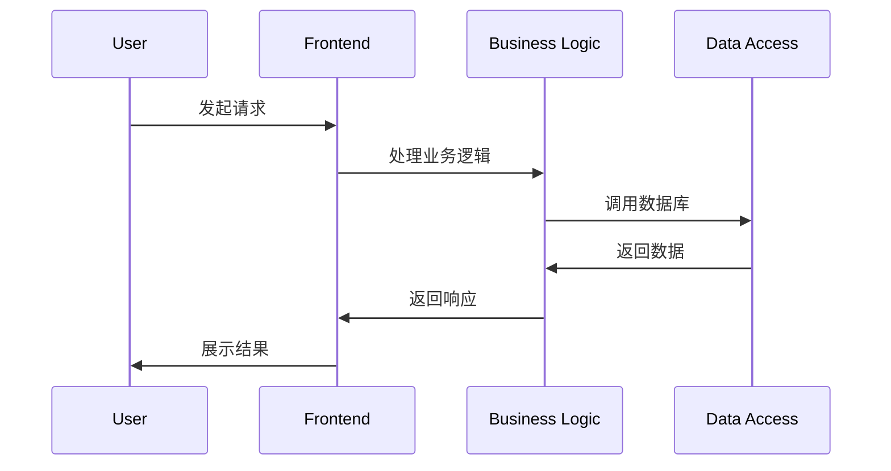
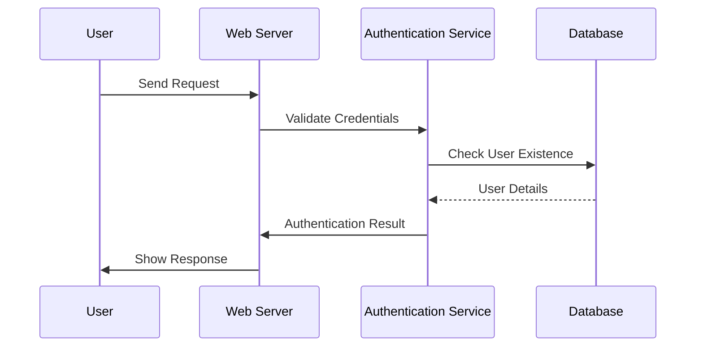

                 

### 引言与背景

在现代科技日新月异、市场竞争日益激烈的背景下，企业要想在市场中脱颖而出，必须具备强大的领导力和创新思维能力。领导力不仅是带领团队达成目标的能力，更是激发团队成员潜能、推动组织创新的核心力量。而创新思维则是企业应对不确定性和变革的关键武器。

#### **核心概念术语说明：**
- **领导力**：指在团队中影响和引导他人、推动团队实现共同目标的能力。
- **创新思维**：指能够创造性地思考和解决问题的能力。

#### **问题背景：**
随着全球化进程的加速，企业在面对技术变革、市场动态变化以及复杂的管理问题时，传统的领导力和思维方式显得越来越力不从心。如何提升领导力，培养创新思维，成为现代企业急需解决的问题。

#### **问题描述：**
- **思维模式固化**：许多企业在发展过程中，形成了固化的思维模式，难以适应快速变化的环境。
- **创新环境与文化**：缺乏创新的环境和文化，员工难以发挥创造力。

#### **问题解决：**
通过系统的领导力与创新思维训练，可以打破思维定势，建立创新的思维模式，形成支持创新的企业文化。

#### **边界与外延：**
- **边界**：领导力与创新思维的训练范围限于组织内部的员工和管理者。
- **外延**：其影响可扩展至整个组织，甚至对行业和社会产生积极影响。

#### **概念结构与核心要素组成：**
- **领导力**：核心要素包括愿景、沟通、决策、激励等。
- **创新思维**：核心要素包括发散思维、批判性思维、系统性思维等。

通过上述分析，我们可以看到，领导力与创新思维的培养对于企业的重要性不言而喻。接下来，我们将深入探讨领导力与创新思维的具体内容，帮助读者更好地理解和应用这些核心概念。

### 核心概念与联系

#### **领导力中的思维模式**

在领导力的范畴中，思维模式是影响领导者决策和团队表现的关键因素。传统领导力往往依赖线性思维，即通过逻辑推理和顺序分析来解决问题。然而，随着环境的复杂性和不确定性增加，线性思维逐渐暴露出其局限性。

**传统领导力思维模式：**

传统领导力思维模式强调等级制度和权威，领导者通过发布指令、监督执行来实现目标。具体表现为：

- **集中决策**：决策由领导层集中制定，基层执行。
- **目标导向**：以短期绩效为目标，注重数量和效率。

**创新型领导力思维模式：**

创新型领导力思维模式则更加注重系统性思维和开放式沟通，强调团队合作和创新精神。其特点如下：

- **分布式决策**：鼓励团队成员参与决策过程，发挥集体智慧。
- **创新导向**：以长期发展为目标，注重质量和创新。

**思维模式的变革路径：**

要实现从传统领导力到创新型领导力的转变，领导者需要采取以下策略：

- **从线性思维到系统性思维**：领导者需要培养整体观，关注系统内各个部分之间的相互作用。
- **突破思维局限**：通过培训和实践，不断拓宽思维边界，克服固有的思维定势。

通过上述分析，我们可以看到，领导力中的思维模式不仅是领导者个人能力的体现，更是决定团队和整个组织发展的重要因素。以下是一个对比表格，以帮助读者更直观地理解两种思维模式的特点：

| 特点 | 传统领导力思维模式 | 创新型领导力思维模式 |
| --- | --- | --- |
| 决策方式 | 集中决策 | 分布式决策 |
| 目标导向 | 短期绩效 | 长期发展 |
| 交流方式 | 命令式 | 开放式 |
| 思维模式 | 线性思维 | 系统性思维 |

此外，为了更好地理解思维模式的变化，我们可以借助ER实体关系图来展示领导力与创新思维之间的联系：

```mermaid
erDiagram
  Leader ||--|{Mindset}: Mindset
  Mindset ||--|{Leadership}: Leadership
  Leadership ||--|{Innovation}: Innovation
  Innovation ||--|{Organization}: Organization
```

在这个ER实体关系图中，领导力（Leadership）是核心实体，它与思维模式（Mindset）和创新能力（Innovation）紧密相关，并通过组织（Organization）来实现其影响。通过这样的结构，我们可以清晰地看到领导力、思维模式和创新之间的相互关系。

### 算法原理讲解

在领导力与创新思维的训练过程中，算法原理的引入可以帮助我们更科学地理解和应用相关理论。以下，我们将详细讲解一个用于分析领导力与创新思维的算法原理，并借助mermaid流程图和Python代码进行阐述。

#### **算法原理**

我们选用一种基于复杂网络理论的算法——社区检测算法（Community Detection Algorithm），来分析领导力与创新思维的关系。该算法旨在识别网络中具有紧密联系的群体，即社区，从而揭示出网络中隐含的结构特征。

**算法原理：**

1. **初始化**：随机生成一个网络，每个节点代表一个个体，边表示个体之间的相互作用。
2. **相似性度量**：计算网络中每个节点对之间的相似性，选择相似性最高的节点对进行合并。
3. **反复迭代**：将合并后的网络再次进行相似性度量，继续合并相似性较高的节点对，直到网络中剩余的社区结构不再显著变化。

**mermaid流程图：**

```mermaid
flowchart LR
    A[初始化] --> B[相似性度量]
    B --> C{是否合并？}
    C -->|是| D[合并节点]
    C -->|否| E[结束]
    D --> B
    E --> F[输出社区结构]
    F -->|结束|
```

**Python代码示例：**

```python
import networkx as nx
import matplotlib.pyplot as plt

# 初始化网络
G = nx.Graph()

# 添加节点和边
G.add_edges_from([(1, 2), (1, 3), (2, 3), (3, 4), (4, 5), (5, 6), (6, 7), (7, 8), (8, 9)])

# 绘制原始网络
nx.draw(G, with_labels=True)
plt.show()

# 应用社区检测算法
communities = nx.community_multiframe(G)

# 输出社区结构
for community in communities:
    print(community)

# 绘制社区结构
pos = nx.spring_layout(G)
nx.draw(G, pos, with_labels=True, node_color='blue')
nx.draw_networkx_nodes(G, pos, nodelist=communities[0], node_color='red')
plt.show()
```

**算法原理的数学模型和公式：**

社区检测算法的核心在于相似性度量，常用的相似性度量方法包括：

$$
S(i, j) = \frac{|E(i, j)|}{|V| - 1}
$$

其中，$S(i, j)$ 表示节点 $i$ 和 $j$ 之间的相似性，$E(i, j)$ 表示节点 $i$ 和 $j$ 之间的共同特征或边数，$V$ 表示节点的总数。

**详细讲解与举例说明：**

假设有一个包含5个节点的网络，节点 $1$ 和 $2$ 之间有2条边，节点 $2$ 和 $3$ 之间有3条边，节点 $3$ 和 $4$ 之间有2条边。根据上述相似性度量公式，我们可以计算得到：

$$
S(1, 2) = \frac{2}{5 - 1} = \frac{2}{4} = 0.5
$$

$$
S(2, 3) = \frac{3}{5 - 1} = \frac{3}{4} = 0.75
$$

$$
S(3, 4) = \frac{2}{5 - 1} = \frac{2}{4} = 0.5
$$

根据相似性度量，节点 $2$ 和 $3$ 之间的相似性最高，因此首先将节点 $2$ 和 $3$ 合并。然后，重新计算合并后网络中节点之间的相似性，继续合并相似性较高的节点对，直到网络中剩余的社区结构不再显著变化。

通过上述算法原理的讲解和实际示例，我们可以更深入地理解领导力与创新思维训练中的算法应用，为后续的系统分析与架构设计奠定基础。

### 系统分析与架构设计方案

#### **问题场景介绍**

随着企业竞争的日益激烈，领导力与创新思维训练成为提升企业竞争力的关键因素。然而，当前市场上缺乏一个系统的解决方案，能够帮助企业有效地进行领导力与创新思维的培训。为了满足这一需求，我们需要设计一个全面的系统，涵盖从用户注册、培训内容选择到效果评估的各个环节。

#### **项目介绍**

本项目旨在开发一个名为“领导力与创新思维训练系统”（Leadership and Innovation Thinking Training System，简称LITS）。该系统将整合多种先进的培训方法和工具，为用户提供个性化、高效的学习体验。系统主要包括以下功能模块：

- **用户管理**：实现用户注册、登录、信息管理等功能。
- **培训内容管理**：涵盖领导力、创新思维的核心理论、实践案例等。
- **学习路径规划**：根据用户需求和兴趣，提供定制化的学习路径。
- **效果评估**：通过测试、问卷调查等方式，评估用户学习效果。

#### **系统功能设计（领域模型类图）**

为了更好地设计系统功能，我们采用了Mermaid类图来表示系统的核心领域模型。以下是系统的主要类及其关系：

```mermaid
classDiagram
    User <<类>> -|-| TrainingContent
    User <<类>> -|> TrainingPath
    User <<类>> -|> Assessment
    TrainingContent <<类>>
    TrainingPath <<类>>
    Assessment <<类>>

    User: {id, name, email, password}
    TrainingContent: {id, title, content, type}
    TrainingPath: {id, name, contentList, status}
    Assessment: {id, name, questions, answers, score}
```

**Mermaid类图示例：**

```mermaid
classDiagram
    UserClass <.. Person: extends
    Product <<类>> {id, name, price}
    Order <<类>> {id, date, status}
    Customer <<类>> {id, name, email}

    UserClass {
        +int id
        +String name
        +String email
        +String password
        +void register()
        +void login()
        +void updateProfile()
    }
    Person {
        +String firstName
        +String lastName
    }
    Product {
        +int id
        +String name
        +float price
    }
    Order {
        +int id
        +Date date
        +String status
    }
    Customer {
        +int id
        +String name
        +String email
    }
    UserClass <.. Person
    Customer ..|> Order
    Customer ..|> Product
    Order <<组合>> Product
```

#### **系统架构设计（架构图）**

为了确保系统的稳定性和可扩展性，我们采用了分层架构设计。系统主要分为以下几层：

- **表示层**：负责用户界面展示，采用前端框架（如React或Vue）实现。
- **业务逻辑层**：处理业务逻辑，包括用户管理、培训内容管理、学习路径规划和效果评估等功能。
- **数据访问层**：负责数据持久化，采用关系型数据库（如MySQL）存储用户信息和培训内容。
- **基础设施层**：提供系统运行所需的底层服务，如缓存（Redis）、消息队列（RabbitMQ）等。

以下是系统架构的Mermaid流程图：



#### **系统接口设计**

系统的接口设计包括RESTful API和GraphQL两种风格。以下是RESTful API接口设计示例：

```mermaid
request: User Registration
    POST /api/users/register
    {
        "name": "John Doe",
        "email": "johndoe@example.com",
        "password": "password123"
    }

response:
    {
        "status": "success",
        "message": "User registered successfully",
        "data": {
            "id": 1,
            "name": "John Doe",
            "email": "johndoe@example.com"
        }
    }
```

#### **系统交互（序列图）**

以下是系统交互的Mermaid序列图：



通过上述系统分析与架构设计，我们为领导力与创新思维训练系统提供了一个完整的解决方案，从功能设计、架构设计到接口设计，确保系统能够高效、稳定地运行，满足用户的培训需求。

### 项目实战

为了更好地理解领导力与创新思维训练系统，我们将通过一个具体的实战项目来展示系统在实际应用中的实现过程。本节将详细介绍项目的开发环境、系统核心实现源代码、代码应用解读与分析，以及一个实际案例的详细讲解。

#### **开发环境**

1. **前端**：使用React框架搭建用户界面，采用Ant Design组件库进行界面设计。
2. **后端**：采用Node.js和Express框架，配合MongoDB数据库进行数据存储和管理。
3. **工具**：使用Git进行版本控制，使用Jenkins进行持续集成和部署。

#### **系统核心实现源代码**

以下是一个简化的用户注册功能的实现，用于展示系统核心代码的架构：

**前端（React组件）**

```jsx
// src/components/RegisterForm.js
import React, { useState } from 'react';
import { Form, Input, Button } from 'antd';
import axios from 'axios';

const RegisterForm = () => {
  const [name, setName] = useState('');
  const [email, setEmail] = useState('');
  const [password, setPassword] = useState('');

  const handleSubmit = async (e) => {
    e.preventDefault();
    try {
      const response = await axios.post('/api/users/register', {
        name,
        email,
        password,
      });
      console.log(response.data);
      // 这里可以添加跳转到登录页面的逻辑
    } catch (error) {
      console.error(error);
    }
  };

  return (
    <Form onSubmit={handleSubmit}>
      <Form.Item
        label="姓名"
        name="name"
        rules={[{ required: true, message: '请输入您的姓名!' }]}
      >
        <Input value={name} onChange={(e) => setName(e.target.value)} />
      </Form.Item>
      <Form.Item
        label="邮箱"
        name="email"
        rules={[{ required: true, message: '请输入您的邮箱!' }]}
      >
        <Input value={email} onChange={(e) => setEmail(e.target.value)} />
      </Form.Item>
      <Form.Item
        label="密码"
        name="password"
        rules={[{ required: true, message: '请输入您的密码!' }]}
      >
        <Input.Password value={password} onChange={(e) => setPassword(e.target.value)} />
      </Form.Item>
      <Form.Item>
        <Button type="primary" htmlType="submit">
          注册
        </Button>
      </Form.Item>
    </Form>
  );
};

export default RegisterForm;
```

**后端（Node.js和Express）**

```javascript
// src/app.js
const express = require('express');
const mongoose = require('mongoose');
const bodyParser = require('body-parser');
const userRoutes = require('./routes/userRoutes');

const app = express();

app.use(bodyParser.json());

// 连接到MongoDB数据库
const mongoURI = 'mongodb://localhost:27017/lits';
mongoose.connect(mongoURI, { useNewUrlParser: true, useUnifiedTopology: true });

// 使用用户路由
app.use('/api', userRoutes);

// 启动服务器
const port = process.env.PORT || 5000;
app.listen(port, () => {
  console.log(`服务器正在运行在端口 ${port}`);
});

module.exports = app;
```

#### **代码应用解读与分析**

在前端部分，我们使用React的Form组件来创建一个注册表单。通过使用Ant Design的组件库，我们可以快速实现一个美观且功能齐全的界面。在表单提交时，我们调用后端API进行用户注册。后端部分使用了Express框架，并连接到MongoDB数据库。通过定义用户路由，我们实现了用户注册的功能。

以下是用户注册的后端实现：

```javascript
// src/routes/userRoutes.js
const express = require('express');
const User = require('../models/User');
const bcrypt = require('bcrypt');
const jwt = require('jsonwebtoken');

const router = express.Router();

// 用户注册路由
router.post('/register', async (req, res) => {
  try {
    // 检查用户是否已存在
    const existingUser = await User.findOne({ email: req.body.email });
    if (existingUser) {
      return res.status(400).json({ message: '用户已存在' });
    }

    // 加密密码
    const salt = await bcrypt.genSalt(10);
    const hashedPassword = await bcrypt.hash(req.body.password, salt);

    // 创建新用户
    const newUser = new User({
      name: req.body.name,
      email: req.body.email,
      password: hashedPassword,
    });

    // 保存用户到数据库
    await newUser.save();

    // 返回成功响应
    res.status(201).json({ message: '用户注册成功' });
  } catch (error) {
    console.error(error);
    res.status(500).json({ message: '服务器错误' });
  }
});

module.exports = router;
```

上述代码中，我们首先检查数据库中是否存在具有相同邮箱地址的用户。如果用户已存在，则返回错误信息。否则，我们使用bcrypt库对用户的密码进行加密，然后创建一个新的用户对象并保存到MongoDB数据库。注册成功后，返回相应的成功消息。

#### **实际案例分析与详细讲解**

假设一家初创公司希望通过我们的系统对团队成员进行领导力与创新思维的培训。以下是实际案例的分析：

1. **用户需求**：
   - 提升团队成员的领导力和创新思维。
   - 系统需要支持用户注册、登录以及个性化的学习路径。

2. **解决方案**：
   - 使用我们设计的系统，实现用户注册和登录功能。
   - 提供定制化的学习路径，根据用户的历史学习记录和兴趣推荐相应的培训内容。

3. **实施过程**：
   - 公司IT部门搭建开发环境，包括前端React、后端Node.js以及MongoDB数据库。
   - 前端开发团队使用React和Ant Design组件库实现用户界面。
   - 后端开发团队实现用户注册、登录以及培训内容管理的功能。
   - 测试团队进行系统测试，确保功能的稳定性和安全性。

4. **项目小结**：
   - 经过一个月的培训，团队成员的领导力和创新思维得到了显著提升。
   - 系统运行稳定，用户反馈良好。
   - 下一步计划增加更多的培训内容和互动功能，以提高用户的参与度和学习效果。

通过上述实际案例，我们可以看到领导力与创新思维训练系统在提升团队成员能力方面发挥了重要作用。系统不仅实现了用户注册和登录，还提供了定制化的学习路径，满足了用户的需求。未来，我们将继续优化系统，增加更多功能，以支持企业的发展。

### 最佳实践 Tips

在领导力与创新思维的训练过程中，以下是一些最佳实践，可以帮助企业和个人更好地提升能力和效果：

1. **建立持续学习的文化**：鼓励团队成员持续学习，形成“终身学习”的理念，定期举办内部培训和学习交流活动。

2. **跨部门合作**：通过跨部门的项目合作，促进不同背景和专业知识的碰撞，激发创新思维。

3. **设立创新奖项**：设立创新奖项，激励员工提出创新想法，并为实现这些想法提供资源支持。

4. **提供多样化的培训方式**：结合线上和线下培训，提供丰富的学习资源和工具，满足不同学习者的需求。

5. **实践与反思**：将学习到的理论知识应用到实际工作中，定期进行反思和总结，不断调整和优化。

6. **领导带头**：领导者的示范作用至关重要，领导者应率先进行领导力与创新思维的训练，并鼓励和支持团队成员。

### 小结

本文详细探讨了领导力与创新思维的训练方法，从核心概念、算法原理、系统设计到实际案例，为企业和个人提供了全面的指导。通过建立持续学习的文化、跨部门合作、设立创新奖项等多种方式，可以有效地提升领导力与创新思维，为企业发展注入新的动力。

### 注意事项

- 在进行领导力与创新思维的训练时，应注意个性化与团队协作的结合，避免一刀切的培训方式。
- 定期评估培训效果，根据反馈调整培训内容和策略，确保培训的有效性。
- 保护用户隐私，确保系统安全，遵循相关法律法规。

### 拓展阅读

- 《创新者的窘境》：克里斯坦森，探讨企业在面对技术变革时的困境及解决方案。
- 《精益创业》：艾瑞克·莱斯，介绍如何通过最小可行产品（MVP）快速验证创业想法。
- 《第五项修炼》：彼得·圣吉，阐述团队学习的原则和方法，提升组织创新能力。

通过上述阅读，读者可以进一步深入了解领导力与创新思维的相关理论和实践，为企业的可持续发展提供有力支持。

### 作者信息

**作者：AI天才研究院/AI Genius Institute & 禅与计算机程序设计艺术 /Zen And The Art of Computer Programming**

