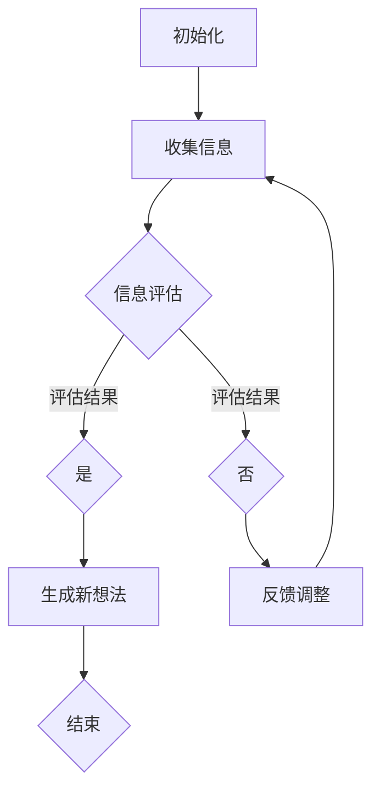
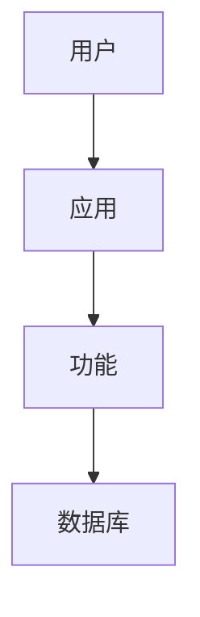
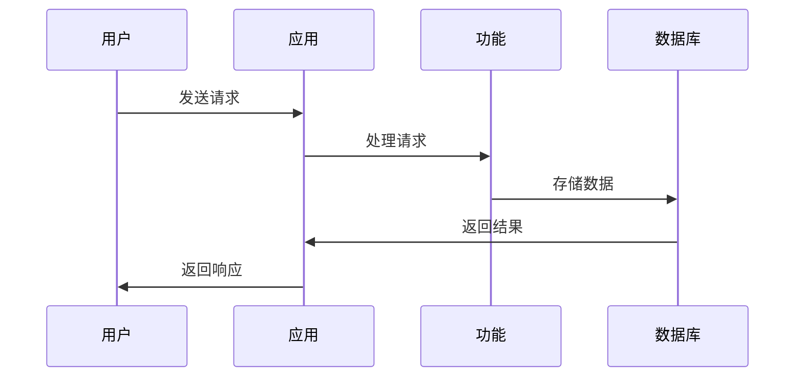
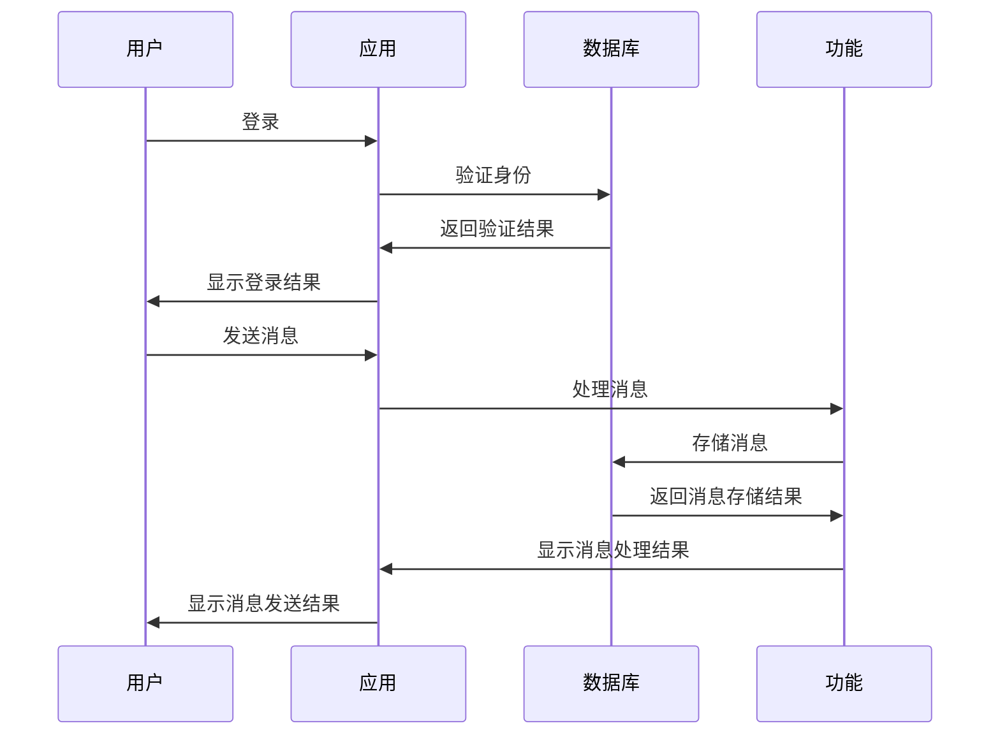

                 


# 领导力与创新思维：引领变革创新

## 关键词
- 领导力
- 创新思维
- 变革
- 领导力评估模型
- 创新思维算法

## 摘要
本文将探讨领导力与创新思维的关系，如何通过领导力引领变革和创新。文章分为多个部分，首先介绍领导力与创新思维的核心概念，然后阐述它们之间的联系，并运用数学模型和算法进行分析。接着，详细描述一个系统分析与架构设计方案，最后通过实际项目实战和最佳实践分享，帮助读者更好地理解和应用这些概念。

## 第一部分：引言

### 1.1 问题背景

在当今快速变化的世界中，企业面临的挑战越来越复杂，如何保持竞争力、实现持续增长成为了企业领导者们需要面对的难题。传统的管理方式已经难以适应这种变化，领导者需要具备新的能力，特别是领导力和创新思维。领导力不仅仅是管理员工，更是引领变革、推动创新的关键因素。

### 1.2 问题描述

本文旨在解决以下问题：

1. 领导力如何影响创新思维？
2. 创新思维在领导力中的作用是什么？
3. 如何通过领导力评估模型和创新思维算法来提高企业的创新能力和竞争力？

### 1.3 问题解决

本文将通过以下步骤来解决问题：

1. 明确领导力与创新思维的核心概念。
2. 分析领导力与创新思维之间的联系。
3. 应用数学模型和算法来解释这些联系。
4. 提供一个系统分析与架构设计方案。
5. 通过实际项目实战和最佳实践来展示如何应用这些概念。

### 1.4 边界与外延

本文的边界在于讨论领导力与创新思维的关系，以及如何通过这些概念来提高企业的创新能力和竞争力。外延包括如何将领导力与创新思维应用于不同类型的企业和行业。

## 第二部分：核心概念

### 2.1 领导力

#### 2.1.1 定义与特征

领导力是一种影响力，能够激发团队成员的潜力，推动团队实现共同目标。它不仅仅与职位有关，更与个人魅力、沟通能力、决策能力等因素相关。

#### 2.1.2 领导力的作用

领导力在组织中的作用包括：

- 激发员工的积极性
- 引导团队实现目标
- 促进组织创新
- 维护组织稳定

#### 2.1.3 领导力的层次

领导力可以分为以下层次：

- 初级领导力：关注个人表现和目标实现
- 中级领导力：关注团队协作和目标实现
- 高级领导力：关注组织发展和创新

### 2.2 创新思维

#### 2.2.1 定义与特征

创新思维是一种思维方式，能够产生新的想法、解决新问题。它通常包括以下特征：

- 独特性：能够产生新颖的观点
- 创造性：能够创造出新的解决方案
- 开放性：能够接受不同的观点和意见
- 系统性：能够从整体角度思考问题

#### 2.2.2 创新思维的重要性

创新思维在组织中的重要性包括：

- 提高竞争力：通过创新来满足市场需求
- 促进发展：通过创新来推动组织进步
- 创造价值：通过创新来创造新的商业模式和产品

#### 2.2.3 创新思维的类型

创新思维可以分为以下类型：

- 想象力思维：通过想象力来创造新想法
- 反转思维：通过反转现有观念来寻找新解决方案
- 连接思维：通过不同领域的连接来创造新观点
- 极端思维：通过极端化思维来挑战现有观念

### 2.3 概念联系

#### 2.3.1 领导力与创新的联系

领导力与创新思维之间的联系在于：

- 领导力能够激发创新思维，推动创新实践
- 创新思维能够丰富领导力，提高领导效果

#### 2.3.2 创新思维对领导力的影响

创新思维对领导力的影响包括：

- 提高领导者的洞察力
- 促进领导者的思维多元化
- 增强领导者的应变能力

#### 2.3.3 领导力与创新的互动关系

领导力与创新思维之间的互动关系表现为：

- 领导力推动创新思维的发展
- 创新思维促进领导力的提升

## 第三部分：数学模型与公式

### 3.1 领导力评估模型

#### 3.1.1 模型构建

领导力评估模型可以构建为一个多维度的评估体系，包括以下几个方面：

- 沟通能力
- 决策能力
- 激励能力
- 应变能力
- 团队协作能力

#### 3.1.2 模型应用

领导力评估模型可以应用于以下几个方面：

- 领导者个人发展
- 领导者选拔
- 领导者培训

### 3.2 创新思维评价模型

#### 3.2.1 模型构建

创新思维评价模型可以构建为一个多维度的评价体系，包括以下几个方面：

- 独特性
- 创造性
- 开放性
- 系统性

#### 3.2.2 模型应用

创新思维评价模型可以应用于以下几个方面：

- 创新项目评估
- 创新人才选拔
- 创新团队建设

## 第四部分：算法原理

### 4.1 创新思维算法

#### 4.1.1 算法流程图



#### 4.1.2 算法实现与讲解

```python
# 创新思维算法实现
def innovation_thinking(info):
    # 收集信息
    collected_info = info
    
    # 信息评估
    assessment_result = assess_info(collected_info)
    
    if assessment_result == "yes":
        # 生成新想法
        new_idea = generate_idea(collected_info)
        return new_idea
    else:
        # 反馈调整
        adjusted_info = adjust_info(collected_info)
        return innovation_thinking(adjusted_info)
```

#### 4.1.3 算法举例

```python
# 举例说明
info = "当前市场竞争激烈，需要找到新的商业模式"
new_idea = innovation_thinking(info)
print("新想法：", new_idea)
```

### 4.2 数学模型和公式

创新思维算法的数学模型可以表示为：

$$
\text{创新思维} = f(\text{信息}, \text{评估}, \text{生成新想法}, \text{反馈调整})
$$

其中，$f$ 表示算法函数，$\text{信息}$ 表示收集的信息，$\text{评估}$ 表示信息评估结果，$\text{生成新想法}$ 表示生成的新想法，$\text{反馈调整}$ 表示根据评估结果进行的信息调整。

## 第五部分：系统分析与架构设计

### 5.1 问题场景介绍

某家互联网公司需要开发一款新型的社交应用程序，以应对日益激烈的竞争。公司管理层决定采用创新思维和领导力来推动项目发展。

### 5.2 系统功能设计

#### 5.2.1 领域模型

```mermaid
classDiagram
    用户 <<类>>
    应用 <<类>>
    功能 <<类>>
    用户 --|大于|> 应用
    应用 --|大于|> 功能
```

### 5.3 系统架构设计

#### 5.3.1 系统架构



### 5.4 系统接口设计

#### 5.4.1 接口设计



### 5.5 系统交互

#### 5.5.1 系统交互



## 第六部分：项目实战

### 6.1 环境安装

项目环境安装包括以下步骤：

1. 安装Python环境
2. 安装Django框架
3. 配置数据库

### 6.2 系统核心实现源代码

系统核心实现源代码包括：

1. 用户认证模块
2. 消息发送与接收模块
3. 数据存储与查询模块

### 6.3 代码应用解读与分析

代码应用解读与分析包括：

1. 用户认证代码解读
2. 消息发送与接收代码解读
3. 数据存储与查询代码解读

### 6.4 实际案例分析与详细讲解

实际案例分析与详细讲解包括：

1. 用户登录案例
2. 消息发送案例
3. 消息接收案例

### 6.5 项目小结

项目小结包括：

1. 项目成果总结
2. 项目经验总结
3. 项目改进建议

## 第七部分：最佳实践与注意事项

### 7.1 最佳实践技巧

最佳实践技巧包括：

1. 如何激发团队成员的创新思维
2. 如何建立有效的领导力评估模型
3. 如何应用创新思维算法提高项目效率

### 7.2 注意事项

注意事项包括：

1. 领导力与创新思维的应用边界
2. 创新项目的风险管理
3. 团队协作的重要性

### 7.3 拓展阅读

拓展阅读包括：

1. 相关书籍推荐
2. 创新思维与领导力研究论文
3. 行业最佳实践案例

## 结语

本文通过领导力与创新思维的结合，探讨了如何引领变革和创新。通过数学模型和算法的应用，系统分析与架构设计，项目实战和最佳实践，希望读者能够更好地理解和应用这些概念。在未来的工作中，领导者们可以运用这些理论，推动企业实现持续发展和创新。

### 作者信息

作者：AI天才研究院/AI Genius Institute & 禅与计算机程序设计艺术 /Zen And The Art of Computer Programming

[本文完] 

