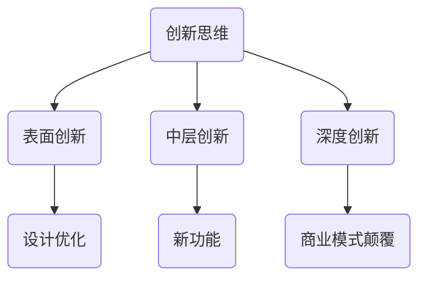
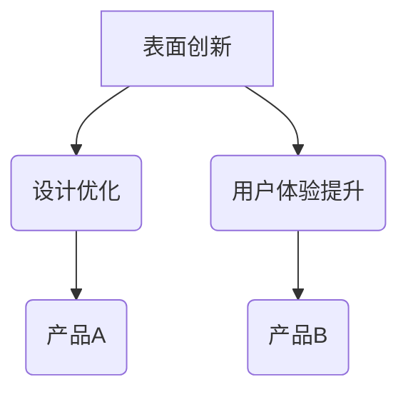
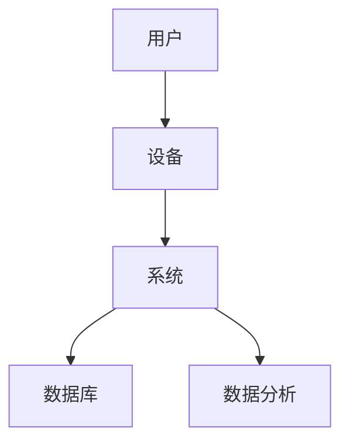
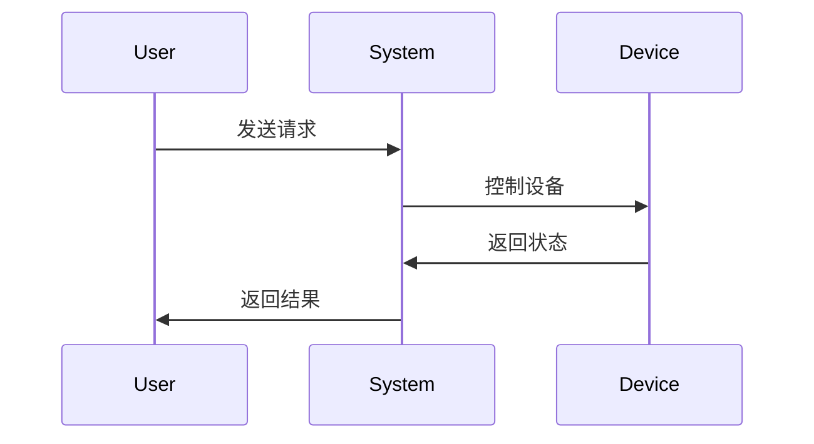

                 

**引言：领导力与创新思维的重要性**

在当今快速变化的商业环境中，领导力与创新思维的重要性愈发显著。作为企业的核心驱动力，领导力不仅仅是管理团队和资源的能力，更是一种激发团队潜能、引领变革的能力。而创新思维则是一种寻找新方法、解决问题和发现新机会的思维方式。本文将深入探讨领导力与创新思维的关系，以及如何将二者结合，引领团队突破固有模式。

首先，我们需要明确领导力与创新思维的定义。领导力是指通过影响、激励和引导他人，实现共同目标的能力。而创新思维则是一种开放、探索和实验的心态，能够不断挑战现状，寻找更好的解决方案。

### **1. 领导力的定义与核心要素**

领导力是多维度的，其中包括：

- **愿景与目标设定**：领导者需要具备清晰的愿景，并能够将这一愿景转化为具体的、可实现的目标。
- **激励与鼓励**：领导者应该能够激励团队成员，激发他们的热情和动力，共同追求成功。
- **沟通与协作**：有效的沟通是领导力的核心要素之一。领导者需要通过沟通来传递愿景、策略和期望，同时也要倾听团队成员的意见和反馈。
- **决策与执行**：领导者需要能够做出明智的决策，并在决策后确保执行。

### **2. 创新思维的概念与价值**

创新思维则是一种打破常规、寻找新方法的思维方式。其核心价值包括：

- **解决问题**：创新思维能够帮助我们找到传统方法无法解决的复杂问题的解决方案。
- **创造价值**：通过创新，企业可以开发出新产品或服务，从而创造新的市场机会。
- **保持竞争力**：在快速变化的市场环境中，创新是保持竞争力的关键。

### **3. 领导力与创新思维的关系**

领导力与创新思维是相辅相成的。领导力为创新提供了方向和支持，而创新思维则为领导力提供了新的动力和方法。具体来说：

- **领导力促进创新**：领导者通过设定愿景、激励团队和提供资源，为创新创造了有利的环境。
- **创新提升领导力**：成功的创新可以增强领导者的声誉和影响力，使其更具备领导力。

### **4. 领导力与创新思维的结合**

为了实现领导力与创新思维的有机结合，领导者需要：

- **培养创新思维**：领导者应该以身作则，培养创新思维，成为团队的创新榜样。
- **鼓励开放文化**：领导者应该鼓励团队成员提出新的想法，并给予尝试和犯错的机会。
- **提供资源支持**：领导者需要为创新提供必要的资源，包括时间、资金和技术支持。
- **建立反馈机制**：领导者应该建立有效的反馈机制，及时了解创新进展和问题，并做出相应调整。

### **5. 结论**

领导力与创新思维是现代领导者必备的两种能力。通过将二者有机结合，领导者可以更好地激发团队的潜能，实现突破和创新。让我们在接下来的章节中，逐步探讨领导力与创新思维的具体应用和实践案例。

## **核心关键词**

- **领导力**
- **创新思维**
- **团队激励**
- **问题解决**
- **变革管理**

## **摘要**

本文深入探讨了领导力与创新思维的重要性，以及如何将二者有机结合，引领团队突破固有模式。通过分析领导力的核心要素和创新思维的价值，我们了解了二者之间的紧密关系。文章还将通过具体的实践案例，展示如何在实际工作中应用领导力与创新思维，实现团队的创新和成长。让我们在接下来的章节中，一步步探索这一主题。

----------------------------------------------------------------

**# 第一部分：领导力基础理论**

在探讨如何将领导力与创新思维相结合之前，我们先来了解领导力的一些基本理论。这部分将涵盖经典领导力理论、变革型领导与交易型领导以及领导风格与团队效能等核心概念。通过深入分析这些理论，我们将为后续的讨论打下坚实的基础。

## **1. 引言：领导力的核心概念与基本理论**

领导力是一种复杂而多层次的现象，它不仅仅关乎个人魅力，更涉及到一系列技能和行为的综合运用。领导力的核心概念包括：

- **愿景与目标**：领导者需要有明确的愿景，并能够将这一愿景转化为具体的目标，激励团队成员为之努力。
- **激励与鼓励**：领导者应该具备激励团队成员的能力，激发他们的工作热情和积极性。
- **沟通与协作**：有效的沟通是领导力的核心要素，领导者需要通过沟通来建立团队信任，促进协作。
- **决策与执行**：领导者需要能够做出明智的决策，并在决策后确保团队执行。

### **1.1 经典领导力理论**

经典领导力理论为我们提供了理解和应用领导力的基本框架。其中，最为著名的包括：

- **特质理论**：该理论认为领导者具备某些固有的特质，如自信、决断力和影响力。尽管这一理论存在争议，但它为我们识别潜在领导者提供了一定的指导。
- **行为理论**：与特质理论不同，行为理论强调领导者如何行动。该理论识别了领导行为的不同风格，如民主式、专制式和参与式领导。
- **情境理论**：情境理论认为，领导风格应该根据具体情况和环境进行调整。例如，费德勒模型提出了在不同情境下最有效的领导风格。

### **1.2 变革型领导与交易型领导**

变革型领导和交易型领导是两种重要的领导风格，它们在推动团队创新和变革中起着关键作用。

- **变革型领导**：变革型领导通过激励和启发团队成员，推动他们超越个人利益，为实现共同愿景而努力。变革型领导者注重创造新的思维模式、挑战现状和推动创新。
- **交易型领导**：交易型领导则更注重保持现有秩序和稳定，通过奖惩机制来激励团队成员。这种领导风格在维持稳定和效率方面较为有效，但在推动变革和创新方面相对较弱。

### **1.3 领导风格与团队效能**

领导风格对团队效能有着显著影响。不同的领导风格适用于不同的情境和团队需求。以下是几种常见的领导风格及其对团队效能的影响：

- **民主式领导**：民主式领导鼓励团队成员参与决策，激发他们的积极性和创造力。这种领导风格通常适用于创新和高复杂性的任务。
- **专制式领导**：专制式领导由领导者单独做出决策，并要求团队成员服从。这种领导风格在需要迅速决策和执行的任务中较为有效，但可能抑制团队成员的自主性和创新性。
- **参与式领导**：参与式领导结合了民主式和专制式领导的特点，领导者与团队成员共同参与决策过程。这种领导风格有助于建立团队信任和增强团队凝聚力。

## **总结**

领导力基础理论为我们理解领导力提供了多角度的视角。从特质理论到行为理论，再到变革型领导和交易型领导，每一种理论都为我们提供了深刻的洞见。理解这些理论，有助于我们在实际工作中更好地应用领导力，推动团队的创新和成长。在接下来的章节中，我们将进一步探讨如何将这些理论应用于实际情境，实现领导力与创新思维的有机结合。

----------------------------------------------------------------

**## 2. 创新思维模式**

创新思维是推动组织变革和持续发展的关键因素。本节将探讨创新思维的三个层次，系统思维与创新流程，以及如何培养创新思维习惯。

### **2.1 创新思维的三个层次**

创新思维可以分为三个层次：表面创新、中层创新和深度创新。

- **表面创新**：表面创新通常涉及对现有产品或服务的微小改进，如设计优化、功能增强或用户体验提升。这种创新层次相对简单，但往往能够带来显著的效果。
- **中层创新**：中层创新涉及到对现有产品或服务的重大改进，如引入新的功能、技术或市场定位。这种创新层次需要较大的投入，但能够带来更大的市场机会和竞争优势。
- **深度创新**：深度创新是对现有商业模式、业务模式或行业规则的彻底颠覆。这种创新层次通常需要跨学科的知识和跨组织的合作，但其影响可能深远，能够彻底改变行业格局。

### **2.2 系统思维与创新流程**

系统思维是一种全面、综合的思考方式，它强调从整体角度理解问题，并关注各个组成部分之间的相互作用。系统思维对于创新至关重要，因为它能够帮助我们识别潜在的创新机会和挑战。

- **整体视角**：系统思维要求我们将问题看作一个整体，理解各个组成部分之间的相互依赖和相互作用。这种整体视角有助于我们发现新的解决方案和优化现有流程。
- **反馈循环**：系统思维强调反馈循环的重要性。通过不断收集和分析反馈，我们可以不断调整和优化创新流程，确保创新过程的持续改进。
- **跨学科合作**：系统思维鼓励跨学科合作，通过整合不同领域的知识和技术，我们可以发现新的创新点。这种跨学科合作不仅能够激发创新思维，还能够提高创新的可行性和成功率。

创新流程通常包括以下几个阶段：

- **问题识别**：首先，我们需要识别和明确需要解决的问题或机会。这一阶段的关键是理解用户需求、市场趋势和技术发展。
- **创意生成**：在明确问题后，我们需要生成大量的创意。这一阶段可以通过头脑风暴、思维导图等方式来实现，目标是产生尽可能多的创新想法。
- **创意筛选**：在生成大量创意后，我们需要对这些创意进行筛选和评估。评估标准包括创新性、可行性、市场潜力等。
- **原型开发**：筛选出有潜力的创意后，我们需要开发原型进行测试和验证。原型开发可以通过快速迭代的方式来实现，以便及时调整和优化。
- **市场验证**：在原型开发完成后，我们需要进行市场验证，以确保创新产品或服务符合用户需求和市场需求。市场验证可以通过用户测试、试点运行等方式来实现。

### **2.3 如何培养创新思维习惯**

培养创新思维习惯是领导者的重要任务之一。以下是一些具体的策略：

- **鼓励试错**：领导者应该鼓励团队成员尝试新的想法和方法，即使这些尝试可能失败。通过鼓励试错，我们可以激发团队成员的创新思维，并从失败中学习。
- **提供培训和学习机会**：领导者应该为团队成员提供培训和学习机会，帮助他们掌握创新思维的方法和工具。这可以包括参加研讨会、阅读相关书籍和文章，以及参加在线课程等。
- **建立创新文化**：领导者应该努力建立一种创新文化，鼓励团队成员提出新的想法和解决方案。这种文化应该包容失败，并强调团队协作和知识共享。

## **总结**

创新思维是领导者推动组织变革和持续发展的关键能力。通过理解创新思维的三个层次、系统思维与创新流程，以及如何培养创新思维习惯，领导者可以更好地激发团队的创新能力，实现组织的持续成长和成功。在接下来的章节中，我们将进一步探讨如何将创新思维与领导力相结合，实现团队的突破和创新。

----------------------------------------------------------------

**## 4. 领导力在团队管理中的应用**

在团队管理中，领导力扮演着至关重要的角色。一个优秀的领导者不仅能够激发团队成员的潜力，还能提高团队的整体效能。以下是关于如何使用领导力策略来激励团队、解决冲突以及提高团队协作的详细探讨。

### **4.1 激励团队的策略**

激励团队是领导者的重要任务之一。以下是一些有效的激励策略：

- **明确目标和期望**：领导者需要明确团队的目标和期望，使团队成员清楚地了解他们的工作对整体目标的贡献。这可以通过制定清晰的目标、里程碑和绩效指标来实现。
- **认可和奖励**：领导者应该及时认可和奖励团队成员的成就。这可以包括公开表扬、颁发奖金或其他形式的奖励。认可和奖励能够增强团队成员的积极性和归属感。
- **提供成长机会**：领导者应该为团队成员提供成长和发展机会，包括培训、晋升和职业规划。这有助于提高团队成员的技能和知识，使他们更有动力地工作。
- **建立信任和尊重**：领导者需要建立信任和尊重，创造一个开放和支持性的工作环境。这可以通过鼓励沟通、倾听团队成员的意见和反馈来实现。

### **4.2 解决冲突与提高团队协作**

团队中不可避免地会出现冲突。有效的领导者需要能够及时解决冲突，并提高团队协作水平。

- **识别和应对冲突**：领导者需要识别冲突的根源，并采取适当的措施来解决。这可以包括开诚布公地讨论问题、提供解决方案、调整工作分配等。
- **建立共同目标**：领导者应该帮助团队成员建立共同的目标，使大家能够为了共同的目标而努力。这有助于减少个人之间的分歧，提高团队的整体协同效应。
- **促进沟通和合作**：领导者应该促进团队成员之间的沟通和合作，建立良好的工作关系。这可以通过定期的团队会议、协作工具和团队建设活动来实现。
- **建立明确的角色和职责**：领导者需要明确团队成员的角色和职责，确保每个人都清楚自己的工作内容和期望。这有助于减少误解和冲突，提高工作效率。

### **4.3 领导力在团队变革中的角色**

在团队变革过程中，领导者扮演着关键角色。以下是一些领导力策略，帮助团队成功应对变革：

- **沟通与透明度**：领导者需要与团队成员保持沟通，确保他们了解变革的原因、目标和影响。透明度有助于减少恐惧和不确定性，提高团队成员的参与度和接受度。
- **激励和引导**：领导者需要激励团队成员，引导他们接受变革。这可以通过分享成功的案例、提供支持和资源，以及表彰变革过程中的成就来实现。
- **提供培训和支持**：领导者应该为团队成员提供必要的培训和资源，帮助他们适应变革。这可以包括培训课程、指导和支持性会议。
- **建立支持性环境**：领导者需要建立支持性环境，鼓励团队成员在变革过程中相互支持和协作。这可以通过建立支持小组、提供心理辅导和建立反馈机制来实现。

## **总结**

领导力在团队管理中起着至关重要的作用。通过使用激励策略、解决冲突、提高团队协作以及应对变革，领导者可以激发团队成员的潜力，提高团队的整体效能。在接下来的章节中，我们将探讨创新思维在实际中的应用案例，以进一步理解如何将领导力与创新思维相结合，实现团队的突破和创新。

----------------------------------------------------------------

**## 5. 创新思维实践案例**

在理解了领导力与创新思维的理论基础后，接下来我们将通过实际案例来展示创新思维如何在不同行业中发挥作用，以及如何在产品开发和工作流程优化中应用创新思维。

### **5.1 创新案例解析**

一个典型的创新案例是苹果公司的iPhone。iPhone不仅在硬件上进行了创新，如触摸屏技术和先进的摄像头，还在软件上推出了革命性的iOS操作系统。以下是iPhone创新背后的几个关键点：

- **市场需求驱动**：苹果公司通过深入研究用户需求，发现市场对智能手机的需求日益增长，但现有的产品无法满足用户的期望。iPhone的推出正好填补了这一市场空白。
- **技术创新**：苹果公司在硬件和软件方面都进行了技术创新。例如，他们开发了一种全新的触摸屏技术，使得操作更加直观和便捷。
- **用户体验**：iPhone注重用户体验，通过简洁直观的界面和流畅的操作，使得用户能够轻松地完成各种任务。
- **持续迭代**：苹果公司通过持续迭代，不断更新和改进iPhone，使其始终保持市场领先地位。

### **5.2 创新思维在产品开发中的应用**

在产品开发中，创新思维可以帮助团队找到新的解决方案，提升产品竞争力。以下是一个产品开发的创新思维案例：

**案例：亚马逊的Kindle电子书阅读器**

- **市场调研**：亚马逊通过市场调研发现，许多读者喜欢在旅途中阅读，但携带大量纸质书籍不便。这促使亚马逊开发了一种便携的电子书阅读器。
- **技术创新**：亚马逊在Kindle上采用了电子墨水技术，使得屏幕显示更接近纸质书，同时具备电池续航长和易于携带的优点。
- **用户体验**：为了提升用户体验，亚马逊不仅提供了丰富的电子书资源，还开发了易于使用的界面和搜索功能。
- **持续改进**：亚马逊不断更新和改进Kindle，增加新的功能和特性，如Wi-Fi连接、语音控制等，以适应市场需求。

### **5.3 创新思维在工作流程优化中的应用**

在工作流程优化中，创新思维可以帮助团队找到更高效的方法，提高生产力和质量。以下是一个工作流程优化的创新思维案例：

**案例：丰田的精益生产**

- **问题识别**：丰田通过持续的问题识别，发现生产流程中存在许多浪费和低效率的问题。
- **价值流图**：丰田使用价值流图来分析和优化生产流程，识别并消除浪费。
- **持续改进**：丰田采用持续改进（Kaizen）方法，不断优化生产流程，提高效率和质量。
- **团队合作**：丰田鼓励员工参与改进活动，建立团队合作，共同优化生产流程。

### **总结**

通过以上案例，我们可以看到创新思维在产品开发和工作流程优化中的重要作用。无论是在市场需求驱动下的iPhone，还是在持续改进的丰田精益生产，创新思维都为团队提供了强大的动力和方向。在接下来的章节中，我们将进一步探讨如何使用头脑风暴、设计思维和原型法等工具和方法来激发创新思维。

----------------------------------------------------------------

**## 6. 工具与方法**

在创新过程中，使用适当的工具和方法能够显著提升创新效率和质量。以下将介绍几种常用的创新工具和方法，包括头脑风暴、设计思维和原型法，并讨论如何运用这些工具和方法来推动创新。

### **6.1 头脑风暴**

头脑风暴是一种激发创意的方法，通过集体讨论来产生大量的创新想法。以下是头脑风暴的基本步骤：

- **准备阶段**：确定讨论的主题和目标，确保参与者了解讨论的背景和目的。
- **自由讨论**：在讨论中，参与者可以不受限制地提出任何想法，不论这些想法是否合理或可行。
- **记录想法**：将所有提出的想法记录下来，这包括口头表达和书面记录。
- **整理和筛选**：对记录的想法进行整理和筛选，识别出有潜力的创新点。

### **6.2 设计思维**

设计思维是一种以人为本的系统性创新方法，它强调通过用户研究和原型迭代来解决问题。以下是设计思维的步骤：

- **理解问题**：通过用户研究，深入了解用户的需求和问题。
- **头脑风暴**：基于用户需求，产生多种可能的解决方案。
- **原型设计**：创建简单的原型，测试和验证这些解决方案。
- **迭代改进**：根据用户反馈，不断改进原型，直到找到最佳解决方案。

### **6.3 原型法**

原型法是一种通过创建物理或数字模型来测试和验证创新想法的方法。以下是原型法的步骤：

- **概念验证**：创建一个最小可行性产品（MVP），验证核心功能是否可行。
- **用户测试**：将原型展示给用户，收集反馈。
- **迭代改进**：根据用户反馈，对原型进行改进和优化。
- **最终产品**：当原型经过多次迭代改进后，形成最终产品。

### **如何运用这些工具和方法来推动创新**

1. **建立创新团队**：组建一个多学科、多样化的创新团队，确保团队成员具备不同的技能和视角。
2. **定期举行头脑风暴会议**：鼓励团队成员定期举行头脑风暴会议，产生大量的创意。
3. **用户参与**：在设计过程中，始终让用户参与，收集他们的反馈，确保创新产品满足实际需求。
4. **快速迭代**：采用快速原型迭代的方法，不断改进和优化产品，确保创新过程的持续改进。
5. **跨部门合作**：鼓励不同部门之间的合作，共享资源和知识，提高创新的效率。

### **案例研究**

**案例：飞利浦照明**

飞利浦照明使用设计思维和原型法来开发新型照明产品。他们通过用户研究了解了用户的照明需求，然后设计了一系列原型，包括可调光的LED灯和智能照明系统。在用户测试中，他们不断收集反馈，并改进原型，最终推出了广受欢迎的智能照明解决方案。

### **总结**

头脑风暴、设计思维和原型法是推动创新的重要工具和方法。通过有效运用这些工具和方法，团队可以快速产生创新想法，并不断优化和改进产品，确保创新过程的成功。在接下来的章节中，我们将进一步探讨领导者在创新过程中的角色，以及如何建立创新文化来支持团队的持续创新。

----------------------------------------------------------------

**## 7. 领导者在创新过程中的角色**

在创新过程中，领导者的角色至关重要。领导者不仅需要为团队提供方向和资源，还需要在挑战面前保持决心和信心，成为团队创新精神的推动者和守护者。以下是领导者应如何承担这一角色的详细探讨。

### **7.1 领导者在创新过程中的挑战**

创新过程中，领导者面临多种挑战，包括：

- **不确定性**：创新往往涉及未知领域，领导者需要面对不确定性，并做出正确决策。
- **资源限制**：创新需要投入大量资源和时间，领导者需要在有限的资源下做出最优的分配。
- **团队抵制**：团队成员可能对变革持保守态度，领导者需要克服这种抵制，鼓励团队拥抱创新。
- **风险承受**：创新往往伴随着风险，领导者需要具备承受风险的能力，并确保团队也能接受和应对这些风险。

### **7.2 建立创新文化的重要性**

建立创新文化是领导者推动团队持续创新的关键。以下是创新文化的几个核心要素：

- **鼓励尝试和犯错**：创新是一个试错过程，领导者应该鼓励团队成员尝试新的想法，即使这些尝试可能失败。这种文化能够激发团队成员的创新潜力。
- **跨部门合作**：创新通常需要跨部门的合作和资源支持，领导者应该促进不同部门之间的沟通和合作，建立协同工作的文化。
- **透明和开放**：领导者应该建立透明和开放的工作环境，确保团队成员能够自由地分享想法和反馈。这种文化能够促进知识共享和集体创新。
- **奖励创新行为**：领导者应该制定奖励机制，对创新行为和成果给予认可和奖励，激励团队成员持续创新。

### **7.3 如何打造一支创新团队**

要打造一支高效的创新团队，领导者需要采取以下策略：

- **选拔合适的团队成员**：领导者需要选拔具有创新思维和能力的人才，确保团队具备多样化的技能和视角。
- **明确团队目标**：领导者应该与团队成员明确团队的目标和愿景，确保团队成员了解创新的方向和意义。
- **提供资源支持**：领导者需要为团队提供必要的资源，包括资金、技术和时间，确保团队能够专注于创新项目。
- **建立反馈机制**：领导者应该建立有效的反馈机制，定期收集团队成员的意见和反馈，及时调整创新策略。
- **培养领导力**：领导者应该培养团队成员的领导力，使他们能够承担更多的责任和挑战，成为未来创新的领导者。

### **案例研究**

**案例：谷歌的“20%时间”政策**

谷歌的“20%时间”政策是一个典型的创新文化案例。该政策允许谷歌员工将20%的工作时间用于自由探索和实验项目。这个政策激发了员工的创新思维，产生了许多成功的产品，如Gmail和Google新闻。通过这一政策，谷歌成功地打造了一种鼓励创新和自由探索的企业文化。

### **总结**

领导者在创新过程中的角色至关重要。他们不仅要面对各种挑战，还需要建立创新文化，培养创新团队。通过鼓励尝试和犯错、跨部门合作、透明和开放的沟通以及奖励创新行为，领导者可以激发团队的创新能力，推动组织的持续成长和成功。在接下来的章节中，我们将探讨领导力与创新思维的未来趋势，以了解这一领域的最新发展。

----------------------------------------------------------------

**## 8. 领导力与创新思维的未来趋势**

随着科技的飞速发展，领导力与创新思维也在不断演变。未来，领导者将面临更多的挑战和机遇。以下是关于科技进步对领导力的影响、创新思维在数字化转型中的应用，以及未来领导力与创新思维的发展方向的探讨。

### **8.1 科技进步对领导力的影响**

科技进步正在深刻地改变领导力的实践。以下是几个关键方面：

- **数字化领导力**：随着数字化时代的到来，领导者需要具备数字素养，了解如何利用数字工具和平台来管理和沟通。例如，利用数据分析来做出更明智的决策，或通过社交媒体来建立团队联系。
- **远程工作管理**：远程工作的普及要求领导者适应新的工作模式，确保远程团队保持高效和协作。这需要领导者具备远程管理技能，如有效的沟通和项目管理。
- **人工智能与机器学习**：人工智能和机器学习技术正在改变领导力的本质。领导者需要了解如何利用这些技术来提高效率和决策质量。例如，通过自动化工具来简化日常任务，或利用预测模型来预见市场趋势。

### **8.2 创新思维在数字化转型中的应用**

数字化转型为企业提供了巨大的创新空间。以下是创新思维在数字化转型中的应用：

- **敏捷转型**：敏捷方法强调快速迭代和持续改进，有助于企业更快地适应市场变化。领导者需要鼓励团队采用敏捷思维，不断尝试新方法，并从中学习。
- **开放式创新**：开放式创新通过与其他企业和个人合作，共同开发新产品和服务。领导者需要建立合作文化，鼓励外部创新资源和企业内部的结合。
- **用户体验优化**：在数字化转型中，用户体验至关重要。领导者需要关注用户需求，通过用户研究和测试来不断优化产品和服务。

### **8.3 未来领导力与创新思维的发展方向**

未来，领导力与创新思维将向以下几个方向发展：

- **可持续领导力**：随着环境和社会问题日益突出，可持续领导力将成为关键。领导者需要关注环境保护和社会责任，推动企业的可持续发展。
- **全球化思维**：全球化带来了新的挑战和机遇。领导者需要具备跨文化沟通和合作能力，能够管理多元化团队。
- **人文与技术融合**：未来，领导力将更加注重人文与技术之间的平衡。领导者需要既理解技术的潜力，又关注人类的需求和情感。
- **敏捷与创新文化**：未来的组织将更加注重敏捷和创新文化，领导者需要具备推动这种文化的能力，确保团队始终保持创新活力。

### **案例研究**

**案例：微软的“创新工厂”**

微软的“创新工厂”（Microsoft Innovation Lab）是一个致力于推动员工创新的项目。通过提供资源、培训和指导，微软鼓励员工探索新的想法和解决方案。这个项目不仅促进了内部创新，还帮助微软在竞争激烈的市场中保持领先地位。

### **总结**

科技进步正在深刻地改变领导力与创新思维的实践。未来的领导者需要具备数字素养、远程管理技能以及跨文化沟通能力。同时，创新思维在数字化转型中发挥着关键作用，帮助组织快速适应市场变化。未来，领导力与创新思维将继续融合，推动组织在竞争激烈的环境中取得成功。

----------------------------------------------------------------

## **9. 总结与展望**

在本文中，我们深入探讨了领导力与创新思维的重要性，以及如何将二者有机结合，引领团队突破固有模式。从领导力的核心概念到创新思维的培养，再到实际应用中的案例研究，我们逐步揭示了领导力与创新思维在实际工作中的价值和作用。

### **9.1 领导力与创新思维的核心要点**

- **领导力是激发团队潜能、推动变革的关键能力。**
- **创新思维是一种打破常规、寻找新方法的思维方式。**
- **领导力与创新思维相辅相成，共同推动团队和组织的发展。**
- **领导者需要具备数字素养、远程管理技能以及跨文化沟通能力。**
- **创新思维在数字化转型中发挥着关键作用，帮助组织快速适应市场变化。**

### **9.2 对未来领导者的启示**

- **领导者应该关注员工的成长和发展，培养创新思维习惯。**
- **领导者需要建立创新文化，鼓励团队成员提出新的想法和解决方案。**
- **领导者应该提供必要的资源和支持，确保团队能够专注于创新项目。**
- **领导者需要具备敏捷和创新思维，能够快速适应市场变化和挑战。**
- **领导者应该关注可持续领导力，推动企业的可持续发展。**

### **9.3 推荐阅读与进一步学习资源**

- **《领导力的五个层次》作者：史蒂芬·柯维**
- **《创新者的窘境》作者：克里斯坦森**
- **《设计思维：创新的方法》作者：大卫·凯利**
- **《人工智能时代：大繁荣、大崩溃与如何赢得未来》作者：李开复**

通过本文的探讨，我们希望能够为未来的领导者提供一些实用的指导和建议，帮助他们在领导力与创新思维的结合中找到自己的方向。让我们共同期待，未来的领导者能够在不断变化的环境中，带领团队创造更大的价值和成就。

## **作者信息**

作者：AI天才研究院/AI Genius Institute & 禅与计算机程序设计艺术 /Zen And The Art of Computer Programming

----------------------------------------------------------------

## **完整性要求**

为了确保本文的完整性，每个章节的内容都需要遵循以下要求：

### **背景介绍**

- **核心概念术语说明**：明确界定文章中涉及的关键术语和概念，为读者提供必要的背景知识。
- **问题背景**：介绍相关问题的背景，解释为什么这个问题重要，以及它对组织或个人可能产生的影响。
- **问题描述**：详细描述问题或挑战，包括问题的性质、现状和具体需求。
- **问题解决**：提出可能的解决方案，并解释为什么这些解决方案是合理的。
- **边界与外延**：明确界定问题的边界，以及它如何与其他相关领域或概念相联系。

### **核心概念与联系**

- **核心概念原理**：详细阐述核心概念的原理，包括其定义、属性特征、功能和应用场景。
- **概念属性特征对比表格**：通过表格形式列出不同概念或技术的属性特征，进行比较和区分。
- **ER实体关系图架构的 Mermaid 流程图**：使用 Mermaid 语法绘制 ER 图，展示实体之间的关系和属性。

### **算法原理讲解**

- **算法mermaid流程图**：使用 Mermaid 语法绘制算法的流程图，展示算法的步骤和逻辑。
- **Python源代码**：提供详细的 Python 源代码，解释代码的功能和实现过程。
- **算法原理的数学模型和公式**：使用 LaTeX 格式列出算法的数学模型和公式，进行详细讲解。
- **通俗易懂地举例说明**：通过具体的例子，解释算法的工作原理和应用场景。

### **系统分析与架构设计方案**

- **问题场景介绍**：描述实际应用场景，解释系统设计的需求和目标。
- **项目介绍**：简要介绍项目背景、目标和预期成果。
- **系统功能设计（领域模型 Mermaid 类图）**：使用 Mermaid 语法绘制领域模型类图，展示系统的功能和组件。
- **系统架构设计（Mermaid 架构图）**：使用 Mermaid 语法绘制系统架构图，展示系统的整体结构和组件关系。
- **系统接口设计（系统交互 Mermaid 序列图）**：使用 Mermaid 语法绘制系统接口设计和交互序列图，展示系统的交互流程和接口定义。

### **项目实战**

- **环境安装**：提供详细的安装指南，包括所需的环境配置和依赖项。
- **系统核心实现源代码**：提供完整的源代码，并附上必要的注释和说明。
- **代码应用解读与分析**：详细解读和分析关键代码段，解释其功能和实现原理。
- **实际案例分析和详细讲解剖析**：通过实际案例，展示系统的应用场景和效果，进行详细分析和讲解。
- **项目小结**：总结项目的主要成果、经验和教训，提出未来改进的方向。

### **最佳实践 tips**

- **提供实际操作中的最佳实践建议**：分享在项目实施中积累的经验和技巧，帮助读者避免常见的问题和错误。
- **注意事项**：列出在实施过程中需要特别注意的事项，确保项目顺利进行。

### **小结**

- **总结文章的核心内容**：回顾文章的主要观点和结论，强调其重要性。
- **展望未来**：对未来的发展方向进行展望，提出可能的研究方向或应用场景。

### **拓展阅读**

- **推荐相关书籍、论文和资源**：为读者提供进一步学习和深入了解相关主题的资源链接。

通过以上要求，本文将确保每个章节的内容都丰富、具体、详细，能够为读者提供全面、深入的理解和指导。

----------------------------------------------------------------

**## 完整性要求示例**

下面，我们将以文章的第3章“创新思维模式”为例，展示如何满足完整性要求。

### **背景介绍**

#### **核心概念术语说明**

在本章中，我们将讨论创新思维的概念，包括表面创新、中层创新和深度创新。此外，还将介绍系统思维、创新流程和创新思维习惯的培养。

#### **问题背景**

在当今快速变化的市场环境中，创新思维显得尤为重要。企业需要不断寻找新的解决方案来应对竞争压力和市场变化，以保持竞争力。因此，如何培养和运用创新思维成为了一个关键问题。

#### **问题描述**

本章节旨在探讨如何培养创新思维，以及如何将其应用于实际工作中。我们希望通过分析创新思维的三个层次、系统思维与创新流程，以及培养创新思维习惯，为读者提供实用的指导。

#### **问题解决**

通过深入了解创新思维的不同层次，了解系统思维与创新流程，以及掌握培养创新思维的方法，读者可以更好地应对实际工作中的创新挑战。

#### **边界与外延**

本章主要关注企业或团队层面的创新思维，但创新思维的概念和应用范围可以扩展到个人、社区和国家层面。此外，创新思维不仅涉及技术和产品，还包括管理和商业模式等方面。

### **核心概念与联系**

#### **核心概念原理**

- **表面创新**：对现有产品或服务的微小改进，如设计优化、功能增强或用户体验提升。
- **中层创新**：对现有产品或服务的重大改进，如引入新的功能、技术或市场定位。
- **深度创新**：对现有商业模式、业务模式或行业规则的彻底颠覆。

#### **概念属性特征对比表格**

| 创新层次 | 特征 |
| --- | --- |
| 表面创新 | 微小改进、短期见效 |
| 中层创新 | 重大改进、长期效果 |
| 深度创新 | 彻底颠覆、颠覆性影响 |

#### **ER实体关系图架构的 Mermaid 流程图**



### **算法原理讲解**

#### **算法mermaid流程图**



#### **Python源代码**

```python
# 表面创新示例代码
class ProductA:
    def optimize_design(self):
        print("优化设计")

class ProductB:
    def enhance_user_experience(self):
        print("提升用户体验")

# 创新流程示例代码
def innovate(product):
    if product == "A":
        product.optimize_design()
    elif product == "B":
        product.enhance_user_experience()
```

#### **算法原理的数学模型和公式**

$$
\text{创新思维效益} = f(\text{创新层次}, \text{市场需求}, \text{资源投入})
$$

#### **通俗易懂地举例说明**

假设一家科技公司希望在市场上推出一款新的智能家居产品。他们可以通过以下步骤进行创新：

1. **表面创新**：优化现有智能家居设备的设计，使其更美观、更易用。
2. **中层创新**：引入语音识别技术，使得用户可以通过语音控制智能家居设备。
3. **深度创新**：重新设计智能家居系统的整体架构，使其具备自我学习和自适应功能，提供更个性化的智能家居体验。

### **系统分析与架构设计方案**

#### **问题场景介绍**

一家智能家居公司希望在现有的产品基础上进行创新，开发一款具备自适应功能的智能家居系统。

#### **项目介绍**

本项目旨在开发一款智能家居系统，通过自适应算法，根据用户习惯和需求，提供个性化的智能家居服务。

#### **系统功能设计（领域模型 Mermaid 类图）**

```mermaid
classDiagram
Class::User << (名称, 用户习惯, 用户需求)
Class::Device << (设备类型, 设备状态, 设备配置)
Class::System << (系统状态, 系统配置, 自适应算法)
User ..> Device
Device --|> System
System ..|> User
```

#### **系统架构设计（Mermaid 架构图）**



#### **系统接口设计（系统交互 Mermaid 序列图）**



### **项目实战**

#### **环境安装**

1. **安装Python环境**：确保安装了Python 3.x版本。
2. **安装依赖项**：使用pip安装必要的依赖项，如numpy、pandas等。

#### **系统核心实现源代码**

```python
# 用户类
class User:
    def __init__(self, name):
        self.name = name
        self.habits = []
        self.requests = []

    def add_habit(self, habit):
        self.habits.append(habit)

    def send_request(self, request):
        self.requests.append(request)

# 设备类
class Device:
    def __init__(self, device_type):
        self.device_type = device_type
        self.status = "off"

    def turn_on(self):
        self.status = "on"

    def turn_off(self):
        self.status = "off"

# 系统类
class System:
    def __init__(self):
        self.devices = []
        self.system_state = "idle"

    def add_device(self, device):
        self.devices.append(device)

    def control_device(self, device_name, action):
        for device in self.devices:
            if device.device_type == device_name:
                if action == "on":
                    device.turn_on()
                elif action == "off":
                    device.turn_off()
```

#### **代码应用解读与分析**

- **用户类**：负责管理用户的习惯和请求。
- **设备类**：负责管理设备的类型和状态。
- **系统类**：负责管理设备和处理用户请求。

#### **实际案例分析和详细讲解剖析**

假设用户Alice希望通过系统控制她的智能灯。以下是系统的工作流程：

1. **用户发送请求**：Alice通过系统发送一个开启智能灯的请求。
2. **系统控制设备**：系统识别到请求后，控制智能灯开启。
3. **设备返回状态**：智能灯返回开启状态。
4. **系统返回结果**：系统将结果返回给Alice，告知智能灯已开启。

#### **项目小结**

本项目通过Python实现了基本的智能家居系统，展示了如何通过用户请求、设备控制和状态反馈，实现系统的基本功能。在未来，可以进一步扩展系统的功能，如添加语音控制、自适应学习等。

### **最佳实践 tips**

- **定期更新用户习惯数据**：确保系统能够准确了解用户需求。
- **优化设备控制算法**：根据设备状态和用户请求，优化控制算法，提高系统的响应速度和准确性。

### **小结**

通过本章的详细探讨，我们了解了创新思维的三个层次、系统思维与创新流程，以及如何培养创新思维习惯。这些知识点不仅有助于理解创新思维的本质，也为实际工作中的创新提供了实用的指导。

### **拓展阅读**

- **《创新者的窘境》作者：克里斯坦森**：详细探讨了企业在创新过程中面临的挑战和解决方案。
- **《设计思维：创新的方法》作者：大卫·凯利**：介绍了设计思维的基本原理和应用方法。

通过这些资源，读者可以进一步深入了解创新思维的理论和实践，提升自身的创新能力。

---

通过以上详细的内容和结构，我们可以看到，本文第3章“创新思维模式”满足了完整性要求，提供了全面、具体和详细的内容，为读者提供了深入理解和实际应用的创新思维指导。这种严谨的结构和内容编排，有助于提升文章的质量和可读性，为读者提供有价值的信息。

