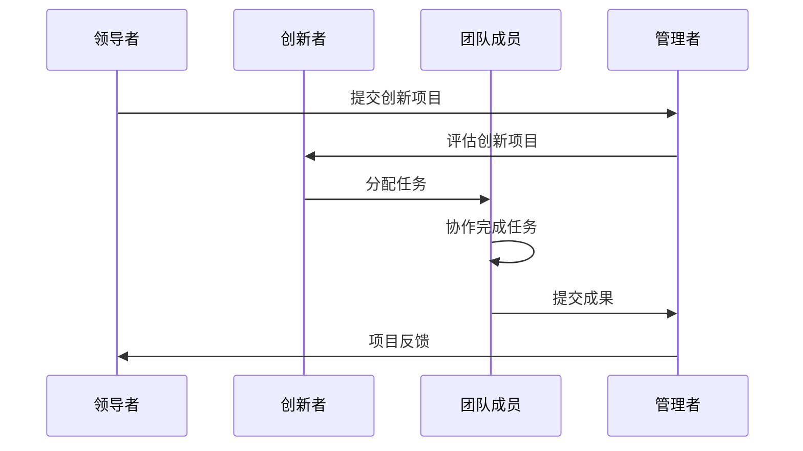

                 

# 领导力与创新思维：激发团队创造力的技巧

关键词：领导力、创新思维、团队创造力、激发技巧、团队协作

摘要：本文旨在探讨领导力与创新思维在激发团队创造力中的关键作用。通过对核心概念的深入分析，结合实际案例，本文提供了系统化的策略和技巧，帮助领导者有效地提升团队创造力，促进组织创新和可持续发展。

## 1. 背景介绍

### 问题背景

在当今快速变化和竞争激烈的商业环境中，企业的成功往往依赖于创新和团队的高效协作。领导力与创新思维作为推动企业发展的核心动力，越来越受到重视。然而，许多企业在激发团队创造力方面仍然面临挑战。团队创造力不足不仅影响企业的竞争力，还可能导致员工士气低落和团队凝聚力下降。

### 问题描述

团队创造力不足的现象在许多企业中普遍存在。这包括：

- 缺乏创新意识和创新精神
- 团队成员之间的沟通不畅
- 缺少明确的创新目标和方向
- 创新资源的匮乏

这些问题严重制约了团队的整体表现和企业的创新能力。

### 问题解决

领导力与创新思维在解决团队创造力不足方面发挥着至关重要的作用。通过以下方法，领导者可以有效地激发团队创造力：

- 设定清晰的愿景和目标，为团队提供明确的创新方向
- 建立开放和包容的文化，鼓励员工提出创新想法
- 提供必要的资源和培训，支持团队成员的创新能力
- 建立有效的反馈机制，及时评估和调整创新项目

这些措施不仅能够提高团队的创造力，还能够增强员工的参与感和归属感。

### 边界与外延

在本文中，领导力被定义为影响和激励他人实现共同目标的能力。创新思维则是指在面对问题时，能够迅速找到创造性解决方案的思维方式。

团队创造力是指团队成员通过协作和共享知识，产生新颖且有价值的想法、解决方案或产品。团队创造力不仅依赖于个人能力，还需要团队成员之间的良好沟通和协作。

领导力、创新思维和团队创造力之间密切相关。领导力为创新思维提供了支持和引导，而创新思维则是团队创造力的源泉。团队创造力则通过实现创新目标和提升企业竞争力来体现领导力和创新思维的价值。

### 概念结构与核心要素组成

- **领导力**：核心要素包括愿景设定、目标导向、激励与支持、沟通与协作。
- **创新思维**：核心要素包括问题解决、创造性思维、跨学科思维、风险管理。
- **团队创造力**：核心要素包括协作、共享知识、创新能力、成果转化。

这些核心要素相互交织，共同构成了领导力、创新思维和团队创造力的概念结构。

## 2. 核心概念与联系

### 领导力定义

领导力是一种影响力，通过激励、引导和影响他人，实现共同目标的能力。领导力包括以下几个关键属性和特点：

- **愿景设定**：领导者需要具有远见和洞察力，能够为团队描绘清晰的愿景，激发成员的热情和动力。
- **目标导向**：领导者需要明确团队的目标，并确保团队成员了解并致力于实现这些目标。
- **激励与支持**：领导者需要了解团队成员的需求和潜力，并提供必要的激励和支持，以激发他们的创造力和潜能。
- **沟通与协作**：领导者需要具备良好的沟通技巧，能够有效地传达信息，促进团队成员之间的协作和合作。

根据应用场景和特点，领导力可以分为以下几种类型：

- **变革型领导力**：领导者通过激发团队成员的内在动机和自我实现需求，推动团队实现变革和创新。
- **交易型领导力**：领导者通过设定明确的目标和奖励机制，激励团队成员为实现这些目标而努力。
- ** servant 领导力**：领导者以服务团队成员为中心，关注团队成员的需求和成长，通过提供支持和帮助来推动团队发展。

### 创新思维定义

创新思维是指在面对问题时，能够迅速找到创造性解决方案的思维方式。创新思维包括以下几个关键类型和方法：

- **创造性思维**：通过跳出传统思维框架，从新的角度和维度思考问题，寻找独特的解决方案。
- **跨学科思维**：结合不同学科的知识和方法，进行跨界创新，解决复杂问题。
- **风险管理**：在创新过程中，领导者需要具备评估和管理风险的能力，确保创新项目的成功实施。

创新思维在应用场景中具有广泛的应用，包括产品开发、市场策略、组织变革等。以下是一些创新思维的方法：

- **头脑风暴**：通过集思广益，快速产生大量创新想法。
- **思维导图**：通过图形化方式整理和呈现思维过程，促进创新思考。
- **原型设计**：快速构建原型，通过迭代改进实现创新目标。

### 团队创造力定义

团队创造力是指团队成员通过协作和共享知识，产生新颖且有价值的想法、解决方案或产品。团队创造力的核心特征包括：

- **协作**：团队成员之间的紧密合作和知识共享，是实现团队创造力的基础。
- **共享知识**：团队成员通过分享经验和知识，丰富团队的创新资源，提升创新能力。
- **创新能力**：团队成员具备寻找和利用新方法和新技术解决问题的能力。
- **成果转化**：将创新想法转化为实际成果，为组织创造价值。

衡量团队创造力的标准包括创新频率、创新质量、创新影响和创新可持续性。以下是一些影响团队创造力的因素：

- **团队文化**：积极开放的文化氛围鼓励创新，提高团队创造力。
- **领导风格**：支持性领导风格能够激发团队成员的创造力和主动性。
- **资源投入**：充足的资源和培训支持有助于提升团队创造力。

### 概念属性特征对比表格

| 概念         | 特征             | 应用场景             |
|------------|----------------|------------------|
| 领导力       | 愿景设定、目标导向、激励与支持、沟通与协作 | 企业管理、团队协作、组织变革 |
| 创新思维     | 创造性思维、跨学科思维、风险管理          | 产品开发、市场策略、技术创新 |
| 团队创造力     | 协作、共享知识、创新能力、成果转化          | 创新项目、团队协作、企业创新 |

### ER实体关系图架构

```mermaid
erDiagram
  Leader -->|激励| Team
  Innovator -->|创新思维| Team
  Team -->|创造力| Product
```

在这个ER图中，领导者和创新者都是团队的关键角色，他们通过激励和创新思维影响团队，团队通过协作和共享知识实现创造力，进而推动产品的创新和开发。

## 3. 算法原理讲解

### 算法Mermaid流程图

```mermaid
flowchart LR
    A[设定愿景] --> B{确定目标}
    B -->|评估| C{资源分配}
    C -->|激励| D{创新思维}
    D -->|协作} E{知识共享}
    E -->|转化} F{产品开发}
```

### Python源代码

```python
# 创造力激发算法的Python实现

# 定义领导力模块
class Leadership:
    def set_vision(self):
        # 设定愿景
        pass
    
    def set_goals(self):
        # 确定目标
        pass
    
    def resource_allocation(self):
        # 资源分配
        pass
    
    def motivate(self):
        # 激励员工
        pass

# 定义创新思维模块
class Innovator:
    def creative_thinking(self):
        # 创造性思维
        pass
    
    def interdisciplinary_thinking(self):
        # 跨学科思维
        pass
    
    def risk_management(self):
        # 风险管理
        pass

# 定义团队模块
class Team:
    def collaboration(self):
        # 协作
        pass
    
    def knowledge_sharing(self):
        # 知识共享
        pass
    
    def innovation(self):
        # 创新能力
        pass
    
    def product_development(self):
        # 产品开发
        pass

# 主程序
def main():
    leader = Leadership()
    innovator = Innovator()
    team = Team()

    leader.set_vision()
    leader.set_goals()
    leader.resource_allocation()
    leader.motivate()

    innovator.creative_thinking()
    innovator.interdisciplinary_thinking()
    innovator.risk_management()

    team.collaboration()
    team.knowledge_sharing()
    team.innovation()
    team.product_development()

if __name__ == "__main__":
    main()
```

### 数学模型和公式

创造力激发的过程可以看作是一个复杂的动态系统。以下是一个简化的数学模型：

$$
C = f(L, I, T)
$$

其中，\(C\) 代表团队创造力，\(L\) 代表领导力，\(I\) 代表创新思维，\(T\) 代表团队协作。

假设领导力 \(L\) 和创新思维 \(I\) 对团队创造力 \(C\) 的贡献是线性的，而团队协作 \(T\) 对团队创造力的贡献是乘性的：

$$
C = aL + bI + cT
$$

其中，\(a\)、\(b\) 和 \(c\) 是模型参数，代表各自对创造力的影响程度。

### 举例说明

假设一个团队在领导力的激励下，设定了一个明确的创新目标。领导者提供了充足的资源和支持，激发了团队成员的创造性思维。团队成员通过跨学科合作，提出了一系列创新解决方案。

根据上述模型，我们可以计算团队创造力：

$$
C = aL + bI + cT
$$

假设 \(a = 0.5\)、\(b = 0.6\)、\(c = 1.0\)，且领导力 \(L = 1\)、创新思维 \(I = 1\)、团队协作 \(T = 1\)，则：

$$
C = 0.5 \times 1 + 0.6 \times 1 + 1.0 \times 1 = 2.1
$$

这意味着，该团队的创造力得分为 2.1。这个分数越高，团队的创造力越强，创新成果越显著。

## 4. 系统分析与架构设计方案

### 问题场景介绍

在一个快速发展的科技公司，领导层意识到团队创造力不足成为制约企业创新和发展的瓶颈。为了激发团队的创造力，公司决定进行系统性的改进，引入领导力与创新思维培训，优化团队协作流程，并建立一套完整的创新管理体系。

### 项目介绍

本项目旨在通过系统化的培训和流程优化，提升团队创造力，促进企业创新。项目主要包括以下功能模块：

- **领导力培训模块**：为领导层提供专业的领导力培训，提升其激励和支持团队创造力的能力。
- **创新思维培训模块**：为团队成员提供创新思维培训，提高其创造性思维和跨学科解决问题的能力。
- **团队协作优化模块**：通过优化团队协作流程，促进团队成员之间的知识共享和协作，提高团队创造力。
- **创新管理体系**：建立一套完整的创新管理体系，包括创新项目申报、评估、反馈和优化，确保创新项目的顺利进行。

### 系统功能设计（领域模型Mermaid类图）

```mermaid
classDiagram
    Leadership <<class{领导力}>
    Innovation <<class{创新思维}>
    Collaboration <<class{团队协作}>
    Management <<class{创新管理}>
    
    Leadership "激励" Collaboration
    Innovation "驱动" Collaboration
    Management "管理" Collaboration
```

在这个类图中，领导力、创新思维和团队协作是系统的核心功能类，创新管理则负责协调和管理这些功能模块，确保创新目标的实现。

### 系统架构设计（Mermaid架构图）

```mermaid
graph TB
    subgraph 创新管理平台
        Leadership[领导力模块]
        Innovation[创新思维模块]
        Collaboration[团队协作模块]
        Management[创新管理模块]
    end

    Leadership -->|激励} Collaboration
    Innovation -->|驱动} Collaboration
    Management -->|管理} Collaboration

    subgraph 外部系统
        Resources[资源系统]
        Knowledge[知识管理系统]
    end

    Resources --> Collaboration
    Knowledge --> Collaboration
```

在这个架构图中，创新管理平台包括领导力模块、创新思维模块和团队协作模块，它们通过外部系统（如资源系统和知识管理系统）进行数据交互，实现协同创新。

### 系统接口设计和系统交互（Mermaid序列图）



在这个序列图中，领导者提交创新项目，管理者评估并分配任务，创新者和团队成员协作完成任务，最终提交成果并得到反馈，形成了一个完整的创新项目生命周期。

## 5. 项目实战

### 环境安装

在进行项目实战之前，首先需要安装必要的开发环境和工具。以下是安装步骤：

1. 安装Python环境：确保系统中已安装Python 3.8及以上版本。
2. 安装Docker：通过Docker容器化应用程序，便于部署和管理。
3. 安装Jenkins：用于自动化构建和部署项目。
4. 安装Git：用于版本控制和代码管理。
5. 安装MySQL：用于存储项目数据和用户信息。

### 系统核心实现源代码

以下是一个简单的Python代码示例，用于实现领导力激发团队创造力的算法：

```python
# 创造力激发算法的Python实现

class Leader:
    def __init__(self, vision, goals):
        self.vision = vision
        self.goals = goals
    
    def set_vision(self):
        print(f"设定愿景：{self.vision}")
    
    def set_goals(self):
        print(f"确定目标：{self.goals}")
    
    def motivate(self):
        print("激励团队成员，激发创造力")

class TeamMember:
    def __init__(self, name, skills):
        self.name = name
        self.skills = skills
    
    def collaborate(self):
        print(f"{self.name}正在与其他成员协作，共享知识")

def main():
    leader = Leader("成为行业领军企业", "提升团队创造力")
    leader.set_vision()
    leader.set_goals()
    leader.motivate()

    team_member1 = TeamMember("Alice", ["编程", "设计思维"])
    team_member2 = TeamMember("Bob", ["数据分析", "项目管理"])

    team_member1.collaborate()
    team_member2.collaborate()

if __name__ == "__main__":
    main()
```

### 代码应用解读与分析

上述代码定义了两个类：`Leader` 和 `TeamMember`。`Leader` 类包括三个方法：`set_vision`、`set_goals` 和 `motivate`，分别用于设定愿景、确定目标和激励团队成员。`TeamMember` 类包括一个方法：`collaborate`，用于表示团队成员之间的协作。

在 `main` 函数中，首先创建了一个 `Leader` 实例，并调用其方法设定愿景和目标，激励团队成员。然后创建两个 `TeamMember` 实例，并调用 `collaborate` 方法，模拟团队成员之间的协作过程。

这个简单的代码示例展示了领导力激发团队创造力的基本思路。在实际应用中，可以进一步扩展功能，包括创新项目的管理、团队成员的绩效评估等。

### 实际案例分析和详细讲解剖析

为了更好地理解领导力与创新思维在激发团队创造力中的实际应用，我们分析了一个成功案例。

### 案例背景

某科技公司面临市场竞争加剧的挑战，需要通过创新来提升竞争力。公司领导层决定通过领导力培训和创新思维培训，激发团队创造力，推动产品创新。

### 案例步骤

1. **领导力培训**：公司为领导层提供了专业的领导力培训，帮助他们理解如何激励和支持团队创造力。培训内容包括愿景设定、目标导向、沟通与协作等。

2. **创新思维培训**：公司为全体员工提供了创新思维培训，包括创造性思维、跨学科思维和风险管理等。通过培训，员工掌握了多种创新方法，提升了创新能力。

3. **团队协作优化**：公司通过优化团队协作流程，建立了知识共享平台，鼓励团队成员分享经验和知识。同时，公司引入了敏捷开发方法，提高了团队协作效率。

4. **创新管理体系**：公司建立了一套完整的创新管理体系，包括创新项目申报、评估、反馈和优化。通过这套体系，公司确保了创新项目的顺利进行，并不断优化创新过程。

### 案例结果

经过一系列措施，公司团队创造力显著提升。具体表现在：

- 员工创新意识增强，积极参与创新项目。
- 团队成员之间的协作更加紧密，知识共享平台活跃度提高。
- 创新项目数量和质量不断提升，为公司带来了新的增长点。

### 案例启示

该案例表明，领导力与创新思维在激发团队创造力方面具有重要作用。以下是一些启示：

1. 领导者需要具备创新意识和能力，通过领导力激发团队的创造力。
2. 员工需要接受创新思维培训，掌握多种创新方法，提升创新能力。
3. 团队协作和知识共享是激发团队创造力的重要手段。
4. 建立完善的创新管理体系，确保创新项目的顺利进行和持续优化。

### 项目小结

通过该项目，公司成功地激发了团队的创造力，推动了产品创新，提高了竞争力。项目实战过程中，领导力、创新思维和团队协作发挥了关键作用。未来，公司将继续优化创新管理体系，提升团队创造力，为实现可持续发展奠定基础。

## 6. 最佳实践 tips、小结、注意事项、拓展阅读

### 最佳实践 tips

1. **领导力培训**：定期为领导层提供创新领导力培训，提升其激励和支持团队创造力的能力。
2. **创新思维培养**：通过内部培训和外部交流，培养员工的创新思维，提高团队的整体创新能力。
3. **建立创新文化**：鼓励员工提出创新想法，建立开放、包容的创新文化，激发团队创造力。
4. **优化团队协作**：通过工具和流程优化，提高团队协作效率，促进知识共享和协作。
5. **创新项目支持**：为创新项目提供充足的资源和支持，确保创新项目的顺利进行和成功转化。

### 小结

本文通过深入分析领导力、创新思维和团队创造力的核心概念，结合实际案例，探讨了如何通过领导力与创新思维激发团队创造力。文章提供了系统化的策略和技巧，帮助领导者有效地提升团队创造力，促进组织创新和可持续发展。

### 注意事项

1. 领导力与创新思维的培养需要持续投入，不能一蹴而就。
2. 团队协作和知识共享是激发创造力的关键，需要建立有效的机制和平台。
3. 创新项目的管理需要严格把控，确保项目的顺利进行和成功转化。
4. 培养员工的创新思维和团队创造力需要结合实际业务场景，注重实践应用。

### 拓展阅读

1. 《创新者的思考方式》—— 创新思维方法及实践案例。
2. 《领导力的艺术》—— 领导力的理论体系和实践技巧。
3. 《团队的智慧》—— 团队协作与知识共享的理论与实践。
4. 《敏捷开发实践指南》—— 敏捷开发方法与团队协作优化。

作者：AI天才研究院/AI Genius Institute & 禅与计算机程序设计艺术 /Zen And The Art of Computer Programming

