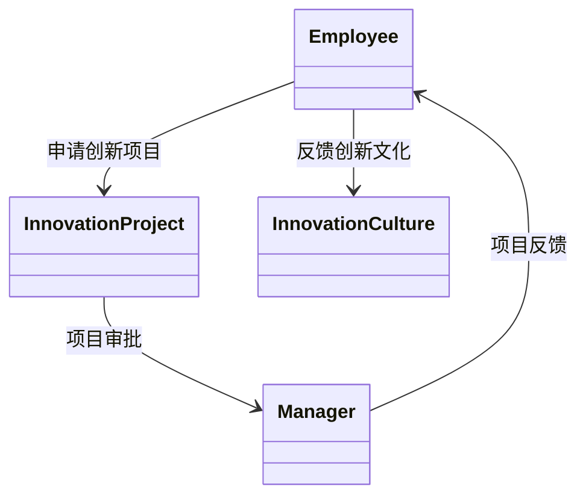
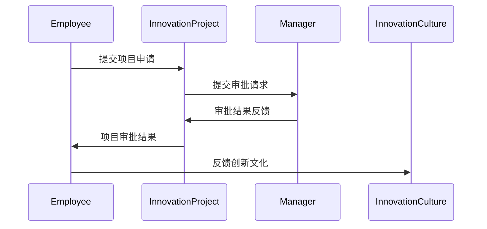
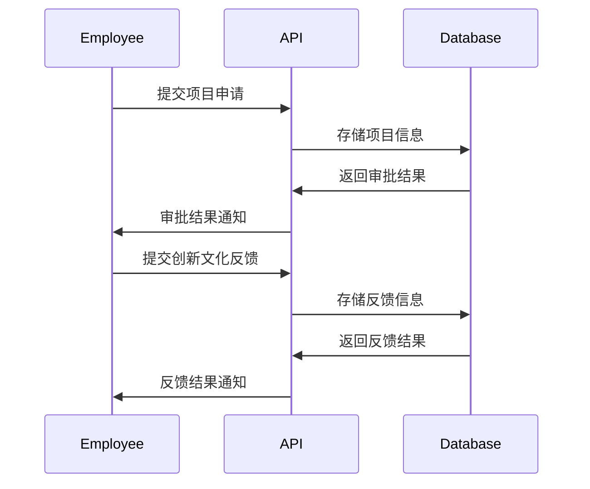
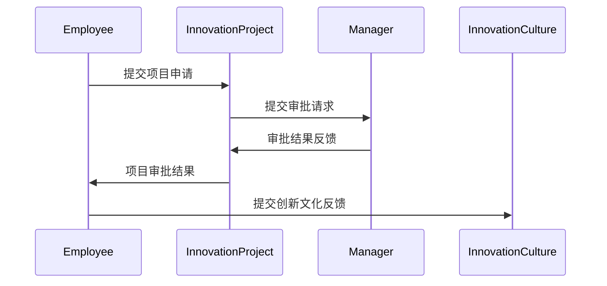

                 

### 引言

#### 1.1 问题背景

在当今快速变化的世界中，企业面临的竞争日益激烈，客户需求不断升级，技术创新日新月异。在这样的环境中，领导力与创新文化成为企业能否持续发展的关键因素。首先，领导力是企业发展的核心推动力，它决定了企业的战略方向、决策速度以及团队执行力。而创新文化则为企业注入了源源不断的创造力，使其能够在不断变化的市场环境中保持竞争力。因此，领导力与创新文化的培育对企业的发展至关重要。

#### 1.2 问题描述

企业如何培养领导力与创新文化？如何将领导力与创新文化融入企业发展的各个方面？如何确保领导力和创新文化在组织中的有效实践和传承？这些都是企业需要深入思考和解决的问题。本篇文章将围绕这些问题，结合实际案例，探讨领导力与创新文化的本质、培养方法以及融合实践，为企业提供一套系统性的解决方案。

#### 1.3 问题解决

通过深入研究领导力与创新文化的本质和内涵，分析成功企业的案例，提炼出有效的培育方法，从而为企业提供一套系统性的解决方案。文章将首先对领导力与创新文化进行概述，接着详细探讨领导力的核心概念与特征，以及领导力的发展与提升方法。然后，文章将分析创新文化的核心概念与特征，并介绍创新文化的建设方法。最后，文章将探讨领导力与创新文化的融合实践，通过具体案例来展示领导力与创新文化如何相互促进，共同推动企业的发展。

#### 1.4 边界与外延

领导力与创新文化的边界包括企业愿景、战略目标、组织结构、人才培养等方面。其外延则涉及到企业文化、创新氛围、激励机制等多个方面。领导力是一种能力，而创新文化则是一种价值观。两者相辅相成，共同作用于企业的长期发展。

#### 1.5 概念结构与核心要素组成

- **领导力**：包括决策能力、沟通能力、激励能力、团队建设能力等。领导者需要具备这些核心能力，以影响和激励他人，共同实现目标。
  
- **创新文化**：包括开放包容、鼓励探索、共享共创等。创新文化是一种氛围，它鼓励员工勇于尝试新事物，不断探索创新，从而推动企业的持续发展。

本文将通过对领导力与创新文化的深入探讨，帮助读者理解如何有效培育和创新文化，提升企业的领导力，从而在激烈的市场竞争中脱颖而出。

### 第一部分：领导力与创新文化概述

#### 1.1 引言

在当今快速变化的市场环境中，企业能否持续发展，关键在于其领导力与创新文化的建设。领导力是一种核心能力，决定了企业的战略方向和执行力；而创新文化则是企业不断适应和引领市场变化的重要驱动力。本部分将对领导力与创新文化的概念、背景、问题和解决方案进行详细探讨，旨在为读者提供一个全面的理解框架。

#### 1.2 领导力的核心概念与特征

**定义**：领导力是指领导者影响和激励他人，共同实现目标的能力。它不仅仅是权威和指挥，更是一种能力，包括决策能力、沟通能力、激励能力和团队建设能力等。

**特征**：

1. **影响力**：领导者能够影响他人的思想和行为，通过个人魅力和专业知识赢得员工的信任和尊重。
2. **决策能力**：领导者能够做出合理、有效的决策，面对复杂情况能够迅速判断和制定行动方案。
3. **沟通能力**：领导者能够有效沟通，传递信息，建立共识，确保团队内部的协调一致。
4. **激励能力**：领导者能够激励团队成员，激发他们的潜能，提升团队的整体绩效。
5. **团队建设能力**：领导者能够构建高效团队，促进团队成员的合作，提升团队的凝聚力。

**对比表格**：

| 特征 | 描述 |
| --- | --- |
| 影响力 | 能够影响他人的思想和行为 |
| 决策能力 | 能够做出合理、有效的决策 |
| 沟通能力 | 能够有效沟通，建立共识 |
| 激励能力 | 能够激励团队成员，提升绩效 |
| 团队建设能力 | 能够构建高效团队，提升凝聚力 |

**ER实体关系图架构**：

```mermaid
erDiagram
  Leader ||--|{ Influence }|
  Leader ||--|{ DecisionMaking }|
  Leader ||--|{ Communication }|
  Leader ||--|{ Motivation }|
  Leader ||--|{ TeamBuilding }|
```

#### 1.3 领导力的发展与提升

**领导力的发展路径**：

1. **初级领导力**：掌握基本领导技能，如沟通、协调、管理等。
2. **中级领导力**：具备决策能力，能够独立处理问题。
3. **高级领导力**：具备战略思维，能够引领企业实现长远发展。

**领导力的提升方法**：

1. **学习**：通过学习，掌握领导力理论和实践方法。
2. **实践**：通过实践，不断锻炼和提升领导能力。
3. **反思**：通过反思，总结经验，不断提升自我。

**算法原理讲解**：

领导力的发展可以视为一个动态过程，其核心是不断学习和实践。以下是一个简化的领导力提升算法：

```python
def leadership_growth(current_level, learning, practice, reflection):
    if learning and practice:
        current_level += 1
    if reflection:
        current_level += 0.5
    return current_level
```

**数学模型和公式**：

领导力提升的数学模型可以表示为：

\[ L(t+1) = L(t) + \alpha \cdot (L_e + L_p + L_r) \]

其中，\( L(t) \) 表示当前领导力水平，\( L_e \), \( L_p \), \( L_r \) 分别表示学习、实践和反思的权重，\( \alpha \) 表示提升因子。

**举例说明**：

假设一位领导者在一个月内通过学习、实践和反思，其领导力水平分别提升了10%、10%和5%。初始领导力水平为50，则一个月后的领导力水平为：

\[ 50 + 0.1 \cdot (50 + 50 + 25) = 66.25 \]

#### 1.4 创新文化的核心概念与特征

**定义**：创新文化是一种以创新为核心价值观，鼓励创新、容忍失败的企业文化。它不仅包括企业对创新的重视程度，还包括企业内部的氛围和机制。

**特征**：

1. **开放包容**：鼓励不同观点的碰撞，尊重个性。
2. **鼓励探索**：鼓励尝试新方法，不断探索未知领域。
3. **共享共创**：共享知识和经验，共同创造价值。
4. **容忍失败**：对失败持开放态度，从中吸取教训。

**对比表格**：

| 特征 | 描述 |
| --- | --- |
| 开放包容 | 鼓励不同观点的碰撞，尊重个性 |
| 鼓励探索 | 鼓励尝试新方法，不断探索未知领域 |
| 共享共创 | 共享知识和经验，共同创造价值 |
| 容忍失败 | 对失败持开放态度，从中吸取教训 |

**ER实体关系图架构**：

```mermaid
erDiagram
  InnovationCulture ||--|{ Openness }|
  InnovationCulture ||--|{ Exploration }|
  InnovationCulture ||--|{ Collaboration }|
  InnovationCulture ||--|{ FailureTolerance }|
```

#### 1.5 创新文化的建设方法

**建设路径**：

1. **制定明确的企业愿景和战略目标**：将创新文化融入企业发展的各个方面，确保所有员工都明确企业的愿景和目标。
2. **构建开放、包容的沟通渠道**：促进信息交流，鼓励员工表达自己的想法和建议。
3. **设立激励机制**：鼓励创新行为，为创新者提供奖励和支持。
4. **建立学习型组织**：提升整体创新能力，鼓励员工不断学习和成长。

**系统分析与架构设计方案**：

**问题场景介绍**：企业希望通过建设创新文化，提升员工的创造力和创新能力。

**项目介绍**：创新文化建设项目，目标是培养员工的创新意识和创新能力。

**系统功能设计（领域模型Mermaid类图）**：



**系统架构设计Mermaid架构图**：



**系统接口设计和系统交互Mermaid序列图**：



#### 1.6 总结与展望

本部分对领导力与创新文化的核心概念、特征和发展方法进行了详细探讨。领导力是企业发展的核心推动力，而创新文化则是企业适应和引领市场变化的重要驱动力。通过构建有效的领导力与创新文化，企业可以提升员工的创造力和创新能力，从而在激烈的市场竞争中保持竞争力。

未来，随着技术的不断进步和市场环境的变化，领导力与创新文化的重要性将愈发凸显。企业需要不断探索和实践，通过系统性的方法和工具，不断提升自身的领导力和创新文化，以应对未来的挑战。

### 第二部分：领导力培养

#### 第2章 领导力的核心概念与特征

**定义**：领导力是指领导者影响和激励他人，共同实现目标的能力。它不仅涉及到个人能力和素质的提升，还包括对团队和组织的有效管理。

**特征**：

1. **影响力**：领导者能够影响他人的思想和行为，通过个人魅力和专业知识赢得员工的信任和尊重。
2. **决策能力**：领导者能够做出合理、有效的决策，面对复杂情况能够迅速判断和制定行动方案。
3. **沟通能力**：领导者能够有效沟通，传递信息，建立共识，确保团队内部的协调一致。
4. **激励能力**：领导者能够激励团队成员，激发他们的潜能，提升团队的整体绩效。
5. **团队建设能力**：领导者能够构建高效团队，促进团队成员的合作，提升团队的凝聚力。

**对比表格**：

| 特征 | 描述 |
| --- | --- |
| 影响力 | 能够影响他人的思想和行为 |
| 决策能力 | 能够做出合理、有效的决策 |
| 沟通能力 | 能够有效沟通，建立共识 |
| 激励能力 | 能够激励团队成员，提升绩效 |
| 团队建设能力 | 能够构建高效团队，提升凝聚力 |

**ER实体关系图架构**：

```mermaid
erDiagram
  Leader ||--|{ Influence }|
  Leader ||--|{ DecisionMaking }|
  Leader ||--|{ Communication }|
  Leader ||--|{ Motivation }|
  Leader ||--|{ TeamBuilding }|
```

#### 第3章 领导力的发展与提升

**领导力的发展路径**：

1. **初级领导力**：掌握基本领导技能，如沟通、协调、管理等。
2. **中级领导力**：具备决策能力，能够独立处理问题。
3. **高级领导力**：具备战略思维，能够引领企业实现长远发展。

**领导力的提升方法**：

1. **通过学习，掌握领导力理论和实践方法**：阅读相关书籍，参加培训课程，学习先进的管理理念和经验。
2. **通过实践，不断锻炼和提升领导能力**：在实际工作中，勇于承担责任，处理各种复杂问题，积累经验。
3. **通过反思，总结经验，不断提升自我**：定期进行自我反思，分析自己的优点和不足，制定改进计划。

**算法原理讲解**：

领导力的发展可以视为一个动态过程，其核心是不断学习和实践。以下是一个简化的领导力提升算法：

```python
def leadership_growth(current_level, learning, practice, reflection):
    if learning and practice:
        current_level += 1
    if reflection:
        current_level += 0.5
    return current_level
```

**数学模型和公式**：

领导力提升的数学模型可以表示为：

\[ L(t+1) = L(t) + \alpha \cdot (L_e + L_p + L_r) \]

其中，\( L(t) \) 表示当前领导力水平，\( L_e \), \( L_p \), \( L_r \) 分别表示学习、实践和反思的权重，\( \alpha \) 表示提升因子。

**举例说明**：

假设一位领导者在一个月内通过学习、实践和反思，其领导力水平分别提升了10%、10%和5%。初始领导力水平为50，则一个月后的领导力水平为：

\[ 50 + 0.1 \cdot (50 + 50 + 25) = 66.25 \]

#### 第4章 领导力在创新文化中的角色与作用

**角色与作用**：

1. **推动创新文化的形成**：领导者通过树立榜样，鼓励员工勇于创新，推动企业形成鼓励创新的文化。
2. **激励员工的创新行为**：领导者通过激励措施，如奖励、认可等，激发员工的创新潜能，促进创新行为的实现。
3. **提供资源和支持**：领导者为企业提供必要的资源和支持，如资金、时间、技术等，为创新提供保障。
4. **引导创新方向**：领导者通过制定战略目标和规划，为企业的创新提供方向和指引。

**算法原理讲解**：

领导力在创新文化中的角色可以视为一个引导和激励的过程，其核心是激发和引导员工的创新行为。以下是一个简化的领导力在创新文化中的作用算法：

```python
def leadership_innovation_support(innovation_level, leadership_support):
    innovation_level += leadership_support
    return innovation_level
```

**数学模型和公式**：

领导力在创新文化中的作用的数学模型可以表示为：

\[ I(t+1) = I(t) + \alpha \cdot L_s \]

其中，\( I(t) \) 表示当前创新水平，\( L_s \) 表示领导力支持，\( \alpha \) 表示提升因子。

**举例说明**：

假设当前创新水平为50，领导力支持为10%。则一个月后的创新水平为：

\[ 50 + 0.1 \cdot 10 = 55 \]

#### 第5章 领导力培养案例分析

**案例一：谷歌的领导力培养**：

谷歌以其独特的领导力培养体系而闻名。谷歌的领导力培养主要包括以下几个方面：

1. **领导力课程**：谷歌为员工提供各种领导力培训课程，帮助员工提升领导技能。
2. **导师制度**：谷歌实行导师制度，为新员工和潜在领导者提供指导和反馈。
3. **实践机会**：谷歌鼓励员工积极参与各种项目，通过实践提升领导力。
4. **反馈机制**：谷歌建立反馈机制，鼓励员工表达意见和建议，不断改进领导力培养体系。

**案例二：腾讯的领导力培养**：

腾讯在领导力培养方面也有独到之处。腾讯的领导力培养主要包括以下几个方面：

1. **领导力模型**：腾讯建立了一套领导力模型，明确领导者的核心能力和行为规范。
2. **领导力认证**：腾讯为员工提供领导力认证，通过认证提升领导力水平。
3. **跨部门交流**：腾讯鼓励员工跨部门交流，通过不同部门的合作提升领导力。
4. **领导力论坛**：腾讯定期举办领导力论坛，邀请内部和外部专家分享领导力经验。

**总结**：

通过案例分析，我们可以看到，不同的企业在领导力培养方面有着各自的特色和优势。但无论是谷歌还是腾讯，他们都认识到领导力培养的重要性，并通过多种方式提升员工的领导力水平。这些实践为其他企业提供了宝贵的借鉴和启示。

### 第三部分：创新文化的建设

#### 第4章 创新文化的核心概念与特征

**定义**：创新文化是一种以创新为核心价值观，鼓励创新、容忍失败的企业文化。它不仅包括企业对创新的重视程度，还包括企业内部的氛围和机制。

**特征**：

1. **开放包容**：鼓励不同观点的碰撞，尊重个性。
2. **鼓励探索**：鼓励尝试新方法，不断探索未知领域。
3. **共享共创**：共享知识和经验，共同创造价值。
4. **容忍失败**：对失败持开放态度，从中吸取教训。

**对比表格**：

| 特征 | 描述 |
| --- | --- |
| 开放包容 | 鼓励不同观点的碰撞，尊重个性 |
| 鼓励探索 | 鼓励尝试新方法，不断探索未知领域 |
| 共享共创 | 共享知识和经验，共同创造价值 |
| 容忍失败 | 对失败持开放态度，从中吸取教训 |

**ER实体关系图架构**：

```mermaid
erDiagram
  InnovationCulture ||--|{ Openness }|
  InnovationCulture ||--|{ Exploration }|
  InnovationCulture ||--|{ Collaboration }|
  InnovationCulture ||--|{ FailureTolerance }|
```

#### 第5章 创新文化的建设方法

**建设路径**：

1. **制定明确的企业愿景和战略目标**：将创新文化融入企业发展的各个方面，确保所有员工都明确企业的愿景和目标。
2. **构建开放、包容的沟通渠道**：促进信息交流，鼓励员工表达自己的想法和建议。
3. **设立激励机制**：鼓励创新行为，为创新者提供奖励和支持。
4. **建立学习型组织**：提升整体创新能力，鼓励员工不断学习和成长。

**系统分析与架构设计方案**：

**问题场景介绍**：企业希望通过建设创新文化，提升员工的创造力和创新能力。

**项目介绍**：创新文化建设项目，目标是培养员工的创新意识和创新能力。

**系统功能设计（领域模型Mermaid类图）**：


**系统架构设计Mermaid架构图**：



**系统接口设计和系统交互Mermaid序列图**：


#### 第6章 创新文化的实践案例

**案例一：谷歌的创新文化**

谷歌以其开放包容、鼓励探索和共享共创的创新文化而著称。谷歌的创新文化主要体现在以下几个方面：

1. **20%时间制度**：谷歌允许员工将20%的工作时间用于个人感兴趣的项目，这激发了员工的创新潜能，诞生了许多成功的创新产品，如Gmail和Google News。
2. **黑客松**：谷歌定期举办黑客松活动，鼓励员工跨界合作，快速构建原型，这些活动不仅提升了员工的技能，还推动了公司的创新。
3. **内部分享**：谷歌鼓励员工分享知识，通过内部讲座、博客和邮件列表等形式，促进知识的传播和交流。

**案例二：特斯拉的创新文化**

特斯拉以其独特的企业文化而闻名，这种文化强调快速迭代和容忍失败。特斯拉的创新文化主要体现在以下几个方面：

1. **快速迭代**：特斯拉采用敏捷开发方法，快速迭代产品，通过不断的实验和测试，不断优化产品。
2. **扁平化管理**：特斯拉采用扁平化的管理结构，鼓励员工自由表达观点，这种开放的氛围促进了创新。
3. **容忍失败**：特斯拉鼓励员工勇于尝试，即使失败也不会受到惩罚，这种文化使得员工敢于冒险，推动了创新。

**总结**：

通过这些案例，我们可以看到，成功的创新文化不仅仅是鼓励员工创新，还包括提供支持和资源，建立开放的氛围，以及容忍失败。这些实践为其他企业提供了宝贵的经验和启示，帮助企业建立和培养创新文化。

### 第四部分：领导力与创新文化的融合实践

#### 第6章 领导力与创新文化的融合

**6.1 领导力与创新文化的内在联系**

领导力与创新文化之间存在着紧密的内在联系。首先，领导力是创新文化的基础，领导者通过其决策能力、沟通能力和激励能力，直接影响企业的创新氛围和员工的行为。其次，创新文化是领导力的重要体现，它反映了企业的价值观和管理哲学。成功的领导者会积极推动创新文化的建设，通过自身的行动和榜样作用，激发员工的创新潜能。

**6.2 领导力与创新文化的融合方法**

1. **树立创新价值观**：领导者需要将创新价值观融入企业的核心价值观中，使员工认识到创新对于企业的重要性。
2. **建立激励机制**：通过设立创新奖励机制，激励员工积极参与创新活动，提升创新文化的氛围。
3. **加强沟通与协作**：领导者需要建立有效的沟通机制，促进团队内部的协作和知识共享，为创新提供支持。
4. **提供资源与支持**：领导者需要为创新活动提供必要的资源和支持，如资金、技术和时间等。
5. **容忍失败**：领导者需要营造一种开放的氛围，鼓励员工勇于尝试，即使失败也不会受到惩罚。

**算法原理讲解**

领导力与创新文化的融合可以视为一个系统化的过程，其核心是通过领导力的各个方面推动创新文化的形成和持续发展。以下是一个简化的融合算法：

```python
def leadership_innovation_fusion(leadership_skills, innovation_culture, resources):
    innovation_impact = (leadership_skills * innovation_culture + resources) / 2
    return innovation_impact
```

**数学模型和公式**

融合效果的数学模型可以表示为：

\[ I = L \cdot C + R \]

其中，\( I \) 表示创新效果，\( L \) 表示领导力水平，\( C \) 表示创新文化水平，\( R \) 表示资源投入。

**举例说明**

假设领导力水平为70，创新文化水平为60，资源投入为50。则创新效果为：

\[ I = 70 \cdot 60 + 50 = 4400 \]

这意味着在当前条件下，企业可以期待一个较高的创新效果。

#### 第7章 领导力与创新文化的融合实践案例

**7.1 谷歌的领导力与创新文化**

谷歌以其独特的领导力与创新文化的融合而闻名。谷歌的领导者，如拉里·佩奇和谢尔盖·布林，通过树立创新价值观、建立激励机制、加强沟通与协作以及提供资源与支持，成功推动了创新文化的建设。

1. **创新价值观**：谷歌的领导者将创新作为企业核心价值观之一，强调快速迭代和用户至上，这为员工提供了明确的方向和目标。
2. **激励机制**：谷歌通过设立“创新奖金”和“20%时间制度”，鼓励员工积极尝试新项目，激发了员工的工作热情和创造力。
3. **沟通与协作**：谷歌建立了开放的沟通渠道，如内部邮件、博客和团队会议等，促进了知识共享和协作，为创新提供了坚实的基础。
4. **资源与支持**：谷歌为创新项目提供了充足的资源和支持，包括资金、技术和团队等，确保创新项目能够顺利推进。
5. **容忍失败**：谷歌鼓励员工勇于尝试，即使失败也不会受到惩罚，这种开放的氛围使得员工敢于冒险，推动了创新。

**7.2 腾讯的领导力与创新文化**

腾讯也在领导力与创新文化的融合方面取得了显著成果。腾讯的领导者通过建立学习型组织、设立创新激励机制和提供资源与支持，成功推动了创新文化的建设。

1. **学习型组织**：腾讯强调员工不断学习和成长，通过内部培训和外部交流，提升了员工的技能和创新能力。
2. **创新激励机制**：腾讯通过设立“创新奖”和“最佳创新项目”评选，激励员工积极参与创新活动，提升了创新文化的氛围。
3. **资源与支持**：腾讯为创新项目提供了充足的资源和支持，包括资金、技术和团队等，确保创新项目能够顺利推进。
4. **容忍失败**：腾讯鼓励员工勇于尝试，即使失败也不会受到惩罚，这种开放的氛围使得员工敢于冒险，推动了创新。

**总结**

通过谷歌和腾讯的案例，我们可以看到，领导力与创新文化的融合是推动企业持续创新的关键。领导者需要通过树立创新价值观、建立激励机制、加强沟通与协作以及提供资源与支持，营造一个鼓励创新和容忍失败的文化氛围，从而激发员工的创新潜能，推动企业的持续发展。

### 第8章 总结与展望

#### 8.1 领导力与创新文化的融合意义

领导力与创新文化的融合对于企业的发展具有重要意义。首先，它有助于提升企业的核心竞争力。通过领导者的引导和激励，员工可以更加积极投入到创新活动中，从而推动企业的技术创新和产品创新。其次，融合的领导力与创新文化有助于促进企业的可持续发展。创新是企业发展的重要驱动力，而领导力则是确保创新活动能够顺利实施的关键。最后，领导力与创新文化的融合有助于营造一个积极向上的企业文化，提升员工的满意度和忠诚度，从而提高企业的整体绩效。

#### 8.2 未来发展方向

未来，企业需要进一步探索领导力与创新文化的融合机制，以便更好地应对快速变化的市场环境。以下是一些未来发展的方向：

1. **构建系统化的领导力培养体系**：企业应建立系统化的领导力培养体系，通过培训、实践和反馈等环节，全面提升领导者的领导能力。
2. **深化创新文化的建设**：企业应不断深化创新文化的建设，通过设立激励机制、构建开放沟通渠道和提供资源支持等手段，营造一个鼓励创新和容忍失败的文化氛围。
3. **加强跨部门协作**：企业应加强跨部门协作，促进不同部门之间的知识共享和资源整合，从而提升整体创新能力。
4. **注重领导者的角色定位**：领导者应明确自身的角色定位，不仅要在战略层面上推动创新，还要在执行层面上提供支持和资源，确保创新活动能够顺利实施。

总之，领导力与创新文化的融合是企业发展的重要课题，企业需要不断探索和实践，以提升自身的核心竞争力和可持续发展能力。通过构建系统化的领导力培养体系和深化创新文化的建设，企业可以更好地应对市场变化，推动持续创新，实现长远发展。

### 作者信息

**作者：AI天才研究院/AI Genius Institute & 禅与计算机程序设计艺术 /Zen And The Art of Computer Programming**

