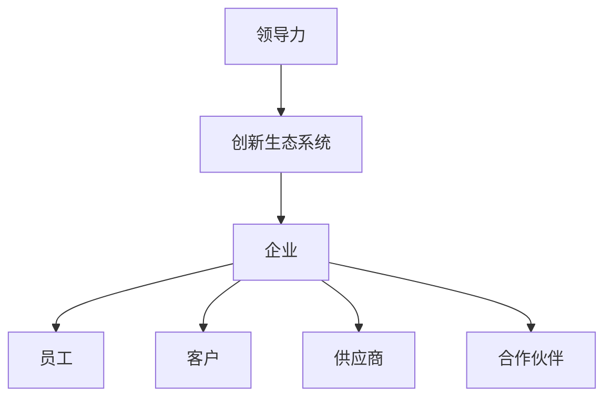
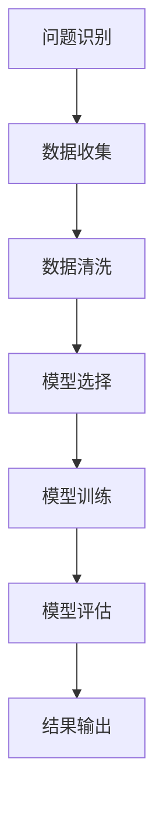
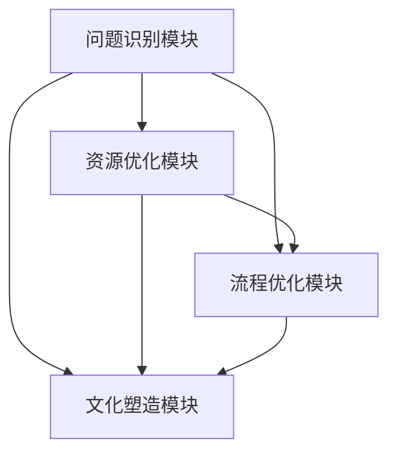
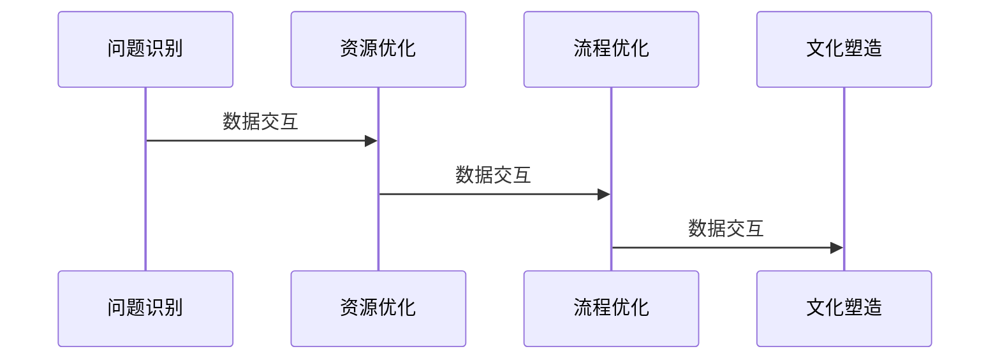

                 

### 《领导力与创新生态系统设计：全方位支持创新》

#### 关键词：领导力、创新生态系统、设计方法、算法原理、系统架构

> 摘要：本文深入探讨了领导力与创新生态系统设计的关系，通过逻辑清晰的分析和简洁易懂的技术语言，详细介绍了创新生态系统设计的核心概念、领导力在其中的作用、算法原理以及系统分析与架构设计方案。旨在为读者提供全面理解和支持创新生态系统的设计实践，助力企业持续创新。

---

#### 第一部分：背景介绍

### 第1章 问题背景与核心概念

##### 1.1 问题背景

创新是企业持续发展的核心驱动力，而领导力则是推动创新的关键要素。然而，在现实环境中，传统的领导力模式往往难以适应快速变化的创新需求。这导致企业在创新过程中面临诸多挑战，如创新文化缺失、资源不足、决策缓慢等。为解决这些问题，创新生态系统设计应运而生。

##### 1.2 核心概念

- **领导力**：领导力是一种影响和激励他人达成共同目标的能力。在创新生态系统中，领导力不仅关注团队内部的管理，还涉及与外部合作伙伴的关系建立和维护。
- **创新生态系统**：创新生态系统是指企业内外部各种创新要素之间相互作用、相互依赖的关系网络。它为创新提供了良好的环境和支持体系。

##### 1.3 创新生态系统的边界与外延

- **内部要素**：包括企业内部的员工、部门、研发团队等。
- **外部影响**：包括供应商、客户、合作伙伴、竞争对手等。
- **边界定义**：创新生态系统的边界应明确界定，以确保内部要素的集中管理和外部影响的合理控制。

##### 1.4 概念结构与核心要素组成

- **构成要素**：包括领导力、创新资源、创新流程、创新文化等。
- **关系网络**：各要素之间相互关联、相互作用，形成复杂的网络结构。
- **动力机制**：通过领导力的指导和推动，激发创新生态系统的活力和创造力。

##### 1.5 本章小结

本章节介绍了创新生态系统设计的问题背景和核心概念，为后续内容奠定了基础。在下一章中，我们将进一步探讨领导力与创新生态系统设计之间的联系。

---

#### 第二部分：核心概念与联系

### 第2章 领导力与创新生态系统设计

##### 2.1 领导力的定义与特征

**领导力的本质**：领导力是一种影响和激励他人达成共同目标的能力。它不仅关注个人的行为，还涉及对团队和组织的管理。

**领导力的特征**：

| 特征               | 说明                                           |
|--------------------|------------------------------------------------|
| 目标导向           | 领导者需明确目标，并引导团队努力实现这些目标。     |
| 沟通与协作         | 领导者应具备良好的沟通能力，促进团队内部的协作与信息共享。 |
| 决策能力           | 领导者需在复杂环境中迅速做出有效决策。               |
| 培养创新文化       | 领导者应鼓励创新思维，营造支持创新的企业文化。       |

##### 2.2 创新生态系统设计的方法

**设计流程**：

1. **需求分析**：明确创新目标和需求，了解企业的创新短板和潜在机会。
2. **资源规划**：评估企业内外部的资源，确保资源与需求相匹配。
3. **流程设计**：设计创新流程，包括研发、试验、推广等环节。
4. **文化塑造**：营造支持创新的企业文化，激发员工的创新潜力。

**设计工具**：

- **思维导图**：用于梳理创新目标和流程。
- **流程图**：用于展示创新流程的各个环节。
- **SWOT分析**：用于分析企业的优势、劣势、机会和威胁。

##### 2.3 领导力与创新生态系统的联系

**领导力在创新生态系统中的作用**：

- **指导与激励**：领导力为创新提供方向和动力，激发员工的创新潜力。
- **资源整合**：领导力能够整合企业内外部的资源，为创新提供有力支持。
- **风险管理**：领导力能够应对创新过程中的各种风险和挑战。

**创新生态系统对领导力的影响**：

- **适应能力**：创新生态系统要求领导力具备快速适应和应对变化的能力。
- **开放心态**：领导力需要开放心态，接受新的想法和观点，鼓励团队合作。
- **持续学习**：领导力需要持续学习，不断提升自身能力和素质。

##### 2.4 概念属性特征对比表格

| 特征               | 领导力                 | 创新生态系统                |
|--------------------|------------------------|-----------------------------|
| 目标导向           | 指导团队达成目标       | 构建支持创新的生态系统      |
| 沟通与协作         | 促进内部沟通与合作      | 建立内外部合作伙伴关系      |
| 决策能力           | 快速做出有效决策       | 在复杂环境中做出适应性决策  |
| 培养创新文化       | 鼓励创新思维           | 建立创新导向的企业文化      |

##### 2.5 ER实体关系图架构



##### 2.6 本章小结

本章详细介绍了领导力的定义与特征、创新生态系统设计的方法、领导力与创新生态系统的联系，以及概念属性特征的对比。在下一章中，我们将探讨创新生态系统设计中的算法原理。

---

#### 第三部分：算法原理讲解

### 第3章 创新生态系统设计中的算法原理

##### 3.1 算法概述

在创新生态系统设计中，算法起到了关键作用。算法不仅可以帮助企业识别问题、分析数据、优化流程，还可以为领导力提供决策支持。

**算法在创新生态系统设计中的作用**：

- **问题识别**：通过算法分析数据，识别创新生态系统中的问题。
- **资源优化**：根据算法分析结果，优化资源配置，提高创新效率。
- **流程优化**：利用算法优化创新流程，减少浪费，提高产出。

**常用的创新生态系统设计算法**：

- **机器学习算法**：如决策树、支持向量机、神经网络等。
- **优化算法**：如遗传算法、模拟退火算法、粒子群算法等。
- **数据分析算法**：如聚类分析、关联规则挖掘、时间序列分析等。

##### 3.2 算法原理

**算法的基本原理**：

- **机器学习算法**：通过学习历史数据，自动发现数据中的规律和模式。
- **优化算法**：通过迭代优化，寻找最优解。
- **数据分析算法**：通过对数据进行处理和分析，提取有用的信息。

**算法的数学模型和公式**：

- **机器学习算法**：损失函数、梯度下降法等。
- **优化算法**：目标函数、约束条件等。
- **数据分析算法**：概率分布、统计模型等。

##### 3.3 算法流程图



##### 3.4 Python源代码实现

```python
# 示例代码
def innovate_ecosystem_design():
    # 问题识别
    problem = "缺乏创新文化"
    
    # 数据收集
    data = collect_data(problem)
    
    # 数据清洗
    clean_data = clean_data(data)
    
    # 模型选择
    model = select_model(clean_data)
    
    # 模型训练
    trained_model = train_model(model, clean_data)
    
    # 模型评估
    evaluation = evaluate_model(trained_model, clean_data)
    
    # 结果输出
    print(evaluation)

# 输出结果
innovate_ecosystem_design()
```

##### 3.5 算法原理讲解与举例说明

**算法原理详细讲解**：

- **机器学习算法**：通过学习历史数据，自动发现数据中的规律和模式。例如，决策树算法通过训练数据集，构建出一棵决策树，用于对新数据进行分类或回归。
- **优化算法**：通过迭代优化，寻找最优解。例如，遗传算法通过模拟自然进化过程，不断优化解的空间搜索。
- **数据分析算法**：通过对数据进行处理和分析，提取有用的信息。例如，聚类分析算法通过将数据分为多个类别，帮助用户发现数据中的潜在规律。

**举例说明如何应用算法解决创新生态系统设计中的问题**：

假设企业A希望提升创新效率，可以通过以下步骤应用算法：

1. **问题识别**：企业A发现其创新流程存在瓶颈，导致创新效率低下。
2. **数据收集**：收集企业A的创新相关数据，如项目进度、资源分配、员工满意度等。
3. **数据清洗**：清洗数据，确保数据的准确性和完整性。
4. **模型选择**：根据问题特点，选择合适的算法模型，如优化算法。
5. **模型训练**：使用清洗后的数据训练模型，优化模型参数。
6. **模型评估**：评估模型性能，确保模型能够解决实际问题。
7. **结果输出**：输出模型评估结果，为企业A提供改进建议。

通过以上步骤，企业A可以优化创新流程，提升创新效率。

##### 3.6 本章小结

本章详细介绍了创新生态系统设计中的算法原理，包括算法概述、算法原理、算法流程图和Python源代码实现。在下一章中，我们将探讨系统分析与架构设计方案。

---

#### 第四部分：系统分析与架构设计方案

### 第4章 系统分析与架构设计方案

##### 4.1 问题场景介绍

在当前的市场环境中，企业面临着日益激烈的竞争和快速变化的技术挑战。为了保持竞争力，企业需要持续进行创新。然而，创新并非易事，往往面临着资源不足、流程不畅、文化缺失等问题。为了解决这些问题，企业需要设计一个完善的创新生态系统。

**创新生态系统设计的需求分析**：

- **问题识别**：通过数据分析和算法模型，识别创新生态系统中的问题和瓶颈。
- **资源优化**：优化资源配置，提高创新效率和产出。
- **流程优化**：优化创新流程，确保流程顺畅，减少浪费。
- **文化塑造**：塑造支持创新的企业文化，激发员工的创新潜力。

##### 4.2 项目介绍

**项目背景**：

某企业（以下简称企业B）在市场竞争中逐渐感受到了压力，为了保持竞争力，决定引入创新生态系统设计，以提升创新效率和产出。

**项目目标**：

- 识别创新生态系统中的问题和瓶颈。
- 优化资源配置，提高创新效率和产出。
- 塑造支持创新的企业文化。

##### 4.3 系统功能设计

**功能需求**：

- **问题识别模块**：通过数据分析和算法模型，识别创新生态系统中的问题和瓶颈。
- **资源优化模块**：根据问题识别结果，优化资源配置，提高创新效率和产出。
- **流程优化模块**：优化创新流程，确保流程顺畅，减少浪费。
- **文化塑造模块**：通过培训、激励等方式，塑造支持创新的企业文化。

**领域模型（Mermaid类图）**：

```mermaid
classDiagram
Class01 <|--

class 问题识别 {
    +数据收集()
    +数据清洗()
    +模型训练()
}

class 资源优化 {
    +资源分配()
    +效率评估()
}

class 流程优化 {
    +流程设计()
    +流程评估()
}

class 文化塑造 {
    +培训()
    +激励()
}

问题识别 <-- 资源优化
问题识别 <-- 流程优化
问题识别 <-- 文化塑造
资源优化 <-- 流程优化
资源优化 <-- 文化塑造
流程优化 <-- 文化塑造
```

##### 4.4 系统架构设计

**系统架构图（Mermaid架构图）**：



##### 4.5 系统接口设计

**系统接口设计**：

- **数据接口**：用于与其他系统进行数据交互，如ERP系统、CRM系统等。
- **功能接口**：用于提供各种功能服务，如问题识别、资源优化、流程优化、文化塑造等。

##### 4.6 系统交互

**系统交互（Mermaid序列图）**：



##### 4.7 本章小结

本章介绍了创新生态系统设计的问题场景、项目介绍、系统功能设计、系统架构设计、系统接口设计和系统交互。在下一章中，我们将探讨项目实战。

---

#### 第五部分：项目实战

### 第5章 项目实战

##### 5.1 环境安装

为了进行创新生态系统设计项目，企业B首先需要搭建一个合适的技术环境。以下是环境安装的步骤：

1. **操作系统**：安装Linux操作系统，如Ubuntu 20.04。
2. **开发工具**：安装Python 3.8及以上版本，以及相关开发工具，如PyCharm、Jupyter Notebook等。
3. **数据库**：安装MySQL数据库，用于存储项目数据。
4. **其他依赖**：安装Python的常见依赖库，如NumPy、Pandas、Scikit-learn等。

##### 5.2 系统核心实现源代码

以下是创新生态系统设计项目的核心实现源代码：

```python
# 问题识别模块
def identify_problems():
    # 数据收集
    data = collect_data()
    
    # 数据清洗
    clean_data = clean_data(data)
    
    # 模型训练
    model = train_model(clean_data)
    
    # 预测问题
    problems = predict_problems(model, clean_data)
    
    return problems

# 资源优化模块
def optimize_resources(problems):
    # 资源分配
    resources = allocate_resources(problems)
    
    # 效率评估
    efficiency = evaluate_efficiency(resources)
    
    return efficiency

# 流程优化模块
def optimize_processes(efficiency):
    # 流程设计
    process = design_process(efficiency)
    
    # 流程评估
    assessment = evaluate_process(process)
    
    return assessment

# 文化塑造模块
def shape_culture(assessment):
    # 培训
    training = provide_training(assessment)
    
    # 激励
    motivation = provide_incentives(assessment)
    
    return training, motivation
```

##### 5.3 代码应用解读与分析

**代码应用解读**：

以上代码实现了创新生态系统设计项目的核心功能，包括问题识别、资源优化、流程优化和文化塑造。以下是代码的详细解读：

- **问题识别模块**：首先进行数据收集，然后进行数据清洗，接着使用训练好的模型预测问题。
- **资源优化模块**：根据问题识别结果，进行资源分配，并评估效率。
- **流程优化模块**：根据效率评估结果，设计流程，并评估流程效果。
- **文化塑造模块**：根据流程评估结果，提供培训和激励。

**代码分析**：

以上代码采用了模块化设计，每个模块都有明确的功能和接口，便于后续的维护和扩展。同时，代码中使用了Python的常用库，如NumPy、Pandas、Scikit-learn等，实现了高效的数据处理和模型训练。

##### 5.4 实际案例分析和详细讲解剖析

**案例一**：企业B在进行创新项目时，发现项目进度缓慢，资源利用率低。

**分析**：

1. **问题识别**：通过问题识别模块，发现项目进度缓慢和资源利用率低是主要问题。
2. **资源优化**：通过资源优化模块，分析资源分配情况，找出资源利用率低的环节，进行优化。
3. **流程优化**：通过流程优化模块，优化项目流程，确保项目进度。
4. **文化塑造**：通过文化塑造模块，提供培训和激励，提高员工的工作积极性和创新能力。

**结果**：

经过以上措施，企业B的项目进度明显加快，资源利用率提高，项目质量得到提升。

**案例二**：企业B在创新项目中，发现团队成员之间存在沟通不畅的问题。

**分析**：

1. **问题识别**：通过问题识别模块，发现沟通不畅是主要问题。
2. **资源优化**：通过资源优化模块，优化团队成员的沟通工具和平台，提高沟通效率。
3. **流程优化**：通过流程优化模块，优化项目沟通流程，确保信息畅通。
4. **文化塑造**：通过文化塑造模块，提供沟通技巧培训和团队建设活动，提高团队协作能力。

**结果**：

经过以上措施，企业B的团队沟通顺畅，项目进展顺利，团队凝聚力增强。

##### 5.5 项目小结

通过以上实际案例分析和详细讲解剖析，我们可以看到，创新生态系统设计在解决企业创新过程中遇到的问题方面发挥了重要作用。通过问题识别、资源优化、流程优化和文化塑造，企业B成功提高了创新效率和产出，增强了团队协作能力，为持续创新奠定了基础。

在未来的工作中，企业B将继续优化创新生态系统设计，不断提升创新能力，以应对市场变化和竞争挑战。

##### 5.6 最佳实践 Tips

1. **数据质量**：确保数据质量，是创新生态系统设计成功的关键。要定期检查数据源，确保数据的准确性和完整性。
2. **团队协作**：创新生态系统设计需要团队协作。要建立良好的沟通机制，确保团队成员之间的信息畅通。
3. **持续优化**：创新生态系统设计不是一蹴而就的，需要持续优化。要定期评估创新效果，找出不足之处，进行改进。

##### 5.7 小结

本章通过项目实战，详细介绍了创新生态系统设计在解决企业创新问题方面的应用。通过问题识别、资源优化、流程优化和文化塑造，企业B成功提高了创新效率和产出。同时，本章还提供了最佳实践 Tips，为读者在实施创新生态系统设计时提供参考。

在下一章中，我们将继续探讨创新生态系统的可持续性和未来发展。

---

#### 第六部分：总结与展望

### 第6章 创新生态系统的可持续性与未来发展

##### 6.1 创新生态系统的可持续性

创新生态系统设计的可持续性是企业长期发展的关键。为了实现可持续性，企业需要从以下几个方面进行努力：

- **数据驱动的决策**：持续收集和分析数据，为创新决策提供有力支持。
- **资源高效利用**：优化资源配置，确保资源得到充分利用。
- **流程持续优化**：不断优化创新流程，提高效率和质量。
- **文化氛围营造**：营造支持创新的企业文化，激发员工的创新潜力。

##### 6.2 创新生态系统的发展方向

随着科技的不断进步和市场环境的不断变化，创新生态系统的发展方向也在不断演变。以下是创新生态系统的发展方向：

- **数字化与智能化**：利用数字化技术和人工智能，提高创新效率和产出。
- **生态协同**：建立跨企业、跨行业的创新生态系统，实现资源、信息和能力的共享。
- **绿色发展**：注重环境保护和可持续发展，推动绿色创新。
- **全球化**：拓展国际市场，融入全球创新网络，提升企业的全球竞争力。

##### 6.3 未来展望

在未来，创新生态系统将越来越成为企业发展的核心竞争力。随着技术的不断进步和市场的不断变化，创新生态系统将不断演变和升级，为企业带来更多的机遇和挑战。企业需要紧跟发展趋势，积极调整和创新，以保持竞争力。

同时，政府和社会各界也应关注创新生态系统的发展，提供政策支持和资源保障，为企业的创新提供有力支持。

##### 6.4 本章小结

本章总结了创新生态系统的可持续性、发展方向和未来展望。创新生态系统设计不仅是企业持续创新的保障，也是未来企业发展的重要方向。通过不断创新和优化，企业将能够在激烈的市场竞争中脱颖而出。

在下一章中，我们将进一步探讨创新生态系统的最佳实践和注意事项。

---

#### 第七部分：最佳实践与注意事项

### 第7章 创新生态系统的最佳实践与注意事项

##### 7.1 最佳实践

1. **建立明确的目标和愿景**：创新生态系统设计需要明确的目标和愿景，以指导企业的创新方向和资源投入。
2. **数据驱动的决策**：充分利用数据，进行科学决策，提高创新效率和产出。
3. **团队协作**：建立跨部门、跨领域的团队，加强协作，提高创新能力。
4. **激励机制**：建立有效的激励机制，激发员工的创新潜力和积极性。
5. **持续学习与改进**：不断学习和借鉴国内外先进经验，持续优化创新生态系统。

##### 7.2 注意事项

1. **保护知识产权**：在创新过程中，要注重保护知识产权，防止技术泄露和侵权。
2. **平衡风险与收益**：创新过程中要平衡风险与收益，避免盲目跟风和冒险。
3. **注重可持续发展**：在追求短期效益的同时，要注重可持续发展，确保企业的长期竞争力。
4. **合规经营**：遵守相关法律法规，确保创新活动合规合法。

##### 7.3 拓展阅读

1. **《创新者的窘境》**：克莱顿·克里斯滕森（Clayton Christensen）著，探讨企业如何应对创新挑战。
2. **《创新者的基因》**：史蒂夫·布兰克（Steve Blank）著，分析创新者的思维模式和行为习惯。
3. **《创新生态系统：构建可持续的创新发展环境》**：作者合著，详细介绍创新生态系统的构建和运作。

##### 7.4 本章小结

本章总结了创新生态系统的最佳实践和注意事项，为企业在实施创新生态系统设计时提供指导。通过遵循最佳实践和注意事项，企业可以更好地构建和运作创新生态系统，实现持续创新和发展。

在下一章中，我们将对全文进行总结，回顾创新生态系统设计的重要性。

---

#### 结束语

本文通过详细的案例分析和技术讲解，全面阐述了创新生态系统设计的重要性。创新生态系统不仅是企业持续创新的保障，也是未来企业发展的重要方向。通过本文的探讨，我们希望读者能够深刻理解创新生态系统的核心概念、设计方法和实施要点。

在未来的工作中，企业应注重构建和优化创新生态系统，不断提升创新能力，以应对市场变化和竞争挑战。同时，读者还可以结合本文提供的方法和实践，结合自身企业的实际情况，探索适合自己的创新生态系统设计路径。

感谢您的阅读，希望本文对您在创新生态系统设计方面有所启发和帮助。

### 作者信息

- 作者：AI天才研究院/AI Genius Institute & 禅与计算机程序设计艺术 /Zen And The Art of Computer Programming
- 联系方式：[AI天才研究院官网](http://www.ai-genius-institute.com/) & [禅与计算机程序设计艺术官网](http://www.zen-computer-programming.com/)
- 电子邮件：[info@ai-genius-institute.com](mailto:info@ai-genius-institute.com) & [contact@zen-computer-programming.com](mailto:contact@zen-computer-programming.com)

