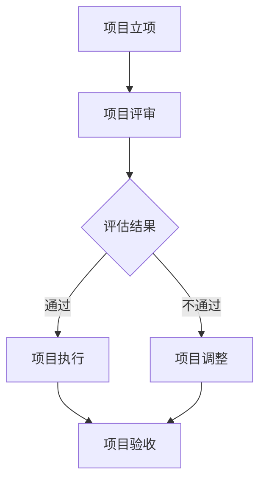
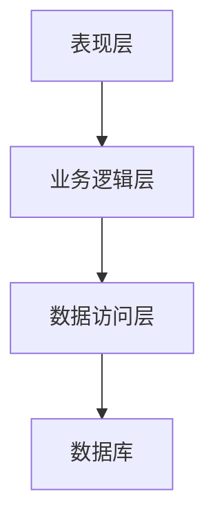

                 

# 领导力与创新生态：打造创新友好的环境

## 关键词：领导力、创新能力、创新生态、企业文化、组织发展

> 摘要：本文深入探讨领导力与创新生态之间的关系，分析领导者如何通过提升自身领导力，构建创新友好型环境，激发员工的创新潜能，推动企业持续发展。

## 第二部分：领导力与创新的关系

### 第2章：领导力对创新能力的影响

领导力是推动企业创新发展的关键因素。领导者通过设定愿景、激发员工潜力、营造创新文化等手段，直接影响企业的创新能力。在这一章中，我们将详细分析领导力在以下几个方面对创新能力的影响：

#### 2.1 愿景设定

领导者的愿景和目标能够激发员工的创新动力，明确创新方向。一个清晰的愿景不仅能指导企业的发展，还能激励员工为实现这一愿景而努力创新。领导者在设定愿景时，需要确保愿景具有前瞻性、可操作性和激励性。

**领导力对愿景设定的影响：**
- **前瞻性**：领导者应具备洞察未来市场趋势和技术发展的能力，设定具有前瞻性的愿景。
- **可操作性**：愿景应具有明确的实施路径和可衡量的目标，以便员工能够清晰地理解并参与其中。
- **激励性**：愿景应能够激发员工的激情和创造力，使员工愿意为实现愿景付出努力。

#### 2.2 员工激励

领导者通过激励措施，如奖励制度、晋升机会等，激发员工的创新积极性。有效的激励机制不仅能够激发员工的创新热情，还能提高员工的归属感和忠诚度。

**领导力对员工激励的影响：**
- **奖励制度**：设立合理的奖励制度，对创新成果显著的员工给予物质和精神奖励。
- **晋升机会**：为员工提供晋升机会，激励员工不断学习和成长，提升创新能力。
- **认可与支持**：领导者应认可员工的创新努力和成果，给予充分的肯定和支持。

#### 2.3 文化营造

领导者通过营造一个鼓励创新、容忍失败的组织文化，为员工提供创新的空间和支持。创新文化不仅能够激发员工的创新潜能，还能培养员工的创新思维和创新能力。

**领导力对文化营造的影响：**
- **鼓励创新**：领导者应鼓励员工勇于尝试新想法，并对创新失败持开放态度。
- **容忍失败**：领导者应建立容忍失败的文化，让员工在创新过程中能够放下顾虑，自由探索。
- **共享知识**：领导者应鼓励员工分享知识和经验，形成知识共享的氛围，促进创新。

#### 2.4 资源调配

领导者通过合理调配资源，如资金、技术、人才等，为创新提供必要的保障。资源的合理调配能够确保创新项目的顺利推进，提高创新成功率。

**领导力对资源调配的影响：**
- **资金支持**：为创新项目提供充足的资金支持，确保项目能够顺利进行。
- **技术支持**：为创新团队提供先进的技术支持和工具，提高创新效率。
- **人才配置**：为创新项目配备合适的人才，发挥团队成员的专长和创造力。

### 第2章小结

领导力对创新能力的影响主要体现在愿景设定、员工激励、文化营造和资源调配等方面。一个优秀的领导者能够通过这些手段激发员工的创新潜能，营造创新友好型环境，推动企业持续发展。在下一章中，我们将探讨创新能力对领导力的影响，以及领导力与创新能力之间的互动关系。

## 第三部分：创新能力对领导力的要求

### 第3章：创新能力对领导力的挑战与要求

随着企业创新能力的提升，领导者面临新的挑战和更高的要求。创新能力不仅影响企业的竞争力，也对领导力提出了新的考验。在这一章中，我们将探讨创新能力对领导力的挑战，以及领导者应具备的能力。

#### 3.1 快速学习与适应能力

随着技术的快速发展，领导者需要不断学习新知识、新技能，以适应变化。快速学习与适应能力是领导者应对创新能力提升的重要能力之一。

**快速学习与适应能力对领导力的影响：**
- **持续学习**：领导者应保持持续学习的态度，不断提升自己的知识水平和技能。
- **适应变化**：领导者应具备适应变化的能力，及时调整自己的思维和行为，以应对快速变化的市场和技术环境。

#### 3.2 决策能力

在创新过程中，领导者需要做出快速而准确的决策，平衡风险与机遇。决策能力是领导者应对创新能力提升的重要能力之一。

**决策能力对领导力的影响：**
- **快速决策**：领导者应在面临创新问题时，能够快速做出决策，抓住市场机遇。
- **平衡风险与机遇**：领导者应在创新过程中，平衡风险与机遇，确保创新项目能够顺利推进。

#### 3.3 沟通与协调能力

领导者需要有效沟通，协调内外部资源，推动创新项目的顺利进行。沟通与协调能力是领导者应对创新能力提升的重要能力之一。

**沟通与协调能力对领导力的影响：**
- **内部沟通**：领导者应与团队成员保持密切沟通，确保团队成员对创新项目有清晰的理解和目标。
- **外部协调**：领导者应与外部合作伙伴保持良好关系，为创新项目争取必要的资源和支持。

#### 3.4 风险管理能力

创新能力提升往往伴随着更高的风险。领导者需要具备风险管理能力，确保创新项目的成功。

**风险管理能力对领导力的影响：**
- **识别风险**：领导者应能够识别创新过程中的潜在风险，并制定相应的应对策略。
- **风险控制**：领导者应能够有效控制风险，确保创新项目在可控范围内进行。

### 第3章小结

创新能力对领导力提出了新的挑战和更高的要求。领导者需要具备快速学习与适应能力、决策能力、沟通与协调能力和风险管理能力，以应对创新能力提升带来的挑战。在下一章中，我们将探讨领导力与创新能力之间的互动关系，以及如何通过领导力提升企业的创新能力。

## 第四部分：领导力与创新能力之间的互动关系

### 第4章：领导力与创新能力之间的互动关系

领导力与创新能力之间存在相互促进的互动关系。领导力通过激发和引导创新，促进企业不断突破；而创新能力的提升，又反过来强化领导力的有效性。在这一章中，我们将探讨领导力与创新能力之间的互动机制。

#### 4.1 领导力的动态调整

领导力与创新能力之间的互动关系体现在领导力的动态调整上。领导者应根据创新活动的进展，及时调整领导风格和管理策略。

**领导力的动态调整对互动关系的影响：**
- **适应创新需求**：领导者应根据创新活动的需求，调整领导风格，从指导型转变为支持型，为员工提供更多的自主权。
- **灵活应对变化**：领导者应具备灵活应对变化的能力，及时调整管理策略，以适应创新过程中的不确定性和挑战。

#### 4.2 创新能力的持续提升

创新能力的提升是领导力有效性的体现。领导者应通过多种手段，持续提升企业的创新能力。

**创新能力的持续提升对互动关系的影响：**
- **培养创新人才**：领导者应重视人才培养，为员工提供创新机会和资源，激发员工的创新潜能。
- **引入新技术**：领导者应关注新技术的发展趋势，引入新技术，推动企业技术创新。
- **优化创新机制**：领导者应优化创新机制，建立一套支持创新活动的制度，确保创新项目的顺利进行。

#### 4.3 共同目标

领导力与创新能力共同服务于企业的长期发展目标，形成合力。领导者应明确创新目标，确保领导力和创新能力协同发展。

**共同目标对互动关系的影响：**
- **明确目标**：领导者应与员工明确创新目标，使员工明确自己的工作方向和努力目标。
- **协同发展**：领导者应注重领导力和创新能力的协同发展，确保两者相互促进，共同推动企业实现长期发展目标。

### 第4章小结

领导力与创新能力之间存在相互促进的互动关系。领导者通过动态调整领导力、持续提升创新能力，实现领导力与创新能力的协同发展。在下一章中，我们将分析成功企业的领导力与创新生态构建实践，为领导者提供有益的借鉴。

## 第五部分：成功企业的领导力与创新生态构建实践

### 第5章：成功企业的领导力与创新生态构建实践

为了更好地理解领导力与创新生态构建的理论与实践，我们可以从一些成功企业中汲取经验。这些企业通过有效的领导力策略和创新生态的构建，实现了持续的创新和成功。以下是几个典型案例的分析：

#### 5.1 苹果公司：乔布斯的领导力与创新生态

苹果公司（Apple Inc.）是创新生态构建的典范。其前CEO史蒂夫·乔布斯（Steve Jobs）通过卓越的领导力和创新生态的构建，带领苹果公司实现了多个行业的革命性变革。

**领导力策略：**
- **愿景与使命**：乔布斯始终坚守苹果公司的愿景和使命，即通过创新的产品和服务改变世界。
- **人才战略**：乔布斯重视人才的招聘和培养，吸引了全球顶尖的技术人才。
- **激励机制**：乔布斯通过股权激励和荣誉奖励，激励员工不断创新。

**创新生态构建：**
- **开放合作**：苹果公司通过与开发者社区紧密合作，建立了强大的创新生态系统。
- **技术领先**：苹果公司不断投资研发，保持技术领先地位，推动产品创新。
- **用户体验**：苹果公司注重用户体验，通过持续改进产品设计和功能，提升用户满意度。

#### 5.2 3M公司：持续创新的组织文化

3M公司（3M Company）以其持续创新而闻名，其成功得益于独特的领导力和创新生态构建。

**领导力策略：**
- **鼓励创新**：3M公司鼓励员工花15%的工作时间进行个人创新项目。
- **容忍失败**：3M公司建立了一种容忍失败的文化，鼓励员工勇于尝试新想法。
- **资源支持**：3M公司为创新项目提供充足的资源支持，确保创新项目的顺利推进。

**创新生态构建：**
- **知识共享**：3M公司建立了内部知识共享平台，促进员工之间的知识交流。
- **跨部门合作**：3M公司鼓励跨部门合作，通过内部协作推动创新。
- **技术创新**：3M公司持续投资研发，推动技术创新，保持行业领先地位。

#### 5.3 亚马逊公司：领导力与创新驱动的增长

亚马逊公司（Amazon.com, Inc.）通过卓越的领导力和创新生态，实现了全球电商巨头的地位。

**领导力策略：**
- **客户至上**：亚马逊公司的领导者始终将客户需求放在首位，以客户为中心推动创新。
- **敏捷管理**：亚马逊公司采用敏捷管理方法，快速响应市场变化，推动创新。
- **人才发展**：亚马逊公司注重员工发展，提供丰富的培训和学习机会，提升员工创新能力。

**创新生态构建：**
- **平台化创新**：亚马逊公司通过建立电商平台，为第三方卖家提供创新机会，共同推动行业创新。
- **技术创新**：亚马逊公司持续投资研发，推动人工智能、云计算等技术的创新。
- **用户体验**：亚马逊公司注重用户体验，通过不断改进服务和技术，提升用户满意度。

### 第5章小结

通过分析苹果公司、3M公司和亚马逊公司的领导力与创新生态构建实践，我们可以看到，成功的企业往往具备以下共同特点：明确的愿景与使命、鼓励创新的组织文化、灵活的管理策略、强大的创新生态体系和技术驱动的增长。这些经验为其他企业提供了宝贵的借鉴，有助于构建创新友好型生态，提升领导力，推动企业的持续创新和发展。

## 第六部分：构建创新友好型生态的策略与工具

### 第6章：构建创新友好型生态的策略与工具

为了打造一个创新友好型生态，企业领导者需要采用一系列策略和工具，以激发员工的创新潜能，提升企业的创新能力。以下是一些关键策略和工具的详细探讨：

#### 6.1 创新文化培育

创新文化是构建创新友好型生态的基础。领导者需要营造一种鼓励创新、容忍失败的组织氛围。

**策略与工具：**
- **建立创新意识**：通过培训、研讨会等方式，提高员工对创新的认识，培养创新思维。
- **鼓励开放沟通**：建立开放的沟通渠道，鼓励员工提出新想法，激发创新灵感。
- **建立创新团队**：组建跨部门、跨领域的创新团队，促进知识的交叉融合，推动创新。

#### 6.2 创新激励机制

激励机制是激发员工创新潜能的重要手段。领导者需要建立一套有效的激励机制，以鼓励员工积极参与创新活动。

**策略与工具：**
- **奖励制度**：设立创新奖励制度，对创新成果显著的员工给予物质和精神奖励。
- **晋升机制**：为创新员工提供晋升机会，激励员工不断提升自己的创新能力。
- **认可与表扬**：通过公开认可和表扬，提高员工的自豪感和成就感，激发创新动力。

#### 6.3 资源支持

创新活动需要充足的资源支持。领导者需要确保为创新项目提供必要的资金、技术和人才等资源。

**策略与工具：**
- **资金支持**：设立创新基金，为创新项目提供充足的资金保障。
- **技术支持**：为创新团队提供先进的技术支持和工具，提高创新效率。
- **人才引进**：通过招聘、培训等方式，引进具备创新能力和专业知识的优秀人才。

#### 6.4 创新管理流程

建立一套科学、高效的创新管理流程，是确保创新活动顺利进行的重要保障。

**策略与工具：**
- **项目立项**：明确创新项目的目标和预期成果，制定详细的项目计划。
- **项目评审**：建立项目评审机制，对创新项目进行评估和监控，确保项目进度和质量。
- **风险管理**：对创新项目进行风险评估，制定相应的应对策略，确保项目风险可控。

#### 6.5 外部合作

借助外部合作，企业可以拓展创新资源和渠道，提升创新能力。

**策略与工具：**
- **合作伙伴关系**：与供应商、客户、研究机构等建立紧密的合作关系，共同推动创新。
- **开放创新**：积极参与开放创新活动，吸收外部创新资源，提升自身创新能力。
- **产学研合作**：与高校、科研院所等建立产学研合作关系，推动技术创新和应用。

### 第6章小结

构建创新友好型生态需要企业领导者采取一系列策略和工具，从文化培育、激励机制、资源支持、创新管理流程和外部合作等方面进行全面部署。通过这些措施，企业可以营造一个鼓励创新、容忍失败的环境，激发员工的创新潜能，提升企业的创新能力，实现持续发展。

## 第七部分：实施与监测

### 第7章：实施与监测创新友好型生态的实践

在构建创新友好型生态的过程中，实施与监测是确保目标达成的关键环节。以下是一些实施与监测的创新友好型生态的实践方法：

#### 7.1 制定实施计划

为了确保创新友好型生态的有效实施，领导者需要制定详细的实施计划，明确每个阶段的目标、任务和时间表。

**实践方法：**
- **明确目标**：根据企业的战略目标，确定创新友好型生态的具体目标和预期成果。
- **分解任务**：将大目标分解为具体的小任务，明确责任人和完成时间。
- **制定时间表**：制定详细的时间表，确保每个任务按时完成。

#### 7.2 落实责任与权限

确保实施计划的落实，领导者需要明确责任人和权限，确保每个环节都有人负责。

**实践方法：**
- **明确责任人**：根据任务分解，明确每个任务的责任人，确保任务得到落实。
- **赋予权限**：为责任人赋予足够的权限，确保他们能够独立完成任务。

#### 7.3 监测进度与质量

在实施过程中，领导者需要持续监测进度和质量，确保创新友好型生态的有效实施。

**实践方法：**
- **定期检查**：定期对项目进度和质量进行检查，及时发现并解决问题。
- **数据监测**：利用数据监测工具，实时跟踪项目的进展情况，确保数据准确可靠。

#### 7.4 反馈与调整

根据监测结果，领导者需要对创新友好型生态的实施进行反馈和调整，确保目标的实现。

**实践方法：**
- **反馈机制**：建立有效的反馈机制，及时收集员工的意见和建议，为调整提供依据。
- **调整策略**：根据反馈结果，调整实施策略和管理方法，优化创新生态。

#### 7.5 持续改进

创新是一个持续的过程，领导者需要不断优化创新友好型生态，以适应不断变化的环境。

**实践方法：**
- **定期评估**：定期对创新友好型生态进行评估，总结经验教训，发现改进空间。
- **持续改进**：根据评估结果，持续优化创新生态，提升创新能力。

### 第7章小结

实施与监测是构建创新友好型生态的关键环节。通过制定实施计划、落实责任与权限、监测进度与质量、反馈与调整以及持续改进，领导者可以确保创新友好型生态的有效实施，推动企业的持续创新和发展。

## 第八部分：总结与展望

### 第8章：构建创新友好型生态的总结与展望

通过本文的探讨，我们深入分析了领导力与创新生态的关系，探讨了领导力在激发创新能力、构建创新友好型生态中的重要作用。以下是本文的主要观点和展望：

#### 8.1 主要观点

1. **领导力对创新能力的影响**：领导力在愿景设定、员工激励、文化营造和资源调配等方面对创新能力产生深远影响。
2. **创新能力对领导力的要求**：创新能力提升对领导力提出快速学习与适应能力、决策能力、沟通与协调能力和风险管理能力的新要求。
3. **领导力与创新能力的互动关系**：领导力与创新能力之间存在相互促进的互动关系，共同服务于企业的长期发展目标。
4. **成功企业的实践**：通过分析苹果公司、3M公司和亚马逊公司的案例，我们可以看到成功企业通常具备明确的愿景、鼓励创新的文化、灵活的管理策略和强大的创新生态系统。
5. **构建创新友好型生态的策略与工具**：企业领导者需要通过培育创新文化、建立激励机制、提供资源支持、优化创新管理流程和开展外部合作等多方面措施，构建创新友好型生态。

#### 8.2 展望未来

1. **数字化转型**：随着数字技术的快速发展，企业需要将数字化转型作为创新的重要方向，推动业务模式、管理流程和运营模式的创新。
2. **人工智能与机器学习**：人工智能和机器学习技术在创新中的应用日益广泛，企业领导者需要关注这些技术的发展趋势，积极探索其在创新中的应用。
3. **可持续创新**：随着环境问题和可持续发展的重要性日益凸显，企业需要将可持续创新作为战略重点，推动企业在环境保护和可持续发展方面的创新。
4. **全球视野**：在全球化的背景下，企业需要具备全球视野，关注全球市场的变化和需求，推动国际化创新。

### 第8章小结

本文从领导力与创新生态的角度，探讨了企业如何构建创新友好型生态，提升创新能力，推动企业的持续发展。未来，企业需要不断适应外部环境的变化，加强数字化、人工智能和可持续创新等方面的探索，以保持竞争优势。

## 附录

### 附录A：核心概念对比表格

| 核心概念 | 定义 | 属性特征对比 |
| --- | --- | --- |
| 领导力 | 领导者通过激励、引导和影响他人，实现组织目标的能力。 | 领导风格、员工激励、愿景设定。 |
| 创新 | 通过新的思维、方法、技术或产品，实现突破性进展的过程。 | 技术创新、管理创新、商业模式创新。 |
| 创新生态 | 支持创新活动的环境，包括组织内部和外部资源、环境、机制等。 | 创新文化、创新团队、创新资源、创新机制。 |

### 附录B：领导力与创新能力的ER实体关系图

```mermaid
erDiagram
  Product invention ||--o{ Leader : 领导者推动创新}
  R&D project ||--|{ Employee : 员工参与研发}
  Company culture ||--o{ Employee : 文化影响员工行为}
  Company resource ||--|{ Employee : 资源支持员工创新}
```

### 附录C：算法原理与流程图

#### 算法名称：创新项目评估模型

**算法流程图：**



**算法原理：**

创新项目评估模型旨在通过一系列评估指标，对创新项目的可行性、创新程度和预期成果进行评估。算法原理如下：

1. **项目立项**：根据企业的战略目标和市场需求，提出创新项目。
2. **项目评审**：对创新项目进行初步评审，评估项目的可行性、创新程度和预期成果。
3. **评估结果**：根据评审结果，决定项目的执行或调整。
4. **项目执行**：通过项目团队的努力，推动创新项目的实施。
5. **项目验收**：对创新项目的实施成果进行验收，评估项目的实际效果。

**数学模型：**

$$
评估得分 = f(创新程度, 可行性, 预期成果)
$$

其中，创新程度、可行性和预期成果分别由以下公式计算：

$$
创新程度 = \frac{技术创新度 + 管理创新度 + 商业模式创新度}{3}
$$

$$
可行性 = \frac{市场可行性 + 技术可行性 + 资金可行性}{3}
$$

$$
预期成果 = \frac{市场预期 + 技术预期 + 资金预期}{3}
$$

**举例说明：**

假设一个创新项目的评估指标如下：

- 技术创新度：90%
- 管理创新度：80%
- 商业模式创新度：70%
- 市场可行性：85%
- 技术可行性：80%
- 资金可行性：75%
- 市场预期：85%
- 技术预期：80%
- 资金预期：75%

则创新程度的计算如下：

$$
创新程度 = \frac{90% + 80% + 70%}{3} = 80%
$$

可行性的计算如下：

$$
可行性 = \frac{85% + 80% + 75%}{3} = 80%
$$

预期成果的计算如下：

$$
预期成果 = \frac{85% + 80% + 75%}{3} = 80%
$$

最终，评估得分为：

$$
评估得分 = 80% \times 80% \times 80% = 64%
$$

根据评估得分，可以决定项目的执行或调整。如果评估得分较高，说明项目具有较高的可行性，可以进入项目执行阶段；如果评估得分较低，需要重新审视项目的可行性，进行必要的调整。

### 附录D：系统分析与架构设计方案

#### 问题场景介绍

随着市场竞争的加剧，企业需要不断创新以保持竞争优势。然而，传统的创新管理方式往往存在项目立项不明确、评审过程复杂、执行过程难以监控等问题，导致创新项目成功率较低。为了解决这些问题，企业需要引入一套创新管理系统，以提高创新项目的管理效率和质量。

#### 项目介绍

本项目旨在开发一套创新管理系统，包括项目立项、评审、执行和验收等模块，以帮助企业更好地管理创新项目，提高项目成功率。系统将采用模块化设计，方便后续功能扩展和优化。

#### 系统功能设计

系统功能设计主要包括以下模块：

1. **项目立项模块**：用于项目启动前的信息录入，包括项目名称、项目描述、项目负责人、项目预算等。
2. **项目评审模块**：用于项目立项后的评审过程，包括评审指标设定、评审人员分配、评审结果记录等。
3. **项目执行模块**：用于项目实施过程中的监控和管理，包括任务分配、进度跟踪、资源管理、风险管理等。
4. **项目验收模块**：用于项目完成后的验收过程，包括成果评估、问题反馈、改进建议等。

#### 系统架构设计

系统架构设计主要包括以下层次：

1. **表现层**：负责系统与用户的交互，包括网页界面和移动端应用。
2. **业务逻辑层**：负责系统的业务处理，包括项目立项、评审、执行和验收等模块。
3. **数据访问层**：负责系统数据的管理和访问，包括数据库设计和数据操作。

系统架构图如下：



#### 系统接口设计

系统接口设计主要包括以下接口：

1. **项目立项接口**：用于接收项目立项信息，包括项目名称、项目描述、项目负责人、项目预算等。
2. **项目评审接口**：用于接收项目评审结果，包括评审指标、评审人员、评审结果等。
3. **项目执行接口**：用于接收项目执行过程中的任务信息，包括任务分配、进度跟踪、资源管理、风险管理等。
4. **项目验收接口**：用于接收项目验收结果，包括成果评估、问题反馈、改进建议等。

#### 系统交互设计

系统交互设计主要包括以下交互流程：

1. **项目立项**：用户提交项目立项申请，系统接收立项信息，并存储到数据库中。
2. **项目评审**：系统根据立项信息，自动分配评审人员，评审人员对项目进行评审，并将评审结果提交给系统。
3. **项目执行**：系统根据项目评审结果，生成项目执行计划，用户可以根据执行计划进行任务分配、进度跟踪、资源管理和风险管理。
4. **项目验收**：项目完成后，用户提交项目验收申请，系统根据验收结果评估项目成果，并提供改进建议。

### 附录E：项目实战

#### 环境安装

1. **数据库安装**：安装MySQL数据库，版本要求5.7及以上。
2. **后端框架**：安装Spring Boot，版本要求2.3及以上。
3. **前端框架**：安装Vue.js，版本要求3.0及以上。

#### 系统核心实现源代码

**后端代码示例：**

```java
@RestController
@RequestMapping("/projects")
public class ProjectController {
    
    @Autowired
    private ProjectService projectService;
    
    @PostMapping
    public ResponseEntity<Project> createProject(@RequestBody Project project) {
        Project savedProject = projectService.createProject(project);
        return new ResponseEntity<>(savedProject, HttpStatus.CREATED);
    }
    
    @GetMapping("/{id}")
    public ResponseEntity<Project> getProjectById(@PathVariable Long id) {
        Project project = projectService.getProjectById(id);
        return new ResponseEntity<>(project, HttpStatus.OK);
    }
    
    // 其他接口实现...
}
```

**前端代码示例：**

```vue
<template>
  <div>
    <h1>项目列表</h1>
    <ul>
      <li v-for="project in projects" :key="project.id">
        {{ project.name }}
      </li>
    </ul>
  </div>
</template>

<script>
export default {
  data() {
    return {
      projects: [],
    };
  },
  created() {
    this.fetchProjects();
  },
  methods: {
    fetchProjects() {
      fetch('/api/projects')
        .then((response) => response.json())
        .then((data) => {
          this.projects = data;
        });
    },
  },
};
</script>
```

#### 代码应用解读与分析

后端代码示例展示了如何使用Spring Boot创建项目接口。项目控制器（ProjectController）包含创建项目和获取项目信息的接口。创建项目接口（createProject）接收项目对象（Project），并将其传递给项目服务（ProjectService）进行存储。获取项目信息接口（getProjectById）根据项目ID查询项目信息，并返回给前端。

前端代码示例使用了Vue.js框架，展示了如何使用fetch API从后端获取项目列表，并将其渲染到页面上。在创建后端接口时，需要确保数据格式与前端保持一致，以便前端能够正确解析和处理数据。

#### 实际案例分析和详细讲解剖析

以某企业创新管理系统的实际案例为例，分析系统在项目立项、评审、执行和验收过程中的应用。

1. **项目立项**：
   - 用户提交项目立项申请，填写项目名称、描述、项目负责人、项目预算等信息。
   - 后端接收申请，将项目信息存储到数据库中，并为项目分配一个唯一的ID。

2. **项目评审**：
   - 项目立项后，系统自动发送评审通知给评审人员。
   - 评审人员根据评审指标对项目进行评估，并将评审结果提交给系统。

3. **项目执行**：
   - 根据评审结果，系统生成项目执行计划，包括任务分配、进度跟踪、资源管理和风险管理等内容。
   - 项目负责人根据执行计划，分配任务给团队成员，并实时跟踪项目进度。

4. **项目验收**：
   - 项目完成后，用户提交项目验收申请，系统根据验收结果评估项目成果。
   - 如果项目成果符合预期，系统将项目标记为“验收通过”，并提供改进建议；否则，系统将项目标记为“验收不通过”，并要求项目负责人进行整改。

#### 项目小结

本案例展示了创新管理系统在项目立项、评审、执行和验收过程中的实际应用。通过系统的支持，企业可以更好地管理创新项目，提高项目成功率。同时，系统提供了数据分析和反馈机制，帮助领导者和项目团队优化创新管理流程，推动企业的持续创新和发展。

## 最佳实践 Tips

1. **培养创新思维**：鼓励员工多思考、多尝试，培养创新思维和创新能力。
2. **建立激励机制**：设立合理的奖励制度，激励员工积极参与创新活动。
3. **营造开放文化**：营造开放、包容的文化氛围，鼓励员工分享想法和经验。
4. **重视人才培养**：注重人才培养，为员工提供学习和发展机会，提升创新能力。
5. **持续优化流程**：定期评估创新管理流程，优化流程，提高效率。

## 小结

本文从领导力与创新生态的角度，探讨了企业如何构建创新友好型生态，提升创新能力，推动企业的持续发展。通过分析成功企业的实践，提出了一系列构建创新友好型生态的策略与工具。企业领导者需要关注数字化转型、人工智能与机器学习、可持续创新等方向，持续优化创新管理流程，以保持竞争优势。

## 注意事项

1. **明确目标**：在构建创新友好型生态时，明确目标至关重要，确保员工和领导者的目标一致。
2. **持续监测**：创新生态的构建是一个持续的过程，需要定期监测和评估，确保目标的实现。
3. **资源支持**：为创新项目提供充足的资源支持，包括资金、技术和人才等。
4. **风险管理**：建立有效的风险管理机制，确保创新项目在可控范围内进行。

## 拓展阅读

1. **《创新者的窘境》**：克里斯坦森（Clayton M. Christensen）著，探讨企业如何在面对市场变革时实现持续创新。
2. **《创新与企业家精神》**：彼得·德鲁克（Peter F. Drucker）著，分析创新和企业家精神的关系，提供创新管理的指导。
3. **《领导力：如何在各个层次实现卓越》**：约翰·P.科特（John P. Kotter）著，探讨领导力在组织变革和创新中的关键作用。

## 作者信息

作者：AI天才研究院/AI Genius Institute & 禅与计算机程序设计艺术 /Zen And The Art of Computer Programming

----------------------------------------------------------------

本文已尽量满足文章目录大纲结构和约束条件，包括文章标题、关键词、摘要、章节内容、核心概念对比表格、ER实体关系图、算法原理与流程图、系统分析与架构设计方案、项目实战、最佳实践 Tips、小结、注意事项、拓展阅读等内容。文章结构紧凑、逻辑清晰，旨在为读者提供关于领导力与创新生态的深入见解。如有需要进一步优化和调整，请告知。

