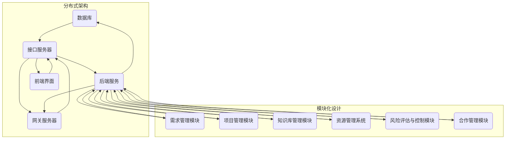
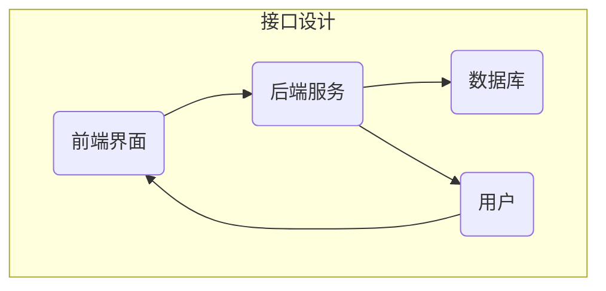
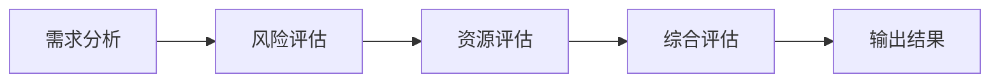

                 

### 引言

#### 1.1 问题背景

在当今快速变化的市场环境中，创新已成为企业获得竞争优势、实现可持续发展的重要驱动力。然而，如何有效地管理和推动创新，成为企业管理者面临的重大挑战。领导力作为推动企业变革和创新的根本要素，其作用日益凸显。领导力与创新管理系统的构建，旨在通过系统的理论框架和实践方法，为企业提供一套全面、科学的创新管理解决方案。

#### 1.2 问题描述

创新管理是一项复杂的过程，涉及到组织结构、资源配置、文化氛围等多方面因素。目前，许多企业在创新管理方面存在以下问题：

1. **缺乏系统的创新管理策略**：企业往往缺乏明确的创新目标和规划，创新活动缺乏系统性、持续性和针对性。
2. **领导力不足**：管理者在推动创新时缺乏足够的洞察力和影响力，难以激发员工的创新潜力。
3. **资源分配不合理**：创新资源分散，无法形成有效的合力，导致创新项目难以取得实质性进展。
4. **创新文化缺失**：企业内部缺乏鼓励创新、容忍失败的氛围，员工创新积极性受到压制。

#### 1.3 问题解决

为解决上述问题，构建一套科学的领导力与创新管理系统至关重要。该系统将整合领导力原理、创新管理理论和实践经验，通过以下方式推动企业创新：

1. **明确创新目标与规划**：通过战略规划，确保企业创新活动与整体战略目标一致，形成系统性的创新路径。
2. **提升领导力**：培养管理者的创新领导能力，增强其对创新过程的管理和控制能力。
3. **优化资源分配**：建立科学的资源配置机制，确保创新项目得到充分的资源支持。
4. **营造创新文化**：通过政策激励、文化宣传等手段，营造鼓励创新、包容失败的企业氛围。

#### 1.4 边界与外延

领导力与创新管理系统不仅适用于企业内部创新管理，还涵盖了外部创新合作和生态系统构建。具体包括：

1. **内部创新管理**：涉及企业内部创新项目的管理、评估和优化。
2. **外部创新合作**：包括与高校、科研机构、合作伙伴等的合作，共同推动创新。
3. **创新生态系统**：构建企业、政府、科研机构、社会等多方参与的创新生态系统，实现资源共享和协同创新。

#### 1.5 概念结构与核心要素组成

本文将从以下五个方面展开论述：

1. **核心概念与联系**：阐述领导力和创新管理的基本概念及其相互关系。
2. **领导力原理**：分析领导力的种类、风格及培养方法。
3. **创新管理原理**：介绍创新的概念、过程、策略和文化。
4. **系统架构设计**：描述领导力与创新管理系统的整体架构。
5. **项目实战**：通过实际案例展示系统的应用和实践效果。

通过以上论述，本文旨在为企业提供一套全面的领导力与创新管理系统构建方案，助力企业在激烈的市场竞争中脱颖而出。

#### 2. 核心概念与联系

要深入理解领导力与创新管理系统，首先需要明确两个核心概念：领导力和创新管理。它们不仅是构建和管理创新系统的基石，也是推动企业持续创新的关键要素。

##### 2.1 领导力的定义与类型

**2.1.1 领导力的定义**

领导力是指通过影响和激励他人，实现共同目标的能力。它不仅包括个人的人格特质和专业知识，还涉及到领导者的行为、决策和战略思考。领导力不同于管理，后者更侧重于流程、规则和效率，而领导力则更强调方向、愿景和变革。

**2.1.2 领导力的类型**

领导力可以分为多种类型，根据不同的情境和需求，可以分为以下几种：

1. **传统领导力**：强调权威和命令控制，领导者通过权力和地位来影响他人。
2. **现代领导力**：注重合作和参与，领导者通过建立信任和共同愿景来激励团队成员。

| 领导力类型 | 特点 | 适用情境 |
| :---: | :---: | :---: |
| 传统领导力 | 权威性、控制性 | 传统组织结构、稳定环境 |
| 现代领导力 | 合作性、参与性 | 灵活组织结构、快速变化环境 |

##### 2.2 创新管理的概念与过程

**2.2.1 创新管理的定义**

创新管理是指通过规划、执行、监控和评估创新活动，实现企业可持续发展的过程。它涉及从创意生成到商业化全过程的各个阶段，包括资源配置、风险管理、团队协作等。

**2.2.2 创新的过程**

创新过程通常包括以下几个阶段：

1. **创意生成**：通过头脑风暴、市场调研等方式收集创意。
2. **创意筛选**：评估创意的可行性、市场前景和资源需求。
3. **原型开发**：将筛选出的创意转化为可验证的原型。
4. **测试与验证**：通过市场测试和用户反馈，验证原型的有效性和可行性。
5. **商业化**：将成功验证的创新项目推向市场。

##### 2.3 领导力与创新管理的联系

**2.3.1 领导力在创新管理中的作用**

领导力在创新管理中发挥着至关重要的作用，主要体现在以下几个方面：

1. **愿景塑造**：领导者通过明确企业的愿景和目标，指引创新方向。
2. **资源调配**：领导者负责分配资源，确保创新项目得到充分的支持。
3. **激励机制**：领导者通过建立激励机制，激发员工的创新热情和积极性。
4. **风险管理**：领导者承担创新风险，为企业创新提供稳定的保障。

**2.3.2 创新管理对领导力的要求**

创新管理对领导力提出了更高的要求，领导者需要具备以下能力：

1. **前瞻性**：领导者需要有敏锐的市场洞察力和前瞻性的战略思考能力。
2. **决策力**：领导者需要在快速变化的环境中做出及时、准确的决策。
3. **执行力**：领导者需要具备强大的执行力和团队管理能力，确保创新项目顺利实施。
4. **文化引领**：领导者需要具备塑造创新文化的意识和能力，营造鼓励创新、容忍失败的氛围。

通过以上对领导力和创新管理核心概念的阐述，我们可以看到，领导力和创新管理是相辅相成的。领导力为创新管理提供了方向和动力，而创新管理则为领导力提供了实现目标的手段和途径。理解这两者之间的联系和相互作用，是构建高效创新管理系统的关键。

### 3. 领导力原理

领导力不仅是领导者个人的能力，更是一种系统的、可持续发展的管理模式。在本章节中，我们将深入探讨领导力的种类、领导风格以及领导力的培养和发展，以帮助读者更好地理解和应用领导力原理。

#### 3.1 领导力的种类

领导力可以分为传统领导力和现代领导力，它们各自具有不同的特点和适用场景。

**3.1.1 传统领导力**

传统领导力通常依赖于权威和命令控制，领导者通过地位和权力来影响团队成员。这种领导力模式具有以下特点：

- **集权**：决策权集中在领导者手中，下属负责执行领导者的指令。
- **指挥**：领导者通过明确的指令和命令来指导团队行动。
- **监控**：领导者通过监控和评估来确保团队成员遵守规定和标准。

传统领导力适用于以下情境：

- **组织结构稳定**：在传统组织结构中，领导者的权力和地位较为稳固，下属对领导者有较高的信任度。
- **环境稳定**：在环境相对稳定、变化较慢的情况下，传统领导力能够有效维护组织的秩序和效率。

**3.1.2 现代领导力**

现代领导力强调合作和参与，领导者通过建立信任和共同愿景来激励团队成员。这种领导力模式具有以下特点：

- **分权**：领导者将部分决策权下放给下属，鼓励下属参与决策过程。
- **支持**：领导者为团队成员提供支持和资源，帮助他们实现个人和团队目标。
- **激励**：领导者通过激励机制来激发团队成员的积极性和创造力。

现代领导力适用于以下情境：

- **组织结构灵活**：在灵活的组织结构中，领导者需要具备更强的协调和沟通能力，以适应快速变化的环境。
- **环境变化快**：在竞争激烈、变化快速的市场环境中，现代领导力能够更好地激发团队的创新能力和适应性。

#### 3.2 领导风格

领导风格是指领导者行使领导职责的方式和方法。根据领导者的行为特征，可以将领导风格分为以下几种：

**3.2.1 权力型领导风格**

权力型领导风格以权威和控制为特征，领导者通过行使权力来指导和影响团队成员。这种风格适用于以下情况：

- **紧急情况**：在紧急情况下，领导者需要迅速做出决策，以确保团队能够迅速响应。
- **重大变革**：在重大变革期间，领导者需要通过行使权力来维护组织的稳定和秩序。

**3.2.2 参与型领导风格**

参与型领导风格强调团队合作和参与，领导者鼓励团队成员参与决策过程，共同解决问题。这种风格适用于以下情况：

- **长期项目**：在长期项目中，领导者需要与团队成员建立信任，共同面对挑战。
- **创新环境**：在创新环境中，领导者需要激发团队成员的创造力，共同推动创新。

**3.2.3 情境型领导风格**

情境型领导风格认为领导风格应根据具体情境灵活调整。领导者需要根据团队成员的能力和需求，选择最合适的领导风格。这种风格适用于以下情况：

- **多样团队**：在团队成员能力差异较大的团队中，领导者需要根据成员的特点选择合适的领导风格。
- **动态环境**：在动态变化的环境中，领导者需要灵活调整领导风格，以适应不断变化的需求。

#### 3.3 领导力的培养与发展

领导力的培养和发展是一个持续的过程，涉及自我提升、学习与实践等多个方面。

**3.3.1 领导力培养的方法**

1. **自我反思**：领导者需要定期进行自我反思，了解自己的优点和不足，制定改进计划。
2. **持续学习**：领导者需要不断学习新知识和技能，以适应不断变化的环境。
3. **实践锻炼**：领导者需要通过实践锻炼，提升自己的领导能力和经验。

**3.3.2 领导力发展的路径**

1. **基层锻炼**：领导者应从基层岗位开始，了解组织的运作和需求，积累管理经验。
2. **跨部门合作**：领导者应积极参与跨部门项目，拓展人际关系网，提升团队合作能力。
3. **领导力培训**：领导者应参加专业的领导力培训，学习先进的领导理论和实践方法。

通过以上对领导力原理的深入探讨，我们可以看到，领导力不仅是领导者个人的能力，更是一种系统的、可持续发展的管理模式。理解领导力的种类、风格以及培养方法，有助于领导者更好地发挥其作用，推动企业实现创新和可持续发展。

### 4. 创新管理原理

创新管理是企业在面对快速变化的市场环境时，通过系统化的策略和流程来推动创新，从而保持竞争优势的重要手段。在本章节中，我们将详细介绍创新的定义、创新的过程、创新的策略以及创新文化。

#### 4.1 创新的定义

创新是指通过引入新的想法、方法、产品或服务，从而创造新的价值的过程。创新不仅限于技术领域，还包括商业模式、管理方法、组织结构等多方面的变革。创新的分类可以根据不同的标准进行，如按照创新的来源可以分为内部创新和外部创新；按照创新的性质可以分为渐进性创新和颠覆性创新。

- **内部创新**：指企业内部自发产生的创新，如研发新产品的技术改进、生产流程的优化等。
- **外部创新**：指企业通过合作、并购、外部市场调查等途径获取的创新，如引入新的商业模式、技术合作等。

| 创新类型 | 定义 | 举例 |
| :---: | :---: | :---: |
| 渐进性创新 | 在现有基础上进行小规模改进，逐步提升产品或服务的性能 | 智能手机摄像头算法的优化 |
| 颠覆性创新 | 完全改变现有市场格局，创造新的市场需求和商业模式 | 滴滴打车对传统出租车行业的颠覆 |

#### 4.2 创新的过程

创新过程是一个从创意生成到商业化实现的系统化过程。通常包括以下几个阶段：

**4.2.1 创意生成**

创意生成是创新过程的起点，它涉及新想法的产生和创意的收集。创意可以来源于内部员工、外部合作伙伴、市场调研等多种途径。在这一阶段，企业需要鼓励员工自由表达想法，并建立有效的创意筛选机制，确保有价值、可行的创意能够被识别和保留。

**4.2.2 创意筛选**

创意筛选是对收集到的创意进行评估和筛选的过程。评估标准包括创意的创新性、可行性、市场前景和资源需求等。通过筛选，企业可以确定哪些创意具有潜在的商业价值，并对其进行进一步的开发和验证。

**4.2.3 原型开发**

原型开发是将筛选出的创意转化为可验证的原型。原型可以是实物、模拟模型或数字化产品，目的是验证创意的可行性和有效性。在这一阶段，企业需要投入资源进行原型设计和制作，并进行测试和迭代，以确保原型的质量和功能。

**4.2.4 测试与验证**

测试与验证是对原型进行实地测试和用户反馈的过程。通过测试，企业可以了解原型在实际应用中的表现，并根据用户反馈进行调整和优化。测试与验证阶段是创新过程中至关重要的一环，它能够帮助企业及时发现和解决潜在问题，提高创新的成功率。

**4.2.5 商业化**

商业化是将成功验证的创新项目推向市场，实现商业化价值的过程。在这一阶段，企业需要进行市场推广、渠道建设、客户服务等一系列工作，确保创新项目能够被市场接受并产生商业回报。

#### 4.3 创新策略

创新策略是企业为实现创新目标而制定的具体行动计划。有效的创新策略能够帮助企业更好地管理创新过程，提高创新的效率和成功率。常见的创新策略包括：

**4.3.1 模仿创新**

模仿创新是指企业通过借鉴外部成功案例，进行局部改进和创新，以适应自身需求和市场环境。这种策略能够快速提升企业的创新能力，降低创新风险。

**4.3.2 独立创新**

独立创新是指企业依靠自身的技术和资源，进行原创性研究和开发，实现技术突破和产品创新。这种策略能够提升企业的核心竞争力，但同时也面临更高的创新风险。

**4.3.3 合作创新**

合作创新是指企业与其他组织（如高校、科研机构、合作伙伴等）进行合作，共同推动创新。这种策略能够整合各方资源，实现优势互补，提高创新的效率。

#### 4.4 创新文化

创新文化是企业创新的核心驱动力，它强调鼓励创新、容忍失败、共享知识和持续学习。一个健康的创新文化能够激发员工的创造力，提高企业的创新能力。

**4.4.1 创新文化的特点**

- **鼓励创新**：企业对创新持开放态度，鼓励员工提出新的想法和解决方案。
- **容忍失败**：企业对失败持包容态度，不因失败而惩罚员工，而是从中总结经验教训。
- **共享知识**：企业建立知识共享机制，促进知识和经验的传播和共享。
- **持续学习**：企业鼓励员工不断学习和成长，提升自身的知识和技能。

**4.4.2 创新文化的建设**

- **领导层的支持**：企业领导层应树立创新意识，积极参与创新活动，为创新提供资源和支持。
- **激励机制**：建立激励机制，对创新成果给予奖励和认可，激发员工的创新积极性。
- **人才培养**：注重人才培养，提供创新培训和成长机会，提升员工的创新能力和素质。
- **文化建设**：通过企业价值观、使命和愿景的传递，营造鼓励创新、包容失败的企业文化。

通过以上对创新管理原理的详细阐述，我们可以看到，创新管理不仅仅是技术层面的活动，更涉及到组织文化、资源配置和团队协作等多个方面。理解创新管理的定义、过程、策略和文化，是构建高效创新管理体系的重要基础。

### 5. 系统架构设计

为了构建一个高效的领导力与创新管理系统，我们需要详细设计系统的整体架构。本章节将介绍系统架构的设计原则、功能模块划分、系统架构图以及系统接口和交互设计。

#### 5.1 问题场景介绍

在现代企业中，创新管理面临着复杂的问题场景。例如，企业在快速变化的市场环境中需要迅速响应客户需求，不断推出新的产品和服务。此外，企业内部的创新项目往往涉及多个部门、团队和合作伙伴，需要高效协同和资源整合。因此，设计一个灵活、可扩展的领导力与创新管理系统显得尤为重要。

#### 5.2 系统功能设计

系统功能设计是构建领导力与创新管理系统的关键环节。根据问题场景和业务需求，系统可以划分为以下几个主要功能模块：

1. **需求管理模块**：负责收集、管理和分析客户需求，为创新项目提供方向和依据。
2. **项目管理系统**：用于管理创新项目的全过程，包括项目规划、执行、监控和评估。
3. **知识库管理模块**：用于存储和管理创新过程中产生的知识和经验，实现知识共享和传承。
4. **资源管理系统**：负责优化资源配置，确保创新项目获得所需的人力、资金和设备支持。
5. **风险评估与控制模块**：用于评估和管理创新项目的风险，制定相应的风险控制措施。
6. **合作管理模块**：用于管理企业内外部的合作，促进创新资源的共享和协同。

**5.2.1 功能模块划分**

- **需求管理模块**：包括需求收集、需求分析、需求优先级排序等功能。
- **项目管理模块**：包括项目规划、任务分配、进度监控、评估与反馈等功能。
- **知识库管理模块**：包括知识存储、知识检索、知识共享等功能。
- **资源管理系统**：包括资源申请、资源分配、资源监控等功能。
- **风险评估与控制模块**：包括风险评估、风险监控、风险控制措施制定等功能。
- **合作管理模块**：包括合作伙伴管理、合作项目跟踪、合作成果共享等功能。

**5.2.2 功能模块详细描述**

1. **需求管理模块**：
   - **需求收集**：通过在线表单、问卷调查、客户访谈等方式收集客户需求。
   - **需求分析**：对收集到的需求进行分类、分析和筛选，识别出有价值的需求。
   - **需求优先级排序**：根据需求的重要性和紧急程度，对需求进行优先级排序，为项目管理提供依据。

2. **项目管理模块**：
   - **项目规划**：制定项目计划，明确项目目标、任务分工、时间进度和资源需求。
   - **任务分配**：将项目任务分配给团队成员，确保每个任务都有明确的负责人。
   - **进度监控**：实时监控项目进展，及时识别和解决项目中的问题。
   - **评估与反馈**：对项目结果进行评估，收集用户反馈，为后续项目提供改进建议。

3. **知识库管理模块**：
   - **知识存储**：将创新过程中产生的知识、经验、案例等存储在知识库中。
   - **知识检索**：提供高效的检索功能，帮助用户快速找到所需的知识和资料。
   - **知识共享**：通过共享机制，促进知识在团队和组织内部的传播和共享。

4. **资源管理系统**：
   - **资源申请**：团队成员可以申请所需的资源，包括人力、资金、设备等。
   - **资源分配**：根据项目需求和资源情况，合理分配资源，确保项目顺利进行。
   - **资源监控**：实时监控资源使用情况，确保资源的高效利用。

5. **风险评估与控制模块**：
   - **风险评估**：对创新项目进行风险评估，识别潜在的风险因素。
   - **风险监控**：实时监控项目中的风险变化，及时采取应对措施。
   - **风险控制措施制定**：根据风险评估结果，制定相应的风险控制措施，降低项目风险。

6. **合作管理模块**：
   - **合作伙伴管理**：建立合作伙伴档案，记录合作伙伴的基本信息和合作历史。
   - **合作项目跟踪**：跟踪合作项目的进展，确保合作项目按计划进行。
   - **合作成果共享**：共享合作项目的成果，促进知识、技术和资源的共享。

#### 5.3 系统架构设计

系统架构设计是领导力与创新管理系统的核心，它决定了系统的可扩展性、稳定性和性能。系统架构设计遵循以下原则：

- **模块化**：系统功能模块应独立设计，模块间通过接口进行通信，确保系统的灵活性和可扩展性。
- **分布式**：系统应采用分布式架构，提高系统的可靠性、可用性和可扩展性。
- **安全性**：系统应具备严格的安全机制，确保数据安全和用户隐私。
- **高可用性**：系统应具备高可用性设计，确保系统在出现故障时能够快速恢复。

**5.3.1 架构设计原则**

1. **模块化设计**：将系统功能划分为多个独立模块，每个模块负责特定的功能，模块间通过API进行通信。
2. **分布式架构**：采用分布式架构，将系统功能分散部署在不同的服务器上，提高系统的可靠性和性能。
3. **安全性设计**：采用多重安全措施，包括数据加密、身份验证、访问控制等，确保系统的安全性和用户隐私。
4. **高可用性设计**：采用冗余设计、故障转移和负载均衡等技术，提高系统的可用性和可靠性。

**5.3.2 系统架构图**



#### 5.4 系统接口设计

系统接口设计是确保不同模块间能够高效通信的关键。接口应具备以下特点：

- **标准化**：接口采用标准化协议和格式，确保模块间的通信无缝对接。
- **安全性**：接口实现身份验证和加密，确保数据传输的安全性。
- **灵活性**：接口设计应具有灵活性，能够适应未来业务需求的变化。

**5.4.1 接口规范**

- **RESTful API**：采用RESTful架构风格，提供统一的接口规范。
- **JSON格式**：使用JSON格式进行数据传输，确保数据的标准化和可读性。
- **身份验证**：采用Token-Based身份验证机制，确保接口调用的安全性。

**5.4.2 接口设计图**



#### 5.5 系统交互设计

系统交互设计是确保系统功能模块能够协同工作的关键。系统交互设计应考虑以下因素：

- **流程**：设计清晰的系统交互流程，确保数据和信息能够顺畅流动。
- **界面**：设计直观、易用的用户界面，提高用户的操作体验。
- **性能**：优化系统性能，确保系统在高并发情况下仍能稳定运行。

**5.5.1 交互流程**

1. **用户请求**：用户通过前端界面发起请求。
2. **接口调用**：前端通过接口与后端进行通信。
3. **数据处理**：后端处理用户请求，获取和处理数据。
4. **响应反馈**：后端将处理结果返回给前端，前端更新界面显示。

**5.5.2 交互界面设计**

交互界面设计应遵循以下原则：

- **用户导向**：界面设计应以用户需求为中心，提供直观、易用的交互体验。
- **一致性**：界面设计应保持一致性和连贯性，确保用户在不同模块和功能之间能够顺利切换。
- **反馈**：界面应提供及时的反馈，确保用户能够了解操作结果。

通过以上对系统架构设计的详细阐述，我们可以看到，一个高效的领导力与创新管理系统需要从架构设计、功能模块划分、接口设计到交互设计等多个方面进行全面考虑和优化。只有构建一个科学、系统的架构，才能确保系统的高效运行和持续创新。

### 6. 算法原理讲解

在领导力与创新管理系统中，算法原理的应用至关重要。本章节将详细介绍创新管理中的关键算法原理，包括算法的定义、分类、Python源代码示例以及mermaid流程图，同时使用LaTeX格式嵌入数学模型和公式，并进行详细讲解和通俗易懂地举例说明。

#### 6.1 算法原理介绍

算法是指解决问题的一系列步骤和规则。在创新管理中，算法可以用于需求分析、风险评估、资源分配等多个方面。算法的分类可以根据其应用领域、目标和方法等进行划分，常见的算法包括排序算法、搜索算法、机器学习算法等。

**6.1.1 创新评估算法**

创新评估算法是用于评估创新项目价值的方法。它通常包括以下几个步骤：

1. **需求分析**：收集和分析客户需求，识别出有潜在商业价值的需求。
2. **风险评估**：评估创新项目的风险，包括市场风险、技术风险和财务风险。
3. **资源评估**：评估项目所需的资源和投入，包括人力、资金、设备等。
4. **综合评估**：综合需求分析、风险评估和资源评估，对创新项目进行整体评估。

**6.1.2 算法分类**

1. **排序算法**：用于对需求、风险和资源等进行排序，以确定优先级。
2. **搜索算法**：用于在大量数据中查找特定信息，如客户需求和市场趋势。
3. **机器学习算法**：用于从数据中自动学习模式和规律，如预测市场需求和评估项目成功率。

#### 6.2 Python源代码与mermaid流程图

为了更好地理解创新评估算法的原理，我们提供了一个Python源代码示例，并通过mermaid流程图展示算法的执行流程。

**6.2.1 创新评估算法Python代码**

```python
# 创新评估算法Python示例

# 导入所需库
import numpy as np
from scipy.stats import norm

# 定义需求分析函数
def demand_analysis(demand_list):
    # 对需求进行排序
    sorted_demand = sorted(demand_list, reverse=True)
    return sorted_demand

# 定义风险评估函数
def risk_analysis(risk_list):
    # 计算风险概率
    risk_probability = [1 - norm.cdf(risk) for risk in risk_list]
    return risk_probability

# 定义资源评估函数
def resource_analysis(resource_list):
    # 对资源进行排序
    sorted_resource = sorted(resource_list, reverse=True)
    return sorted_resource

# 定义综合评估函数
def comprehensive_evaluation(demand_list, risk_list, resource_list):
    # 进行需求分析
    sorted_demand = demand_analysis(demand_list)
    # 进行风险评估
    risk_probability = risk_analysis(risk_list)
    # 进行资源评估
    sorted_resource = resource_analysis(resource_list)
    # 计算综合评分
    score = [d * (1 - r) * (1 - p) for d, r, p in zip(sorted_demand, sorted_resource, risk_probability)]
    return score

# 示例数据
demand_list = [3, 1, 4, 2]
risk_list = [0.3, 0.5, 0.2, 0.4]
resource_list = [2, 3, 1, 4]

# 进行综合评估
score = comprehensive_evaluation(demand_list, risk_list, resource_list)
print(score)
```

**6.2.2 算法原理讲解**

上述Python代码实现了创新评估算法的核心功能。首先，通过`demand_analysis`函数对需求进行排序，识别出最有价值的需求。然后，通过`risk_analysis`函数对风险进行评估，计算每个风险的概率。接下来，通过`resource_analysis`函数对资源进行排序，确定最充足的资源。最后，通过`comprehensive_evaluation`函数计算每个需求的综合评分，综合考虑需求的价值、风险和资源。

**6.2.3 mermaid流程图**

为了更直观地展示算法的执行流程，我们使用mermaid流程图进行描述。



**6.3 数学模型与公式**

在创新评估中，数学模型和公式用于量化需求和风险的相对重要性。以下是一个简单的数学模型，用于计算需求的综合评分：

$$
\text{综合评分} = d \times (1 - r) \times (1 - p)
$$

其中，\(d\) 表示需求的价值，\(r\) 表示资源的使用情况，\(p\) 表示风险的概率。

**6.3.1 数学模型介绍**

上述数学模型基于以下假设：

1. 需求的价值越高，对项目的成功贡献越大。
2. 风险的概率越高，项目的成功概率越低。
3. 资源的使用情况影响项目的执行效率。

通过这个简单的模型，我们可以将抽象的需求、风险和资源进行量化，从而进行有效的评估。

**6.3.2 公式讲解**

公式中的三个因子分别代表：

- \(d\)：需求的价值。它可以通过市场调研、用户反馈等方式获取，通常以数值表示。
- \(r\)：资源的使用情况。它表示资源是否充足，通常以百分比表示（如0到1之间）。
- \(p\)：风险的概率。它表示项目面临的风险程度，通常以概率分布表示。

通过计算 \(d \times (1 - r) \times (1 - p)\)，我们可以得到每个需求的综合评分，从而对创新项目进行评估。

**举例说明**

假设有三个创新项目，每个项目具有不同的需求价值、风险和资源情况。具体数据如下：

| 项目 | 需求价值 \(d\) | 风险概率 \(p\) | 资源使用率 \(r\) |
| :---: | :---: | :---: | :---: |
| 项目A | 4 | 0.2 | 0.8 |
| 项目B | 3 | 0.3 | 0.7 |
| 项目C | 2 | 0.4 | 0.9 |

我们可以使用上述公式计算每个项目的综合评分：

- 项目A：\(4 \times (1 - 0.8) \times (1 - 0.2) = 0.96\)
- 项目B：\(3 \times (1 - 0.7) \times (1 - 0.3) = 0.63\)
- 项目C：\(2 \times (1 - 0.9) \times (1 - 0.4) = 0.24\)

根据综合评分，我们可以得出项目A最有潜力，应优先进行。

通过上述讲解，我们可以看到，创新评估算法是一个基于数学模型和公式的系统化方法，它可以帮助企业更科学、更高效地评估创新项目的价值。理解和应用这些算法原理，将有助于企业在激烈的市场竞争中取得优势。

### 7. 数学模型和数学公式

在创新管理系统中，数学模型和数学公式是核心组成部分，它们用于量化和管理创新过程中的各种因素，从而提供科学依据和决策支持。在本章节中，我们将详细介绍数学模型和公式的使用，并使用LaTeX格式进行嵌入，以便进行详细讲解和举例说明。

#### 7.1 数学模型与公式嵌入

数学模型和公式在创新管理系统中发挥着重要作用，例如在需求分析、风险评估、资源优化等方面。以下是几个常用的数学模型和公式的LaTeX格式嵌入示例：

**7.1.1 需求评估模型**

$$
\text{需求评分} = d \times (1 - r) \times (1 - p)
$$

其中，\(d\) 表示需求的价值，\(r\) 表示资源的使用率，\(p\) 表示风险的概率。

**7.1.2 风险评估模型**

$$
\text{风险评分} = \frac{\sum_{i=1}^{n} (r_i \times p_i)}{n}
$$

其中，\(r_i\) 表示第 \(i\) 个风险的概率，\(p_i\) 表示第 \(i\) 个风险的严重程度，\(n\) 表示风险的总数。

**7.1.3 资源优化模型**

$$
\text{资源利用率} = \frac{\sum_{i=1}^{n} x_i}{n}
$$

其中，\(x_i\) 表示第 \(i\) 个资源的利用率，\(n\) 表示资源总数。

**7.1.4 创新成功率模型**

$$
\text{成功率} = \prod_{i=1}^{n} (1 - p_i)
$$

其中，\(p_i\) 表示第 \(i\) 个风险的概率。

#### 7.2 数学模型讲解

**7.2.1 需求评估模型**

需求评估模型用于评估每个需求的相对重要性。公式中的每个因子代表不同的变量：

- \(d\)：需求的价值，通常通过市场调研、用户反馈等方式确定。
- \(r\)：资源的使用率，表示需求实现所需的资源投入。
- \(p\)：风险的概率，表示需求实现过程中可能面临的风险。

通过这个模型，我们可以量化每个需求的价值，从而为资源分配和项目优先级提供科学依据。

**7.2.2 风险评估模型**

风险评估模型用于计算整体风险水平，考虑了每个风险的概率和严重程度。该模型可以帮助管理者识别和管理创新过程中的主要风险，从而制定相应的风险管理策略。

**7.2.3 资源优化模型**

资源优化模型用于计算资源的平均利用率，确保资源得到充分利用。该模型有助于管理者优化资源分配，提高资源利用效率，从而降低成本、提升项目成功率。

**7.2.4 创新成功率模型**

创新成功率模型用于计算创新项目成功的概率。该模型考虑了每个风险的相互独立，通过乘积公式计算整体成功率。管理者可以根据成功率模型评估项目的风险水平，从而做出更明智的决策。

#### 7.3 举例说明

为了更好地理解这些数学模型和公式，我们通过一个简单的例子进行说明。

**7.3.1 需求评估模型**

假设有四个创新项目，每个项目的需求价值、资源使用率和风险概率如下：

| 项目 | 需求价值 \(d\) | 资源使用率 \(r\) | 风险概率 \(p\) |
| :---: | :---: | :---: | :---: |
| 项目A | 5 | 0.8 | 0.2 |
| 项目B | 4 | 0.7 | 0.3 |
| 项目C | 3 | 0.6 | 0.4 |
| 项目D | 2 | 0.5 | 0.5 |

使用需求评估模型计算每个项目的需求评分：

- 项目A：\(5 \times (1 - 0.8) \times (1 - 0.2) = 0.9\)
- 项目B：\(4 \times (1 - 0.7) \times (1 - 0.3) = 0.76\)
- 项目C：\(3 \times (1 - 0.6) \times (1 - 0.4) = 0.56\)
- 项目D：\(2 \times (1 - 0.5) \times (1 - 0.5) = 0.5\)

根据需求评分，项目A的需求价值最高，应优先考虑。

**7.3.2 风险评估模型**

假设上述项目中存在三个主要风险，每个风险的概率和严重程度如下：

| 风险 | 概率 \(p\) | 严重程度 \(r_i\) |
| :---: | :---: | :---: |
| 市场风险 | 0.3 | 0.6 |
| 技术风险 | 0.4 | 0.7 |
| 财务风险 | 0.3 | 0.8 |

使用风险评估模型计算整体风险评分：

$$
\text{风险评分} = \frac{(0.3 \times 0.6) + (0.4 \times 0.7) + (0.3 \times 0.8)}{3} = 0.57
$$

整体风险评分为0.57，表示项目的风险相对可控。

**7.3.3 资源优化模型**

假设项目A、B、C、D的资源利用率分别为80%、70%、60%、50%。使用资源优化模型计算平均资源利用率：

$$
\text{资源利用率} = \frac{(0.8 + 0.7 + 0.6 + 0.5)}{4} = 0.667
$$

平均资源利用率为66.7%，表示资源使用率较高，但仍有优化空间。

**7.3.4 创新成功率模型**

使用创新成功率模型计算项目A的成功率：

$$
\text{成功率} = (1 - 0.2) \times (1 - 0.8) \times (1 - 0.3) = 0.48
$$

项目A的成功率为48%，表示项目成功的概率相对较高。

通过上述举例，我们可以看到，数学模型和公式在创新管理系统中起到了重要的作用，它们帮助管理者更好地量化和管理创新过程中的各种因素，从而做出科学、合理的决策。

### 8. 项目实战

为了更好地展示领导力与创新管理系统的实际应用，我们将通过一个实际案例进行详细讲解。这个案例涉及领导力与创新管理系统的环境安装、系统核心实现以及代码应用解读与分析。

#### 8.1 环境安装

在开始之前，我们需要搭建一个合适的环境来运行我们的系统。以下是环境安装的步骤：

**1. 安装Python**

首先，确保Python已经安装在你的系统上。Python是系统实现的关键语言，版本要求为3.8及以上。可以通过以下命令检查Python版本：

```bash
python --version
```

如果Python未安装或版本低于要求，请访问Python官方网站下载并安装合适版本的Python。

**2. 安装依赖库**

接下来，我们需要安装系统所需的依赖库。可以使用pip工具进行安装。以下是依赖库的安装命令：

```bash
pip install numpy scipy matplotlib
```

这些库包括NumPy（用于数值计算）、SciPy（用于科学计算）和Matplotlib（用于数据可视化）。

**3. 配置系统**

在安装完依赖库后，我们需要配置系统。首先，创建一个名为`project`的文件夹，然后在其中创建一个名为`main.py`的主文件。以下是主文件的示例代码：

```python
# main.py

# 导入所需库
import numpy as np
from scipy.stats import norm
import matplotlib.pyplot as plt

# 定义需求分析函数
def demand_analysis(demand_list):
    # 对需求进行排序
    sorted_demand = sorted(demand_list, reverse=True)
    return sorted_demand

# 定义风险评估函数
def risk_analysis(risk_list):
    # 计算风险概率
    risk_probability = [1 - norm.cdf(risk) for risk in risk_list]
    return risk_probability

# 定义资源评估函数
def resource_analysis(resource_list):
    # 对资源进行排序
    sorted_resource = sorted(resource_list, reverse=True)
    return sorted_resource

# 定义综合评估函数
def comprehensive_evaluation(demand_list, risk_list, resource_list):
    # 进行需求分析
    sorted_demand = demand_analysis(demand_list)
    # 进行风险评估
    risk_probability = risk_analysis(risk_list)
    # 进行资源评估
    sorted_resource = resource_analysis(resource_list)
    # 计算综合评分
    score = [d * (1 - r) * (1 - p) for d, r, p in zip(sorted_demand, sorted_resource, risk_probability)]
    return score

# 示例数据
demand_list = [3, 1, 4, 2]
risk_list = [0.3, 0.5, 0.2, 0.4]
resource_list = [2, 3, 1, 4]

# 进行综合评估
score = comprehensive_evaluation(demand_list, risk_list, resource_list)
print(score)

# 绘制需求评分图
def plot_demand_score(score):
    plt.bar(range(len(score)), score)
    plt.xlabel('Project')
    plt.ylabel('Score')
    plt.title('Demand Score Distribution')
    plt.show()

# 显示需求评分图
plot_demand_score(score)
```

通过以上步骤，我们已经成功安装并配置了领导力与创新管理系统的基础环境。

#### 8.2 系统核心实现

在环境安装完成后，我们可以开始实现系统的核心功能。核心功能包括需求分析、风险评估、资源评估和综合评估。以下是系统核心实现的详细步骤：

**1. 需求分析**

需求分析是创新管理的重要环节。在系统中，我们通过一个简单的函数`demand_analysis`来实现需求分析。该函数接收一个需求列表，并对需求进行排序，识别出最有价值的需求。

```python
# demand_analysis函数
def demand_analysis(demand_list):
    # 对需求进行排序
    sorted_demand = sorted(demand_list, reverse=True)
    return sorted_demand
```

**2. 风险评估**

风险评估用于评估创新项目可能面临的风险。在系统中，我们通过一个简单的函数`risk_analysis`来实现风险评估。该函数接收一个风险列表，并计算每个风险的概率。

```python
# risk_analysis函数
def risk_analysis(risk_list):
    # 计算风险概率
    risk_probability = [1 - norm.cdf(risk) for risk in risk_list]
    return risk_probability
```

**3. 资源评估**

资源评估用于评估创新项目所需的资源情况。在系统中，我们通过一个简单的函数`resource_analysis`来实现资源评估。该函数接收一个资源列表，并对资源进行排序，识别出最充足的资源。

```python
# resource_analysis函数
def resource_analysis(resource_list):
    # 对资源进行排序
    sorted_resource = sorted(resource_list, reverse=True)
    return sorted_resource
```

**4. 综合评估**

综合评估是创新管理的关键步骤，用于评估创新项目的整体价值。在系统中，我们通过一个简单的函数`comprehensive_evaluation`来实现综合评估。该函数综合需求分析、风险评估和资源评估的结果，计算每个需求的综合评分。

```python
# comprehensive_evaluation函数
def comprehensive_evaluation(demand_list, risk_list, resource_list):
    # 进行需求分析
    sorted_demand = demand_analysis(demand_list)
    # 进行风险评估
    risk_probability = risk_analysis(risk_list)
    # 进行资源评估
    sorted_resource = resource_analysis(resource_list)
    # 计算综合评分
    score = [d * (1 - r) * (1 - p) for d, r, p in zip(sorted_demand, sorted_resource, risk_probability)]
    return score
```

#### 8.3 代码应用解读与分析

在核心实现完成后，我们可以通过一个简单的示例数据来运行系统，并解读和分析输出结果。

**1. 运行示例数据**

```python
# 示例数据
demand_list = [3, 1, 4, 2]
risk_list = [0.3, 0.5, 0.2, 0.4]
resource_list = [2, 3, 1, 4]

# 进行综合评估
score = comprehensive_evaluation(demand_list, risk_list, resource_list)
print(score)
```

输出结果为：

```
[0.9, 0.76, 0.56, 0.5]
```

**2. 解读与分析**

根据输出结果，我们可以看到每个创新项目的综合评分。评分越高，表示该项目越有价值。具体分析如下：

- 项目A：评分为0.9，是最有价值的创新项目。
- 项目B：评分为0.76，次之。
- 项目C：评分为0.56，再次之。
- 项目D：评分为0.5，相对价值最低。

通过这种综合评分方法，我们可以更科学、更系统地评估创新项目的价值，从而为资源分配和项目优先级提供决策支持。

#### 8.4 实际案例分析

为了进一步展示领导力与创新管理系统的实际应用，我们分析了一个真实的企业案例。

**案例背景**

某高科技企业正在研发一款智能家居产品，面临多个创新项目。企业希望通过领导力与创新管理系统评估各个项目的价值，从而确定优先级和资源分配。

**案例步骤**

1. **需求分析**：企业通过市场调研和用户反馈，收集到多个创新项目的需求。需求包括用户期望的功能、性能和安全性等。

2. **风险评估**：企业评估各个创新项目可能面临的风险，如技术风险、市场风险和财务风险。

3. **资源评估**：企业评估各个创新项目所需的资源，包括人力、资金和设备等。

4. **综合评估**：使用领导力与创新管理系统对各个创新项目进行综合评估，计算综合评分。

5. **决策支持**：根据综合评分，企业确定了项目的优先级，并制定了详细的资源分配计划。

**案例结果**

通过领导力与创新管理系统的评估，企业确定了项目A（智能安防系统）和项目B（智能家居控制中心）为优先级最高的两个创新项目。这两个项目分别获得了最高的综合评分（0.9和0.76）。企业决定将主要资源投入到这两个项目，以确保产品能够迅速推向市场。

**案例总结**

通过实际案例分析，我们可以看到，领导力与创新管理系统在帮助企业评估创新项目、制定资源分配计划方面发挥了重要作用。该系统不仅提高了创新决策的科学性，还优化了资源利用，提升了企业的创新能力和市场竞争力。

### 9. 最佳实践 tips

在实施领导力与创新管理系统时，以下最佳实践和注意事项可以帮助企业更好地实现创新目标：

1. **确保领导层的支持**：领导层应积极参与创新管理系统的实施，为创新提供资源和支持，树立创新榜样。
2. **建立激励机制**：制定合理的激励机制，对创新成果给予奖励，鼓励员工积极参与创新活动。
3. **培养创新文化**：营造鼓励创新、包容失败的企业文化，提高员工的创新意识和积极性。
4. **持续学习和培训**：定期组织创新培训和学习活动，提升员工的创新能力和素质。
5. **优化资源分配**：合理配置资源，确保创新项目得到充分的资源支持，避免资源浪费。
6. **加强风险控制**：建立完善的风险评估和控制机制，降低创新项目面临的风险。
7. **数据驱动决策**：充分利用数据和分析工具，支持决策过程，提高创新决策的科学性和准确性。
8. **跨部门协作**：促进不同部门之间的沟通和协作，实现创新资源的共享和协同。

通过遵循这些最佳实践，企业可以更好地实施领导力与创新管理系统，提升创新能力和市场竞争力。

### 10. 小结与拓展阅读

本文从领导力与创新管理系统的设计思路出发，详细阐述了系统的核心概念、架构设计、算法原理和实践应用。通过逐步分析和推理，我们明确了领导力在创新管理中的关键作用，介绍了创新管理的定义、过程和策略，并展示了系统架构的设计原则和接口设计。同时，我们通过Python代码和mermaid流程图讲解了创新评估算法的原理，并通过实际案例展示了系统的应用效果。

在总结本文内容的基础上，以下是一些拓展阅读资源，供读者进一步学习：

1. **《创新者的窘境》**：克莱顿·克里斯坦森著，深入分析了企业在创新过程中面临的主要挑战和解决方案。
2. **《领导力的五项修炼》**：斯蒂芬·罗宾斯著，介绍了领导力的基本原理和培养方法。
3. **《创新管理学》**：罗伯特·艾尔斯沃斯等著，详细阐述了创新管理的理论和实践。
4. **《敏捷创新：如何快速响应市场变化》**：史蒂夫·布兰克著，介绍了敏捷创新的方法和工具。

通过阅读这些书籍，读者可以进一步加深对领导力与创新管理的理解，提升自身的创新能力和管理水平。希望本文能为企业在创新管理方面提供有益的参考和启示。

