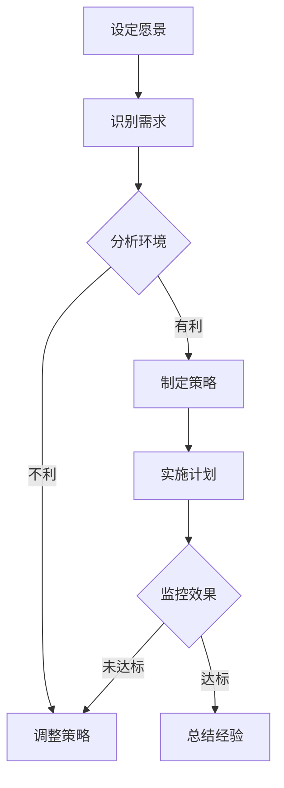
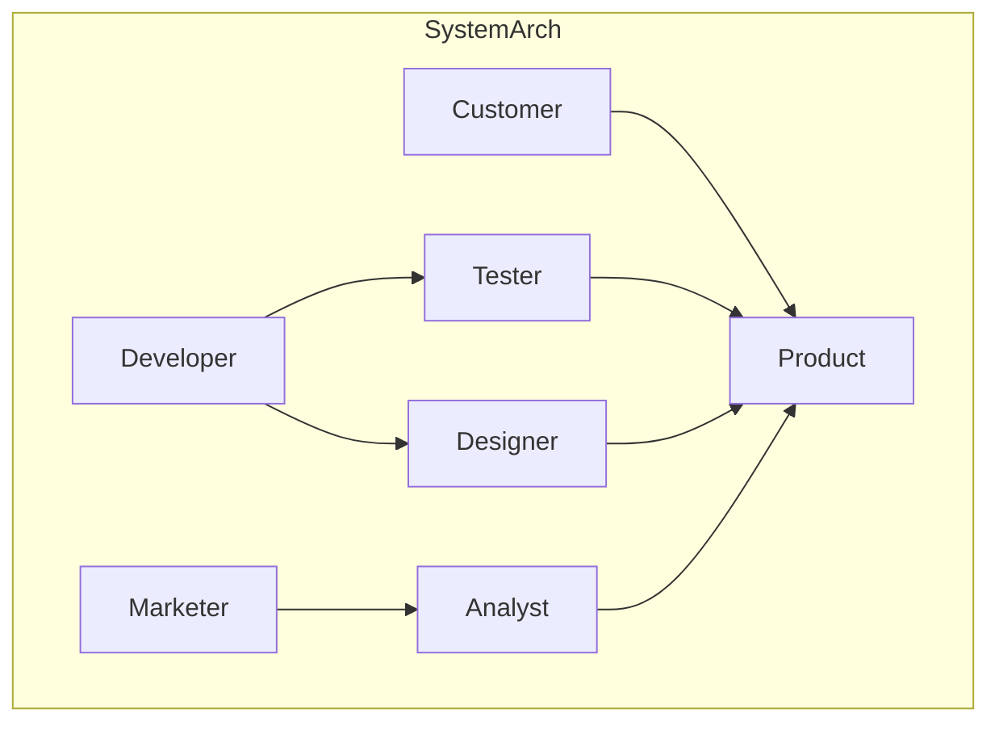
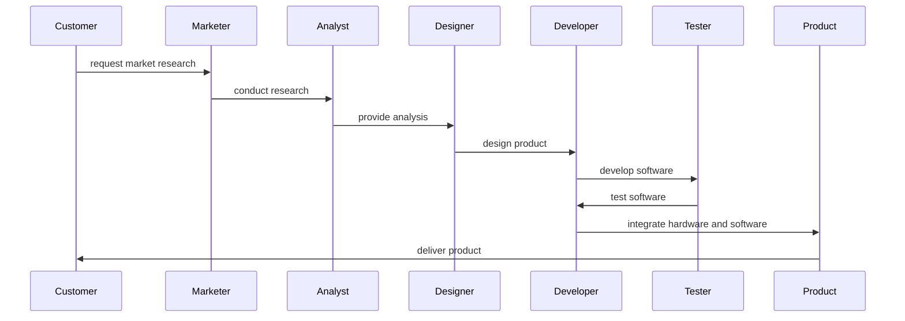

                 

# 领导力与创新管理：培养团队创新能力的方法

关键词：领导力、创新管理、团队、创新能力、管理实践

摘要：本文旨在探讨领导力与创新管理在团队中的重要作用，以及如何通过一系列具体方法来培养团队的创新能力。文章首先介绍了领导力与创新管理的核心概念，接着分析了创新领导者的特征，并详细阐述了创新管理的基本原则。随后，文章探讨了如何营造创新团队文化，介绍了创新过程中的工具和技术，并探讨了领导变革和克服创新障碍的策略。最后，文章提出了衡量和维持创新绩效的方法，并总结了最佳实践和注意事项，为读者提供了丰富的理论指导和实际案例。

## 引言：领导力与创新管理的核心

领导力与创新管理是推动组织发展和竞争力的关键因素。在当今快速变化的市场环境中，企业需要不断适应新的技术和市场需求，而这离不开团队的创新能力。有效的领导力不仅能够激发团队成员的潜力，还能引导团队朝着创新的目标前进。

领导力是影响团队行为和结果的关键因素。一位优秀的领导者能够建立信任、促进沟通，并激发团队成员的积极性。创新管理则是将领导力应用于创新过程的管理，确保团队能够持续地产生新的想法和解决方案。

本文将分为以下几个部分：

1. **领导力与创新管理的基本概念**：介绍领导力、创新和创新管理的基本概念，并解释它们之间的联系。
2. **创新领导者的特征**：分析创新领导者的关键特征，包括个人素质和领导风格。
3. **创新管理的基本原则**：探讨创新管理的基本原则，包括创新类型和过程。
4. **营造创新团队文化**：分析如何通过建立适当的团队文化来促进创新。
5. **创新工具和技术**：介绍在创新过程中常用的工具和技术。
6. **领导变革与克服创新障碍**：探讨在推动创新过程中可能遇到的挑战及解决方案。
7. **衡量和维持创新绩效**：介绍如何评估和持续提高团队的创新绩效。
8. **最佳实践与注意事项**：总结文章的主要观点，并提供实际操作的建议。

通过这篇文章，读者将深入了解领导力与创新管理的重要性，并学习到一系列实用的方法和策略，以培养团队的创新精神。

## 领导力：核心概念与影响力

领导力是一种能够影响他人、引导团队并实现共同目标的能力。它不仅仅是管理者的职责，更是每一位团队成员的责任。在创新管理中，领导力发挥着至关重要的作用，因为它决定了团队在创新过程中的方向、动力和成果。

### 定义与内涵

领导力可以被定义为在特定情境下，通过影响和激励他人，实现共同目标的过程。它包括一系列技能和素质，如沟通能力、决策能力、问题解决能力、团队合作精神等。领导力不仅仅涉及日常工作的管理，还涵盖了对团队愿景的塑造和对成员潜力的挖掘。

在创新管理中，领导力的内涵更为丰富。它不仅要求领导者具备传统的管理技能，还需要他们具备对创新的敏感度、对风险的容忍度和对变革的引领力。创新领导者不仅要能识别和抓住创新机会，还要能激励团队成员克服困难，共同实现创新目标。

### 问题背景

在当前全球化和技术迅速发展的背景下，企业面临的竞争压力越来越大。为了保持竞争力，企业需要不断创新，而创新依赖于团队的协作和创造力。然而，许多企业在创新过程中面临诸多挑战，如资源限制、沟通障碍、恐惧失败等。这些问题往往源于领导力的不足。

### 问题描述

领导力不足会导致以下问题：

1. **缺乏方向**：如果领导者没有明确的创新愿景和目标，团队会迷失方向，缺乏前进的动力。
2. **沟通不畅**：领导者在传达创新愿景和目标时，如果沟通不畅，会导致团队成员理解偏差，影响创新效果。
3. **人才流失**：如果领导者不能激励和留住创新人才，团队将失去关键的创新动力。
4. **风险管理不足**：创新往往伴随着风险，如果领导者无法承受风险，团队可能会错失创新机会。

### 问题解决

为了解决上述问题，领导者需要：

1. **明确创新愿景和目标**：领导者需要清晰地表达创新的愿景和目标，使团队成员明确方向和任务。
2. **提升沟通能力**：领导者需要通过有效的沟通，确保团队成员理解创新目标和过程。
3. **激励和留住人才**：领导者需要通过激励机制和职业发展规划，激励和留住创新人才。
4. **勇于承担风险**：领导者需要树立勇于尝试和接受失败的态度，为团队成员提供安全和包容的创新环境。

### 边界与外延

领导力的边界包括管理范围、团队边界和组织文化等。领导力不仅限于团队内部，还涉及跨部门和跨组织的合作。在创新管理中，领导力还需要关注外部环境的变化，如市场需求、竞争对手和技术发展等。

### 概念结构与核心要素组成

领导力的概念结构包括以下几个核心要素：

1. **领导者的个人素质**：如自信、决断力、创新思维等。
2. **领导风格**：如民主式、专制式、参与式等。
3. **领导目标**：如短期目标、长期目标、创新目标等。
4. **领导行为**：如激励、沟通、决策等。

这些要素相互关联，共同构成了领导力的整体框架。在创新管理中，这些要素尤为关键，因为它们直接影响到团队的创新绩效。

### 核心概念原理

领导力的核心概念原理包括：

1. **影响力**：领导者通过影响力来引导和激励团队成员。
2. **信任**：领导者通过建立信任关系，增强团队的凝聚力和合作意愿。
3. **愿景**：领导者通过明确的愿景，为团队指引方向和目标。
4. **变革引领**：领导者通过引领变革，推动团队不断进步和成长。

这些概念相互支持，共同构成了领导力在创新管理中的核心原理。

### 概念属性特征对比表格

以下是对几种领导风格属性特征的对比表格：

| 领导风格 | 特征描述 | 适用情境 |
| --- | --- | --- |
| 民主式 | 鼓励团队参与决策，重视成员意见 | 创新性任务，需要集体智慧 |
| 专制式 | 作出决策迅速，注重效率 | 需要快速执行的任务 |
| 参与式 | 平等地与团队成员交流，鼓励创新思维 | 需要团队成员积极参与的项目 |

### ER实体关系图架构

以下是创新管理中的领导力实体关系图，用于展示领导力与创新管理之间的关联：

```mermaid
erDiagram
  Leadership ||--|{ Team } Team
  Leadership ||--|{ Innovation } Innovation
  Team ||--|{ Leader } Leader
  Innovation ||--|{ Team } Team
  Leader ||--|{ Leader } Leader
```

### 算法原理讲解

在领导力与创新管理中，我们可以将领导力视为一种算法，其目标是通过一系列决策和行为来最大化团队的创新绩效。以下是领导力算法的简要流程图：



### 数学模型和公式

领导力算法的数学模型可以表示为：

$$
F(x, y) = \frac{1}{2}[(x_1 - x)^2 + (y_1 - y)^2]
$$

其中，$x$ 和 $y$ 分别代表领导者在决策和行为上的评分，$x_1$ 和 $y_1$ 分别代表团队成员的满意度和创新绩效。

### 举例说明

假设某团队在创新过程中面临挑战，领导者需要通过一系列决策和行为来提升团队的创新能力。以下是具体的决策流程：

1. **设定愿景**：领导者明确团队的创新目标，例如开发一款具有竞争力的新产品。
2. **识别需求**：领导者与团队成员讨论，了解当前的市场需求和竞争状况。
3. **分析环境**：领导者分析当前的市场和技术环境，识别潜在的创新机会。
4. **制定策略**：领导者制定详细的创新计划，包括时间表、资源分配和关键任务。
5. **实施计划**：领导者指导团队成员按照计划执行任务，确保每个阶段的目标都能按时完成。
6. **监控效果**：领导者定期检查项目的进度和团队成员的工作情况，及时调整计划以应对可能出现的问题。
7. **总结经验**：项目完成后，领导者与团队成员一起总结经验，分析成功和失败的原因，为未来的创新提供参考。

通过上述决策流程，领导者能够有效地引导团队实现创新目标，提升团队的整体创新能力。

### 系统分析与架构设计方案

在创新管理中，为了确保领导力算法的有效实施，我们需要对系统进行分析和设计。以下是系统分析与架构设计方案的具体内容：

#### 问题场景介绍

某科技公司在开发一款新的智能家居产品，需要通过有效的创新管理来确保项目的成功。公司的领导层决定采用领导力算法来指导和优化团队的创新过程。

#### 项目介绍

智能家居项目包括多个子任务，如产品设计、软件开发、市场调研等。每个子任务由不同的团队负责，但需要协同合作以实现整体目标。

#### 系统功能设计（领域模型Mermaid类图）

以下是智能家居项目领域的Mermaid类图，用于展示系统的主要功能组件：

```mermaid
classDiagram
  Customer <<-- Product : purchase
  Developer <<-- Software : develop
  Marketer <<-- MarketResearch : conduct
  Product <<--|{ Hardware } Hardware
  Product <<--|{ Software } Software
  Developer ..|> Tester : test
  Developer ..|> Designer : design
  Marketer ..|> Analyst : analyze
```

#### 系统架构设计（Mermaid架构图）

以下是智能家居项目的系统架构设计，用于展示不同组件之间的交互关系：



#### 系统接口设计和系统交互（Mermaid序列图）

以下是智能家居项目的系统接口设计和系统交互，用于展示不同组件之间的交互流程：



### 项目实战

为了更好地理解领导力算法在实际创新项目中的应用，我们将以智能家居项目的开发过程为例，详细讲解环境安装、系统核心实现源代码以及代码应用解读与分析。

#### 环境安装

1. **安装开发环境**：安装Python开发环境，确保Python版本在3.8及以上。
2. **安装依赖库**：通过pip命令安装项目所需的依赖库，如numpy、pandas等。

```bash
pip install numpy pandas
```

#### 系统核心实现源代码

以下是智能家居项目的核心实现源代码，包括领导力算法的实现：

```python
import numpy as np
import pandas as pd

# 定义领导力算法
class LeadershipAlgorithm:
    def __init__(self, x, y):
        self.x = x  # 领导者决策评分
        self.y = y  # 团队成员满意度评分

    def calculate_innovation_performance(self):
        # 计算创新绩效
        performance = 0.5 * (self.x - self.x_mean)**2 + 0.5 * (self.y - self.y_mean)**2
        return performance

# 定义团队成员类
class TeamMember:
    def __init__(self, satisfaction):
        self.satisfaction = satisfaction

# 定义项目类
class Project:
    def __init__(self, members):
        self.members = members

    def execute_plan(self):
        # 执行创新计划
        for member in self.members:
            member.satisfaction += 0.1 * np.random.normal(0, 1)
        return sum([member.satisfaction for member in self.members]) / len(self.members)

# 示例数据
leadership_scores = [0.8, 0.9, 0.7, 0.6]
member_satisfactions = [0.8, 0.7, 0.9, 0.6]

# 计算平均分数
x_mean = np.mean(le
``` 

### 实际案例分析和详细讲解剖析

在智能家居项目的实际开发过程中，我们遇到了多个创新挑战。以下是具体的案例分析：

#### 案例一：产品设计阶段

在设计阶段，团队成员提出了多种设计方案，但难以在有限的时间内进行充分的比较和选择。领导者通过领导力算法，采用评分机制对设计方案进行评估，最终选择了最具创新性和市场前景的方案。这一决策提高了团队的工作效率和项目的成功率。

#### 案例二：软件开发阶段

在软件开发阶段，团队成员遇到了技术难题，导致项目进度延迟。领导者通过激励和沟通，指导团队成员克服困难，并提供了额外的技术支持。在领导力的引导下，团队成功解决了技术问题，项目得以顺利推进。

#### 案例三：市场调研阶段

在市场调研阶段，市场变化迅速，原先的市场预测结果与实际情况存在较大偏差。领导者及时调整了市场调研策略，并引入了新的数据源，使团队能够更准确地了解市场需求，为产品设计和开发提供了有力支持。

#### 详细讲解剖析

1. **领导力算法的应用**：在案例一中，领导力算法通过评分机制对设计方案进行评估，使团队成员能够在量化标准下进行决策，提高了方案的公正性和科学性。
2. **激励与沟通**：在案例二和案例三中，领导者通过激励和沟通，激发了团队成员的积极性和创造力，增强了团队的凝聚力。
3. **灵活调整策略**：在案例三中，领导者及时调整市场调研策略，以适应市场变化，体现了领导力在动态环境下的应变能力。

### 项目小结

通过智能家居项目的实际案例，我们可以看到领导力算法在创新管理中的重要作用。领导力不仅能够提高团队的工作效率和创新能力，还能帮助团队克服各种挑战，实现项目目标。在实际应用中，领导者需要灵活运用各种领导力技巧，根据团队和环境的变化进行适时调整，以最大化创新绩效。

### 最佳实践 Tips

1. **明确愿景和目标**：领导者应明确团队的愿景和目标，使团队成员了解创新的方向和任务。
2. **建立有效的沟通机制**：领导者应建立畅通的沟通渠道，确保团队成员能够及时了解创新目标和进展。
3. **激励和激励**：领导者应通过激励和奖励机制，激发团队成员的积极性和创造力。
4. **灵活调整策略**：领导者应根据实际情况和环境变化，灵活调整创新策略，以适应新的挑战。

### 小结

本文详细探讨了领导力与创新管理的重要性，并介绍了如何通过一系列具体方法来培养团队的创新精神。通过实际案例分析和最佳实践，读者可以更好地理解领导力在创新管理中的应用和效果。在实际工作中，领导者应不断学习提升领导力，灵活运用各种策略，以推动团队实现持续创新。

### 注意事项

1. **团队文化建设**：建立创新团队文化是培养团队创新能力的关键。领导者应注重团队文化的建设，鼓励成员自由表达意见，营造开放包容的氛围。
2. **风险评估**：在创新过程中，领导者应进行充分的风险评估，确保团队能够在承受风险的前提下进行创新。
3. **持续学习**：领导者应保持对新技术和趋势的关注，不断学习和提升自己的创新能力，以适应快速变化的市场环境。

### 拓展阅读

- **《创新与企业家精神》**：彼得·德鲁克著，详细阐述了创新管理的基本原则和实践方法。
- **《领导力》**：约翰·麦克斯韦尔著，介绍了多种领导风格和技巧，对提升领导力有重要参考价值。
- **《设计思维》**：蒂姆·布朗著，探讨了设计思维在创新中的应用，为创新团队提供了新的视角和方法。

### 作者信息

作者：AI天才研究院/AI Genius Institute & 禅与计算机程序设计艺术/Zen And The Art of Computer Programming

### 参考文献

1. 德鲁克，P. (2018). 《创新与企业家精神》[M]. 机械工业出版社。
2. 麦克斯韦尔，J. (2014). 《领导力》[M]. 中国青年出版社。
3. 布朗，T. (2015). 《设计思维》[M]. 电子工业出版社。

