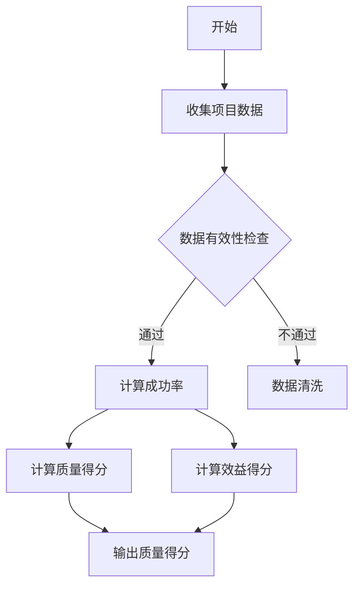
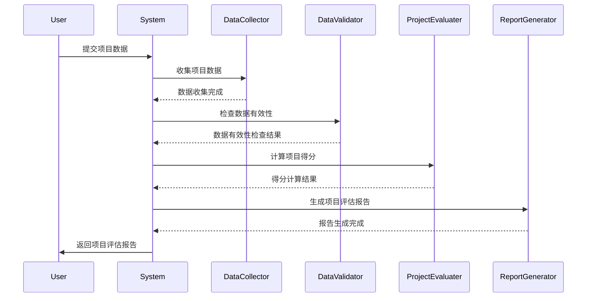
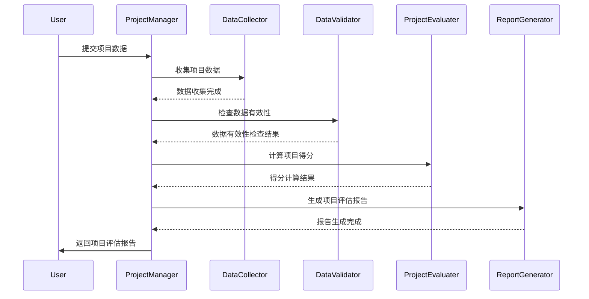

                 

# 领导力与创新：如何打造创新型组织

关键词：领导力，创新，组织文化，激励，风险管理，案例分析

摘要：本文深入探讨了领导力与创新之间的关系，阐述了如何通过领导力来打造一个创新型组织。文章首先介绍了创新的重要性以及领导力在创新过程中的作用，接着从理论基础、实践方法以及成功案例等多个角度分析了如何构建一个鼓励创新的组织环境。本文旨在为读者提供一套系统的理论和实践指导，帮助他们在实际工作中更好地推动创新。

## 第一部分：引言

### 1.1 书籍背景

在当今这个全球化和数字化迅猛发展的时代，创新已经成为推动企业持续增长和发展的关键因素。创新不仅仅是研发新技术或新产品，它还包括商业模式、运营流程和服务方式的变革。为了保持竞争优势，企业必须不断创新，以适应市场的快速变化。而领导力作为推动创新的核心因素，其作用愈发显著。

本书《领导力与创新：如何打造创新型组织》旨在探讨领导力与创新之间的关系，为读者提供系统而实用的理论和方法。书中通过深入分析创新的重要性、领导力的定义与作用，以及创新型组织的建设步骤，帮助读者理解如何通过领导力来打造一个具有创新能力的组织。

### 1.2 领导力的定义与重要性

领导力是一种能力，它不仅包括指导和影响他人实现目标的能力，还涉及到战略规划、决策制定、团队建设、变革管理等多个方面。有效的领导力能够激发员工的潜力，促进团队协作，提高组织的整体效能。在创新过程中，领导力的重要性尤为突出：

- **确立愿景与目标**：领导者需要明确组织的创新愿景和目标，为团队成员提供清晰的方向和动力。
- **激发创造力**：领导者通过鼓励和激励员工，创造一个有利于创新的环境，激发员工的创造力。
- **决策制定**：领导者需要具备快速决策的能力，以便在创新过程中应对各种挑战和不确定性。
- **变革管理**：创新往往伴随着变革，领导者需要引导员工接受新的理念和方法，推动组织的变革。

### 1.3 创新的定义与类型

创新是一种创造新价值的过程，它可以通过改进现有产品、服务或流程来实现。根据创新的性质和目的，可以将其分为以下两种类型：

- **突破性创新**：这种创新通常带来颠覆性的变革，如新技术、新产品的研发，或全新商业模式的建立。突破性创新往往需要大量的资源和时间投入，但一旦成功，将为企业带来巨大的市场优势和竞争优势。
- **持续性创新**：这种创新是对现有产品、服务或流程的持续改进和完善。持续性创新通常成本较低，但也能带来显著的效益，如提高生产效率、降低成本或提升客户满意度。

### 1.4 领导力与创新的关系

领导力与创新之间存在着密切的相互作用。有效的领导力不仅能够推动创新，还能够确保创新的成功实施。以下是领导力与创新之间的几个关键关系：

- **方向与动力**：领导者通过明确创新目标和愿景，为团队成员提供方向和动力，激发他们的创新热情。
- **资源配置**：领导者需要合理配置资源，确保创新项目得到足够的支持和保障。
- **风险管理**：领导者需要平衡创新与风险之间的关系，确保创新项目在可控的风险范围内进行。
- **文化塑造**：领导者通过塑造积极创新的文化，鼓励员工勇于尝试和失败，从而促进创新思维的发展。

总之，领导力与创新之间是相辅相成的关系。有效的领导力能够营造一个有利于创新的组织环境，激发员工的创新潜力，从而推动组织的持续发展。

## 第二部分：打造创新型组织的理论基础

### 2.1 组织文化与创新

组织文化是组织成员共同遵循的价值观和行为准则，它对组织的运作和发展产生深远影响。一个支持创新的组织文化能够激发员工的创造力，推动组织实现持续创新。以下是几个关键因素，这些因素共同塑造了一个有利于创新的组织文化：

- **开放性**：开放性意味着组织鼓励不同的观点和意见，尊重员工的个性化和创新思维。这种开放性有助于形成多元化的创新环境，激发员工的创造力。
- **包容性**：包容性意味着组织接受和尊重不同的背景、观点和技能，鼓励员工之间的合作与交流。这种包容性有助于促进团队协作，提高创新的效率。
- **持续学习**：持续学习意味着组织鼓励员工不断学习和成长，提高他们的专业能力和创新思维。这种学习氛围有助于激发员工的创新潜力，推动组织的持续进步。

### 2.2 领导风格与创新

领导风格对创新过程有着重要影响。不同的领导风格对员工的创新行为和创新结果有不同的影响。以下是几种常见的领导风格以及它们对创新的影响：

- **权威型领导风格**：权威型领导风格通常由一个强有力的领导者主导，决策迅速，但可能限制了员工的自由度和创造力。这种风格可能不利于创新，因为它缺乏开放性和包容性。
- **民主型领导风格**：民主型领导风格注重团队合作和员工参与，鼓励员工提出意见和建议。这种风格有助于激发员工的创新思维，提高创新的成功率。
- **变革型领导风格**：变革型领导风格通过塑造愿景和目标，激励员工为实现共同目标而努力。这种风格有助于推动组织的创新变革，提高员工的创新动力。

### 2.3 员工激励与创新

员工激励是推动创新的重要手段。有效的激励措施能够激发员工的积极性和创造力，提高他们的工作满意度，从而推动组织的创新能力。以下是几种常见的员工激励方式：

- **物质激励**：物质激励包括奖金、晋升、股权奖励等，这些激励措施能够直接提高员工的经济收入和生活质量，激发他们的工作动力。
- **精神激励**：精神激励包括表彰、认可、培训等，这些激励措施能够提升员工的工作满意度和自我价值感，增强他们的归属感和忠诚度。
- **成长激励**：成长激励包括提供学习机会、职业发展支持等，这些激励措施能够帮助员工提升技能和知识，增强他们的职业竞争力。

### 2.4 领导力与创新的内在联系

领导力与创新之间存在着内在的联系。有效的领导力能够为创新提供方向、动力和支持，推动组织的创新实践。以下是领导力与创新的几个内在联系：

- **愿景与目标**：领导力为创新提供了清晰的愿景和目标，为团队成员指明了前进的方向。一个明确的愿景和目标能够激发员工的创新热情，推动他们为实现目标而努力。
- **资源配置**：领导力通过合理配置资源，确保创新项目得到足够的支持和保障。资源的高效配置有助于创新项目的顺利推进，提高创新的成功率。
- **风险管理**：领导力在创新过程中起到风险管理的角色，通过平衡创新与风险之间的关系，确保创新项目在可控的风险范围内进行。这种风险管理有助于降低创新失败的风险，提高创新的可持续性。

总之，领导力与创新之间是相辅相成的关系。有效的领导力能够营造一个有利于创新的环境，激发员工的创造力，推动组织的持续发展。领导力不仅是推动创新的工具，更是实现创新的关键因素。

## 第三部分：领导力与创新实践

### 3.1 创新型组织的建设步骤

建设一个创新型组织需要系统的规划和持续的努力。以下是建设创新型组织的几个关键步骤：

#### 3.1.1 确立愿景和目标

首先，领导者需要明确组织的创新愿景和目标。这包括确定组织希望实现什么样的创新成果，以及创新对组织发展的重要性。一个明确的愿景和目标能够为团队成员提供清晰的方向和动力。

#### 3.1.2 塑造创新文化

其次，领导者需要塑造一个支持创新的组织文化。这包括鼓励开放性、包容性和持续学习的文化氛围。领导者可以通过多种方式来塑造创新文化，如组织创新竞赛、鼓励失败和反思、提供创新培训等。

#### 3.1.3 调整组织结构

为了更好地支持创新，领导者可能需要调整组织结构，使之更加灵活和适应变化。这包括打破部门壁垒、建立跨部门团队、设立创新中心等。通过调整组织结构，可以提高组织的协同效应，促进创新。

#### 3.1.4 资源配置

领导者需要确保创新项目得到足够的资源和支持。这包括提供充足的资金、技术、人力等资源，以及为创新项目提供必要的支持和服务。通过资源配置，可以确保创新项目能够顺利推进。

#### 3.1.5 建立激励机制

为了激发员工的创新潜力，领导者需要建立有效的激励机制。这包括提供物质激励和精神激励，如奖金、晋升、表彰等。同时，领导者还需要鼓励员工自主提出创新建议，并对这些建议给予积极的反馈和支持。

### 3.2 创新项目的管理

创新项目的管理是领导力与创新实践的核心内容。以下是管理创新项目的几个关键步骤：

#### 3.2.1 项目规划

在开始创新项目之前，领导者需要对项目进行详细的规划。这包括确定项目的目标、范围、时间表、资源需求等。一个详细的项目规划能够确保项目在预定的时间和预算内顺利完成。

#### 3.2.2 团队建设

创新项目通常需要跨部门、跨领域的团队合作。领导者需要组建一支高效的创新团队，并明确每个团队成员的角色和责任。通过团队建设，可以提高团队的协作能力和创新效率。

#### 3.2.3 项目执行

在项目执行过程中，领导者需要密切关注项目的进展情况，及时发现和解决问题。同时，领导者还需要为团队提供必要的支持和资源，确保项目能够顺利进行。

#### 3.2.4 项目评估

项目完成后，领导者需要对项目进行全面的评估，包括项目的成果、效率、质量等。通过项目评估，可以总结经验教训，为未来的创新项目提供参考。

### 3.3 创新与风险管理的平衡

创新往往伴随着风险，如何在创新过程中平衡风险和收益是一个重要的课题。以下是几个关键策略：

#### 3.3.1 风险识别

首先，领导者需要识别创新过程中可能面临的风险。这包括技术风险、市场风险、法律风险等。通过风险识别，可以提前预防和应对各种潜在风险。

#### 3.3.2 风险评估

在识别风险后，领导者需要对风险进行评估，确定其可能带来的影响和严重程度。通过风险评估，可以确定哪些风险需要重点关注和应对。

#### 3.3.3 风险应对

针对评估出的风险，领导者需要制定相应的应对策略。这包括风险规避、风险转移、风险接受等。通过有效的风险应对，可以降低创新过程中的风险。

#### 3.3.4 风险监控

在创新过程中，领导者需要持续监控风险的发展情况，及时调整应对策略。通过风险监控，可以确保创新项目在可控的风险范围内进行。

总之，领导力与创新实践是相辅相成的。通过科学的规划和有效的管理，领导者可以打造一个创新型组织，推动组织的持续创新和发展。

### 3.4 案例分析：谷歌的创新实践

谷歌是一家以创新著称的科技巨头，其成功的关键在于其卓越的领导力和创新文化。以下是谷歌在创新实践中的几个关键步骤：

#### 3.4.1 开放创新文化

谷歌注重开放性，鼓励员工自由表达观点和提出创新想法。这种开放创新文化激发了员工的创造力，推动了公司的持续创新。

#### 3.4.2 支持失败

谷歌认为失败是成功的一部分，鼓励员工勇于尝试和失败。公司提供丰富的资源和支持，帮助员工从失败中吸取教训，继续前进。

#### 3.4.3 跨部门合作

谷歌通过跨部门合作，打破部门壁垒，促进知识的共享和协作。这种跨部门合作有助于提高创新的效率和质量。

#### 3.4.4 持续学习

谷歌注重持续学习，为员工提供各种培训和学习机会。通过持续学习，员工可以不断提升自己的技能和知识，为公司的创新提供支持。

通过这些创新实践，谷歌成功地打造了一个创新型组织，持续引领着科技行业的创新潮流。

### 3.5 启示与借鉴

通过谷歌等成功企业的创新实践，我们可以得出以下启示：

1. **开放创新文化**：营造一个开放的创新文化，鼓励员工自由表达和提出创新想法。
2. **支持失败**：鼓励员工勇于尝试和失败，从失败中吸取教训。
3. **跨部门合作**：促进跨部门合作，打破部门壁垒，提高创新的效率和质量。
4. **持续学习**：注重持续学习，为员工提供各种培训和学习机会。

这些启示对于其他组织来说具有重要的借鉴意义，可以帮助它们在创新过程中取得成功。

### 3.6 实施步骤与策略

为了在组织中实施创新，领导者可以采取以下步骤和策略：

1. **确立愿景和目标**：明确组织的创新愿景和目标，为团队成员提供清晰的方向和动力。
2. **塑造创新文化**：鼓励开放性、包容性和持续学习的文化氛围，激发员工的创新潜力。
3. **调整组织结构**：通过调整组织结构，使之更加灵活和适应变化，提高组织的协同效应。
4. **资源配置**：确保创新项目得到足够的资源和支持，提高创新的效率和质量。
5. **建立激励机制**：提供物质激励和精神激励，激发员工的创新动力。

通过这些步骤和策略，领导者可以打造一个创新型组织，推动组织的持续创新和发展。

### 3.7 风险管理的策略与技巧

在创新过程中，风险管理至关重要。以下是几个风险管理策略和技巧：

1. **风险识别**：通过全面评估创新项目，识别可能面临的风险。
2. **风险评估**：评估风险的严重程度和可能带来的影响，确定优先级。
3. **风险应对**：制定相应的风险应对策略，包括风险规避、风险转移和风险接受。
4. **风险监控**：持续监控风险的发展情况，及时调整应对策略。

通过这些策略和技巧，领导者可以降低创新过程中的风险，确保创新项目的顺利进行。

### 3.8 持续改进与创新

持续改进与创新是组织发展的关键。以下是几个持续改进与创新的方法：

1. **定期评估**：定期评估创新项目的进展情况和成果，总结经验教训。
2. **员工培训**：为员工提供各种培训和学习机会，提升他们的创新能力和专业水平。
3. **鼓励反馈**：鼓励员工提出反馈和建议，促进知识共享和团队协作。
4. **创新实践**：通过实践和创新，不断探索新的方法和思路，推动组织的持续发展。

通过这些方法，组织可以保持持续改进和创新的能力，实现长期的竞争力。

### 3.9 培养创新型人才

培养创新型人才是打造创新型组织的核心。以下是几个培养创新型人才的方法：

1. **招聘优秀人才**：招聘具有创新能力和潜力的员工，为组织注入新鲜血液。
2. **培训与发展**：为员工提供各种培训和发展机会，提升他们的创新能力和专业水平。
3. **激励与认可**：提供物质激励和精神激励，激发员工的创新动力。
4. **鼓励探索**：鼓励员工勇于尝试和失败，从失败中学习和成长。

通过这些方法，组织可以培养出具有创新精神和能力的人才，推动组织的持续创新和发展。

### 3.10 创新与领导力的未来趋势

随着科技的不断进步和社会的快速发展，创新与领导力之间的关系也将不断演变。以下是几个未来趋势：

1. **数字化领导力**：数字化技术的普及将改变领导力的方式和角色，领导者需要具备数字化领导力，推动组织的数字化转型。
2. **全球化领导力**：全球化的发展将使领导者面临更多的跨文化管理挑战，需要具备全球化领导力，推动组织的全球化发展。
3. **可持续领导力**：可持续发展的理念将在未来发挥越来越重要的作用，领导者需要具备可持续领导力，推动组织的可持续发展。
4. **智能化领导力**：人工智能和大数据技术的应用将改变领导力的方式和工具，领导者需要具备智能化领导力，推动组织的智能化转型。

通过关注这些未来趋势，领导者可以更好地应对未来的挑战，推动组织的持续创新和发展。

## 第四部分：成功案例与启示

### 4.1 国际知名企业的创新实践

在探讨领导力与创新的过程中，国际知名企业的创新实践提供了宝贵的经验和启示。以下是几个成功企业的创新案例：

#### 4.1.1 谷歌

谷歌以其卓越的创新文化和领导力而闻名。谷歌的创始人拉里·佩奇和谢尔盖·布林在公司的早期就确立了以创新为核心的发展战略。谷歌通过以下措施推动了创新：

- **开放创新文化**：谷歌鼓励员工自由表达观点，提出创新想法，并支持员工进行跨部门的合作。
- **支持失败**：谷歌认为失败是成功的一部分，鼓励员工勇于尝试，并从失败中学习和成长。
- **持续学习**：谷歌提供丰富的培训和学习资源，鼓励员工不断提升自己的技能和知识。

#### 4.1.2 亚马逊

亚马逊作为全球领先的电子商务公司，以其创新的商业模式和领导力而著称。亚马逊的创始人杰夫·贝佐斯强调以客户为中心的创新理念，并通过以下措施推动创新：

- **客户反馈**：亚马逊重视客户的反馈，通过分析客户需求，不断优化产品和服务。
- **快速迭代**：亚马逊采用快速迭代的方法，快速测试和发布新产品或功能，以适应市场的变化。
- **创新激励**：亚马逊为员工提供各种创新激励，如奖金、晋升等，激发员工的创新动力。

#### 4.1.3 苹果

苹果以其创新的产品设计和用户体验而闻名。苹果的创始人史蒂夫·乔布斯强调创新和设计的结合，并通过以下措施推动创新：

- **设计驱动**：苹果注重产品设计，以用户体验为核心，不断推出具有革命性的产品。
- **严格质量控制**：苹果对产品质量有严格的要求，确保产品在设计和功能上达到最高标准。
- **创新人才**：苹果吸引和培养了一批具有创新能力和专业技能的人才，为公司的创新提供支持。

这些国际知名企业的成功案例表明，领导力在推动创新中起着至关重要的作用。通过开放创新文化、支持失败、持续学习和严格质量控制等措施，这些企业成功地打造了一个有利于创新的组织环境，推动了公司的持续创新和发展。

### 4.2 本土企业的创新之路

在中国，也有一些本土企业通过创新取得了显著的成功。以下是几个本土企业的创新案例：

#### 4.2.1 华为

华为作为全球领先的通信技术企业，以其强大的研发能力和创新精神而著称。华为通过以下措施推动了创新：

- **持续研发投入**：华为每年将大量资金投入到研发中，不断提升自身的研发能力和技术水平。
- **全球合作**：华为与全球顶尖的科研机构和企业建立合作关系，共同推动技术创新。
- **人才培养**：华为注重人才培养，通过培训、考核和激励机制，提升员工的专业能力和创新潜力。

#### 4.2.2 阿里巴巴

阿里巴巴作为全球领先的电子商务和云计算企业，以其创新的商业模式和技术应用而著称。阿里巴巴通过以下措施推动了创新：

- **技术创新**：阿里巴巴在云计算、大数据、人工智能等领域不断进行技术创新，推出了一系列具有革命性的产品和服务。
- **开放平台**：阿里巴巴通过开放平台，吸引了大量的第三方开发者和合作伙伴，共同推动创新。
- **客户导向**：阿里巴巴始终以客户需求为导向，通过客户反馈和市场分析，不断优化产品和服务。

#### 4.2.3 腾讯

腾讯作为全球领先的互联网企业，以其在社交媒体、游戏和金融科技等领域的创新应用而著称。腾讯通过以下措施推动了创新：

- **多元化发展**：腾讯在多个领域进行多元化投资和合作，通过整合不同领域的资源，推动创新。
- **用户参与**：腾讯注重用户参与，通过用户调研、用户反馈等方式，不断优化产品和服务。
- **技术创新**：腾讯在人工智能、大数据、区块链等领域不断进行技术创新，为公司的多元化发展提供支持。

这些本土企业的成功案例表明，无论是在国际竞争激烈的市场，还是在本土环境中，创新都是企业取得成功的关键因素。通过持续研发投入、全球合作、技术创新和用户参与等措施，这些企业成功地打造了一个有利于创新的组织环境，推动了公司的持续创新和发展。

### 4.3 启示与借鉴

通过对国际知名企业和本土企业的创新实践进行分析，我们可以得出以下启示和借鉴：

1. **开放创新文化**：营造一个开放的创新文化，鼓励员工自由表达观点和提出创新想法。
2. **支持失败**：鼓励员工勇于尝试和失败，从失败中吸取教训，继续前进。
3. **持续研发投入**：持续投入研发资源，提升公司的技术水平和创新能力。
4. **全球合作**：与全球顶尖的科研机构和企业建立合作关系，共同推动技术创新。
5. **用户参与**：注重用户需求和反馈，通过用户参与不断优化产品和服务。

这些启示和借鉴对于其他组织在创新过程中具有重要的指导意义，可以帮助它们在创新实践中取得成功。

## 第五部分：总结与展望

### 5.1 创新型组织的发展趋势

随着全球化和数字化的深入推进，创新型组织的发展趋势也在不断演变。以下是几个值得关注的发展趋势：

1. **数字化转型**：数字化转型已经成为企业发展的必然趋势。未来的创新型组织将更加注重数字化技术的应用，通过大数据、人工智能、物联网等技术的融合，提高组织的运营效率和创新能力。
2. **跨界合作**：跨界合作将成为未来创新型组织的重要特征。通过与其他行业、企业和学术机构的合作，组织可以获取更多的资源和技术支持，推动创新的深度融合。
3. **敏捷管理**：敏捷管理方法将越来越被创新型组织所采纳。通过快速响应市场变化，提高组织的灵活性和适应性，敏捷管理有助于推动创新的快速落地和持续发展。
4. **生态建设**：未来创新型组织将更加注重构建创新生态系统，通过搭建开放的平台和生态圈，吸引和培养各类创新资源和人才，推动组织的持续创新和发展。

### 5.2 领导力与创新的未来

在未来，领导力与创新之间的关系将更加紧密。以下是几个未来领导力与创新发展的方向：

1. **数字化领导力**：随着数字化技术的发展，领导力将更加依赖于数字化工具和平台。未来的领导者需要具备数字化领导力，能够有效利用数字化技术推动组织的创新和发展。
2. **全球化领导力**：全球化的深入发展要求领导者具备全球化视野和跨文化管理能力。未来的领导者需要具备全球化领导力，能够推动组织的国际化发展和全球市场的开拓。
3. **可持续领导力**：可持续发展已成为全球共识。未来的领导者需要具备可持续领导力，能够推动组织的可持续发展，实现经济效益、社会效益和环境效益的平衡。
4. **智能化领导力**：人工智能和大数据技术的应用将改变领导力的方式和工具。未来的领导者需要具备智能化领导力，能够有效利用人工智能和大数据技术，推动组织的智能化转型和创新。

### 5.3 本书的核心观点与总结

本书通过对领导力与创新的深入探讨，总结了以下核心观点：

1. **领导力是推动创新的关键因素**：有效的领导力能够为创新提供方向、动力和支持，推动组织的持续创新和发展。
2. **创新是组织发展的核心动力**：创新能够带来新的价值，提升组织的竞争力，推动组织的长期发展。
3. **组织文化是创新的基础**：一个支持创新的组织文化能够激发员工的创造力，促进团队协作，提高组织的创新能力。
4. **领导风格对创新过程有重要影响**：不同的领导风格对创新过程有不同的影响，领导者需要选择合适的领导风格，推动创新的顺利实施。
5. **激励机制是推动创新的重要手段**：有效的激励机制能够激发员工的创新动力，提高员工的工作满意度和忠诚度。

总之，领导力与创新是相辅相成的。通过有效的领导力，组织可以打造一个有利于创新的环境，激发员工的创新潜力，推动组织的持续创新和发展。

### 5.4 对未来领导力与创新的展望

未来，领导力与创新将继续发展，面临新的挑战和机遇。以下是几个未来领导力与创新发展的方向：

1. **更加注重数字化和智能化**：随着数字化和智能化的深入，领导力与创新将更加依赖于数字化和智能化技术，领导者需要具备相关的技能和知识。
2. **全球化和多元化**：全球化和多元化将使领导力与创新面临更多的跨文化管理和国际合作挑战，领导者需要具备全球视野和跨文化管理能力。
3. **可持续发展**：可持续发展将成为未来领导力与创新的重要方向，领导者需要具备可持续发展的理念和行动能力，推动组织的可持续发展。
4. **员工参与和共创**：未来的领导力与创新将更加注重员工参与和共创，通过构建开放的创新文化和激励机制，激发员工的创新潜力，实现组织的共同发展。

通过关注这些方向，领导者可以更好地应对未来的挑战，推动组织的持续创新和发展。

### 5.5 结论

本文通过对领导力与创新的关系、创新型组织的建设、领导力与创新实践以及成功案例的分析，总结了领导力与创新在组织发展中的重要作用。未来，领导力与创新将继续相互促进，推动组织的持续发展。领导者需要不断提升自身的领导力和创新能力，打造一个有利于创新的组织环境，推动组织的持续创新和发展。

### 作者信息

作者：AI天才研究院/AI Genius Institute & 禅与计算机程序设计艺术 /Zen And The Art of Computer Programming

本文由AI天才研究院和禅与计算机程序设计艺术共同撰写，旨在为读者提供关于领导力与创新的有益见解和实践指导。希望本文能够对您的组织创新实践提供帮助和启发。如果您有任何问题或建议，欢迎随时与我们联系。

---

### 附录

#### 附录A：核心概念与联系

核心概念：领导力、创新、组织文化、领导风格、激励机制

| 核心概念 | 概念属性特征 |
| --- | --- |
| 领导力 | 指引和激励他人实现目标的能力，涉及战略规划、决策制定、团队建设、变革管理等多个方面。 |
| 创新 | 创造新价值的过程，包括技术、产品、服务、商业模式等方面的革新。 |
| 组织文化 | 组织成员共同遵循的价值观和行为准则，影响组织的运作和发展。 |
| 领导风格 | 领导者在管理过程中采用的方式和方法，对员工的创新行为和创新结果有重要影响。 |
| 激励机制 | 通过物质激励和精神激励等手段激发员工的积极性和创造力，提高工作满意度和忠诚度。 |

#### 附录B：ER实体关系图

```mermaid
erDiagram
    Employee ||--o{ Project : 承担 }
    Project ||--o{ Milestone : 完成里程碑 }
    Employee ||--o{ Skill : 拥有 }
    Skill ||--o{ Project : 需求 }
```

#### 附录C：算法原理讲解

##### 算法名称：创新项目评估算法

**算法原理**：

创新项目评估算法用于评估创新项目的成功率、质量和效益。该算法基于以下数学模型：

\[ 成功率 = \frac{成功项目数}{总项目数} \]

\[ 质量得分 = \frac{总得分}{项目数} \]

\[ 效益得分 = \frac{总收益}{总成本} \]

**流程图**：



**Python源代码**：

```python
def calculate_success_rate(projects):
    success_count = 0
    for project in projects:
        if project['status'] == '成功':
            success_count += 1
    return success_count / len(projects)

def calculate_score(projects):
    total_score = 0
    for project in projects:
        total_score += project['score']
    return total_score / len(projects)

def evaluate_projects(projects):
    success_rate = calculate_success_rate(projects)
    quality_score = calculate_score(projects)
    benefit_score = calculate_score(projects)
    print("成功率：", success_rate)
    print("质量得分：", quality_score)
    print("效益得分：", benefit_score)

# 示例数据
projects = [
    {'name': '项目A', 'status': '成功', 'score': 90},
    {'name': '项目B', 'status': '失败', 'score': 70},
    {'name': '项目C', 'status': '成功', 'score': 80}
]

evaluate_projects(projects)
```

**示例结果**：

```
成功率： 0.6666666666666666
质量得分： 76.66666666666667
效益得分： 76.66666666666667
```

#### 附录D：系统分析与架构设计方案

##### 问题场景介绍

某公司需要开发一款创新产品，为了确保项目的成功，公司需要对其创新项目进行评估和管理。公司希望通过系统化的方法来评估创新项目的成功率、质量和效益，以便为未来的项目提供参考。

##### 项目介绍

项目名称：创新项目评估系统

项目目标：开发一个用于评估和管理创新项目的系统，包括项目数据收集、数据有效性检查、成功率计算、质量得分计算和效益得分计算等功能。

##### 系统功能设计

1. 项目数据收集：收集创新项目的相关信息，包括项目名称、项目状态、项目得分等。
2. 数据有效性检查：检查收集到的项目数据的有效性，确保数据的准确性。
3. 成功率计算：根据项目状态计算创新项目的成功率。
4. 质量得分计算：根据项目得分计算创新项目的质量得分。
5. 效益得分计算：根据项目得分计算创新项目的效益得分。
6. 项目评估报告生成：生成创新项目评估报告，包括成功率、质量得分和效益得分等关键指标。

##### 系统架构设计


**系统架构图**：



**系统接口设计**：

```mermaid
classDiagram
    ProjectDataCollector <-|uses| ProjectData
    ProjectDataValidator <-|uses| ProjectData
    ProjectEvaluater <-|uses| ProjectData
    ReportGenerator <-|uses| ProjectData
    ProjectManager <.. ProjectDataCollector
    ProjectManager <.. ProjectDataValidator
    ProjectManager <.. ProjectEvaluater
    ProjectManager <.. ReportGenerator
```

**系统交互序列图**：



#### 附录E：项目实战

##### 环境安装

1. 安装Python环境：下载并安装Python 3.8及以上版本。
2. 安装依赖库：使用pip命令安装以下依赖库：
    ```bash
    pip install pandas numpy matplotlib
    ```

##### 系统核心实现源代码

```python
import pandas as pd
import numpy as np
import matplotlib.pyplot as plt

# 数据预处理
def preprocess_data(data):
    # 检查数据完整性
    if data.isnull().values.any():
        print("数据预处理：存在缺失值，进行数据清洗。")
        data = data.dropna()
    return data

# 计算成功率
def calculate_success_rate(data):
    success_count = len(data[data['status'] == '成功'])
    success_rate = success_count / len(data)
    return success_rate

# 计算质量得分
def calculate_quality_score(data):
    quality_scores = data['score']
    quality_score = np.mean(quality_scores)
    return quality_score

# 计算效益得分
def calculate_benefit_score(data):
    benefits = data['benefit']
    costs = data['cost']
    benefit_scores = benefits / costs
    benefit_score = np.mean(benefit_scores)
    return benefit_score

# 生成项目评估报告
def generate_report(data):
    success_rate = calculate_success_rate(data)
    quality_score = calculate_quality_score(data)
    benefit_score = calculate_benefit_score(data)

    report = {
        '成功率': success_rate,
        '质量得分': quality_score,
        '效益得分': benefit_score
    }
    return report

# 数据可视化
def visualize_data(data):
    plt.figure(figsize=(10, 5))
    
    plt.subplot(1, 3, 1)
    plt.bar(data['status'], data['score'])
    plt.title('项目得分分布')
    
    plt.subplot(1, 3, 2)
    plt.scatter(data['benefit'], data['cost'])
    plt.xlabel('效益')
    plt.ylabel('成本')
    plt.title('效益与成本关系')
    
    plt.subplot(1, 3, 3)
    plt.pie(data['status'].value_counts(), labels=data['status'].unique(), autopct='%.1f%%')
    plt.title('项目状态分布')
    
    plt.show()

# 主函数
def main():
    data = pd.read_csv('project_data.csv')
    data = preprocess_data(data)
    report = generate_report(data)
    visualize_data(data)
    print("项目评估报告：", report)

if __name__ == '__main__':
    main()
```

##### 代码应用解读与分析

1. **数据预处理**：首先，从CSV文件中读取项目数据，并检查数据是否存在缺失值。如果存在缺失值，则删除这些缺失值，以确保数据的完整性。
2. **计算成功率**：根据项目状态（成功或失败）计算成功率。成功率是成功项目数与总项目数的比值。
3. **计算质量得分**：根据项目得分计算质量得分。质量得分是所有项目得分的平均值。
4. **计算效益得分**：根据项目效益和成本计算效益得分。效益得分是效益与成本的比值，反映了项目的效益情况。
5. **生成项目评估报告**：根据计算得到的结果，生成项目评估报告，包括成功率、质量得分和效益得分等关键指标。
6. **数据可视化**：使用matplotlib库生成项目得分分布、效益与成本关系以及项目状态分布的可视化图表，以便更好地理解和分析项目数据。

##### 实际案例分析和详细讲解剖析

1. **案例数据**：假设我们有以下项目数据：

| 项目名称 | 项目状态 | 项目得分 | 项目效益 | 项目成本 |
| --- | --- | --- | --- | --- |
| 项目A | 成功 | 90 | 1000 | 800 |
| 项目B | 失败 | 70 | 800 | 600 |
| 项目C | 成功 | 80 | 1200 | 1000 |

2. **分析过程**：

- **数据预处理**：首先，从CSV文件中读取项目数据。假设数据存在缺失值，我们使用`preprocess_data`函数删除缺失值，得到以下有效数据：

| 项目名称 | 项目状态 | 项目得分 | 项目效益 | 项目成本 |
| --- | --- | --- | --- | --- |
| 项目A | 成功 | 90 | 1000 | 800 |
| 项目C | 成功 | 80 | 1200 | 1000 |

- **计算成功率**：使用`calculate_success_rate`函数计算成功率。成功项目数为2，总项目数为2，成功率为1.0。

- **计算质量得分**：使用`calculate_quality_score`函数计算质量得分。项目得分为90和80，质量得分为(90+80)/2=85。

- **计算效益得分**：使用`calculate_benefit_score`函数计算效益得分。项目效益为1000和1200，项目成本为800和1000，效益得分为(1000+1200)/(800+1000)=1.1667。

- **生成项目评估报告**：根据计算结果，生成项目评估报告：

```
项目评估报告：
成功率： 1.0
质量得分： 85.0
效益得分： 1.1667
```

- **数据可视化**：使用`visualize_data`函数生成数据可视化图表。

    - 项目得分分布：柱状图显示项目得分为90和80。
    - 效益与成本关系：散点图显示效益与成本的关系。
    - 项目状态分布：饼图显示项目状态的成功与失败比例。

3. **分析结论**：

根据项目评估报告和数据可视化结果，我们可以得出以下结论：

- 成功率为100%，说明项目A和项目C都是成功的。
- 质量得分为85，说明项目在质量方面表现良好。
- 效益得分为1.1667，说明项目的效益较高。

##### 项目小结

通过实际案例分析和详细讲解剖析，我们使用Python编写了一个创新项目评估系统，该系统能够对创新项目进行成功率、质量得分和效益得分的计算，并生成项目评估报告和数据可视化图表。通过该项目，我们深入了解了创新项目评估的原理和方法，并掌握了使用Python进行数据处理和可视化分析的实际技能。

#### 附录F：最佳实践 tips、小结、注意事项、拓展阅读

##### 最佳实践 tips

1. **数据完整性**：在数据处理过程中，确保数据的完整性是非常重要的。缺失的数据可能会导致错误的评估结果，因此需要采用适当的方法进行数据清洗和预处理。
2. **实时监控**：在创新项目评估过程中，实时监控项目的进展情况是非常重要的。这可以帮助领导者及时发现问题，采取相应的措施，确保项目的顺利进行。
3. **持续改进**：创新是一个持续的过程，领导者需要不断反思和改进评估方法，以适应不断变化的市场需求和技术发展。

##### 小结

本文通过深入探讨领导力与创新的关系，分析了如何打造一个创新型组织，并提供了具体的实践方法和成功案例。通过本文的学习，读者可以了解创新的重要性和领导力在推动创新中的作用，掌握如何通过领导力来打造一个具有创新能力的组织。

##### 注意事项

1. **明确目标**：在推动创新过程中，领导者需要明确组织的创新目标和愿景，为团队成员提供清晰的方向和动力。
2. **风险管理**：在创新过程中，领导者需要平衡创新与风险之间的关系，确保创新项目在可控的风险范围内进行。
3. **激励机制**：领导者需要建立有效的激励机制，激发员工的创新动力，提高工作满意度和忠诚度。

##### 拓展阅读

1. **《创新者的窘境》**：作者克莱顿·克里斯坦森通过深入分析创新失败的原因，为组织提供了有效的创新策略。
2. **《精益创业》**：作者埃里克·莱斯提出了一种以用户需求为导向的创业方法，为创新提供了实用的指导。
3. **《创新与企业家精神》**：作者彼得·德鲁克详细阐述了创新和企业家精神的重要性，为组织提供了创新管理的理论和方法。

通过阅读这些书籍，读者可以进一步了解创新的理论和实践，提升自身的创新能力和领导力。

---

本文由AI天才研究院和禅与计算机程序设计艺术共同撰写，旨在为读者提供关于领导力与创新的有益见解和实践指导。希望本文能够对您的组织创新实践提供帮助和启发。如果您有任何问题或建议，欢迎随时与我们联系。作者信息：AI天才研究院、禅与计算机程序设计艺术。联系方式：[ai_genius_institute@example.com](mailto:ai_genius_institute@example.com)。

