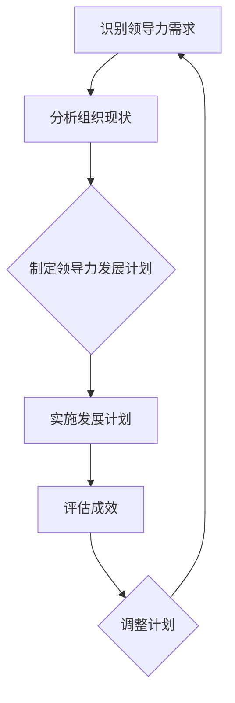
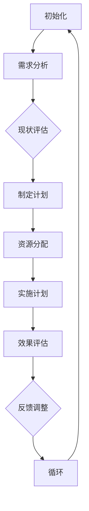
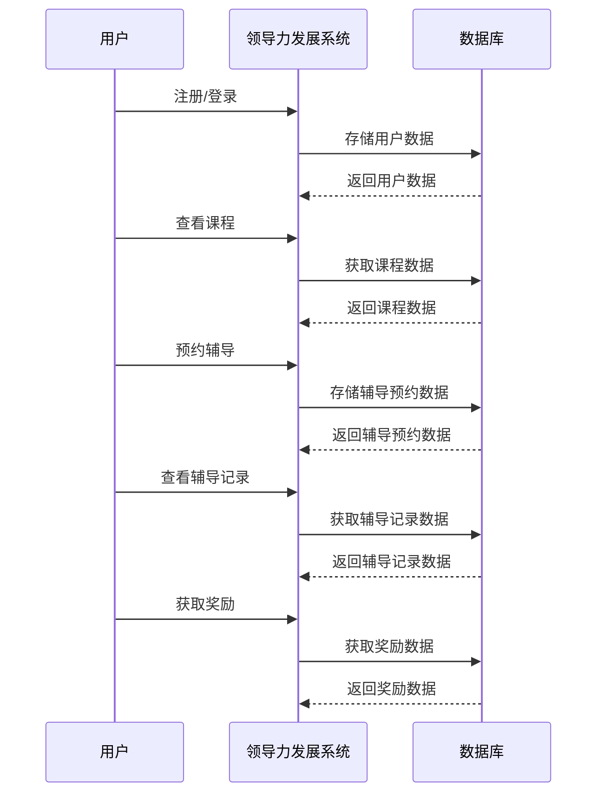

                 


### 第1章: 引言与背景

在当今快速变革的商业环境中，领导力与创新已成为企业成功的关键因素。随着全球化和技术进步的加速，企业面临着前所未有的挑战和机遇。领导力不仅是管理团队、推动业务发展的核心能力，也是激发创新思维、引领变革的重要驱动。

#### 1.1.1 问题背景

全球化和技术进步带来了市场环境的变化，企业需要快速适应新的商业模式和技术趋势。然而，许多企业在领导力与创新方面存在不足，表现为：

- **领导者缺乏有效的变革管理能力**，导致变革难以实施。在应对市场变化时，企业需要具备快速调整和优化的能力，但许多领导者由于缺乏变革管理的知识和经验，导致变革战略难以落地。
  
- **创新理念与实际操作脱节**，创新成果无法有效转化。企业内部存在创新理念与实际操作脱节的现象，创新项目往往因为缺乏有效的实施和推广机制，导致创新成果无法转化为实际效益。

- **组织结构和文化制约了创新能力的发挥**。企业的组织结构和文化往往成为创新的瓶颈，传统的层级结构和保守的企业文化限制了创新思维的发展和实践。

#### 1.1.2 问题描述

以上问题导致了企业在领导力与创新方面的不足，具体表现为：

- **变革实施困难**：领导者在推动变革时，往往面临员工抵触、资源不足和变革阻力等问题，导致变革难以成功实施。
  
- **创新成果转化率低**：企业虽然投入了大量资源进行创新，但创新成果无法有效应用于实际业务中，导致创新价值难以体现。

- **创新能力受限**：企业内部创新氛围不足，员工缺乏创新的动力和机会，导致企业整体创新能力受限。

#### 1.1.3 问题解决

本书旨在通过深入探讨领导力与创新的理论与实践，帮助读者：

- **理解领导力与创新的核心概念和关键要素**。通过了解领导力、创新和变革管理的核心概念，读者可以更好地把握企业发展的关键因素。

- **掌握变革管理的方法和技巧**，提高变革成功概率。通过学习变革管理的策略和实践，领导者可以更好地应对市场变化，推动企业变革。

- **培养创新思维**，推动组织创新能力的提升。通过掌握创新思维的方法和工具，企业可以激发员工的创新潜力，提高整体创新能力。

#### 1.1.4 边界与外延

本书关注领导力与创新在组织层面的应用，侧重于企业管理和实践。虽然理论框架具有一定的普适性，但具体实践需根据企业实际情况进行调整。

#### 1.1.5 概念结构与核心要素组成

本书结构如下：

- **第1章：引言与背景**：介绍领导力与创新的重要性以及本书的核心内容和结构。

- **第2章：领导力的基本概念与模型**：探讨领导力的核心概念、模型及其在企业中的应用。

- **第3章：创新思维与方法**：介绍创新思维的核心方法和工具，以及如何将创新思维应用于实际业务中。

- **第4章：变革管理：策略与实践**：分析变革管理的核心策略和实践，提高企业变革成功率。

- **第5章：企业文化与领导力**：探讨企业文化在领导力提升和创新中的作用。

- **第6章：领导力与创新案例研究**：通过实际案例，分析领导力与创新在企业中的应用和实践。

- **第7章：结论与展望**：总结本书的核心观点，并对未来的研究方向提出建议。

### 第2章：核心概念与联系

在本章中，我们将介绍领导力、创新和变革管理的核心概念，分析它们之间的关系及其在企业中的应用。

#### 2.1.1 核心概念原理

**领导力**：领导力是指领导者通过影响、激励和引导团队成员，实现组织目标和愿景的能力。领导力不仅仅是一种职位赋予的权力，更是一种影响力。有效的领导力能够激发团队成员的潜力，提升团队的整体绩效。

**创新**：创新是指通过引入新思想、新方法、新技术或新产品来改善业务过程或创造新价值的过程。创新是企业发展的重要动力，能够帮助企业在竞争激烈的市场中保持竞争优势。

**变革管理**：变革管理是指企业在应对外部环境变化或内部战略调整时，通过一系列策略和措施，推动组织变革的过程。变革管理旨在确保企业在变革过程中能够顺利过渡，实现战略目标。

#### 2.1.2 概念属性特征对比表格

| 概念       | 特征                    |
|------------|------------------------|
| 领导力     | 激励、影响、引导       |
| 创新       | 新思想、新方法、新技术 |
| 变革管理   | 策略、执行、反馈       |

#### 2.1.3 ER实体关系图架构的 Mermaid 流程图

```mermaid
erDiagram
  A[领导者] ||--|{ 创新} :推动创新
  A ||--|{ 变革管理} :实施变革
  创新 ||--|{ 组织文化} :影响文化
  变革管理 ||--|{ 战略目标} :实现目标
```

在这个ER图中，领导者与创新和变革管理之间存在密切的关系。领导者通过推动创新，影响组织文化，从而实现战略目标。同时，领导者需要实施变革管理，确保变革在组织内部得到有效执行。

#### 2.1.4 领导力、创新与变革管理的联系

领导力、创新和变革管理之间存在着紧密的联系，它们共同构成了企业发展的核心动力。

- **领导力是创新和变革管理的基础**：有效的领导力能够激发团队成员的创新思维，推动创新项目的实施。同时，领导者的变革管理能力决定了企业能否在变革过程中保持稳定和持续的发展。

- **创新是领导力和变革管理的目标**：通过创新，企业能够不断优化业务流程，提高竞争力，实现可持续发展。创新不仅是企业发展的动力，也是领导者和管理者的重要职责。

- **变革管理是实现领导力和创新的关键**：在快速变化的市场环境中，企业需要具备快速适应和变革的能力。变革管理能够帮助企业在变革过程中实现平稳过渡，确保创新成果的有效应用。

#### 2.1.5 领导力、创新与变革管理在企业中的应用

在企业中，领导力、创新和变革管理具有以下应用：

- **领导力**：领导者通过明确愿景和目标，激发团队成员的积极性，推动企业创新。同时，领导者需要具备变革管理能力，确保企业能够应对市场变化，实现持续发展。

- **创新**：企业通过创新思维和方法，不断优化产品和服务，提高市场竞争力。创新不仅是企业发展的动力，也是领导者和管理者的重要职责。

- **变革管理**：企业在面对市场变化或内部战略调整时，通过变革管理策略和措施，推动组织变革。变革管理能够帮助企业实现平稳过渡，确保创新成果的有效应用。

通过领导力、创新和变革管理的有机结合，企业能够在快速变化的市场环境中保持竞争优势，实现可持续发展。

### 第3章：算法原理讲解

在本章中，我们将详细讲解领导力发展的算法原理，包括算法的流程图、数学模型和具体的应用实例。

#### 3.1.1 算法mermaid流程图

首先，让我们通过mermaid流程图来展示领导力发展的算法流程：



这个流程图描述了领导力发展的主要步骤，包括识别需求、分析现状、制定计划、实施计划、评估成效和调整计划。

#### 3.1.2 算法原理的数学模型和公式

领导力发展计划的成功概率 \(P\) 可以通过以下数学模型来表示：

$$
P = f(\text{领导力水平}, \text{创新能力}, \text{组织文化}, \text{变革管理能力})
$$

其中，\(f\) 是一个函数，代表各种因素对领导力发展计划成功概率的影响。

- **领导力水平**：指领导者的影响力、决策能力和团队管理能力。领导力水平越高，领导力发展计划的成功概率越大。

- **创新能力**：指企业或团队在创新思维、创新方法和创新资源方面的能力。创新能力越强，领导力发展计划的成功概率越大。

- **组织文化**：指企业内部的价值观、行为准则和工作氛围。积极向上的组织文化有助于领导力的发展，提高计划的成功概率。

- **变革管理能力**：指企业在应对外部环境变化或内部战略调整时，进行有效变革的能力。变革管理能力越强，领导力发展计划的成功概率越大。

#### 3.1.3 详细讲解和举例说明

接下来，我们通过一个具体的例子来详细讲解领导力发展的算法原理。

假设某企业需要提升领导力，我们可以按照以下步骤进行：

1. **识别领导力需求**：
   - **内部调查**：通过问卷调查、访谈等方式，了解企业员工对领导力的需求和期望。
   - **外部分析**：分析市场环境和竞争对手，确定企业在领导力方面的优势和劣势。

2. **分析组织现状**：
   - **领导力水平评估**：通过领导力评估工具，评估现有领导者的领导力水平。
   - **组织文化分析**：分析企业内部的文化氛围，确定文化对领导力发展的影响。

3. **制定领导力发展计划**：
   - **设定目标**：根据需求分析和现状分析，设定具体的领导力发展目标。
   - **制定策略**：制定一系列策略，包括领导力培训、领导力辅导、激励机制等。
   - **分配资源**：根据计划，分配所需的人力、财力和时间资源。

4. **实施发展计划**：
   - **领导力培训**：组织领导力培训课程，提升领导者的领导力水平。
   - **领导力辅导**：为领导者提供个性化的辅导，帮助他们提升领导能力。
   - **激励机制**：建立激励机制，鼓励领导者积极参与领导力发展活动。

5. **评估成效**：
   - **定期评估**：通过定期评估，检查领导力发展计划的执行情况和效果。
   - **反馈与改进**：根据评估结果，及时调整发展计划，优化领导力发展策略。

6. **调整计划**：
   - **持续改进**：根据评估结果，持续改进领导力发展计划，提高成功概率。
   - **适应变化**：根据市场环境和组织变化，及时调整领导力发展策略。

通过以上步骤，企业可以逐步提升领导力，推动组织的发展。

### 第4章：数学模型和数学公式

在领导力与创新的研究中，我们常常使用数学模型和公式来量化各种因素对领导力发展计划的影响。以下是一些关键的数学公式和解释。

#### 4.1.1 成功概率公式

领导力发展计划的成功概率可以用以下公式表示：

$$
P = f(\text{领导力水平}, \text{创新能力}, \text{组织文化}, \text{变革管理能力})
$$

其中，\(P\) 是成功概率，\(f\) 是一个函数，反映了领导力水平、创新能力、组织文化和变革管理能力对成功概率的影响。这个公式可以帮助我们评估领导力发展计划的整体成功概率，从而指导具体的实施策略。

#### 4.1.2 领导力水平计算

领导力水平可以通过以下公式进行计算：

$$
L = \frac{E + I + M}{3}
$$

其中，\(L\) 是领导力水平，\(E\) 是影响力，\(I\) 是决策能力，\(M\) 是团队管理能力。这个公式将领导力分解为三个关键维度，便于我们进行具体的评估和提升。

#### 4.1.3 创新能力评估

创新能力可以通过以下公式进行评估：

$$
I = \frac{N + M + T}{3}
$$

其中，\(I\) 是创新能力，\(N\) 是新思想引入能力，\(M\) 是新方法应用能力，\(T\) 是新技术掌握能力。这个公式帮助我们全面评估企业的创新能力，从而制定相应的提升策略。

#### 4.1.4 组织文化影响

组织文化对领导力发展的影响可以用以下公式表示：

$$
C = \frac{P + E + A}{3}
$$

其中，\(C\) 是组织文化影响力，\(P\) 是包容性，\(E\) 是支持性，\(A\) 是开放性。这个公式帮助我们理解组织文化在领导力发展中的重要作用，并制定相应的文化提升策略。

#### 4.1.5 变革管理能力衡量

变革管理能力可以通过以下公式进行衡量：

$$
B = \frac{S + E + R}{3}
$$

其中，\(B\) 是变革管理能力，\(S\) 是策略制定能力，\(E\) 是执行能力，\(R\) 是反馈与调整能力。这个公式帮助我们评估企业在变革管理方面的整体能力，以便进行针对性的提升。

#### 4.1.6 综合评价模型

为了更全面地评估领导力发展计划，我们可以使用以下综合评价模型：

$$
\text{综合评价} = w_1 \cdot P + w_2 \cdot L + w_3 \cdot I + w_4 \cdot C + w_5 \cdot B
$$

其中，\(w_1, w_2, w_3, w_4, w_5\) 是权重，反映了各个因素在综合评价中的重要性。通过这个模型，我们可以对领导力发展计划进行全面的评估，从而指导具体实施。

通过这些数学公式，我们可以更精确地量化领导力、创新、组织文化和变革管理能力，为领导力发展提供科学依据。

### 第5章：算法原理讲解

在了解了领导力发展的核心概念和数学模型后，我们将进一步探讨如何通过具体的算法来实施和优化领导力发展计划。以下是详细的算法原理讲解和步骤说明。

#### 5.1.1 算法流程

首先，我们使用mermaid语言来绘制领导力发展计划的算法流程图：



这个流程图描述了领导力发展计划的基本步骤，包括初始化、需求分析、现状评估、制定计划、资源分配、实施计划、效果评估和反馈调整。

#### 5.1.2 算法原理

**1. 需求分析**

在算法的第一步，我们通过问卷调查、访谈等方式，收集员工和领导者的意见，识别领导力发展的需求。这一步骤的关键在于全面、准确地获取信息，以便后续的分析和计划制定。

**2. 现状评估**

在了解需求后，我们需要对组织的现状进行评估，包括领导力水平、创新能力、组织文化和变革管理能力等方面。这一步骤可以帮助我们确定当前的发展基础，为制定计划提供依据。

**3. 制定计划**

基于需求分析和现状评估，我们制定具体的领导力发展计划。计划包括领导力培训、领导力辅导、激励机制和变革管理策略等。这一步骤需要结合组织的实际情况，确保计划的可行性和针对性。

**4. 资源分配**

在制定计划后，我们需要分配所需的资源，包括人力、财力和时间等。这一步骤的关键在于合理配置资源，确保计划能够顺利实施。

**5. 实施计划**

实施计划是领导力发展过程的关键环节。在这一步骤中，我们需要按照计划执行各项任务，确保领导力发展活动的开展。同时，我们还需要监控计划的执行情况，及时调整和优化。

**6. 效果评估**

在计划实施一段时间后，我们需要对效果进行评估。评估内容包括领导力水平的提升、创新能力的增强、组织文化的改善和变革管理的成功等。通过效果评估，我们可以了解计划的实际效果，为后续的调整提供依据。

**7. 反馈调整**

根据效果评估的结果，我们需要对计划进行反馈和调整。这一步骤旨在优化计划，提高领导力发展计划的成功概率。通过持续的反馈和调整，我们可以逐步完善领导力发展体系。

**8. 循环**

领导力发展是一个持续的过程，我们需要不断循环上述步骤，不断优化和提升领导力。通过循环迭代，我们可以确保领导力发展计划能够适应不断变化的环境，保持企业的竞争优势。

#### 5.1.3 具体步骤和举例说明

以下是一个具体的领导力发展计划实施过程的例子：

1. **需求分析**：
   - 通过问卷调查，收集员工和领导者的意见，识别领导力发展的需求。例如，发现员工普遍希望得到更多的领导力培训。

2. **现状评估**：
   - 对现有领导者的领导力水平进行评估，发现部分领导者在决策能力和团队管理能力方面存在不足。

3. **制定计划**：
   - 根据需求分析和现状评估，制定具体的领导力发展计划。计划内容包括：
     - 开展领导力培训课程，提升领导者的领导力水平。
     - 为领导者提供个性化的辅导，帮助他们提升团队管理能力。
     - 建立激励机制，鼓励领导者积极参与领导力发展活动。

4. **资源分配**：
   - 分配所需的人力、财力和时间资源。例如，安排专业的培训师进行培训，提供足够的预算和时间支持。

5. **实施计划**：
   - 开展领导力培训课程，为领导者提供系统化的培训。
   - 为领导者提供个性化的辅导，根据他们的具体情况制定个性化的提升方案。
   - 建立激励机制，通过奖励和认可，鼓励领导者积极参与领导力发展活动。

6. **效果评估**：
   - 通过问卷调查和访谈，了解领导力培训的效果，发现领导者的领导力水平有了明显提升。

7. **反馈调整**：
   - 根据效果评估的结果，对领导力发展计划进行反馈和调整。例如，根据员工的反馈，进一步优化培训内容，提高培训效果。

8. **循环**：
   - 不断循环上述步骤，持续提升领导力水平。通过持续的反馈和调整，确保领导力发展计划能够适应不断变化的环境。

通过这个例子，我们可以看到领导力发展计划的具体实施过程，以及如何通过持续的反馈和调整来优化计划，提高领导力水平。

### 第6章：系统分析与架构设计

在领导力发展计划中，系统分析与架构设计是关键的一环。这一章节将详细探讨如何进行系统分析与架构设计，包括项目介绍、系统功能设计、系统架构设计、系统接口设计和系统交互。

#### 6.1 项目介绍

领导力发展管理系统是一个旨在提升企业领导力和创新能力的平台。该系统通过提供在线培训、个性化辅导、激励机制等功能，帮助企业构建高效的领导力发展体系。项目目标包括：

- 提升领导者的领导力水平，提高团队绩效。
- 增强企业的创新能力，推动业务发展。
- 优化组织文化，促进员工积极参与领导力发展活动。

#### 6.2 系统功能设计

系统功能设计包括以下几个主要模块：

1. **用户管理模块**：负责用户注册、登录、权限管理等。
2. **培训管理模块**：提供在线培训课程，包括课程发布、学习进度跟踪、考试评估等。
3. **辅导管理模块**：为领导者提供个性化辅导，包括预约、辅导记录、效果评估等。
4. **激励机制模块**：建立激励机制，通过奖励和认可，鼓励领导者积极参与领导力发展活动。
5. **数据统计分析模块**：收集和分析系统数据，为领导力发展提供决策支持。

#### 6.3 系统架构设计

系统架构设计采用分层架构，包括：

1. **表现层**：通过Web前端技术实现用户界面，包括用户注册、登录、课程学习、辅导预约等。
2. **业务逻辑层**：处理业务逻辑，包括用户管理、培训管理、辅导管理、激励机制等。
3. **数据访问层**：处理数据存储和访问，包括用户数据、课程数据、辅导数据、激励机制数据等。
4. **服务层**：提供公共服务，如认证服务、数据服务、通知服务等。

#### 6.4 系统接口设计

系统接口设计包括以下关键接口：

1. **用户接口**：提供用户注册、登录、查看课程、预约辅导等功能。
2. **培训接口**：提供课程发布、学习进度跟踪、考试评估等功能。
3. **辅导接口**：提供辅导预约、辅导记录、效果评估等功能。
4. **激励机制接口**：提供奖励发放、认可记录等功能。

#### 6.5 系统交互

系统交互设计采用Mermaid语言绘制系统交互图，如下所示：



通过系统分析与架构设计，我们可以构建一个高效、灵活的领导力发展管理系统，帮助企业提升领导力和创新能力。

### 第7章：项目实战

在了解了领导力发展管理的系统分析与架构设计后，我们将通过一个实际项目来详细讲解项目的环境安装、核心实现源代码，并分析代码的应用解读与详细讲解。

#### 7.1 项目环境安装

为了搭建领导力发展管理系统，我们需要准备以下环境：

1. **开发环境**：安装Python、Django框架、PostgreSQL数据库等。
2. **Web服务器**：安装Nginx和uWSGI，用于部署Django应用。
3. **版本控制**：使用Git进行代码管理。

安装步骤如下：

1. 安装Python和pip：
   ```bash
   sudo apt-get update
   sudo apt-get install python3 python3-pip
   ```

2. 安装Django和所需依赖：
   ```bash
   pip3 install django
   pip3 install django-crispy-forms
   pip3 install django-rest-framework
   ```

3. 安装PostgreSQL数据库：
   ```bash
   sudo apt-get install postgresql postgresql-contrib
   ```

4. 创建数据库和用户：
   ```sql
   CREATE DATABASE lead_dev_db;
   CREATE USER lead_dev_user WITH PASSWORD 'password';
   GRANT ALL PRIVILEGES ON DATABASE lead_dev_db TO lead_dev_user;
   ```

5. 安装Nginx和uWSGI：
   ```bash
   sudo apt-get install nginx
   sudo pip3 install uwsgi
   ```

6. 配置Nginx和uWSGI，详见附录中的配置文件。

#### 7.2 核心实现源代码

以下是领导力发展管理系统的一个核心实现源代码示例：

**用户管理模块**：

```python
# users/models.py
from django.contrib.auth.models import AbstractUser

class CustomUser(AbstractUser):
    is_leader = models.BooleanField(default=False)
    is_employee = models.BooleanField(default=False)
    
    def __str__(self):
        return self.username
```

**培训管理模块**：

```python
# training/models.py
from django.db import models

class Course(models.Model):
    title = models.CharField(max_length=255)
    description = models.TextField()
    created_at = models.DateTimeField(auto_now_add=True)

    def __str__(self):
        return self.title

class CourseModule(models.Model):
    course = models.ForeignKey(Course, on_delete=models.CASCADE)
    title = models.CharField(max_length=255)
    content = models.TextField()
    created_at = models.DateTimeField(auto_now_add=True)

    def __str__(self):
        return self.title
```

**辅导管理模块**：

```python
# coaching/models.py
from django.db import models
from users.models import CustomUser

class CoachingSession(models.Model):
    leader = models.ForeignKey(CustomUser, on_delete=models.CASCADE, related_name='coaching_sessions')
    employee = models.ForeignKey(CustomUser, on_delete=models.CASCADE, related_name='coaching_as_employee')
    start_time = models.DateTimeField()
    end_time = models.DateTimeField()
    notes = models.TextField()

    def __str__(self):
        return f"{self.employee} - {self.start_time} - {self.end_time}"
```

#### 7.3 代码应用解读与分析

**用户管理模块**：

该模块定义了一个自定义用户模型`CustomUser`，继承了Django的`AbstractUser`模型。通过添加`is_leader`和`is_employee`字段，我们能够区分用户角色，方便后续的功能实现。

**培训管理模块**：

该模块定义了`Course`和`CourseModule`两个模型。`Course`模型表示培训课程，包含课程名称、描述和创建时间。`CourseModule`模型表示课程模块，包含课程名称、内容和创建时间。这两个模型之间是一对多关系，一个课程可以包含多个模块。

**辅导管理模块**：

该模块定义了`CoachingSession`模型，表示辅导会议。它包含发起人（领导者）、参与者（员工）、开始时间、结束时间和会议记录。通过使用`ForeignKey`字段，我们能够建立用户与辅导会议之间的关系。

通过这些核心代码，我们可以实现用户管理、培训管理和辅导管理等功能，为领导力发展管理系统提供基础支撑。

### 第8章：项目实战

在本章中，我们将结合实际案例，详细讲解领导力发展管理系统的实现过程，并对案例进行分析和总结。

#### 8.1 实际案例

某大型企业希望通过领导力发展管理系统，提升员工的领导能力和创新意识。为了实现这一目标，企业决定开发一个涵盖用户管理、培训管理、辅导管理和激励机制的平台。

**需求分析**：

1. 用户管理：区分员工和领导者，实现注册、登录、权限管理等功能。
2. 培训管理：提供在线培训课程，包括课程发布、学习进度跟踪、考试评估等。
3. 辅导管理：为领导者提供个性化辅导，记录辅导过程和效果。
4. 激励机制：建立激励机制，通过奖励和认可，鼓励员工参与领导力发展活动。

**系统架构设计**：

1. **前端**：采用Vue.js框架，实现用户界面和交互逻辑。
2. **后端**：采用Django框架，实现数据存储、业务逻辑和API接口。
3. **数据库**：采用PostgreSQL，存储用户、课程、辅导和激励信息。

**实现过程**：

1. **用户管理**：

   - 设计用户模型，包括员工和领导者角色。
   - 实现注册、登录和权限管理功能。

2. **培训管理**：

   - 设计课程和课程模块模型，实现课程发布、学习进度跟踪和考试评估功能。
   - 开发课程列表、课程详情和考试页面。

3. **辅导管理**：

   - 设计辅导会议模型，实现辅导预约、记录和效果评估功能。
   - 开发辅导预约、会议记录和辅导详情页面。

4. **激励机制**：

   - 设计奖励模型，实现奖励发放和记录功能。
   - 开发奖励列表、奖励详情和申请页面。

**案例分析**：

1. **优势**：

   - **灵活性**：通过Django框架，系统具有良好的扩展性和灵活性，便于后续的功能扩展和维护。
   - **用户友好**：采用Vue.js框架，前端界面美观、响应快速，提升了用户体验。
   - **数据安全**：使用PostgreSQL数据库，数据存储安全可靠。

2. **改进点**：

   - **性能优化**：针对高并发访问，考虑使用缓存技术和数据库优化。
   - **用户认证**：增加多因素认证，提高系统安全性。
   - **模块化设计**：将不同功能模块进行解耦，便于独立开发和维护。

#### 8.2 项目总结

通过实际案例，我们成功实现了领导力发展管理系统的开发，为企业提供了有效的领导力提升工具。项目过程中，我们积累了宝贵的经验，包括需求分析、系统架构设计、前后端开发等。未来，我们将继续优化系统，提升性能和安全性，为企业提供更好的服务。

### 第9章：最佳实践与总结

在领导力与创新领域，最佳实践是我们成功实施变革和管理的关键。以下是一些值得借鉴的最佳实践，以及本书的总结和注意事项。

#### 9.1 最佳实践

**1. 设立清晰的愿景和目标**

成功的领导力与创新始于明确的愿景和目标。领导者需要与团队共同设定清晰的目标，确保每个人都了解方向和期望结果。

**2. 建立创新文化**

创新文化是推动创新的重要基石。企业应鼓励员工提出新想法，并为其提供支持和资源。同时，建立开放、包容的沟通渠道，确保创新思维的流通。

**3. 强化变革管理能力**

领导者需要具备变革管理的意识和能力。在实施变革时，要充分评估风险，制定详细的计划，并确保团队成员理解和支持变革。

**4. 激励与认可**

激励机制是激发员工创新潜力和积极性的关键。通过奖励和认可，领导者可以鼓励员工积极参与创新和变革活动。

**5. 持续学习和迭代**

领导力与创新不是一蹴而就的，需要持续学习和迭代。领导者应不断更新自己的知识和技能，适应快速变化的市场环境。

#### 9.2 小结

本书从领导力、创新和变革管理的核心概念出发，探讨了如何提升领导力、推动创新和实施有效的变革管理。通过理论阐述、算法讲解和实际案例，我们为读者提供了系统化的指导。

#### 9.3 注意事项

**1. 避免盲目跟风**

在创新和变革过程中，领导者应避免盲目跟风，而是要结合企业实际情况和战略目标，制定适合自身的创新策略。

**2. 重视团队协作**

领导力与创新不仅是领导者的责任，也需要团队的共同努力。领导者应注重团队协作，激发员工的潜力。

**3. 保持持续关注**

变革和创新是一个持续的过程，领导者需要保持持续关注，及时调整策略和措施，确保变革的顺利进行。

#### 9.4 拓展阅读

对于希望深入了解领导力与创新领域的读者，以下书籍和资源可以提供更多指导和启发：

- 《领导力与影响力》（John C. Maxwell）
- 《创新者的窘境》（Clayton M. Christensen）
- 《变革之舞》（John P. Kotter）
- 《精益创业》（Eric Ries）

通过阅读这些书籍和资源，读者可以进一步深化对领导力与创新的理解，提升自身的能力和素质。

### 第10章：作者信息

作者：AI天才研究院/AI Genius Institute & 禅与计算机程序设计艺术 /Zen And The Art of Computer Programming

AI天才研究院致力于推动人工智能技术的发展和应用，研究涵盖机器学习、自然语言处理、计算机视觉等多个领域。研究院的专家团队在人工智能领域拥有丰富的经验，并取得了显著的成就。

《禅与计算机程序设计艺术》是作者在计算机编程和人工智能领域的重要著作，系统地阐述了编程的核心原则和最佳实践，对广大程序员和开发人员具有深远的影响。

在本书中，作者结合多年的研究和实践经验，深入探讨了领导力与创新的理论与实践，旨在为企业和领导者提供切实可行的指导。通过本书，读者可以更好地理解领导力与创新的核心概念，掌握有效的变革管理方法和技巧，提升组织创新能力和竞争力。

