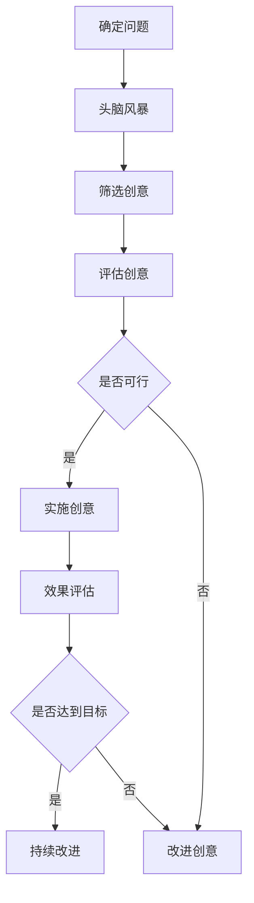

                 

# 领导力与创新：引领团队走向未来

## 关键词：领导力、创新、团队管理、组织发展、未来趋势

## 摘要：
在快速变化的技术环境中，领导力和创新成为组织发展的关键驱动力。本文深入探讨了领导力与创新的基本概念、核心要素，以及它们在团队管理中的应用。通过分析领导力与创新的关系、领导力的核心要素、创新思维的培养方法，本文揭示了领导力与创新在现代组织中的重要作用。同时，本文通过实际案例和未来趋势的探讨，为读者提供了实践策略和思考方向，以帮助团队领导者引领团队走向未来。

## 引言

### 问题背景

在现代企业管理中，领导力和创新已成为企业发展的核心要素。随着全球化和技术变革的加速，企业面临着前所未有的挑战和机遇。一方面，市场环境瞬息万变，要求企业具备快速适应和创新能力；另一方面，员工需求的变化和竞争压力的增大，使得领导者需要具备更高的领导力和创新素养。

### 领导力与创新的重要性

领导力是指领导者通过影响力、沟通能力、决策能力等核心要素，引导和激励团队成员达成共同目标的能力。创新则是指通过创造新思想、新方法、新产品等，实现组织发展的能力。领导力与创新在组织管理中具有以下重要性：

1. **驱动组织发展**：领导力与创新能够激发员工的积极性和创造力，推动组织实现长期发展目标。
2. **提升核心竞争力**：通过创新，企业能够不断优化产品和服务，提升市场竞争力。
3. **应对不确定性**：领导力和创新有助于组织适应外部环境的变化，降低风险。
4. **培养人才**：领导力与创新能够培养和吸引优秀人才，为组织发展提供持续动力。

### 组织管理面临的挑战

在快速变化的市场环境中，组织管理面临着以下挑战：

1. **变化速度**：技术变革和市场需求的快速变化，要求组织具备快速反应和创新能力。
2. **人才竞争**：优秀人才的竞争日益激烈，领导者需要具备吸引和留住人才的能力。
3. **跨部门协作**：在复杂的项目中，跨部门协作的效率和质量成为组织管理的关键。
4. **持续创新**：创新不再是偶然事件，而是组织持续发展的核心能力。

## 书籍结构概述

### 主要内容与章节安排

为了深入探讨领导力与创新在团队管理中的应用，本书分为以下主要部分：

1. **引言**：介绍领导力与创新的基本概念，阐述其在组织管理中的重要性，引入相关的理论模型。
2. **领导力与创新的基本概念与重要性**：分析领导力和创新的基本概念，探讨它们在组织管理中的应用和重要性。
3. **领导力的核心要素**：分析领导力的核心要素，如影响力、沟通能力、决策能力等，并使用表格对比不同要素的特点。
4. **创新思维的培养**：探讨创新思维的培养方法，如头脑风暴、跨部门协作等，并使用Mermaid图展示创新思维的工作流程。
5. **领导力与创新在团队中的应用**：结合实际案例，展示领导力与创新在团队中的应用，如如何激发团队成员的创新潜力。
6. **领导力与创新案例分析**：通过案例分析，探讨领导力与创新在不同组织中的成功实践。
7. **领导力与创新的未来趋势**：预测领导力与创新在未来社会中的发展趋势，如人工智能、虚拟现实等新兴技术的影响。
8. **领导力与创新的实践策略**：总结领导力与创新的实践策略，提供实用的建议和技巧。

### 目标读者

本书的目标读者包括：

1. **企业领导者**：需要提升领导力和创新能力的领导者，特别是那些希望推动组织创新和持续发展的领导者。
2. **项目经理**：需要有效管理团队和创新项目的项目经理，特别是那些面临跨部门协作和快速变化挑战的项目经理。
3. **管理顾问**：需要为组织提供领导力与创新咨询和管理建议的管理顾问。
4. **学生和研究人员**：对领导力与创新理论和方法感兴趣的学生和研究人员，特别是那些希望深入了解和实践这些理论的读者。

### 本章小结

本章介绍了领导力与创新在组织管理中的重要性，并概述了本书的结构和内容。通过分析领导力与创新的基本概念和重要性，读者可以初步理解领导力与创新在团队管理中的关键作用。接下来，本书将深入探讨领导力与创新的理论和实践，帮助读者提升领导力和创新能力，引领团队走向未来。

## 第1章：领导力与创新的基本概念与重要性

### 1.1 领导力概述

#### 定义与核心要素

领导力是一种通过影响力、沟通能力、决策能力等核心要素，引导和激励团队成员达成共同目标的能力。领导力的定义有多种，但核心要素却是相对一致的。

- **影响力**：领导者通过自身的行为和价值观影响他人，使其愿意追随和实现目标的能力。
- **沟通能力**：领导者通过有效的沟通，传达信息、协调行动，建立信任和合作关系的能力。
- **决策能力**：领导者在面对不确定性时，能够快速做出明智决策的能力。
- **领导风格**：领导者处理团队和管理事务的方式，包括权威型、民主型、变革型等。

#### 领导力的作用

领导力在组织管理中起着至关重要的作用，具体体现在以下几个方面：

1. **激发团队潜力**：优秀的领导者能够激发团队成员的潜力，使其发挥最大价值。
2. **促进团队合作**：领导力有助于建立高效的团队，促进团队成员之间的协作和沟通。
3. **推动组织创新**：领导力能够激发创新思维，推动组织在产品、服务和管理等方面进行创新。
4. **应对变革**：在面临外部环境变化时，领导力有助于组织迅速适应和应对。

### 1.2 创新概述

#### 定义与分类

创新是指通过创造新思想、新方法、新产品等，实现组织发展的能力。创新可以分为多种类型，如：

1. **产品创新**：开发新产品或改进现有产品，满足市场需求。
2. **过程创新**：优化生产流程或管理流程，提高效率和质量。
3. **市场创新**：开拓新市场或创造新的商业模式。
4. **组织创新**：改革组织结构和文化，提高组织适应性和竞争力。

#### 创新的作用

创新在组织管理中具有重要作用，具体体现在以下几个方面：

1. **提升竞争力**：通过创新，组织可以不断优化产品和服务，提升市场竞争力。
2. **推动发展**：创新是组织发展的核心动力，有助于组织实现长期目标。
3. **应对挑战**：在面临外部环境变化时，创新有助于组织迅速适应和应对。
4. **培养人才**：创新过程能够培养和锻炼员工的创造力和创新能力。

### 1.3 领导力与创新的关系

#### 模型介绍与概念联系

领导力与创新之间存在密切的关系，两者相互促进，共同推动组织发展。以下是一个简单的领导力与创新关系模型：

1. **领导力激发创新**：领导者通过激发团队成员的潜力、提供资源和创造有利环境，推动创新。
2. **创新反馈领导力**：创新的成功和失败会反过来影响领导力，领导者需要根据创新的结果调整自己的领导风格和方法。
3. **共同目标**：领导力与创新都致力于实现组织的目标，两者在目标上具有一致性。

#### 概念联系

领导力与创新的概念联系体现在以下几个方面：

1. **共同核心要素**：领导力和创新都涉及到影响力、沟通能力、决策能力等核心要素。
2. **相互作用**：领导力可以激发创新，创新又可以反过来影响领导力。
3. **共同目标**：领导力与创新都致力于实现组织的长期发展目标。

### 1.4 领导力与创新在组织管理中的应用

#### 理论基础与实践价值

领导力与创新在组织管理中的应用具有重要意义，以下是几个方面的理论基础和实践价值：

1. **理论基础**：
   - **变革管理理论**：领导力在推动组织变革中起着关键作用，创新是实现变革的重要手段。
   - **资源基础理论**：创新有助于组织建立独特的资源优势，提升竞争力。
   - **动态能力理论**：领导力与创新有助于组织快速适应外部环境的变化。

2. **实践价值**：
   - **提升组织绩效**：领导力与创新能够提高组织的绩效和竞争力。
   - **促进团队合作**：领导力有助于建立高效的团队，创新有助于激发团队的创造力。
   - **实现持续发展**：领导力与创新共同推动组织实现长期发展目标。

### 1.5 主流领导力与创新理论对比

#### 特点与适用场景

以下是几种主流的领导力与创新理论的对比，包括特点、适用场景和优缺点：

1. **变革型领导力**
   - **特点**：强调领导者通过激发团队成员的积极性和创造力，推动组织变革。
   - **适用场景**：适用于需要变革和创新的组织。
   - **优点**：能够激发员工的潜力和创造力。
   - **缺点**：对领导者的要求较高，实施难度较大。

2. **创新型领导力**
   - **特点**：强调领导者通过创造和创新，推动组织发展。
   - **适用场景**：适用于创新驱动的组织。
   - **优点**：能够促进组织的创新和发展。
   - **缺点**：对领导者的创新能力和知识储备要求较高。

3. **系统型领导力**
   - **特点**：强调领导者通过建立有效的组织系统，推动组织发展。
   - **适用场景**：适用于需要系统化管理的组织。
   - **优点**：能够提高组织的效率和协同性。
   - **缺点**：对领导者的系统思维和管理能力要求较高。

### 1.6 本章小结

本章介绍了领导力与创新的基本概念、核心要素及其在组织管理中的应用。通过分析领导力与创新的关系，揭示了两者在组织发展中的重要性。接下来，本书将深入探讨领导力的核心要素和创新思维的培养方法，帮助读者提升领导力和创新能力，引领团队走向未来。

## 第2章：领导力的核心要素

### 2.1 影响力

#### 核心概念与作用

影响力是指领导者通过自身的行为、价值观和沟通能力，影响和引导团队成员的能力。影响力在领导力中起着至关重要的作用，是领导者发挥领导作用的基础。

1. **定义**：影响力是指领导者通过影响他人的思想和行为，使其愿意追随和实现领导者的目标。
2. **作用**：
   - **激发团队成员的积极性**：领导者通过影响力，可以激发团队成员的积极性和主动性，提高团队整体绩效。
   - **建立信任**：领导者通过影响力，可以建立团队成员之间的信任，促进团队合作。
   - **推动组织变革**：领导者通过影响力，可以推动组织变革和创新，适应外部环境的变化。

#### 影响力的来源

1. **信任**：领导者通过诚信和正直的行为赢得团队成员的信任，从而获得影响力。
2. **专业知识**：领导者具备丰富的专业知识和经验，可以提升其领导地位和影响力。
3. **情感共鸣**：领导者与团队成员建立情感联系，通过情感共鸣获得影响力。
4. **榜样作用**：领导者通过自身的榜样作用，影响团队成员的行为和态度。

#### 培养影响力的方法

1. **建立信任**：领导者通过诚信和正直的行为，赢得团队成员的信任。
2. **提升专业知识**：领导者通过不断学习和积累专业知识，提升自身的影响力。
3. **沟通技巧**：领导者通过有效的沟通技巧，传达信息、解决问题，增强影响力。
4. **情感共鸣**：领导者通过关注团队成员的情感需求，建立情感共鸣。

### 2.2 沟通能力

#### 核心概念与作用

沟通能力是指领导者通过语言、非语言和行为，有效传达信息、建立信任和解决冲突的能力。沟通能力在领导力中起着关键作用，是领导者成功管理团队和实现目标的重要保障。

1. **定义**：沟通能力是指领导者通过口头、书面和肢体语言，与他人有效传达信息、建立关系和解决冲突的能力。
2. **作用**：
   - **传达信息**：领导者通过沟通能力，可以准确传达组织目标、战略和决策，确保团队成员理解并执行。
   - **建立信任**：领导者通过沟通能力，可以建立团队成员之间的信任，促进团队合作。
   - **解决冲突**：领导者通过沟通能力，可以及时发现和解决团队中的冲突，保持团队的稳定和高效。

#### 沟通能力的要素

1. **倾听**：领导者通过倾听，了解团队成员的需求、意见和建议，建立良好的沟通关系。
2. **表达**：领导者通过清晰、准确的表达，传达信息和意图，避免误解和冲突。
3. **非语言沟通**：领导者通过肢体语言、面部表情和语调等非语言沟通，增强沟通效果。
4. **反馈**：领导者通过积极的反馈，鼓励团队成员，强化正确行为，纠正错误。

#### 提升沟通能力的方法

1. **倾听训练**：领导者通过倾听训练，提高倾听能力，增强对团队成员的理解和关注。
2. **表达能力训练**：领导者通过表达能力训练，提高表达清晰度和准确性，避免误解和冲突。
3. **非语言沟通训练**：领导者通过非语言沟通训练，提高肢体语言、面部表情和语调的使用效果。
4. **反馈技巧**：领导者通过反馈技巧，给予团队成员积极的反馈，增强沟通效果。

### 2.3 决策能力

#### 核心概念与作用

决策能力是指领导者在面对不确定性时，能够快速做出明智决策的能力。决策能力在领导力中起着至关重要的作用，是领导者成功管理团队和应对挑战的重要保障。

1. **定义**：决策能力是指领导者通过分析信息、评估风险和制定策略，做出有效决策的能力。
2. **作用**：
   - **应对挑战**：领导者通过决策能力，可以迅速应对外部环境的变化和内部挑战。
   - **优化资源配置**：领导者通过决策能力，可以合理分配资源，提高组织效率。
   - **激发团队潜力**：领导者通过决策能力，可以激发团队成员的积极性和创造力。

#### 决策能力的要素

1. **信息收集**：领导者通过广泛收集和分析信息，了解外部环境和内部情况。
2. **风险评估**：领导者通过评估风险，确定决策的可行性和潜在影响。
3. **策略制定**：领导者通过制定策略，确定实现目标的最佳途径。
4. **执行监控**：领导者通过监控执行过程，及时调整决策和策略。

#### 提升决策能力的方法

1. **信息收集训练**：领导者通过信息收集训练，提高对信息的敏感度和分析能力。
2. **风险评估训练**：领导者通过风险评估训练，提高对风险的认识和评估能力。
3. **策略制定训练**：领导者通过策略制定训练，提高制定策略的能力和技巧。
4. **执行监控训练**：领导者通过执行监控训练，提高对执行过程的监控和调整能力。

### 2.4 领导风格

#### 核心概念与作用

领导风格是指领导者处理团队和管理事务的方式和方法。不同的领导风格对团队成员的影响和组织的绩效有着重要影响。

1. **定义**：领导风格是指领导者处理团队和管理事务的方式和方法，包括权威型、民主型、变革型等。
2. **作用**：
   - **影响团队成员**：不同的领导风格会对团队成员的行为和态度产生不同的影响，影响团队的绩效和氛围。
   - **适应组织需求**：领导风格需要根据组织的具体情况和需求进行调整，以实现最佳效果。

#### 领导风格的分类

1. **权威型领导风格**：领导者集中权力，做出决策，要求团队成员服从。
2. **民主型领导风格**：领导者鼓励团队成员参与决策，尊重团队成员的意见和建议。
3. **变革型领导风格**：领导者通过激发团队成员的积极性和创造力，推动组织变革和创新。

#### 不同的领导风格对比

| 领导风格 | 特点 | 优点 | 缺点 |
| :----: | :----: | :----: | :----: |
| 权威型 | 集中权力，决策快速 | 提高决策效率，确保目标一致性 | 缺乏团队成员参与，影响团队士气 |
| 民主型 | 鼓励参与，尊重意见 | 增强团队凝聚力，提高决策质量 | 决策缓慢，可能影响执行效率 |
| 变革型 | 激发创新，推动变革 | 提高组织适应能力，激发团队潜力 | 对领导者要求较高，实施难度较大 |

#### 选择合适的领导风格

1. **根据组织需求**：领导风格需要根据组织的具体情况和需求进行调整，以实现最佳效果。
2. **根据团队成员特点**：领导风格需要根据团队成员的行为和态度进行调整，以适应不同团队成员的需求。
3. **灵活运用**：领导风格并不是一成不变的，领导者需要根据实际情况灵活运用不同的领导风格，以达到最佳效果。

### 2.5 领导力的其他要素

#### 影响力评估与培养

除了前面提到的核心要素外，领导力还包括其他重要要素，如：

1. **影响力评估**：
   - **评估标准**：评估领导者的影响力，可以参考以下标准：
     - 团队成员的追随度
     - 团队成员的满意度
     - 团队的绩效和氛围
   - **评估方法**：可以通过问卷调查、访谈和观察等方法，评估领导者的影响力。

2. **培养影响力**：
   - **树立榜样**：领导者通过树立榜样，激发团队成员的积极性和创造力。
   - **沟通与反馈**：领导者通过有效的沟通和反馈，建立信任和合作关系。
   - **持续学习**：领导者通过持续学习和自我提升，增强自身的影响力。

#### 沟通能力提升

除了影响力，沟通能力也是领导力的关键要素。提升沟通能力的方法包括：

1. **倾听技巧**：领导者通过倾听技巧，提高对团队成员的理解和关注。
2. **表达能力**：领导者通过表达能力训练，提高表达清晰度和准确性。
3. **非语言沟通**：领导者通过非语言沟通，增强沟通效果。
4. **反馈技巧**：领导者通过积极的反馈，鼓励团队成员，强化正确行为。

### 2.6 本章小结

本章分析了领导力的核心要素，包括影响力、沟通能力、决策能力和领导风格。通过了解这些要素，读者可以更好地理解领导力在团队管理中的重要作用，并提升自身的领导力水平。在下一章中，我们将探讨创新思维的培养方法，帮助读者进一步提升领导力与创新的能力。

## 第3章：创新思维的培养

### 3.1 创新思维概述

#### 创新思维的重要性

创新思维是一种通过创造性思维和创造性方法，提出新想法、新方案和新解决方案的能力。在现代社会，创新思维的重要性日益凸显，是推动组织发展和个人成长的关键因素。

1. **提高竞争力**：创新思维能够帮助组织在产品、服务和管理等方面实现差异化，提高市场竞争力。
2. **推动发展**：创新思维能够激发组织的创造力和活力，推动组织实现持续发展。
3. **应对挑战**：创新思维能够帮助组织应对不确定性和复杂问题，提高组织的适应能力。
4. **培养人才**：创新思维能够培养和锻炼员工的创造力和解决问题的能力，提升团队的整体素质。

#### 创新思维的基本概念

1. **定义**：创新思维是指通过创造性思维和创造性方法，提出新想法、新方案和新解决方案的能力。
2. **特点**：
   - **开放性**：创新思维鼓励开放和多元化的思考，接受各种新颖的想法和观点。
   - **灵活性**：创新思维不拘泥于传统思维模式，能够灵活应对各种问题和挑战。
   - **创造性**：创新思维注重创造性和新颖性，鼓励提出独特的解决方案。

#### 创新思维的分类

1. **渐进式创新思维**：通过逐步改进现有产品和服务，实现小幅度创新。
2. **颠覆式创新思维**：通过革命性的变革，颠覆现有市场格局和商业模式。
3. **组合式创新思维**：通过将不同领域、不同技术或不同理念进行组合，实现创新。

### 3.2 头脑风暴

#### 方法与技巧

头脑风暴是一种通过集体讨论和快速思考，产生大量创意和创新想法的方法。以下是头脑风暴的方法和技巧：

1. **开放讨论**：鼓励参与者自由发言，不设限制，尽情表达自己的想法。
2. **数量优先**：在头脑风暴过程中，鼓励参与者尽可能多地提出创意，不评价创意的好坏。
3. **创意组合**：鼓励参与者将不同的创意进行组合，产生新的创意。
4. **简化问题**：将复杂的问题简化为几个核心问题，有助于集中讨论焦点。
5. **记录和整理**：将头脑风暴过程中的创意和想法进行记录和整理，以便后续分析和应用。

#### 头脑风暴的步骤

1. **明确目标**：确定头脑风暴的主题和目标，确保参与者明确讨论的方向。
2. **准备环境**：为参与者创造一个轻松、开放和自由的讨论环境，有助于激发创意。
3. **引导讨论**：引导参与者进行开放讨论，鼓励提出各种创意和想法。
4. **记录创意**：及时记录头脑风暴过程中的创意和想法，确保不遗漏任何有价值的信息。
5. **整理和筛选**：对记录的创意和想法进行整理和筛选，确定最有价值和可行的创意。

### 3.3 跨部门协作

#### 团队合作与创新能力

跨部门协作是指不同部门的团队成员共同合作，共同完成项目或任务的过程。跨部门协作在创新能力中发挥着重要作用，能够促进创新思维的碰撞和融合。

1. **激发创新思维**：跨部门协作能够汇集不同领域和背景的智慧，激发创新思维，产生新的创意。
2. **提升团队协作能力**：跨部门协作有助于提升团队的整体协作能力和沟通能力，增强团队的凝聚力。
3. **优化资源分配**：跨部门协作能够优化资源的分配和使用，提高项目的效率和质量。

#### 跨部门协作的方法

1. **建立跨部门团队**：明确跨部门团队的目标、职责和权限，确保团队成员明确任务和协作方式。
2. **建立沟通渠道**：建立有效的沟通渠道，如定期会议、工作群组等，确保团队成员之间的信息畅通。
3. **共享资源和信息**：鼓励团队成员共享资源和信息，促进资源的优化和利用。
4. **激励机制**：建立激励机制，鼓励团队成员积极参与跨部门协作，提升协作效果。

### 3.4 创新思维培养的实践策略

#### 方法与实践案例

以下是几种创新思维培养的实践策略和方法：

1. **建立创新文化**：营造一个鼓励创新、容忍失败的组织文化，激发团队成员的创新潜力。
2. **提供培训和指导**：为团队成员提供创新思维培训和实践指导，提升其创新能力和解决问题的能力。
3. **开展创新竞赛**：组织创新竞赛，鼓励团队成员提出创新项目，激发创新热情和创造力。
4. **设立创新基金**：设立创新基金，为创新项目和创意提供资金支持，降低创新风险。

#### 实践案例

1. **案例一：谷歌的“20%时间”政策**
   - **背景**：谷歌实行“20%时间”政策，允许员工将20%的工作时间用于自由探索和创新项目。
   - **效果**：这一政策激发了谷歌员工的创新热情，诞生了如Gmail、AdSense等成功产品。

2. **案例二：3M的“15%项目”**
   - **背景**：3M公司鼓励员工将15%的工作时间用于个人项目，许多创新产品如便利贴就是在这一政策下诞生的。
   - **效果**：这一政策推动了3M公司的持续创新，使其在市场上保持竞争优势。

### 3.5 创新思维的Mermaid图展示

#### 创新思维的工作流程

以下是创新思维的工作流程的Mermaid图：

#### 创新思维的工作流程解释

1. **确定问题**：明确需要解决的问题或目标。
2. **头脑风暴**：通过集体讨论和快速思考，产生大量创意和创新想法。
3. **筛选创意**：对头脑风暴产生的创意进行筛选，保留最有价值和可行的创意。
4. **评估创意**：对筛选出的创意进行评估，确定其可行性、价值和潜在风险。
5. **实施创意**：选择可行的创意，进行实际实施和测试。
6. **效果评估**：对实施的创意进行效果评估，确定其是否达到预期目标。
7. **持续改进**：根据效果评估结果，对创意进行持续改进和优化。

### 3.6 本章小结

本章介绍了创新思维的基本概念、培养方法和实践策略。通过了解创新思维的重要性，掌握头脑风暴和跨部门协作的方法，读者可以提升自身的创新思维能力。在下一章中，我们将探讨领导力与创新在团队管理中的应用，帮助读者更好地理解和实践领导力与创新。

## 第4章：领导力与创新在团队中的应用

### 4.1 团队领导力模型

#### 构建与优化

团队领导力模型是指导团队领导者如何有效管理和领导团队的理论框架。一个有效的团队领导力模型应该包括以下几个关键要素：

1. **目标设定**：明确团队的目标和愿景，确保团队成员明确自己的职责和期望。
2. **角色定位**：为团队成员分配明确的角色和责任，确保每个成员都能充分发挥自己的优势。
3. **沟通与协调**：建立有效的沟通机制，确保团队成员之间的信息畅通，协调各方资源。
4. **激励与反馈**：通过激励和反馈机制，激发团队成员的积极性和创造力，提升团队绩效。
5. **冲突管理**：建立有效的冲突管理机制，解决团队内部的矛盾和问题，保持团队的稳定和高效。

#### 团队领导力模型的构建步骤

1. **明确团队目标**：根据组织的战略目标，明确团队的具体目标和愿景。
2. **确定团队成员角色**：为团队成员分配明确的角色和责任，确保每个成员都清楚自己的职责和任务。
3. **建立沟通机制**：建立有效的沟通渠道，如定期会议、工作群组等，确保团队成员之间的信息畅通。
4. **设计激励机制**：制定合理的激励机制，如奖励、晋升等，激发团队成员的积极性和创造力。
5. **制定冲突管理策略**：建立冲突管理机制，如建立调解委员会、制定冲突解决流程等，确保团队内部的稳定和高效。

#### 团队领导力模型的优化方法

1. **定期评估**：定期对团队领导力模型进行评估，了解其实施效果和存在的问题，及时进行调整和优化。
2. **反馈机制**：建立反馈机制，收集团队成员的意见和建议，优化团队领导力模型。
3. **培训与发展**：为团队领导者提供培训和发展机会，提升其领导力和管理能力，优化团队领导力模型。
4. **实践与反思**：鼓励团队领导者进行实践和反思，通过总结经验教训，不断优化团队领导力模型。

### 4.2 创新团队构建

#### 目标与步骤

创新团队构建是指建立一支具备创新能力和创新精神的团队，以推动组织的创新和发展。构建创新团队的目标是：

1. **激发团队的创造力**：通过构建创新团队，激发团队成员的创造力和创新精神，推动组织创新。
2. **提升团队绩效**：通过构建创新团队，提升团队的绩效和竞争力，实现组织的目标。
3. **培养创新文化**：通过构建创新团队，培养和传播创新文化，营造一个鼓励创新和容忍失败的氛围。

#### 构建创新团队的步骤

1. **明确创新目标**：根据组织的战略目标和需求，明确创新团队的具体目标和愿景。
2. **选拔团队成员**：选拔具备创新能力和创新精神的团队成员，确保团队的人员素质。
3. **制定创新策略**：根据团队的目标和资源，制定具体的创新策略和计划，明确创新的方向和方法。
4. **建立沟通机制**：建立有效的沟通渠道，确保团队成员之间的信息畅通，协调各方资源。
5. **提供创新支持**：为团队成员提供创新支持，如培训、资源、技术等，提升团队的创新能力和绩效。
6. **激励创新行为**：建立激励机制，鼓励团队成员积极参与创新活动，提升团队的创新氛围和绩效。

### 4.3 团队创新实践案例

#### 分析与总结

以下是一个团队创新实践案例的分析与总结：

**案例背景**：某科技公司成立了一支创新团队，目标是开发一款具有颠覆性的新产品。

**案例过程**：
1. **明确创新目标**：创新团队明确了开发一款具有颠覆性的新产品作为目标。
2. **选拔团队成员**：团队由来自不同部门的专业人才组成，包括技术、市场、设计等。
3. **制定创新策略**：创新团队制定了以用户需求为导向的创新策略，通过用户调研和市场分析，确定产品方向。
4. **建立沟通机制**：创新团队建立了定期会议和工作群组，确保团队成员之间的信息畅通和协作。
5. **提供创新支持**：公司为创新团队提供了充足的资源和支持，包括资金、技术、人力资源等。
6. **激励创新行为**：公司制定了创新激励机制，如奖金、晋升等，鼓励团队成员积极参与创新活动。

**案例结果**：
1. **成功开发新产品**：创新团队成功开发了一款具有颠覆性的新产品，得到了市场的认可和用户的喜爱。
2. **提升团队绩效**：创新团队通过成功的产品开发，提升了团队的绩效和竞争力。
3. **培养创新文化**：创新团队的成功实践，培养了公司的创新文化，激励了其他团队成员积极参与创新活动。

**案例分析**：
1. **明确创新目标**：明确创新目标是创新成功的关键，有助于团队集中精力，高效推进创新项目。
2. **选拔团队成员**：选拔具备创新能力和创新精神的团队成员，有助于团队的协作和创新。
3. **制定创新策略**：制定合理的创新策略，有助于团队明确创新方向和方法，提高创新的效率和质量。
4. **提供创新支持**：提供充足的资源和支持，有助于团队克服创新过程中的困难和挑战，实现创新目标。
5. **激励创新行为**：建立激励机制，有助于激发团队成员的创新热情和积极性，推动团队创新。

### 4.4 团队成员创新潜力的激发

#### 方法与技巧

激发团队成员的创新潜力，是团队领导者的关键任务。以下是几种激发团队成员创新潜力的方法和技巧：

1. **提供挑战性任务**：为团队成员提供具有挑战性的任务，激发其创新思维和解决问题的能力。
2. **鼓励自主学习**：鼓励团队成员自主学习，提升其专业知识和技能，为创新提供知识储备。
3. **建立信任文化**：建立信任文化，创造一个开放、包容、支持的氛围，让团队成员敢于表达自己的想法。
4. **提供反馈和认可**：为团队成员提供及时的反馈和认可，增强其自信心和积极性，激发创新潜力。
5. **组织团队活动**：组织团队活动，如头脑风暴、创新竞赛等，激发团队成员的创新思维和团队精神。

### 4.5 本章小结

本章分析了领导力与创新在团队管理中的应用，包括团队领导力模型的构建与优化、创新团队的构建、团队创新实践案例以及激发团队成员创新潜力的方法和技巧。通过了解和掌握这些内容，团队领导者可以更好地管理和领导团队，推动组织的创新和发展。在下一章中，我们将通过案例分析，深入探讨领导力与创新在不同组织中的成功实践。

## 第5章：领导力与创新案例分析

### 5.1 案例一：苹果公司

#### 背景介绍

苹果公司（Apple Inc.）是一家全球知名的技术公司，以其创新的产品和服务而闻名。苹果公司的创始人史蒂夫·乔布斯（Steve Jobs）被誉为现代科技行业的标志性人物，他的领导力和创新理念对苹果公司的成功起到了至关重要的作用。

#### 领导力实践

1. **愿景和价值观**：乔布斯通过清晰的表达和强烈的信念，建立了苹果公司的愿景和价值观，激励员工为之努力。
2. **团队建设**：乔布斯重视团队建设，选拔和培养了一批具备创新精神和专业技能的团队成员，形成了高度协同的工作氛围。
3. **激励员工**：乔布斯通过奖励和认可，激励员工追求卓越，不断创新。

#### 创新实践

1. **产品创新**：苹果公司通过不断推出创新产品，如iPod、iPhone、iPad等，引领了多个行业的变革。
2. **用户体验**：苹果公司注重用户体验，通过精细设计和人性化操作，提升了产品的竞争力。
3. **生态系统**：苹果公司建立了完善的生态系统，包括硬件、软件和服务的整合，为用户提供了全方位的体验。

#### 结果与启示

苹果公司的成功证明了领导力与创新在组织发展中的重要作用。乔布斯的领导力和创新理念，不仅推动了苹果公司的持续创新，也为其他企业提供了宝贵的经验和启示：

1. **明确愿景和价值观**：企业领导者需要明确愿景和价值观，激励员工为实现共同目标而努力。
2. **重视团队建设**：团队是企业创新的基石，领导者需要选拔和培养一批具备创新精神的团队成员。
3. **持续产品创新**：产品创新是企业发展的核心动力，领导者需要推动产品创新的持续进行。
4. **用户体验至上**：用户体验是企业竞争力的关键，领导者需要注重用户体验，提升产品价值。
5. **生态系统建设**：企业需要建立完善的生态系统，实现硬件、软件和服务的整合，提升整体竞争力。

### 5.2 案例二：谷歌

#### 背景介绍

谷歌（Google LLC）是一家全球领先的互联网技术公司，以其创新的搜索引擎和众多的在线服务而闻名。谷歌的企业文化以其开放、创新和自由著称，这得益于其领导者的智慧和远见。

#### 领导力实践

1. **员工自主性**：谷歌的领导者鼓励员工发挥自主性，自由探索和创新。
2. **激励机制**：谷歌建立了多元化的激励机制，如股权奖励、工作假期等，激发员工的创新热情。
3. **团队协作**：谷歌重视团队协作，通过跨部门项目和团队建设活动，促进员工的创新思维和团队合作。

#### 创新实践

1. **技术创新**：谷歌不断进行技术创新，推出了如Gmail、Google Maps、Google Earth等众多创新产品和服务。
2. **开放文化**：谷歌倡导开放文化，鼓励员工分享知识和经验，促进创新思维和协作。
3. **实验精神**：谷歌鼓励员工进行实验和尝试，即使失败也不会受到惩罚，这种文化激发了员工的创新潜力。

#### 结果与启示

谷歌的成功表明，领导力与创新可以为企业带来巨大的竞争优势和长远的发展。以下是谷歌案例的启示：

1. **员工自主性**：鼓励员工发挥自主性，可以激发创新潜力，提高工作效率。
2. **激励机制**：多元化的激励机制有助于激发员工的创新热情和积极性。
3. **团队协作**：团队协作是创新的重要保障，领导者需要重视团队建设和协作。
4. **开放文化**：开放文化有助于知识的共享和创新的产生，领导者需要倡导和培养开放氛围。
5. **实验精神**：鼓励员工进行实验和尝试，可以激发创新思维，推动企业持续发展。

### 5.3 案例三：3M公司

#### 背景介绍

3M公司（3M Company）是一家全球性的科技企业，以其创新的产品和服务而著称。3M公司以其“15%项目”而闻名，这是其鼓励员工将15%的工作时间用于个人项目，以激发创新思维和实践。

#### 领导力实践

1. **支持创新**：3M公司的领导者鼓励和支持员工进行创新，提供必要的资源和指导。
2. **容忍失败**：3M公司建立了一种容忍失败的文化，鼓励员工勇于尝试，即使失败也不会受到惩罚。
3. **奖励机制**：3M公司通过奖励和认可，激励员工积极参与创新活动，提升创新绩效。

#### 创新实践

1. **多元化项目**：3M公司通过多元化项目，鼓励员工从不同角度和领域进行创新。
2. **跨部门协作**：3M公司鼓励跨部门协作，促进不同领域和知识的融合，激发创新思维。
3. **创新孵化**：3M公司设立创新孵化项目，为员工提供创新环境和资源，推动创新项目的实施。

#### 结果与启示

3M公司的成功证明了领导力与创新在组织中的重要性。以下是3M公司案例的启示：

1. **支持创新**：领导者需要支持和鼓励员工进行创新，提供必要的资源和指导。
2. **容忍失败**：建立一种容忍失败的文化，鼓励员工勇于尝试，即使失败也不会受到惩罚。
3. **奖励机制**：通过奖励和认可，激励员工积极参与创新活动，提升创新绩效。
4. **多元化项目**：多元化项目有助于激发员工的创新思维，推动组织的创新和发展。
5. **跨部门协作**：跨部门协作促进知识的共享和创新的产生，有助于提升组织的整体创新能力。
6. **创新孵化**：为员工提供创新环境和资源，推动创新项目的实施，有助于培养和激发员工的创新潜力。

### 5.4 案例分析总结

通过分析苹果公司、谷歌和3M公司的案例，可以看出领导力与创新在组织发展中的重要作用。以下是案例分析总结：

1. **领导力的重要性**：企业领导者需要具备坚定的信念和远见，明确愿景和价值观，激励员工为实现共同目标而努力。
2. **创新思维的培养**：领导者需要重视创新思维的培养，鼓励员工进行创新实践，提供必要的资源和指导。
3. **激励机制的设计**：合理的激励机制有助于激发员工的创新热情和积极性，推动组织的创新和发展。
4. **企业文化的作用**：开放、包容和容忍失败的文化有助于激发员工的创新思维，促进组织的创新和发展。
5. **团队协作的推动**：领导者需要重视团队协作，通过跨部门协作和多元化项目，促进不同领域和知识的融合，提升组织的创新能力。

通过学习和借鉴这些成功案例，企业领导者可以提升自身的领导力水平，推动组织的创新和发展，实现长期的竞争优势和可持续发展。

### 5.5 本章小结

本章通过分析苹果公司、谷歌和3M公司的案例，探讨了领导力与创新在组织发展中的重要作用。这些案例展示了领导力与创新在提升组织绩效、推动持续发展、培养创新文化等方面的实践效果。通过了解和分析这些案例，读者可以更好地理解领导力与创新在团队管理中的应用，为实际工作提供借鉴和指导。在下一章中，我们将探讨领导力与创新的未来趋势，帮助读者把握未来发展的方向。

## 第6章：领导力与创新的未来趋势

### 6.1 新兴技术的影响

#### 人工智能

人工智能（AI）的快速发展正在深刻改变各个行业和领域，也对领导力与创新提出了新的要求和挑战。

1. **提高决策效率**：人工智能可以处理和分析大量数据，帮助领导者做出更准确的决策。
2. **优化资源分配**：人工智能可以通过智能算法，优化资源的分配和使用，提高组织的运营效率。
3. **创新产品和服务**：人工智能可以帮助企业开发新产品和服务，实现差异化竞争。
4. **挑战领导力**：人工智能的普及和应用，对领导者的技能和角色提出了新的要求，领导者需要具备应对人工智能的技术和管理能力。

#### 虚拟现实

虚拟现实（VR）和增强现实（AR）技术正在改变人们的工作、学习和生活方式，也对领导力与创新产生了深远影响。

1. **改变工作方式**：VR和AR技术可以提供沉浸式的工作体验，提高工作效率和创新能力。
2. **优化决策过程**：领导者可以通过VR和AR技术进行模拟和预测，优化决策过程和策略。
3. **提升用户体验**：VR和AR技术可以提升产品和服务的用户体验，增强市场竞争力。
4. **挑战领导力**：领导者需要掌握VR和AR技术的应用，培养团队的创新能力和技术素养。

### 6.2 领导力与创新的未来趋势

#### 持续学习

随着技术的快速变革，领导者和团队需要具备持续学习的能力，以适应不断变化的环境。

1. **终身学习**：领导者需要树立终身学习的观念，不断提升自身的能力和知识水平。
2. **知识共享**：组织应建立知识共享机制，鼓励团队成员进行学习和经验分享。
3. **培训与发展**：组织应提供多样化的培训和发展机会，提升团队的整体素质。

#### 跨界融合

领导力与创新将越来越依赖于不同领域和行业的跨界融合，实现知识和技术的共享和创新。

1. **跨行业合作**：领导者应积极推动跨行业合作，探索新的商业模式和合作机会。
2. **多元文化**：组织应培养多元文化的包容性，吸引和融合不同背景的团队成员。
3. **创新生态系统**：建立创新生态系统，促进不同领域和行业的创新资源融合和共享。

#### 精细化管理

随着数据分析和人工智能的普及，领导力与创新将越来越依赖于精细化管理，实现高效决策和资源优化。

1. **数据驱动**：领导者应利用数据分析和人工智能技术，实现数据驱动的决策和管理。
2. **精细化运营**：组织应通过精细化运营，优化流程和资源配置，提升运营效率。
3. **实时监控**：领导者应建立实时监控系统，及时了解组织运营状况，快速响应市场变化。

### 6.3 领导力与创新的未来挑战

#### 技术壁垒

随着新兴技术的快速发展，领导者和团队需要面对技术壁垒的挑战。

1. **技术掌握**：领导者需要掌握新兴技术的基本原理和应用，提升自身的技术素养。
2. **人才培养**：组织应重视人才培养，培养具备新兴技术能力和创新精神的团队。
3. **技术合作**：领导者应积极寻求技术合作，通过外部资源和技术支持，提升自身的技术水平。

#### 管理复杂性

随着组织的规模和复杂度的增加，领导力和创新管理将面临更大的挑战。

1. **管理变革**：领导者需要积极推动管理变革，适应组织规模和复杂度的变化。
2. **团队协作**：领导者应重视团队协作，建立高效的协作机制，提升团队的执行力和创新能力。
3. **持续改进**：组织应建立持续改进机制，通过不断的反思和优化，提升管理水平和创新能力。

### 6.4 未来领导者的角色与责任

#### 创新引领者

未来领导者需要成为创新引领者，积极推动组织的创新和发展。

1. **创新愿景**：领导者应具备清晰的创新愿景，明确组织的发展方向和目标。
2. **创新文化**：领导者应建立创新文化，鼓励团队成员敢于创新，容忍失败。
3. **创新激励**：领导者应建立创新激励机制，激励团队成员积极参与创新活动。

#### 知识管理者

未来领导者需要成为知识管理者，有效管理和利用组织内部的知识资源。

1. **知识共享**：领导者应推动知识共享，促进团队成员之间的知识和经验交流。
2. **知识平台**：领导者应建立知识平台，为团队成员提供学习和分享知识的渠道。
3. **知识应用**：领导者应鼓励团队成员将知识应用于实际工作中，提升创新能力和绩效。

### 6.5 本章小结

本章探讨了领导力与创新在未来的发展趋势，分析了新兴技术对领导力与创新的影响，以及未来领导者的角色与责任。通过了解这些趋势和挑战，领导者可以更好地把握未来发展的方向，提升自身的领导力和创新能力，引领组织走向未来。在下一章中，我们将总结领导力与创新的实践策略，提供实用的建议和技巧。

## 第7章：领导力与创新的实践策略

### 7.1 建立明确的目标和愿景

#### 明确目标的重要性

明确的目标和愿景是领导力与创新的基础。一个明确的目标可以帮助团队集中精力，统一行动，提高工作效率。

1. **制定可量化目标**：确保目标具体、可衡量，以便团队在实现过程中进行监控和调整。
2. **与组织战略一致**：确保目标和愿景与组织的整体战略一致，以实现组织愿景。
3. **定期审查和调整**：定期审查和调整目标，确保其与外部环境和内部条件的变化保持一致。

#### 愿景的传播与共识

1. **愿景传播**：通过会议、培训、内部通讯等方式，将愿景传播给团队成员，使其了解和认同组织的长远目标。
2. **共识建立**：通过团队讨论、头脑风暴等方式，与团队成员建立共识，确保大家共同努力实现目标。

### 7.2 建立有效的沟通机制

#### 沟通机制的重要性

有效的沟通机制是团队协作和创新的关键。良好的沟通可以提高团队的工作效率和创新能力。

1. **建立多渠道沟通**：确保团队成员可以通过多种渠道（如会议、邮件、即时通讯等）进行沟通。
2. **定期会议**：定期举行团队会议，讨论进展、问题和解决方案。
3. **透明沟通**：确保团队成员之间的信息透明，避免误解和误判。

#### 沟通技巧的提升

1. **倾听技巧**：提升倾听技巧，确保团队成员的声音被听到，提高团队协作效果。
2. **表达清晰**：确保表达清晰，避免信息传递过程中的误解和歧义。
3. **非语言沟通**：提升非语言沟通技巧，如肢体语言、面部表情等，增强沟通效果。

### 7.3 建立激励机制

#### 激励机制的重要性

激励机制是激发团队创新和积极性的重要手段。有效的激励机制可以提高团队的工作效率和创新能力。

1. **物质激励**：通过奖金、晋升、福利等物质激励手段，激发团队成员的工作积极性。
2. **精神激励**：通过认可、荣誉、培训等精神激励手段，增强团队成员的成就感和归属感。
3. **个性化激励**：根据团队成员的不同需求和特点，提供个性化的激励方案，提高激励效果。

#### 激励机制的建立

1. **明确激励机制**：明确激励的目标、标准和方式，确保团队成员了解激励机制的具体内容。
2. **公平公正**：确保激励机制公平公正，避免引发团队成员的不满和争议。
3. **动态调整**：根据团队的实际表现和外部环境的变化，动态调整激励机制，确保其适应性和有效性。

### 7.4 培养创新文化

#### 创新文化的重要性

创新文化是一种鼓励创新、容忍失败、重视知识共享的组织氛围。创新文化是组织持续创新和发展的重要保障。

1. **鼓励创新思维**：鼓励团队成员敢于提出新的想法和解决方案，勇于尝试和探索。
2. **容忍失败**：建立一种容忍失败的文化，让团队成员敢于冒险，不怕失败，从失败中吸取教训。
3. **知识共享**：鼓励团队成员分享知识和经验，促进知识在团队内的传播和应用。

#### 建立创新文化的策略

1. **领导者的榜样作用**：领导者应以身作则，树立创新榜样，鼓励团队成员积极参与创新活动。
2. **创新培训**：为团队成员提供创新培训，提升其创新能力和解决问题的能力。
3. **创新项目**：建立创新项目，为团队成员提供实践创新的机会，积累创新经验。
4. **创新奖励**：建立创新奖励机制，对创新成果进行奖励和认可，激励团队成员的创新热情。

### 7.5 提供资源和支持

#### 资源和支持的重要性

充足的资源和支持是团队创新和发展的基础。有效的资源管理和支持可以提升团队的工作效率和创新能力。

1. **资金支持**：为团队提供必要的资金支持，确保创新项目有足够的资源保障。
2. **技术支持**：提供先进的技术工具和平台，支持团队成员进行技术创新和应用。
3. **人力支持**：提供人力资源支持，如导师指导、培训等，帮助团队成员提升专业能力和创新能力。

#### 资源和支持的提供

1. **明确资源需求**：了解团队在创新过程中的资源需求，确保资源分配的合理性和有效性。
2. **灵活调配资源**：根据团队的实际需求和外部环境的变化，灵活调配资源，确保资源的高效利用。
3. **提供持续支持**：为团队成员提供持续的支持和帮助，解决他们在创新过程中遇到的问题和困难。

### 7.6 本章小结

本章总结了领导力与创新的实践策略，包括建立明确的目标和愿景、建立有效的沟通机制、建立激励机制、培养创新文化和提供资源和支持。通过实施这些策略，领导者可以有效地激发团队的创新潜力，提升团队的绩效和竞争力。在下一章中，我们将通过具体案例和实践，进一步探讨领导力与创新的应用和效果。

## 附录：进一步阅读推荐

### 1. 领导力经典著作

- **《领导力心理学》（Leadership Psychology: New Perspectives for the 21st Century）** by D. Goleman
  - 该书深入探讨了领导力的心理机制，对领导者的行为和团队动力学提供了全面的解读。

- **《变革领导者手册》（The Change Leader’s Guide）** by D. H. Cooperrider, A.的组织变革提供了实用的策略和工具。

### 2. 创新理论书籍

- **《创新者的思考方式》（The Innovator's Mindset）** by George Land and Beth Jenkins
  - 本书通过案例分析和实践指导，帮助读者理解和培养创新思维。

- **《创新者的DNA》（The Innovator's DNA）** by Jeff Dyer, Hal Gregersen, and Clayton M. Christensen
  - 本书详细阐述了创新者的核心特征和培养方法，对组织创新有重要指导意义。

### 3. 组织发展著作

- **《组织心理学》（Organization Psychology）** by J. W. Sweeney, J. A. Sweeney, and D. R. Lindley
  - 本书系统介绍了组织心理学的理论和应用，对理解组织行为和领导力有重要帮助。

- **《组织行为学》（Organizational Behavior）** by Stephen P. Robbins and Timothy A. Judge
  - 本书详细探讨了组织行为学的基本理论和实际应用，对组织管理有广泛指导作用。

### 4. 相关研究报告和论文

- **《领导力与团队效能：一项综合文献综述》（Leadership and Team Performance: A Comprehensive Literature Review）** by M. A. Morrison and G. G. Morrison
  - 该文献综述总结了领导力对团队效能的影响，为研究者和实践者提供了重要的参考。

- **《创新与企业家精神：一项跨文化研究》（Innovation and Entrepreneurship: A Cross-Cultural Study）** by G. B. Ettenson, P. J. H. Crick, and H. C. Zins
  - 该研究报告探讨了不同文化背景下创新和企业家精神的特征和影响因素。

### 5. 在线资源和工具

- **领导力与创新社区（Leadership and Innovation Community）** on LinkedIn
  - 加入这个社区，可以与全球的领导力和创新专家互动，获取最新的行业动态和资源。

- **创新思维工具箱（Innovation Toolbox）** on MindTools
  - 提供一系列创新的思维工具和方法，帮助个人和团队提升创新能力和创造力。

### 6. 总结与展望

通过阅读上述推荐书籍、报告和在线资源，读者可以进一步深入理解领导力与创新的理论和实践。在未来的学习和实践中，持续关注相关领域的最新动态和发展，将有助于不断提升自身的领导力和创新能力，为组织的持续发展贡献力量。

## 作者信息

**作者：AI天才研究院/AI Genius Institute & 禅与计算机程序设计艺术 /Zen And The Art of Computer Programming**

