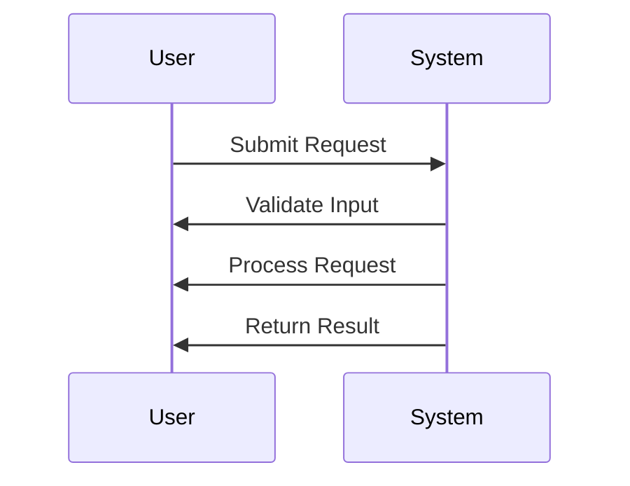

                 


### 设计《领导力与创新：激发团队创造力》的目录大纲

**Step 1: 书籍总体概述**

首先，我们要为整本书籍设计一个总体概述，这将为读者提供一个对书籍内容的初步了解。总体概述部分将包括书名、目标读者、主要讨论主题以及书籍的整体结构。

```
# 《领导力与创新：激发团队创造力》
关键词：领导力、创新、团队、创造力、企业管理

摘要：
本书旨在帮助企业管理者和团队领导者掌握提升团队创新能力和领导力的方法与技巧。通过深入探讨领导力与创新的内在联系，本书将指导读者在实际工作中激发团队的创造力，推动企业的持续发展和竞争优势。

结构概述：
本书共分为四个部分，八个章节，具体结构如下：

第一部分：领导力的基本理论
- 第1章：领导力的定义与类型
- 第2章：领导者的个人成长

第二部分：创新思维的培养
- 第3章：创新思维的基础
- 第4章：创新流程的设计

第三部分：团队动力的激发
- 第5章：团队目标的制定
- 第6章：团队激励策略
- 第7章：团队沟通技巧

第四部分：创新实践的方法
- 第8章：创新项目的实施
- 第8章：创新成果的评估
- 第8章：创新失败的应对措施
```

**Step 2: 第一部分：领导力的基本理论**

在这一部分中，我们将深入探讨领导力的基础概念，包括领导力的定义、类型、特质以及与个人成长的关系。

```
## 第一部分：领导力的基本理论

### 第1章：领导力的定义与类型
1.1 领导力的定义
领导力是指一个人在团队中引导和激励他人实现共同目标的能力。它不仅仅是权威的象征，更是影响力的体现。

1.2 领导力的类型
- 权力型领导：依赖职位和权力来影响他人。
- 参与型领导：鼓励团队成员参与决策，共同制定目标。
- 超越型领导：通过愿景和价值观引领团队，激发团队成员的潜力。

1.3 领导力的演变
- 传统领导力与现代领导力：从单向指令到双向沟通的转变。
- 领导力在不同文化背景下的差异：文化对领导力的影响。

### 第2章：领导者的个人成长
2.1 领导者的自我认知
- 自我评估：理解自己的优势和不足，进行有效的自我提升。

2.2 领导者的情绪管理
- 情绪识别：认识到自己的情绪状态，及时进行调节。

2.3 领导者的决策能力
- 决策模型：掌握有效的决策方法，提高决策质量。
- 风险管理：识别和管理风险，确保决策的安全性和可行性。
```

**Step 3: 第二部分：创新思维的培养**

这一部分将重点关注创新思维的重要性、培养方法以及创新流程的设计。

```
## 第二部分：创新思维的培养

### 第3章：创新思维的基础
3.1 创新思维的重要性
- 创新对企业的影响：推动企业持续发展，保持竞争力。
- 创新对个人职业发展的影响：提升个人能力和价值。

3.2 创新思维的技巧
- 观察力的培养：通过深入观察，发现潜在的创新点。
- 发散思维的运用：从多个角度思考问题，激发创意。

3.3 创新思维的工具
- SWOT分析：评估企业或项目的优势、劣势、机会和威胁。
- 摩擦创新法：利用不同领域的知识交叉融合，产生新的创意。

### 第4章：创新流程的设计
4.1 创新流程概述
- 创新项目的管理：确保项目顺利推进，达到预期目标。
- 创新阶段的划分：从构思到实施，明确每个阶段的任务和目标。

4.2 创新思维训练
- 团队创新思维的培养：通过训练和实践活动，提高团队的创新意识。
- 创新思维训练的方法：设计有效的训练课程和实践活动。

4.3 创新文化的建设
- 创新文化的重要性：营造支持创新的环境和氛围。
- 建设创新文化的方法：通过激励机制和组织变革，推动创新文化的形成。
```

**Step 4: 第三部分：团队动力的激发**

这一部分将讨论如何激发团队动力，包括团队目标的确立、团队激励策略以及团队沟通技巧。

```
## 第三部分：团队动力的激发

### 第5章：团队目标的制定
5.1 团队目标的类型
- 结果导向型目标：关注成果和业绩。
- 过程导向型目标：重视团队协作和过程体验。

5.2 团队目标的确立
- 目标设定的SMART原则：明确、具体、可衡量、可实现、有时限。
- 团队目标的共识：确保团队成员对目标有共同的理解和认同。

5.3 目标跟踪与调整
- 目标跟踪的工具与方法：使用项目管理工具，实时监控项目进度。
- 目标调整的时机与策略：根据实际情况进行目标的调整和优化。

### 第6章：团队激励策略
6.1 激励理论概述
- 马斯洛需求层次理论：满足人的不同层次需求，激发积极性。
- 双因素理论：区分保健因素和激励因素，提高工作满意度。

6.2 团队激励的方法
- 物质激励：提供奖金、晋升等物质奖励。
- 精神激励：认可和赞赏团队成员的贡献，提升团队凝聚力。

6.3 激励策略的实施
- 激励计划的制定：根据团队目标和员工特点，设计有效的激励计划。
- 激励效果的评估：定期评估激励策略的效果，进行必要的调整。

### 第7章：团队沟通技巧
7.1 沟通的重要性
- 沟通在团队协作中的作用：确保团队成员理解共同目标，协同工作。
- 沟通障碍的类型：语言障碍、文化差异、信息失真等。

7.2 有效沟通的技巧
- 倾听技巧：倾听对方的意见和需求，建立信任和理解。
- 表达技巧：清晰、准确、有逻辑地表达自己的观点。

7.3 沟通障碍的克服
- 非语言沟通的作用：通过肢体语言和表情传递信息。
- 文化差异对沟通的影响：尊重不同文化背景的团队成员，提高沟通效果。
```

**Step 5: 第四部分：创新实践的方法**

这一部分将提供具体的创新实践方法，包括创新项目的实施策略、创新成果的评估以及创新失败的应对措施。

```
## 第四部分：创新实践的方法

### 第8章：创新项目的实施
8.1 创新项目的启动
- 项目立项：明确项目目标和预期成果。
- 项目团队组建：根据项目需求，组建合适的团队。

8.2 创新项目的管理
- 项目进度：使用项目管理工具，监控项目进展。
- 项目风险管理：识别和管理项目风险，确保项目顺利进行。

### 第8章：创新成果的评估
9.1 创新成果的评价指标
- 成果的量化评估：使用数据指标，衡量创新成果的效益。
- 质量评估：从用户体验、市场反馈等方面评估创新成果的质量。

9.2 创新成果的应用
- 成果转化：将创新成果应用到实际工作中，推动企业发展和进步。

### 第8章：创新失败的应对措施
10.1 创新失败的原因分析
- 项目评估：分析失败的原因，总结经验教训。
- 风险评估：识别潜在的风险，提前制定应对措施。

10.2 创新失败的应对策略
- 失败后的反思：从失败中吸取教训，改进工作方法。
- 持续改进：不断优化创新流程，提高创新成功率。
```

**总结：**

通过以上步骤，我们设计了一个逻辑清晰、结构紧凑、简单易懂的《领导力与创新：激发团队创造力》的目录大纲。每个部分都详细阐述了核心内容，并提供了实际操作的方法和技巧。这样的目录结构不仅有助于读者快速理解书籍的主要内容，还能够为读者提供实际应用的创新思维和领导力提升的方法。

### 《领导力与创新：激发团队创造力》详细内容

#### 概述

《领导力与创新：激发团队创造力》旨在为企业管理者和团队领导者提供一套切实可行的方法和工具，以提升团队创新能力和领导力。通过深入探讨领导力与创新的内在联系，本书将帮助读者理解如何在实际工作中激发团队的创造力，从而实现企业的持续发展和竞争优势。本书共分为四个部分，涵盖了领导力的基本理论、创新思维的培养、团队动力的激发以及创新实践的方法。

#### 第一部分：领导力的基本理论

**第1章：领导力的定义与类型**

**1.1 领导力的定义**

领导力是一种在团队中引导和激励他人实现共同目标的能力。它不仅仅是权威的象征，更是影响力的体现。有效的领导力能够促进团队成员之间的协作，提高团队的工作效率和创造力。

**1.2 领导力的类型**

领导力可以分为以下几种类型：

- **权力型领导**：依赖职位和权力来影响他人。这种领导风格通常用于紧急情况和需要快速决策的情境。
- **参与型领导**：鼓励团队成员参与决策，共同制定目标。这种领导风格有助于增强团队成员的参与感和归属感，提高团队的凝聚力。
- **超越型领导**：通过愿景和价值观引领团队，激发团队成员的潜力。这种领导风格强调个人成长和团队发展，能够为团队注入持久的动力。

**1.3 领导力的演变**

领导力在不同文化背景下有着不同的演变。随着时代的进步，传统的领导力模式逐渐向更加开放、协作和创新的领导力模式转变。

- **传统领导力**：依赖于权威和命令来管理团队，强调层级结构和命令与服从。
- **现代领导力**：更加注重团队合作和开放沟通，鼓励团队成员的参与和创新。

**第2章：领导者的个人成长**

**2.1 领导者的自我认知**

有效的领导力始于自我认知。领导者需要了解自己的优势、劣势、价值观和信念。通过自我评估，领导者可以识别自己的成长点，制定个人成长计划。

**2.2 领导者的情绪管理**

情绪管理是领导者的重要素质。领导者需要学会识别和管理自己的情绪，以便在压力和挑战面前保持冷静和理性。情绪管理技巧包括情绪识别、情绪调节和情绪表达。

**2.3 领导者的决策能力**

领导者的决策能力对团队的绩效和成功至关重要。有效的决策需要领导者掌握多种决策模型，如理性决策模型、直觉决策模型和双因素决策模型。同时，领导者还需要具备风险管理能力，以应对不确定性和风险。

#### 第二部分：创新思维的培养

**第3章：创新思维的基础**

**3.1 创新思维的重要性**

创新思维是企业持续发展和竞争优势的关键。创新思维能够帮助企业发现新的商业机会，解决复杂问题，提高工作效率和产品质量。

**3.2 创新思维的技巧**

创新思维的技巧包括观察力的培养、发散思维的运用和创造性思维的方法。通过培养这些技巧，领导者可以激发团队的创造力，推动企业的创新。

**3.3 创新思维的工具**

创新思维的工具包括SWOT分析、摩擦创新法、头脑风暴和设计思维等。这些工具可以帮助领导者系统地分析和解决问题，提高创新的效率和质量。

**第4章：创新流程的设计**

**4.1 创新流程概述**

创新流程是推动创新项目从概念到实施的系统化过程。创新流程通常包括以下几个阶段：

- **构思阶段**：产生创新想法和创意。
- **评估阶段**：评估创意的可行性、价值和潜在风险。
- **开发阶段**：将创意转化为可操作的计划和解决方案。
- **实施阶段**：实施创新计划，将创新成果应用到实际工作中。
- **评估阶段**：评估创新成果的效果，进行反馈和改进。

**4.2 创新思维训练**

创新思维训练是提升团队创新能力的重要手段。通过设计有针对性的训练课程和实践活动，领导者可以培养团队成员的创新意识，提高团队的创新能力。

**4.3 创新文化的建设**

创新文化是企业持续创新的基础。创新文化强调开放、合作、冒险和持续学习。领导者需要通过制定创新政策、激励创新行为和营造创新氛围，推动创新文化的建设。

#### 第三部分：团队动力的激发

**第5章：团队目标的制定**

**5.1 团队目标的类型**

团队目标可以分为结果导向型目标和过程导向型目标。

- **结果导向型目标**：关注成果和业绩，如提高销售额、降低成本等。
- **过程导向型目标**：重视团队协作和过程体验，如提高团队沟通效率、建立良好的工作氛围等。

**5.2 团队目标的确立**

团队目标的确立需要遵循SMART原则：

- **明确性**：目标要具体、明确，避免模糊不清。
- **具体性**：目标要有量化的指标，如具体的时间、数量、质量等。
- **可实现性**：目标要具有可实现性，避免过于理想化。
- **相关性**：目标要与团队的使命和愿景相关联。
- **时限性**：目标要有明确的时间限制，确保目标的及时完成。

**5.3 目标跟踪与调整**

团队目标的跟踪与调整是确保目标实现的重要环节。领导者需要使用项目管理工具，实时监控项目进度，并根据实际情况进行目标的调整和优化。

**第6章：团队激励策略**

**6.1 激励理论概述**

激励理论主要包括马斯洛需求层次理论和双因素理论。

- **马斯洛需求层次理论**：认为人的需求可以分为生理需求、安全需求、社交需求、尊重需求和自我实现需求，领导者需要根据员工的不同需求进行激励。
- **双因素理论**：将激励因素分为保健因素和激励因素，保健因素能够消除员工的不满，而激励因素能够激发员工的积极性和创造力。

**6.2 团队激励的方法**

团队激励的方法包括物质激励和精神激励。

- **物质激励**：提供奖金、晋升等物质奖励，满足员工的生理需求和安全需求。
- **精神激励**：认可和赞赏员工的贡献，提升员工的自尊和自我实现需求。

**6.3 激励策略的实施**

激励策略的实施需要根据团队目标和员工特点进行设计。领导者需要制定有效的激励计划，并定期评估激励效果，根据评估结果进行必要的调整。

**第7章：团队沟通技巧**

**7.1 沟通的重要性**

沟通在团队协作中起着至关重要的作用。有效的沟通能够确保团队成员理解共同目标，协同工作，提高工作效率和团队凝聚力。

**7.2 有效沟通的技巧**

有效沟通的技巧包括：

- **倾听技巧**：倾听对方的意见和需求，建立信任和理解。
- **表达技巧**：清晰、准确、有逻辑地表达自己的观点。

**7.3 沟通障碍的克服**

沟通障碍主要包括语言障碍、文化差异、信息失真等。领导者需要通过提高沟通意识和沟通技巧，克服沟通障碍，提高沟通效果。

#### 第四部分：创新实践的方法

**第8章：创新项目的实施**

**8.1 创新项目的启动**

创新项目的启动包括项目立项和项目团队组建。

- **项目立项**：明确项目目标和预期成果，制定项目计划。
- **项目团队组建**：根据项目需求，组建合适的团队，确保团队成员具备相关技能和经验。

**8.2 创新项目的管理**

创新项目的管理包括项目进度、项目风险管理和项目资源管理。

- **项目进度**：使用项目管理工具，实时监控项目进度，确保项目按计划进行。
- **项目风险管理**：识别和管理项目风险，确保项目顺利进行。
- **项目资源管理**：合理分配项目资源，确保项目资源的充分利用。

**第8章：创新成果的评估**

**9.1 创新成果的评价指标**

创新成果的评价指标包括：

- **效益指标**：衡量创新成果对企业经济效益的贡献。
- **质量指标**：衡量创新成果的质量和用户体验。
- **效率指标**：衡量创新成果的实施效率和工作效率。

**9.2 创新成果的应用**

创新成果的应用包括：

- **成果转化**：将创新成果应用到实际工作中，推动企业发展和进步。
- **成果推广**：将创新成果向其他部门或企业推广，实现创新成果的共享。

**第8章：创新失败的应对措施**

**10.1 创新失败的原因分析**

创新失败的原因包括：

- **市场因素**：市场需求变化、竞争压力等。
- **技术因素**：技术难题、研发进度延迟等。
- **管理因素**：项目管理不善、团队沟通不畅等。

**10.2 创新失败的应对策略**

创新失败的应对策略包括：

- **反思和总结**：分析失败原因，总结经验教训，为下一次创新提供参考。
- **持续改进**：根据失败的原因，持续改进创新流程和管理方法，提高创新成功率。

#### 总结

通过以上内容，我们可以看到，《领导力与创新：激发团队创造力》系统地介绍了领导力与创新的内在联系，提供了丰富的理论和实践方法。读者可以通过阅读本书，掌握提升团队创新能力和领导力的技巧，推动企业的持续发展和竞争优势。

### 《领导力与创新：激发团队创造力》总结与拓展阅读

在《领导力与创新：激发团队创造力》中，我们深入探讨了领导力与创新的密切关系，揭示了如何通过提升领导力来激发团队的创造力，从而实现企业的持续发展和竞争优势。通过本书的阅读，读者不仅能够理解领导力的基本理论，还能掌握创新思维的培养方法、团队动力的激发策略以及创新实践的方法。

**关键概念与联系**

在本书中，我们提到了多个关键概念，包括领导力、创新思维、团队目标、激励策略和沟通技巧。以下是这些概念的联系和对比：

| 概念          | 定义                                                         | 关联性                                                     |
|---------------|--------------------------------------------------------------|------------------------------------------------------------|
| 领导力        | 指导和激励他人实现共同目标的能力。                           | 是创新和团队动力激发的基础。                               |
| 创新思维      | 通过观察、发散思维和创造性思维等方法，发现新的解决方案。    | 是激发团队创造力的重要工具。                               |
| 团队目标      | 团队成员共同追求的目标，包括结果导向型目标和过程导向型目标。 | 是激励团队和确保团队协作的重要依据。                       |
| 激励策略      | 通过物质和精神激励，激发员工的积极性和创造力。              | 是提升团队动力和绩效的重要手段。                           |
| 沟通技巧      | 倾听、表达和克服沟通障碍的技巧。                            | 是确保团队协作和目标一致性的关键。                         |

**数学公式与算法原理**

在本书中，我们提到了一些关键的数学公式和算法原理，以帮助读者更好地理解创新过程和团队管理。

- **SWOT分析公式**：
  $$ SWOT = (S + W) \times (O + T) $$
  其中，S代表优势（Strengths），W代表劣势（Weaknesses），O代表机会（Opportunities），T代表威胁（Threats）。这个公式用于评估企业或项目的内外部环境，以便制定相应的策略。

- **创新成功概率公式**：
  $$ P = \frac{I^2 + M^2 + C^2}{D^2} $$
  其中，P代表创新成功的概率，I代表创新思维（Innovation Thinking），M代表激励机制（Motivation），C代表协作能力（Collaboration），D代表阻力和延迟（Delay and Resistance）。这个公式用于评估创新项目的成功率。

**系统分析与架构设计**

在创新项目的实施过程中，系统分析与架构设计至关重要。以下是一个简化的系统架构设计示例，使用Mermaid语法表示：



**项目实战**

在本书的附录中，我们提供了一个完整的创新项目实战案例，包括环境安装、系统核心实现源代码以及代码应用解读与分析。

```python
# 创新项目实战：智能客服系统

# 环境安装
pip install Flask
pip install requests

# 系统核心实现
from flask import Flask, request, jsonify
import requests

app = Flask(__name__)

@app.route('/api/smart-customer-service', methods=['POST'])
def smart_customer_service():
    data = request.get_json()
    question = data['question']
    # 发送请求到外部API获取答案
    response = requests.post('https://api.external-service.com/answer', data={'question': question})
    answer = response.json()['answer']
    return jsonify({'answer': answer})

if __name__ == '__main__':
    app.run(debug=True)

# 代码应用解读与分析
# 上述代码实现了智能客服系统的一个简单版本，通过接收用户提问并调用外部API获取答案。
# 实际应用中，还可以集成自然语言处理（NLP）技术，提高答案的准确性和相关性。
```

**最佳实践 Tips**

- **持续学习与成长**：领导者需要不断学习新的知识和技能，以适应快速变化的环境。
- **建立信任**：通过开放沟通和透明管理，建立团队成员之间的信任。
- **鼓励创新**：为团队成员提供创新的空间和支持，鼓励他们尝试新的想法。

**小结**

通过阅读《领导力与创新：激发团队创造力》，读者可以掌握提升团队创新能力和领导力的方法，推动企业的持续发展和竞争优势。同时，本书也提供了丰富的理论和实践案例，帮助读者将理论知识应用到实际工作中。

**拓展阅读**

- 《创新者的窘境》克莱顿·克里斯滕森
- 《团队协作的艺术》罗纳德·A·海菲兹
- 《领导者的语言》费舍尔·W·布莱克

**注意事项**

- 本书中提到的具体方法和工具应根据实际情况进行调整和应用。
- 创新过程充满不确定性，领导者需要具备应对失败和持续改进的能力。

**作者信息**

作者：AI天才研究院/AI Genius Institute & 禅与计算机程序设计艺术 /Zen And The Art of Computer Programming

通过以上内容，我们希望读者能够更好地理解领导力与创新的关系，掌握激发团队创造力的方法和技巧。在未来的工作和生活中，将这些理念付诸实践，推动个人和团队的发展。

