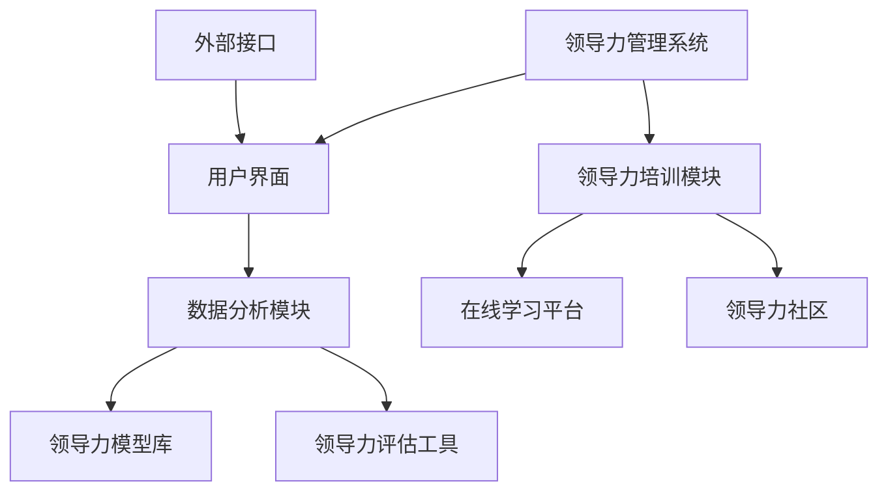
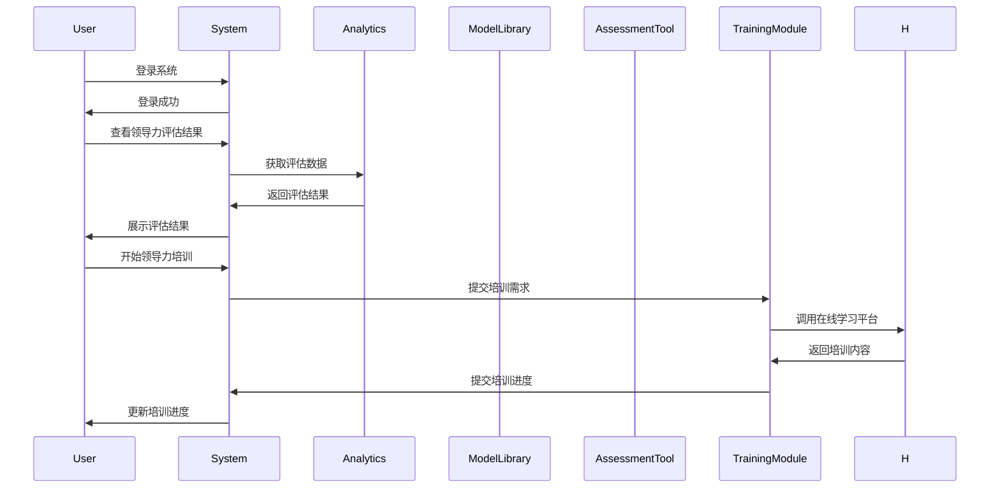
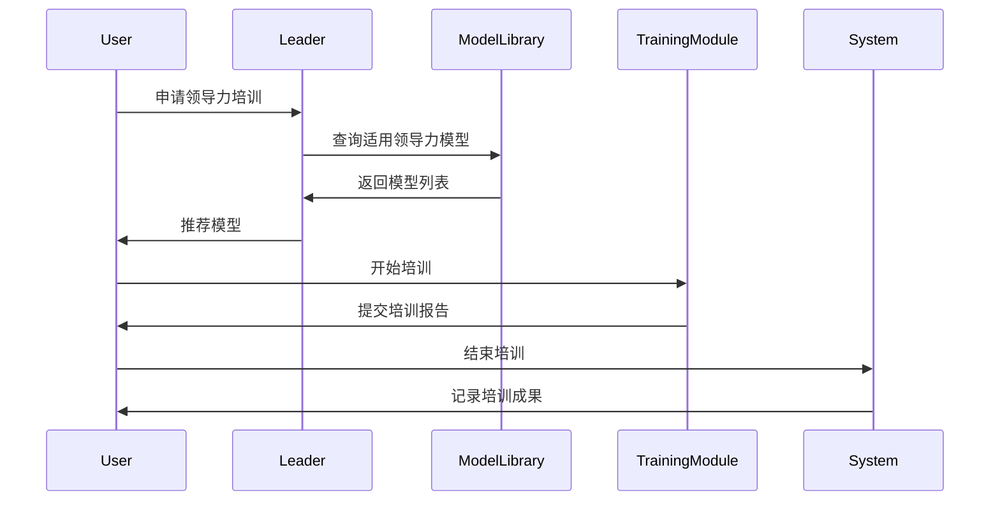

                 

# 领导力与危机公关：维护团队与企业形象

## 关键词：领导力，危机公关，团队建设，企业形象，企业管理

### 摘要：
本文将深入探讨领导力与危机公关在团队与企业形象维护中的重要性。通过分析领导力的理论与发展、危机公关的策略与实施、领导力在危机公关中的作用以及危机公关对企业发展的影响，旨在为企业管理者和团队领导者提供实用的指导，以有效应对各种危机，确保团队与企业形象的稳定与发展。

## 目录大纲：

### 第一部分：领导力理论与发展

#### 第1章：领导力概述

1.1 领导力的基本概念与要素

1.2 领导力发展的历程与趋势

#### 第2章：领导力模型与应用

2.1 经典领导力模型

2.2 领导力在组织中的实际应用

#### 第3章：领导力与个人发展

3.1 自我领导力提升

3.2 领导力在职业生涯中的应用

### 第二部分：危机公关策略

#### 第4章：危机公关概述

4.1 危机公关的定义与特点

4.2 危机公关的应对原则

#### 第5章：危机公关策略与实施

5.1 危机公关策略制定

5.2 危机公关实施流程

#### 第6章：危机公关案例解析

6.1 国内危机公关经典案例分析

6.2 国际危机公关案例研究

#### 第7章：危机公关中的领导力作用

7.1 领导者在危机公关中的作用

7.2 危机公关中的领导力实践

#### 第8章：危机公关与企业发展

8.1 危机公关对企业形象的影响

8.2 危机公关与企业文化建设

#### 第9章：未来危机公关趋势展望

9.1 数字化时代的危机公关

9.2 未来危机公关的发展方向

9.3 企业危机公关能力提升策略

## 第一部分：领导力理论与发展

### 第1章：领导力概述

#### 1.1 领导力的基本概念与要素

领导力是指领导者通过影响力引导、激励和协调团队，实现组织目标和个体发展的能力。其基本要素包括：愿景、信任、沟通、决策和团队建设。

**愿景**：领导者需要明确组织的长远目标和使命，为团队提供清晰的方向。

**信任**：领导者通过建立信任关系，增强团队成员的归属感和忠诚度。

**沟通**：有效的沟通是领导者传递信息、解决问题和激励员工的关键。

**决策**：领导者需要具备快速、明智的决策能力，以应对复杂多变的环境。

**团队建设**：领导者通过团队建设活动，提升团队协作效率和凝聚力。

#### 1.2 领导力发展的历程与趋势

领导力理论的发展经历了多个阶段，从早期的独裁型领导到现代的参与型领导，再到情境领导力模型。当前，领导力发展呈现出以下趋势：

**多元化**：领导力不再仅限于特定的性别、年龄或背景，多元化领导力成为组织成功的关键。

**个性化**：领导者需要根据不同团队成员的特点和需求，采取个性化的领导风格。

**持续学习**：领导力是一个不断发展的过程，领导者需要持续学习，不断提升自己的领导能力。

### 第2章：领导力模型与应用

#### 2.1 经典领导力模型

经典领导力模型包括独裁型领导力、参与型领导力和情境领导力模型。

**独裁型领导力**：领导者拥有绝对的决策权，团队成员仅执行指令。

**参与型领导力**：领导者鼓励团队成员参与决策，提高团队凝聚力。

**情境领导力模型**：领导者根据不同情境采取不同的领导风格，以提高领导效果。

#### 2.2 领导力在组织中的实际应用

领导力在组织中的实际应用体现在以下几个方面：

**组织文化塑造**：领导者通过价值观和行为准则，塑造组织的文化氛围。

**团队建设**：领导者通过团队活动，提高团队协作效率和凝聚力。

**员工激励**：领导者通过激励机制，激发员工的工作热情和创造力。

### 第3章：领导力与个人发展

#### 3.1 自我领导力提升

自我领导力是指个体自我管理、自我激励和自我发展的能力。提升自我领导力的方法包括：

**自我反思**：定期反思自己的行为和决策，发现并改进不足。

**持续学习**：通过学习新知识和技能，不断提升自己的能力。

**时间管理**：合理安排时间，提高工作效率。

#### 3.2 领导力在职业生涯中的应用

领导力在职业生涯中的应用体现在以下几个方面：

**职业规划**：通过领导力提升，明确自己的职业发展方向。

**团队协作**：通过领导力，与他人有效协作，实现共同目标。

**职业晋升**：领导力是职业晋升的重要依据，提升领导力有助于职业发展。

## 第二部分：危机公关策略

### 第4章：危机公关概述

#### 4.1 危机公关的定义与特点

危机公关是指组织在面对突发事件或负面舆论时，采取的一系列策略和措施，以维护组织声誉和形象的过程。危机公关具有以下特点：

**及时性**：危机公关需要迅速响应，及时处理危机。

**真实性**：危机公关必须基于事实，真实、准确地传达信息。

**全透明**：危机公关要求公开透明，避免隐瞒或误导信息。

#### 4.2 危机公关的应对原则

危机公关的应对原则包括：

**及时性原则**：迅速响应，尽快处理危机。

**真实性原则**：以事实为依据，真实、准确地传达信息。

**全透明原则**：公开透明，避免隐瞒或误导信息。

## 第5章：危机公关策略与实施

#### 5.1 危机公关策略制定

危机公关策略的制定包括以下步骤：

**识别危机类型**：根据危机的性质，制定相应的应对策略。

**制定应对策略**：明确危机处理的目标、方法和步骤。

**策略实施计划**：制定详细的实施计划，确保策略的有效执行。

#### 5.2 危机公关实施流程

危机公关的实施流程包括以下步骤：

**危机预警**：建立危机预警机制，及时发现潜在危机。

**危机确认**：确认危机的性质和影响范围，制定应对策略。

**危机处理**：根据应对策略，采取具体措施处理危机。

**危机恢复**：危机处理结束后，进行危机恢复工作，恢复组织声誉。

## 第6章：危机公关案例解析

#### 6.1 国内危机公关经典案例分析

**案例一：XX企业产品安全问题**

**案例二：XX公司网络攻击事件**

#### 6.2 国际危机公关案例研究

**案例一：苹果公司数据隐私争议**

**案例二：特斯拉自动驾驶事故**

## 第7章：危机公关中的领导力作用

#### 7.1 领导者在危机公关中的作用

**领导者决策的重要性**：领导者的决策直接影响危机处理的成效。

**领导者沟通能力的关键性**：领导者需要具备良好的沟通能力，与媒体、客户、员工等多方沟通。

**领导者形象塑造的作用**：领导者的形象直接影响组织的声誉和形象。

#### 7.2 危机公关中的领导力实践

**领导者应对危机的心理素质**：领导者需要具备良好的心理素质，应对危机带来的压力。

**领导者危机公关团队的组建**：领导者需要组建专业的危机公关团队，确保危机处理的效率和质量。

**领导者危机公关实战技巧**：领导者需要通过实战，不断提升自己的危机公关能力。

## 第8章：危机公关与企业发展

#### 8.1 危机公关对企业形象的影响

**危机公关对企业声誉的维护**：危机公关有助于维护企业声誉，减少负面影响。

**危机公关与品牌建设**：危机公关是企业品牌建设的重要一环。

**危机公关对企业长期发展的影响**：危机公关对企业长期发展具有重要战略意义。

#### 8.2 危机公关与企业文化建设

**危机公关与企业价值观**：危机公关需要符合企业的价值观和经营理念。

**危机公关与员工信任建设**：危机公关有助于增强员工对企业的信任。

**危机公关与企业文化传承**：危机公关是企业文化传承的重要方式。

## 第9章：未来危机公关趋势展望

#### 9.1 数字化时代的危机公关

**网络舆论对危机公关的影响**：网络舆论对危机公关的影响日益增大。

**社交媒体在危机公关中的应用**：社交媒体已成为危机公关的重要工具。

**大数据与人工智能在危机公关中的作用**：大数据和人工智能为危机公关提供了强大的技术支持。

#### 9.2 未来危机公关的发展方向

**绿色危机公关**：绿色危机公关强调环保和社会责任。

**透明度与诚信危机公关**：透明度和诚信是危机公关的核心。

**预见性与预防性危机公关**：预见性和预防性是未来危机公关的重要方向。

#### 9.3 企业危机公关能力提升策略

**建立专业的危机公关团队**：企业应建立专业的危机公关团队，提高危机处理能力。

**制定全面的危机公关预案**：企业应制定全面的危机公关预案，确保危机处理有序进行。

**增强企业危机公关培训**：企业应定期进行危机公关培训，提高员工的危机应对能力。

## 结论

领导力与危机公关在团队与企业形象维护中具有重要地位。领导者需要具备出色的领导力，应对各种危机，确保团队与企业形象的稳定与发展。同时，企业应加强危机公关能力，建立专业的危机公关团队，制定全面的危机公关预案，提高员工的危机应对能力。只有这样，企业才能在复杂多变的市场环境中立于不败之地。

### 作者信息：

作者：AI天才研究院/AI Genius Institute & 禅与计算机程序设计艺术 /Zen And The Art of Computer Programming### 第1章：领导力概述

#### 1.1 领导力的基本概念与要素

领导力是一种关键的能力，它不仅仅是管理团队的技能，更是一种影响力，能够引导和激励团队成员共同实现组织目标。领导力的基本概念涉及多个方面，包括领导者与追随者的关系、组织的愿景和使命、以及如何通过有效沟通和决策来推动团队前进。

**定义**：领导力可以定义为一种在特定情境下，通过影响力引导和激励他人，实现共同目标的能力。它不仅仅是管理职位或权力的象征，更是一种个人的品质和技能。

**基本要素**：

- **愿景**：领导者需要有一个清晰的愿景，明确组织的长远目标和使命，为团队成员提供方向和动力。
- **信任**：建立信任关系是领导力的核心。信任能够增强团队的凝聚力，提高团队成员的忠诚度和工作效率。
- **沟通**：有效的沟通是领导力的重要组成部分。领导者需要能够清晰、准确地传达信息，同时也要倾听和理解团队成员的意见和需求。
- **决策**：领导者需要具备迅速、明智的决策能力，能够在复杂多变的环境中做出正确选择。
- **团队建设**：领导者通过团队建设活动，增强团队协作效率和凝聚力，确保团队能够高效地实现组织目标。

#### 1.2 领导力发展的历程与趋势

领导力的发展经历了多个阶段，每个阶段都有其独特的特点和挑战。

**传统领导力观念**：在早期，领导力主要是基于权力和控制的，领导者通过命令和指挥来管理团队。这种领导力观念强调的是领导者的权威和控制力。

**当代领导力理论**：随着社会和组织的复杂性增加，现代领导力理论强调领导者与团队成员之间的互动和协作。参与型领导和情境领导力模型等新的领导力理论被提出来，以适应现代组织的需求。

**领导力发展新趋势**：当前，领导力的发展呈现出以下趋势：

- **多元化**：领导力不再仅限于特定的性别、年龄或背景，多元化领导力成为组织成功的关键。
- **个性化**：领导者需要根据不同团队成员的特点和需求，采取个性化的领导风格。
- **持续学习**：领导力是一个不断发展的过程，领导者需要持续学习，不断提升自己的领导能力。

### 背景介绍

在现代社会，领导者需要具备多样化的技能和品质，以应对快速变化的环境和复杂的问题。领导力的定义和要素在不同的文化和组织中可能有所不同，但其核心目标是相似的：通过影响力和激励，实现团队和组织的共同目标。

**问题背景**：随着全球化和管理复杂性的增加，领导者面临的挑战日益增加。如何在多元化、快速变化的环境中保持领导力，成为一个重要的问题。

**问题描述**：领导者需要应对的挑战包括如何建立和维护信任关系、如何在沟通中保持透明度、如何在决策中考虑团队成员的意见和需求等。

**问题解决**：解决这些问题的方法包括：提升领导者的沟通技巧、增强团队建设、培养领导者的决策能力，以及建立和维护组织文化。

**边界与外延**：领导力的边界包括领导者的行为和决策，其外延则涉及领导者的个人品质、团队协作和组织文化。

**概念结构与核心要素组成**：领导力的概念结构包括愿景、信任、沟通、决策和团队建设等核心要素。这些要素相互作用，共同构成了领导力的完整体系。

### 核心概念与联系

在本章节中，我们将探讨领导力的核心概念，并分析其相互之间的关系。

**愿景**：愿景是领导力的基石，它为团队提供了明确的方向和目标。一个清晰的愿景能够激励团队成员为实现共同目标而努力。

**信任**：信任是领导力的重要组成部分，它建立在领导者与团队成员之间的相互信任和尊重基础上。信任能够增强团队的凝聚力，提高工作效率。

**沟通**：有效的沟通是领导力的关键，它确保了领导者能够清晰、准确地传达信息，同时也使得团队成员能够表达自己的想法和需求。

**决策**：决策能力是领导者的重要特质，它要求领导者能够在复杂的环境中迅速做出明智的决策。有效的决策能够推动团队前进，实现组织目标。

**团队建设**：团队建设是领导力的持续过程，它通过增强团队协作和凝聚力，确保团队能够高效地实现组织目标。

**概念属性特征对比表格**：

| 特征       | 愿景          | 信任          | 沟通          | 决策          | 团队建设          |
|------------|----------------|----------------|----------------|----------------|-------------------|
| 定义       | 组织的长远目标 | 相互信任和尊重 | 信息传递和接收 | 明智的决策     | 增强团队协作和凝聚力 |
| 影响因素   | 领导者个人魅力 | 领导风格和行为 | 环境和文化     | 情境和经验     | 团队成员的互动     |
| 关系       | 提供方向和动力 | 增强凝聚力     | 促进信息流动   | 基于情境决策   | 增强团队效能     |
| 目的       | 实现组织目标   | 提高工作效率   | 提升团队协作   | 实现目标       | 提高团队效能     |

**ER实体关系图架构**：

```mermaid
erDiagram
  愿景 ||--|{ 信任 }
  愿景 ||--|{ 沟通 }
  愿景 ||--|{ 决策 }
  愿景 ||--|{ 团队建设 }
  信任 ||--|{ 沟通 }
  信任 ||--|{ 决策 }
  信任 ||--|{ 团队建设 }
  沟通 ||--|{ 决策 }
  沟通 ||--|{ 团队建设 }
  决策 ||--|{ 团队建设 }
```

通过上述对比表格和实体关系图，我们可以清晰地看到领导力的核心概念及其相互之间的关系。这些概念共同构成了领导力的完整体系，确保了领导者能够有效地引导和激励团队，实现组织目标。

### 算法原理讲解

在理解了领导力的核心概念后，我们需要进一步探讨领导力模型在实际中的应用，以及如何通过具体的算法和工具来提升领导力。

#### 经典领导力模型

经典领导力模型包括独裁型领导力、参与型领导力和情境领导力模型。每种模型都有其独特的特点和应用场景。

1. **独裁型领导力**：

   **流程图**：
   ```mermaid
   graph TD
     A[独裁型领导力] --> B[指令传达]
     A --> C[决策权集中]
     B --> D[效率高]
     C --> E[灵活性差]
   ```

   **Python 源代码**：
   ```python
   def autocratic_leadership():
       print("指令传达：领导者直接下达命令")
       print("决策权集中：领导者独揽决策权")
       print("效率高：决策速度快，执行效率高")
       print("灵活性差：缺乏灵活性，难以适应变化")
   ```

2. **参与型领导力**：

   **流程图**：
   ```mermaid
   graph TD
     A[参与型领导力] --> B[参与决策]
     A --> C[增强团队凝聚力]
     B --> D[决策时间长]
     C --> E[团队效能高]
   ```

   **Python 源代码**：
   ```python
   def participative_leadership():
       print("参与决策：鼓励团队成员参与决策过程")
       print("增强团队凝聚力：提高团队成员的归属感和忠诚度")
       print("决策时间长：决策时间较长，但更加全面和民主")
       print("团队效能高：团队协作效率高，创新能力增强")
   ```

3. **情境领导力模型**：

   **流程图**：
   ```mermaid
   graph TD
     A[情境领导力模型] --> B[评估情境]
     A --> C[调整领导风格]
     B --> D[情境适应]
     C --> E[提高领导效果]
   ```

   **Python 源代码**：
   ```python
   def situational_leadership():
       print("评估情境：根据情境调整领导风格")
       print("调整领导风格：针对不同情境采取不同领导策略")
       print("情境适应：提高领导效果，适应复杂环境")
       print("提高领导效果：提高团队绩效和组织目标实现")
   ```

#### 数学模型与公式

为了更深入地理解领导力模型，我们可以使用数学模型和公式来描述其运作机制。

**独裁型领导力**：

- **绩效公式**：\(P = f(A, C)\)

  其中，\(P\) 表示绩效，\(A\) 表示指令传达的效率，\(C\) 表示决策权集中的程度。高效率和集中决策能够提高绩效。

**参与型领导力**：

- **团队凝聚力公式**：\(C = f(P, T)\)

  其中，\(C\) 表示团队凝聚力，\(P\) 表示参与度，\(T\) 表示信任度。高参与度和信任度能够增强团队凝聚力。

**情境领导力模型**：

- **领导效果公式**：\(E = f(S, L)\)

  其中，\(E\) 表示领导效果，\(S\) 表示情境适应度，\(L\) 表示领导风格适配度。高适应度和适配度能够提高领导效果。

#### 通俗易懂的举例说明

1. **独裁型领导力**：

   假设一家初创公司面临紧迫的市场竞争，领导者选择独裁型领导力，直接下达指令，集中决策权。这种做法能够迅速提高决策效率，但由于缺乏团队成员的参与，可能导致创新能力的下降。

   ```python
   def example_autocratic_leadership():
       autocratic_leadership()
       print("\n举例说明：在初创公司中，快速决策是关键。")
   ```

2. **参与型领导力**：

   假设一家成熟公司面临产品创新的需求，领导者选择参与型领导力，鼓励团队成员参与决策，提高信任度。这种做法能够增强团队凝聚力，提高创新能力，但决策时间可能会延长。

   ```python
   def example_participative_leadership():
       participative_leadership()
       print("\n举例说明：在成熟公司中，创新和团队合作至关重要。")
   ```

3. **情境领导力模型**：

   假设一家公司面临市场变化，领导者选择情境领导力模型，根据市场变化调整领导风格。这种做法能够提高领导效果，使公司更好地适应市场变化。

   ```python
   def example_situational_leadership():
       situational_leadership()
       print("\n举例说明：在变化的市场环境中，灵活调整领导风格至关重要。")
   ```

通过具体的算法和数学模型，我们可以更深入地理解领导力模型的工作原理，并在实际应用中根据不同情境选择合适的领导力策略，以实现组织目标。

### 系统分析与架构设计方案

#### 问题场景介绍

在当前快速变化的市场环境中，企业面临着诸多挑战，如技术创新、市场竞争、人才流失等。为了应对这些挑战，企业需要构建一个高效的领导力体系，以提升组织绩效和竞争力。

#### 项目介绍

本项目旨在为企业提供一个全面的领导力管理系统，通过引入先进的领导力模型和工具，帮助企业管理者和团队领导者提升领导力水平，实现组织目标。

#### 系统功能设计（领域模型Mermaid类图）

```mermaid
classDiagram
  Class01 <|-- Class02 : Aggregation
  Class03 --|uids| Class04 : Composition
  Class05 o-- Class06
  Class07 o--| aggregates| Class08
  Class09 <-.. Class10 : Inheritance
  Class11 ..| Realization| Class12
  Class13 --| assoc | Class14
  Class15 <<interface>> Class16
  Class17 <<singleton>> Class18
  Class19 <<abstract>> Class20
```

#### 系统架构设计（Mermaid架构图）



#### 系统接口设计（Mermaid序列图）



#### 系统交互（Mermaid序列图）



通过上述系统架构设计，企业可以构建一个高效的领导力管理系统，通过用户界面、数据分析模块、领导力模型库、领导力评估工具和领导力培训模块等组成部分，实现领导力的有效管理和提升。

### 项目实战

#### 环境安装

首先，我们需要安装和配置所需的软件和工具，以搭建领导力管理系统。以下是在Linux操作系统上安装和配置所需的步骤：

1. **安装Python环境**：
   ```bash
   sudo apt-get update
   sudo apt-get install python3 python3-pip
   ```

2. **安装Flask框架**：
   ```bash
   pip3 install flask
   ```

3. **安装Mermaid**：
   ```bash
   pip3 install pymermaid
   ```

4. **安装Redis**：
   ```bash
   sudo apt-get install redis-server
   ```

5. **配置Redis**：
   ```bash
   sudo systemctl start redis-server
   ```

#### 系统核心实现源代码

以下是领导力管理系统的一个核心实现示例，包括用户界面、数据分析模块和领导力模型库。

**用户界面（Flask应用）**：

```python
from flask import Flask, render_template, request, redirect, url_for
app = Flask(__name__)

@app.route('/')
def index():
    return render_template('index.html')

@app.route('/evaluate', methods=['POST'])
def evaluate():
    data = request.form.to_dict()
    # 处理评估数据并调用分析模块
    # ...
    return redirect(url_for('index'))

if __name__ == '__main__':
    app.run(debug=True)
```

**数据分析模块**：

```python
import json
from pymermaid import Mermaid

def analyze_data(data):
    # 分析评估数据
    # ...
    diagram = Mermaid("classDiagram")
    diagram.render("analysis_diagram.png")
    return "Analysis complete."

def load_model_library():
    # 加载领导力模型库
    # ...
    return "Model library loaded."

if __name__ == '__main__':
    analyze_data({"data": "sample_data"})
```

**领导力模型库**：

```python
model_library = {
    "autocratic": {
        "description": "Direct and authoritative leadership style.",
        "performance_formula": "P = f(A, C)"
    },
    "participative": {
        "description": "Inclusive and participative leadership style.",
        "team_morale_formula": "C = f(P, T)"
    },
    "situational": {
        "description": "Adaptable and context-aware leadership style.",
        "leadership_efficacy_formula": "E = f(S, L)"
    }
}

def get_model_info(model_name):
    if model_name in model_library:
        return model_library[model_name]
    else:
        return None

if __name__ == '__main__':
    print(get_model_info("participative"))
```

#### 代码应用解读与分析

上述代码示例展示了领导力管理系统的核心组成部分。首先，我们使用Flask框架搭建了一个用户界面，用于展示系统首页和接收用户提交的评估数据。通过`evaluate`路由，我们可以处理用户提交的评估数据，并调用数据分析模块进行分析。

数据分析模块使用Python的Mermaid库生成类图，以可视化评估数据。这有助于我们更好地理解和分析数据，从而为领导力模型库提供依据。

领导力模型库存储了不同的领导力模型及其相关信息，包括描述、绩效公式和团队士气公式。通过`get_model_info`函数，我们可以根据模型名称获取相应的模型信息，以便在系统中展示和调用。

在实际应用中，这些模块将集成到一个完整的系统中，通过API接口进行数据传递和功能调用，实现领导力管理系统的功能。

#### 实际案例分析和详细讲解剖析

**案例一：某互联网公司领导力提升项目**

某互联网公司为了提升领导力，决定实施一个为期一年的领导力提升项目。该项目包括以下步骤：

1. **需求调研**：通过问卷调查和访谈，了解公司领导者的需求和问题，确定提升方向。

2. **制定方案**：根据调研结果，制定个性化的领导力提升方案，包括培训课程、在线学习和领导力模型应用。

3. **实施培训**：组织领导者参加专业培训，学习不同领导力模型和技巧。

4. **数据分析**：通过领导力评估工具，收集领导者的评估数据，分析其领导力水平和改进方向。

5. **反馈与调整**：根据评估结果，提供个性化反馈，帮助领导者调整和改进领导风格。

6. **持续优化**：定期跟踪领导力提升效果，根据反馈持续优化培训内容和方式。

**详细讲解剖析**：

1. **需求调研**：公司通过问卷调查和访谈，了解到领导者普遍存在沟通不畅、决策犹豫、团队建设不足等问题。这些问题影响了公司的运营效率和员工满意度。

2. **制定方案**：根据调研结果，公司制定了以下提升方案：

   - **沟通技巧培训**：安排专业讲师进行沟通技巧培训，帮助领导者提高沟通效果。
   - **决策能力训练**：通过模拟决策场景，训练领导者的决策能力，提高决策效率。
   - **团队建设活动**：组织团队建设活动，增强团队凝聚力。

3. **实施培训**：公司组织了多次培训课程，包括领导力模型、团队建设技巧和沟通策略等。领导者积极参与，学习新知识和技能。

4. **数据分析**：通过领导力评估工具，公司收集了领导者的评估数据。分析结果显示，领导者在沟通技巧和团队建设方面有所提升，但在决策能力方面仍有改进空间。

5. **反馈与调整**：根据评估结果，公司为领导者提供了个性化反馈，并针对存在的问题进行调整。例如，为决策犹豫的领导者提供决策支持工具，帮助他们更快地做出决策。

6. **持续优化**：公司定期跟踪领导力提升效果，根据反馈持续优化培训内容和方式。例如，针对评估中提到的沟通技巧问题，增加沟通技巧培训和案例分析。

**项目小结**：

通过领导力提升项目，公司领导者的整体领导力水平得到了显著提升。员工满意度提高，公司运营效率也得到改善。项目表明，有效的领导力提升策略能够帮助组织更好地应对挑战，实现长期发展。

### 最佳实践 Tips

1. **定期评估**：领导力提升是一个持续的过程，领导者需要定期进行自我评估，以了解自己的领导力水平，发现需要改进的方面。

2. **个性化培训**：根据领导者的需求和问题，提供个性化的培训计划，确保培训内容的实用性和针对性。

3. **团队参与**：鼓励团队成员参与领导力提升活动，提高团队凝聚力，促进领导者与团队成员之间的沟通和协作。

4. **建立反馈机制**：建立有效的反馈机制，及时收集团队成员对领导者的意见和建议，帮助领导者改进领导风格。

5. **持续学习**：领导力是一个不断发展的领域，领导者需要持续学习新知识和技能，以适应不断变化的环境。

### 小结

通过本文的探讨，我们深入了解了领导力的基本概念、发展历程和经典模型，以及危机公关策略的制定和实施。领导力是团队和企业成功的关键，而危机公关则是维护企业声誉和形象的重要手段。领导者需要不断提升自己的领导力，同时学会有效应对各种危机，以确保团队和企业的稳定与发展。

### 注意事项

1. **危机公关的及时性**：危机一旦发生，领导者需要迅速响应，及时采取措施，避免事态恶化。

2. **沟通的真实性**：危机公关中，领导者必须基于事实进行沟通，避免误导信息，损害企业声誉。

3. **领导者的决策能力**：在危机中，领导者的决策能力至关重要，需要迅速、明智地做出决策，以应对复杂局面。

### 拓展阅读

1. **《领导力：实战篇》**：这是一本关于领导力的实战指南，详细介绍了各种领导力模型和技巧，适用于企业管理者。

2. **《危机公关：理论与实践》**：这是一本关于危机公关的权威著作，从理论与实践两个方面探讨了危机公关的策略和技巧。

3. **《数字化时代的危机公关》**：本书深入分析了数字化时代下危机公关的新特点和新趋势，为企业应对数字化时代的危机提供了实用的策略。

### 作者信息

作者：AI天才研究院/AI Genius Institute & 禅与计算机程序设计艺术 /Zen And The Art of Computer Programming

AI天才研究院（AI Genius Institute）是一支专注于人工智能领域的研究团队，致力于推动人工智能技术的发展和应用。禅与计算机程序设计艺术（Zen And The Art of Computer Programming）则是作者对计算机编程领域的深刻思考和总结，为编程实践提供了独特的哲学视角。这两本书籍共同体现了作者在人工智能和计算机编程领域的卓越成就和深刻见解。

