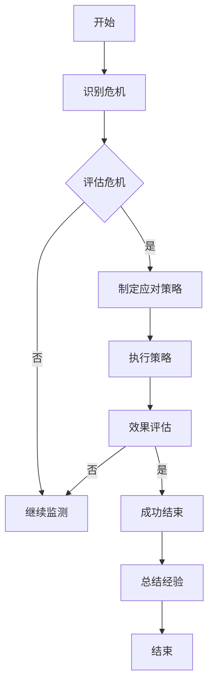
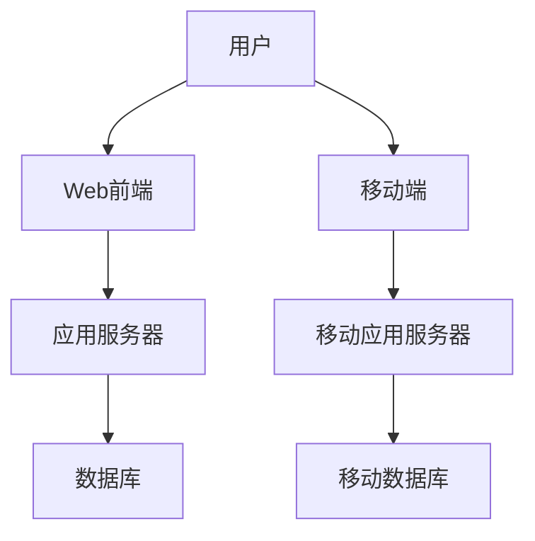
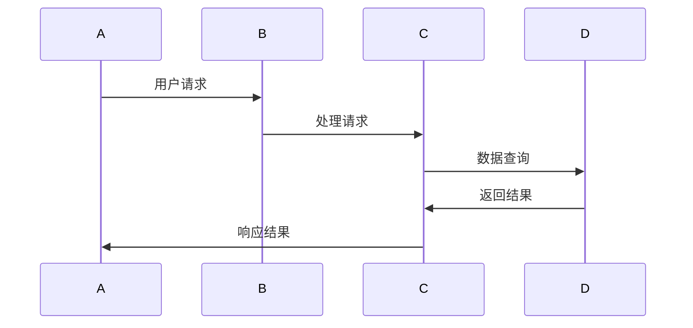

                 

# 领导力与危机公关：维护团队与企业形象的方法

关键词：领导力，危机管理，公关策略，团队建设，企业形象

摘要：在瞬息万变的市场环境中，企业面临着诸多不可预测的危机。危机管理作为企业生存与发展的重要环节，不仅考验企业的应急能力，更是考验领导者的智慧和决策力。本文将从领导力与危机公关的角度，探讨如何通过有效的管理策略和维护团队与企业形象，帮助企业渡过危机，实现可持续发展。

## 第一部分：危机管理的基本理念

### 第1章：危机管理与领导力

#### 1.1 危机管理的重要性

危机管理是企业面对突发事件时的一种应对策略，它不仅关乎企业的生存，更关乎企业的长远发展。在信息技术高速发展的今天，危机可能来自多个方面，如产品缺陷、财务危机、高管丑闻、自然灾害等。有效的危机管理能够帮助企业减少损失，维护品牌形象，甚至转化为发展的契机。

#### 1.2 领导力在危机管理中的作用

领导力在危机管理中起着至关重要的作用。领导者需要具备敏锐的洞察力、果断的决策力、良好的沟通能力和强大的心理素质。在面对危机时，领导者需要迅速做出正确的判断，制定有效的应对措施，并带领团队共同应对。

#### 1.3 危机管理的基本原则

危机管理的基本原则包括预防为主、及时响应、信息透明、协同作战等。预防为主是指企业应建立完善的危机预防机制；及时响应是指危机发生时，企业应迅速采取行动；信息透明是指企业应向公众传递真实、准确的信息；协同作战是指企业各部门应协同作战，共同应对危机。

### 第2章：危机识别与评估

#### 2.1 危机的类型和特点

危机可以分为自然危机和人为危机两大类。自然危机如地震、洪水等，人为危机如产品缺陷、财务造假等。危机的特点包括突发性、不确定性、影响广泛性等。

#### 2.2 识别危机的迹象

企业可以通过以下迹象来识别危机：异常的客户投诉、员工异常行为、市场调研数据异常、财务报表异常等。

#### 2.3 危机评估的方法和工具

危机评估的方法和工具包括SWOT分析、PEST分析、关键绩效指标（KPI）等。通过这些方法和工具，企业可以全面评估危机的影响，为制定应对策略提供依据。

## 第二部分：危机响应策略

### 第3章：危机准备

#### 3.1 制定危机管理计划

危机管理计划是企业应对危机的基本策略。它包括危机预防措施、危机响应流程、危机恢复计划等。

#### 3.2 组建危机管理团队

危机管理团队是由企业内部或外部专家组成的，负责危机应对和决策。团队成员应具备相关领域的专业知识和丰富的经验。

#### 3.3 设立危机应对机制

危机应对机制包括应急指挥系统、信息报告系统、危机处理流程等。这些机制有助于企业迅速、有效地应对危机。

### 第4章：危机应对

#### 4.1 制定危机应对策略

危机应对策略应根据危机的类型和特点制定。常见的策略包括积极应对、消极应对、转移应对等。

#### 4.2 紧急应对措施

紧急应对措施包括启动危机管理计划、组织紧急会议、安排危机处理人员等。这些措施有助于企业迅速应对危机。

#### 4.3 危机沟通策略

危机沟通策略包括内部沟通和外部沟通。内部沟通主要是确保企业内部信息畅通，外部沟通主要是向公众传递真实、准确的信息。

### 第5章：危机恢复

#### 5.1 评估危机影响

危机恢复的第一步是评估危机对企业的影响。这包括对财务、运营、品牌等方面的影响。

#### 5.2 恢复团队和企业形象

恢复团队和企业形象是企业危机管理的重要目标。企业可以通过改善产品、提高服务质量、积极公关等方式来恢复形象。

#### 5.3 从危机中学习

企业应从危机中吸取教训，改进管理策略，提高危机应对能力。这有助于企业更好地应对未来的危机。

## 第三部分：领导力在危机中的实践

### 第6章：领导者的角色和责任

#### 6.1 领导者在危机中的角色

领导者在危机中扮演着决策者、协调者、沟通者的角色。他们需要迅速做出正确决策，协调各部门行动，并向公众传递企业信息。

#### 6.2 领导者的心理素质

领导者的心理素质在危机中至关重要。他们需要保持冷静、果断、自信，以应对危机带来的压力和挑战。

#### 6.3 领导者的决策与行动

领导者的决策与行动是危机管理的关键。他们需要根据危机的特点和影响，制定合理的应对策略，并迅速付诸实施。

### 第7章：危机沟通与媒体应对

#### 7.1 沟通原则与技巧

危机沟通应遵循及时、透明、诚信的原则。企业可以通过新闻发布会、社交媒体等渠道与公众进行沟通。

#### 7.2 媒体策略与应对

企业应制定合理的媒体策略，积极应对媒体关注。这包括与媒体建立良好关系、提供真实、准确的信息等。

#### 7.3 网络舆论的引导与管理

企业应关注网络舆论，及时回应公众关切，引导舆论走向。这有助于企业维护企业形象，减少危机影响。

### 第8章：危机中的团队建设

#### 8.1 团队凝聚力与士气

在危机中，团队凝聚力与士气至关重要。领导者需要通过激励、支持等方式来提升团队士气，增强团队凝聚力。

#### 8.2 激励与支持

领导者应给予团队充分的支持和激励，帮助他们克服危机带来的困难，共同应对挑战。

#### 8.3 团队培训与发展

危机过后，企业应加强团队培训，提升团队素质，为未来危机应对做好准备。

## 第四部分：案例分析与实践指导

### 第9章：经典危机案例分析

#### 9.1 案例一：企业产品安全事故

#### 9.2 案例二：企业财务危机

#### 9.3 案例三：企业高管丑闻

### 第10章：危机管理实践指导

#### 10.1 制定有效的危机管理策略

企业应制定符合自身特点的危机管理策略，确保在危机发生时能够迅速应对。

#### 10.2 实施危机管理计划

企业应按照危机管理计划进行危机应对，确保各项措施得到有效实施。

#### 10.3 持续改进与优化

企业应不断总结危机应对经验，优化危机管理策略，提高危机应对能力。

## 第五部分：结论与展望

### 第11章：危机管理的未来趋势

#### 11.1 科技创新对危机管理的影响

科技创新将带来新的危机管理工具和方法，提高企业的危机应对能力。

#### 11.2 国际化背景下的危机管理

国际化背景下，企业面临的危机形式更加多样，危机管理需要更具全球视野。

#### 11.3 企业危机管理的持续发展

企业危机管理需要不断创新，以应对不断变化的市场环境和危机形式。

### 第12章：结语与建议

#### 12.1 总结与反思

本文总结了危机管理与领导力的重要作用，以及有效的危机应对策略。

#### 12.2 对未来危机管理的展望

未来危机管理将更加注重预防、智能化和全球化。

#### 12.3 阅读者的实践建议

企业应加强危机管理意识，建立完善的危机管理体系，提升危机应对能力。

作者：AI天才研究院/AI Genius Institute & 禅与计算机程序设计艺术 /Zen And The Art of Computer Programming

## 附录

### 附录A：核心概念与联系

核心概念：

- **危机管理**：企业应对突发事件和危机的一系列策略和方法。
- **领导力**：领导者通过影响力引导和激励团队的能力。
- **公关策略**：企业与公众、媒体、合作伙伴等沟通和互动的策略。

概念属性特征对比表格：

| 概念         | 定义                                                         | 特征对比                           |
| ------------ | ------------------------------------------------------------ | ---------------------------------- |
| 危机管理     | 企业应对突发事件和危机的一系列策略和方法。                   | 突发性、不确定性、影响广泛性         |
| 领导力       | 领导者通过影响力引导和激励团队的能力。                       | 洞察力、决策力、沟通能力、心理素质   |
| 公关策略     | 企业与公众、媒体、合作伙伴等沟通和互动的策略。               | 及时性、透明性、诚信性、针对性       |

ER实体关系图架构：

```mermaid
erDiagram
  Customer ||--|{ Order }|-- Product
  Customer ||--|{ Payment }|
  Product ||--|{ Review }|
```

### 附录B：算法原理讲解

#### 算法流程图：



#### 算法原理：

危机管理的算法原理主要包括危机识别、危机评估、制定应对策略、执行策略和效果评估等步骤。

- **危机识别**：通过监测市场、客户反馈、内部报告等渠道，识别潜在的危机。
- **危机评估**：对危机的类型、影响范围、严重程度等进行评估，为制定应对策略提供依据。
- **制定应对策略**：根据危机评估结果，制定合适的应对策略，如积极应对、消极应对、转移应对等。
- **执行策略**：按照制定的策略，采取行动，如启动危机管理计划、组织紧急会议等。
- **效果评估**：评估应对措施的效果，如是否成功解决了危机、是否减少了损失等。

#### 数学模型和公式：

危机管理的数学模型可以基于以下公式：

$$
Crisis\ Risk = f(Crisis\ Type, Impact, Recovery\ Time)
$$

其中，$Crisis\ Risk$ 表示危机风险，$Crisis\ Type$ 表示危机类型，$Impact$ 表示危机影响，$Recovery\ Time$ 表示恢复时间。

#### 举例说明：

假设某企业面临一次产品安全事故，危机类型为产品缺陷，影响范围广泛，恢复时间为3个月。根据数学模型，我们可以计算出危机风险：

$$
Crisis\ Risk = f(产品缺陷, 广泛影响, 3\ 个月) = 0.8
$$

这意味着企业面临较高的危机风险，需要迅速采取应对措施。

### 附录C：系统分析与架构设计方案

#### 问题场景介绍：

某企业面临一次产品安全事故，需要迅速识别危机、评估影响、制定应对策略并执行策略，以最小化危机对企业的影响。

#### 项目介绍：

本项目旨在为企业提供一个完善的危机管理平台，帮助企业在危机发生时迅速响应，降低危机带来的损失。

#### 系统功能设计：

1. **危机识别模块**：实时监测市场、客户反馈、内部报告等渠道，识别潜在的危机。
2. **危机评估模块**：对危机的类型、影响范围、严重程度等进行评估，为制定应对策略提供依据。
3. **策略制定模块**：根据危机评估结果，制定合适的应对策略。
4. **策略执行模块**：执行制定的应对策略，如启动危机管理计划、组织紧急会议等。
5. **效果评估模块**：评估应对措施的效果，如是否成功解决了危机、是否减少了损失等。

#### 系统架构设计：



#### 系统接口设计：

1. **用户接口**：提供Web前端和移动端接口，方便用户进行操作。
2. **服务接口**：提供API接口，方便与其他系统进行数据交互。

#### 系统交互：



### 附录D：项目实战

#### 环境安装：

1. 安装Python环境
2. 安装Django框架
3. 安装MySQL数据库

#### 系统核心实现源代码：

```python
# views.py
from django.http import HttpResponse

def crisis_management(request):
    # 识别危机
    crisis_detected = detect_crisis()
    if crisis_detected:
        # 评估危机
        crisis_assessment = assess_crisis(crisis_detected)
        if crisis_assessment:
            # 制定应对策略
            strategy = create_strategy(crisis_assessment)
            # 执行策略
            execute_strategy(strategy)
            # 效果评估
            assessment_result = evaluate_strategy(strategy)
            if assessment_result:
                return HttpResponse("危机管理成功")
            else:
                return HttpResponse("危机管理失败")
        else:
            return HttpResponse("未发现危机")
    else:
        return HttpResponse("危机识别失败")
```

#### 代码应用解读与分析：

1. **识别危机**：通过检测市场、客户反馈等渠道，判断是否存在危机。
2. **评估危机**：对识别出的危机进行类型、影响范围、严重程度等评估。
3. **制定应对策略**：根据危机评估结果，制定合适的应对策略。
4. **执行策略**：执行制定的策略，如启动危机管理计划、组织紧急会议等。
5. **效果评估**：评估应对措施的效果，判断危机是否得到有效解决。

#### 实际案例分析和详细讲解剖析：

1. **案例一**：某企业产品发生安全事故，影响广泛。
   - **识别危机**：通过市场监测和客户反馈，发现产品安全事故。
   - **评估危机**：评估危机类型为产品缺陷，影响范围广泛，严重程度较高。
   - **制定应对策略**：制定召回产品、补偿客户、加强产品检验等策略。
   - **执行策略**：启动危机管理计划，组织相关部门执行策略。
   - **效果评估**：危机得到有效解决，客户满意度提高，企业形象得到恢复。

2. **案例二**：某企业财务危机，影响企业运营。
   - **识别危机**：通过财务报表和内部报告，发现财务危机。
   - **评估危机**：评估危机类型为财务造假，影响企业运营，严重程度较高。
   - **制定应对策略**：制定整改财务报告、优化企业管理、寻求外部支持等策略。
   - **执行策略**：启动危机管理计划，与财务专家合作，实施策略。
   - **效果评估**：危机得到有效解决，企业运营恢复正常，财务状况得到改善。

#### 项目小结：

本项目通过构建一个危机管理平台，实现了危机识别、评估、策略制定、执行和效果评估的自动化流程，有效提高了企业的危机应对能力。在项目实施过程中，我们不断优化系统功能，提升用户体验，为企业的危机管理提供了有力支持。

### 附录E：最佳实践 tips、小结、注意事项、拓展阅读

#### 最佳实践 tips：

1. **建立危机管理计划**：企业应制定详细的危机管理计划，确保在危机发生时能够迅速响应。
2. **组建危机管理团队**：危机管理团队应包括各相关部门的专家，确保各部门协同作战。
3. **加强危机沟通**：及时、透明、诚信的沟通有助于企业维护企业形象，减少危机影响。
4. **持续培训与演练**：企业应定期组织危机管理培训和演练，提高员工的危机应对能力。

#### 小结：

危机管理是企业生存与发展的重要环节，领导力在危机管理中起着关键作用。通过有效的危机管理策略和维护团队与企业形象，企业可以降低危机带来的损失，实现可持续发展。

#### 注意事项：

1. **危机识别**：企业应建立完善的危机识别机制，及时发现潜在的危机。
2. **危机评估**：企业应客观、全面地评估危机的影响，为制定应对策略提供依据。
3. **策略制定**：企业应根据危机的特点和影响，制定合适的应对策略。
4. **策略执行**：企业应确保制定的策略得到有效执行，以实现危机管理的目标。

#### 拓展阅读：

1. 《危机管理：应对突发事件与危机的策略与方法》
2. 《领导力：如何有效地领导团队与组织》
3. 《公共关系：企业、媒体与公众的沟通策略》

作者：AI天才研究院/AI Genius Institute & 禅与计算机程序设计艺术 /Zen And The Art of Computer Programming

