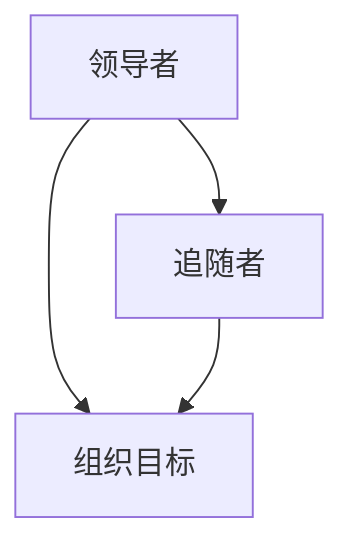
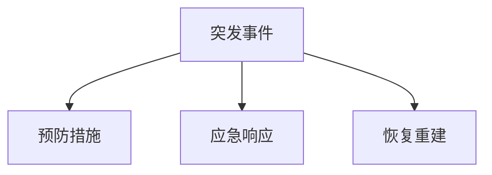

                 

### 《领导力与危机管理：在动荡中稳定军心》

#### 关键词
- 领导力
- 危机管理
- 应对策略
- 决策优化
- 组织文化

#### 摘要
本文探讨了在动荡环境中领导力与危机管理的重要性。通过分析领导力与危机管理的基本理论，结合实际案例，探讨了如何在动荡中稳定军心，提出了一系列提升领导力和危机管理能力的策略。

### 目录

1. **背景介绍与核心概念**
   1.1 **问题背景**
       1.1.1 全球经济动荡与领导力需求
       1.1.2 危机管理的重要性
       1.1.3 领导力与危机管理的关系
   1.2 **核心概念**
       1.2.1 领导力定义
       1.2.2 危机管理定义
       1.2.3 领导力与危机管理的属性特征对比
   1.3 **ER实体关系图**
       1.3.1 领导力核心要素
       1.3.2 危机管理核心要素

2. **领导力基础理论**
   2.1 **领导力理论概述**
       2.1.1 传统领导力理论
       2.1.2 当代领导力理论
       2.1.3 领导力理论的发展趋势
   2.2 **领导力核心概念**
       2.2.1 领导者与追随者的关系
       2.2.2 领导风格与行为
       2.2.3 领导力与组织文化

3. **危机管理理论**
   3.1 **危机管理概述**
       3.1.1 危机的定义与分类
       3.1.2 危机管理的原则
       3.1.3 危机管理流程
   3.2 **危机管理策略**
       3.2.1 预防策略
       3.2.2 应对策略
       3.2.3 恢复策略

4. **领导力与危机管理的实践应用**
   4.1 **实践案例分析**
       4.1.1 案例一：金融危机中的领导力应对
       4.1.2 案例二：地震灾害中的危机管理实践
   4.2 **领导力与危机管理的挑战**
       4.2.1 挑战与机遇
       4.2.2 领导者在危机中的角色转变
       4.2.3 领导力培养与危机管理能力提升

5. **领导力提升策略**
   5.1 **领导力发展路径**
       5.1.1 自我认知与领导力发展
       5.1.2 领导力训练与培养
       5.1.3 领导力评估与反馈
   5.2 **危机管理能力提升**
       5.2.1 应急反应能力的培养
       5.2.2 危机决策的优化
       5.2.3 危机恢复策略的实施

6. **系统架构与流程设计**
   6.1 **领导力与危机管理系统架构**
       6.1.1 系统功能设计
       6.1.2 系统架构设计
       6.1.3 系统接口设计
   6.2 **流程设计**
       6.2.1 领导力发展流程
       6.2.2 危机管理流程
       6.2.3 领导力与危机管理融合流程

7. **项目实战与案例分析**
   7.1 **项目背景**
       7.1.1 项目简介
       7.1.2 项目目标
       7.1.3 项目挑战
   7.2 **系统核心实现**
       7.2.1 系统环境安装
       7.2.2 系统核心实现源代码
       7.2.3 代码应用解读与分析
   7.3 **案例分析**
       7.3.1 实际案例剖析
       7.3.2 详细讲解与剖析
   7.4 **项目小结**

8. **最佳实践 tips、小结、注意事项、拓展阅读**

### 第1章：背景介绍与核心概念

#### 1.1 问题背景

在当今全球化的经济环境中，不确定性和动荡已成为常态。无论是经济危机、自然灾害，还是技术变革带来的冲击，企业和社会都面临着前所未有的挑战。在这种背景下，领导力与危机管理的重要性日益凸显。

**1.1.1 全球经济动荡与领导力需求**

全球经济动荡对企业和组织产生了深远的影响。金融市场的不稳定性、资源短缺、供应链中断等问题，都要求领导者具备出色的决策能力和危机管理能力。只有通过有效的领导力，才能在动荡中稳定军心，确保组织的持续发展。

**1.1.2 危机管理的重要性**

危机管理是指企业在面对突发事件时，采取的一系列预防、应对和恢复措施。有效的危机管理能够帮助企业降低风险、减少损失，并迅速恢复正常运营。在动荡的环境中，危机管理不仅是企业生存的关键，更是企业持续发展的保障。

**1.1.3 领导力与危机管理的关系**

领导力与危机管理密不可分。领导力是指领导者通过影响和激励他人，实现组织目标的能力。危机管理则是在危机中有效运用领导力，确保组织生存和发展的过程。领导力决定了危机管理的有效性，而危机管理则是领导力的重要体现。

#### 1.2 核心概念

**1.2.1 领导力定义**

领导力是指领导者通过影响和激励他人，实现组织目标的能力。领导力不仅包括领导者的个人素质，如沟通能力、决策能力、创新能力等，还包括领导者与追随者之间的关系，以及领导者对组织的责任感。

**1.2.2 危机管理定义**

危机管理是指企业在面对突发事件时，采取的一系列预防、应对和恢复措施。危机管理不仅包括事前的风险防范，还包括事中的应急响应和事后的恢复重建。有效的危机管理能够帮助企业降低风险、减少损失，并迅速恢复正常运营。

**1.2.3 领导力与危机管理的属性特征对比**

| 特征                | 领导力                           | 危机管理                          |
| ------------------- | -------------------------------- | --------------------------------- |
| 目标                | 实现组织目标                     | 降低风险，减少损失，恢复正常运营 |
| 时间                | 长期持续                         | 短期紧急                          |
| 环境适应性          | 适应不断变化的环境               | 适应极端环境，快速响应            |
| 依赖性              | 需要追随者的支持与配合           | 需要全员参与，共同应对            |
| 动态性              | 需要不断调整与优化               | 需要快速调整与应对               |
| 结果反馈            | 结果具有长期性和滞后性           | 结果具有即时性和明显性           |

#### 1.3 ER实体关系图

**1.3.1 领导力核心要素**



**1.3.2 危机管理核心要素**



### 第2章：领导力基础理论

#### 2.1 领导力理论概述

领导力理论是研究领导力本质和作用的理论体系。从古代到现代，领导力理论不断发展，涵盖了多种不同的观点和方法。

**2.1.1 传统领导力理论**

传统领导力理论主要关注领导者的个人特质和能力。例如，特质理论认为领导者具有独特的个性特征，如自信、决断力、智慧等。行为理论则强调领导者的行为模式，如领导风格、决策方式等。

**2.1.2 当代领导力理论**

当代领导力理论更加强调领导者的角色和责任，以及领导者与追随者之间的关系。变革型领导理论认为领导者通过激励和启发追随者，实现组织变革。服务型领导理论则强调领导者为追随者提供服务，提升团队整体效能。

**2.1.3 领导力理论的发展趋势**

随着社会和环境的变化，领导力理论也在不断演变。未来的领导力理论将更加关注领导者的全球视野、创新能力、可持续发展等。同时，领导力与危机管理的关系将成为研究的热点。

#### 2.2 领导力核心概念

**2.2.1 领导者与追随者的关系**

领导者与追随者之间的关系是领导力的核心。领导者需要建立信任和尊重，激发追随者的积极性。同时，追随者也需要对领导者有信心，愿意追随和合作。

**2.2.2 领导风格与行为**

领导风格与行为是领导力的外在表现。领导风格包括权威型、民主型、参与型等，不同的领导风格适用于不同的情境。领导行为则包括激励、沟通、决策等，这些行为直接影响领导效果。

**2.2.3 领导力与组织文化**

领导力与组织文化密切相关。领导力能够塑造和改变组织文化，组织文化也会影响领导力的实施效果。优秀的领导力能够促进组织文化的健康发展，提升组织整体绩效。

### 第3章：危机管理理论

#### 3.1 危机管理概述

危机管理是指企业在面对突发事件时，采取的一系列预防、应对和恢复措施。有效的危机管理能够帮助企业降低风险、减少损失，并迅速恢复正常运营。

**3.1.1 危机的定义与分类**

危机是指对企业造成严重威胁的突发事件。根据危机的性质，可以分为自然灾害、经济危机、公共卫生危机、技术危机等。

**3.1.2 危机管理的原则**

危机管理应遵循以下原则：

1. **预防为主**：预防危机的发生是危机管理的首要任务。通过识别风险、制定预案，降低危机发生的可能性。
2. **快速响应**：危机发生后，企业应迅速采取行动，尽可能减少损失。快速响应需要有效的沟通和协作。
3. **持续改进**：危机管理是一个持续的过程。企业应不断总结经验，优化管理流程，提高危机应对能力。

**3.1.3 危机管理流程**

危机管理通常包括以下流程：

1. **危机识别**：通过监测和分析，识别潜在危机。
2. **危机预警**：制定预警机制，及时发现危机迹象。
3. **危机应对**：制定应对策略，实施紧急响应措施。
4. **危机恢复**：在危机结束后，进行恢复重建，恢复正常运营。

#### 3.2 危机管理策略

危机管理策略包括预防策略、应对策略和恢复策略。

**3.2.1 预防策略**

预防策略旨在降低危机发生的可能性。具体措施包括：

1. **风险识别**：通过风险评估，识别潜在风险。
2. **风险评估**：对识别出的风险进行评估，确定风险等级。
3. **风险控制**：制定风险控制措施，降低风险。

**3.2.2 应对策略**

应对策略是指危机发生时，企业应采取的紧急措施。具体措施包括：

1. **紧急响应**：迅速采取行动，控制危机蔓延。
2. **资源调配**：调动企业内外部资源，支持危机应对。
3. **沟通协调**：加强与政府部门、媒体、合作伙伴等的沟通协调。

**3.2.3 恢复策略**

恢复策略旨在尽快恢复正常运营。具体措施包括：

1. **应急恢复**：在危机结束后，尽快恢复正常运营。
2. **业务重建**：优化业务流程，提高业务稳定性。
3. **经验总结**：总结危机应对经验，优化危机管理流程。

### 第4章：领导力与危机管理的实践应用

#### 4.1 实践案例分析

**4.1.1 案例一：金融危机中的领导力应对**

2008年全球金融危机爆发，许多企业面临巨大挑战。以A公司为例，该公司通过以下方式应对危机：

1. **紧急决策**：公司高层迅速召开会议，制定应对策略。
2. **资源调配**：调整资源分配，确保关键业务部门得到足够支持。
3. **沟通协调**：加强与供应商、客户、员工的沟通，稳定内部和外部环境。
4. **业务重构**：优化业务流程，提高运营效率，降低成本。

通过这些措施，A公司在危机中保持稳定，并逐步恢复。

**4.1.2 案例二：地震灾害中的危机管理实践**

2011年日本发生9级地震，地震引发的海啸造成巨大损失。以B公司为例，该公司在地震灾害中采取以下措施：

1. **应急预案**：在地震发生前，公司制定了详细的应急预案。
2. **紧急响应**：地震发生后，公司迅速启动应急预案，确保员工安全。
3. **灾后重建**：公司投入大量资源，帮助受灾地区进行灾后重建。
4. **心理援助**：为受灾员工提供心理援助，帮助他们度过困难时期。

通过这些措施，B公司在地震灾害中展现了强大的危机管理能力。

#### 4.2 领导力与危机管理的挑战

**4.2.1 挑战与机遇**

危机既是挑战，也是机遇。领导者需要认识到危机中的机遇，通过创新和变革，实现企业的持续发展。

**4.2.2 领导者在危机中的角色转变**

在危机中，领导者的角色发生变化。他们需要从战略规划者转变为危机应对者，从领导者转变为协调者，从决策者转变为执行者。

**4.2.3 领导力培养与危机管理能力提升**

领导力和危机管理能力是相辅相成的。企业应通过培训、实践等方式，不断提升领导者的危机管理能力。

### 第5章：领导力提升策略

#### 5.1 领导力发展路径

提升领导力是一个长期的过程，需要领导者不断自我认知和成长。

**5.1.1 自我认知与领导力发展**

领导者需要了解自己的优势和劣势，明确自己的领导风格和价值观。通过自我反思和评估，不断提升自己的领导能力。

**5.1.2 领导力训练与培养**

企业应提供系统的领导力培训，帮助领导者提升管理技能和团队协作能力。通过角色扮演、情景模拟等方式，提升领导者的实战经验。

**5.1.3 领导力评估与反馈**

领导力评估是领导力提升的重要环节。企业应建立科学的评估体系，对领导者的绩效和潜力进行全面评估。通过反馈，帮助领导者找到改进的方向。

#### 5.2 危机管理能力提升

提升危机管理能力是企业应对不确定性的关键。

**5.2.1 应急反应能力的培养**

应急反应能力是危机管理的重要组成部分。企业应通过实战演练和模拟，提升员工在危机中的应急反应能力。

**5.2.2 危机决策的优化**

危机决策的优化是提高危机管理效果的关键。企业应建立科学的决策模型，通过数据分析和模拟，提高危机决策的准确性和效率。

**5.2.3 危机恢复策略的实施**

危机恢复策略的实施是确保企业持续发展的重要保障。企业应制定详细的恢复计划，明确责任分工，确保恢复工作的有序进行。

### 第6章：系统架构与流程设计

#### 6.1 领导力与危机管理系统架构

领导力与危机管理系统是企业应对不确定性和危机的重要工具。系统架构设计应考虑以下几个方面：

**6.1.1 系统功能设计**

系统功能设计包括危机预警、危机应对、危机恢复等模块。每个模块应具有独立的运作能力和数据接口。

**6.1.2 系统架构设计**

系统架构设计应考虑数据存储、数据处理、通信传输等方面的需求。采用分布式架构，提高系统的稳定性和扩展性。

**6.1.3 系统接口设计**

系统接口设计包括与外部系统（如ERP系统、客户关系管理系统等）的数据接口和功能接口。确保系统能够与其他系统无缝集成。

#### 6.2 流程设计

流程设计是领导力与危机管理系统的核心。流程设计应考虑以下几个方面：

**6.2.1 领导力发展流程**

领导力发展流程包括领导力培训、领导力评估、领导力反馈等环节。通过这些环节，不断提升领导者的能力和素质。

**6.2.2 危机管理流程**

危机管理流程包括危机识别、危机预警、危机应对、危机恢复等环节。每个环节应明确责任人和操作流程，确保危机管理的有序进行。

**6.2.3 领导力与危机管理融合流程**

领导力与危机管理融合流程是将领导力与危机管理相结合，实现企业整体应对危机的能力。具体包括领导力与危机管理的协同、领导力与危机管理资源的共享等。

### 第7章：项目实战与案例分析

#### 7.1 项目背景

为了提升企业的领导力和危机管理能力，某公司决定实施一个领导力与危机管理系统项目。该项目旨在通过系统化、规范化的管理，提高企业的应变能力和持续发展能力。

**7.1.1 项目简介**

本项目分为两个阶段：第一阶段是领导力培训与评估，第二阶段是危机管理系统的实施。通过这两个阶段的实施，提升企业的领导力和危机管理能力。

**7.1.2 项目目标**

1. 提升领导者的管理能力和决策能力。
2. 建立完善的危机管理流程和制度。
3. 提高企业的应变能力和持续发展能力。

**7.1.3 项目挑战**

1. 领导者对领导力和危机管理的认知不足。
2. 危机管理流程不规范，缺乏统一的标准。
3. 系统实施过程中，需要协调各部门的工作。

#### 7.2 系统核心实现

**7.2.1 系统环境安装**

在实施项目之前，首先需要进行系统环境的安装和配置。包括硬件设备、软件系统、数据库等。具体安装过程如下：

1. **硬件设备**：采购服务器、存储设备、网络设备等硬件设备，确保系统运行的基础设施。
2. **软件系统**：安装操作系统、中间件、数据库等软件系统，确保系统正常运行。
3. **数据库**：配置数据库，建立领导力与危机管理数据库，用于存储和管理数据。

**7.2.2 系统核心实现源代码**

系统核心实现源代码包括以下几个方面：

1. **领导力评估模块**：通过问卷调查、行为分析等方式，对领导者的能力进行评估。评估结果用于领导力培训与提升。
2. **危机预警模块**：通过数据分析和监测，识别潜在危机，生成预警报告。
3. **危机应对模块**：制定危机应对策略，指导企业应对危机。包括紧急响应、资源调配、沟通协调等。
4. **危机恢复模块**：制定危机恢复计划，确保企业尽快恢复正常运营。

**7.2.3 代码应用解读与分析**

以下是领导力评估模块的代码示例：

```python
def assess_leader(leader_data):
    """
    领导者评估函数
    :param leader_data: 领导者数据，包括个人特质、沟通能力、决策能力等
    :return: 评估结果，包括评估得分、评估等级等
    """
    score = 0
    for key, value in leader_data.items():
        if value > 80:
            score += 10
        elif value > 60:
            score += 5
        else:
            score += 0

    level = "优秀" if score > 90 else "良好" if score > 60 else "一般"

    return score, level

leader_data = {
    "confidence": 85,
    "decision_making": 75,
    "communication": 90
}

score, level = assess_leader(leader_data)
print(f"评估得分：{score}, 评估等级：{level}")
```

通过这段代码，可以对领导者的能力进行评估，并根据评估结果进行针对性的培训和提升。

#### 7.3 案例分析

**7.3.1 实际案例剖析**

在某次项目中，该公司的领导力与危机管理系统成功应对了一次突发事件。具体案例如下：

**案例背景**：在一次项目验收过程中，发现项目关键模块存在严重漏洞，可能导致项目失败。

**应对措施**：

1. **紧急响应**：项目团队立即召开紧急会议，分析漏洞原因和影响范围。
2. **资源调配**：调动公司内外部资源，组织专家进行漏洞修复。
3. **沟通协调**：加强与客户、合作伙伴的沟通，确保项目进展透明。
4. **危机恢复**：修复漏洞后，对项目进行全面测试，确保项目质量。

**结果分析**：

通过以上措施，项目团队成功修复漏洞，确保了项目按时交付。同时，客户和合作伙伴对公司的应对能力表示满意。

**7.3.2 详细讲解与剖析**

**紧急响应**：

在危机发生时，迅速采取行动是关键。项目团队通过紧急会议，迅速分析漏洞原因和影响范围，为后续修复提供依据。

**资源调配**：

在危机管理中，资源调配至关重要。公司调动内外部资源，包括技术专家、设备等，确保漏洞修复工作顺利进行。

**沟通协调**：

在危机管理中，沟通协调是保障。项目团队加强与客户、合作伙伴的沟通，确保项目进展透明，减少不必要的误解和猜疑。

**危机恢复**：

在危机结束后，进行全面的恢复工作。项目团队对项目进行全面测试，确保项目质量，避免类似问题再次发生。

#### 7.4 项目小结

通过本项目，公司成功提升了领导力和危机管理能力。以下是小结：

1. **领导力提升**：通过领导力评估和培训，领导者能力得到显著提升。
2. **危机管理能力提升**：通过危机预警和应对，公司应对突发事件的能力得到增强。
3. **项目管理能力提升**：通过项目实施，项目团队的合作和沟通能力得到提升。

### 第8章：最佳实践 tips、小结、注意事项、拓展阅读

#### 最佳实践 tips

1. **领导力提升**：定期进行领导力评估和培训，提升领导者的管理能力和决策能力。
2. **危机管理**：制定详细的危机管理计划，确保在危机发生时能够迅速应对。
3. **团队协作**：加强团队协作，提高团队的整体应对能力。

#### 小结

本文通过分析领导力与危机管理的基本理论，结合实际案例，探讨了如何在动荡中稳定军心。通过提升领导力和危机管理能力，企业能够在不确定性中保持稳定，实现持续发展。

#### 注意事项

1. **领导力提升**：领导力提升是一个长期的过程，需要持续投入和努力。
2. **危机管理**：危机管理需要全员参与，建立全员参与机制，提高危机应对的效率。
3. **项目管理**：在项目实施过程中，要注重沟通和协作，确保项目顺利进行。

#### 拓展阅读

1. **《领导力心理学》**：了解领导力的心理机制，提升领导效果。
2. **《危机管理》**：深入学习危机管理的理论和实践，提高危机应对能力。
3. **《项目管理实战》**：掌握项目管理的核心知识和技能，提升项目管理能力。

### 结语

领导力与危机管理是企业持续发展的重要保障。通过本文的探讨，希望能够为企业和领导者提供有益的启示，帮助他们在动荡中稳定军心，实现企业的可持续发展。

---

**作者：AI天才研究院/AI Genius Institute & 禅与计算机程序设计艺术 /Zen And The Art of Computer Programming**

