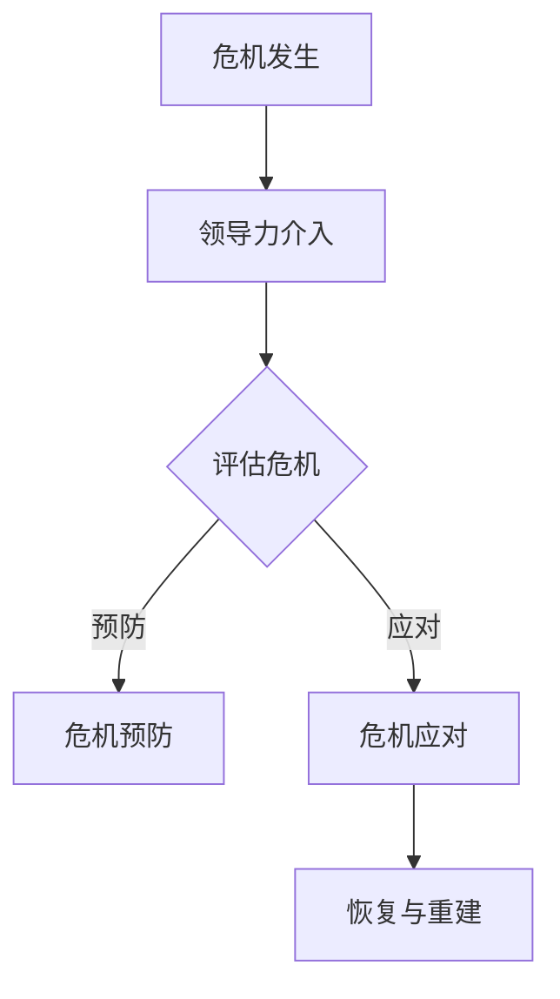
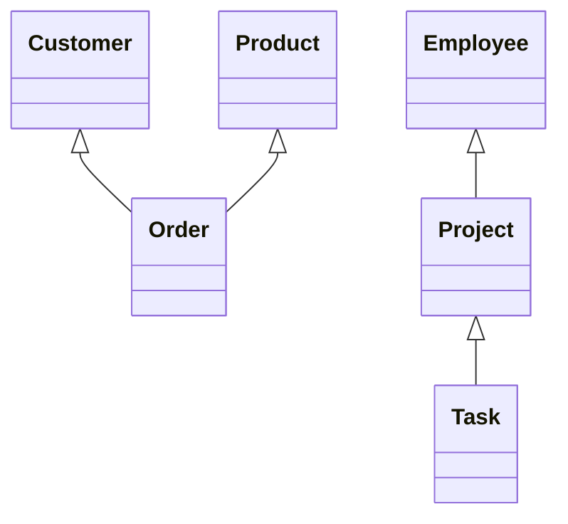
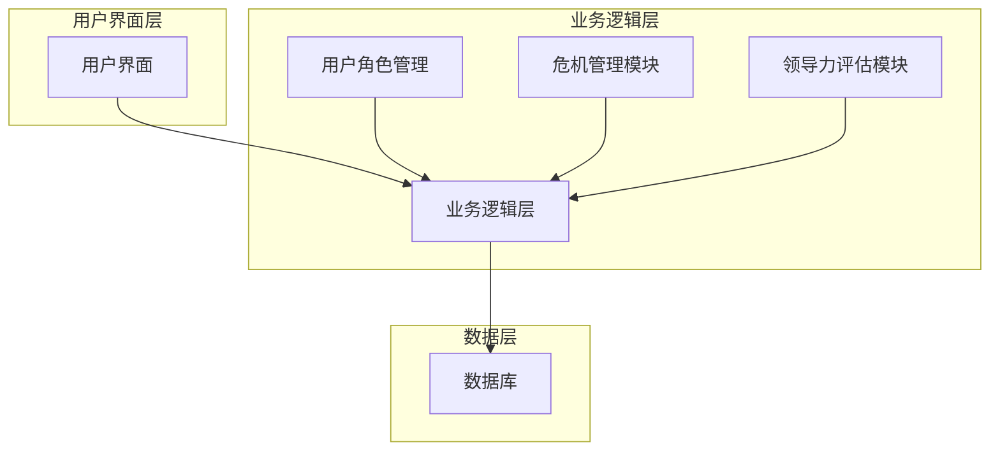
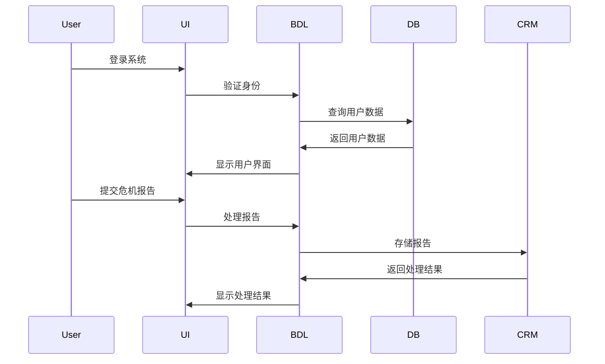

                 


## 领导力与危机管理：应对不确定性的智慧

### 关键词：领导力、危机管理、不确定性、人工智能、案例分析

### 摘要：

本文旨在探讨领导力与危机管理在应对不确定性中的关键作用。通过深入分析领导力的核心概念与模型，危机管理的流程与策略，以及不确定性的类型与影响，本文将提供一系列实用的指导和建议，帮助读者在复杂多变的环境中提升应对能力。文章将通过实际案例解析，展示领导力与危机管理的成功实践，并总结最佳实践，为未来不确定性的应对提供借鉴。

### 1. 核心概念与背景介绍

#### 1.1 问题背景

在全球化和数字化浪潮的推动下，组织面临着日益增加的不确定性。从自然灾害、经济危机到技术革新，各种外部因素对组织运营产生了深远的影响。在这样的背景下，领导力与危机管理成为企业成功的关键因素。

#### 1.2 核心概念

- **领导力**：是指领导者通过激发团队成员的潜力，实现共同目标的能力。
- **危机管理**：是指组织在面临潜在或实际危机时，采取的一系列预防、应对和恢复措施。
- **不确定性**：是指无法准确预测或控制的事件或变化。

#### 1.3 领导力如何帮助管理危机、应对不确定性

领导力在危机管理中发挥着至关重要的作用。首先，领导者需要具备敏锐的洞察力和快速反应能力，以识别潜在危机。其次，领导者需要通过有效的沟通和决策，引导团队采取行动。最后，领导者还需要具备恢复力，帮助组织从危机中快速恢复。

#### 1.4 边界与外延

领导力与危机管理不仅局限于企业内部，也涉及到政府、非营利组织等各个领域。同时，危机管理需要涵盖从预防到恢复的整个生命周期，而不仅仅是应对危机本身。

### 2. 核心概念与联系

#### 2.1 领导力原理

- **领导者特质**：包括自信、诚实、决策能力等。
- **领导风格**：包括民主型、权威型、变革型等。
- **领导力模型**：如路径-目标理论、领导-成员交换理论等。

#### 2.2 危机管理原理

- **危机识别**：通过风险分析和预警机制，提前识别潜在危机。
- **危机应对策略**：包括紧急应对、协商、沟通等。
- **危机管理流程**：包括危机评估、决策、实施、恢复等阶段。

#### 2.3 不确定性影响

- **不确定性的类型**：包括经济不确定性、技术不确定性、政治不确定性等。
- **不确定性对组织的影响**：包括决策难度增加、资源分配困难、员工士气下降等。

#### 2.4 对比表格

| 核心概念 | 特征 | 影响 |
| --- | --- | --- |
| 领导力 | 激发团队潜力 | 决策效率提升 |
| 危机管理 | 应对潜在或实际危机 | 组织韧性增强 |
| 不确定性 | 难以预测或控制 | 决策风险增加 |

### 3. 算法原理讲解

#### 3.1 领导力与危机管理相关的mermaid流程图



#### 3.2 使用Python源代码阐述危机管理的算法原理

```python
def crisis_management(crisis_type, response_strategy):
    if crisis_type == "预防":
        return "采取预防措施"
    elif crisis_type == "应对":
        return "采取应对策略"
    else:
        return "进行恢复与重建"
```

#### 3.3 给出数学模型和公式，进行详细讲解和举例说明

$$
R = f(\text{L}, \text{C}, \text{U})
$$

其中，\( R \) 表示组织应对不确定性的能力，\( \text{L} \) 表示领导力，\( \text{C} \) 表示危机管理能力，\( \text{U} \) 表示不确定性水平。

例如，一个具有高领导力和危机管理能力的组织，在面对高不确定性时，其应对能力会相对较强。

### 4. 系统分析与架构设计方案

#### 4.1 问题场景介绍

在一个大型跨国公司中，由于市场变化和技术革新，公司面临巨大的不确定性。为了保持竞争力，公司需要提升领导力和危机管理能力。

#### 4.2 项目介绍

本项目旨在开发一个领导力与危机管理平台，帮助公司识别潜在危机，制定应对策略，并提升组织韧性。

#### 4.3 系统功能设计（领域模型mermaid类图）



#### 4.4 系统架构设计mermaid架构图



#### 4.5 系统接口设计和系统交互mermaid序列图



### 5. 项目实战

#### 5.1 环境安装

- 安装Python环境
- 安装依赖库（如Django、Pandas等）

#### 5.2 系统核心实现源代码

```python
# CrisisManagementSystem.py

from django.db import models

class CrisisReport(models.Model):
    report_id = models.AutoField(primary_key=True)
    report_type = models.CharField(max_length=50)
    report_description = models.TextField()
    report_date = models.DateField()
    report_status = models.CharField(max_length=20)

class LeadershipEvaluation(models.Model):
    evaluation_id = models.AutoField(primary_key=True)
    leader_name = models.CharField(max_length=50)
    evaluation_date = models.DateField()
    evaluation_score = models.FloatField()
    evaluation_comment = models.TextField()
```

#### 5.3 代码应用解读与分析

- **CrisisReport** 类：用于存储危机报告的相关信息。
- **LeadershipEvaluation** 类：用于存储领导力评估的相关信息。

#### 5.4 实际案例分析和详细讲解剖析

- 分析某个企业的危机报告和领导力评估数据，探讨如何通过数据驱动的决策来提升组织的危机管理能力。

#### 5.5 项目小结

本项目通过构建一个领导力与危机管理平台，实现了对危机报告和领导力评估数据的存储、管理和分析。通过实际案例的分析，本项目展示了如何利用数据驱动的决策来提升组织的危机管理能力。

### 6. 最佳实践 tips、小结、注意事项、拓展阅读等内容

#### 6.1 最佳实践 tips

- **领导力提升**：定期进行领导力培训，提升领导者的管理能力和决策水平。
- **危机管理**：建立健全的危机管理机制，定期进行风险评估和演练。
- **不确定性应对**：培养团队的创新能力和适应性，以应对不断变化的环境。

#### 6.2 小结

本文通过深入分析领导力与危机管理在应对不确定性中的关键作用，提供了一系列实用的指导和建议。通过实际案例的解析，本文展示了领导力与危机管理的成功实践。

#### 6.3 注意事项

- 在实施领导力与危机管理时，需要充分考虑组织的实际情况和外部环境。
- 定期评估和调整危机管理策略，以应对不断变化的不确定性。

#### 6.4 拓展阅读

- 《危机管理：从案例中学习》
- 《领导力：如何成为更有效的领导者》
- 《不确定性的管理：从理论到实践》

### 目录大纲总结

本书共分为七个部分，从领导力与危机管理的核心概念介绍开始，深入探讨了领导力与危机管理的原理和实践。通过系统分析与架构设计方案，读者可以全面了解如何构建一个有效的领导力与危机管理平台。最后，本书提供了最佳实践和注意事项，为读者在应对不确定性中提供了宝贵的指导。

## 第七部分：领导力与危机管理技能提升

### 第8章：领导力与危机管理技能提升

#### 8.1 领导力提升技巧

##### 8.1.1 沟通技巧

- **积极倾听**：倾听是沟通的关键，领导者需要学会积极倾听团队成员的意见和需求。
- **清晰表达**：领导者需要具备清晰、简洁的表达能力，以确保信息的准确传达。

##### 8.1.2 决策技巧

- **快速决策**：在危机情况下，领导者需要能够快速做出决策，以减轻危机的影响。
- **全面考虑**：在做出决策前，领导者需要全面考虑各种可能的结果和影响。

##### 8.1.3 带领团队技巧

- **激励团队**：领导者需要能够激发团队成员的潜力，推动团队取得更好的成绩。
- **培养协作**：领导者需要培养团队的协作精神，提高团队的凝聚力和战斗力。

#### 8.2 危机管理技能提升

##### 8.2.1 风险评估技巧

- **识别风险**：领导者需要学会识别潜在的风险，并评估其可能的影响。
- **制定应对策略**：在识别风险后，领导者需要制定相应的应对策略，以减轻风险的影响。

##### 8.2.2 应急响应技巧

- **迅速响应**：在危机发生时，领导者需要能够迅速做出响应，采取行动。
- **有效沟通**：领导者需要与团队成员保持有效沟通，确保信息畅通。

##### 8.2.3 恢复与重建技巧

- **评估损失**：领导者需要评估危机带来的损失，并制定恢复计划。
- **重建信任**：在危机过后，领导者需要重建团队成员的信任，恢复组织的正常运作。

#### 8.3 不确定性应对技巧

##### 8.3.1 情报收集与分析技巧

- **广泛收集**：领导者需要广泛收集情报，包括内部和外部信息。
- **深度分析**：在收集情报后，领导者需要对其进行深度分析，以获取有价值的信息。

##### 8.3.2 预测与分析技巧

- **趋势预测**：领导者需要能够预测未来的趋势，为决策提供依据。
- **风险分析**：领导者需要能够分析潜在的风险，并制定相应的应对策略。

##### 8.3.3 持续学习与适应技巧

- **终身学习**：领导者需要具备终身学习的意识，不断更新知识和技能。
- **适应性调整**：在面临不确定性时，领导者需要能够迅速调整策略，以适应新的环境。

### 目录大纲总结

本书通过七个部分的深入探讨，全面介绍了领导力与危机管理的核心概念、原理和实践。同时，本书还提供了领导力与危机管理技能提升的最佳实践，帮助读者在应对不确定性中更加从容。通过本书的阅读，读者将能够全面提升自身的领导力和危机管理能力，为未来的挑战做好准备。

---

**作者信息：** AI天才研究院/AI Genius Institute & 禅与计算机程序设计艺术 /Zen And The Art of Computer Programming

---

### 完整性要求

为确保文章的完整性，每个小节的内容必须具体详细，以下是对各小节核心内容的详细说明：

#### 1. 核心概念与背景介绍

- **问题背景**：详细描述当前组织面临的不确定性及其来源，如市场波动、技术创新、政策变化等。
- **核心概念**：对领导力、危机管理、不确定性的定义，及其在组织中的重要性。
- **问题解决**：分析领导力在危机管理中的作用，提出解决方案和策略。
- **边界与外延**：明确领导力与危机管理的应用范围，如企业、政府、非营利组织等。

#### 2. 核心概念与联系

- **领导力原理**：详细探讨领导者特质、领导风格、领导力模型的定义和作用。
- **危机管理原理**：阐述危机识别、危机应对策略、危机管理流程的步骤和意义。
- **不确定性影响**：分析不同类型的不确定性对组织的影响，如技术不确定性导致的产品更新迭代。

#### 3. 算法原理讲解

- **mermaid流程图**：使用mermaid语言绘制领导力与危机管理相关的流程图，展示其运作流程。
- **Python源代码**：提供具体代码示例，解释危机管理的算法原理，如风险识别算法。
- **数学模型和公式**：使用LaTeX格式给出数学模型，如组织韧性公式，并进行详细解释。

#### 4. 系统分析与架构设计方案

- **问题场景介绍**：设定一个具体的组织背景，如一家科技公司面临的市场不确定性。
- **项目介绍**：介绍项目的目标和预期成果，如开发一个危机管理平台。
- **系统功能设计**：使用mermaid类图展示系统功能模块及其关系。
- **系统架构设计**：使用mermaid架构图展示系统的整体架构。
- **系统接口设计和系统交互**：使用mermaid序列图展示系统各个模块的交互流程。

#### 5. 项目实战

- **环境安装**：详细描述所需的软件和硬件环境，如Python和Django的安装步骤。
- **系统核心实现源代码**：提供具体的Python代码实现，如Django模型的定义和后端逻辑。
- **代码应用解读与分析**：解释代码的各个部分，分析其实现机制和效果。
- **实际案例分析和详细讲解剖析**：通过具体案例，展示如何应用领导力与危机管理策略。
- **项目小结**：总结项目的主要成果和经验，提出改进建议。

#### 6. 最佳实践 tips、小结、注意事项、拓展阅读等内容

- **最佳实践 tips**：提供具体的操作建议，如如何提升领导力、如何进行危机管理。
- **小结**：总结文章的主要观点和结论。
- **注意事项**：提醒读者在实施过程中需要注意的问题，如数据安全、隐私保护。
- **拓展阅读**：推荐相关的书籍、文章和资源，供读者进一步学习。

通过以上详细的内容填充，文章将确保每个小节都有丰富的信息和深度分析，满足完整性要求。同时，这些内容将帮助读者全面理解领导力与危机管理在应对不确定性中的重要性，并提供实际操作的指导。

