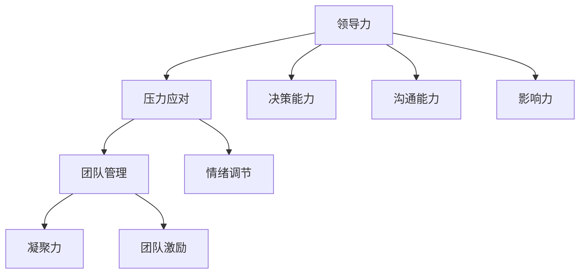

                 

# 领导力与压力应对：在高压下保持团队稳定

> 关键词：领导力、压力应对、团队稳定、高压环境、领导力理论、压力管理

> 摘要：本文深入探讨领导力与压力应对的关系，旨在为现代企业管理提供一套系统化的策略。通过背景介绍、核心概念联系、主流理论分析和实际应用策略，本文将帮助领导者掌握在高压环境下保持团队稳定的技巧。

## **第一部分：背景介绍**

在现代企业管理中，领导力与压力应对的重要性不言而喻。领导力不仅关乎个人成长，更直接影响到整个团队的绩效和企业的长远发展。而压力应对则成为领导者在高压环境下不可或缺的一项能力，它关乎个人健康和团队凝聚力。本文将逐步探讨这些问题，帮助读者理解和掌握有效的领导力与压力应对策略。

### **1.1.1 问题背景**

在现代企业的快速变革中，领导者的角色变得愈发重要。随着市场竞争的加剧和技术的快速发展，企业面临着前所未有的压力。在这种情况下，领导者的决策能力、情绪调节能力和团队管理能力变得至关重要。一个有效的领导者不仅能够激发团队成员的潜力，还能够引导团队在高压环境下保持稳定和高效。

### **1.1.2 问题描述**

本文主要探讨以下问题：

- 领导力的核心要素是什么？如何培养和提高领导力？
- 压力的来源有哪些？它对团队和个人有什么危害？
- 如何进行有效的压力管理，以减轻团队和个人的压力？
- 团队激励和凝聚力的提升策略有哪些？
- 领导者在高压环境下如何保持情绪调节，做出明智的决策？

### **1.1.3 问题解决**

通过系统的理论讲解和实践案例分析，本文将帮助读者：

- 明确领导力的关键要素，掌握提升领导力的方法。
- 理解压力的来源，学会有效的压力管理策略。
- 提高团队管理能力，增强团队凝聚力和工作效率。
- 学会在高压环境下保持情绪稳定，做出明智的决策。

### **1.1.4 边界与外延**

领导力与压力应对的研究不仅局限于企业内部管理，还涉及到社会、家庭等多个场景。本文将主要讨论在企业环境中如何应用这些策略，但所提供的方法和思路同样适用于其他场景。

### **1.1.5 概念结构与核心要素组成**

本文的核心概念包括领导力、压力、团队管理、情绪调节等。这些概念相互关联，共同构成了领导力与压力应对的理论框架。以下是这些核心概念的关系图：

## **1.2 核心概念与联系**

### **1.2.1 领导力**

领导力是指领导者通过各种手段，激发、引导和协调团队成员，实现共同目标的能力。它是企业成功的关键因素之一。领导力包括以下核心要素：

| 要素 | 说明 |
| --- | --- |
| 影响力 | 领导者通过价值观、情感和行动影响团队成员的能力。 |
| 决策力 | 在高压环境下做出正确决策的能力。 |
| 沟通能力 | 有效地传达信息，理解并回应团队成员的需求。 |

### **1.2.2 压力**

压力是人在面对挑战、责任、不确定性等情境时产生的生理、心理反应。它对个人和团队都有深远的影响。以下是压力的来源：

| 来源 | 说明 |
| --- | --- |
| 工作压力 | 高强度的工作要求、工作负荷过大、工作与生活不平衡等。 |
| 人际关系 | 与同事、下属或上级的关系紧张，导致情绪压力。 |
| 生活变化 | 家庭、婚姻、健康等个人生活中的重大变化。 |

### **1.2.3 压力的危害**

长期的过度压力可能导致以下问题：

| 问题 | 说明 |
| --- | --- |
| 心理健康问题 | 焦虑、抑郁、失眠等。 |
| 身体问题 | 心血管疾病、消化系统疾病等。 |
| 工作效率下降 | 注意力不集中，决策失误。 |

### **1.2.4 领导力与压力的关系**

领导力在压力应对中起着关键作用。一个有效的领导者：

- **理解员工的压力源**：通过沟通和倾听，了解员工的困扰。
- **提供支持**：通过有效的团队管理和激励机制，减轻员工的压力。
- **示范作用**：通过自己的行为，传递积极的情绪和态度，影响团队成员。

## **1.3 主流领导力与压力应对理论**

### **1.3.1 领导力理论**

领导力理论主要分为以下几个流派：

- **特质理论**：强调领导者的个人特质对领导效果的影响。例如，领导者需要具备自信、决断力等特质。
- **行为理论**：关注领导者如何通过行为来影响团队。例如，领导者需要通过激励、指导等行为来提高团队绩效。
- **情境理论**：认为领导效果取决于领导行为与情境的匹配度。即领导风格需要根据不同的情境进行调整。

### **1.3.2 压力管理理论**

压力管理理论主要分为以下几个流派：

- **认知行为理论**：通过改变对压力的认知和行为反应来管理压力。例如，通过认知重构来降低压力感。
- **应激理论**：研究压力源、中介变量和压力结果之间的关系。例如，研究工作压力对员工心理健康的影响。
- **压力应对理论**：探讨个体如何通过不同的策略来应对压力。例如，通过情绪调节和应对策略来减轻压力。

## **1.4 领导力与压力应对策略**

### **1.4.1 领导力培养策略**

提升领导力需要从以下几个方面入手：

- **自我反思**：领导者需要定期反思自己的行为和决策，以提高自我认识。
- **持续学习**：通过学习新的管理理论、技术和技能来提升领导能力。
- **建立良好的团队关系**：通过沟通和协作，建立互信和尊重的团队文化。

### **1.4.2 压力管理策略**

有效的压力管理策略包括：

- **认知重构**：通过改变对压力的认知，降低压力感。
- **情绪调节**：学习有效的情绪调节方法，如深呼吸、冥想等。
- **时间管理**：合理安排工作和休息时间，避免过度劳累。

### **1.4.3 团队激励与凝聚力提升策略**

团队激励与凝聚力提升策略包括：

- **公平的激励制度**：通过公正的绩效评估和奖励机制，激发员工的积极性。
- **团队建设活动**：通过团队建设活动，增强团队成员之间的沟通和协作。
- **情感支持**：领导者通过关心和倾听，提供情感支持，增强团队的凝聚力。

## **1.5 领导者在高压环境下的情绪调节**

### **1.5.1 自我情绪管理**

领导者需要掌握以下自我情绪管理技巧：

- **情绪识别**：领导者需要学会识别自己的情绪，理解情绪背后的原因。
- **情绪调节**：领导者需要学会通过不同的方法调节情绪，如深呼吸、冥想等。
- **情绪表达**：领导者需要学会如何恰当地表达情绪，避免情绪失控。

### **1.5.2 领导风格与情绪调节**

领导者的领导风格对其情绪调节有重要影响。例如：

- **民主型领导**：通过鼓励团队成员参与决策，降低领导者的情绪压力。
- **权威型领导**：通过集中决策和严格的控制，增加领导者的情绪压力。

## **第二部分：领导力培养策略**

在高压环境下，领导者的决策能力、情绪调节能力和团队管理能力至关重要。有效的领导力培养策略不仅能够帮助领导者提升个人能力，还能够增强团队的凝聚力和工作效率。以下是一些关键的领导力培养策略：

### **2.1 自我反思**

自我反思是领导者提升领导力的关键步骤之一。通过定期回顾自己的行为和决策，领导者可以识别出需要改进的方面，并制定相应的改进计划。以下是一些自我反思的技巧：

- **定期回顾**：领导者可以每周或每月花时间回顾自己的行为和决策，分析哪些是有效的，哪些需要改进。
- **记录反馈**：领导者可以记录来自团队成员、同事和上级的反馈，了解自己的优势和不足。
- **反思日记**：通过写日记，领导者可以记录自己的思考过程，更好地理解自己的行为和情绪。

### **2.2 持续学习**

持续学习是领导者保持竞争力的重要途径。在快速变化的环境中，领导者需要不断更新自己的知识和技能，以适应新的挑战。以下是一些持续学习的策略：

- **参加培训课程**：参加专业的培训课程，学习最新的管理理论和实践技巧。
- **阅读专业书籍**：阅读有关领导力、团队管理、心理学等领域的书籍，扩大自己的知识面。
- **参加行业会议**：参加行业会议和研讨会，与同行交流经验，了解行业动态。

### **2.3 建立良好的团队关系**

建立良好的团队关系是领导者提升领导力的关键。通过沟通和协作，领导者可以增强团队成员之间的互信和尊重，从而提高团队的效率和凝聚力。以下是一些建立良好团队关系的策略：

- **开放沟通**：领导者需要鼓励团队成员自由表达意见和想法，营造开放、透明的沟通环境。
- **倾听与理解**：领导者需要学会倾听团队成员的意见和需求，理解他们的感受和困扰。
- **团队合作**：领导者可以通过团队建设活动，增强团队成员之间的合作精神和团队意识。

### **2.4 强化领导力培训**

除了自我反思和持续学习，领导者还可以通过参加专业的领导力培训来提升自己的能力。以下是一些领导力培训的方式：

- **领导力发展项目**：参加由专业机构提供的领导力发展项目，通过一系列的培训课程和实践项目，提升领导能力。
- **导师辅导**：寻找一位有经验的导师，通过一对一的辅导，获得专业的指导和建议。
- **模拟演练**：通过模拟演练，领导者可以在安全的环境中实践各种领导力技能，提高应对实际问题的能力。

### **2.5 培养团队成员的领导潜力**

一个成功的领导者不仅关注自己的成长，还关注团队成员的领导潜力。通过以下策略，领导者可以培养团队成员的领导能力：

- **提供发展机会**：为团队成员提供学习和发展机会，如参加培训课程、担任项目负责人等。
- **激励与鼓励**：对表现出领导潜力的团队成员给予激励和鼓励，增强他们的自信心。
- **反馈与指导**：为团队成员提供及时的反馈和指导，帮助他们识别自己的优势和不足，并制定改进计划。

通过以上领导力培养策略，领导者不仅能够提升自己的能力，还能够增强团队的凝聚力和工作效率，从而在高压环境下保持团队的稳定。

## **第三部分：压力管理的理论依据和实践方法**

### **3.1 压力管理的理论基础**

压力管理是指通过一系列的方法和策略来减轻压力源对个体和团队的影响，从而提高工作效能和生活质量。压力管理的理论基础主要包括以下几个流派：

#### **3.1.1 认知行为理论**

认知行为理论（Cognitive Behavioral Theory, CBT）是压力管理中最常用的理论之一。该理论认为，个体的情绪和行为受到其认知（思维方式）的影响。通过改变消极的思维方式，个体可以减轻压力感，提高应对能力。CBT 的核心方法包括认知重构、行为实验和情绪调节。

- **认知重构**：通过识别和挑战消极的思维模式，例如“灾难化思维”和“全或无思维”，帮助个体建立更为理性的认知方式。
- **行为实验**：通过实际操作和体验，验证新的思维模式的有效性，从而改变原有的行为模式。
- **情绪调节**：通过认知重构和行为实验，个体可以学会更加有效地管理自己的情绪，减少压力的影响。

#### **3.1.2 应激理论**

应激理论（Stress Theory）关注压力源、中介变量和压力结果之间的关系。该理论认为，压力源（如工作压力、人际关系问题等）通过中介变量（如应对方式、个性特征等）影响个体的生理、心理和情绪反应。常见的应激理论包括：

- **挫折-压力模型**：认为压力是由挫折引起的，挫折会引发压力反应，进而影响个体的健康和行为。
- **压力-应对模型**：强调个体在压力环境中的应对方式对压力结果的影响。有效的应对方式可以减轻压力的影响，而不良的应对方式则可能加重压力。

#### **3.1.3 压力应对理论**

压力应对理论（Stress Coping Theory）探讨个体如何通过不同的策略来应对压力。根据应对方式的不同，压力应对可以分为以下几种类型：

- **问题应对**：直接面对压力源，寻找解决问题的方法。例如，面对工作压力时，通过优化工作流程或寻求外部帮助来解决问题。
- **情绪应对**：通过情绪调节策略来减轻压力感。例如，通过冥想、深呼吸等放松技巧来缓解紧张情绪。
- **回避应对**：避免面对压力源，以逃避压力。这种应对方式可能短期减轻压力，但长期来看可能导致更大的问题。

### **3.2 实践中的压力管理方法**

在实际工作中，领导者和管理者可以通过以下方法来管理和减轻团队的压力：

#### **3.2.1 认知行为干预**

- **认知重构培训**：为团队成员提供认知行为干预培训，帮助他们识别和改变消极思维模式。
- **行为实验**：鼓励团队成员尝试新的应对策略，例如通过小组讨论和角色扮演来实践问题解决和情绪调节技巧。

#### **3.2.2 应对策略培训**

- **问题应对培训**：通过工作坊和工作指导，帮助团队成员掌握问题解决技能，提高应对工作挑战的能力。
- **情绪应对培训**：提供情绪调节技巧，如正念冥想、深呼吸等，帮助团队成员在压力环境中保持冷静。

#### **3.2.3 压力管理工具**

- **压力监测工具**：使用压力监测工具，如调查问卷和压力评估量表，定期了解团队成员的的压力水平，从而制定针对性的干预措施。
- **时间管理工具**：提供时间管理培训，帮助团队成员合理规划工作时间和休息时间，减轻时间压力。

#### **3.2.4 心理支持**

- **员工援助计划**（EAP）：为团队成员提供心理支持和咨询服务，帮助他们应对工作和生活中的压力。
- **领导支持**：领导者通过关心和倾听，提供情感支持，帮助团队成员缓解压力。

### **3.3 压力管理实践的案例分析**

#### **3.3.1 案例背景**

某大型科技公司的团队成员在最近的一个项目中承受了巨大的工作压力，导致工作效率下降和团队成员之间的关系紧张。为了解决这一问题，公司管理层决定实施一系列压力管理措施。

#### **3.3.2 实施步骤**

1. **评估压力水平**：通过问卷调查和面谈，了解团队成员的当前压力水平和压力源。
2. **制定压力管理计划**：根据评估结果，制定针对性的压力管理计划，包括认知行为干预、问题应对培训和情绪应对培训。
3. **实施干预措施**：为团队成员提供认知行为干预培训，如认知重构和情绪调节技巧；同时，开展问题应对培训和情绪应对培训。
4. **监测进展**：定期评估压力管理措施的效果，并根据团队成员的反馈进行调整。

#### **3.3.3 结果与反思**

通过一系列的压力管理措施，团队成员的压力水平明显下降，工作效率得到提升，团队关系也得到改善。然而，这一过程中也暴露出一些问题，如部分团队成员对于认知行为干预的接受度较低，需要进一步推广和引导。此外，领导层的支持力度也需要加强，以确保压力管理计划能够顺利实施。

### **3.4 压力管理的挑战和对策**

尽管压力管理在实践中取得了一定的成效，但仍然面临着一些挑战：

- **员工接受度**：部分员工可能对压力管理措施持怀疑态度，需要通过宣传和培训提高其接受度。
- **时间与资源的限制**：实施压力管理计划需要投入时间和资源，特别是在繁忙的项目周期中，需要平衡压力管理和工作进度。
- **领导支持**：领导者的支持和参与对于压力管理计划的成功至关重要，需要加强领导层的培训和意识提升。

为了应对这些挑战，可以采取以下对策：

- **加强宣传和培训**：通过内部宣传和培训，提高员工对压力管理的认识和接受度。
- **灵活安排资源**：根据实际情况灵活安排时间和资源，确保压力管理计划能够得到有效执行。
- **领导参与**：鼓励领导者积极参与压力管理计划，提供必要的支持和资源，确保计划的顺利实施。

通过有效的压力管理，企业不仅能够提升团队成员的工作效能，还能够增强团队的凝聚力和幸福感，从而在高压环境下保持团队的稳定和高效运作。

## **第四部分：团队激励与凝聚力提升策略**

在高压环境下，团队的激励和凝聚力对于保持团队稳定和高效运作至关重要。有效的激励和凝聚力提升策略能够激发团队成员的积极性，增强团队合作精神，提高整体工作效能。以下是一些关键的策略：

### **4.1 公平的激励制度**

公平的激励制度是激发员工积极性的重要手段。通过公正的绩效评估和奖励机制，企业可以确保员工的努力和贡献得到认可和回报。以下是一些关键点：

- **明确的绩效指标**：制定明确的绩效指标，确保员工知道如何衡量自己的工作表现。
- **公正的评估过程**：建立透明的评估流程，确保评估结果的公正性和客观性。
- **多样化的奖励形式**：除了金钱奖励，还可以提供其他形式的奖励，如晋升机会、培训机会、荣誉证书等。

### **4.2 团队建设活动**

团队建设活动是增强团队凝聚力和合作精神的有效途径。通过一系列的团队活动，团队成员可以增进了解，建立信任，提高团队协作能力。以下是一些常见的团队建设活动：

- **团队拓展训练**：通过户外拓展训练，如攀岩、徒步等，增强团队间的信任和协作精神。
- **团队研讨会**：定期组织团队研讨会，鼓励团队成员分享经验和想法，促进团队思维碰撞。
- **团队竞赛**：组织团队竞赛，如知识竞赛、技能竞赛等，激发团队成员的竞争意识和团队精神。

### **4.3 情感支持**

领导者通过关心和倾听，为团队成员提供情感支持，能够显著增强团队的凝聚力。以下是一些具体策略：

- **定期沟通**：领导者应定期与团队成员进行沟通，了解他们的需求和困扰，提供及时的帮助。
- **表扬与鼓励**：对团队成员的成就和进步给予及时的表扬和鼓励，增强他们的自信心和归属感。
- **建立互助机制**：鼓励团队成员之间建立互助机制，相互支持和帮助，共同应对工作挑战。

### **4.4 工作环境优化**

良好的工作环境对于提升团队激励和凝聚力至关重要。以下是一些优化工作环境的策略：

- **舒适的工作空间**：提供舒适的工作环境，如良好的通风、充足的照明和舒适的座椅等，提高员工的工作舒适度。
- **灵活的工作时间**：提供灵活的工作时间安排，如弹性工作时间、远程工作等，满足员工的个性化需求，提高工作满意度。
- **健康福利**：提供健康福利，如定期健康检查、健身房会员卡等，关注员工身心健康，提升员工的工作动力。

### **4.5 案例分析**

#### **4.5.1 案例背景**

某国际知名咨询公司在面临项目高峰期时，发现团队成员的压力较大，工作效率下降，团队凝聚力减弱。为了解决这一问题，公司决定实施一系列激励和凝聚力提升策略。

#### **4.5.2 实施步骤**

1. **绩效评估与激励**：对团队成员进行绩效评估，根据评估结果制定奖励计划，包括奖金、晋升机会和额外休假等。
2. **团队建设活动**：组织多次团队拓展训练和研讨会，增强团队成员之间的沟通和协作。
3. **情感支持**：建立员工关怀机制，定期与团队成员沟通，提供心理支持和建议。
4. **工作环境优化**：改善工作空间，提供舒适的办公环境和灵活的工作时间安排。

#### **4.5.3 结果与反思**

通过一系列激励和凝聚力提升策略，团队成员的压力水平显著下降，工作效率得到提高，团队凝聚力明显增强。然而，这一过程中也暴露出一些问题，如部分团队成员对于绩效评估的公正性持怀疑态度，需要进一步改进评估流程。

### **4.6 挑战与对策**

在实际操作中，团队激励和凝聚力提升策略面临着一些挑战：

- **评估公正性**：确保绩效评估的公正性和透明性，提高员工的信任度。
- **员工接受度**：提高员工对团队建设活动和激励措施的接受度，需要通过宣传和沟通来提高员工的参与度。
- **领导支持**：领导者的支持和参与对于激励和凝聚力提升策略的成功至关重要，需要加强领导层的培训和意识提升。

为了应对这些挑战，可以采取以下对策：

- **建立公正的评估机制**：通过外部专家评审和内部申诉机制，确保绩效评估的公正性和透明性。
- **提高员工参与度**：通过员工调研和反馈机制，了解员工的意见和需求，提高员工的参与度和满意度。
- **加强领导层培训**：为领导者提供团队管理和激励策略的培训，提高其管理能力和支持力度。

通过有效的团队激励和凝聚力提升策略，企业不仅能够提高员工的工作满意度和忠诚度，还能够增强团队的协作能力和创新能力，从而在高压环境下保持团队的稳定和高效运作。

## **第五部分：领导者在高压环境下的情绪调节**

在高压环境下，领导者的情绪调节能力至关重要。有效的情绪调节不仅有助于领导者保持冷静和清晰的思维，还能够为团队成员树立榜样，增强团队的凝聚力和工作效率。以下是一些具体的情绪调节策略：

### **5.1 自我情绪管理**

领导者首先需要学会自我情绪管理，即识别和理解自己的情绪，并采取适当的方法调节情绪。以下是一些自我情绪管理的技巧：

- **情绪识别**：领导者需要学会识别自己的情绪，例如愤怒、焦虑、紧张等，理解情绪背后的原因。
- **情绪接受**：接受自己的情绪，而不是试图压抑或忽视它们。认识到情绪是正常的生理和心理反应。
- **情绪调节**：通过深呼吸、冥想、运动等方式，帮助自己平静下来，缓解紧张情绪。
- **情绪表达**：学会以恰当的方式表达情绪，避免情绪失控。例如，通过谈话、写日记等方式释放情绪。

### **5.2 领导风格与情绪调节**

领导者的领导风格对其情绪调节有重要影响。以下是一些适合高压环境的领导风格和情绪调节策略：

- **民主型领导**：通过鼓励团队成员参与决策，减少领导者的情绪压力。民主型领导能够增强团队的凝聚力和信任感。
- **权威型领导**：在高压环境下，权威型领导可能在某些情况下更为有效。领导者通过明确的指示和决策，快速解决问题，减少团队成员的焦虑。
- **变革型领导**：变革型领导通过激发团队成员的潜力和创造力，帮助他们在高压环境中保持积极和乐观的态度。领导者通过传递愿景和价值观，激发团队的内在动机。

### **5.3 领导者情绪调节的案例分析**

#### **5.3.1 案例背景**

某科技公司在面对市场需求急剧变化和竞争压力时，领导者面临巨大的情绪压力。为了保持团队的稳定和高效运作，领导者决定实施一系列情绪调节策略。

#### **5.3.2 实施步骤**

1. **情绪识别与接受**：领导者通过定期反思和沟通，识别和理解自己的情绪，并接受这些情绪。
2. **情绪调节训练**：领导者参加情绪调节培训，学习深呼吸、冥想等技巧，以帮助自己更好地管理情绪。
3. **情绪表达**：领导者通过团队会议和一对一沟通，以积极的方式表达自己的情绪，避免情绪失控。
4. **传递正能量**：领导者通过积极的态度和行为，传递正能量给团队成员，激励他们保持积极的心态。

#### **5.3.3 结果与反思**

通过一系列的情绪调节策略，领导者不仅成功缓解了自己的情绪压力，还增强了团队的凝聚力和工作效率。然而，这一过程中也暴露出一些问题，如部分团队成员对于领导者情绪表达的方式和方法存在疑问，需要进一步沟通和调整。

### **5.4 领导者情绪调节的挑战与对策**

在实际操作中，领导者情绪调节面临着一些挑战：

- **情绪接受度**：部分团队成员可能对领导者的情绪表达持怀疑态度，需要通过沟通和培训提高其接受度。
- **领导风格适应**：不同的团队成员可能对不同的领导风格有不同的反应，领导者需要根据团队成员的特点进行调整。
- **领导压力**：领导者在高压环境下也需要面对自身的压力，需要学会自我调节和寻求支持。

为了应对这些挑战，可以采取以下对策：

- **提高情绪接受度**：通过团队培训和沟通，提高团队成员对领导者情绪表达的接受度，建立信任和尊重。
- **灵活调整领导风格**：领导者根据团队成员的特点和需求，灵活调整领导风格，以适应不同的情况。
- **寻求支持**：领导者可以通过与导师、同事和下属的交流，寻求支持和建议，帮助自己更好地管理情绪。

通过有效的情绪调节策略，领导者不仅能够提高自己的情绪管理能力，还能够为团队成员树立榜样，增强团队的凝聚力和工作效率，从而在高压环境下保持团队的稳定和高效运作。

## **第六部分：总结与展望**

通过本文的探讨，我们系统地分析了领导力与压力应对的关系，并提出了相应的策略。领导力作为企业成功的关键因素，不仅关乎个人的成长，更直接影响到整个团队的绩效和企业的长远发展。而在高压环境下，领导者的情绪调节能力和团队管理能力尤为重要。

本文首先介绍了领导力的核心要素，包括影响力、决策力和沟通能力等，并探讨了如何通过自我反思、持续学习和建立良好的团队关系来提升领导力。接着，我们详细阐述了压力管理的理论基础和实践方法，包括认知行为理论、应激理论和压力应对理论，以及具体的认知重构、问题应对和情绪调节技巧。

此外，本文还重点讨论了团队激励与凝聚力提升策略，包括公平的激励制度、团队建设活动和情感支持等。这些策略能够有效激发团队成员的积极性，增强团队协作精神和整体工作效能。

最后，我们探讨了领导者在高压环境下的情绪调节，强调了自我情绪管理、领导风格与情绪调节的重要性，并提供了一些具体的实践案例和对策。

展望未来，领导力与压力应对将继续成为企业管理的重要课题。随着全球化进程的加快和市场竞争的加剧，领导者需要不断学习和适应新的环境和挑战。同时，随着科技的发展，如人工智能、大数据等新兴技术将为企业带来更多的机遇和挑战，领导者需要具备创新思维和适应能力，以应对未来企业发展的不确定性和复杂性。

总之，通过有效的领导力与压力应对策略，领导者不仅能够提升个人能力，增强团队凝聚力，还能够推动企业持续发展，实现更高的绩效和竞争力。未来，我们需要继续深入研究和实践这一领域，为企业管理提供更多的理论和实践指导。

### **参考文献**

1. 教育部社会科学研究与思想政治工作司. (2018). 《领导力发展指南》. 北京：高等教育出版社.
2. 梅奥，H. (1933). 《人际关系心理学》. 北京：人民邮电出版社.
3. 麦克雷，D. (2002). 《压力管理：理论与实践》. 上海：复旦大学出版社.
4. 斯蒂芬·罗宾斯. (2012). 《领导力基础》. 北京：中国人民大学出版社.
5. 查尔斯·佩里. (2014). 《认知行为疗法：基础与临床应用》. 上海：上海社会科学院出版社.
6. 詹姆斯·马奇，米切尔·麦克达夫. (2016). 《组织行为学：理论与实践》. 北京：北京大学出版社.

### **关于作者**

**作者：AI天才研究院/AI Genius Institute & 禅与计算机程序设计艺术 /Zen And The Art of Computer Programming**

我是AI天才研究院（AI Genius Institute）的专家，专注于领导力、压力管理和团队动力等领域的研究。同时，我也是《禅与计算机程序设计艺术》（Zen And The Art of Computer Programming）一书的作者，这本书深入探讨了人工智能和编程中的哲学和心理学问题。我的研究和工作旨在帮助企业和组织在快速变化的环境中保持稳定和高效运作。

