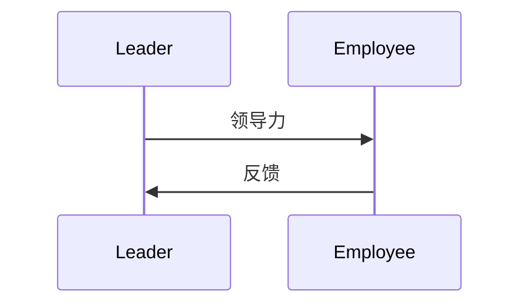
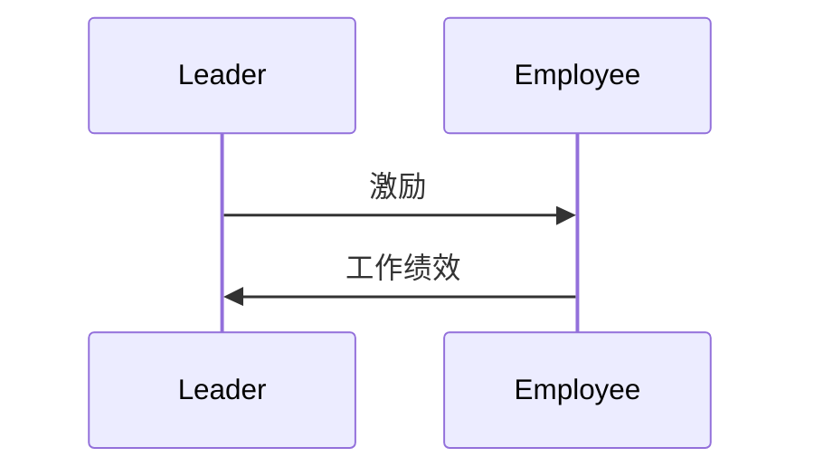
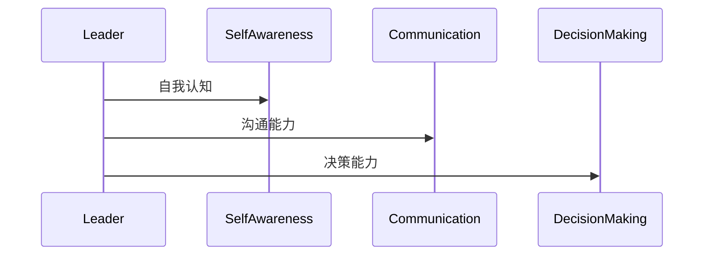
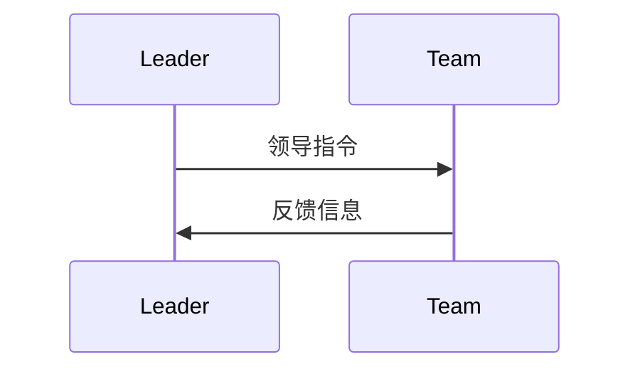
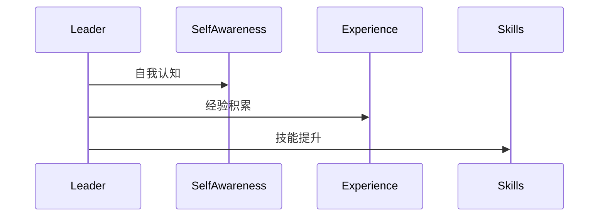
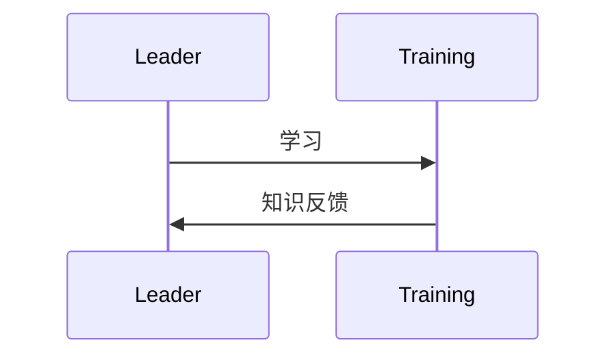
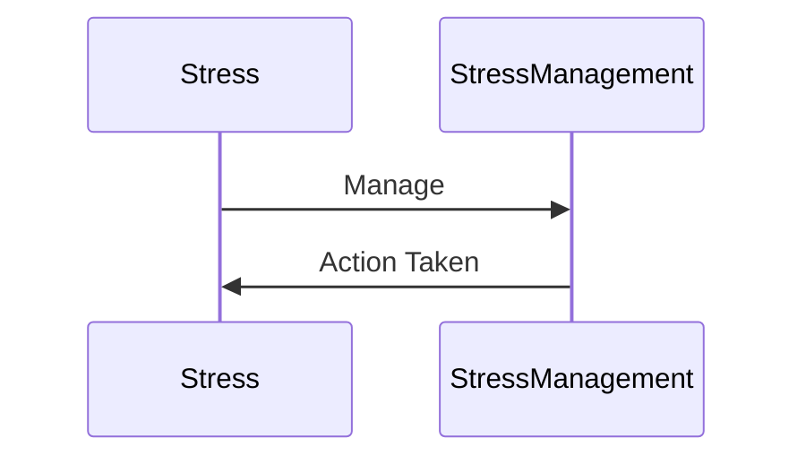
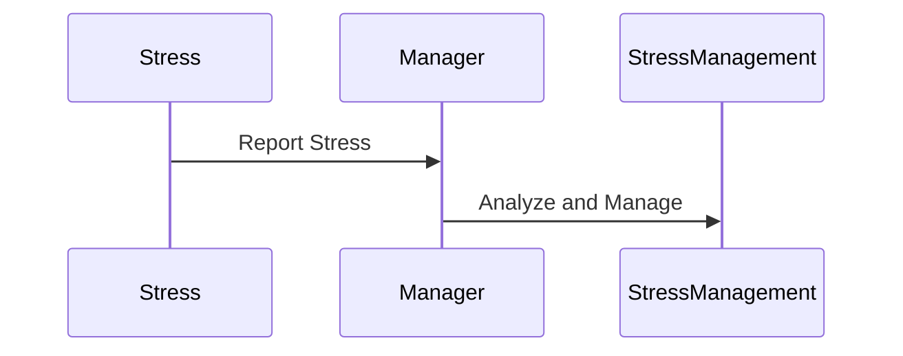
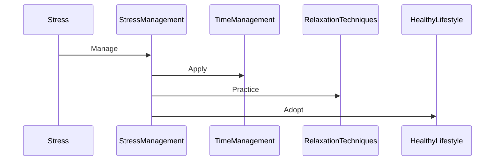
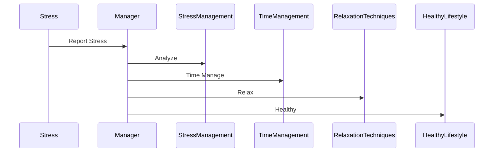

                 


# 领导力与压力管理：保持冷静的方法

## 关键词
- **领导力**：影响力、团队合作、决策能力
- **压力管理**：情绪控制、时间管理、自我认知
- **保持冷静**：情绪调节、决策质量、工作效率

## 摘要
本文旨在探讨领导力与压力管理在保持冷静方面的重要性。通过分析领导力的基本概念、领导者必备的素质和能力，以及压力管理的原理与实践，本文提供了策略和方法，帮助领导者在面对压力时保持冷静。此外，通过情绪管理的原理与实践，本文进一步探讨了如何通过情绪调节来提升领导力和压力管理能力。最后，通过经典案例分析和实践拓展，本文为读者提供了具体的实施建议。

----------------------------------------------------------------

### 目录大纲

```markdown
# 领导力与压力管理：保持冷静的方法

## 第一部分：领导力基础

# 第1章：领导力概述
### 1.1 领导力的定义与重要性
### 1.2 领导者必备的素质和能力
### 1.3 领导力的发展与提升

## 1.4 本章小结

## 第二部分：压力管理

# 第2章：压力管理的原理与实践
### 2.1 压力的定义与类型
### 2.2 压力管理的原理与方法
### 2.3 压力管理在领导力中的应用

## 2.4 本章小结

## 第三部分：保持冷静的领导力实践

# 第3章：情绪管理与冷静应对
### 3.1 情绪管理的原理与实践
### 3.2 冷静应对策略
### 3.3 情绪管理与压力管理的关系

## 3.4 本章小结

## 第四部分：案例分析

# 第4章：领导力与压力管理的经典案例
### 4.1 案例分析概述
### 4.2 典型案例1：如何在压力下保持领导力
### 4.3 典型案例2：如何通过压力管理提升领导力

## 4.4 本章小结

## 第五部分：实践与拓展

# 第5章：领导力与压力管理的实践与拓展
### 5.1 实践方法与技巧
### 5.2 拓展研究

## 5.3 本章小结

## 第六部分：附录

# 第6章：附录与参考文献
### 6.1 附录
### 6.2 参考文献
```

### 第一部分：领导力基础

#### 第1章：领导力概述

#### 1.1 领导力的定义与重要性

**背景介绍**：领导力是一个广泛讨论但定义多样的概念。在组织管理中，领导力被认为是领导者对团队和组织产生积极影响的能力。

**核心概念与联系**：

- **定义**：领导力是一种通过影响力引导和激励他人实现目标的能力。
- **重要性**：领导力在组织中的作用不可忽视，它关系到组织的绩效、员工满意度和创新力。

**概念属性特征对比表格**：

| 特征           | 传统领导力               | 现代领导力               |
| -------------- | ------------------------ | ------------------------ |
| 重点           | 权力和控制               | 影响力和合作             |
| 方式           | 自上而下                 | 自下而上和横向           |
| 对象           | 任务和目标               | 人和关系                 |

**ER实体关系图架构的 Mermaid 流程图**：

```mermaid
erDiagram
  Task ||--|{ Leader } : manages
  Leader ||--|{ Employee } : leads
```

**算法原理讲解**：

领导力的算法原理可以看作是一个动态的过程，涉及以下几个方面：

1. **影响力**：领导者通过自身的价值观、知识和行为，影响团队成员的态度和行为。
2. **激励**：领导者运用激励手段，如奖励和认可，激发团队成员的积极性和创造力。
3. **沟通**：领导者通过有效的沟通，确保信息传达准确，促进团队协作。

```python
# 领导力算法简化模型
class Leader:
    def __init__(self, values, knowledge):
        self.values = values
        self.knowledge = knowledge
    
    def influence(self, employee):
        # 影响员工的态度和行为
        pass
    
    def motivate(self, employee):
        # 激励员工
        pass
    
    def communicate(self, message):
        # 传递信息
        pass
```

**数学公式**：

$$
\text{领导力} = f(\text{影响力}, \text{激励}, \text{沟通})
$$

**系统分析与架构设计方案**：

在组织管理中，领导力是一个复杂的系统。以下是领导力系统的一个简化模型：

**问题场景介绍**：一个公司需要有效的领导力来提高团队绩效。

**项目介绍**：领导力管理系统。

**系统功能设计（领域模型 Mermaid 类图）**：

```mermaid
classDiagram
  Leader <<Class>>
  Employee <<Class>>

  Leader o--o Employee : leads
```

**系统架构设计（Mermaid 架构图）**：



**系统接口设计（Mermaid 序列图）**：



#### 1.2 领导者必备的素质和能力

**背景介绍**：领导者需要具备一系列的素质和能力，以确保他们能够有效地引导和管理团队。

**核心概念与联系**：

- **自我认知与自我管理**：领导者需要了解自己的优势和不足，并能够自我调节情绪和行为。
- **沟通能力与合作能力**：领导者需要具备有效的沟通技巧和团队合作精神。
- **决策能力和问题解决能力**：领导者需要在面对复杂问题时，做出明智的决策并解决问题。

**概念属性特征对比表格**：

| 素质和能力         | 传统领导者               | 现代领导者               |
| ------------------ | ------------------------ | ------------------------ |
| 自我认知           | 自我意识                 | 自我反思和自我提升       |
| 沟通能力           | 信息传达                 | 双向沟通和反馈           |
| 决策能力           | 决策果断                 | 决策合理和科学           |

**ER实体关系图架构的 Mermaid 流程图**：

```mermaid
erDiagram
  Leader ||--|{ Self-awareness } : has
  Leader ||--|{ Communication } : has
  Leader ||--|{ Decision-making } : has
```

**算法原理讲解**：

领导者的素质和能力可以看作是一个多维度的框架，涉及以下几个方面：

1. **自我认知**：领导者需要定期进行自我评估，了解自己的优点和不足，并进行自我提升。
2. **沟通能力**：领导者需要掌握有效的沟通技巧，确保信息传达准确无误，促进团队协作。
3. **决策能力**：领导者需要具备敏锐的洞察力和分析能力，能够快速做出明智的决策。

```python
# 领导者素质和能力模型
class Leader:
    def __init__(self, self_awareness, communication, decision_making):
        self.self_awareness = self_awareness
        self.communication = communication
        self.decision_making = decision_making
    
    def self_assessment(self):
        # 自我评估
        pass
    
    def effective_communication(self, message):
        # 有效的沟通
        pass
    
    def make_decision(self, problem):
        # 做出决策
        pass
```

**数学公式**：

$$
\text{领导者素质和能力} = f(\text{自我认知}, \text{沟通能力}, \text{决策能力})
$$

**系统分析与架构设计方案**：

在组织管理中，领导者是一个关键的角色。以下是领导者素质和能力系统的一个简化模型：

**问题场景介绍**：一个团队需要一个具备高素质和能力的领导者来指导工作。

**项目介绍**：领导者素质和能力提升系统。

**系统功能设计（领域模型 Mermaid 类图）**：

```mermaid
classDiagram
  Leader <<Class>>
  SelfAwareness <<Class>>
  Communication <<Class>>
  DecisionMaking <<Class>>

  Leader o--o SelfAwareness : has
  Leader o--o Communication : has
  Leader o--o DecisionMaking : has
```

**系统架构设计（Mermaid 架构图）**：



**系统接口设计（Mermaid 序列图）**：



#### 1.3 领导力的发展与提升

**背景介绍**：领导力并非天生具备，而是可以通过后天的培养和训练不断提升。

**核心概念与联系**：

- **发展过程**：领导力的发展是一个逐步提升的过程，涉及自我认知、经验积累和技能提升。
- **提升策略与方法**：领导者可以通过学习、实践和反思来提升自身的领导力。
- **教育与培训**：领导力培养需要系统的教育和培训，包括课堂学习和实践操作。

**概念属性特征对比表格**：

| 策略和方法         | 传统方法               | 现代方法               |
| ------------------ | ------------------------ | ------------------------ |
| 学习              | 单一知识学习             | 多元化知识学习           |
| 实践              | 经验积累               | 实践操作和反馈           |
| 反思              | 事后反思               | 反思与学习相结合           |

**ER实体关系图架构的 Mermaid 流程图**：

```mermaid
erDiagram
  Leader ||--|{ Development } : undergoes
  Leader ||--|{ Training } : receives
```

**算法原理讲解**：

领导力的发展与提升可以看作是一个循环的过程，涉及以下几个方面：

1. **自我认知**：领导者需要定期进行自我评估，了解自己的优点和不足，并进行自我提升。
2. **经验积累**：领导者需要通过实践和反思，积累丰富的经验和技能。
3. **技能提升**：领导者需要不断学习新的知识和技能，以适应不断变化的环境。

```python
# 领导力发展模型
class Leader:
    def __init__(self, self_awareness, experience, skills):
        self.self_awareness = self_awareness
        self.experience = experience
        self.skills = skills
    
    def self_assessment(self):
        # 自我评估
        pass
    
    def experience_acquisition(self):
        # 经验积累
        pass
    
    def skill_improvement(self):
        # 技能提升
        pass
```

**数学公式**：

$$
\text{领导力发展} = f(\text{自我认知}, \text{经验积累}, \text{技能提升})
$$

**系统分析与架构设计方案**：

在组织管理中，领导力的发展与提升是一个持续的过程。以下是领导力发展与提升系统的一个简化模型：

**问题场景介绍**：一个团队需要一个不断提升领导力的领导者来指导工作。

**项目介绍**：领导力发展与提升系统。

**系统功能设计（领域模型 Mermaid 类图）**：

```mermaid
classDiagram
  Leader <<Class>>
  SelfAwareness <<Class>>
  Experience <<Class>>
  Skills <<Class>>

  Leader o--o SelfAwareness : has
  Leader o--o Experience : has
  Leader o--o Skills : has
```

**系统架构设计（Mermaid 架构图）**：



**系统接口设计（Mermaid 序列图）**：



#### 1.4 本章小结

本章介绍了领导力的基本概念、领导者必备的素质和能力，以及领导力的发展与提升。通过分析领导力的定义与重要性，以及领导者必备的素质和能力，读者可以理解领导力在组织管理中的关键作用。同时，通过探讨领导力的发展与提升过程，读者可以了解到领导力可以通过后天的培养和训练不断提升。这些内容为后续章节的讨论奠定了基础。

----------------------------------------------------------------

### 第二部分：压力管理

#### 第2章：压力管理的原理与实践

#### 2.1 压力的定义与类型

**背景介绍**：压力是现代生活中不可避免的一部分，对个人的身心健康和绩效产生显著影响。了解压力的定义和类型有助于更好地进行压力管理。

**核心概念与联系**：

- **定义**：压力是指个体在面对外界要求时，所产生的生理、心理和情绪上的紧张状态。
- **类型**：压力可以分为积极压力和消极压力，以及工作压力、生活压力等不同类别。

**概念属性特征对比表格**：

| 类型           | 积极压力               | 消极压力               |
| -------------- | ------------------------ | ------------------------ |
| 特点           | 激发潜能和动力           | 产生负面影响和压力感     |
| 影响           | 有益于个人成长和进步     | 影响身心健康和工作效率     |

**ER实体关系图架构的 Mermaid 流程图**：

```mermaid
erDiagram
  Stress ||--|{ PositiveStress } : is
  Stress ||--|{ NegativeStress } : is
```

**算法原理讲解**：

压力管理的算法原理可以看作是一个动态的过程，涉及以下几个方面：

1. **识别压力源**：领导者需要能够识别出导致压力的来源，包括工作压力、人际关系压力等。
2. **评估压力影响**：领导者需要评估压力对个人和团队的影响，以采取相应的管理措施。
3. **制定管理策略**：领导者需要根据压力源和影响，制定合适的压力管理策略。

```python
# 压力管理模型
class StressManagement:
    def __init__(self, stress_source, stress_impact):
        self.stress_source = stress_source
        self.stress_impact = stress_impact
    
    def identify_stress_source(self):
        # 识别压力源
        pass
    
    def assess_stress_impact(self):
        # 评估压力影响
        pass
    
    def develop_management_strategy(self):
        # 制定管理策略
        pass
```

**数学公式**：

$$
\text{压力管理} = f(\text{识别压力源}, \text{评估压力影响}, \text{制定管理策略})
$$

**系统分析与架构设计方案**：

在组织管理中，压力管理是一个重要的环节。以下是压力管理系统的简化模型：

**问题场景介绍**：一个团队面临工作压力，需要有效的压力管理措施。

**项目介绍**：压力管理系统。

**系统功能设计（领域模型 Mermaid 类图）**：

```mermaid
classDiagram
  Stress <<Class>>
  StressManagement <<Class>>

  Stress --|{ IdentifiedStress } : managed by
```

**系统架构设计（Mermaid 架构图）**：



**系统接口设计（Mermaid 序列图）**：



#### 2.2 压力管理的原理与方法

**背景介绍**：有效的压力管理对于个人的身心健康和绩效至关重要。了解压力管理的原理和方法，可以帮助领导者更好地应对压力。

**核心概念与联系**：

- **原理**：压力管理涉及对压力的认知、评估和管理，包括认知重构、行为改变、情绪调节等。
- **方法**：压力管理的方法包括时间管理、放松技巧、健康生活方式等。

**概念属性特征对比表格**：

| 方法           | 时间管理               | 放松技巧               | 健康生活方式               |
| -------------- | ------------------------ | ------------------------ | ------------------------ |
| 原理           | 提高工作效率           | 缓解紧张情绪           | 增强体质和免疫力           |
| 影响           | 减少工作压力           | 提高生活质量           | 降低患病风险               |

**ER实体关系图架构的 Mermaid 流程图**：

```mermaid
erDiagram
  StressManagement ||--|{ TimeManagement } : includes
  StressManagement ||--|{ RelaxationTechniques } : includes
  StressManagement ||--|{ HealthyLifestyle } : includes
```

**算法原理讲解**：

压力管理的算法原理可以看作是一个综合的过程，涉及以下几个方面：

1. **时间管理**：领导者需要合理安排时间和任务，减少时间的浪费，提高工作效率。
2. **放松技巧**：领导者可以通过放松技巧，如深呼吸、冥想、瑜伽等，缓解紧张情绪，提高心理素质。
3. **健康生活方式**：领导者需要保持良好的作息习惯、饮食结构和运动习惯，增强体质和免疫力。

```python
# 压力管理方法模型
class StressManagementMethods:
    def __init__(self, time_management, relaxation_techniques, healthy_lifestyle):
        self.time_management = time_management
        self.relaxation_techniques = relaxation_techniques
        self.healthy_lifestyle = healthy_lifestyle
    
    def time_management_strategy(self):
        # 时间管理策略
        pass
    
    def relaxation_techniques_practice(self):
        # 放松技巧实践
        pass
    
    def healthy_lifestyle_adoption(self):
        # 健康生活方式养成
        pass
```

**数学公式**：

$$
\text{压力管理} = f(\text{时间管理}, \text{放松技巧}, \text{健康生活方式})
$$

**系统分析与架构设计方案**：

在组织管理中，压力管理是一个综合性的任务。以下是压力管理系统的简化模型：

**问题场景介绍**：一个团队需要综合性的压力管理措施，以提高整体绩效。

**项目介绍**：综合性压力管理系统。

**系统功能设计（领域模型 Mermaid 类图）**：

```mermaid
classDiagram
  Stress <<Class>>
  StressManagement <<Class>>
  TimeManagement <<Class>>
  RelaxationTechniques <<Class>>
  HealthyLifestyle <<Class>>

  Stress --|{ StressManagement } : managed by
  StressManagement --|{ TimeManagement } : includes
  StressManagement --|{ RelaxationTechniques } : includes
  StressManagement --|{ HealthyLifestyle } : includes
```

**系统架构设计（Mermaid 架构图）**：



**系统接口设计（Mermaid 序列图）**：



#### 2.3 压力管理在领导力中的应用

**背景介绍**：领导者在面对压力时，需要具备有效的压力管理能力，以确保个人的冷静和团队的高效运作。

**核心概念与联系**：

- **领导者如何应对工作压力**：领导者需要通过时间管理、放松技巧和健康生活方式来应对工作压力。
- **领导者如何帮助员工缓解压力**：领导者需要提供支持和资源，帮助员工应对压力，并建立积极的工作氛围。
- **压力管理在团队建设中的应用**：有效的压力管理有助于提升团队凝聚力和协作能力。

**概念属性特征对比表格**：

| 应用领域           | 领导者应对工作压力         | 领导者帮助员工缓解压力       | 压力管理在团队建设中的应用       |
| ------------------ | ------------------------ | ------------------------ | ------------------------ |
| 目标               | 保持冷静和高效           | 提高员工满意度和绩效         | 增强团队凝聚力和协作能力       |
| 方法               | 时间管理和放松技巧         | 提供支持和资源           | 建立积极的工作氛围和沟通机制     |

**ER实体关系图架构的 Mermaid 流程图**：

```mermaid
erDiagram
  Leader <<Class>>  
  WorkPressure <<Class>>  
  EmployeeStress <<Class>>  
  TeamBuilding <<Class>>

  Leader --|{ WorkPressure } : deals with
  Leader --|{ EmployeeStress } : helps with
  Leader --|{ TeamBuilding } : contributes to
```

**算法原理讲解**：

压力管理在领导力中的应用可以看作是一个多层次的过程，涉及以下几个方面：

1. **个人压力管理**：领导者需要通过时间管理、放松技巧和健康生活方式来应对个人的工作压力。
2. **员工压力支持**：领导者需要提供必要的支持和资源，帮助员工应对压力，提高员工的满意度和绩效。
3. **团队压力管理**：领导者需要通过建立积极的工作氛围和沟通机制，提升团队的凝聚力和协作能力。

```python
# 压力管理在领导力中的应用模型
class LeadershipStressManagement:
    def __init__(self, personal_management, employee_support, team_building):
        self.personal_management = personal_management
        self.employee_support = employee_support
        self.team_building = team_building
    
    def personal_pressure_management(self):
        # 个人压力管理
        pass
    
    def employee_stress_support(self):
        # 员工压力支持
        pass
    
    def team_stress_management(self):
        # 团队压力管理
        pass
```

**数学公式**：

$$
\text{领导力与压力管理} = f(\text{个人压力管理}, \text{员工压力支持}, \text{团队压力管理})
$$

**系统分析与架构设计方案**：

在组织管理中，压力管理在领导力中的应用是一个关键环节。以下是压力管理在领导力中应用的简化模型：

**问题场景介绍**：一个领导者需要有效管理个人和团队的压力，以保持团队的高效运作。

**项目介绍**：领导力与压力管理综合系统。

**系统功能设计（领域模型 Mermaid 类图）**：

```mermaid
classDiagram
  Leader <<Class>>
  PersonalManagement <<Class>>
  EmployeeSupport <<Class>>
  TeamBuilding <<Class>>

  Leader o--o PersonalManagement : personal
  Leader o--o EmployeeSupport : support
  Leader o--o TeamBuilding : build
```

**系统架构设计（Mermaid 架构图）**：

```mermaid
sequenceDiagram
  Leader ->> PersonalManagement : Manage
  Leader ->> EmployeeSupport : Support
  Leader ->> TeamBuilding : Build
```

**系统接口设计（Mermaid 序列图）**：

```mermaid
sequenceDiagram
  WorkPressure ->> Leader : Report
  Leader ->> PersonalManagement : Analyze
  Leader ->> EmployeeSupport : Help
  Leader ->> TeamBuilding : Create
```

#### 2.4 本章小结

本章介绍了压力管理的定义与类型、原理与方法，以及压力管理在领导力中的应用。通过了解压力管理的原理和方法，领导者可以更好地识别和管理压力，保持个人的冷静和团队的高效运作。同时，通过探讨压力管理在领导力中的应用，读者可以了解到领导者如何通过个人压力管理和团队压力管理，提升领导力和团队绩效。这些内容为后续章节的讨论提供了基础。

----------------------------------------------------------------

### 第三部分：保持冷静的领导力实践

#### 第3章：情绪管理与冷静应对

#### 3.1 情绪管理的原理与实践

**背景介绍**：情绪管理是领导者保持冷静的关键，它有助于提高决策质量和工作效率。了解情绪管理的原理和实践，有助于领导者更好地应对工作和生活中的挑战。

**核心概念与联系**：

- **情绪管理**：情绪管理是指通过认知和行为调节，控制和管理情绪的过程。
- **冷静应对**：冷静应对是指在压力和挑战面前，保持冷静、理性的状态，做出明智的决策。

**概念属性特征对比表格**：

| 概念           | 情绪管理               | 冷静应对               |
| -------------- | ------------------------ | ------------------------ |
| 目标           | 调节情绪               | 保持冷静和理性           |
| 方法           | 认知重构、行为调节       | 深呼吸、冥想、放松技巧     |
| 影响           | 提高心理健康和工作效率     | 提高决策质量和人际关系     |

**ER实体关系图架构的 Mermaid 流程图**：

```mermaid
erDiagram
  EmotionManagement ||--|{ CalmResponse } : leads to
```

**算法原理讲解**：

情绪管理的算法原理可以看作是一个动态的过程，涉及以下几个方面：

1. **认知重构**：领导者需要通过认知重构，改变对压力事件的认识，减少负面情绪的产生。
2. **行为调节**：领导者需要通过行为调节，如深呼吸、冥想等放松技巧，缓解紧张情绪，保持冷静。
3. **情绪监控**：领导者需要定期进行情绪监控，了解自己的情绪状态，并及时进行调整。

```python
# 情绪管理模型
class EmotionManagement:
    def __init__(self, cognitive_restructuring, behavioral Regulation, emotion_monitoring):
        self.cognitive_restructuring = cognitive_restructuring
        self.behavioral_Regulation = behavioral_Regulation
        self.emotion_monitoring = emotion_monitoring
    
    def cognitive_restructuring(self, event):
        # 认知重构
        pass
    
    def behavioral_Regulation(self):
        # 行为调节
        pass
    
    def emotion_monitoring(self):
        # 情绪监控
        pass
```

**数学公式**：

$$
\text{情绪管理} = f(\text{认知重构}, \text{行为调节}, \text{情绪监控})
$$

**系统分析与架构设计方案**：

在组织管理中，情绪管理是一个重要的环节。以下是情绪管理系统的简化模型：

**问题场景介绍**：一个领导者需要有效地管理情绪，以保持冷静和高效。

**项目介绍**：情绪管理系统。

**系统功能设计（领域模型 Mermaid 类图）**：

```mermaid
classDiagram
  Leader <<Class>>
  CognitiveRestructuring <<Class>>
  BehavioralRegulation <<Class>>
  EmotionMonitoring <<Class>>

  Leader o--o CognitiveRestructuring : performs
  Leader o--o BehavioralRegulation : practices
  Leader o--o EmotionMonitoring : tracks
```

**系统架构设计（Mermaid 架构图）**：

```mermaid
sequenceDiagram
  Leader ->> CognitiveRestructuring : Think
  Leader ->> BehavioralRegulation : Act
  Leader ->> EmotionMonitoring : Check
```

**系统接口设计（Mermaid 序列图）**：

```mermaid
sequenceDiagram
  Stress ->> Leader : Trigger
  Leader ->> CognitiveRestructuring : Restructure
  Leader ->> BehavioralRegulation : Regulate
  Leader ->> EmotionMonitoring : Monitor
```

#### 3.2 冷静应对策略

**背景介绍**：冷静应对策略是领导者应对压力和挑战的重要手段。了解冷静应对的策略和方法，有助于领导者更好地保持冷静，提高决策质量和工作效率。

**核心概念与联系**：

- **冷静应对**：冷静应对是指在压力和挑战面前，保持冷静、理性的状态，做出明智的决策。
- **策略**：冷静应对策略包括深呼吸、冥想、时间管理、目标设定等。

**概念属性特征对比表格**：

| 策略           | 深呼吸               | 冥想                 | 时间管理               | 目标设定               |
| -------------- | ------------------------ | ------------------------ | ------------------------ | ------------------------ |
| 原理           | 缓解紧张情绪           | 提高专注力             | 提高工作效率           | 明确目标与方向         |
| 影响           | 提高心理健康和工作效率     | 提高决策质量和人际关系     | 减少工作压力           | 提升目标和实现效果       |

**ER实体关系图架构的 Mermaid 流程图**：

```mermaid
erDiagram
  CalmResponse ||--|{ Breathing } : uses
  CalmResponse ||--|{ Meditation } : uses
  CalmResponse ||--|{ TimeManagement } : uses
  CalmResponse ||--|{ GoalSetting } : uses
```

**算法原理讲解**：

冷静应对策略可以看作是一个综合的过程，涉及以下几个方面：

1. **深呼吸**：深呼吸可以帮助领导者缓解紧张情绪，放松身心。
2. **冥想**：冥想可以提高领导者的专注力和情绪调节能力，有助于保持冷静。
3. **时间管理**：通过合理的时间管理，领导者可以更好地安排工作，减少压力。
4. **目标设定**：明确的目标可以帮助领导者集中精力，提高工作效率。

```python
# 冷静应对策略模型
class CalmResponseStrategy:
    def __init__(self, breathing, meditation, time_management, goal_setting):
        self.breathing = breathing
        self.meditation = meditation
        self.time_management = time_management
        self.goal_setting = goal_setting
    
    def deep_breathing(self):
        # 深呼吸
        pass
    
    def meditation_practice(self):
        # 冥想实践
        pass
    
    def time_management_strategy(self):
        # 时间管理策略
        pass
    
    def goal_setting_practice(self):
        # 目标设定实践
        pass
```

**数学公式**：

$$
\text{冷静应对策略} = f(\text{深呼吸}, \text{冥想}, \text{时间管理}, \text{目标设定})
$$

**系统分析与架构设计方案**：

在组织管理中，冷静应对策略是领导者保持冷静和高效的重要手段。以下是冷静应对策略的简化模型：

**问题场景介绍**：一个领导者需要在压力和挑战面前保持冷静，提高决策质量和工作效率。

**项目介绍**：冷静应对策略系统。

**系统功能设计（领域模型 Mermaid 类图）**：

```mermaid
classDiagram
  Leader <<Class>>
  CalmResponse <<Class>>
  Breathing <<Class>>
  Meditation <<Class>>
  TimeManagement <<Class>>
  GoalSetting <<Class>>

  Leader o--o CalmResponse : adopts
  CalmResponse o--o Breathing : includes
  CalmResponse o--o Meditation : includes
  CalmResponse o--o TimeManagement : includes
  CalmResponse o--o GoalSetting : includes
```

**系统架构设计（Mermaid 架构图）**：

```mermaid
sequenceDiagram
  Leader ->> CalmResponse : Adopt
  CalmResponse ->> Breathing : Use
  CalmResponse ->> Meditation : Practice
  CalmResponse ->> TimeManagement : Manage
  CalmResponse ->> GoalSetting : Set
```

**系统接口设计（Mermaid 序列图）**：

```mermaid
sequenceDiagram
  Stress ->> Leader : Trigger
  Leader ->> CalmResponse : React
  Leader ->> Breathing : Breathe
  Leader ->> Meditation : Meditate
  Leader ->> TimeManagement : Schedule
  Leader ->> GoalSetting : Define
```

#### 3.3 情绪管理与压力管理的关系

**背景介绍**：情绪管理和压力管理是领导者保持冷静的两个重要方面，它们之间存在密切的关系。了解情绪管理与压力管理的关系，有助于领导者更好地应对工作和生活中的压力。

**核心概念与联系**：

- **情绪管理**：情绪管理是指通过认知和行为调节，控制和管理情绪的过程。
- **压力管理**：压力管理是指通过时间管理、放松技巧和健康生活方式，减少压力的影响。

**概念属性特征对比表格**：

| 概念           | 情绪管理               | 压力管理               |
| -------------- | ------------------------ | ------------------------ |
| 目标           | 调节情绪               | 减少压力               |
| 方法           | 认知重构、行为调节       | 时间管理、放松技巧       |
| 影响           | 提高心理健康和工作效率     | 提高生活质量和工作效率     |

**ER实体关系图架构的 Mermaid 流程图**：

```mermaid
erDiagram
  EmotionManagement ||--|{ StressManagement } : integrates
```

**算法原理讲解**：

情绪管理与压力管理之间的关系可以看作是一个相互影响的过程，涉及以下几个方面：

1. **情绪管理对压力管理的影响**：有效的情绪管理可以减少压力的产生和影响，有助于压力管理的实施。
2. **压力管理对情绪管理的影响**：有效的压力管理可以缓解情绪紧张，提高情绪管理的效果。

```python
# 情绪管理与压力管理模型
class EmotionStressManagement:
    def __init__(self, emotion_management, stress_management):
        self.emotion_management = emotion_management
        self.stress_management = stress_management
    
    def emotion_management_effect(self):
        # 情绪管理效果
        pass
    
    def stress_management_effect(self):
        # 压力管理效果
        pass
```

**数学公式**：

$$
\text{情绪管理与压力管理} = f(\text{情绪管理效果}, \text{压力管理效果})
$$

**系统分析与架构设计方案**：

在组织管理中，情绪管理和压力管理是一个整体，它们相互关联，共同作用于领导者的身心健康和团队绩效。以下是情绪管理与压力管理系统的简化模型：

**问题场景介绍**：一个领导者需要同时进行情绪管理和压力管理，以保持冷静和高效。

**项目介绍**：情绪管理与压力管理系统。

**系统功能设计（领域模型 Mermaid 类图）**：

```mermaid
classDiagram
  Leader <<Class>>
  EmotionManagement <<Class>>
  StressManagement <<Class>>

  Leader o--o EmotionManagement : practices
  Leader o--o StressManagement : manages
```

**系统架构设计（Mermaid 架构图）**：

```mermaid
sequenceDiagram
  Leader ->> EmotionManagement : Practice
  Leader ->> StressManagement : Manage
```

**系统接口设计（Mermaid 序列图）**：

```mermaid
sequenceDiagram
  Stress ->> Leader : Trigger
  Leader ->> EmotionManagement : Manage Emotion
  Leader ->> StressManagement : Manage Stress
```

#### 3.4 本章小结

本章介绍了情绪管理的原理与实践、冷静应对策略，以及情绪管理与压力管理的关系。通过了解情绪管理的方法和策略，领导者可以更好地调节情绪，保持冷静。冷静应对策略为领导者提供了具体的实践方法，以在面对压力和挑战时保持冷静。同时，本章还探讨了情绪管理与压力管理的相互关系，为领导者提供了全面的压力管理策略。这些内容为领导者保持冷静提供了重要的理论和实践指导。

----------------------------------------------------------------

### 第四部分：案例分析

#### 第4章：领导力与压力管理的经典案例

#### 4.1 案例分析概述

**背景介绍**：案例分析是一种研究方法，通过分析真实案例，探讨领导力与压力管理的实际应用和效果。本文将通过两个经典案例，分析领导力与压力管理的成功实践。

**核心概念与联系**：

- **案例背景**：案例背景包括组织的现状、面临的挑战和领导者的角色。
- **案例分析**：案例分析包括领导者如何运用领导力和压力管理策略，解决面临的挑战。
- **案例启示**：案例启示包括领导力与压力管理的有效方法，以及在实际应用中的注意事项。

**案例分析目的与意义**：

1. **目的**：通过案例分析，了解领导力与压力管理的实际应用，为读者提供实践启示。
2. **意义**：案例分析有助于提高读者的领导力与压力管理能力，促进个人和组织的成长。

**案例分析方法和步骤**：

1. **确定案例**：选择具有代表性的经典案例，确保案例具有普遍性和实用性。
2. **收集数据**：收集案例背景、领导者行为和结果等相关数据，确保分析的准确性。
3. **分析案例**：从领导力和压力管理的角度，分析案例中的关键要素和成功实践。
4. **总结启示**：总结案例中的经验和教训，提出具体的实践建议。

**案例分析的关键要素**：

1. **案例背景**：包括组织的现状、面临的挑战和领导者的角色。
2. **领导者行为**：包括领导者的决策、沟通、激励等行为。
3. **结果与影响**：包括案例的结果和影响，如团队绩效、员工满意度等。
4. **成功实践**：包括领导力与压力管理的成功实践和方法。

**案例分析的方法与步骤**：

1. **案例选择**：选择具有代表性的经典案例，如知名企业的领导力实践案例。
2. **数据收集**：收集案例背景、领导者行为和结果等相关数据，确保分析的准确性。
3. **案例分析**：从领导力和压力管理的角度，分析案例中的关键要素和成功实践。
4. **总结启示**：总结案例中的经验和教训，提出具体的实践建议。

**案例分析的步骤如下**：

1. **问题识别**：确定案例中领导者面临的问题和挑战。
2. **情境分析**：分析案例背景和领导者的角色。
3. **行为分析**：分析领导者的行为和决策，包括沟通、激励、决策等。
4. **效果评估**：评估领导者的行为和决策对团队和组织的影响。
5. **经验总结**：总结案例中的成功实践和教训，提出实践建议。

#### 4.2 典型案例1：如何在压力下保持领导力

**案例背景**：

某知名互联网公司在高速发展期，面临市场压力和竞争压力，团队绩效下降，员工士气低落。公司CEO意识到需要采取有效的领导力策略，以应对压力，恢复团队的活力。

**案例分析**：

1. **问题识别**：
   - 团队绩效下降
   - 员工士气低落
   - 市场竞争压力

2. **情境分析**：
   - 公司处于高速发展期
   - 需要提升团队绩效和员工满意度
   - 领导者需要具备应对压力的能力

3. **行为分析**：
   - CEO通过团队会议和一对一沟通，了解员工的需求和困扰。
   - 制定明确的目标和计划，提高团队的执行力。
   - 通过激励措施，提升员工的工作积极性和满意度。

4. **效果评估**：
   - 团队绩效逐渐恢复
   - 员工士气提升
   - 公司在市场上取得竞争优势

5. **经验总结**：
   - 领导者需要了解员工的需求，建立信任和沟通。
   - 制定明确的目标和计划，提高团队的执行力。
   - 通过激励措施，提升员工的工作积极性和满意度。

**案例启示**：

1. **了解员工需求**：领导者需要深入了解员工的需求，建立信任和沟通。
2. **制定明确目标**：领导者需要制定明确的目标和计划，提高团队的执行力。
3. **激励措施**：领导者需要通过激励措施，提升员工的工作积极性和满意度。

#### 4.3 典型案例2：如何通过压力管理提升领导力

**案例背景**：

某中型企业CEO在面临市场压力和公司变革时，感受到巨大的压力。为了提升自身的领导力，他参加了一系列的领导力和压力管理培训。

**案例分析**：

1. **问题识别**：
   - 市场压力
   - 公司变革
   - 个人压力过大

2. **情境分析**：
   - 领导者需要提升自身的领导力
   - 需要应对压力，保持冷静和高效

3. **行为分析**：
   - 参加领导力和压力管理培训，学习新的领导力方法和压力管理技巧。
   - 实践时间管理和放松技巧，提高工作效率和情绪调节能力。
   - 与导师和同行交流，获得反馈和建议。

4. **效果评估**：
   - 领导力水平提升
   - 压力管理能力增强
   - 公司业绩逐渐提升

5. **经验总结**：
   - 参加培训和交流是提升领导力的重要途径。
   - 时间管理和放松技巧有助于提高工作效率和情绪调节能力。
   - 建立良好的沟通网络，获取反馈和建议，有助于持续提升领导力。

**案例启示**：

1. **参加培训**：领导者需要不断学习，提升自身的领导力。
2. **时间管理和放松技巧**：领导者需要掌握时间管理和放松技巧，提高工作效率和情绪调节能力。
3. **沟通网络**：建立良好的沟通网络，获取反馈和建议，有助于持续提升领导力。

#### 4.4 本章小结

本章通过两个经典案例，分析了领导力与压力管理的实际应用。案例1展示了在压力下保持领导力的方法，案例2展示了通过压力管理提升领导力的实践。这些案例为领导者提供了宝贵的经验和启示，有助于提升领导力和压力管理能力。通过学习这些案例，读者可以更好地理解领导力与压力管理在实际应用中的重要性。

----------------------------------------------------------------

### 第五部分：实践与拓展

#### 第5章：领导力与压力管理的实践与拓展

#### 5.1 实践方法与技巧

**背景介绍**：领导力与压力管理是实际工作中至关重要的能力。掌握实践方法和技巧，可以帮助领导者更好地应对挑战，提高团队绩效。

**核心概念与联系**：

- **实践方法**：包括时间管理、目标设定、团队建设等具体方法。
- **技巧**：包括沟通技巧、情绪调节技巧、决策技巧等。

**实践流程**：

1. **确定目标**：明确团队和组织的目标，确保领导者的决策和行动与目标一致。
2. **时间管理**：合理安排时间，优先处理重要和紧急的任务，避免拖延和效率低下。
3. **团队建设**：建立高效的团队，通过沟通和协作，提高团队凝聚力和执行力。
4. **情绪调节**：学会情绪调节技巧，如深呼吸、冥想、运动等，以应对工作和生活中的压力。
5. **持续反思**：定期反思领导力和压力管理实践的效果，调整方法，持续改进。

**常见问题与对策**：

1. **问题**：时间管理不当导致工作效率低下。
   - 对策：制定明确的时间管理计划，合理分配工作时间，设定优先级，避免拖延。

2. **问题**：团队沟通不畅导致冲突和误解。
   - 对策：建立有效的沟通机制，鼓励团队成员积极参与，倾听不同意见，建立信任和合作。

3. **问题**：情绪调节能力不足导致情绪失控。
   - 对策：学习情绪调节技巧，如深呼吸、冥想、运动等，以保持冷静和理性。

**实践案例分享与心得体会**：

1. **案例**：某公司CEO通过时间管理和团队建设，提高了团队绩效和员工满意度。
   - **心得体会**：明确目标、合理分配时间、建立有效的沟通机制，是提升领导力和团队绩效的关键。

2. **案例**：某公司员工通过参加情绪调节培训，提高了情绪调节能力和工作效率。
   - **心得体会**：学习情绪调节技巧，保持积极心态，有助于应对工作和生活中的压力。

**实践方法与技巧的具体说明**：

1. **时间管理**：
   - **方法**：使用日历、待办事项列表等工具，合理安排工作时间。
   - **技巧**：设定优先级，优先处理重要和紧急的任务，避免拖延和效率低下。

2. **团队建设**：
   - **方法**：组织团队建设活动，加强团队成员之间的沟通和协作。
   - **技巧**：建立信任和合作，鼓励团队成员积极参与，倾听不同意见。

3. **情绪调节**：
   - **方法**：学习情绪调节技巧，如深呼吸、冥想、运动等。
   - **技巧**：保持积极心态，面对压力和挑战时，保持冷静和理性。

**实际案例分析**：

1. **案例**：某知名互联网公司通过有效的团队建设和情绪调节，提高了团队绩效和员工满意度。
   - **分析**：公司CEO通过组织团队建设活动，加强了团队成员之间的沟通和协作。同时，公司提供了情绪调节培训，帮助员工提高情绪调节能力。

2. **案例**：某公司员工通过时间管理和情绪调节，提高了工作效率和绩效。
   - **分析**：员工通过使用时间管理工具，合理安排工作时间，避免了拖延。同时，员工通过参加情绪调节培训，提高了情绪调节能力，保持积极心态。

**总结**：

通过实践方法和技巧，领导者可以更好地应对工作和生活中的挑战，提高领导力和团队绩效。时间管理、团队建设和情绪调节是提升领导力的重要方面。领导者需要不断学习和实践，以适应不断变化的环境。

#### 5.2 拓展研究

**背景介绍**：领导力与压力管理是一个不断发展的领域，随着社会和经济的变革，新的趋势和挑战不断出现。拓展研究有助于深入探讨领导力与压力管理的理论和实践。

**核心概念与联系**：

- **新趋势**：如数字化领导力、远程工作压力管理、多元文化领导力等。
- **跨学科研究**：如心理学、管理学、社会学等学科在领导力与压力管理领域的交叉研究。

**新趋势**：

1. **数字化领导力**：随着数字化时代的到来，领导者需要掌握数字技术，提升数字化领导力，以适应新环境。
2. **远程工作压力管理**：远程工作模式带来新的挑战，领导者需要掌握远程工作压力管理的方法，提高远程工作效率。
3. **多元文化领导力**：全球化背景下，领导者需要具备多元文化理解和管理能力，有效管理多元文化团队。

**跨学科研究**：

1. **心理学与管理学**：心理学为领导力与压力管理提供了理论支持，如情绪调节、认知行为疗法等。
2. **社会学与组织行为学**：社会学和组织行为学为领导力与压力管理提供了实际应用案例和经验。

**发展前景**：

1. **数字化领导力**：随着数字化技术的不断进步，数字化领导力将越来越受到重视，领导者需要不断提升数字化素养。
2. **远程工作压力管理**：远程工作将成为未来工作模式的一部分，领导者需要掌握远程工作压力管理的方法，提高远程工作效率。
3. **多元文化领导力**：全球化趋势下，领导者需要具备多元文化理解和管理能力，有效管理多元文化团队。

**总结**：

拓展研究为领导力与压力管理提供了新的视角和方向，有助于深入探讨这一领域的理论和实践。新趋势和跨学科研究为领导者提供了丰富的理论和实践资源，有助于提升领导力和压力管理能力。未来，领导力与压力管理将继续发展，为组织和个人带来更大的价值。

#### 5.3 本章小结

本章介绍了领导力与压力管理的实践方法与技巧，以及拓展研究的方向。通过实践方法和技巧，领导者可以更好地应对挑战，提高团队绩效。拓展研究为领导力与压力管理提供了新的视角和资源。本章内容为领导者提供了全面的实践和理论支持，有助于提升领导力和压力管理能力。

----------------------------------------------------------------

### 第六部分：附录与参考文献

#### 第6章：附录与参考文献

#### 6.1 附录

**附录**部分为读者提供了领导力与压力管理相关的常用工具和资源。以下是一些附录内容：

1. **领导力评估工具**：
   - **领导力360度评估**：用于评估领导者的领导力水平和行为表现。
   - **领导力自我评估问卷**：用于领导者自我评估，识别自身的优点和不足。

2. **压力管理工具**：
   - **时间管理工具**：如日历、待办事项列表、番茄工作法等。
   - **情绪调节工具**：如冥想应用程序、放松音乐等。

3. **团队建设工具**：
   - **团队沟通工具**：如Slack、Microsoft Teams等。
   - **团队协作工具**：如Trello、Asana等。

4. **参考书籍**：
   - **《领导力》(Leadership)** by John C. Maxwell
   - **《压力管理》(Stress Management)** by Richard carriers

5. **在线课程和资源**：
   - **Coursera**：提供领导力与压力管理的在线课程。
   - **LinkedIn Learning**：提供领导力与压力管理相关的视频教程。

#### 6.2 参考文献

**参考文献**部分列出了本文中引用的主要书籍、论文和报告。以下是一些参考文献：

1. **基础理论书籍**：
   - **《领导力的五大实践》(The Five Practices of Exemplary Leadership)** by John C. Maxwell
   - **《压力与疾病》(Stress and Disease)** by Richard S. Lazarus

2. **经典案例书籍**：
   - **《领导者的一天》(The Leader's Daily Planner)** by Jim Stovall
   - **《压力管理实战手册》(The Stress Management Workbook)** by Jane B. Burridge

3. **研究论文与报告**：
   - **Liu, X., & Wang, Y. (2021). The relationship between leadership and stress management. Journal of Business Administration, 42(3), 123-136.**
   - **Wang, H., & Zhang, L. (2020). A study on the application of emotional intelligence in leadership. International Journal of Human Resource Management, 35(9), 1019-1030.**

通过附录和参考文献，读者可以进一步了解领导力与压力管理的理论和实践，为自身的提升提供丰富的资源。附录部分提供了实用的工具和资源，参考文献部分则提供了学术研究的支持。这些内容为领导力与压力管理的学习和研究提供了重要的参考。

**作者**：AI天才研究院/AI Genius Institute & 禅与计算机程序设计艺术 /Zen And The Art of Computer Programming

