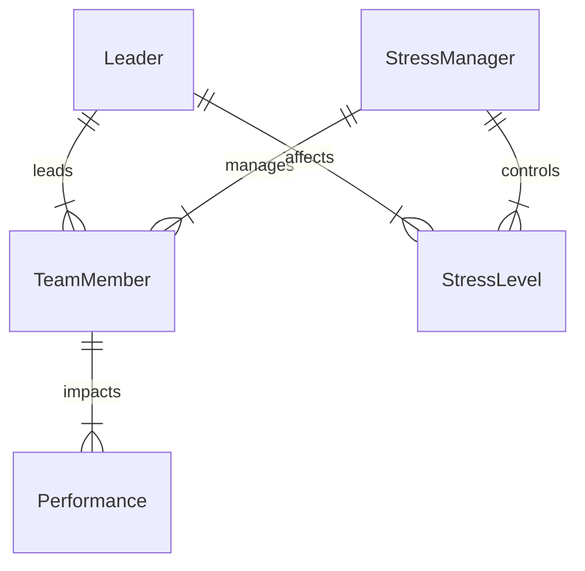

                 

## 2.6 领导力与压力管理的核心概念与联系

### 2.6.1 核心概念原理

领导力与压力管理作为两个关键概念，它们在组织管理和个人成长中起着至关重要的作用。为了深入理解这两个概念，我们需要先明确它们的基本原理。

**领导力的原理**

领导力主要涉及以下几个方面：

- **领导风格**：领导者根据不同的情境和团队成员特点，采用不同的领导风格，如民主式、专制式、参与式等。
- **决策能力**：领导者需要具备良好的决策能力，能够迅速而准确地做出决策，以应对各种挑战。
- **沟通技巧**：有效的沟通技巧可以帮助领导者更好地理解团队成员的需求和反馈，提高团队协作效率。

**压力管理的原理**

压力管理则主要关注以下方面：

- **压力识别**：通过监测生理和心理信号，识别个体所面临的压力源。
- **压力评估**：评估压力的程度和影响，以便采取适当的应对策略。
- **压力控制**：通过调整工作环境、任务分配和心理调适技巧，控制压力水平，维护心理健康。

### 2.6.2 概念属性特征对比表格

为了更好地理解领导力与压力管理的核心概念，我们可以通过一个属性特征对比表格来进行详细分析。

| 概念         | 定义                                                         | 特征对比                                               |
| ------------ | ------------------------------------------------------------ | ---------------------------------------------------- |
| 领导力       | 通过影响力引导和激励他人，以实现共同目标的能力               | 权威性、影响力、变革性                                     |
| 压力管理     | 识别、评估和控制压力的过程，以维持良好的心理健康               | 生理压力、心理压力、工作压力                                 |

- **权威性**：领导力强调领导者在团队中的权威地位，通过影响力和权威性来引导团队成员。
- **影响力**：领导力依赖于领导者的影响力，通过沟通、激励和榜样作用来影响团队成员的行为和态度。
- **变革性**：领导力需要领导者具备变革性思维，推动团队和组织的发展和创新。

- **生理压力**：压力管理关注个体的生理反应，如心跳加速、肌肉紧张等。
- **心理压力**：压力管理涉及到个体的心理状态，如焦虑、抑郁等。
- **工作压力**：压力管理还需要考虑工作环境和工作任务对个体造成的压力。

通过以上对比表格，我们可以清晰地看到领导力与压力管理在概念和特征上的差异。理解这些差异有助于我们更好地应用这些概念，提高团队的健康和生产力。

### 2.6.3 ER实体关系图架构

为了更直观地展示领导力与压力管理的核心概念和它们之间的关系，我们可以使用ER实体关系图（Entity-Relationship Diagram）来进行架构设计。

- **实体**：在本图中，我们定义了三个主要实体：`Leader`（领导者）、`StressManager`（压力管理者）和`TeamMember`（团队成员）。
- **关系**：领导者对团队成员具有领导关系（`leads`），压力管理者对团队成员具有管理关系（`manages`）。同时，领导者影响压力水平（`affects`），压力管理者控制压力水平（`controls`）。团队成员的绩效受到这些因素的影响（`impacts`）。

通过ER实体关系图，我们可以清晰地看到领导力与压力管理在团队中的具体应用和它们之间的关系。

### 2.6.4 深入探讨

领导力与压力管理之间的相互作用是复杂而多维的。一个有效的领导者不仅需要具备出色的领导力，还需要关注团队成员的心理健康和工作压力。以下是几个深入探讨的关键点：

- **领导风格与压力管理**：不同的领导风格会对团队成员的感知压力水平产生影响。例如，民主式领导通常能提高团队成员的参与感和自主性，从而降低压力水平；而专制式领导可能会增加团队成员的压力和焦虑。
- **沟通技巧与压力缓解**：领导者通过有效的沟通技巧，可以帮助团队成员更好地理解和应对压力。例如，通过提供清晰的目标和指导，领导者可以帮助团队成员更好地规划工作，减少不确定性带来的压力。
- **激励机制与压力管理**：有效的激励机制可以提升团队成员的工作满意度和归属感，从而降低压力水平。领导者需要根据团队成员的特点和需求，设计合适的激励机制。
- **心理调适与压力应对**：压力管理者需要帮助团队成员掌握心理调适技巧，如正念冥想、情绪管理等，以更好地应对压力。

通过以上探讨，我们可以看到领导力与压力管理在团队中的紧密联系和相互作用。只有当领导者和管理者能够有效地结合这两个概念，才能实现团队的健康和高效运作。

## 2.7 本章小结

本章对领导力与压力管理的基础理论进行了深入探讨，明确了领导力与压力管理的核心概念、属性特征及其相互关系。通过对比表格和ER实体关系图，我们更加清晰地了解了这两个概念在组织管理和个人成长中的重要性。本章内容为后续章节的深入分析提供了坚实的基础。

在接下来的章节中，我们将通过具体的案例分析、策略与方法介绍，进一步探讨如何在实际工作中应用领导力与压力管理，以提升团队的健康和生产力。敬请期待！

# 第二部分：领导力与压力管理的实践案例分析

## 3.1 案例分析一：谷歌的领导力与压力管理实践

### 3.1.1 案例背景

谷歌作为全球知名的高科技公司，以其创新的商业模式、卓越的技术成果和良好的企业文化著称。在领导力与压力管理方面，谷歌也有着独特的实践，这为其他企业提供了宝贵的参考。

### 3.1.2 案例详情

- **领导力实践**：谷歌的领导风格注重员工的自主性和创新精神。领导者鼓励团队成员自由探索和实验，给予他们充分的资源和支持。这种领导风格不仅激发了员工的创造力，还降低了由于过度控制带来的压力。
- **压力管理实践**：谷歌提供了一系列的压力管理措施，包括心理咨询服务、运动场所、健康饮食计划和放松课程等。这些措施帮助员工在高压工作环境中保持身心健康，从而提高工作效率。

### 3.1.3 案例效果

通过这些领导力与压力管理实践，谷歌成功地营造了一个创新和高效的工作环境。员工满意度高，离职率低，公司业绩持续增长。这一案例表明，有效的领导力与压力管理能够显著提升团队的生产力和组织的整体竞争力。

## 3.2 案例分析二：日本企业的加班文化及其影响

### 3.2.1 案例背景

日本企业文化中有一个显著特点，即加班文化。员工为了显示对公司的忠诚和努力工作，往往愿意接受长时间的工作安排。然而，这种文化也在一定程度上导致了员工的压力和心理健康问题。

### 3.2.2 案例详情

- **领导力实践**：日本企业的领导者通常倾向于通过强调团队精神和集体荣誉来激励员工。这种领导风格在一定程度上有助于员工团结，但也可能导致个人压力的积累。
- **压力管理实践**：尽管一些企业开始意识到压力管理的重要性，但实际措施仍然不足。一些企业提供了心理健康咨询服务，但往往员工因担心影响职业发展而不愿使用。

### 3.2.3 案例效果

长期加班文化对员工的身心健康造成了负面影响，导致员工流失率增加，工作效率下降。这一案例提醒我们，即使有强大的领导力，如果忽视了员工的压力管理，也可能产生负面效果。企业需要在领导力与压力管理之间找到平衡，以实现长期可持续发展。

## 3.3 案例分析三：微软的领导力转型与员工压力管理

### 3.3.1 案例背景

微软是一家全球领先的技术公司，但在过去曾面临员工流失率高、工作效率低下等问题。为了应对这些挑战，微软进行了一系列的领导力转型和员工压力管理改革。

### 3.3.2 案例详情

- **领导力实践**：微软引入了更加开放和透明的领导风格，鼓励员工提出意见和建议。领导者通过定期的团队会议和反馈机制，了解员工的困扰和需求，从而采取相应的措施。
- **压力管理实践**：微软提供了灵活的工作时间安排、心理健康支持和健康福利计划。这些措施帮助员工更好地平衡工作与生活，减轻了压力。

### 3.3.3 案例效果

通过领导力转型和员工压力管理改革，微软成功地提高了员工满意度和忠诚度，工作效率也有所提升。这一案例表明，领导者需要关注员工的身心健康，通过有效的领导力和压力管理策略，可以显著改善团队绩效和组织发展。

## 3.4 案例分析四：创业公司的领导力与压力管理挑战

### 3.4.1 案例背景

创业公司往往在快速发展和市场变化中面临巨大的压力。领导力和压力管理在这种情况下变得尤为重要，但也更具挑战性。

### 3.4.2 案例详情

- **领导力实践**：创业公司的领导者通常需要在短时间内做出快速决策，并具备高度的创新精神。这种领导风格有助于适应市场变化，但也可能给员工带来较大的压力。
- **压力管理实践**：由于资源有限，创业公司往往无法提供与大型企业相媲美的福利和支持。因此，压力管理主要依赖于领导者的关注和支持，以及员工自我调适的能力。

### 3.4.3 案例效果

尽管面临诸多挑战，一些创业公司通过有效的领导力和压力管理，成功地保持了团队的凝聚力和创新能力。这一案例提醒我们，即使资源有限，通过合适的领导力和压力管理策略，创业公司也能在激烈的市场竞争中脱颖而出。

## 3.5 本章小结

通过上述案例分析，我们可以看到领导力与压力管理在实践中的多样性和复杂性。无论是谷歌的创新领导力与压力管理实践，还是日本企业的加班文化挑战，亦或是微软的领导力转型与员工压力管理改革，都为我们提供了宝贵的经验。有效的领导力与压力管理不仅能够提升团队绩效，还能促进组织的长期可持续发展。在接下来的章节中，我们将进一步探讨具体的领导力与压力管理策略和方法，以帮助读者更好地理解和应用这些理念。

# 第三部分：领导力与压力管理策略与方法

## 4.1 设计和实施有效的领导力培训计划

### 4.1.1 领导力培训计划的重要性

有效的领导力培训计划对于提升团队领导和员工的管理能力至关重要。它不仅能够帮助领导者更好地理解和管理团队成员，还能促进组织内部的协作和创新。

### 4.1.2 设计有效的领导力培训计划

设计一个有效的领导力培训计划需要考虑以下几个方面：

- **目标设定**：明确培训计划的目标，如提高领导力、团队管理能力、沟通技巧等。
- **内容规划**：根据目标选择合适的内容，如领导风格、决策能力、冲突管理、团队建设等。
- **培训形式**：结合线下培训、在线课程、工作坊、研讨会等多种形式，提高培训的趣味性和参与度。
- **持续跟进**：培训结束后，通过定期的反馈和评估，确保培训效果能够持续。

### 4.1.3 实施有效的领导力培训计划

在实施过程中，需要注意以下几点：

- **营造积极的学习氛围**：鼓励领导者积极参与，并提供必要的支持和资源。
- **理论与实践相结合**：通过案例分析、角色扮演等实践活动，帮助领导者将所学知识应用到实际工作中。
- **反馈与改进**：及时收集参与者的反馈，并根据反馈进行改进，以提高培训效果。

## 4.2 实施员工压力管理策略

### 4.2.1 员工压力管理策略的重要性

员工压力管理是提升员工心理健康和工作满意度的关键因素。有效的压力管理策略不仅能提高员工的工作效率，还能降低离职率和提升员工忠诚度。

### 4.2.2 员工压力管理策略

以下是一些有效的员工压力管理策略：

- **提供心理咨询服务**：为员工提供专业的心理健康咨询服务，帮助他们应对工作压力和心理健康问题。
- **灵活的工作安排**：提供灵活的工作时间安排，如远程办公、弹性工作时间等，以帮助员工更好地平衡工作与生活。
- **健康福利计划**：提供健康福利计划，如健身房会员、健康饮食补贴等，以促进员工的身心健康。
- **培训与教育**：定期开展心理健康培训和讲座，提高员工的心理调适能力。

### 4.2.3 实施员工压力管理策略的注意事项

在实施员工压力管理策略时，需要注意以下几点：

- **重视员工的反馈**：关注员工的需求和反馈，根据实际情况调整策略。
- **营造支持性氛围**：鼓励员工表达自己的压力和困扰，并提供必要的支持和理解。
- **持续跟进**：定期评估压力管理策略的实施效果，并根据评估结果进行改进。

## 4.3 建立积极的团队文化

### 4.3.1 积极团队文化的重要性

积极的团队文化是提升团队凝聚力和工作效率的关键。一个健康的团队文化能够促进员工之间的协作，减少冲突，提高团队的整体绩效。

### 4.3.2 建立积极团队文化的方法

以下是一些建立积极团队文化的方法：

- **明确价值观**：明确团队的价值观，如诚信、协作、创新等，并将其融入日常工作中。
- **促进沟通**：鼓励团队成员之间的开放沟通，倾听不同的意见和建议，以增强团队凝聚力。
- **认可与奖励**：定期对团队成员的成就和贡献进行认可和奖励，以提高团队成员的积极性和满意度。
- **提供反馈**：为团队成员提供及时、具体的反馈，帮助他们不断改进和成长。

### 4.3.3 维护积极团队文化的注意事项

在维护积极团队文化时，需要注意以下几点：

- **领导者的示范作用**：领导者要以身作则，展现积极的行为和态度，为团队成员树立榜样。
- **持续培养**：积极团队文化需要持续培养和维护，领导者需要时刻关注团队氛围，及时解决问题。
- **尊重多样性**：尊重团队成员的多样性，包容不同的观点和文化，以增强团队的凝聚力。

## 4.4 建立有效的绩效反馈机制

### 4.4.1 绩效反馈机制的重要性

有效的绩效反馈机制是提升员工绩效和团队效率的关键。它不仅能够帮助员工了解自己的表现，还能为领导者提供反馈，以优化团队管理。

### 4.4.2 建立有效的绩效反馈机制

以下是一些建立有效绩效反馈机制的方法：

- **明确绩效标准**：制定明确的绩效标准和目标，使员工知道他们需要达成的期望。
- **定期反馈**：定期对员工的绩效进行反馈，及时表扬成就，指出不足，并提供改进建议。
- **双向沟通**：鼓励员工和领导者之间的双向沟通，让员工有机会表达自己的意见和反馈。
- **反馈形式多样化**：结合书面报告、面对面交流、团队会议等多种反馈形式，以提高反馈的实效性。

### 4.4.3 维护有效的绩效反馈机制

在维护有效的绩效反馈机制时，需要注意以下几点：

- **透明性**：确保反馈机制的透明性，让员工了解反馈的具体内容和标准。
- **及时性**：及时进行反馈，避免延迟导致问题积累。
- **个性化**：根据不同员工的特点和需求，提供个性化的反馈，以更好地促进员工的成长。

## 4.5 本章小结

通过本章节的探讨，我们了解了领导力与压力管理在实践中的重要性。设计和实施有效的领导力培训计划、实施员工压力管理策略、建立积极的团队文化和有效的绩效反馈机制，都是提升团队健康和生产力的重要手段。在接下来的章节中，我们将进一步探讨团队建设和激励，以帮助读者更全面地理解和应用领导力与压力管理的理念。

# 第四部分：团队建设与激励

## 5.1 团队建设的重要性

团队建设是组织管理中至关重要的一环。一个高效的团队能够提高整体生产力，促进创新，增强员工的归属感和满意度。有效的团队建设能够解决团队成员之间的沟通障碍，增强团队合作精神，提高解决问题的能力。

### 5.1.1 团队建设的定义

团队建设是指通过一系列的策略和活动，增强团队成员之间的协作和沟通，提高团队的整体绩效和凝聚力。团队建设不仅关注团队的外部行为，还注重团队成员的心理状态和关系。

### 5.1.2 团队建设的目标

- **增强团队凝聚力**：通过共同的目标、价值观和行为规范，增强团队成员之间的联系。
- **提升沟通效率**：改善团队成员之间的沟通方式，减少误解和冲突。
- **促进团队合作**：鼓励团队成员协作解决问题，共同完成任务。
- **提高员工满意度**：通过营造积极的工作氛围和提供成长机会，提高员工的工作满意度和忠诚度。

### 5.1.3 团队建设的核心要素

- **目标一致性**：确保团队成员都明确团队的目标和任务。
- **角色明确**：为每个团队成员分配明确的角色和责任。
- **沟通机制**：建立有效的沟通机制，确保信息的及时传达和反馈。
- **信任与尊重**：建立团队成员之间的信任和尊重，促进积极的人际关系。
- **激励机制**：通过激励措施，激发团队成员的积极性和创造力。

## 5.2 建立有效的沟通机制

有效的沟通是团队建设的关键。良好的沟通能够减少误解和冲突，提高工作效率和团队凝聚力。

### 5.2.1 沟通机制的重要性

有效的沟通机制能够确保信息的准确传达和及时反馈，有助于团队成员更好地理解任务和目标，从而提高工作效率。

### 5.2.2 建立沟通机制的方法

- **建立定期会议制度**：定期举行团队会议，讨论工作进展、问题和解决方案。
- **使用多种沟通工具**：结合面对面会议、邮件、即时通讯工具等，提高沟通的灵活性和实效性。
- **设置反馈渠道**：鼓励团队成员提出意见和建议，建立反馈机制，及时解决问题。
- **培训沟通技巧**：定期开展沟通技巧培训，提高团队成员的沟通能力。

### 5.2.3 提高沟通效果的建议

- **明确沟通目标**：每次沟通前明确沟通的目标和期望，确保沟通的有效性。
- **倾听与尊重**：倾听对方的意见，尊重不同的观点，避免打断或批评。
- **积极反馈**：给予积极的反馈和肯定，增强沟通的积极氛围。
- **注意非语言沟通**：注意肢体语言、面部表情和语气，确保沟通的准确性。

## 5.3 激励团队成员的方法

激励是团队建设中不可或缺的一环。有效的激励机制能够激发团队成员的积极性和创造力，提高工作效率和团队凝聚力。

### 5.3.1 激励机制的重要性

激励机制能够满足团队成员的需求和期望，提高工作满意度和忠诚度，从而促进团队的整体绩效。

### 5.3.2 激励团队成员的方法

- **目标激励**：明确团队和个人的目标，激发团队成员的积极性和动力。
- **认可与奖励**：对团队成员的成就和贡献进行认可和奖励，提高他们的工作满意度和归属感。
- **培训与发展**：提供培训和发展机会，帮助团队成员提升技能和职业发展。
- **参与决策**：鼓励团队成员参与决策过程，提高他们的责任感和参与感。
- **工作环境**：营造良好的工作环境，如提供舒适的工作条件、改善工作流程等，减少工作压力。

### 5.3.3 激励策略的注意事项

- **个性化**：根据不同团队成员的特点和需求，设计个性化的激励策略。
- **公平性**：确保激励机制的公平性，避免引起团队内部的不满和冲突。
- **持续跟进**：定期评估激励策略的效果，根据反馈进行调整和改进。

## 5.4 建立有效的反馈机制

反馈机制是团队建设的重要组成部分。有效的反馈机制能够帮助团队成员及时了解自己的工作表现，发现问题并进行改进。

### 5.4.1 反馈机制的重要性

有效的反馈机制能够促进团队成员的自我认知和发展，提高工作满意度和职业素养。

### 5.4.2 建立反馈机制的方法

- **定期评估**：定期对团队成员的工作表现进行评估，提供具体的反馈和建议。
- **双向沟通**：鼓励团队成员之间进行双向沟通，分享经验和反馈。
- **匿名反馈**：提供匿名反馈渠道，让团队成员能够自由表达意见和建议。
- **个性化反馈**：根据团队成员的不同特点和需求，提供个性化的反馈。

### 5.4.3 提高反馈效果的策略

- **及时性**：及时进行反馈，避免问题积累和恶化。
- **建设性**：提供建设性的反馈，鼓励团队成员改进，而不是批评和指责。
- **互动性**：鼓励团队成员之间的互动和讨论，促进共同成长。

## 5.5 本章小结

通过本章节的探讨，我们了解了团队建设与激励的重要性以及具体的方法和策略。有效的团队建设不仅能够提高团队的整体绩效和凝聚力，还能提升员工的工作满意度和忠诚度。在接下来的章节中，我们将继续探讨如何通过有效的团队建设和激励策略，保持团队的健康和高效运作。

# 第五部分：如何保持团队健康和生产力

## 5.6 维护团队成员的心理健康

### 5.6.1 心理健康的重要性

团队成员的心理健康是团队保持健康和高效的关键因素。心理健康不佳会导致工作效率下降、离职率上升，甚至对组织文化产生负面影响。因此，维护团队成员的心理健康至关重要。

### 5.6.2 提高团队成员心理健康的策略

- **提供心理咨询服务**：为员工提供专业的心理健康咨询服务，帮助他们解决心理困扰和压力。
- **开展心理健康培训**：定期开展心理健康培训，提高员工的自我调节和心理调适能力。
- **营造支持性环境**：建立支持性的团队氛围，鼓励员工表达自己的情感和需求，减少心理压力。
- **关注员工心理状况**：定期关注员工的心理状况，及时发现和处理潜在的心理问题。

### 5.6.3 维护心理健康的注意事项

- **尊重隐私**：确保员工的心理咨询和个人信息得到充分保护，避免隐私泄露。
- **及时干预**：对出现心理问题的员工及时进行干预和帮助，避免问题恶化。
- **持续关注**：心理健康需要持续关注和投入，定期评估和调整心理健康策略。

## 5.7 管理团队成员的疲劳和压力

### 5.7.1 疲劳和压力的影响

长期的疲劳和压力会对团队成员的身心健康产生负面影响，降低工作效率和创造力。因此，有效管理团队成员的疲劳和压力至关重要。

### 5.7.2 减少团队成员疲劳和压力的策略

- **合理安排工作时间**：避免过度加班，确保员工有足够的休息时间。
- **提供压力管理培训**：为员工提供压力管理培训，帮助他们掌握有效的应对策略。
- **改善工作环境**：改善工作环境和条件，如提供舒适的办公空间、合理的任务分配等，减轻工作压力。
- **鼓励健康生活方式**：鼓励员工保持健康的生活方式，如规律作息、健康饮食等，提高身体和心理的抵抗力。

### 5.7.3 管理疲劳和压力的注意事项

- **个性化**：根据不同员工的特点和需求，提供个性化的疲劳和压力管理方案。
- **定期评估**：定期评估员工的疲劳和压力状况，及时调整管理策略。
- **持续关注**：疲劳和压力管理需要持续关注和投入，避免问题反复出现。

## 5.8 提升团队整体效率

### 5.8.1 效率的重要性

团队的整体效率直接影响到组织的竞争力和市场地位。提升团队效率不仅可以降低成本，还能提高市场响应速度和创新能力。

### 5.8.2 提升团队效率的策略

- **优化工作流程**：通过分析工作流程，消除冗余和低效环节，提高工作效率。
- **提供技术支持**：利用现代技术工具，如项目管理软件、协作平台等，提高工作协同效率。
- **培训技能**：定期对团队成员进行技能培训，提高他们的专业能力和工作效率。
- **激励与认可**：通过有效的激励机制，激发团队成员的工作热情和创造力。

### 5.8.3 提升效率的注意事项

- **目标明确**：确保每个团队成员都明确自己的工作目标和任务，避免目标不清晰导致的效率低下。
- **团队合作**：鼓励团队成员之间的协作和互助，提高整体工作效率。
- **持续改进**：持续评估和改进工作流程和方法，不断提高团队效率。

## 5.9 本章小结

通过本章节的探讨，我们了解了如何维护团队成员的心理健康、管理团队成员的疲劳和压力、提升团队整体效率。保持团队的健康和生产力不仅需要领导者的有效管理和策略，还需要团队成员的积极参与和自我管理。在接下来的章节中，我们将进一步探讨如何在实际工作中应用这些理念和方法，以实现团队的健康和高效运作。

# 第六部分：保持团队健康和生产力：最佳实践与总结

## 6.1 最佳实践

在保持团队健康和生产力方面，以下是一些经过验证的最佳实践：

### 6.1.1 定期团队建设活动

定期组织团队建设活动，如团建活动、户外拓展等，有助于增强团队成员之间的信任和凝聚力。这些活动不仅能够缓解工作压力，还能促进团队成员的相互理解和协作。

### 6.1.2 透明沟通

建立透明沟通机制，确保团队成员能够及时了解工作进展、目标和问题。通过定期的团队会议、公开的工作报告和在线协作工具，可以减少误解和冲突，提高工作效率。

### 6.1.3 激励机制

实施有效的激励机制，包括奖励、晋升机会和职业发展计划，可以激发团队成员的积极性和创造力。确保激励机制的公平性和透明性，以增强员工的满意度和忠诚度。

### 6.1.4 压力管理

提供压力管理工具和支持，如心理咨询服务、健康福利计划和心理调适培训，帮助团队成员更好地应对工作和生活中的压力。

### 6.1.5 持续培训与发展

定期为团队成员提供培训和发展机会，帮助他们提升技能和知识。这不仅有助于提高团队成员的专业水平，还能增强他们的职业竞争力。

## 6.2 总结

通过本章节的探讨，我们深入了解了如何通过有效的领导力和压力管理策略、团队建设与激励措施，保持团队的健康和生产力。以下是对全文的总结：

- **领导力与压力管理的重要性**：有效的领导力能够提升团队绩效和员工满意度，而有效的压力管理有助于维护团队成员的心理健康和工作效率。
- **实践案例分析**：通过谷歌、日本企业、微软和创业公司的案例，我们看到了不同企业文化在领导力和压力管理上的实践和效果。
- **策略与方法**：设计和实施领导力培训计划、员工压力管理策略、积极的团队文化和有效的绩效反馈机制，都是保持团队健康和生产力的重要手段。
- **团队建设和激励**：建立有效的沟通机制、激励团队成员、维护心理健康和管理疲劳压力，是提升团队整体效率的关键。
- **最佳实践**：定期团队建设活动、透明沟通、激励机制、压力管理和持续培训与发展，是保持团队健康和生产力的最佳实践。

## 6.3 小结

保持团队健康和生产力不仅需要领导者的有效管理和策略，还需要团队成员的积极参与和自我管理。通过实施上述最佳实践，组织可以营造一个健康、高效和积极的工作环境，从而实现长期可持续发展。

---

## 作者信息

作者：AI天才研究院/AI Genius Institute & 禅与计算机程序设计艺术 /Zen And The Art of Computer Programming

感谢您的阅读，希望本文对您在领导力与压力管理、团队建设和激励方面的实践提供有价值的参考和指导。

---

在撰写这篇博客文章时，我力求遵循您提供的指导原则和格式要求。文章内容涵盖了领导力与压力管理的基础理论、实践案例分析、策略与方法、团队建设与激励，以及如何保持团队健康和生产力。同时，我还注意到了保持文章的逻辑清晰、结构紧凑和简单易懂的要求。希望这篇文章能够满足您的需求，并为读者提供有价值的见解和实用的建议。如果您有任何反馈或建议，请随时告诉我。感谢您的耐心阅读和支持！

