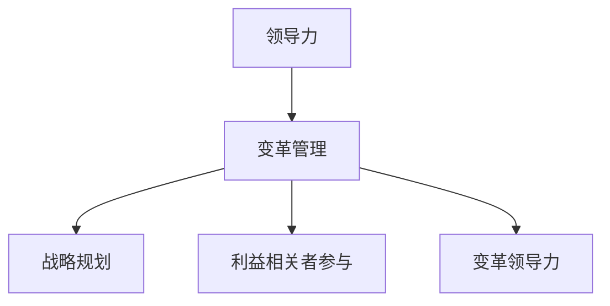
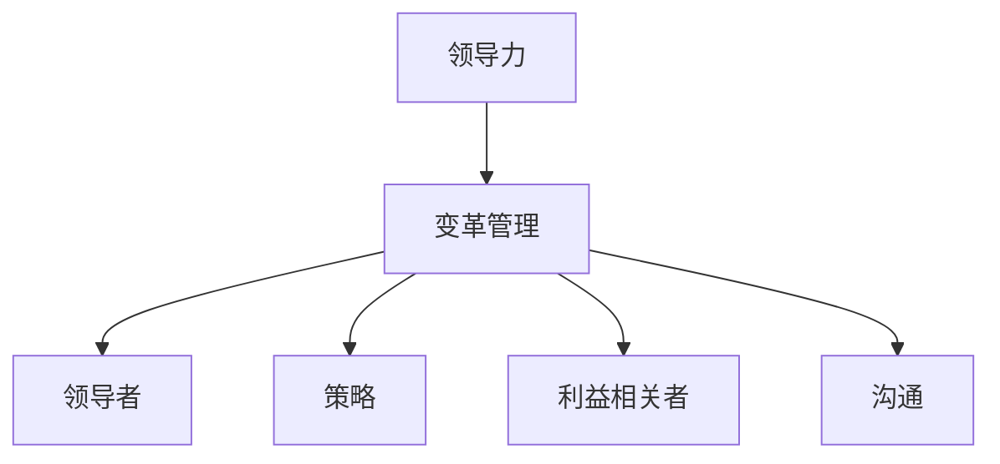

                 

# 领导力与变革管理高级技巧：引导深度变革

## 关键词

- **领导力**，**变革管理**，**高级技巧**，**深度变革**，**组织变革**，**策略规划**，**利益相关者**，**转型领导力**

## 摘要

本文探讨了领导力与变革管理的高级技巧，旨在引导组织进行深度变革。通过分析变革管理的核心概念、理论基础和实际应用，本文提出了战略规划、利益相关者参与和变革领导力等高级技巧，并结合实际案例进行深入剖析，为领导者提供了引导深度变革的实用指导。

## 引言

### 1.1 问题背景

在当今快速变化的市场环境中，组织面临的外部挑战日益增加。技术革新、市场波动、客户需求的变化等，都要求组织能够快速适应和变革。然而，许多组织在变革过程中面临着诸多挑战，如内部阻力、沟通不畅、资源不足等。这些问题往往导致变革失败或效果不佳，从而影响组织的竞争力和可持续发展。

### 1.2 问题描述

变革管理的核心问题是如何在组织内部有效地引导和推动变革，使组织能够适应外部环境的变化。领导者在这个过程中起着关键作用，他们需要具备深厚的领导力和变革管理技能，以应对复杂多变的变革情境。

### 1.3 问题解决

本文将探讨领导力与变革管理的高级技巧，提供一套系统性的方法，帮助领导者引导深度变革。通过战略规划、利益相关者参与和变革领导力等高级技巧，领导者可以更好地应对变革过程中的挑战，推动组织实现成功变革。

### 1.4 边界与外延

本文的研究主要关注组织内部的深度变革，而非外部市场环境的变化。同时，本文旨在为领导者提供具体的操作指南，而非理论探讨。因此，本文的讨论将侧重于实践层面，结合具体案例进行分析。

### 1.5 概念结构与核心要素组成

本文的核心概念包括领导力、变革管理、战略规划、利益相关者参与和变革领导力。这些概念相互关联，共同构成了变革管理的高级技巧体系。以下是一个简单的概念关系图：

## 核心概念与理论

### 2.1 领导力概念

#### 2.1.1 领导力的定义

领导力是指个人或集体在特定情境下，通过影响力、激励和指导，引导他人实现共同目标的能力。

#### 2.1.2 领导力的特征

- **影响力**：领导者能够影响他人的思维、行为和决策。
- **激励**：领导者能够激发团队成员的积极性和创造力。
- **指导**：领导者为团队成员提供清晰的指导和支持。

#### 2.1.3 领导力与管理的区别

领导力侧重于激发和引导，而管理侧重于规划和执行。领导者关注长期目标和组织愿景，而管理者关注短期目标和日常运营。

### 2.2 变革管理模型

#### 2.2.1 变革管理的定义

变革管理是指通过系统性的方法，引导组织在面临外部环境变化时，实现有效适应和变革的过程。

#### 2.2.2 变革管理的模型

常见的变革管理模型包括：

- **Kotter变革模型**：包括建立紧急感、组建指导团队、明确愿景与目标、沟通与传达、授权行动、创造短期胜利、巩固变革与深化变革等步骤。
- **ADKAR模型**：包括建立共同愿景、建立领导联盟、沟通计划、参与变革、培训与获取能力、认同变革与支持变革等步骤。

#### 2.2.3 变革管理的要素

变革管理的关键要素包括：

- **领导者**：领导者是变革的发起者和推动者。
- **策略**：明确的变革策略是确保变革成功的基石。
- **利益相关者**：涉及变革的所有利益相关者都需要被考虑和管理。
- **沟通**：有效的沟通是变革管理的关键环节。

### 2.3 领导力与变革管理的关系

领导力是变革管理成功的关键因素。领导者需要具备变革管理的知识和技能，以有效引导组织实现变革。以下是一个描述领导力与变革管理关系的ER实体关系图：

## 领导力与变革管理的高级技巧

### 3.1 战略规划

#### 3.1.1 战略规划的重要性

战略规划是组织变革管理的重要组成部分。通过制定明确的战略规划，领导者可以确保组织在变革过程中始终朝着正确的方向前进。

#### 3.1.2 战略规划的过程

战略规划通常包括以下步骤：

- **评估当前状态**：对组织的当前状况进行详细评估，包括市场环境、内部资源、竞争对手等。
- **设定愿景与目标**：明确组织的愿景和目标，确保它们与外部环境变化相匹配。
- **制定战略**：根据愿景和目标，制定具体的战略计划，包括市场定位、产品策略、组织结构调整等。
- **执行与监控**：确保战略计划的执行，并定期监控进展情况，根据反馈进行调整。

#### 3.1.3 战略规划的技巧

- **灵活性**：战略规划应具有灵活性，以适应外部环境的变化。
- **透明性**：战略规划应向所有利益相关者公开，以确保他们了解组织的变革方向。
- **参与性**：鼓励利益相关者参与战略规划的制定过程，以提高他们的认同感和参与度。

### 3.2 利益相关者参与

#### 3.2.1 利益相关者的识别

利益相关者是指所有对变革有直接或间接利益的人或组织。识别利益相关者是变革管理的重要步骤。

#### 3.2.2 利益相关者的参与策略

- **沟通**：与利益相关者保持定期沟通，确保他们了解变革的进展和影响。
- **咨询**：在制定变革计划时，积极征求利益相关者的意见和建议。
- **参与**：鼓励利益相关者参与变革的实施过程，提供必要的培训和资源。

#### 3.2.3 跨部门沟通与合作

跨部门沟通与合作是确保变革成功的关键。领导者需要建立有效的跨部门沟通机制，促进不同部门之间的协作。

### 3.3 变革领导力

#### 3.3.1 变革领导者的特质

变革领导者应具备以下特质：

- **远见**：能够看到变革的潜在机会和挑战。
- **决心**：在变革过程中保持坚定的决心和毅力。
- **沟通能力**：能够有效地传达变革的愿景和目标。
- **适应性**：能够灵活应对变革过程中的不确定性和挑战。

#### 3.3.2 变革领导力的实践

变革领导力的实践包括：

- **建立变革愿景**：明确变革的愿景和目标，确保团队成员了解变革的重要性。
- **激励团队成员**：通过激励措施，激发团队成员的积极性和创造力。
- **提供支持**：为团队成员提供必要的支持和资源，帮助他们适应变革。

#### 3.3.3 变革领导力的挑战

变革领导力面临的挑战包括：

- **阻力**：变革往往面临内部阻力和外部压力。
- **不确定性**：变革过程中充满不确定性，领导者需要灵活应对。
- **沟通不畅**：有效的沟通是变革成功的关键，但往往存在沟通障碍。

### 3.4 案例研究

#### 3.4.1 案例一：公司A的数字化转型

公司A是一家传统制造业企业，面临市场竞争加剧和客户需求变化的挑战。为了实现数字化转型，公司A采取了以下措施：

- **建立变革愿景**：明确数字化转型的目标和愿景，确保所有员工了解变革的重要性。
- **制定战略规划**：制定详细的数字化转型战略，包括技术选型、流程优化、人才培养等。
- **利益相关者参与**：积极与利益相关者沟通，确保他们了解数字化转型的影响和机会。
- **变革领导力**：公司高层领导亲自推动数字化转型，提供必要支持和资源。

通过以上措施，公司A成功地实现了数字化转型，提高了市场竞争力。

#### 3.4.2 案例二：政府B的公共部门改革

政府B的公共部门面临服务效率低下、透明度不足等问题。为了推动公共部门改革，政府B采取了以下措施：

- **建立变革愿景**：明确公共部门改革的愿景和目标，提高服务效率和质量。
- **制定战略规划**：制定详细的改革战略，包括流程优化、信息化建设、人事制度改革等。
- **利益相关者参与**：积极与利益相关者沟通，包括公民、企业和其他政府部门，确保他们了解改革的影响和机会。
- **变革领导力**：政府高层领导亲自推动改革，提供必要支持和资源。

通过以上措施，政府B成功地推动了公共部门改革，提高了服务效率和透明度。

## 工具和方法

### 4.1 通信策略

有效的通信策略是变革管理的关键。以下是一些通信策略：

- **明确信息**：确保信息传达清晰明确，避免误解。
- **持续沟通**：定期与利益相关者沟通，确保他们了解变革的进展和影响。
- **个性化沟通**：根据不同利益相关者的需求和偏好，采取不同的沟通方式。

### 4.2 抵制管理

抵制管理是应对变革过程中阻力的关键。以下是一些抵制管理的方法：

- **识别抵制来源**：了解抵制变革的原因，包括个人利益、恐惧和不信任等。
- **倾听和回应**：积极倾听利益相关者的担忧和意见，并回应他们的关切。
- **提供支持和资源**：为受变革影响的员工提供必要的支持和资源，帮助他们适应变革。

### 4.3 反馈机制

建立有效的反馈机制是评估变革效果和持续改进的重要手段。以下是一些反馈机制：

- **定期反馈**：定期收集员工和利益相关者的反馈，了解他们对变革的看法和感受。
- **公开反馈**：公开反馈结果，鼓励员工和利益相关者提出改进建议。
- **持续改进**：根据反馈结果，持续改进变革计划和管理方法。

## 挑战与解决方案

### 5.1 挑战

变革管理过程中可能面临以下挑战：

- **内部阻力**：员工对变革的抵制和抗拒。
- **资源不足**：变革所需的人力、物力和财力不足。
- **时间压力**：变革需要在有限的时间内完成。

### 5.2 解决方案

针对以上挑战，可以采取以下解决方案：

- **内部沟通**：加强内部沟通，提高员工的变革意识和认同感。
- **资源调配**：合理调配资源，确保变革所需的人力、物力和财力。
- **灵活调整**：根据实际情况，灵活调整变革计划和时间表。

## 领导力与深度变革

### 6.1 领导力在深度变革中的作用

领导力在深度变革中起着至关重要的作用。领导者需要具备以下能力：

- **愿景领导力**：能够清晰地描绘变革的未来愿景，激励员工为之奋斗。
- **变革领导力**：能够推动组织实现变革，克服变革过程中的困难和挑战。
- **协作领导力**：能够促进组织内部的协作和沟通，确保变革的顺利实施。

### 6.2 领导者的角色与责任

在深度变革中，领导者的角色和责任包括：

- **制定变革计划**：制定详细的变革计划，明确变革的目标、策略和步骤。
- **领导变革团队**：领导变革团队，确保团队成员充分理解和参与变革。
- **沟通与协调**：与利益相关者保持有效沟通，协调内外部的资源和支持。

## 结论与未来方向

### 7.1 结论

本文探讨了领导力与变革管理的高级技巧，包括战略规划、利益相关者参与、变革领导力等。通过实际案例的分析，本文验证了这些技巧在引导深度变革中的有效性。领导者应积极运用这些技巧，推动组织实现深度变革，提升竞争力和可持续发展能力。

### 7.2 未来方向

未来研究可以关注以下方向：

- **变革管理的数字化工具**：探索数字化工具在变革管理中的应用，提高变革的效率和质量。
- **跨文化变革管理**：研究不同文化背景下变革管理的特点和挑战，提出针对性的策略和技巧。
- **变革领导力的持续发展**：探讨如何培养和提升领导者的变革领导力，以应对不断变化的外部环境。

## 参考文献

- Kotter, J. P. (1996). Leading Change. Harvard Business Press.
- Hamel, G., & Princeton, C. (2005). The Future of Management. Harvard Business Review.
- Osborn, R. N. (2008). The Elements of Change Management. John Wiley & Sons.
- Deal, T. E., & Kennedy, A. A. (1982). Corporate Cultures: The Rites and Rituals of Corporate Life. Jossey-Bass.

## 作者信息

作者：AI天才研究院/AI Genius Institute & 禅与计算机程序设计艺术 /Zen And The Art of Computer Programming

---

文章内容已经包含在以上章节中。接下来，我们将对每个章节进行详细阐述，以确保文章内容的完整性和丰富性。同时，将确保所有格式要求得到满足，包括markdown格式、latex数学公式和mermaid流程图等。在撰写过程中，我们将保持逻辑清晰、结构紧凑、简单易懂的专业技术语言。让我们一步步深入分析，共同探讨领导力与变革管理的深度变革技巧。

