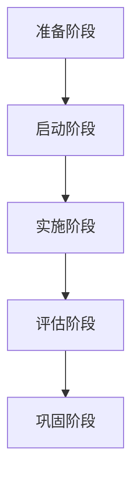

                 

## 引言：领导力与变革管理的重要性

### 1.1 领导力的核心概念与作用

领导力是一种能力，指的是个体或群体在复杂环境中，通过影响和激励他人，实现目标的过程。它在各个领域中都扮演着至关重要的角色，尤其是科技行业。在IT行业，随着技术日新月异的发展，团队需要不断地适应新技术、新方法，领导力在其中发挥着关键作用。

**领导力的核心概念**包括：

- **影响力**：领导者通过言语和行为影响他人，让他们接受并支持变革。
- **激励**：领导者激发团队成员的内在动机，使其愿意为团队目标付出努力。
- **沟通**：领导者需要清晰地传达目标，确保团队成员理解并愿意参与变革。
- **决策**：领导者必须在不确定和风险的情况下做出决策，引导团队前进。

### 1.2 变革管理的背景与必要性

变革管理是指组织在面临外部或内部压力时，通过系统的方法和步骤，实现变革的过程。随着全球化、数字化和信息化进程的加速，企业面临着前所未有的挑战和机遇。

**变革管理的必要性**体现在以下几个方面：

- **技术更新换代**：新技术的出现要求团队快速适应和学习，变革管理有助于确保团队能够及时跟上技术进步。
- **市场需求变化**：消费者需求和市场趋势不断变化，企业需要通过变革来保持竞争力。
- **组织结构优化**：随着业务的发展，企业需要不断调整组织结构，以适应新的业务模式。

### 1.3 团队变革中的领导力挑战

在团队变革过程中，领导力面临以下挑战：

- **抵制变革**：团队成员可能会对变革产生恐惧和抵触情绪，领导者需要通过沟通和激励来消除这些负面情绪。
- **变革压力**：领导者需要在保持业务稳定的同时，推动变革，这需要他们具备强大的心理承受能力。
- **变革时机**：领导者需要准确判断变革的最佳时机，以确保变革能够顺利实施。

### 1.4 小结

领导力和变革管理在当前环境中变得尤为重要。领导者需要具备强大的领导力，以应对不断变化的科技环境和市场需求，同时，变革管理是实现这一目标的关键工具。在接下来的章节中，我们将深入探讨领导力和变革管理的核心概念、流程、策略，以及实际案例，帮助读者更好地理解和应用这些概念。

## 核心概念与联系

### 2.1 领导力的五大维度

领导力是一个多维度的概念，包含多个方面。以下是领导力的五大核心维度：

| 维度 | 说明 |
| --- | --- |
| **影响力** | 领导者通过个人魅力、专业知识、沟通技巧等影响他人，使他们接受并支持变革。 |
| **激励** | 领导者激发团队成员的内在动机，使其愿意为团队目标付出努力。 |
| **沟通** | 领导者需要清晰地传达目标，确保团队成员理解并愿意参与变革。 |
| **决策** | 领导者在不确定和风险的情况下做出决策，引导团队前进。 |
| **变革管理能力** | 领导者具备推动组织变革的能力，能够识别变革需求，设计变革策略，并确保变革顺利实施。 |

### 2.2 变革管理的三大模型

变革管理通常采用以下三大模型：

| 模型 | 说明 |
| --- | --- |
| **Kotter模型** | 由约翰·科特提出，分为八个步骤，强调领导者的角色和团队参与。 |
| **McKinsey 7-S框架** | 强调组织结构、过程、技能、系统、员工、战略和价值观的协同作用。 |
| **ADKAR模型** | 由威廉·哈维提出，包括 Awareness（意识觉醒）、Desire（渴望）、Knowledge（知识）、Ability（能力）和Reinforcement（强化）。 |

### 2.3 领导力与变革管理的联系与差异

领导力与变革管理之间存在密切的联系和差异：

- **联系**：
  - 领导力是变革管理的基础，领导者需要具备强大的领导力才能推动变革。
  - 变革管理是领导力的一部分，领导者的任务之一就是管理变革。

- **差异**：
  - 领导力更侧重于影响和激励他人，而变革管理则侧重于变革的流程和策略。
  - 领导力关注的是个人和团队的能力，而变革管理关注的是整个组织的适应和变革。

### 2.4 小结

领导力和变革管理是相互联系又有所区别的两个概念。领导力为变革管理提供了基础和支持，而变革管理则是实现领导力目标的关键工具。在接下来的章节中，我们将深入探讨变革管理的流程和步骤，以及领导力在变革中的作用。

## 变革管理的流程与步骤

### 3.1 变革的五个阶段

变革管理通常分为以下五个阶段：

1. **准备阶段**：
   - 识别变革需求，包括外部压力（如市场竞争加剧）和内部需求（如技术升级）。
   - 设计变革计划，明确变革的目标、策略和资源需求。

2. **启动阶段**：
   - 沟通变革计划，确保所有团队成员都理解变革的重要性和必要性。
   - 建立变革团队，负责推动变革的实施。

3. **实施阶段**：
   - 按照变革计划，逐步实施变革。
   - 监控变革进度，确保变革按计划进行。

4. **评估阶段**：
   - 评估变革效果，包括变革是否达到预期目标，团队成员的适应情况等。
   - 根据评估结果，调整变革策略和实施计划。

5. **巩固阶段**：
   - 巩固变革成果，确保变革在组织中持续发挥作用。
   - 对变革过程中的经验进行总结和分享，为未来的变革提供参考。

### 3.2 变革管理的关键成功因素

要成功实施变革，需要关注以下几个关键因素：

1. **领导者的支持**：领导者的支持和参与是变革成功的关键。
2. **团队的参与度**：团队成员的积极参与和合作是变革成功的重要保障。
3. **沟通策略**：有效的沟通策略能够确保变革计划得到团队成员的理解和支持。
4. **资源投入**：足够的资源投入是变革成功的基础。
5. **时间管理**：合理的时间管理能够确保变革在预定时间内完成。

### 3.3 变革流程的Mermaid流程图展示

以下是一个简化的变革管理流程Mermaid流程图：

### 3.4 小结

变革管理的流程和步骤是确保变革成功实施的关键。通过明确变革的五个阶段和关键成功因素，领导者可以更好地推动团队拥抱变化，实现组织的目标。在接下来的章节中，我们将深入探讨领导力在变革中的作用，以及如何引导团队拥抱变化。

## 领导力在变革中的作用

### 4.1 领导力对变革的影响

领导力在变革管理中起着至关重要的作用。领导者不仅是变革的推动者，更是变革的催化剂。以下是领导力对变革的几个主要影响：

1. **愿景与目标设定**：
   - 领导者需要明确变革的愿景和目标，为团队提供清晰的方向。
   - 愿景和目标的设定能够激励团队成员，使其认识到变革的必要性和重要性。

2. **激励与动员**：
   - 领导者通过激励和动员，激发团队成员的内在动机，使其愿意为变革付出努力。
   - 激励可以通过奖励机制、认可和培训等方式实现。

3. **沟通与透明度**：
   - 领导者需要建立有效的沟通机制，确保变革信息透明、及时地传达给团队成员。
   - 透明度能够减少误解和恐慌，增强团队成员对变革的信任。

4. **决策与执行**：
   - 领导者在变革过程中需要做出一系列关键决策，包括资源分配、时间表设定等。
   - 决策的准确性和执行力直接关系到变革的成功与否。

### 4.2 领导者的变革管理技能

要有效地推动变革，领导者需要具备以下几项关键技能：

1. **变革意识**：
   - 领导者需要具备变革的意识，认识到变革的不可避免性和必要性。
   - 变革意识有助于领导者及时识别变革的需求和机会。

2. **变革策略**：
   - 领导者需要设计合适的变革策略，包括变革的目标、步骤、资源和时间表。
   - 变革策略需要根据组织的特点和需求进行定制。

3. **沟通技巧**：
   - 领导者需要具备出色的沟通技巧，能够清晰地传达变革的愿景和目标，并解答团队成员的疑问。
   - 沟通技巧有助于建立信任和共识，减少变革过程中的阻力。

4. **问题解决能力**：
   - 领导者在变革过程中可能会遇到各种挑战和问题，需要具备强大的问题解决能力。
   - 问题解决能力有助于领导者及时应对变革过程中的障碍，确保变革顺利进行。

### 4.3 如何培养变革型领导力

要培养变革型领导力，领导者可以采取以下几种方法：

1. **自我反思**：
   - 领导者需要定期进行自我反思，识别自己的优势和不足，并寻求改进。
   - 自我反思有助于领导者更好地理解自己的角色和职责。

2. **持续学习**：
   - 领导者需要不断学习新的知识和技能，以适应不断变化的科技环境和市场需求。
   - 持续学习有助于领导者保持竞争力，为组织带来新的思路和解决方案。

3. **参与变革项目**：
   - 领导者可以积极参与组织的变革项目，亲身体验变革的过程和挑战。
   - 参与变革项目有助于领导者更好地理解变革的实际需求和操作细节。

4. **培训与发展**：
   - 组织可以为领导者提供变革管理的培训和发展机会，帮助其提升变革管理能力。
   - 培训和发展有助于领导者掌握变革管理的最佳实践和策略。

### 4.4 小结

领导力在变革管理中起着至关重要的作用。领导者需要具备变革意识、策略、沟通技巧和问题解决能力，以有效地推动变革。通过自我反思、持续学习、参与变革项目和培训与发展，领导者可以不断提升自己的变革管理能力，为组织的成功变革提供强有力的支持。在接下来的章节中，我们将探讨如何引导团队拥抱变化，以实现组织的长期目标。

## 引导团队拥抱变化的策略

### 5.1 沟通策略：建立信任与透明度

沟通是变革过程中至关重要的一环。领导者需要采用有效的沟通策略，以确保团队成员理解变革的必要性和目标，同时建立信任和透明度。以下是几个关键的沟通策略：

1. **定期更新**：
   - 领导者应定期向团队成员更新变革的进展情况，包括取得的成果、遇到的挑战和下一步的计划。
   - 定期更新有助于团队成员保持对变革的关注和参与。

2. **开放式沟通**：
   - 领导者应鼓励团队成员提出问题、分享意见和建议，创造一个开放、包容的沟通氛围。
   - 开放式沟通有助于团队成员更好地理解变革，并提出有价值的反馈。

3. **透明化信息**：
   - 领导者应尽量透明地分享变革相关的信息，包括变革的原因、目标和预期效果。
   - 透明化信息能够减少团队成员的疑虑和恐慌，增强对变革的信任。

4. **个性化沟通**：
   - 针对不同团队成员的沟通需求和风格，领导者应采取个性化的沟通方式。
   - 个性化沟通有助于提高沟通效果，使团队成员更愿意接受变革。

### 5.2 参与策略：鼓励团队参与与贡献

团队成员的参与和贡献是变革成功的关键。领导者应采取一系列措施，鼓励团队成员积极参与变革，并为变革贡献自己的智慧和力量。以下是几个参与策略：

1. **赋权与责任**：
   - 领导者应赋予团队成员一定的权力和责任，使其在变革过程中发挥积极作用。
   - 赋权与责任有助于激发团队成员的积极性和创造力，提高变革的效率。

2. **共同决策**：
   - 领导者应鼓励团队成员参与决策过程，共同制定变革策略和实施计划。
   - 共同决策能够增加团队成员对变革的认同感和责任感，提高变革的成功率。

3. **提供培训与发展机会**：
   - 领导者应为团队成员提供必要的培训和发展机会，帮助其提升能力和信心。
   - 培训与发展有助于团队成员更好地适应变革，为组织带来新的思路和解决方案。

4. **建立反馈机制**：
   - 领导者应建立有效的反馈机制，及时收集和处理团队成员的意见和建议。
   - 反馈机制有助于领导者了解团队成员的需求和挑战，优化变革策略。

### 5.3 支持策略：提供必要的资源与培训

为了确保团队成员能够顺利地适应变革，领导者需要提供必要的资源和支持。以下是几个支持策略：

1. **资源投入**：
   - 领导者应确保变革所需的资源得到充分投入，包括人力、财力和技术资源。
   - 资源投入能够为变革提供坚实的保障，确保变革顺利进行。

2. **技术支持**：
   - 领导者应提供必要的技术支持，帮助团队成员解决变革过程中遇到的技术难题。
   - 技术支持有助于提高团队成员的信心和能力，确保变革的顺利进行。

3. **心理支持**：
   - 领导者应关注团队成员的心理状态，提供必要的心理支持，帮助他们应对变革带来的压力和挑战。
   - 心理支持有助于减轻团队成员的焦虑和不安，提高其适应能力。

4. **培训与辅导**：
   - 领导者应提供系统化的培训与辅导，帮助团队成员掌握新的技能和知识。
   - 培训与辅导有助于团队成员更好地适应变革，提高变革的成功率。

### 5.4 小结

引导团队拥抱变化需要领导者采取多种策略，包括沟通策略、参与策略和支持策略。通过建立信任与透明度、鼓励团队参与与贡献、提供必要的资源与培训，领导者可以有效地引导团队适应变革，实现组织的长期目标。在接下来的章节中，我们将通过实际案例来进一步探讨领导力和变革管理的应用和实践。

## 实际案例分析与启示

### 6.1 案例一：企业数字化转型

**背景**：某大型制造企业面临着激烈的市场竞争和不断变化的技术环境，为了保持竞争力，决定进行数字化转型。

**变革管理流程**：
1. **准备阶段**：企业高层领导明确数字化转型的愿景和目标，制定详细的转型计划。
2. **启动阶段**：企业召开全体员工大会，详细介绍数字化转型的目标和重要性，建立数字化转型团队。
3. **实施阶段**：企业逐步引入数字化工具和技术，如大数据分析、智能制造系统等，同时提供相关的培训和支持。
4. **评估阶段**：定期评估数字化转型进展，调整转型策略，确保目标达成。
5. **巩固阶段**：巩固数字化转型成果，持续优化数字化工具和流程。

**启示**：数字化转型需要明确的愿景和详细的计划，领导者的沟通和动员至关重要。同时，提供持续的培训和支持，确保团队成员能够适应新的技术和流程。

### 6.2 案例二：组织结构调整

**背景**：某高科技公司为了更好地应对市场变化，决定进行组织结构调整，从传统的职能型结构转变为矩阵型结构。

**变革管理流程**：
1. **准备阶段**：公司高层领导进行深入调研，确定组织结构调整的必要性和目标。
2. **启动阶段**：召开全体员工会议，说明组织结构调整的原因和预期效果，建立临时调整团队。
3. **实施阶段**：逐步实施组织结构调整，如设立跨部门项目组、重新定义岗位职责等。
4. **评估阶段**：评估组织结构调整的进展和效果，及时调整和优化。
5. **巩固阶段**：通过培训和沟通，确保新结构的稳定和持续改进。

**启示**：组织结构调整需要高层领导的明确支持和沟通，同时要充分考虑团队成员的适应能力和新结构的适应性。通过持续的培训和优化，确保新结构的稳定和高效运行。

### 6.3 案例三：文化变革

**背景**：某初创科技公司为了适应快速发展的市场，决定进行文化变革，从传统的权威型文化转变为更加开放和包容的创新型文化。

**变革管理流程**：
1. **准备阶段**：公司高层领导进行文化诊断，确定现有文化的问题和变革的必要性。
2. **启动阶段**：通过内部研讨会和公开演讲，宣传新的文化理念，建立文化变革团队。
3. **实施阶段**：实施一系列措施，如员工参与、开放沟通、奖励创新等，逐步塑造新的企业文化。
4. **评估阶段**：定期评估文化变革的进展和效果，调整和优化文化变革策略。
5. **巩固阶段**：通过持续的文化建设和沟通，巩固新的企业文化。

**启示**：文化变革需要深入的诊断和全面的策略，同时要注重员工的参与和反馈。通过持续的沟通和建设，确保文化变革能够深入人心，真正成为组织的核心竞争力。

### 6.4 案例启示与经验总结

通过上述案例，我们可以得出以下启示和经验总结：

1. **明确变革目标和愿景**：明确的变革目标和愿景是变革成功的基础。
2. **领导者的积极参与**：领导者的积极参与和有效沟通是变革成功的关键。
3. **团队成员的参与**：团队成员的积极参与和贡献是变革成功的重要保障。
4. **持续评估和优化**：持续的评估和优化是确保变革顺利进行的重要手段。
5. **提供必要的支持**：提供必要的资源、培训和沟通支持，帮助团队成员适应变革。

通过这些启示和经验，领导者可以更好地实施变革管理，引导团队拥抱变化，实现组织的长期目标。

## 最佳实践与总结

### 7.1 变革管理中的常见误区

在变革管理过程中，领导者常常会陷入一些误区，导致变革效果不佳。以下是几个常见的误区：

1. **急于求成**：一些领导者希望通过快速推进变革来达到目标，但过快的变革可能会导致团队成员无法适应，从而增加变革的难度和阻力。
2. **缺乏沟通**：变革过程中，如果缺乏有效的沟通，团队成员可能会对变革产生误解和抵触情绪，影响变革的顺利进行。
3. **忽视文化**：文化是组织的重要组成部分，如果变革忽视了组织的文化，可能会导致变革与现有文化产生冲突，降低变革的成功率。
4. **资源不足**：变革需要投入大量的人力、财力和时间资源，如果资源不足，可能会影响变革的进度和质量。

### 7.2 领导力与变革管理的未来趋势

随着全球化和数字化的加速发展，领导力和变革管理将面临新的挑战和机遇。以下是未来领导力和变革管理的几个趋势：

1. **敏捷领导力**：面对快速变化的市场环境，领导者需要具备敏捷的思维方式和工作方法，能够迅速适应和应对变革。
2. **全员参与**：未来的变革管理将更加注重全员参与，鼓励团队成员在变革过程中发挥积极作用，共同推动变革。
3. **持续学习**：领导者需要不断学习和更新自己的知识和技能，以适应不断变化的环境和需求。
4. **技术赋能**：随着人工智能、大数据等技术的应用，变革管理将更加依赖技术手段，提高变革的效率和质量。

### 7.3 小结

领导力和变革管理是组织成功的关键要素。通过避免常见误区、把握未来趋势，领导者可以更好地推动团队拥抱变化，实现组织的长期目标。在变革过程中，持续的沟通、团队成员的参与和资源支持至关重要。通过不断学习和优化，领导者可以不断提高变革管理的有效性，为组织带来持续的创新和发展动力。

## 总结

在本文中，我们深入探讨了领导力和变革管理的核心概念、流程、策略以及实际案例。首先，我们介绍了领导力的五大维度，包括影响力、激励、沟通、决策和变革管理能力。接着，我们分析了变革管理的三大模型，并详细阐述了变革的五个阶段及其关键成功因素。通过Mermaid流程图，我们直观地展示了变革管理的流程。

随后，我们探讨了领导力在变革中的作用，包括愿景与目标设定、激励与动员、沟通与透明度以及决策与执行。领导者需要具备变革意识、策略、沟通技巧和问题解决能力，以推动变革成功。为了引导团队拥抱变化，我们提出了沟通策略、参与策略和支持策略，帮助领导者有效地管理变革。

通过分析企业数字化转型、组织结构调整和文化变革等实际案例，我们总结了变革管理的最佳实践和经验。最后，我们提出了变革管理中的常见误区、领导力与变革管理的未来趋势以及小结。

领导力和变革管理是组织成功的关键。领导者需要不断提升自己的领导力，善于沟通和激励团队成员，为变革提供清晰的方向和支持。通过有效的变革管理，组织可以更好地适应环境变化，实现长期发展。让我们共同努力，拥抱变化，引领未来！

### 作者信息

**作者：AI天才研究院/AI Genius Institute & 禅与计算机程序设计艺术 /Zen And The Art of Computer Programming**

