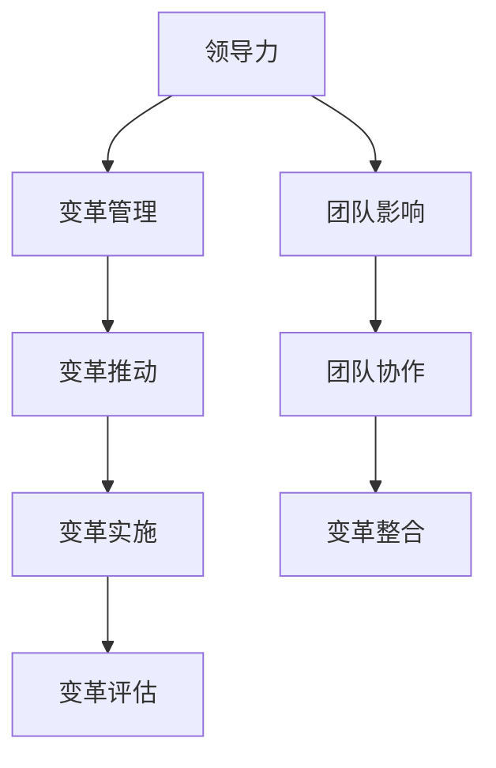

                 

### 领导力与变革管理的核心概念及联系

#### 背景介绍

在当今快速变化的时代，企业面临着前所未有的挑战和机遇。领导力与变革管理成为企业成功的关键因素。领导力是指领导者影响、激励和引导团队成员的能力，而变革管理则是指企业为了适应外部环境的变化而进行的系统性变革过程。这两个概念虽然有所不同，但在实际操作中往往相互交织、共同作用。

首先，领导力（Leadership）是一个广泛而多层次的概念。传统领导力理论主要强调领导者的权威、决策能力和控制力，而当代领导力理论则更注重领导者与团队成员之间的互动和合作。领导力不仅涉及个人的能力，还包括领导者的价值观、信念和行为。

变革管理（Change Management）是指企业在面对外部或内部环境变化时，通过一系列系统性措施来确保变革顺利进行的过程。变革管理涉及多个阶段，包括规划、沟通、实施和评估。其核心目的是减少变革对员工的负面影响，确保变革目标的有效实现。

#### 核心概念与联系

**领导力的核心概念：**

1. **影响力**：领导者通过情感、思想或行为影响团队成员的能力。
2. **激励**：领导者通过激励措施激发团队成员的工作热情和积极性。
3. **指导**：领导者通过指导和辅导帮助团队成员提高工作能力和绩效。

**变革管理的核心概念：**

1. **规划**：明确变革的目标、时间和资源分配。
2. **沟通**：确保团队成员对变革有清晰的理解和认同。
3. **实施**：通过具体的行动和措施推动变革的落实。
4. **评估**：对变革过程和结果进行评估，以持续优化变革效果。

领导力与变革管理的联系主要体现在以下几个方面：

1. **领导力在变革管理中的作用**：领导者是变革的推动者和领导者，他们的行为和决策直接影响变革的成败。
2. **变革管理中领导力的要求**：变革管理要求领导者具备更高的沟通能力、团队协作能力和应对不确定性的能力。
3. **领导力与变革管理的整合**：在实际操作中，领导力与变革管理往往是相互促进、共同作用的。领导者的领导力可以推动变革的顺利进行，而成功的变革管理也可以增强领导者的领导力。

#### 概念属性特征对比表格

| 概念     | 特征                     | 关联性                 |
|----------|--------------------------|------------------------|
| 领导力   | 个人能力、价值观、行为   | 推动变革、影响团队    |
| 变革管理 | 规划、沟通、实施、评估   | 适应变化、优化管理    |
| 作用     | 促进变革、确保实施       | 推动变革、应对挑战    |
| 要求     | 沟通能力、协作能力       | 确保变革成功、提高领导力 |

#### ER实体关系图架构

```mermaid
erDiagram
  Leader ||--|{ ChangeManager } Change : 领导者推动变革
  ChangeManager ||--|{ Project } Project : 变革管理涉及项目
  Leader ||--|{ TeamMember } Team : 领导者管理团队
```

#### 算法原理讲解

为了更好地理解领导力与变革管理的核心概念，我们可以使用一个简单的流程图来表示其基本原理：



在这个流程图中，领导力通过影响团队、推动变革、实施变革和评估变革，最终实现变革的整合。具体的流程包括：

1. **团队影响**：领导者通过情感、思想和行为影响团队成员，激发他们的工作热情和积极性。
2. **变革推动**：领导者根据外部环境和内部需求，制定变革计划并推动变革的进行。
3. **变革实施**：团队成员在领导者的指导下，按照变革计划的具体措施执行任务。
4. **变革评估**：对变革过程和结果进行评估，以确定变革目标是否实现，并持续优化变革效果。

#### 数学模型和公式

在领导力与变革管理中，我们可以使用以下数学模型和公式来描述其基本原理：

$$
L = f(T, E, M)
$$

其中，$L$ 表示领导力，$T$ 表示团队特性，$E$ 表示外部环境，$M$ 表示变革管理。这个公式表示领导力是团队特性、外部环境和变革管理的函数。

此外，我们还可以使用以下公式来描述变革管理的流程：

$$
C = P + I + A
$$

其中，$C$ 表示变革（Change），$P$ 表示规划（Plan），$I$ 表示实施（Implement），$A$ 表示评估（Assess）。这个公式表示变革管理包括规划、实施和评估三个阶段。

#### 举例说明

为了更直观地理解领导力与变革管理的核心概念，我们可以通过以下实例进行说明：

**案例：一家公司决定进行数字化转型**

1. **领导力**：公司CEO通过召开全体员工大会，强调数字化转型的重要性，并制定详细的变革计划。他通过个人魅力和影响力，激发员工的工作热情，推动变革的进行。

2. **变革管理**：公司设立了专门的变革管理团队，负责规划、实施和评估数字化转型。他们制定了详细的变革计划，包括培训员工、更新技术设备和优化业务流程。

3. **团队影响**：领导者在变革过程中，通过激励措施和沟通，确保员工对变革有清晰的理解和认同。他们鼓励员工积极参与变革，提高团队协作效率。

4. **变革实施**：团队成员按照变革计划，逐步完成培训、技术更新和业务优化。他们克服了各种困难和挑战，确保变革目标逐步实现。

5. **变革评估**：变革管理团队对数字化转型过程和结果进行评估，发现了一些问题和不足之处。他们根据评估结果，制定了优化方案，以进一步提升变革效果。

通过这个案例，我们可以看到领导力与变革管理在实际操作中的紧密联系。领导者的领导力推动了变革的进行，而成功的变革管理又增强了领导者的领导力。这种相互促进、共同作用的关系，使得企业能够更好地适应外部环境的变化，实现可持续发展。

### 小结

本文对领导力与变革管理的核心概念进行了详细分析，并通过对比表格、ER实体关系图、流程图、数学模型和公式等不同方式，深入阐述了这两个概念的联系和作用。在实际操作中，领导力与变革管理是相互促进、共同作用的，只有充分发挥领导者的领导力，才能确保变革管理的成功。通过本文的讲解，希望能够帮助读者更好地理解这两个关键概念，并将其应用于实际工作中。

### 注意事项与拓展阅读

在实施领导力与变革管理时，需要注意以下几个方面：

1. **充分沟通**：确保团队成员对变革有清晰的理解和认同，减少变革阻力。
2. **持续激励**：通过激励措施激发团队成员的工作热情和积极性，推动变革的进行。
3. **适应性强**：领导者需要具备良好的适应能力，能够迅速应对外部环境的变化。
4. **评估与优化**：对变革过程和结果进行持续评估，根据评估结果进行优化，确保变革目标的有效实现。

拓展阅读方面，可以参考以下书籍和论文：

- 《领导力：影响与激励的艺术》
- 《变革管理：实践与案例》
- 《领导力与组织行为》
- 相关学术论文和研究报告

通过这些资料，读者可以进一步了解领导力与变革管理的理论和实践，提升自身的领导力和变革管理能力。

