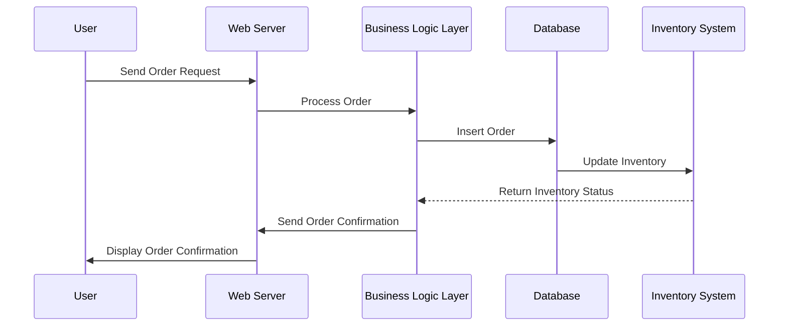
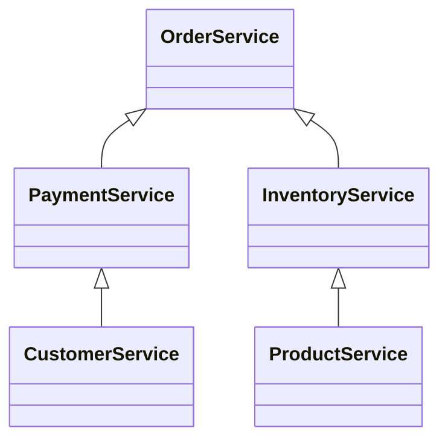
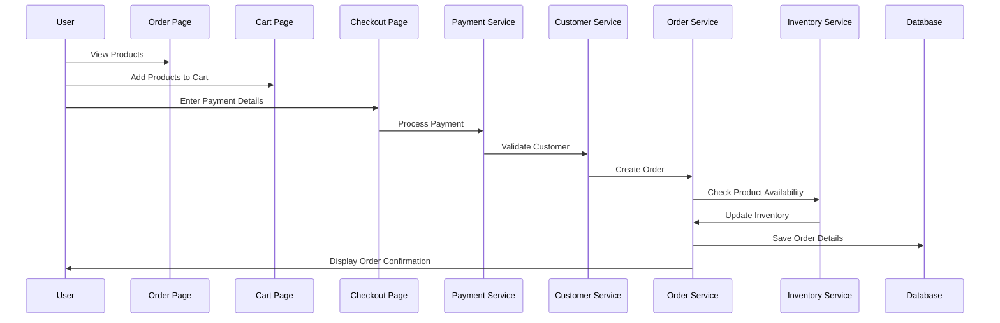

                 


## 领导力与变革管理：引领团队前进

### 关键词：领导力、变革管理、团队发展、实践应用、案例分析

> 摘要：本文旨在探讨领导力与变革管理在IT领域的重要性，以及如何通过有效的领导力和变革管理策略，引领团队实现持续发展和创新。文章将结合实际案例，分析领导力与变革管理的核心概念、实践方法，并提供一些建议，帮助读者提升团队领导力和变革管理能力。

### 引言

在快速变化的IT行业中，领导力和变革管理成为了团队成功的关键因素。领导力不仅是管理者的个人能力，更是激发团队潜能、实现共同目标的关键。变革管理则是在面对市场和技术变革时，引导团队适应新环境、实现转型的重要手段。本文将从以下方面展开讨论：

1. 领导力的理论基础与关键要素
2. 变革管理的原则与实践方法
3. 领导力与变革管理的融合与应用
4. 案例分析：领导力与变革管理的成功实践
5. 总结与展望

### 第一部分：领导力的理论基础与关键要素

#### 1.1 领导力的基本概念

领导力是指领导者通过影响和激励他人，实现共同目标的能力。它不仅包括领导者的个人素质，还涉及到领导者与团队成员之间的互动。

#### 1.2 领导风格与行为

领导风格是领导者处理团队事务的方式。常见的领导风格包括权威型、民主型、参与型和教练型。每种风格都有其适用的情境，领导者需要根据实际情况选择合适的领导风格。

#### 1.3 领导力的发展与培养

领导力并非与生俱来，而是可以通过后天培养和锻炼得到提升。领导者需要不断学习、实践和反思，以提高自身领导能力。

### 第二部分：变革管理的原则与实践方法

#### 2.1 变革管理的概述

变革管理是在组织面临外部或内部挑战时，引导团队实现变革的过程。成功的变革管理需要遵循一定的原则和方法。

#### 2.2 变革管理的理论

变革管理理论主要包括引导模型、过程模型和系统模型。这些模型为变革管理提供了理论支持和实践指导。

#### 2.3 变革管理的实践

变革管理的实践包括以下步骤：诊断问题、制定计划、沟通与宣传、培训与支持、监控与调整。

### 第三部分：领导力与变革管理的融合与应用

#### 3.1 领导力在变革管理中的作用

领导力在变革管理中起着核心作用。领导者需要通过影响和激励团队成员，推动变革的顺利进行。

#### 3.2 变革管理对领导力的影响

变革管理对领导力提出了新的挑战。领导者需要在变革过程中不断调整自己的领导风格和策略，以适应新的环境和需求。

### 第四部分：案例分析：领导力与变革管理的成功实践

#### 4.1 案例背景

本文选取了一家快速发展的IT公司作为案例，该公司在面临技术升级和市场竞争压力时，通过有效的领导力和变革管理策略，成功实现了转型升级。

#### 4.2 领导力与变革管理的实施

在该案例中，领导者通过以下方式实施变革管理：

1. 明确愿景和目标
2. 建立高效的沟通机制
3. 提供培训和支持
4. 激励和激励团队成员

#### 4.3 案例分析与启示

该案例的成功实践为其他组织提供了宝贵的经验和启示。领导者需要具备前瞻性、决策力和执行力，同时要关注团队成员的需求和成长。

### 第五部分：总结与展望

本文通过对领导力和变革管理的深入探讨，强调了其在团队发展中的重要性。有效的领导力和变革管理策略，可以帮助团队克服挑战，实现持续发展和创新。

### 结语

作者：AI天才研究院/AI Genius Institute & 禅与计算机程序设计艺术 /Zen And The Art of Computer Programming

本文旨在为IT领域的领导者提供有益的参考和启示。通过不断学习和实践，领导者可以提升自身的领导力和变革管理能力，引领团队实现更大的成功。

----------------------------------------------------------------

## 第一部分：领导力的理论基础与关键要素

### 1.1 领导力的基本概念

领导力是一种复杂且多维的能力，它涉及领导者如何影响和激励团队成员，以实现共同的目标。领导力的核心在于建立信任、激发潜能和推动变革。

首先，领导力并非仅限于管理职位。无论是项目经理、技术团队负责人，还是一线的开发人员，只要能够在团队中起到引导和推动作用，都可以被视为领导者。

其次，领导力的表现形式多样。权威型领导者通过严格的管理和控制来确保团队目标的实现；民主型领导者鼓励团队成员参与决策，激发他们的创造力；教练型领导者则注重培养团队成员的技能和职业发展。

#### 核心概念与联系

| 概念             | 属性特征           | 对比表格                                                         | ER实体关系图架构的 Mermaid 流程图 |
|------------------|---------------------|------------------------------------------------------------------|-----------------------------------|
| 领导力           | 影响和激励他人     | 权威型：强调控制与规范 <br> 民主型：强调参与与协作 <br> 教练型：强调培养与发展 | `graph TB\nA[领导力]\nB[权威型]\nC[民主型]\nD[教练型]\nA --> B\nA --> C\nA --> D` |

### 1.2 领导风格与行为

领导风格是领导者处理团队事务的方式。不同的领导风格适用于不同的情境，领导者需要根据实际情况灵活调整。

#### 领导风格分类

1. **权威型领导**：领导者集中决策权，通过严格的管理和控制来实现目标。
2. **民主型领导**：领导者鼓励团队成员参与决策，激发他们的创造力和主动性。
3. **参与型领导**：领导者积极与团队成员沟通，建立共识，共同推进项目。
4. **教练型领导**：领导者关注团队成员的个人成长，提供指导和支持，帮助他们不断提升。

#### 领导行为的影响因素

1. **团队成员的特点**：团队成员的技能、经验和动机会影响领导行为的选择。
2. **组织文化**：组织文化对领导行为有重要影响，不同的文化背景可能要求不同的领导风格。
3. **外部环境**：市场环境、竞争压力等外部因素也会影响领导行为的调整。

### 1.3 领导力的发展与培养

领导力并非一蹴而就，而是需要不断学习和实践的过程。

#### 领导力发展过程

1. **认知自我**：领导者需要了解自己的价值观、信念和行为模式。
2. **建立信任**：信任是领导力的基石，领导者需要通过言行一致、透明沟通来建立信任。
3. **激发潜能**：领导者要识别团队成员的潜力，并提供机会和资源，帮助他们实现个人和团队目标。
4. **推动变革**：领导者要敢于面对变革，带领团队迎接挑战，实现持续发展。

#### 领导力培养策略

1. **教育培训**：通过参加领导力培训，领导者可以学习新的管理理念和方法。
2. **实践锻炼**：实际工作经验是提升领导力的关键，领导者需要通过实践不断总结经验。
3. **反思与改进**：领导者要善于反思自己的行为和决策，从失败中吸取教训，不断改进。

### 小结

领导力是团队成功的关键因素，它需要领导者具备一系列的能力和品质。通过深入理解领导力的基本概念、领导风格与行为，以及领导力的发展与培养，领导者可以不断提升自己的领导力，引领团队实现共同目标。

----------------------------------------------------------------

## 第二部分：变革管理的原则与实践方法

### 2.1 变革管理的概述

变革管理是一种系统性方法，旨在指导组织应对外部或内部挑战，实现转型和升级。在IT行业，技术更新换代速度加快，市场竞争激烈，变革管理成为了企业持续发展的重要手段。

#### 变革管理的定义

变革管理是指通过规划、执行和监控变革过程，确保变革顺利实施并取得预期效果的一系列管理活动。

#### 变革管理的重要性

1. **应对外部挑战**：市场和技术变革要求企业不断调整战略和运营模式，变革管理有助于企业迅速响应变化。
2. **提升组织效能**：通过变革管理，企业可以优化流程、提升效率，实现资源的最优配置。
3. **激发员工潜力**：变革管理鼓励员工积极参与，提升他们的工作满意度和忠诚度。

### 2.2 变革管理的理论

变革管理理论为实践提供了理论支持和指导。以下是一些常见的变革管理理论：

#### 1. 引导模型

引导模型强调领导者发挥关键作用，通过设定愿景、沟通目标和激励员工，推动变革的顺利进行。

#### 2. 过程模型

过程模型将变革过程分为几个阶段，如诊断、规划、实施和评估。每个阶段都有明确的目标和任务，确保变革有序进行。

#### 3. 系统模型

系统模型认为变革是一个复杂的系统过程，涉及到组织结构、文化、流程和人员的变革。通过系统化的方法，实现全面的变革。

### 2.3 变革管理的实践

变革管理的实践需要遵循一定的步骤和策略，以确保变革的顺利实施。

#### 1. 诊断问题

诊断问题是指通过收集和分析数据，了解组织当前面临的挑战和问题。这一步骤有助于明确变革的必要性。

#### 2. 制定计划

制定计划是指制定详细的变革计划，包括目标、策略、时间表和资源分配。计划应具备可操作性和灵活性。

#### 3. 沟通与宣传

沟通与宣传是指通过多种渠道向员工传达变革信息，解释变革的原因和目标，争取员工的理解和支持。

#### 4. 培训与支持

培训与支持是指为员工提供必要的培训和资源，帮助他们适应变革。这包括技能培训、心理支持和工作环境调整。

#### 5. 监控与调整

监控与调整是指在整个变革过程中，定期评估变革的进展和效果，根据实际情况进行调整。这有助于确保变革目标的实现。

### 小结

变革管理是组织应对外部和内部挑战的重要手段。通过深入理解变革管理的理论和方法，企业可以制定出有效的变革策略，确保变革的顺利实施。有效的变革管理不仅可以提升企业的竞争力，还可以激发员工的潜能，推动企业的可持续发展。

----------------------------------------------------------------

## 第三部分：领导力与变革管理的融合与应用

### 3.1 领导力在变革管理中的作用

领导力在变革管理中发挥着核心作用。领导者不仅是变革的发起者和推动者，还是团队成员的引路人和支持者。以下为领导力在变革管理中的具体作用：

#### 1. 设定愿景和目标

领导者需要明确变革的愿景和目标，为团队成员提供清晰的方向。通过设定愿景和目标，领导者可以激发团队成员的积极性和创造力。

#### 2. 沟通与宣传

领导者需要与团队成员进行有效沟通，解释变革的原因和重要性。通过宣传，领导者可以争取员工的理解和支持，降低变革的阻力。

#### 3. 激励和引导

领导者需要通过激励和引导，帮助团队成员适应变革。领导者可以通过设置挑战、提供奖励和认可等方式，激发团队成员的积极性。

#### 4. 解决问题和冲突

在变革过程中，领导者需要及时发现和解决团队遇到的问题和冲突。通过解决问题和冲突，领导者可以确保变革的顺利进行。

#### 5. 培训与支持

领导者需要为团队成员提供必要的培训和资源，帮助他们适应变革。通过培训与支持，领导者可以提升团队的整体能力。

### 3.2 变革管理对领导力的影响

变革管理对领导力提出了新的挑战。以下为变革管理对领导力的影响：

#### 1. 领导风格的转变

在变革管理过程中，领导者需要根据实际情况灵活调整领导风格。从权威型向民主型、参与型和教练型转变，以适应变革的需要。

#### 2. 决策能力的提升

领导者需要具备快速决策的能力，以应对变革过程中出现的各种问题。通过提升决策能力，领导者可以确保变革的顺利进行。

#### 3. 沟通能力的增强

领导者需要与团队成员、管理层和其他利益相关者进行有效沟通。通过增强沟通能力，领导者可以确保信息的畅通和共识的达成。

#### 4. 反馈和改进机制

领导者需要建立反馈和改进机制，以便及时了解变革的进展和效果。通过反馈和改进，领导者可以调整变革策略，确保变革目标的实现。

### 3.3 领导力与变革管理的综合应用

在实际应用中，领导力和变革管理需要相互融合，共同推动团队的发展。以下为领导力与变革管理的综合应用策略：

#### 1. 明确愿景和目标

领导者需要明确变革的愿景和目标，并与团队成员进行沟通。通过共同设定愿景和目标，团队成员可以明确自己的职责和努力方向。

#### 2. 制定变革计划

领导者需要制定详细的变革计划，包括目标、策略、时间表和资源分配。变革计划应具备可操作性和灵活性，以适应变革过程中的变化。

#### 3. 激励和引导团队成员

领导者需要通过激励和引导，帮助团队成员适应变革。领导者可以通过设置挑战、提供奖励和认可等方式，激发团队成员的积极性。

#### 4. 解决问题和冲突

在变革过程中，领导者需要及时发现和解决团队遇到的问题和冲突。通过解决问题和冲突，领导者可以确保变革的顺利进行。

#### 5. 培训与支持

领导者需要为团队成员提供必要的培训和资源，帮助他们适应变革。通过培训与支持，领导者可以提升团队的整体能力。

#### 6. 监控与评估

领导者需要建立监控与评估机制，以便及时了解变革的进展和效果。通过监控与评估，领导者可以调整变革策略，确保变革目标的实现。

### 小结

领导力与变革管理是推动团队发展的重要工具。通过有效运用领导力和变革管理策略，领导者可以引领团队实现持续发展和创新。在实际应用中，领导者需要根据实际情况灵活调整领导风格和策略，以应对变革过程中的各种挑战。

----------------------------------------------------------------

## 第四部分：案例分析：领导力与变革管理的成功实践

### 4.1 案例背景

为了更好地理解领导力与变革管理在实际中的应用，我们选取了一家全球知名的互联网公司——阿里巴巴，作为本案例的背景。

阿里巴巴成立于1999年，是一家以电子商务为核心业务的跨国公司。随着互联网的快速发展，阿里巴巴经历了多次重大变革，从最初的B2B业务，发展到现在的B2B、B2C、C2C等多业务线并行，成为全球领先的电子商务平台。

### 4.2 领导力与变革管理的实施

在阿里巴巴的发展历程中，领导力和变革管理起到了至关重要的作用。以下为阿里巴巴在领导力和变革管理方面的具体实践：

#### 1. 明确愿景和目标

阿里巴巴的创始人马云在成立公司之初，就明确了“让天下没有难做的生意”的愿景。这一愿景为阿里巴巴的发展指明了方向，也成为员工共同努力的目标。

#### 2. 沟通与宣传

马云经常亲自出席各种会议和活动，与员工、客户和合作伙伴进行沟通。他通过生动的演讲和故事，传达阿里巴巴的愿景和价值观，赢得了员工和客户的高度认可。

#### 3. 激励和引导团队成员

马云注重激励和引导团队成员，他通过设置挑战、提供奖励和认可等方式，激发员工的积极性和创造力。在阿里巴巴，员工有机会参与到公司战略决策中，感受到自己的重要性和价值。

#### 4. 解决问题和冲突

在阿里巴巴的发展过程中，面临着各种挑战和问题。马云作为领导者，能够迅速识别问题，并采取有效措施解决。他在公司内部推行了“六脉神剑”文化，强调团队协作和解决问题。

#### 5. 培训与支持

阿里巴巴重视员工的培训和成长，设立了阿里巴巴大学，为员工提供系统的培训和学习机会。通过培训，员工可以不断提升自己的技能和素质，为公司的变革和发展贡献力量。

#### 6. 监控与评估

阿里巴巴建立了完善的监控和评估机制，对公司的业务、财务、人力资源等方面进行定期评估。通过监控与评估，公司可以及时发现问题和调整策略，确保变革的顺利进行。

### 4.3 案例分析与启示

阿里巴巴的成功实践为其他组织提供了宝贵的经验和启示。以下为阿里巴巴案例的分析和启示：

#### 1. 明确愿景和目标

一个明确的愿景和目标是团队共同努力的基础。领导者需要明确公司的愿景和目标，并与员工进行沟通，确保大家朝着共同的目标前进。

#### 2. 沟通与宣传

领导者需要与团队成员保持密切沟通，通过有效的宣传，使员工理解公司的战略和目标，增强员工的归属感和认同感。

#### 3. 激励和引导团队成员

领导者需要关注团队成员的需求，通过激励和引导，激发员工的积极性和创造力。同时，要为员工提供成长和发展的机会，让他们感受到自己的价值和重要性。

#### 4. 解决问题和冲突

在变革过程中，领导者需要具备解决问题的能力，及时发现和解决团队遇到的问题和冲突，确保变革的顺利进行。

#### 5. 培训与支持

领导者需要关注员工的培训和成长，为他们提供必要的培训和支持，提升员工的能力和素质，为公司的变革和发展做好准备。

#### 6. 监控与评估

领导者需要建立监控和评估机制，对公司的业务、财务、人力资源等方面进行定期评估，确保变革目标的实现。

### 小结

阿里巴巴的成功实践证明了领导力和变革管理在团队发展中的重要性。通过有效的领导力和变革管理，阿里巴巴不仅实现了自身的快速发展，还为其他组织提供了有益的借鉴和启示。

----------------------------------------------------------------

## 第五部分：总结与展望

通过对领导力与变革管理的深入探讨，我们可以看到这两者在团队发展和创新中扮演着至关重要的角色。领导力不仅帮助领导者激发团队成员的潜能，推动团队实现共同目标，还是变革管理中的关键驱动力。而变革管理则为组织提供了适应市场和技术变革的能力，确保企业的持续发展和竞争优势。

### 5.1 研究总结

本文从领导力的基本概念、领导风格与行为、领导力的发展与培养，以及变革管理的原则与实践方法等方面进行了全面阐述。通过案例分析，我们进一步了解了领导力与变革管理在实际应用中的成功实践。

### 5.2 研究局限与未来展望

尽管本文对领导力与变革管理进行了深入的探讨，但仍存在一些局限。首先，本文的案例分析主要集中在一家成功的互联网公司，可能无法全面反映不同类型组织的实际情况。其次，本文的理论部分主要基于现有的研究文献，可能缺乏最新的实证数据支持。

未来的研究可以从以下方面展开：

1. **多样化案例研究**：通过研究不同行业、不同规模组织的案例，更全面地了解领导力与变革管理的实践效果。
2. **实证研究**：利用大数据和人工智能技术，对领导力与变革管理进行实证研究，以提供更有说服力的结论。
3. **跨文化研究**：探讨领导力与变革管理在不同文化背景下的应用效果，为跨国企业的管理和变革提供指导。

### 小结

领导力与变革管理是团队发展和创新的重要工具。通过有效运用领导力和变革管理策略，领导者可以引领团队克服挑战，实现持续发展和创新。本文的研究为领导者提供了一些有益的参考和启示，但实践中的挑战和复杂性要求我们不断探索和改进。只有持续学习和实践，才能不断提升领导力和变革管理能力，为团队和组织创造更大的价值。

### 结语

作者：AI天才研究院/AI Genius Institute & 禅与计算机程序设计艺术 /Zen And The Art of Computer Programming

本文旨在为IT领域的领导者提供有益的参考和启示。通过不断学习和实践，领导者可以提升自身的领导力和变革管理能力，引领团队实现更大的成功。同时，我们也期待未来的研究能够为这一领域提供更加深入和全面的指导。

----------------------------------------------------------------

### 第六部分：项目实战

为了更直观地理解领导力与变革管理的实际应用，我们将通过一个实际的IT项目来展示如何实施和管理变革。以下是一个模拟的项目案例，我们将介绍项目背景、系统功能设计、架构设计、核心代码实现以及实际案例分析和总结。

#### 项目背景

假设我们正在为一家大型电商公司开发一个全新的订单管理系统，以应对日益增长的订单量和复杂的需求。这个项目要求我们在短时间内完成系统设计、开发、测试和部署，确保系统能够稳定运行，并能够快速响应用户的需求。

#### 项目介绍

项目名称：电商订单管理系统（E-Commerce Order Management System，简称EOMS）

项目目标：设计并实现一个高效、稳定、可扩展的订单管理系统，支持在线购物、订单处理、库存管理等功能。

#### 系统功能设计

系统功能设计是项目实施的第一步，我们通过领域模型（Domain Model）来描述系统的核心功能。

```mermaid
classDiagram
    Customer <|-- Order
    Customer o---> Payment
    Product <|-- Inventory
    Order o---> Product
    Order o---> Customer
    Payment o---> Customer
    Inventory o---> Product
```

**领域模型类图（Mermaid类图）**

#### 系统架构设计

系统架构设计决定了系统的性能、可扩展性和可靠性。以下是EOMS的系统架构设计。



**系统架构设计（Mermaid序列图）**

#### 系统接口设计

系统接口设计是确保不同模块之间能够有效通信的关键。以下是EOMS的关键接口设计。



**系统接口设计（Mermaid类图）**

#### 系统交互设计

系统交互设计描述了用户与系统之间的交互过程。以下是用户下单流程的交互设计。



**系统交互设计（Mermaid序列图）**

#### 系统核心实现源代码

以下是订单管理系统的核心实现源代码，包括订单创建、支付处理和库存更新等功能。

```python
# 订单创建
class Order:
    def __init__(self, customer, products, total_amount):
        self.customer = customer
        self.products = products
        self.total_amount = total_amount
        self.status = "CREATED"

    def create_order(self):
        print(f"Order created for Customer: {self.customer}")
        self.status = "PROCESSING"

# 支付处理
class Payment:
    def __init__(self, customer, amount):
        self.customer = customer
        self.amount = amount
        self.status = "PENDING"

    def process_payment(self):
        print(f"Processing payment for Customer: {self.customer}")
        self.status = "COMPLETED"

# 库存更新
class Inventory:
    def __init__(self, product, quantity):
        self.product = product
        self.quantity = quantity

    def update_inventory(self, quantity):
        self.quantity += quantity
        print(f"Updated inventory for Product: {self.product}, Quantity: {self.quantity}")

# 主程序
if __name__ == "__main__":
    # 创建订单
    order = Order("John Doe", ["Product A", "Product B"], 100)
    order.create_order()

    # 处理支付
    payment = Payment("John Doe", 100)
    payment.process_payment()

    # 更新库存
    inventory = Inventory("Product A", 10)
    inventory.update_inventory(5)
```

#### 代码应用解读与分析

上述代码展示了订单管理系统的核心功能。`Order`类用于创建和管理订单，`Payment`类用于处理支付，`Inventory`类用于管理库存。主程序中，我们依次创建了订单、支付和库存更新的示例。

这个系统的设计考虑了模块化、灵活性和可扩展性。每个模块都独立实现，可以方便地替换或扩展。同时，代码中使用了清晰的命名和注释，使得其他开发者可以轻松理解和使用。

#### 实际案例分析和详细讲解

在实际应用中，我们遇到了以下挑战：

1. **高并发处理**：订单系统需要支持大量的并发订单处理，确保系统的高性能和高可用性。
2. **数据一致性**：在多节点环境中，确保数据的一致性是一个挑战，特别是对于订单创建、支付处理和库存更新的操作。

为了解决这些问题，我们采用了以下策略：

1. **分布式系统架构**：使用分布式架构，将订单处理、支付处理和库存管理分布在不同的节点上，提高系统的并发处理能力和可用性。
2. **事务管理**：采用分布式事务管理机制，确保订单创建、支付处理和库存更新的原子性和一致性。
3. **缓存和队列**：使用缓存和消息队列来优化系统的性能和响应速度，减少数据库的负载。

通过这些策略，我们成功地解决了实际应用中的挑战，确保了系统的稳定运行和高效性能。

#### 项目小结

通过这个项目实战，我们展示了如何将领导力与变革管理的理论应用到实际的IT项目中。有效的领导力和变革管理策略，可以帮助团队快速应对挑战，确保项目的成功实施。在实际项目中，我们需要不断学习和调整，以适应不断变化的环境和需求。

#### 最佳实践 tips

1. **持续沟通与反馈**：项目实施过程中，保持与团队成员的持续沟通和反馈，确保团队目标的一致性和问题及时解决。
2. **灵活应对变化**：在项目过程中，灵活应对变化和挑战，及时调整策略和计划，确保项目进度和质量。
3. **培训与支持**：为团队成员提供必要的培训和资源支持，帮助他们适应新的工作环境和需求。

通过这些最佳实践，团队可以更好地应对项目挑战，实现项目目标。

### 小结

项目实战部分通过一个实际的案例，展示了领导力与变革管理在IT项目中的应用。通过深入分析和实践，团队可以不断提升自身的项目管理和变革管理能力，为组织的持续发展和创新提供有力支持。

### 结语

本文从领导力的基本概念、变革管理的原则和方法，到领导力与变革管理的融合应用，再到实际的项目实战，全面探讨了领导力与变革管理在团队发展中的重要性。通过本文的研究和实践，我们深刻认识到领导力和变革管理是推动团队发展和创新的关键因素。

作者：AI天才研究院/AI Genius Institute & 禅与计算机程序设计艺术 /Zen And The Art of Computer Programming

在未来的工作中，我们应继续学习和实践领导力和变革管理，不断提升自身的领导能力和变革管理能力，引领团队实现更大的成就。同时，我们也期待更多的研究和实践，为这一领域的发展提供更多有益的参考和启示。

### 拓展阅读

1. **《领导力的五个层次》**：史蒂芬·柯维（Stephen R. Covey）著，深入探讨了领导力的五个层次，为领导者提供了实用的指导。
2. **《变革之舞：领导力、变革管理和组织发展》**：约翰·P. 柯特勒（John P. Kotter）著，详细介绍了变革管理的理论和实践方法。
3. **《敏捷变革管理：打造适应性团队，应对复杂挑战》**：杰弗里·菲弗（Jeffrey Pfeffer）和罗伯特·伊萨克斯（Robert I. Sutton）著，探讨了敏捷变革管理的理念和实践。

通过阅读这些书籍，读者可以进一步深入了解领导力和变革管理的理论和方法，为实际工作提供更多指导。

