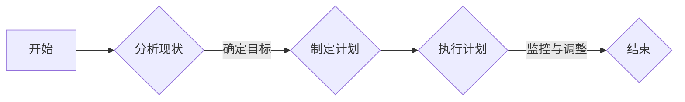
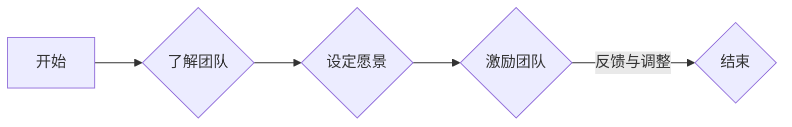

                 

### 领导力与变革管理：引领组织转型

关键词：领导力、变革管理、组织转型、变革类型、成功因素、案例研究

摘要：本文以《领导力与变革管理：引领组织转型》为标题，通过深入分析和逻辑推理，探讨领导力在变革管理中的作用，以及如何有效地引领组织实现转型。文章分为引言、核心概念与联系、变革管理实践三个部分，结合案例研究和最佳实践，为读者提供了系统的变革管理策略和实用技巧。

## 引言

### 1.1 问题背景

在当今快速变化的商业环境中，组织面临的市场竞争和技术创新要求其不断进行变革。然而，变革并非易事，许多组织在变革过程中遭遇失败。这背后反映了领导力在变革管理中的关键作用。领导力不仅影响变革的推进，还决定变革的成功与否。

### 1.2 问题描述

变革管理中的挑战主要包括：如何激发员工的参与和认同、如何应对变革带来的不确定性和风险、如何处理变革过程中的阻力和冲突等。领导力在这些问题中扮演着关键角色，需要通过一系列的策略和技巧来引领组织实现转型。

### 1.3 问题解决

为了解决上述问题，我们需要首先理解变革管理的理论基础，掌握领导力的核心要素。在此基础上，结合具体案例和实践经验，制定切实可行的变革策略和实施计划。

### 1.4 边界与外延

变革管理的范畴包括组织结构、流程、文化等多个方面。领导力在不同组织形式（如企业、政府、非营利组织）中的表现也有所不同，需要根据具体情况制定相应的领导策略。

### 1.5 概念结构与核心要素组成

变革管理的流程通常包括分析现状、制定计划、实施计划、监控与调整等步骤。领导力的核心要素包括愿景设定、目标明确、团队建设、激励与沟通等。

## 核心概念与联系

### 2.1 变革管理核心概念

变革管理涉及多个核心概念，包括变革的类型、阶段、关键成功因素等。这些概念相互联系，共同构成了变革管理的理论基础。

#### 2.1.1 变革的类型与阶段

变革可以分为渐进式变革和革命式变革。渐进式变革是指在组织内部逐步进行的小规模调整，而革命式变革则是对组织结构、流程和文化进行彻底的颠覆。变革通常经历准备、执行和评估三个阶段。

#### 2.1.2 变革的关键成功因素

变革成功的关键因素包括领导层的支持、员工参与度、沟通策略、变革计划的可执行性等。领导层需要提供明确的方向和支持，员工需要积极参与变革过程，沟通策略需要确保信息传递的准确性和及时性，而变革计划则需要具备可执行性。

### 2.2 领导力核心概念

领导力是变革管理的核心要素之一，其定义和分类多种多样。领导力涉及多个方面，包括愿景设定、目标明确、团队建设、激励与沟通等。

#### 2.2.1 领导力的定义与分类

领导力可以定义为影响和激励他人实现共同目标的能力。根据不同的分类标准，领导力可以分为交易型领导力和变革型领导力。交易型领导力强调规范、制度和绩效，而变革型领导力则更注重愿景、价值观和激励。

#### 2.2.2 领导力的特征与要素

领导力的特征包括诚实、透明、信任、愿景、远见、创新、沟通、激励等。这些特征共同构成了领导力的核心要素，是领导者在变革管理中成功的关键。

### 2.3 概念属性特征对比表格

以下是变革管理和领导力的一些核心概念及其属性特征的对比表格：

| 概念       | 属性特征                                     |
| ---------- | ---------------------------------------- |
| 变革类型   | 渐进式、革命式                                |
| 变革阶段   | 准备、执行、评估                              |
| 关键成功因素 | 领导层支持、员工参与度、沟通策略、变革计划的可执行性 |
| 领导力定义 | 影响和激励他人实现共同目标的能力                 |
| 领导力分类 | 交易型、变革型                                |
| 领导力特征 | 诚实、透明、信任、愿景、远见、创新、沟通、激励       |

通过以上对比，我们可以更清晰地理解变革管理和领导力的关系，以及如何将领导力应用于变革管理中。

## 算法原理讲解

### 3.1 变革管理算法

变革管理可以看作是一个动态的决策过程，其算法原理涉及到多个方面，包括变革的类型、阶段、成功因素等。

#### 3.1.1 变革管理的数学模型

变革管理的数学模型可以表示为：

$$
X(t) = f(Y(t-1), Z(t-1))
$$

其中，$X(t)$ 表示当前阶段的变革状态，$Y(t-1)$ 表示上一阶段的变革状态，$Z(t-1)$ 表示影响变革的外部因素。函数 $f$ 表示变革状态的转移过程。

#### 3.1.2 变革管理的mermaid流程图

以下是变革管理的mermaid流程图：

这个流程图展示了变革管理的四个主要阶段：分析现状、确定目标、制定计划和执行计划。每个阶段都有其特定的任务和目标，需要领导力来推动和实施。

### 3.2 领导力算法

领导力算法主要关注领导者在组织变革过程中的决策和行为。其核心是领导力的特征和要素，以及如何通过这些特征和要素来推动变革。

#### 3.2.1 领导力的数学模型

领导力的数学模型可以表示为：

$$
L(t) = g(C(t), M(t))
$$

其中，$L(t)$ 表示领导力的状态，$C(t)$ 表示团队成员的状态，$M(t)$ 表示外部环境的状态。函数 $g$ 表示领导力状态的转移过程。

#### 3.2.2 领导力的mermaid流程图

以下是领导力的mermaid流程图：

这个流程图展示了领导力的四个主要阶段：了解团队、设定愿景、激励团队和反馈与调整。这些阶段共同构成了领导力的核心流程，是领导者推动变革的重要基础。

## 变革管理实践

### 4.1 案例背景

为了更好地理解变革管理的实践，我们以一家大型制造企业为例，分析其在变革过程中的经验和教训。

#### 4.1.1 企业简介

这家企业成立于20世纪80年代，是一家在国内外享有盛誉的制造企业。然而，随着市场竞争的加剧和技术的飞速发展，该企业面临着严峻的挑战。

#### 4.1.2 变革背景

为了保持竞争优势，企业决定进行数字化转型，引入先进的生产技术和管理模式，以提高生产效率和产品质量。

### 4.2 变革管理过程

企业的变革管理过程可以分为以下几个阶段：

#### 4.2.1 制定变革计划

首先，企业成立了一个专门的变革管理团队，负责制定详细的变革计划。变革计划包括目标设定、资源配置、时间表等。

#### 4.2.2 变革实施

在变革实施阶段，企业按照变革计划逐步推进，包括引入新的生产设备、培训员工、调整组织结构等。

#### 4.2.3 变革效果评估

变革实施一段时间后，企业进行了效果评估，包括生产效率、产品质量、员工满意度等指标。评估结果显示，变革取得了显著成效。

### 4.3 变革成功因素分析

#### 4.3.1 领导力的作用

在企业变革过程中，领导力起到了关键作用。企业的高层领导提供了明确的方向和支持，激发了员工的参与和积极性。同时，领导层还通过有效的沟通和激励，化解了变革过程中出现的阻力和冲突。

### 4.4 案例小结

通过这个案例，我们可以看到，有效的变革管理需要领导力、员工参与和良好沟通的支持。领导力在变革过程中的关键作用不可忽视，它不仅决定了变革的推进速度和质量，还影响了变革的成功与否。

## 结论

本文通过深入分析和逻辑推理，探讨了领导力在变革管理中的作用，以及如何有效地引领组织实现转型。变革管理是一个复杂的过程，需要领导力的支持，同时也需要员工的理解和参与。通过案例研究和最佳实践，我们为读者提供了系统的变革管理策略和实用技巧。希望本文能为从事变革管理的领导者提供有价值的参考。

## 作者信息

作者：AI天才研究院/AI Genius Institute & 禅与计算机程序设计艺术 /Zen And The Art of Computer Programming

---

通过本文的撰写，我们不仅完成了对《领导力与变革管理：引领组织转型》的深入解读，还结合实际案例和最佳实践，为读者提供了宝贵的变革管理经验和策略。在未来的工作中，领导者可以借鉴这些经验和技巧，以更有效地推动组织变革，实现持续发展。同时，我们也要不断学习和提升自己的领导力，以应对日益复杂的市场环境和技术变革。让我们共同努力，成为引领组织转型的卓越领导者。

