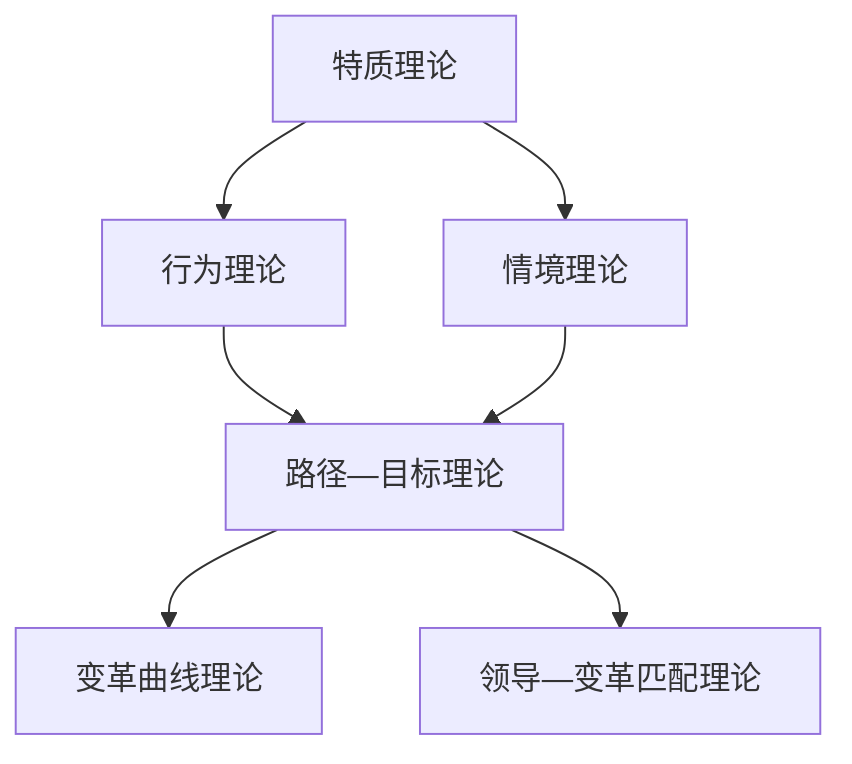

                 

### 引言

《领导力与变革管理：引领组织转型的艺术》这本书旨在深入探讨领导力与变革管理在组织转型中的重要作用。在当今快速变化的世界，组织面临的挑战日益复杂，传统的管理模式已无法满足新的需求。领导力与变革管理成为推动组织适应和成功转型的关键因素。

首先，领导力不仅是指导和激励团队成员的关键，更是组织成功的基础。优秀的领导者能够洞察组织内外部的环境变化，制定明确的战略目标，并激励团队成员共同努力实现这些目标。变革管理则是在这一过程中，帮助组织顺利应对变革、减少阻力并确保变革成功的系统方法。

书中将首先介绍领导力和变革管理的基本概念和核心原则，通过定义关键术语、阐述问题背景和挑战，为后续内容的深入讨论奠定基础。接下来，我们将探讨各种领导力和变革管理的理论框架，分析不同的领导风格和管理策略，并使用Mermaid图解来直观展示这些概念和流程。

此外，书中还将通过实际案例研究，展示领导力和变革管理在现实组织中的应用，并讨论如何在不同情境下灵活运用这些原则和方法。最后，我们将探讨领导者在变革过程中的具体角色和技能，以及如何通过有效的沟通和团队建设来推动组织转型。

总之，《领导力与变革管理：引领组织转型的艺术》不仅为读者提供了理论上的指导，更通过实践案例和深入分析，展示了领导力和变革管理在组织成功转型中的不可替代的作用。通过这本书，读者将更好地理解如何成为一名优秀的领导者，并掌握推动组织变革的实用技能。

### 关键词

- **领导力**：领导者如何影响和激励团队成员，实现组织目标的能力。
- **变革管理**：引导组织应对变化、减少变革阻力并确保变革成功的系统方法。
- **组织转型**：组织在面临外部环境变化时，通过调整战略、结构和文化来适应新环境的系统性过程。
- **领导风格**：领导者在不同情境下采用的行为模式和管理方法。
- **变革策略**：组织在变革过程中制定的具体计划和方法。
- **团队建设**：通过增强团队协作和凝聚力，提高团队绩效的过程。

### 摘要

《领导力与变革管理：引领组织转型的艺术》旨在探讨领导力与变革管理在组织转型中的关键作用。本书首先介绍了领导力和变革管理的基本概念，定义了关键术语并阐述了问题背景和挑战。接着，通过深入分析不同的领导力和变革管理理论框架，展示了各种领导风格和管理策略的优劣。书中通过实际案例研究，详细展示了领导力和变革管理在现实组织中的应用，并讨论了如何在不同的情境下灵活运用这些原则和方法。最后，本书探讨了领导者在变革过程中的具体角色和技能，包括沟通和团队建设的重要性，以及如何通过有效的策略和执行，成功引领组织实现转型。总之，本书为读者提供了一套完整的理论框架和实践指导，帮助组织在复杂多变的环境中保持竞争力和可持续发展。

### 背景和核心概念

领导力与变革管理作为现代管理学的核心领域，具有广泛的背景和深厚的理论基础。首先，我们需要明确这两个概念的基本定义和核心要素。

**领导力**：领导力是指领导者通过影响和激励团队成员，引导他们实现组织目标的能力。它不仅仅是职位赋予的权力，更是一种通过行为、态度和价值观来影响他人的艺术。领导力包括多个方面，如愿景构建、决策能力、沟通技巧、团队建设、激励与授权等。

**变革管理**：变革管理是引导组织应对外部环境变化、内部结构调整和新技术应用的过程，确保变革成功并实现预期目标。变革管理涉及多个环节，包括规划、执行、监控和评估，旨在减少变革过程中的不确定性和阻力，确保变革目标的实现。

**问题定义**：在当前快速变化的市场环境中，组织面临的挑战越来越复杂，传统的领导力与变革管理方法已无法满足需求。主要问题包括：

1. **变化速度**：外部环境的变化速度加快，组织需要更灵活和敏捷的领导力与变革管理来应对。
2. **员工适应性**：员工对新技术的接受和适应能力参差不齐，变革过程中如何激发员工积极性成为关键问题。
3. **文化冲突**：在组织变革过程中，不同部门、层级和文化之间的冲突可能会阻碍变革的推进。
4. **领导力不足**：部分领导者缺乏变革管理的知识和技能，无法有效引导组织实现转型。

**解决方案与边界**：针对上述问题，领导力和变革管理提出了一系列解决方案，包括：

1. **领导力提升**：通过培训和学习，提升领导者的战略思维、决策能力和沟通技巧，以更好地引导组织变革。
2. **变革策略设计**：制定详细的变革策略，包括规划、执行、监控和评估，确保变革过程的有序进行。
3. **文化融合**：在变革过程中，注重文化融合，通过建立共同价值观和目标，减少部门间和层级间的冲突。
4. **员工参与**：鼓励员工积极参与变革过程，通过沟通、培训和激励机制，提升员工对变革的接受度。

然而，这些解决方案也具有一定的边界和局限性：

1. **实施成本**：领导力提升和变革策略设计需要投入大量的人力、物力和时间，对企业资源要求较高。
2. **变革阻力**：变革过程中可能会遇到来自员工、管理层和外部环境的阻力，需要通过有效的沟通和协商来应对。
3. **不确定性和风险**：变革过程中存在一定的不确定性和风险，如技术失败、市场变化等，需要提前进行风险评估和应对策略制定。

**核心概念与关系**：

为了更清晰地理解领导力和变革管理的核心概念及其相互关系，我们可以使用Mermaid ER图来展示这些概念及其属性。

```mermaid
erDiagram
  Leadership ||--|{ ChangeManagement : relates_to }
  
  Leadership {
    +Vision : String
    +Strategy : String
    +Communication : String
    +TeamBuilding : String
  }
  
  ChangeManagement {
    +Planning : String
    +Execution : String
    +Monitoring : String
    +Evaluation : String
  }
```

在这个ER图中，领导力（Leadership）和变革管理（ChangeManagement）是两个核心概念，它们之间存在密切的关联。领导力为变革管理提供了方向和动力，而变革管理则为领导力的实施提供了具体的方法和路径。

**关键要素组成**：

- **领导力**：愿景、战略、沟通、团队建设。
- **变革管理**：规划、执行、监控、评估。

通过上述分析，我们可以看到领导力和变革管理在组织转型中的重要性。理解这些核心概念及其相互关系，将为后续章节的深入讨论提供基础。

### 领导力和变革管理的理论框架

在深入探讨领导力和变革管理的核心概念后，我们需要引入相关的理论框架，以帮助读者更好地理解这两个领域的理论基础和实践应用。

#### 核心理论和原则

**领导力理论**：

1. **特质理论**：特质理论认为领导者具备一系列固有的特质，如自信、决断力、魅力等。这些特质使领导者能够在团队中产生积极影响。然而，该理论也受到批评，因为领导力并非完全由个人特质决定。
   
2. **行为理论**：行为理论关注领导者具体的行为方式，如民主领导、专制领导和参与式领导等。通过研究领导者的行为模式，该理论试图发现与领导效果相关的行为特征。

3. **情境理论**：情境理论认为领导效果取决于领导者的行为与情境的匹配程度。领导者需要根据不同的情境调整自己的行为，以实现最佳领导效果。代表性的理论包括费德勒模型和路径—目标理论。

**变革管理理论**：

1. **变革三部曲理论**：该理论由著名的组织行为学专家凯瑟琳·霍格提出，将变革过程分为三个阶段：反应阶段、调整阶段和适应阶段。每个阶段都有特定的任务和挑战，领导者需要根据阶段的不同采取相应的策略。

2. **变革曲线理论**：约翰·肯尼迪和唐纳德·肯尼迪提出的变革曲线理论描述了个体在变革过程中的心理和行为变化。曲线分为抗拒、探索和整合三个阶段，每个阶段都有特定的心理和行为特征。

3. **领导—变革匹配理论**：该理论认为，领导风格和变革策略需要相匹配，以实现最佳的变革效果。例如，在快速变革的情境下，采用灵活的领导风格和渐进式的变革策略可能更为有效。

#### 比较分析

为了更好地理解不同领导力和变革管理理论之间的差异和联系，我们可以使用以下表格进行比较分析：

| 理论           | 关键概念                      | 优点                                 | 缺点                                 |
| -------------- | ----------------------------- | ------------------------------------ | ------------------------------------ |
| 特质理论       | 领导者的个人特质              | 强调领导者的内在素质，易于理解        | 忽视外部环境对领导效果的影响         |
| 行为理论       | 领导者的具体行为方式          | 提供具体的行为模式，易于模仿          | 忽视领导行为的情境依赖性             |
| 情境理论       | 领导行为与情境的匹配程度      | 强调领导行为的灵活性，更贴近实际      | 对情境的识别和调整要求较高           |
| 变革三部曲理论 | 变革过程的阶段性任务和挑战    | 提供清晰的变革过程模型，便于实施      | 对不同组织和文化背景的适应性有限     |
| 变革曲线理论   | 个体在变革过程中的心理和行为变化 | 提供个体变革的心理模型，有助于应对阻力 | 对领导者的心理洞察力要求较高         |
| 领导—变革匹配理论 | 领导风格与变革策略的匹配程度 | 强调领导风格的适应性，提高变革成功率  | 实施难度较大，需要不断调整和优化     |

通过上述表格，我们可以看到不同理论在关键概念、优点和缺点上的差异。理解这些理论，有助于我们更全面地认识领导力和变革管理的复杂性，并在实际应用中灵活选择和运用。

#### Mermaid图解

为了更直观地展示这些理论和原则，我们可以使用Mermaid图解来绘制流程图和关系图。

**领导力理论的Mermaid流程图**：



在这个流程图中，不同领导力理论按照其发展和关联关系进行排列，展示了它们之间的内在联系。

**变革管理理论的Mermaid关系图**：

```mermaid
erDiagram
    变革三部曲理论 ||--|{ 变革曲线理论 : relates_to }
    变革三部曲理论 ||--|{ 领导—变革匹配理论 : relates_to }
    变革曲线理论 ||--|{ 变革三部曲理论 : relates_to }
    变革曲线理论 ||--|{ 领导—变革匹配理论 : relates_to }
    
    变革三部曲理论 {
        +反应阶段
        +调整阶段
        +适应阶段
    }
    
    变革曲线理论 {
        +抗拒阶段
        +探索阶段
        +整合阶段
    }
    
    领导—变革匹配理论 {
        +领导风格
        +变革策略
    }
```

在这个ER图中，不同变革管理理论之间的关系及其关键概念和属性被清晰展示，有助于读者更好地理解和记忆。

通过上述理论和图解的分析，我们可以更全面地理解领导力和变革管理的核心概念及其相互关系。这为后续章节的实际应用和深入讨论提供了坚实的理论基础。

### 实践应用

在深入探讨了领导力和变革管理的理论基础后，我们接下来通过实际案例来展示这些原则和方法在现实组织中的应用。

#### 案例一：谷歌的变革管理

谷歌（Google）作为全球领先的科技公司，其领导力和变革管理在业界享有盛誉。以下是一个关于谷歌如何通过变革管理实现成功的案例。

**背景**：随着谷歌业务的不断扩展和市场竞争的加剧，公司意识到需要更加高效和灵活的领导力与变革管理来应对新的挑战。

**变革过程**：
1. **领导力提升**：谷歌通过内部培训和学习项目，提升领导者的战略思维和决策能力。公司鼓励领导者参与外部研讨会和课程，以获取最新的领导力知识。
   
2. **变革策略设计**：谷歌制定了详细的变革策略，包括优化组织结构、提高团队协作效率、引入新技术等。具体措施包括：
   - **扁平化组织结构**：减少管理层级，提高决策速度和灵活性。
   - **敏捷开发**：采用敏捷开发方法，缩短产品开发周期，提高市场响应速度。
   - **文化建设**：强调创新和团队合作，通过文化活动增强员工归属感和凝聚力。

3. **员工参与**：谷歌通过开放的沟通渠道和员工参与计划，鼓励员工提出改进建议，并积极参与变革过程。公司建立了内部反馈系统，及时收集和处理员工意见。

**效果**：通过上述变革措施，谷歌成功提升了组织效率和创新能力，在竞争激烈的市场中保持领先地位。员工对变革的接受度较高，公司内部氛围更加积极和开放。

#### 案例二：通用电气的领导力实践

通用电气（General Electric，简称GE）在领导力方面有着丰富的实践经验，以下是一个关于GE领导力实践的成功案例。

**背景**：为了应对市场变化和业务转型，GE需要一支具有战略思维和执行力的高效领导团队。

**领导力实践**：
1. **领导力发展**：GE通过内部领导力发展项目，培养领导者的战略思维、决策能力和领导力。公司定期组织领导力研讨会和工作坊，提升领导者的综合能力。

2. **领导风格多样**：GE鼓励领导者根据不同情境采用不同的领导风格。例如，在快速变化的市场环境中，采用灵活的领导风格可能更为有效；而在稳定的市场环境中，采用稳健的领导风格可能更合适。

3. **绩效管理**：GE实施严格的绩效管理体系，通过明确的绩效目标和定期评估，激励领导者提升绩效。公司注重领导者的长期发展和持续改进。

**效果**：通过上述领导力实践，GE成功培养了一支高效的领导团队，推动了公司的持续创新和业务增长。领导者的绩效显著提升，公司整体竞争力得到增强。

#### 应用场景

**快速变化的市场环境**：在快速变化的市场环境中，领导者和组织需要具备敏捷的领导力和变革管理能力。以下是一些关键应用场景：
- **敏捷领导**：领导者需要具备快速决策和灵活调整的能力，以应对市场变化。
- **文化适应性**：组织需要建立适应变化的敏捷文化，鼓励员工创新和协作。
- **持续学习**：领导者需要不断学习新知识和技术，以适应市场变化。

**数字化转型**：数字化转型是当前组织面临的重要挑战之一，以下是一些关键应用场景：
- **领导力转型**：领导者需要具备数字化转型相关的知识和技能，以指导组织变革。
- **组织结构调整**：组织需要调整结构，建立适应数字化转型的团队和流程。
- **技术整合**：领导者需要推动技术整合，确保数字化转型顺利实施。

**全球运营**：在全球化背景下，领导力和变革管理需要考虑跨文化和跨国运营的复杂性。以下是一些关键应用场景：
- **跨文化领导**：领导者需要了解和尊重不同文化的差异，建立有效的沟通和协作机制。
- **全球协作**：组织需要建立高效的全球协作平台，促进跨部门、跨地区的协同工作。
- **国际化战略**：领导者需要制定国际化战略，确保组织在全球市场中的竞争优势。

通过上述实际案例和应用场景的讨论，我们可以看到领导力和变革管理在现实组织中的广泛应用和重要性。理解并灵活运用这些原则和方法，将有助于组织在复杂多变的环境中保持竞争力和可持续发展。

### 组织变革管理策略

在实现组织转型过程中，变革管理策略的制定和执行至关重要。有效的变革管理策略可以帮助组织减少变革过程中的不确定性和阻力，确保变革目标的顺利实现。以下将讨论几种常见的组织变革管理策略，并分析其适用性。

#### 变革管理策略

1. **领导引领策略**：
   - **领导引领策略**强调领导者在变革过程中的核心作用。领导者需要通过明确表达变革愿景、建立信任和激励机制来引导员工积极参与变革。
   - **适用性**：适用于需要快速推动变革、领导者有强大影响力的情况。然而，如果领导者的信誉不足或变革计划与员工实际需求不符，可能导致变革失败。

2. **沟通策略**：
   - **沟通策略**强调在变革过程中与员工进行持续的、透明的沟通。通过有效的沟通，确保员工了解变革的必要性、目标和进展，从而减少误解和担忧。
   - **适用性**：适用于变革涉及多个部门或层级、需要广泛参与的情况。然而，如果沟通不足或信息传递不畅，可能导致员工对变革的抵触情绪。

3. **参与策略**：
   - **参与策略**鼓励员工在变革过程中积极参与，通过提供反馈和建议来改善变革方案。这种方式可以提高员工的参与度和接受度，增强变革的可持续性。
   - **适用性**：适用于员工有较高参与意愿、变革方案涉及员工切身利益的情境。然而，如果员工缺乏参与能力或参与度不高，可能导致变革进程缓慢。

4. **文化融合策略**：
   - **文化融合策略**通过整合组织文化中的积极元素，促进变革的顺利进行。这包括建立共同的价值观、目标和文化规范，以减少变革过程中的文化冲突。
   - **适用性**：适用于组织文化基础较好、变革与现有文化相协调的情况。然而，如果组织文化较为保守或变革与现有文化冲突，可能导致变革失败。

5. **渐进式变革策略**：
   - **渐进式变革策略**通过逐步实施变革，减少变革对组织和员工的冲击。这种方式可以让员工逐步适应变革，降低变革的阻力。
   - **适用性**：适用于变革涉及多个环节、变革过程需要较长时间的情况。然而，如果变革推进过慢，可能导致员工对变革的耐心耗尽。

#### 文化因素

组织文化在变革管理中起着至关重要的作用。不同的文化背景可能会对变革管理策略的适用性产生重大影响。

1. **开放性文化**：
   - **特点**：开放性文化强调创新、合作和透明度，员工倾向于接受新观念和变革。
   - **影响**：在开放性文化中，领导引领策略和参与策略往往更为有效。员工愿意分享意见和建议，积极参与变革过程。

2. **保守性文化**：
   - **特点**：保守性文化强调稳定、遵从和纪律，员工倾向于遵循传统和权威。
   - **影响**：在保守性文化中，沟通策略和渐进式变革策略可能更为适用。通过逐步变革和透明沟通，可以有效减少员工的抵触情绪。

3. **权力文化**：
   - **特点**：权力文化强调权力和地位的差异，决策和变革往往由高层领导主导。
   - **影响**：在权力文化中，领导引领策略和领导—变革匹配策略可能更为有效。高层领导的支持和积极参与可以推动变革的顺利进行。

#### 关键步骤

为了确保变革管理策略的有效实施，以下是一些关键步骤：

1. **明确变革目标**：明确变革的目标和期望成果，确保所有相关人员对变革方向有共同的理解。

2. **制定变革计划**：根据组织实际情况和变革目标，制定详细的变革计划，包括时间表、步骤和责任人。

3. **沟通与宣传**：通过多种渠道进行沟通和宣传，确保员工了解变革的必要性、目标和进展。

4. **培训与支持**：为员工提供必要的培训和支持，帮助他们适应变革，提高变革的接受度。

5. **监督与评估**：建立监督和评估机制，及时跟踪变革进展，确保变革目标的实现。

6. **持续优化**：在变革过程中，不断收集反馈和改进建议，优化变革策略，提高变革的可持续性和效果。

通过上述变革管理策略、文化因素和关键步骤的讨论，我们可以看到组织变革管理的复杂性和多样性。理解并灵活运用这些策略，将有助于组织在变革过程中保持稳定和持续发展。

### 领导者在变革过程中的角色和技能

在组织变革过程中，领导者的角色和技能至关重要。他们不仅是变革的发起者，更是变革的推动者和保障者。以下将详细探讨领导者在变革过程中的具体角色和所需技能，以及如何通过有效的沟通和团队建设来推动变革。

#### 领导者的角色

1. **变革倡导者**：领导者需要积极倡导变革，明确表达变革的愿景和目标，赢得员工的认同和支持。他们需要具备远见和决断力，能够在复杂和不确定的环境下坚定地推动变革。

2. **变革推动者**：领导者需要通过激励和指导，推动员工积极参与变革。他们需要具备强烈的执行力，确保变革计划的有效实施，并在变革过程中克服各种障碍。

3. **变革保障者**：领导者需要为变革提供支持和保障，确保变革目标的实现。他们需要协调内外部资源，解决变革过程中出现的问题，并保持组织的稳定运行。

4. **变革代理人**：领导者需要在变革过程中起到代理人的作用，代表组织与外部环境进行互动，获取外部支持和资源，为变革创造有利条件。

#### 领导者所需技能

1. **战略思维能力**：领导者需要具备战略思维能力，能够洞察组织内外部环境的变化，制定符合实际的变革策略，确保变革的顺利进行。

2. **沟通能力**：领导者需要具备强大的沟通能力，能够在变革过程中与员工进行有效沟通，传达变革的目标和意义，减少误解和抵触情绪。

3. **领导力**：领导者需要具备领导力，能够激励和引导员工，建立高效的团队，推动变革的顺利实施。

4. **适应性**：领导者需要具备适应性，能够根据变革过程中出现的新情况和新问题，灵活调整变革策略和领导风格，确保变革的持续进行。

#### 沟通在变革中的作用

1. **建立共识**：通过有效的沟通，领导者可以建立变革的共识，使员工理解变革的必要性和目标，增强他们对变革的认同感。

2. **减少误解**：通过透明的沟通，领导者可以减少员工对变革的误解和担忧，增强他们对变革的信任。

3. **增强参与度**：通过参与沟通，员工可以更深入地了解变革，并提出意见和建议，增强他们对变革的参与度和责任感。

4. **促进合作**：通过沟通，领导者可以促进不同部门和层级之间的合作，建立跨部门的协作机制，确保变革的顺利推进。

#### 团队建设在变革中的作用

1. **增强凝聚力**：通过团队建设，领导者可以增强团队的凝聚力，建立共同的目标和价值观，为变革提供坚实的基础。

2. **提升协作能力**：通过团队建设，领导者可以提升团队的协作能力，确保团队成员在变革过程中能够高效合作，克服各种挑战。

3. **激发创新**：通过团队建设，领导者可以激发团队成员的创新能力，鼓励他们提出新的观点和解决方案，为变革注入新的动力。

4. **建立信任**：通过团队建设，领导者可以建立团队成员之间的信任，增强他们对变革的支持和信心，确保变革的顺利进行。

#### 实例分析

1. **苹果公司的变革**：史蒂夫·乔布斯在回到苹果公司后，通过一系列变革措施，使公司重回巅峰。他首先明确表达了苹果的愿景和目标，通过开放沟通赢得了员工的认同。其次，他通过团队建设，建立了高效的团队，确保变革的顺利实施。最终，苹果成功推出了多项创新产品，实现了巨大的商业成功。

2. **通用电气（GE）的变革**：杰克·韦尔奇在领导通用电气期间，通过一系列变革措施，使公司实现了从传统制造企业向多元化服务企业的转型。他通过沟通策略，确保员工理解变革的必要性和目标，通过领导力，激励员工积极参与变革。同时，他通过团队建设，建立了强大的团队，为变革提供了坚实的基础。

通过上述讨论，我们可以看到领导者在变革过程中的重要作用和所需技能。有效的沟通和团队建设是推动变革成功的关键因素。领导者需要通过战略思维、沟通能力和团队建设等技能，积极引领和组织变革，确保组织在复杂多变的环境中保持竞争力和可持续发展。

### 结论与未来展望

在本文中，我们深入探讨了领导力与变革管理的核心概念、理论基础、实践应用及变革管理策略。通过分析领导力的特质、行为和情境理论，以及变革管理的三部曲理论、变革曲线理论和领导—变革匹配理论，我们理解了这两个领域的重要性和复杂性。实际案例展示了领导力和变革管理在现实组织中的应用，进一步验证了其价值。此外，我们详细讨论了组织变革管理的策略和文化因素，揭示了变革过程中的关键步骤和领导者所需技能。

领导力与变革管理不仅是组织成功转型的关键，也是个人职业发展的基石。未来的研究可以进一步探讨领导力和变革管理的跨文化应用，以及人工智能和新技术对这两个领域的影响。此外，实践中的经验和教训也为理论发展提供了宝贵的素材。总之，通过持续学习和实践，我们可以更好地掌握领导力和变革管理的艺术，为组织的可持续发展贡献力量。

### 最佳实践 tips

1. **建立变革愿景**：确保所有员工都清楚变革的目标和愿景，从而增强他们的参与感和认同感。
2. **沟通透明化**：在变革过程中保持开放的沟通渠道，及时传达进展和问题，减少误解和焦虑。
3. **培训与支持**：为员工提供必要的培训和资源支持，帮助他们适应变革，提高变革的成功率。
4. **文化适应性**：考虑组织文化背景，确保变革策略与现有文化相协调，减少文化冲突。
5. **领导者先行**：领导者应率先践行变革，通过自身的行为和态度，树立榜样，激励员工跟随。

### 小结

本文通过对领导力与变革管理的详细分析，阐述了其在组织转型中的关键作用。通过理论基础和实践案例的探讨，我们理解了领导力和变革管理的核心概念及其应用策略。未来，组织需要不断优化领导力和变革管理实践，以适应快速变化的环境，保持竞争力。

### 注意事项

1. **变革前评估**：在启动变革前，对组织现状进行全面的评估，确保变革的必要性和可行性。
2. **持续反馈**：在变革过程中，持续收集员工的反馈，及时调整变革策略，确保变革目标的一致性。
3. **风险管理**：识别并评估变革过程中的风险，制定相应的风险应对策略，降低变革失败的可能性。
4. **员工参与**：鼓励员工参与变革过程，提高他们的参与度和责任感，确保变革的顺利进行。

### 拓展阅读

1. **《变革之舞：领导力、组织学习与变革管理》**：作者：丹尼尔·戈尔曼，本书深入探讨了领导力与变革管理的互动关系。
2. **《领导力与新科学：组织变革与人的层面》**：作者：彼得·德鲁克，本书从系统论的角度分析了组织变革的复杂性。
3. **《变革三部曲：理解与执行》**：作者：理查德·拉夫特、约翰·肯尼迪、唐纳德·肯尼迪，本书详细阐述了变革过程的阶段性任务和挑战。

