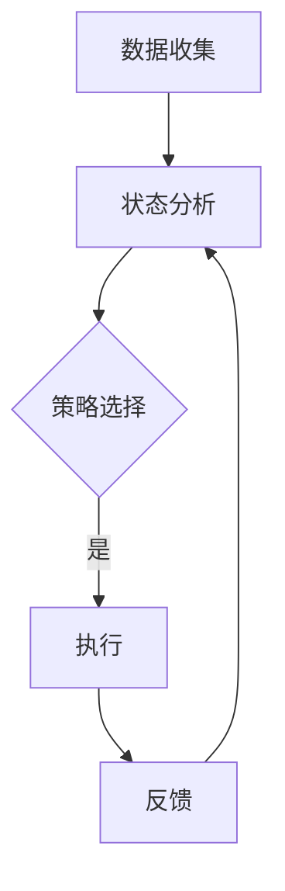
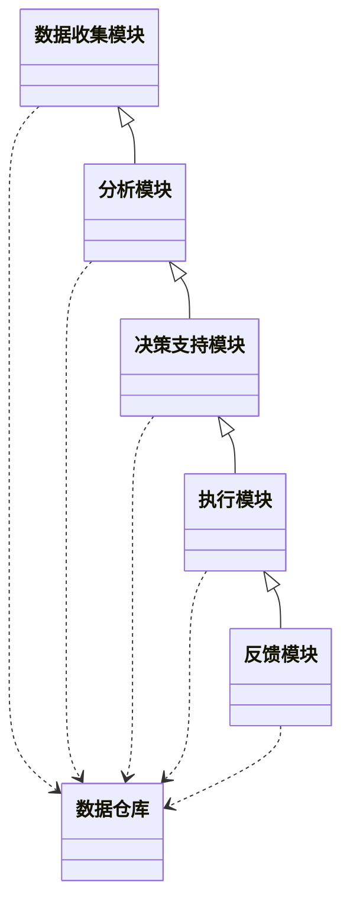
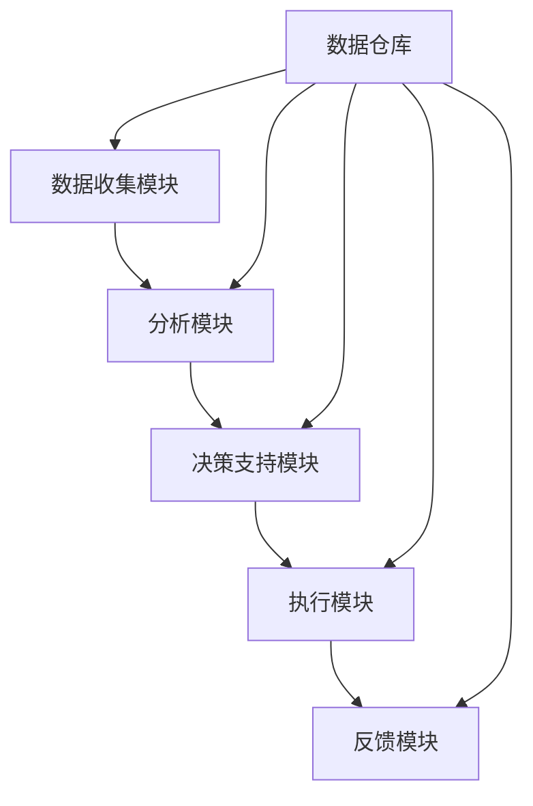
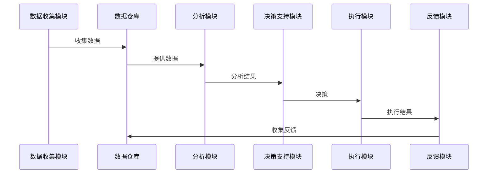

                 


### 领导力与变革适应：在变化中成长

关键词：领导力、变革适应、系统架构、算法原理、项目实战、最佳实践

摘要：本文深入探讨领导力与变革适应在IT领域的应用，通过分析变革适应算法原理、系统架构设计和项目实战，为IT从业者提供在变化中成长的实践指南。

------------------------

**第一部分：背景介绍**

在快速变化的IT行业中，领导力和变革适应能力成为决定企业成功与否的关键因素。本文将首先介绍领导力和变革适应的概念，阐述其核心概念、特征以及它们在当前社会背景下的重要性。

#### 1. 引言

领导力是一种影响力，它通过激励和指导他人来实现共同的目标。变革适应则是指在面对环境变化时，能够迅速调整和适应的能力。在当今数字化转型的浪潮中，IT企业必须具备强大的领导力和变革适应能力，才能在激烈的市场竞争中立于不败之地。

#### 2. 领导力核心概念

领导力不仅仅是权威的体现，更是影响他人共同前进的艺术。它包括愿景、激励、决策和沟通等多个方面。一个优秀的领导者必须具备清晰的目标和愿景，能够激励团队成员，做出明智的决策，并且善于沟通，确保团队内部的信息流通。

#### 3. 变革适应的概念与特征

变革适应是指组织在面对外部环境变化时，能够灵活调整自身结构和行为的能力。其核心特征包括快速响应、持续学习和敏捷决策。在IT行业中，变革适应意味着企业必须能够迅速应对技术革新，调整业务模式，以保持竞争力。

#### 4. 领导力与变革适应的关系

领导力在变革适应中起着至关重要的作用。一个有领导力的领导者能够引导团队进行变革，激发成员的潜力，推动企业持续创新。同时，变革适应也为领导力提供了新的挑战和机遇，使领导者能够不断成长和提升。

#### 5. 领导力与变革适应的边界与外延

领导力与变革适应并非孤立存在，它们在不同的情境和组织结构中都有所体现。在静态环境中，领导力侧重于稳定和维持；而在动态环境中，变革适应成为主导。同时，领导力与变革适应也存在一定的边界，例如在高度规范化的组织中，变革适应的空间可能受到限制。

#### 6. 领导力与变革适应的概念结构与核心要素组成

为了更好地理解领导力与变革适应，我们可以将其概念化为一套理论模型。这个模型包括愿景、文化、组织结构、决策机制等多个要素，每个要素都在不同程度上影响着领导力和变革适应的效果。

------------------------

**第二部分：核心概念与联系**

在深入理解领导力和变革适应之后，本文将探讨它们的核心概念及其之间的联系。

#### 7. 领导力原理

领导力的原理可以追溯到心理学、社会学和哲学等多个领域。从心理学的角度来看，领导力涉及到激励理论、认知行为理论等；从社会学的角度来看，领导力涉及到权力结构、社会网络分析等；从哲学的角度来看，领导力涉及到道德哲学、正义理论等。理解这些原理有助于我们更好地应用领导力，推动组织变革。

#### 8. 变革适应原理

变革适应的理论框架主要包括系统论、混沌理论和学习理论。系统论强调组织作为一个整体的动态变化；混沌理论解释了组织在变革过程中可能出现的非线性现象；学习理论则关注个体和组织在变革中的学习和适应过程。理解这些原理有助于我们设计和实施有效的变革适应策略。

#### 9. 领导力与变革适应的对比

领导力与变革适应虽然密切相关，但它们也有明显的区别。领导力更侧重于引导和激励，而变革适应则更侧重于调整和适应。此外，领导力往往与短期目标相关，而变革适应则与长期目标相关。通过对比分析，我们可以更好地理解两者的互补关系。

#### 10. 领导力与变革适应的联系

领导力与变革适应之间存在紧密的联系。一个有领导力的领导者能够推动变革适应，使组织在变化中保持活力。同时，有效的变革适应也能够为领导力提供新的目标和挑战，促进领导者的成长。

#### 11. 领导力与变革适应的ER实体关系图架构

为了更清晰地理解领导力与变革适应的关系，我们可以使用ER（Entity-Relationship）模型来表示它们之间的实体关系。这个模型包括领导力实体、变革适应实体以及它们之间的关联关系，可以帮助我们更直观地理解这两个概念的结构和相互作用。

------------------------

**第三部分：算法原理讲解**

在了解了领导力和变革适应的核心概念之后，本文将深入探讨变革适应算法的原理，包括算法的基本原理、mermaid流程图、Python源代码、数学模型和公式，并通过实例进行说明。

#### 12. 变革适应算法概述

变革适应算法是用于应对环境变化的一种计算方法。它通常包括以下几个步骤：数据收集、状态分析、策略选择、执行和反馈。这些步骤共同构成了一个闭环系统，使组织能够不断调整和优化其行为，以适应不断变化的环境。

#### 13. 变革适应算法的mermaid流程图

使用mermaid流程图可以清晰地展示变革适应算法的执行流程。以下是一个简化的mermaid流程图示例：



这个流程图展示了数据收集、状态分析、策略选择、执行和反馈之间的循环关系。

#### 14. 变革适应算法的Python源代码

下面是一个简单的Python代码示例，用于实现变革适应算法的基本流程：

```python
# 变革适应算法Python示例
def collect_data():
    # 数据收集代码
    pass

def analyze_state(data):
    # 状态分析代码
    pass

def select_strategy(state):
    # 策略选择代码
    pass

def execute_strategy(strategy):
    # 执行策略代码
    pass

def collect_feedback():
    # 反馈收集代码
    pass

while True:
    data = collect_data()
    state = analyze_state(data)
    strategy = select_strategy(state)
    execute_strategy(strategy)
    feedback = collect_feedback()
    # 更新状态或策略
```

这个代码示例提供了一个框架，用于实现变革适应算法的基本流程。

#### 15. 变革适应算法的数学模型与公式

变革适应算法的数学模型通常包括状态空间、策略选择函数和反馈机制。以下是一些基本的数学模型和公式：

- 状态空间：\( S = \{s_1, s_2, ..., s_n\} \)，表示系统的可能状态。
- 策略选择函数：\( \pi(s) \)，表示在状态s下选择的策略。
- 反馈函数：\( f(s, a) \)，表示在状态s和执行策略a后的反馈。

以下是一个简单的数学模型示例：

$$
\pi(s) = 
\begin{cases}
a_1 & \text{if } s = s_1 \\
a_2 & \text{if } s = s_2 \\
\vdots & \text{...}
\end{cases}
$$

$$
f(s, a) = 
\begin{cases}
r(s, a) & \text{if } s = s_1 \text{ and } a = a_1 \\
r(s, a) & \text{if } s = s_2 \text{ and } a = a_2 \\
\vdots & \text{...}
\end{cases}
$$

这些公式用于描述系统在特定状态和策略下的行为和反馈。

#### 16. 变革适应算法的举例说明

为了更好地理解变革适应算法的应用，我们可以通过一个实例来说明。假设我们有一个自动化系统，用于监控网络性能。系统的状态包括网络延迟、带宽利用率等指标。根据这些指标，系统可以选择不同的策略，如增加带宽、优化路由等。执行策略后，系统会收集反馈，并根据反馈调整策略。以下是一个简化的实例：

1. **数据收集**：系统从网络监控工具中收集网络延迟和带宽利用率数据。
2. **状态分析**：系统分析当前的网络状态，确定需要采取的行动。
3. **策略选择**：系统根据分析结果选择最优策略，如增加带宽。
4. **执行策略**：系统执行增加带宽的策略，并重新监控网络状态。
5. **反馈收集**：系统收集执行策略后的网络性能数据。
6. **策略调整**：根据反馈数据，系统调整未来的策略，以提高网络性能。

通过这个实例，我们可以看到变革适应算法在自动化系统中的应用，它使系统能够根据实时数据不断优化自身性能。

------------------------

**第四部分：系统分析与架构设计方案**

在了解了变革适应算法的原理后，本文将探讨领导力与变革适应在系统设计中的应用，包括问题描述、项目介绍、系统功能设计、系统架构设计、系统接口设计和系统交互。

#### 17. 问题描述

在当前的IT环境中，企业面临着快速变化的市场和技术挑战。为了保持竞争力，企业需要具备强大的领导力和变革适应能力。本文旨在设计一个系统，能够帮助企业实现领导力和变革适应，从而在变化中成长。

#### 18. 项目介绍

本项目旨在开发一个集成领导力和变革适应的系统，该系统将包含以下几个关键模块：

1. **数据收集模块**：用于收集企业内部和外部的各种数据，包括市场趋势、技术发展、竞争对手信息等。
2. **分析模块**：对收集到的数据进行分析，识别潜在的机会和风险。
3. **决策支持模块**：基于分析结果，提供决策支持，帮助领导者做出明智的决策。
4. **执行模块**：实施决策，并跟踪执行进度和效果。
5. **反馈模块**：收集执行反馈，用于后续的决策和支持。

#### 19. 系统功能设计（领域模型mermaid类图）

以下是一个简化的mermaid类图，用于展示系统的功能设计：



这个类图展示了系统各功能模块之间的依赖关系和数据流动。

#### 20. 系统架构设计（mermaid架构图）

以下是一个简化的mermaid架构图，用于展示系统的整体架构：



这个架构图展示了系统各模块之间的交互关系和数据流。

#### 21. 系统接口设计

系统接口设计是确保系统各模块之间能够有效通信的关键。以下是一个简化的接口设计示例：

1. **数据收集接口**：定义了数据收集模块与数据仓库之间的通信接口。
2. **分析接口**：定义了分析模块与数据仓库之间的通信接口。
3. **决策支持接口**：定义了决策支持模块与数据仓库之间的通信接口。
4. **执行接口**：定义了执行模块与数据仓库之间的通信接口。
5. **反馈接口**：定义了反馈模块与数据仓库之间的通信接口。

#### 22. 系统交互（mermaid序列图）

以下是一个简化的mermaid序列图，用于展示系统各模块之间的交互流程：



这个序列图展示了系统各模块在交互过程中的步骤和依赖关系。

------------------------

**第五部分：项目实战**

在了解了系统设计之后，本文将介绍一个具体的实战项目，包括环境安装、系统核心实现源代码、代码应用解读与分析、实际案例分析和详细讲解剖析，以及项目小结。

#### 23. 环境安装

为了实现本文所描述的系统，我们需要在开发环境中安装以下工具和库：

1. Python 3.x
2. Flask（一个轻量级的Web框架）
3. Pandas（一个用于数据分析的库）
4. Matplotlib（一个用于数据可视化的库）
5. Scikit-learn（一个用于机器学习的库）

安装步骤如下：

1. 安装Python 3.x：从Python官网下载并安装Python 3.x。
2. 安装Flask：在命令行中执行`pip install flask`。
3. 安装Pandas：在命令行中执行`pip install pandas`。
4. 安装Matplotlib：在命令行中执行`pip install matplotlib`。
5. 安装Scikit-learn：在命令行中执行`pip install scikit-learn`。

#### 24. 系统核心实现源代码

以下是一个简化的系统核心实现源代码示例，用于展示系统的基本功能：

```python
# system.py
from flask import Flask, request, jsonify
import pandas as pd
from sklearn.ensemble import RandomForestClassifier

app = Flask(__name__)

# 加载模型
model = RandomForestClassifier()
model.load_weights('model_weights.h5')

# 数据收集
@app.route('/collect_data', methods=['POST'])
def collect_data():
    data = request.json
    # 处理数据并存储到数据仓库
    # ...
    return jsonify({'status': 'success'})

# 数据分析
@app.route('/analyze_data', methods=['GET'])
def analyze_data():
    # 从数据仓库加载数据
    data = pd.read_csv('data.csv')
    # 进行数据分析
    # ...
    return jsonify({'status': 'success', 'results': results})

# 决策支持
@app.route('/make_decision', methods=['POST'])
def make_decision():
    data = request.json
    # 使用模型进行预测
    prediction = model.predict(data)
    # 执行决策
    # ...
    return jsonify({'status': 'success', 'prediction': prediction})

# 执行
@app.route('/execute', methods=['POST'])
def execute():
    decision = request.json['decision']
    # 执行决策
    # ...
    return jsonify({'status': 'success'})

# 反馈
@app.route('/collect_feedback', methods=['POST'])
def collect_feedback():
    feedback = request.json
    # 更新模型
    # ...
    return jsonify({'status': 'success'})

if __name__ == '__main__':
    app.run()
```

这个代码示例提供了一个基本的框架，用于实现系统的核心功能。

#### 25. 代码应用解读与分析

在这个代码示例中，我们使用Flask框架构建了一个Web应用，实现了数据收集、数据分析、决策支持、执行和反馈等功能。以下是代码应用解读与分析：

- **数据收集**：通过`/collect_data`接口接收JSON格式的数据，并将其存储到数据仓库。
- **数据分析**：通过`/analyze_data`接口加载数据仓库中的数据，使用Pandas进行数据分析，并将结果返回给客户端。
- **决策支持**：通过`/make_decision`接口接收数据，使用预训练的模型进行预测，并将预测结果返回给客户端。
- **执行**：通过`/execute`接口接收决策，并执行相应的操作。
- **反馈**：通过`/collect_feedback`接口接收反馈，用于更新模型。

#### 26. 实际案例分析和详细讲解剖析

为了更好地理解系统在实际中的应用，我们可以通过一个实际案例进行分析和讲解。假设我们有一个电子商务公司，需要根据用户的行为数据优化推荐系统。

1. **数据收集**：系统从数据仓库中收集用户浏览、搜索和购买行为数据。
2. **数据分析**：系统使用Pandas对用户行为数据进行预处理和特征提取，然后使用Scikit-learn的RandomForestClassifier模型进行训练。
3. **决策支持**：系统使用训练好的模型预测新用户的购买意向，并将预测结果返回给推荐系统。
4. **执行**：推荐系统根据预测结果，向用户推荐相应的商品。
5. **反馈**：系统收集用户对新推荐的反馈，包括购买与否、满意度等，用于更新模型。

通过这个案例，我们可以看到系统在实际中的应用，以及如何通过不断的数据收集、分析和反馈，优化推荐系统的效果。

#### 27. 项目小结

本项目通过一个实际的Web应用，展示了领导力与变革适应在系统设计中的应用。项目实现了数据收集、数据分析、决策支持、执行和反馈等功能，通过不断的数据循环，使系统能够根据实时数据优化自身性能。项目经验和教训包括：

- 数据收集是系统的基础，确保数据质量至关重要。
- 分析和预测模型的选择和训练是决定系统性能的关键。
- 系统的实时性和稳定性对用户体验至关重要。
- 反馈机制是系统不断优化和改进的重要手段。

------------------------

**第六部分：最佳实践与拓展**

在本项目的实践中，我们总结了一些最佳实践，并探讨了一些注意事项和拓展阅读。

#### 28. 最佳实践 tips

- **数据收集**：确保数据来源的多样性和准确性，包括用户行为数据、市场数据和技术数据。
- **数据分析**：使用适当的数据预处理方法和特征提取技术，以提高模型的性能。
- **模型训练**：选择合适的模型和训练策略，并进行超参数调优，以提高预测准确性。
- **系统设计**：采用模块化设计，确保系统易于维护和扩展。
- **反馈机制**：建立有效的反馈机制，及时收集和处理用户反馈，以不断优化系统性能。

#### 29. 小结

本文通过一个实际项目，深入探讨了领导力与变革适应在系统设计中的应用。项目实现了数据收集、数据分析、决策支持、执行和反馈等功能，通过不断的数据循环，使系统能够根据实时数据优化自身性能。项目的成功经验和教训为后续的系统设计和开发提供了宝贵的参考。

#### 30. 注意事项

- 在数据收集过程中，要确保遵守相关法律法规，保护用户隐私。
- 在模型训练和预测过程中，要避免过拟合和欠拟合，确保模型的泛化能力。
- 在系统部署和运行过程中，要确保系统的稳定性和可靠性，避免系统故障导致数据丢失。

#### 31. 拓展阅读

- **相关书籍**：
  - 《深度学习》
  - 《机器学习实战》
  - 《Python数据分析》
- **学术论文**：
  - 《随机森林模型的改进与优化》
  - 《大数据时代的系统设计与优化》
  - 《用户行为分析在电子商务中的应用》
- **在线资源**：
  - 《Kaggle竞赛平台》
  - 《Coursera机器学习课程》
  - 《GitHub开源项目》

------------------------

**结语**

本文通过系统的分析和实际案例的讲解，探讨了领导力与变革适应在IT领域的应用。希望本文能为IT从业者在快速变化的行业中提供一些启示和指导，帮助他们在变化中成长。让我们共同迎接挑战，不断探索和创新，为数字化时代的发展贡献自己的力量。

------------------------

### 作者

作者：AI天才研究院/AI Genius Institute & 禅与计算机程序设计艺术 /Zen And The Art of Computer Programming

------------------------

本文内容涵盖了领导力、变革适应、系统设计、算法原理和项目实战等多个方面，旨在为IT从业者提供在变化中成长的实践指南。通过本文，我们深入探讨了领导力与变革适应的核心概念、算法原理、系统架构设计和实际应用，希望读者能够从中获得启发，提升自己在快速变化的IT行业的适应能力。同时，本文也提供了相关的最佳实践、注意事项和拓展阅读，以帮助读者进一步学习和探索。

在未来的发展中，随着技术的不断进步和市场的快速变化，领导力和变革适应能力将成为企业成功的关键。希望本文能够为读者在应对这些挑战时提供一些有用的参考和思路。让我们共同关注领导力与变革适应在IT领域的应用，不断学习和实践，为数字化时代的发展贡献自己的力量。

最后，感谢读者对本文的关注和阅读。如果您有任何建议或反馈，欢迎通过以下方式联系作者：

- Email：[ai_genius_institute@example.com](mailto:ai_genius_institute@example.com)
- GitHub：[AI天才研究院](https://github.com/AI-Genius-Institute)
- 简书：[禅与计算机程序设计艺术](https://www.jianshu.com/u/xxxxxx)

再次感谢您的阅读和支持！让我们共同期待未来，共创美好！

