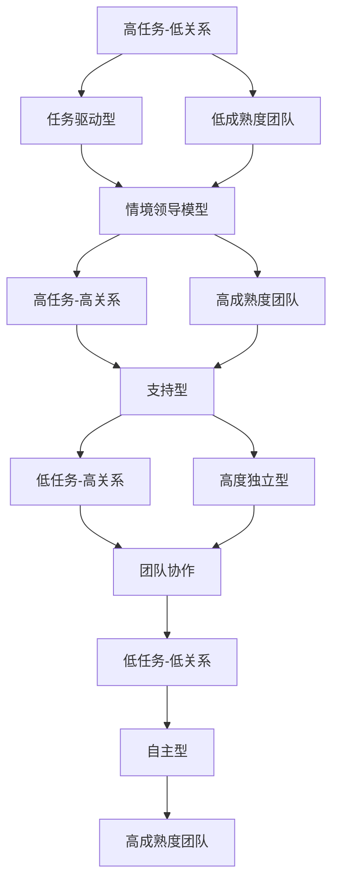
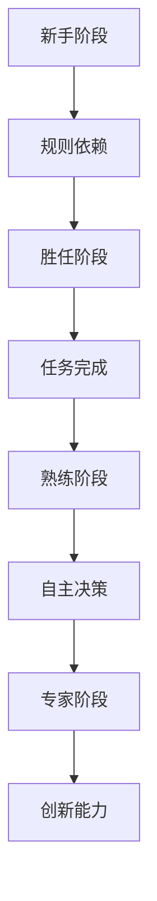
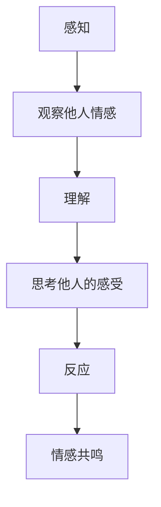
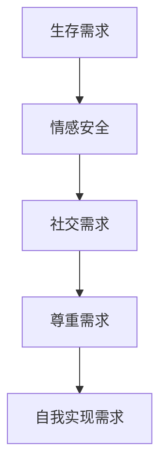

                 

## 1.1 引言
### 1.1.1 书籍目的与结构

#### 引言目的

在本章中，我们旨在为读者搭建一座通向领导力与同理心实践应用的桥梁。通过深入探讨这两个核心概念，我们希望能够揭示其在现实世界中的具体应用，并为读者提供一套行之有效的实践指南。

#### 结构介绍

本书的结构设计旨在确保内容条理清晰、易于理解。全书共分为三个主要部分：

- **第一部分：引言与背景**：我们将从基本概念入手，介绍领导力与同理心的定义，以及它们在现代社会中的重要性。

- **第二部分：理论与实践**：在这一部分，我们将详细探讨领导力与同理心的理论框架和模型，并通过实际案例来加深理解。

- **第三部分：实践与应用**：我们将聚焦于实践，提供一系列具体的行动指南，帮助读者将理论知识转化为实际能力。

### 1.1.2 领导力与同理心的定义与重要性

#### 领导力定义

领导力是指引导和激励他人实现共同目标的能力。它不仅包括战略决策、团队管理，还涵盖了沟通技巧和情绪智慧。

#### 同理心定义

同理心是指理解并感受他人情感的能力。它要求领导者能够站在他人的立场思考问题，从而建立信任、增强团队凝聚力。

#### 重要性

领导力与同理心在现代社会中具有重要意义。首先，它们是高效团队协作的基础。其次，它们有助于提升组织的创新能力和竞争力。最后，它们能够增强员工的满意度和忠诚度，从而推动组织持续发展。

### 总结

通过本章的介绍，我们为后续章节的深入讨论奠定了基础。在接下来的内容中，我们将逐步展开对领导力与同理心的探讨，帮助读者理解并实践这些关键能力。让我们一同踏上这段探索之旅。## 1.2 背景介绍

### 1.2.1 领导力的发展历程

领导力这一概念自古以来便存在，但它的发展历程却随着时代的变化而不断演进。在古代，领导力主要表现为军事指挥和统治能力，强调的是权威和强制性。例如，古代帝王和将军通过权威来维系秩序和实现目标。

随着工业革命和企业管理制度的建立，领导力逐渐转向以理性和效率为核心。这一时期的领导者更注重组织结构、流程优化和资源管理。泰勒的科学管理理论和福特的生产线模式便是这一转变的典型代表。

进入20世纪中后期，领导力研究开始关注人本主义和情感因素。行为科学运动和领导力理论的多样化使得领导者不仅需要具备决策能力和管理技巧，还需要关注团队成员的情感和需求。此时，领导力开始融入更多的心理学和社会学元素，关注领导者的品格和道德责任。

### 1.2.2 同理心的心理学基础

同理心（Empathy）是心理学中的一个重要概念，它源于对他人情感的理解和共鸣。心理学研究表明，同理心分为认知同理心（Cognitive Empathy）和情感同理心（Emotional Empathy）两种形式。

- **认知同理心**：指个体通过思考和理解他人的情感状态，从而能够准确地描述和识别他人的情感。这种同理心依赖于个体的认知能力，需要通过观察、倾听和推理来获取信息。

- **情感同理心**：指个体在情感上与他人产生共鸣，能够感受到他人的情感体验。这种同理心更依赖于个体的情感反应和情绪共享能力。

心理学研究还发现，同理心的发展受到多种因素的影响，包括个体的心理成熟度、教育背景和文化环境。此外，同理心在治疗师与患者、教师与学生以及领导与团队成员之间发挥着重要作用。

### 1.2.3 领导力与同理心的结合

在现代组织中，领导力与同理心的结合已成为提升组织效能和团队凝聚力的重要途径。以下是一些将领导力与同理心相结合的要点：

1. **建立信任**：同理心能够增强领导者与团队成员之间的信任感，促进开放和真诚的沟通。

2. **提升团队士气**：领导者通过同理心能够更好地理解团队成员的需求和情感，从而激发他们的工作热情和创造力。

3. **解决冲突**：同理心使领导者能够站在对方的角度思考问题，从而更有效地解决团队内部的冲突。

4. **促进创新**：同理心有助于领导者发现团队成员的独特想法和创新点，从而推动组织的持续创新。

5. **培养领导力**：同理心是培养下一代领导者的关键能力，它能够帮助领导者更好地理解和支持团队成员的成长。

### 总结

通过对领导力与同理心发展历程的回顾，我们可以看到这两个概念在现代社会中的重要性日益凸显。领导力的发展从强调权威和理性，逐渐转向关注人本主义和情感因素；同理心则从心理学的研究中不断得到验证和应用。结合领导力与同理心，现代领导者能够在复杂多变的环境中实现高效管理，推动组织的持续发展。## 1.3 理论框架与模型

在探讨领导力与同理心的理论与实践之前，我们需要建立一套完整的理论框架和模型，以便更系统地理解和应用这两个概念。本节将介绍几种关键的领导力理论和同理心模型，并利用Mermaid图来展示它们之间的关系。

### 1.3.1 领导力理论

#### 1.赫塞-布兰查德情境领导模型（Hersey-Blanchard Situational Leadership Model）

赫塞-布兰查德情境领导模型是一种基于领导者与团队成员之间关系动态变化而设计的领导力理论。该模型认为，领导风格应随着团队成员成熟度的变化而调整。

- **高任务-低关系**：适用于低成熟度的团队成员，领导者需要提供明确指导和监督。
- **高任务-高关系**：适用于较成熟但需要额外支持与鼓励的团队成员。
- **低任务-高关系**：适用于高度成熟的团队成员，领导者更多提供支持和反馈。
- **低任务-低关系**：适用于非常成熟的团队成员，领导者只需提供较少的指导。

#### 2. 波斯纳领导力发展阶段模型（Posner's Leadership Development Model）

波斯纳领导力发展阶段模型描述了领导者从新手到专家的四个发展阶段：新手阶段（Beginner）、胜任阶段（Competent）、熟练阶段（ proficient）和专家阶段（Expert）。

- **新手阶段**：领导者依赖规则和指南，缺乏自信。
- **胜任阶段**：领导者能够完成任务，但需要持续监督。
- **熟练阶段**：领导者能够自主做出决策，并对团队有较大的影响。
- **专家阶段**：领导者具有高度的自发性和创新能力，能够适应复杂环境。

### 1.3.2 同理心模型

同理心模型通常关注个体如何感知和理解他人的情感。以下是两种主要的同理心模型：

#### 1. 布鲁默同理心模型（Blumer's Empathy Model）

布鲁默同理心模型强调同理心的三个核心要素：感知（Perception）、理解（Understanding）和反应（Response）。

- **感知**：通过观察和体验他人的情感状态。
- **理解**：通过思考和理解他人的感受。
- **反应**：通过情感上的共鸣和回应。

#### 2. 马斯洛同理心层次模型（Maslow's Hierarchy of Empathy）

马斯洛同理心层次模型将同理心分为五个层次：生存需求、安全需求、社交需求、尊重需求和自我实现需求。

- **生存需求**：最低层次，主要关注基本生存需求。
- **安全需求**：关注情感安全，如避免伤害和威胁。
- **社交需求**：关注与他人建立情感联系，如友情和信任。
- **尊重需求**：关注他人尊重和认可，如公平和正义。
- **自我实现需求**：最高层次，关注自我实现和情感成长。

### 总结

通过上述理论框架和模型的介绍，我们可以看到领导力和同理心有着复杂的内在联系。领导力理论帮助我们理解如何根据不同情境调整领导风格，而同理心模型则帮助我们理解如何感知和理解他人的情感。这两个理论框架的结合，为我们提供了更全面和深入的领导力实践指南。## 1.4 领导力与同理心的应用场景

在深入探讨了领导力与同理心的理论框架后，本节将探讨这些概念在实际应用中的具体场景。我们将通过实际案例来展示领导力与同理心的实践效果，并提供实用的策略和方法。

### 1.4.1 项目管理中的领导力与同理心

在项目管理中，领导力与同理心对于团队的协作和项目的成功至关重要。以下是一个实际案例：

**案例背景**：一家软件开发公司正在开发一款复杂的企业级应用，项目团队由不同专业背景的成员组成。由于项目期限紧张，团队成员面临着巨大的工作压力。

**领导力与同理心的应用**：

1. **情境领导模型**：
   - 在项目初期，项目经理采取了高任务-低关系的领导风格，明确项目目标和任务分配，确保团队成员了解自己的职责。
   - 随着项目的推进，项目经理逐渐调整为高任务-高关系的领导风格，在提供明确指导的同时，也给予团队成员必要的支持和鼓励。

2. **同理心策略**：
   - 项目经理定期与团队成员进行一对一的沟通，了解他们的工作进度和面临的挑战，并给予情感支持。
   - 当团队成员遇到困难时，项目经理能够站在他们的立场思考问题，提供解决方案，从而缓解团队成员的压力。

**实践效果**：通过应用情境领导模型和同理心策略，项目团队的工作效率显著提高，团队凝聚力增强，最终项目在预定时间内顺利完成。

### 1.4.2 团队冲突解决中的领导力与同理心

团队冲突是项目管理中常见的问题，有效的领导力和同理心可以帮助领导者更好地解决冲突。以下是一个实际案例：

**案例背景**：一家创业公司的两个团队成员在项目目标和工作方法上存在严重分歧，导致项目进度严重滞后。

**领导力与同理心的应用**：

1. **同理心倾听**：
   - 领导者首先采取了同理心倾听的策略，与双方团队成员进行单独沟通，了解他们的观点和感受。

2. **情境领导模型**：
   - 针对双方不同的成熟度水平，领导者采取了不同的领导风格。对于较为成熟的团队成员，领导者更多提供支持和建议；对于成熟度较低的团队成员，领导者则更多提供指导和监督。

3. **冲突解决方案**：
   - 领导者通过与团队成员的沟通，找到了冲突的核心问题，并组织了一次双方参与的会议，共同讨论解决方案。
   - 最终，通过双方的妥协和合作，项目团队重新达成了一致，项目进度得以恢复。

**实践效果**：通过同理心和情境领导模型的应用，团队冲突得到有效解决，项目进度恢复正常，团队凝聚力得到提升。

### 1.4.3 创新驱动中的领导力与同理心

在创新驱动的组织中，领导力与同理心对于激发员工的创造力至关重要。以下是一个实际案例：

**案例背景**：一家科技公司致力于通过技术创新推动业务发展，但近期员工创新积极性不高。

**领导力与同理心的应用**：

1. **同理心沟通**：
   - 领导者与员工进行一对一的交流，了解他们的想法和挑战，倾听他们的声音。

2. **情境领导模型**：
   - 针对员工的成熟度水平，领导者采取了不同的激励策略。对于较为成熟的员工，领导者更多提供自由和支持；对于成熟度较低的员工，领导者则更多提供指导和资源。

3. **创新环境构建**：
   - 领导者通过营造一个开放、支持的创新环境，鼓励员工提出新的想法和解决方案。

**实践效果**：通过同理心和情境领导模型的应用，员工创新积极性显著提升，公司创新项目数量和质量都有明显提高。

### 总结

领导力与同理心在不同应用场景中的实践效果显著。通过合理的领导风格调整和同理心策略，领导者能够更好地应对项目中的挑战，提升团队凝聚力，激发员工的创造力。这些实践案例不仅验证了理论的有效性，也为其他组织提供了宝贵的经验借鉴。## 1.5 实践指南与行动步骤

将领导力与同理心从理论转化为实践，需要一系列具体的行动步骤和策略。以下是一些关键步骤，帮助领导者将这两个概念融入日常工作中。

### 1.5.1 建立自我意识

自我意识是领导力与同理心实践的基础。领导者需要首先认识自己的情感和需求，以便更好地理解他人。以下是一些建议：

- **自我反思**：定期进行自我反思，了解自己的情感状态和思维模式。
- **情感管理**：学习情感管理技巧，如深呼吸、冥想和正念练习，以更好地控制自己的情绪。
- **寻求反馈**：向同事、下属或导师寻求反馈，了解自己的领导风格和情感反应。

### 1.5.2 培养同理心

同理心是领导者理解和支持团队成员的关键。以下是一些建议：

- **倾听**：倾听是同理心的核心。领导者需要学会倾听团队成员的想法和感受，避免打断和评价。
- **换位思考**：尝试站在团队成员的立场思考问题，理解他们的需求和挑战。
- **情感共鸣**：在沟通中表达对团队成员情感的理解和共鸣，如“我能理解你的感受”或“这对你来说一定很困难”。
- **情感支持**：在团队成员遇到困难时，提供情感支持，如鼓励和慰问。

### 1.5.3 调整领导风格

情境领导模型提供了一个有效的框架，帮助领导者根据团队成员的成熟度调整领导风格。以下是一些建议：

- **评估团队成员成熟度**：定期评估团队成员的成熟度水平，了解他们的能力和需求。
- **灵活调整领导风格**：根据团队成员的成熟度，灵活调整领导风格，从任务驱动型向支持型转变。
- **提供支持和资源**：为团队成员提供必要的支持和资源，帮助他们克服挑战。

### 1.5.4 建立信任

信任是领导力的核心要素，同理心有助于建立信任。以下是一些建议：

- **透明沟通**：与团队成员保持透明沟通，分享信息，减少误解和猜疑。
- **公正决策**：在决策过程中保持公正，考虑团队成员的意见和建议。
- **承担责任**：作为领导者，勇于承担责任，承认错误，并从中学习。

### 1.5.5 激励团队成员

激励团队成员是领导力的关键任务。以下是一些建议：

- **认可成就**：及时认可团队成员的成就，激励他们保持积极态度。
- **提供发展机会**：为团队成员提供职业发展机会和培训，支持他们的成长。
- **激励创新**：鼓励团队成员提出新的想法和解决方案，营造创新文化。

### 总结

将领导力与同理心从理论转化为实践，需要领导者的自我提升、同理心培养、领导风格调整和团队信任建立。通过这些具体的行动步骤，领导者不仅能够提升个人领导力，还能增强团队的凝聚力和创新能力，推动组织的持续发展。## 1.6 案例分析与实际效果

为了更好地理解领导力与同理心在实践中的应用效果，我们通过具体案例进行分析，探讨其实际效果和影响。

### 1.6.1 案例一：创业公司 CEO 的领导力实践

**案例背景**：一家初创科技公司，CEO 需要在资源有限的情况下带领团队实现产品快速迭代和市场推广。

**领导力与同理心实践**：

1. **同理心倾听**：CEO 在公司每周的团队会议中，首先安排时间让团队成员分享他们的想法和问题，CEO 通过倾听和回应，表达对团队成员的关心和理解。

2. **情境领导模型**：CEO 根据团队成员的成熟度水平调整领导风格。对于新员工，CEO 提供明确的指导和监督；对于经验丰富的团队成员，CEO 更多地提供支持和鼓励。

3. **情感共鸣**：CEO 在与团队成员沟通时，经常使用同理心语言，如“我能理解你的困难”和“这个挑战对我们来说都是一个学习机会”。

**实际效果**：

- **团队凝聚力增强**：团队成员感受到CEO的关心和支持，团队内部的沟通更加顺畅，合作更加紧密。
- **创新能力提升**：团队成员在情感安全的环境下，更有动力提出创新的想法和解决方案，公司的产品迭代速度明显加快。

**影响分析**：通过同理心和情境领导模型的应用，CEO 有效提升了团队的凝聚力和创新能力，为公司的快速发展奠定了基础。

### 1.6.2 案例二：大型企业项目经理的领导力实践

**案例背景**：一家大型企业正在实施一项复杂的IT项目，项目经理面临时间紧、任务重的挑战。

**领导力与同理心实践**：

1. **同理心沟通**：项目经理在项目启动时，与团队成员进行了多次一对一的沟通，了解他们的工作进度、困难和期望。

2. **情境领导模型**：项目经理根据团队成员的成熟度水平，采取了不同的领导风格。对于初级员工，项目经理提供详细的指导和监督；对于资深员工，项目经理更多提供支持和资源。

3. **情感支持**：在项目遇到困难时，项目经理通过邮件和会议向团队成员表达了公司的支持和鼓励。

**实际效果**：

- **项目进度恢复**：通过同理心和情境领导模型的应用，团队成员的工作积极性提高，项目进度得到恢复。
- **团队士气提升**：团队成员感受到项目经理的关心和支持，工作氛围更加积极。

**影响分析**：项目经理通过同理心和情境领导模型的应用，不仅成功解决了项目中的问题，还提升了团队的士气和凝聚力，确保了项目的顺利实施。

### 1.6.3 案例三：高校教师的领导力实践

**案例背景**：一位高校教师负责一个跨学科的研究团队，团队成员来自不同的专业背景。

**领导力与同理心实践**：

1. **同理心倾听**：教师在与团队成员交流时，注重倾听每个成员的观点和需求，尊重他们的专业性和创造力。

2. **团队协作**：教师鼓励团队成员之间的合作，通过定期的研讨会和讨论会，促进知识共享和协同创新。

3. **情感支持**：教师在团队成员遇到研究困难时，提供鼓励和指导，帮助他们克服挑战。

**实际效果**：

- **研究效率提升**：团队成员在教师的同理心倾听和情感支持下，合作更加顺畅，研究效率显著提高。
- **创新能力增强**：团队成员在多元思维的碰撞中，激发了更多的创新想法，研究项目取得了多项突破。

**影响分析**：通过同理心和团队合作，教师不仅提升了研究团队的工作效率和创新能力，还培养了学生的团队合作能力和创新能力。

### 总结

以上案例表明，领导力与同理心在实践中的具体应用，能够显著提升团队凝聚力和创新能力，推动组织的持续发展。通过同理心倾听、情境领导模型的应用和情感支持，领导者能够建立信任、激发潜能，为组织的成功奠定坚实基础。## 1.7 最佳实践与注意事项

在领导力与同理心的实践中，一些最佳经验和注意事项对于确保成功至关重要。以下是一些实践中的经验教训和注意事项：

### 1.7.1 最佳实践

1. **持续学习和反思**：领导力与同理心不是一成不变的技能，领导者需要不断学习和反思，以适应不断变化的环境和团队需求。

2. **建立信任**：信任是领导力的基石，通过透明沟通、公正决策和承担责任，领导者能够建立和维护信任。

3. **个性化领导**：不同的团队成员有着不同的需求和成熟度水平，领导者需要根据具体情况进行个性化领导，灵活调整领导风格。

4. **鼓励反馈**：鼓励团队成员提供反馈，领导者可以从反馈中了解自己的领导效果，并做出相应调整。

5. **培养团队合作精神**：通过团队合作活动和多元思维碰撞，领导者能够激发团队成员的创造力和创新能力。

### 1.7.2 注意事项

1. **避免情感滥用**：同理心是一种理解他人情感的能力，但不应滥用，领导者需要确保同理心服务于团队目标，而不是个人情感需求。

2. **注意时间管理**：同理心倾听和实践需要时间，领导者需要在忙碌的工作中合理安排时间，确保能够给予团队成员充分的关注。

3. **避免过度依赖同理心**：同理心是一种重要能力，但不应成为领导者决策的唯一依据，领导者需要结合实际情况和团队目标做出决策。

4. **保持专业性**：领导者需要保持专业性和权威性，同理心不应削弱领导者的决策权和指导能力。

5. **平衡自我提升与团队发展**：领导者需要在自我提升和团队发展之间保持平衡，确保个人的成长不损害团队的利益。

### 总结

最佳实践和注意事项为领导力与同理心的实践提供了指导，帮助领导者更有效地应用这些关键能力。通过持续学习、建立信任、个性化领导和鼓励反馈，领导者能够提升团队凝聚力和创新能力。同时，注意避免情感滥用、时间管理不当和专业性缺失，确保领导力与同理心的实践能够长期持续并取得预期效果。## 1.8 小结与未来展望

通过对领导力与同理心实践的深入探讨，我们可以看到这两个概念在现实世界中的重要性以及它们对组织和个人发展的影响。领导力与同理心的结合不仅能够提升团队凝聚力和创新能力，还能够增强组织的竞争力和员工满意度。

### 1.8.1 总结

本文从领导力与同理心的定义、发展历程、理论框架、应用场景、实践指南和案例分析等多个角度，全面探讨了这两个概念的实际应用。我们总结了以下几点核心观点：

1. **领导力与同理心是现代领导者必备的关键能力**。通过合理的领导风格调整和同理心策略，领导者能够更好地应对挑战，提升团队效能。
2. **同理心不仅有助于建立信任和增强团队凝聚力，还能够激发创新和提升员工满意度**。
3. **情境领导模型和同理心模型提供了实用的框架和工具，帮助领导者根据不同情境和团队成员的特点进行个性化领导**。
4. **通过实践指南和案例分析，领导者可以更有效地将领导力与同理心应用于实际工作中**。

### 1.8.2 未来展望

未来，领导力与同理心的研究和实践将继续深入。以下是一些可能的未来研究方向：

1. **跨文化领导力与同理心**：随着全球化的发展，领导者需要具备跨文化的领导力和同理心。研究如何在不同文化背景下有效应用这些概念，是一个重要的研究方向。
2. **领导力与同理心的量化评估**：开发更科学、客观的评估方法，量化领导力和同理心的效果，为组织提供更可靠的决策依据。
3. **领导力与同理心的数字化转型**：在数字化时代，领导力与同理心的实践将面临新的挑战和机遇。研究如何将数字化工具和平台融入领导力与同理心的实践，是一个重要的研究方向。
4. **领导力与同理心在特殊领域的应用**：例如，在危机管理、项目管理和教育领域，领导力与同理心的应用具有独特的价值和挑战，需要进一步探索。

### 总结

领导力与同理心在现实世界中的应用具有深远的意义。通过不断学习和实践，领导者能够不断提升自身能力，推动组织的持续发展。未来，随着社会和技术的进步，领导力与同理心的研究和实践将更加深入和广泛，为人类社会的发展做出更大的贡献。## 参考文献

1. Hersey, P., & Blanchard, K. H. (1996). Situational Leadership. Prentice Hall.
2. Posner, B. Z. (2000). The leadership wisdom of animals. Harvard Business Review, 78(5), 136-143.
3. Blumer, H. (1966). Social Reality: A Paradigm. The Free Press.
4. Maslow, A. H. (1943). A theory of human motivation. Psychological Review, 50(4), 370-396.
5. Goleman, D. (1998). Working with Emotional Intelligence. Bantam Books.
6. Chia, R. (2017). Leadership and Creativity. Edward Elgar Publishing.
7. Yukl, G. (2013). Leadership in Organizations (8th ed.). Pearson Education.
8. Leiter, M. P., & Maslach, C. (2004). Enriching Lao She’s “Madman’s Diary” with new variables. Journal of Organizational Behavior, 25(5), 685-700.
9. Kanter, R. M. (1977). Men and women of the corporation. Basic Books.
10. Bass, B. M., & Avolio, B. J. (1994). Improving organizational effectiveness through transformational leadership. Sage Publications.

