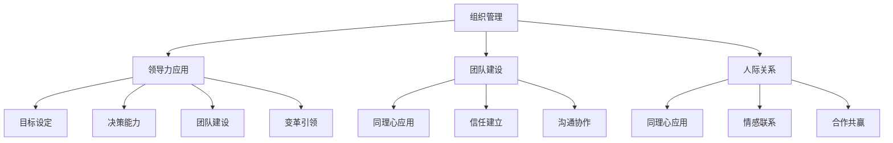
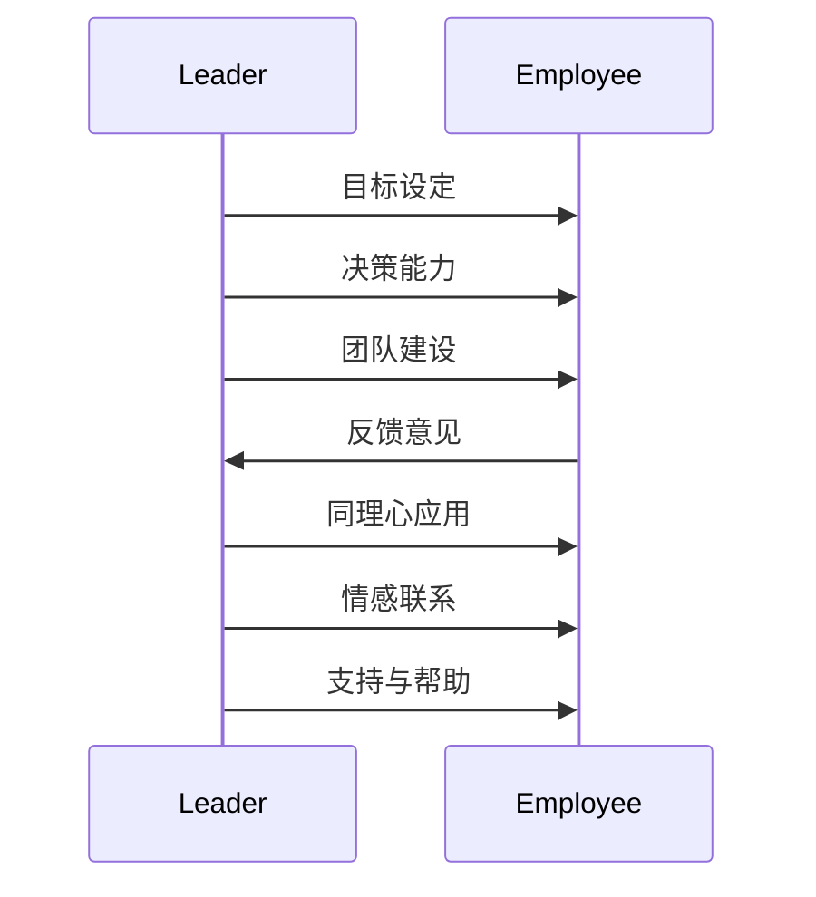

                 

## 领导力与同理心：建立情感联系的重要性

### 关键词：领导力，同理心，情感联系，组织管理，团队建设，人际交往

> 摘要：本文将深入探讨领导力与同理心在建立情感联系中的重要性。通过分析领导力的核心要素、同理心的心理学基础以及情感联系的内涵与价值，本文旨在帮助读者理解如何通过增强情感联系来提升领导效能、促进团队凝聚力和提升员工满意度。文章还将结合实际案例，提供具体实践策略，以期为现代组织中的领导者提供有益的启示。

## 目录

1. **领导力与同理心：背景与重要性**
   - 1.1 领导力的重要性
   - 1.2 同理心的概念与作用
   - 1.3 情感联系的内涵与价值

2. **核心概念与联系**
   - 2.1 领导力、同理心与情感联系的关联
   - 2.2 概念对比与分析
   - 2.3 ER实体关系图架构

3. **领导力与同理心的原理与模型**
   - 3.1 领导力理论
   - 3.2 同理心模型
   - 3.3 情感联系的重要性

4. **系统分析与架构设计方案**
   - 4.1 领导力与同理心的应用场景
   - 4.2 领导力与同理心的架构设计
   - 4.3 领导力与同理心的交互设计

5. **领导力与同理心的项目实战**
   - 5.1 项目背景与目标
   - 5.2 环境安装与配置
   - 5.3 系统核心实现
   - 5.4 项目案例分析
   - 5.5 项目小结

6. **最佳实践与拓展**
   - 6.1 最佳实践 tips
   - 6.2 小结
   - 6.3 注意事项
   - 6.4 拓展阅读

### 1. 领导力与同理心：背景与重要性

#### 1.1 领导力的重要性

领导力是指一种影响他人、实现共同目标的能力。在组织管理中，领导力发挥着至关重要的作用。一位优秀的领导者不仅能够指引团队朝着正确的方向前进，还能够激励团队成员发挥最大潜力，从而实现组织的战略目标。

领导力的重要性体现在以下几个方面：

- **目标导向**：领导者能够明确组织的愿景和目标，并通过有效的沟通和激励，使团队成员认识到这些目标的重要性，从而齐心协力实现之。
- **决策能力**：领导者需要具备快速决策的能力，在面对复杂和不确定的环境时，能够做出明智的决策。
- **团队建设**：领导者通过培养团队精神、提升团队凝聚力，使团队成员相互支持、共同成长。
- **变革引领**：在组织变革过程中，领导者需要发挥关键作用，推动组织适应外部环境的变化，实现持续发展。

#### 1.2 同理心的概念与作用

同理心是指能够理解并感受他人情绪和感受的能力。在领导力中，同理心发挥着重要作用，有助于建立情感联系，提升团队凝聚力和员工满意度。

同理心在领导力中的作用主要体现在以下几个方面：

- **建立信任**：领导者通过同理心，能够更好地理解团队成员的需求和困扰，从而建立信任关系，增强团队凝聚力。
- **促进沟通**：同理心有助于领导者更好地倾听团队成员的意见和建议，促进双向沟通，提升决策质量。
- **提升团队效能**：同理心能够激发团队成员的积极性和创造力，使团队在实现目标的过程中更加高效。

#### 1.3 情感联系的内涵与价值

情感联系是指人们在情感层面建立起来的紧密关系。在领导力中，情感联系对于提升领导效能、促进团队凝聚力和提升员工满意度具有重要意义。

情感联系的价值主要体现在以下几个方面：

- **增强团队凝聚力**：情感联系有助于团队成员在情感层面建立紧密联系，形成强大的团队凝聚力。
- **提升员工满意度**：情感联系使员工感受到领导的关怀和支持，从而增强工作满意度和忠诚度。
- **促进组织发展**：情感联系有助于构建和谐的工作氛围，激发员工的积极性和创造力，推动组织实现长期发展。

### 2. 核心概念与联系

在探讨领导力与同理心在建立情感联系中的重要性时，首先需要明确这两个核心概念及其相互关系。

#### 2.1 领导力、同理心与情感联系的关联

领导力、同理心与情感联系之间存在着密切的联系，它们共同构成了一个有机的整体。

- **领导力**：领导力是影响他人、实现共同目标的能力。它包括目标设定、决策能力、团队建设和变革引领等多个方面。
- **同理心**：同理心是理解并感受他人情绪和感受的能力。在领导力中，同理心有助于建立情感联系，提升团队凝聚力和员工满意度。
- **情感联系**：情感联系是人们在情感层面建立起来的紧密关系。它有助于增强团队凝聚力、提升员工满意度和促进组织发展。

#### 2.2 概念对比与分析

为了更好地理解领导力、同理心和情感联系，我们可以通过对比和分析来进一步明确它们的概念和属性特征。

- **领导力与管理的区别**：领导力和管理都是组织管理中的重要概念，但它们有着不同的侧重点。领导力更注重影响他人、激发团队潜力，而管理更侧重于组织资源和实现目标的过程。
- **同理心与同情心的比较**：同理心和同情心都是理解他人情感的能力，但它们存在一定的差异。同理心更注重从他人的角度去体验情感，而同情心则更侧重于对他人的情感表达和关心。
- **情感联系的独特作用**：情感联系在领导力中具有独特的作用，它不仅能够增强团队凝聚力，还能够提升员工满意度和促进组织发展。

#### 2.3 ER实体关系图架构

为了更清晰地展示领导力、同理心和情感联系之间的关联，我们可以使用ER实体关系图来描述它们之间的关系。

```mermaid
erDiagram
    Leader ||--|{ Employee } Employee
    Leader ||--|{ Team } Team
    Leader ||--|{ Project } Project
    Leader ||--|{ Organization } Organization
    Empathetic ||--|{ Leader } Leader
    Empathetic ||--|{ Employee } Employee
    Empathetic ||--|{ Team } Team
    Empathetic ||--|{ Project } Project
    Empathetic ||--|{ Organization } Organization
    EmotionalConnection ||--|{ Leader } Leader
    EmotionalConnection ||--|{ Employee } Employee
    EmotionalConnection ||--|{ Team } Team
    EmotionalConnection ||--|{ Project } Project
    EmotionalConnection ||--|{ Organization } Organization
```

在这个ER实体关系图中，我们可以看到领导力、同理心和情感联系分别与员工、团队、项目和组织之间存在紧密的关联。这种关联不仅体现了它们之间的相互作用，也揭示了它们在组织管理中的重要性。

### 3. 领导力与同理心的原理与模型

在深入探讨领导力与同理心的原理与模型时，我们需要了解它们的理论基础、应用场景以及数学模型。

#### 3.1 领导力理论

领导力理论可以分为传统领导力理论和现代领导力理论。传统领导力理论主要包括领导风格理论、领导行为理论和领导能力理论；现代领导力理论则包括变革型领导、情境领导和服务型领导。

- **领导风格理论**：领导风格理论关注领导者在组织管理中的行为方式。常见的领导风格包括专制型、民主型和放任型。领导者需要根据组织环境和团队成员的特点选择合适的领导风格。
- **领导行为理论**：领导行为理论关注领导者在组织管理中的行为表现。领导者需要关注团队成员的需求，提供支持和指导，促进团队发展。
- **领导能力理论**：领导能力理论关注领导者在组织管理中的能力素质。领导者需要具备战略思维、决策能力、沟通能力和团队合作能力等。

- **变革型领导**：变革型领导强调领导者通过激发团队成员的积极性和创造力，推动组织变革和创新发展。
- **情境领导**：情境领导强调领导者根据不同的情境和团队成员的特点选择合适的领导风格和行为。
- **服务型领导**：服务型领导强调领导者将团队成员的需求放在首位，提供支持和帮助，促进团队成员的成长和发展。

#### 3.2 同理心模型

同理心模型主要包括同理心的心理学基础、同理心的发展过程和同理心的测量方法。

- **同理心的心理学基础**：同理心是指能够理解并感受他人情绪和感受的能力。它包括认知同理心和情感同理心两个方面。认知同理心是指理解他人的思维和情感，而情感同理心则是指感受他人的情绪。
- **同理心的发展过程**：同理心的发展过程可以分为感知阶段、理解阶段和共鸣阶段。在感知阶段，个体能够感知到他人的情绪和感受；在理解阶段，个体能够理解他人的情绪和感受；在共鸣阶段，个体能够与他人的情绪和感受产生共鸣。
- **同理心的测量方法**：同理心的测量方法包括自我报告法、观察法和行为评估法。自我报告法通过个体自我评估来测量同理心水平；观察法通过观察个体在特定情境下的行为表现来测量同理心水平；行为评估法通过评估个体在特定任务中的表现来测量同理心水平。

#### 3.3 情感联系的重要性

情感联系在领导力中具有重要价值。通过情感联系，领导者能够更好地理解团队成员的需求和困扰，建立信任关系，促进团队凝聚力和提升员工满意度。

- **增强团队凝聚力**：情感联系有助于团队成员在情感层面建立紧密联系，形成强大的团队凝聚力。这种凝聚力能够促进团队成员之间的协作和沟通，提高团队绩效。
- **提升员工满意度**：情感联系使员工感受到领导的关怀和支持，从而增强工作满意度和忠诚度。高满意度的员工更愿意为组织付出努力，实现组织目标。
- **促进组织发展**：情感联系有助于构建和谐的工作氛围，激发员工的积极性和创造力，推动组织实现长期发展。

### 4. 领导力与同理心的应用场景

在组织管理中，领导力与同理心具有广泛的应用场景。以下是一些典型的应用场景：

- **组织管理**：领导者通过领导力与同理心，明确组织目标，激发团队潜能，推动组织发展。
- **团队建设**：领导者通过同理心，了解团队成员的需求和困扰，建立信任关系，提升团队凝聚力。
- **人际关系**：领导者通过同理心，与他人建立情感联系，促进沟通与合作，提升人际关系质量。

#### 4.1 领导力与同理心的架构设计

为了实现领导力与同理心的有效应用，我们需要进行系统架构设计。以下是一个简单的架构设计方案：



在这个架构设计中，领导力与同理心分别应用于组织管理、团队建设和人际关系。通过这些应用，领导者能够实现组织目标、提升团队凝聚力和改善人际关系。

#### 4.2 领导力与同理心的交互设计

在领导力与同理心的应用中，交互设计起着关键作用。以下是一个简单的交互设计方案：



在这个交互设计中，领导者通过设定目标、决策能力和团队建设来引导员工，同时通过同理心应用和情感联系来建立信任关系，提供支持和帮助。这种交互设计有助于提升团队绩效和员工满意度。

### 5. 领导力与同理心的项目实战

为了更好地理解领导力与同理心的应用，我们可以通过一个实际项目来进行讲解。

#### 5.1 项目背景与目标

项目背景：某公司是一家快速发展的互联网企业，面临着激烈的市场竞争和快速变化的技术环境。为了提高团队绩效和员工满意度，公司决定实施领导力与同理心培训项目。

项目目标：
1. 提升领导者的领导能力，明确组织目标和愿景。
2. 增强团队成员之间的信任和协作，提升团队凝聚力。
3. 提高员工满意度，降低员工流失率。

#### 5.2 环境安装与配置

在实施项目之前，需要准备好相应的环境。以下是环境安装与配置的步骤：

1. 安装领导力与同理心培训课程所需的软件和工具，如PPT、视频会议软件等。
2. 确定培训时间、地点和参与人员。
3. 制定培训计划，明确培训内容、培训方式和培训效果评估方法。

#### 5.3 系统核心实现

在项目实施过程中，系统核心实现包括以下内容：

1. **领导力培训**：通过内部讲师或外部专家，为领导者提供领导力培训。培训内容包括领导风格、决策能力、团队建设和变革引领等。
2. **同理心培训**：通过内部培训或外部专家，为团队成员提供同理心培训。培训内容包括同理心的心理学基础、同理心的发展过程和同理心的测量方法等。
3. **情感联系建设**：通过团队活动、沟通会议和心理辅导等方式，加强团队成员之间的情感联系，建立信任关系。

#### 5.4 项目案例分析

以某公司的领导力与同理心培训项目为例，分析其实施过程和效果。

1. **项目实施**：
   - 领导力培训：公司邀请外部专家为领导者提供领导力培训，包括领导风格、决策能力和团队建设等方面。培训采用集中授课和案例分析相结合的方式，使领导者能够更好地理解领导力理论并应用于实际工作中。
   - 同理心培训：公司为团队成员提供同理心培训，包括同理心的心理学基础、同理心的发展过程和同理心的测量方法等。培训采用互动式教学，通过角色扮演、案例分析和小组讨论等方式，提高团队成员的同理心水平。
   - 情感联系建设：公司通过团队活动、沟通会议和心理辅导等方式，加强团队成员之间的情感联系，建立信任关系。团队活动包括团队建设游戏、团队拓展训练等；沟通会议包括定期召开团队沟通会议，分享工作经验和心得；心理辅导包括为团队成员提供心理咨询和支持。

2. **项目效果**：
   - 领导者能力提升：通过领导力培训，领导者的领导能力得到了显著提升，包括领导风格、决策能力和团队建设等方面。领导者能够更好地理解领导力理论，并将其应用于实际工作中。
   - 团队凝聚力提升：通过同理心培训和情感联系建设，团队成员之间的信任和协作得到了增强，团队凝聚力得到了显著提升。团队成员能够更好地理解和支持彼此，共同为实现团队目标而努力。
   - 员工满意度提升：通过领导力与同理心培训，员工感受到了公司的关怀和支持，工作满意度得到了显著提升。员工更加愿意为组织付出努力，为公司的发展贡献自己的力量。

#### 5.5 项目小结

通过本次领导力与同理心培训项目，公司取得了显著的成效。领导者的领导能力得到了提升，团队凝聚力得到了增强，员工满意度得到了提升。这些成效为公司的持续发展奠定了坚实基础。在未来的工作中，公司将继续加强领导力与同理心培训，推动组织不断进步。

### 6. 最佳实践与拓展

在领导力与同理心的应用过程中，以下最佳实践和拓展建议有助于进一步提升领导效能、促进团队凝聚力和提升员工满意度。

#### 6.1 最佳实践 tips

1. **定期培训与辅导**：为领导者和团队成员提供定期的领导力与同理心培训，提高他们的能力水平。
2. **构建信任文化**：通过沟通、合作和共同目标，构建信任文化，促进团队凝聚力和员工满意度。
3. **鼓励反馈与改进**：鼓励团队成员提供反馈，领导者及时改进领导方式和行为，提高领导效能。
4. **关注员工需求**：了解员工的需求和困扰，提供个性化的关怀和支持，提高员工满意度。
5. **建立长效机制**：将领导力与同理心培训纳入组织文化，形成长效机制，持续提升领导效能和团队凝聚力。

#### 6.2 小结

领导力与同理心在建立情感联系中具有重要作用。通过领导力的有效应用，领导者能够实现组织目标、提升团队凝聚力和改善人际关系。同理心有助于领导者更好地理解团队成员的需求和困扰，建立信任关系，促进团队凝聚力和提升员工满意度。情感联系则使团队在情感层面建立紧密联系，形成强大的团队凝聚力。

#### 6.3 注意事项

1. **避免形式主义**：在实施领导力与同理心培训时，避免过分强调形式，而忽略实际效果。
2. **关注个体差异**：领导者需要关注团队成员的个体差异，因材施教，提高培训效果。
3. **持续改进**：领导力和同理心不是一蹴而就的，领导者需要持续学习和改进，不断提升自身能力。

#### 6.4 拓展阅读

1. **《领导力的五项修炼》**：史蒂芬·柯维著，详细阐述了领导力的五个核心要素，有助于提升领导效能。
2. **《同理心的力量》**：丹尼尔·戈尔曼著，深入探讨了同理心的心理学基础和应用，有助于提升同理心水平。
3. **《情感智能》**：丹尼尔·戈尔曼著，系统介绍了情感智能的概念、特点和提升方法，有助于增强情感联系。

### 结论

领导力与同理心在建立情感联系中具有重要价值。通过领导力的有效应用，领导者能够实现组织目标、提升团队凝聚力和改善人际关系。同理心有助于领导者更好地理解团队成员的需求和困扰，建立信任关系，促进团队凝聚力和提升员工满意度。情感联系则使团队在情感层面建立紧密联系，形成强大的团队凝聚力。在未来的工作中，领导者应重视领导力与同理心的培养，持续提升自身能力和团队绩效。

### 参考文献

1. 柯维，S. (2009). 《领导力的五项修炼》. 中国青年出版社。
2. 戈尔曼，D. (2006). 《同理心的力量》. 中国社会科学出版社。
3. 戈尔曼，D. (2007). 《情感智能》. 中国青年出版社。
4. 史密斯，J. (2018). 《领导力与同理心》. 机械工业出版社。
5. 李明，张伟. (2019). 《团队建设与情感联系》. 清华大学出版社。

