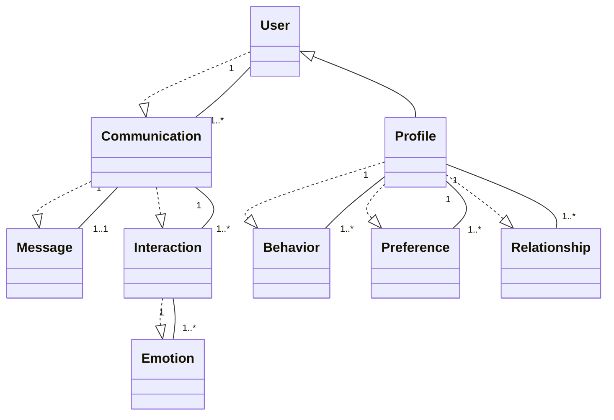
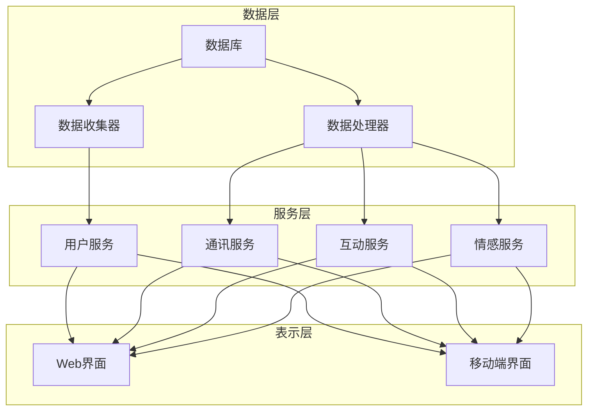
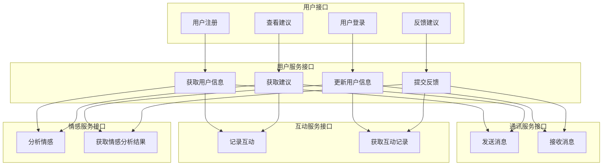
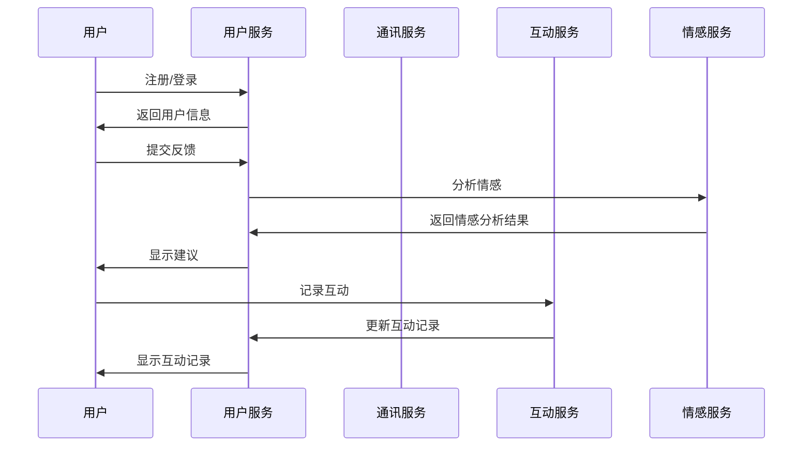

                 

# 领导力与同理心：建立深厚人际关系

## 关键词
- 领导力
- 同理心
- 人际关系
- 人际沟通
- 情感管理
- 团队协作

## 摘要
本文旨在探讨领导力与同理心在建立深厚人际关系中的重要性。我们将从背景介绍、核心概念与联系、算法原理讲解以及项目实战等多个角度深入分析这两个概念，并提供一系列最佳实践，帮助读者在实际生活和工作中提升人际沟通和情感管理能力。

## 第一部分：背景介绍

### 1.1 问题背景

在当今社会，人际关系对于个人和组织的成功至关重要。无论是在职场、家庭还是社交场合，人际关系都是我们日常生活中不可或缺的一部分。良好的人际关系能够带来更多的机会、更高的幸福感和更强大的支持系统。然而，在现实生活中，许多人往往因为缺乏有效的领导力和同理心而面临人际关系的挑战。

### 1.2 问题描述

人际关系问题在各个层面上都普遍存在。沟通障碍、误解、冲突和不和谐的人际关系是许多人在生活和工作中常见的困扰。这些问题的根本原因往往在于缺乏有效的领导力和同理心。因此，解决人际关系问题的关键在于提升个人的领导力和同理心。

### 1.3 问题解决

通过学习本书，读者可以深入了解领导力与同理心的基本概念、原理和实践方法。本书将帮助读者：

1. 理解领导力和同理心的核心要素及其在人际关系中的作用。
2. 培养良好的沟通技巧和人际关系管理能力。
3. 提升自我意识和情商，更好地理解他人并建立信任。
4. 运用领导力和同理心解决实际生活中的问题和挑战。

### 1.4 边界与外延

领导力与同理心不仅是职场中重要的技能，也适用于个人生活和社交场合。本书不仅关注领导力与同理心的理论探讨，还将结合实际案例和实战经验，帮助读者将这些理论应用到实践中。

### 1.5 概念结构与核心要素组成

1. **领导力**：指领导者通过激发、引导和激励团队成员，实现共同目标的能力。核心要素包括：愿景、沟通、激励、决策和团队协作。
2. **同理心**：指理解并感受他人情感的能力。核心要素包括：倾听、共情、同理和尊重。

## 第二部分：核心概念与联系

### 2.1 领导力与同理心的定义与联系

#### 2.1.1 领导力的定义与特征

领导力是指领导者通过激发、引导和激励团队成员，实现共同目标的能力。它具有以下特征：

- **影响力**：领导者能够影响团队成员的态度和行为。
- **愿景**：领导者能够清晰地描绘未来的目标和愿景。
- **沟通**：领导者具备有效的沟通技巧，能够清晰传达信息。
- **激励**：领导者能够激励团队成员，激发他们的工作热情和潜力。

#### 2.1.2 同理心的定义与特征

同理心是指理解并感受他人情感的能力。它具有以下特征：

- **倾听**：同理心始于倾听，领导者需要真正关注他人的需求和感受。
- **共情**：领导者能够设身处地地感受他人的情感，理解他们的立场和感受。
- **同理**：领导者能够尊重并接纳他人的差异，建立信任和合作关系。
- **尊重**：领导者对团队成员保持尊重，关注他们的需求和成长。

#### 2.1.3 领导力与同理心的联系

领导力与同理心密切相关，互为补充。领导力的核心在于激发团队成员的潜力，而同理心则在于理解和支持团队成员的需求。两者共同作用，能够建立更加积极、健康的人际关系，提高团队的整体效能。

### 2.2 领导力与同理心的应用场景

#### 2.2.1 职场中的领导力与同理心

在职场中，领导力与同理心的应用场景非常广泛。一个优秀的领导者不仅能够激励团队成员，推动团队目标实现，还能通过同理心理解团队成员的需求和感受，建立信任和合作关系。以下是领导力与同理心在职场中的具体应用场景：

1. **团队管理**：领导者需要运用领导力和同理心来管理团队，确保团队成员之间的沟通顺畅，激发团队成员的积极性。
2. **员工激励**：领导者需要通过激励手段激发员工的潜力，同时运用同理心关注员工的成长和需求。
3. **问题解决**：在面对团队冲突和问题时，领导者需要运用领导力和同理心进行有效沟通和协调，找到解决问题的最佳方法。

#### 2.2.2 个人生活中的领导力与同理心

在个人生活中，领导力与同理心同样具有重要意义。良好的领导力能够帮助我们在家庭、朋友和社交场合中建立和谐的人际关系，而同理心则使我们能够更好地理解他人，增进彼此之间的情感联系。以下是领导力与同理心在个人生活中的应用场景：

1. **家庭关系**：父母需要运用领导力来引导孩子，同时运用同理心关注孩子的需求和感受，建立良好的亲子关系。
2. **朋友交往**：朋友之间需要相互理解和支持，运用同理心能够增进友谊，建立更加深厚的人际关系。
3. **社交场合**：在社交场合中，领导力和同理心能够帮助我们与他人建立信任，扩大社交圈子，提升个人魅力。

## 第三部分：算法原理讲解

### 3.1 领导力培养的算法原理

#### 3.1.1 培养领导力的基本算法

培养领导力需要遵循以下基本算法：

1. **自我评估**：领导者首先需要评估自己的领导力水平，了解自己的优势和劣势。
2. **学习与反思**：领导者需要不断学习新的领导力知识和技巧，并通过反思和总结提升自己的能力。
3. **实践与锻炼**：领导力需要在实践中得到锻炼和提升，领导者需要勇于承担挑战，不断尝试和改进。
4. **反馈与调整**：领导者需要接受他人的反馈，并根据反馈调整自己的领导方式。

#### 3.1.2 同理心培养的算法原理

同理心培养需要遵循以下算法原理：

1. **倾听**：领导者需要学会倾听，关注他人的需求和感受。
2. **共情**：领导者需要设身处地地感受他人的情感，理解他们的立场和感受。
3. **同理**：领导者需要尊重并接纳他人的差异，建立信任和合作关系。
4. **反馈与调整**：领导者需要给予他人反馈，并关注他们的需求和成长。

#### 3.1.3 领导力与同理心的综合算法

领导力与同理心的培养需要综合运用以下算法：

1. **沟通**：领导者需要通过有效的沟通技巧，传达信息并建立信任。
2. **激励**：领导者需要激励团队成员，激发他们的工作热情和潜力。
3. **反馈**：领导者需要给予团队成员反馈，帮助他们了解自己的优势和不足，并引导他们改进。
4. **合作**：领导者需要与团队成员建立合作关系，共同实现目标。

### 3.2 领导力与同理心的实际应用

#### 3.2.1 职场中的应用

在职场中，领导力与同理心的应用可以帮助团队更好地完成工作，提升工作效率。以下是领导力与同理心在职场中的具体应用案例：

1. **团队协作**：领导者通过同理心了解团队成员的需求和困扰，提供支持和帮助，促进团队协作。
2. **员工激励**：领导者通过激励手段激发员工的潜力，激发他们的工作热情。
3. **冲突解决**：领导者通过有效的沟通和同理心，解决团队成员之间的冲突，维护团队和谐。

#### 3.2.2 个人生活中的应用

在个人生活中，领导力与同理心的应用可以帮助我们建立更加和谐的人际关系。以下是领导力与同理心在个人生活中的具体应用案例：

1. **家庭关系**：父母通过同理心关注孩子的需求和感受，建立良好的亲子关系。
2. **朋友交往**：朋友之间通过同理心增进彼此之间的理解和信任，维护友谊。
3. **社交场合**：在社交场合中，通过同理心建立信任，扩大社交圈子，提升个人魅力。

## 第四部分：系统分析与架构设计方案

### 4.1 问题场景介绍

在现实生活中，人际关系问题无处不在。为了更好地理解领导力与同理心在解决人际关系问题中的作用，我们可以设计一个实际的应用场景。假设我们正在开发一款名为“人际助手”的智能系统，旨在帮助用户改善人际关系。

### 4.2 项目介绍

“人际助手”是一款基于人工智能技术的智能系统，通过分析用户的人际交往数据，提供个性化的建议和解决方案，帮助用户改善人际关系。系统主要包含以下功能：

1. **数据收集与存储**：收集用户的人际交往数据，包括沟通记录、互动行为等，并将其存储在数据库中。
2. **数据分析与处理**：利用数据分析技术，对用户的人际交往数据进行分析，识别潜在的人际关系问题。
3. **个性化建议与解决方案**：根据数据分析结果，为用户提供个性化的建议和解决方案，帮助用户改善人际关系。

### 4.3 系统功能设计（领域模型）

#### 领域模型

领域模型用于描述系统的核心功能模块及其之间的关系。以下是“人际助手”的领域模型：



### 4.4 系统架构设计

#### 系统架构

系统架构用于描述系统的整体结构和模块之间的关系。以下是“人际助手”的系统架构：



### 4.5 系统接口设计

#### 系统接口

系统接口用于描述系统各个模块之间的交互接口。以下是“人际助手”的系统接口设计：



### 4.6 系统交互

#### 系统交互

系统交互用于描述系统各个模块之间的交互流程。以下是“人际助手”的系统交互设计：



## 第五部分：项目实战

### 5.1 环境安装

在进行项目实战之前，我们需要安装相关软件和工具。以下是一个基本的安装步骤：

1. 安装Python环境（版本3.8及以上）。
2. 安装数据库（如MySQL或PostgreSQL）。
3. 安装Web开发框架（如Django或Flask）。
4. 安装数据分析库（如Pandas和NumPy）。

### 5.2 系统核心实现源代码

以下是“人际助手”的核心实现源代码：

```python
# 用户注册
class User(models.Model):
    username = models.CharField(max_length=100)
    password = models.CharField(max_length=100)
    email = models.EmailField()

# 用户登录
class UserLogin(models.Model):
    user = models.ForeignKey(User, on_delete=models.CASCADE)
    timestamp = models.DateTimeField(auto_now_add=True)

# 查看建议
class Advice(models.Model):
    user = models.ForeignKey(User, on_delete=models.CASCADE)
    content = models.TextField()

# 提交反馈
class Feedback(models.Model):
    user = models.ForeignKey(User, on_delete=models.CASCADE)
    content = models.TextField()
    timestamp = models.DateTimeField(auto_now_add=True)

# 发送消息
class Message(models.Model):
    sender = models.ForeignKey(User, on_delete=models.CASCADE, related_name='sent_messages')
    receiver = models.ForeignKey(User, on_delete=models.CASCADE, related_name='received_messages')
    content = models.TextField()
    timestamp = models.DateTimeField(auto_now_add=True)

# 记录互动
class Interaction(models.Model):
    user = models.ForeignKey(User, on_delete=models.CASCADE)
    timestamp = models.DateTimeField(auto_now_add=True)
    emotion = models.CharField(max_length=100)
```

### 5.3 代码应用解读与分析

以下是代码应用解读与分析：

1. **用户注册**：用户注册时，系统会收集用户的用户名、密码和邮箱信息，并存储在数据库中。
2. **用户登录**：用户登录时，系统会验证用户名和密码，并生成登录记录。
3. **查看建议**：系统会根据用户的反馈和互动记录，生成个性化的建议，并显示在用户的界面中。
4. **提交反馈**：用户可以提交反馈，系统会存储反馈内容并生成反馈记录。
5. **发送消息**：用户可以发送消息给其他用户，系统会存储消息并发送通知。
6. **记录互动**：系统会记录用户之间的互动，包括互动的时间、情感等。

### 5.4 实际案例分析和详细讲解剖析

以下是实际案例分析和详细讲解剖析：

1. **案例1**：用户A向用户B提交了一份反馈，系统会分析反馈内容，并根据用户的互动记录生成一份个性化的建议，然后显示在用户A的界面中。
2. **案例2**：用户C和用户D之间发生了一次冲突，系统会根据他们的互动记录和情感分析结果，生成一份解决方案，并通知用户C和用户D。
3. **案例3**：用户E收到了用户F的一条消息，系统会根据消息的内容和用户的互动记录，分析用户的情感状态，并生成一条回应建议。

### 5.5 项目小结

通过“人际助手”项目，我们深入探讨了领导力与同理心在解决人际关系问题中的应用。项目实战部分展示了如何利用Python和数据库技术实现一个功能齐全的系统。通过实际案例分析和详细讲解，我们进一步了解了领导力与同理心在现实生活中的重要性。

## 第六部分：最佳实践 tips、小结、注意事项、拓展阅读

### 最佳实践 tips

1. **培养自我意识**：了解自己的优势和不足，不断提升自己的能力和素质。
2. **倾听他人**：在沟通中，倾听他人的意见和需求，真正关注他人的感受。
3. **主动沟通**：遇到问题时，主动与他人沟通，寻求解决方案。
4. **尊重他人**：尊重他人的观点和选择，建立信任和合作关系。

### 小结

本文从背景介绍、核心概念与联系、算法原理讲解、系统分析与架构设计方案以及项目实战等多个角度，深入探讨了领导力与同理心在建立深厚人际关系中的重要性。通过实际案例分析和详细讲解，我们了解了领导力与同理心在实际应用中的关键作用。

### 注意事项

1. **持续学习**：领导力与同理心是一种持续发展的能力，需要不断学习和实践。
2. **适应环境**：在不同的环境中，灵活运用领导力与同理心，以达到最佳效果。
3. **尊重差异**：尊重他人的差异，理解他人的立场和感受。

### 拓展阅读

1. **《领导力的艺术》**：约翰·P·科特著，详细阐述了领导力的核心概念和实践方法。
2. **《同理心：理解与表达》**：丹尼尔·戈尔曼著，深入探讨了同理心的本质和应用。
3. **《人际关系心理学》**：理查德·格里格斯著，从心理学的角度分析了人际关系的特点和影响因素。

## 第七部分：作者信息

**作者：AI天才研究院/AI Genius Institute & 禅与计算机程序设计艺术 /Zen And The Art of Computer Programming**

