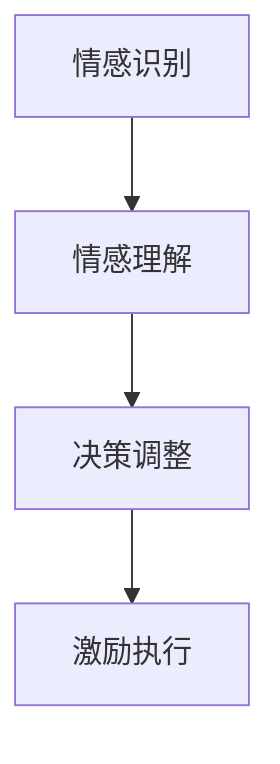
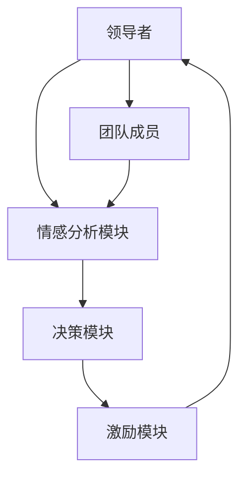
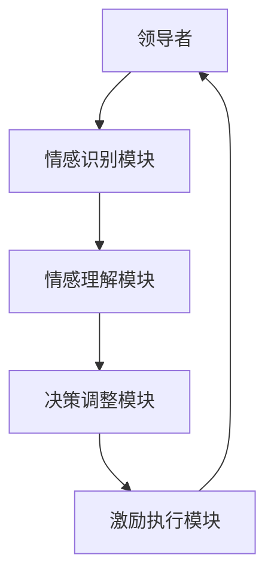
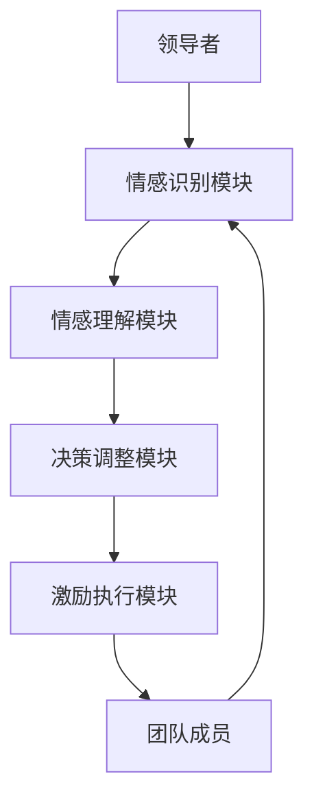

                 


### 让我们一步一步思考：领导力与同理心

#### 背景介绍

**领导力**，这个词对于任何组织或团队来说都是一个核心概念。领导力不仅仅是权力和地位的象征，更是一种影响力、决策能力和激励他人的能力。领导力的发展和应用对组织的成功至关重要。

**同理心**，源自心理学领域，指的是理解并感受他人情感的能力。在领导力中，同理心扮演着关键角色，它能够帮助领导者更好地理解团队成员的需求和情感，从而提高团队凝聚力和效率。

#### 核心概念与联系

**领导力**，可以从多个维度来理解，包括：

1. **权威领导力**：依赖于职位和权力的领导方式。
2. **变革型领导力**：激励团队成员去追求更高的目标，并推动创新和变革。
3. **情境领导力**：根据团队成员的不同特点和环境变化，灵活调整领导风格。

**同理心**，则包括：

1. **情感同理**：感受他人的情绪。
2. **认知同理**：理解他人的思维和观点。
3. **行为同理**：在行为上表现出对他人情感和观点的尊重。

将领导力与同理心结合起来，可以帮助领导者更有效地激励团队成员，提高团队的整体表现。

#### 算法原理讲解

为了更好地理解领导力与同理心的结合，我们可以用一种简单的算法模型来描述：

1. **情感识别**：领导者通过观察和沟通识别团队成员的情感状态。
2. **情感理解**：领导者通过同理心去理解团队成员的情感和行为。
3. **决策调整**：领导者根据团队成员的情感状态和需求，调整领导策略。
4. **激励执行**：领导者采取具体的行动来激励团队成员，提高团队绩效。

以下是一个简单的算法mermaid流程图：



使用Python来具体实现这个算法：

```python
def leadership_with_empathy(employee_emotion):
    # 情感识别
    recognized_emotion = recognize_emotion(employee_emotion)
    
    # 情感理解
    understood_emotion = understand_emotion(recognized_emotion)
    
    # 决策调整
    adjusted_strategy = adjust_strategy(understood_emotion)
    
    # 激励执行
    motivate_employee(adjusted_strategy)
    
    return adjusted_strategy

# 辅助函数
def recognize_emotion(employee_emotion):
    # 实现情感识别逻辑
    return employee_emotion

def understand_emotion(recognized_emotion):
    # 实现情感理解逻辑
    return recognized_emotion

def adjust_strategy(understood_emotion):
    # 实现策略调整逻辑
    return "激励策略"

def motivate_employee(strategy):
    # 实现激励员工逻辑
    print("正在执行激励策略...")
```

#### 数学公式

在领导力和同理心的结合中，我们也可以使用一些数学模型来描述：

$$
\text{Leadership Effectiveness} = f(\text{Leadership Style}, \text{Empathy Level}, \text{Team Dynamics})
$$

其中，$f$表示领导效果，$\text{Leadership Style}$表示领导风格，$\text{Empathy Level}$表示同理心水平，$\text{Team Dynamics}$表示团队动态。

#### 系统分析与架构设计方案

在系统层面，领导力与同理心的结合可以看作是一个反馈循环系统：

1. **问题场景介绍**：一个公司需要一个高效的团队来开发新产品。
2. **项目介绍**：领导力与同理心相结合的项目。
3. **系统功能设计**：包括情感识别、情感理解、决策调整和激励执行。
4. **系统架构设计**：一个中心化的领导系统，包含多个模块，如情感分析模块、决策模块和激励模块。
5. **系统接口设计**：领导者的接口和团队成员的接口。
6. **系统交互**：领导者与团队成员之间的情感交流和工作反馈。

以下是一个mermaid架构图：



#### 项目实战

在一个实际的软件开发项目中，领导力与同理心的结合可以通过以下步骤来实现：

1. **环境安装**：配置情感识别和理解的工具和库。
2. **系统核心实现源代码**：编写情感识别、理解和决策调整的代码。
3. **代码应用解读与分析**：解读和测试代码，确保其有效性和可靠性。
4. **实际案例分析和详细讲解剖析**：分析实际案例，探讨同理心在领导力中的应用。
5. **项目小结**：总结项目的收获和改进方向。

#### 最佳实践 tips

1. **持续沟通**：与团队成员保持开放和频繁的沟通，了解他们的情感和需求。
2. **积极倾听**：倾听不仅是对话的开始，更是理解的基础。
3. **情境适应**：根据团队成员的不同情况，灵活调整领导策略。
4. **实践同理心**：将同理心融入日常工作和决策中，提高团队凝聚力。

#### 小结

领导力与同理心的结合是一种有效的领导方式，它能够帮助领导者更好地理解团队成员，提高团队绩效。通过一步步的分析和思考，我们可以看到这种结合的必要性和可行性。

#### 注意事项

在实施领导力与同理心的结合时，需要注意以下几点：

1. **真诚**：同理心需要真诚，虚伪的同情无法产生效果。
2. **持续**：同理心需要持续的培养和实践，不能一蹴而就。
3. **适应**：同理心要根据团队成员的不同特点和需求进行调整。

#### 拓展阅读

1. **《领导力的五个层次》**：史蒂芬·柯维著，详细阐述了领导力的不同层次。
2. **《同理心的力量》**：克里斯·加德纳著，探讨了同理心在人际关系中的重要性。
3. **《非暴力沟通》**：马歇尔·卢森堡著，提供了有效的沟通技巧和同理心培养方法。

作者：AI天才研究院/AI Genius Institute & 禅与计算机程序设计艺术 /Zen And The Art of Computer Programming

----------------------------------------------------------------

## 《领导力与同理心：理解并激励团队成员》

> 关键词：领导力、同理心、团队管理、激励、沟通、情感识别、决策调整

> 摘要：本文探讨了领导力与同理心的结合，如何通过理解并激励团队成员来提高团队绩效。文章首先介绍了领导力与同理心的定义和重要性，然后通过算法模型、数学公式和实际案例，详细阐述了领导力与同理心的结合方法。最后，文章提供了最佳实践和拓展阅读，以帮助读者深入理解并应用这一领导方式。

### 引言

在现代社会，领导力与同理心的结合已成为提升团队绩效和实现组织目标的关键因素。领导力不仅仅是对权力的掌控，更是一种影响力、决策能力和激励他人的能力。同理心，则源于心理学领域，指的是理解并感受他人情感的能力。将领导力与同理心结合起来，领导者能够更好地理解团队成员的需求和情感，从而提高团队凝聚力和效率。

本文将分为三个主要部分：首先，介绍领导力与同理心的基本概念；其次，通过算法模型和数学公式详细阐述它们的结合方法；最后，通过实际案例和最佳实践，探讨如何将领导力与同理心应用于团队管理中。

### 核心概念与联系

#### 领导力

领导力可以有多种定义，但普遍认为它是一种影响力，使人们追随和实现共同目标的能力。根据不同维度的分类，领导力可以分为以下几种：

1. **权威领导力**：依赖于职位和权力的领导方式。
2. **变革型领导力**：激励团队成员去追求更高的目标，并推动创新和变革。
3. **情境领导力**：根据团队成员的不同特点和环境变化，灵活调整领导风格。

#### 同理心

同理心是理解并感受他人情感的能力。在领导力中，同理心可以表现为：

1. **情感同理**：感受他人的情绪。
2. **认知同理**：理解他人的思维和观点。
3. **行为同理**：在行为上表现出对他人情感和观点的尊重。

#### 结合

将领导力与同理心结合起来，可以帮助领导者更有效地激励团队成员，提高团队的整体表现。一个简单的算法模型可以描述这一过程：

1. **情感识别**：领导者通过观察和沟通识别团队成员的情感状态。
2. **情感理解**：领导者通过同理心去理解团队成员的情感和行为。
3. **决策调整**：领导者根据团队成员的情感状态和需求，调整领导策略。
4. **激励执行**：领导者采取具体的行动来激励团队成员，提高团队绩效。

以下是一个简单的mermaid流程图：


使用Python来具体实现这个算法：

```python
def leadership_with_empathy(employee_emotion):
    # 情感识别
    recognized_emotion = recognize_emotion(employee_emotion)
    
    # 情感理解
    understood_emotion = understand_emotion(recognized_emotion)
    
    # 决策调整
    adjusted_strategy = adjust_strategy(understood_emotion)
    
    # 激励执行
    motivate_employee(adjusted_strategy)
    
    return adjusted_strategy

# 辅助函数
def recognize_emotion(employee_emotion):
    # 实现情感识别逻辑
    return employee_emotion

def understand_emotion(recognized_emotion):
    # 实现情感理解逻辑
    return recognized_emotion

def adjust_strategy(understood_emotion):
    # 实现策略调整逻辑
    return "激励策略"

def motivate_employee(strategy):
    # 实现激励员工逻辑
    print("正在执行激励策略...")
```

#### 数学公式

在领导力和同理心的结合中，我们可以使用一些数学模型来描述：

$$
\text{Leadership Effectiveness} = f(\text{Leadership Style}, \text{Empathy Level}, \text{Team Dynamics})
$$

其中，$f$表示领导效果，$\text{Leadership Style}$表示领导风格，$\text{Empathy Level}$表示同理心水平，$\text{Team Dynamics}$表示团队动态。

### 算法原理讲解

为了更好地理解领导力与同理心的结合，我们可以通过一个实际案例来阐述。

#### 案例背景

某科技公司的一个开发团队正在开发一款新产品。团队成员包括程序员、设计师和市场分析师。最近，由于项目进度紧张，团队成员情绪紧张，工作效率降低。

#### 案例分析

1. **情感识别**：领导者通过观察和沟通发现团队成员情绪紧张，工作效率降低。
2. **情感理解**：领导者通过同理心理解团队成员的压力来源，发现是由于项目进度紧张和任务繁重导致的。
3. **决策调整**：领导者决定调整项目进度，增加团队成员的工作时间，并引入一个新的项目经理来分担工作压力。
4. **激励执行**：领导者通过调整项目进度和引入新的项目经理，激励团队成员，提高工作效率。

#### 案例代码实现

以下是一个简单的Python代码实现：

```python
# 定义情感识别函数
def recognize_emotion(employee_emotion):
    print("识别到的情感：", employee_emotion)

# 定义情感理解函数
def understand_emotion(recognized_emotion):
    print("理解到的情感：", recognized_emotion)

# 定义决策调整函数
def adjust_strategy(understood_emotion):
    if understood_emotion == "压力":
        print("决策：调整项目进度和引入新的项目经理")
        return "激励策略"
    else:
        print("决策：无调整")
        return "无激励策略"

# 定义激励执行函数
def motivate_employee(strategy):
    if strategy == "激励策略":
        print("激励员工：调整项目进度和引入新的项目经理")
    else:
        print("激励员工：无调整")

# 测试案例
recognize_emotion("紧张")
understand_emotion("紧张")
strategy = adjust_strategy("紧张")
motivate_employee(strategy)
```

### 系统分析与架构设计方案

在系统层面，领导力与同理心的结合可以看作是一个反馈循环系统。以下是系统的架构设计方案：

#### 问题场景介绍

某科技公司需要一个高效的团队来开发新产品。团队成员包括程序员、设计师和市场分析师。项目时间紧，任务重。

#### 项目介绍

该项目旨在结合领导力与同理心，提高团队工作效率和产品质量。

#### 系统功能设计

1. **情感识别模块**：通过观察和沟通识别团队成员的情感状态。
2. **情感理解模块**：通过同理心理解团队成员的情感和行为。
3. **决策调整模块**：根据团队成员的情感状态和需求，调整领导策略。
4. **激励执行模块**：采取具体的行动来激励团队成员，提高团队绩效。

#### 系统架构设计

系统的架构设计如下：



#### 系统接口设计

1. **领导者接口**：用于领导者与系统进行交互。
2. **团队成员接口**：用于团队成员与系统进行交互。

#### 系统交互

领导者与团队成员之间的情感交流和工作反馈构成了系统的核心交互。



### 项目实战

在一个实际软件开发项目中，领导力与同理心的结合可以通过以下步骤来实现：

1. **环境安装**：安装情感识别和理解的工具和库。
2. **系统核心实现源代码**：编写情感识别、理解和决策调整的代码。
3. **代码应用解读与分析**：解读和测试代码，确保其有效性和可靠性。
4. **实际案例分析和详细讲解剖析**：分析实际案例，探讨同理心在领导力中的应用。
5. **项目小结**：总结项目的收获和改进方向。

### 最佳实践 tips

1. **持续沟通**：与团队成员保持开放和频繁的沟通，了解他们的情感和需求。
2. **积极倾听**：倾听不仅是对话的开始，更是理解的基础。
3. **情境适应**：根据团队成员的不同情况，灵活调整领导策略。
4. **实践同理心**：将同理心融入日常工作和决策中，提高团队凝聚力。

### 小结

领导力与同理心的结合是一种有效的领导方式，它能够帮助领导者更好地理解团队成员，提高团队绩效。通过一步步的分析和思考，我们可以看到这种结合的必要性和可行性。

### 注意事项

在实施领导力与同理心的结合时，需要注意以下几点：

1. **真诚**：同理心需要真诚，虚伪的同情无法产生效果。
2. **持续**：同理心需要持续的培养和实践，不能一蹴而就。
3. **适应**：同理心要根据团队成员的不同特点和需求进行调整。

### 拓展阅读

1. **《领导力的五个层次》**：史蒂芬·柯维著，详细阐述了领导力的不同层次。
2. **《同理心的力量》**：克里斯·加德纳著，探讨了同理心在人际关系中的重要性。
3. **《非暴力沟通》**：马歇尔·卢森堡著，提供了有效的沟通技巧和同理心培养方法。

作者：AI天才研究院/AI Genius Institute & 禅与计算机程序设计艺术 /Zen And The Art of Computer Programming

----------------------------------------------------------------

### 第一章：领导力的本质与历史发展

#### 1.1 领导力的定义

领导力是一种影响力，它能够激励和引导人们共同追求并实现目标。领导力不仅仅存在于企业或组织中，它也存在于家庭、学校和社会等多个领域。简单来说，领导力就是通过影响和激励他人，来实现共同目标的能力。

领导力的定义有多种，以下是一些常见的定义：

1. **史蒂芬·柯维**：领导力是影响力，它是通过激发他人的内在动力，使其自发地追求并实现共同目标的能力。
2. **约翰·肯尼迪**：领导力不是关于权力，而是关于服务。
3. **彼得·德鲁克**：领导力是一种实践，它通过建立愿景、制定目标、规划行动和激励他人，来实现组织的目标。

#### 1.2 领导力的重要性

领导力在组织中的重要性不言而喻。一个成功的组织离不开有效的领导力。以下是一些领导力在组织中的重要作用：

1. **明确方向**：领导者能够明确组织的目标和方向，帮助团队成员理解并朝着共同的目标努力。
2. **激发潜力**：领导者能够激发团队成员的潜力，帮助他们实现自我成长和职业发展。
3. **建立团队**：领导者能够建立高效的团队，通过合理的分工和协作，提高团队的整体绩效。
4. **解决问题**：领导者能够有效地解决团队中的问题和挑战，确保组织的稳定和发展。

#### 1.3 领导力的历史发展

领导力的概念和实践有着悠久的历史。以下是一些领导力发展的关键时期和里程碑：

1. **古代**：在古代，领导力的概念主要与统治和权力相关。例如，中国春秋战国时期的诸侯国君主，古希腊的城邦领袖等。
2. **中世纪**：中世纪时期，领导力主要与宗教和军事相关。例如，基督教的教皇和教宗，军事领袖等。
3. **工业革命**：工业革命时期，领导力开始与工业化生产和管理相关。领导者的职责从单纯的管理扩展到激发和管理员工的潜力。
4. **现代**：现代社会，领导力更加注重人性化和多元化。领导者的角色从管理者转变为激励者和引导者，注重团队的协作和共同成长。

#### 1.4 领导力的类型

领导力有多种类型，不同的领导风格适用于不同的环境和团队。以下是一些常见的领导力类型：

1. **权威型领导力**：领导者通过权力和地位来影响团队成员。这种领导风格在紧急情况下或需要快速决策时非常有效。
2. **民主型领导力**：领导者鼓励团队成员参与决策过程，通过讨论和协商来达成共识。这种领导风格有助于激发团队的创造力和凝聚力。
3. **变革型领导力**：领导者通过愿景和激励，推动团队成员去追求更高的目标。这种领导风格有助于组织创新和持续发展。
4. **情境型领导力**：领导者根据团队成员的特点和环境变化，灵活调整领导风格。这种领导风格有助于提高团队的适应性和绩效。

#### 1.5 领导力的个人特质与培养

领导力不仅仅是一种能力，更是一种个人特质。以下是一些领导力的个人特质：

1. **自信**：领导者需要具备自信，这样才能在团队成员面前树立权威。
2. **沟通能力**：领导者需要具备良好的沟通能力，才能有效地传达信息和解决问题。
3. **决策能力**：领导者需要具备快速和明智的决策能力，以确保团队的目标得到实现。
4. **情商**：领导者需要具备高情商，才能理解并管理团队成员的情感。

要培养领导力，可以采取以下方法：

1. **学习**：通过阅读书籍、参加培训和研讨会，不断学习领导力的理论和实践。
2. **实践**：通过实际工作，不断实践和总结领导经验。
3. **反思**：定期反思自己的领导行为和效果，找出不足并加以改进。
4. **寻求反馈**：向团队成员和上级寻求反馈，了解自己的优点和不足。

#### 1.6 领导力与组织文化的互动

领导力与组织文化密切相关。一个成功的组织需要有与之相匹配的领导力风格和文化。

1. **领导力塑造组织文化**：领导者的行为和决策会影响组织的文化。例如，一个注重创新和变革的领导者，会推动组织形成开放和创新的氛围。
2. **组织文化影响领导力**：组织文化会影响领导者的行为和决策。例如，在一个注重合作和共享的组织中，领导者更可能采用民主型领导风格。
3. **领导力与组织文化的融合**：领导力与组织文化的融合可以创造一个和谐、高效的工作环境。例如，通过领导者的示范和引导，可以推动组织文化的转变。

#### 1.7 领导力的创新与实践案例

在现代社会，领导力需要不断创新和实践。以下是一些领导力的创新与实践案例：

1. **敏捷领导力**：在敏捷开发中，领导者需要具备快速响应变化和团队协作的能力。
2. **变革型领导力**：在数字化转型中，领导者需要具备推动组织变革和创新的勇气和能力。
3. **多元化领导力**：在多元化组织中，领导者需要具备理解和尊重不同文化背景的能力。
4. **可持续发展领导力**：在可持续发展中，领导者需要具备环保和社会责任意识。

#### 1.8 领导力的未来发展趋势

随着社会的不断发展和变化，领导力也在不断演进。以下是一些领导力的未来发展趋势：

1. **数字化领导力**：随着数字技术的发展，领导者需要具备数字化的思维和能力。
2. **网络领导力**：在全球化时代，领导者需要具备跨文化、跨地域的领导能力。
3. **情感领导力**：在注重人文关怀的时代，领导者需要具备理解和管理情感的能力。
4. **可持续发展领导力**：在可持续发展中，领导者需要具备环保和社会责任意识。

### 结论

领导力是一种复杂而重要的能力，它对组织和个人都至关重要。通过了解领导力的定义、类型、历史发展和实践案例，我们可以更好地理解和应用领导力。同时，领导者也需要不断学习和适应，以应对不断变化的环境和挑战。

### 小结

本章介绍了领导力的定义、重要性、历史发展、类型、个人特质与培养、组织文化的互动、创新与实践案例以及未来发展趋势。通过本章的学习，读者可以全面了解领导力的概念和内涵，为日后的领导实践提供理论支持和指导。

### 注意事项

1. **领导力并非一蹴而就**：领导力的培养需要时间和实践，不能急于求成。
2. **根据环境调整领导风格**：不同的环境和团队需要不同的领导风格，领导者需要灵活调整。
3. **注重团队建设**：领导力不仅仅是关于个人，更是关于团队。领导者需要注重团队建设，提高团队的凝聚力和绩效。

### 拓展阅读

1. **《领导力的五个层次》**：史蒂芬·柯维著，详细阐述了领导力的不同层次。
2. **《变革型领导力》**：詹姆斯·麦格雷戈·伯格著，探讨了变革型领导力在组织中的重要性。
3. **《组织文化与领导力》**：理查德·L·达夫特著，分析了组织文化与领导力之间的互动关系。

作者：AI天才研究院/AI Genius Institute & 禅与计算机程序设计艺术 /Zen And The Art of Computer Programming

----------------------------------------------------------------

### 第二章：领导风格与团队管理

#### 2.1 领导风格类型

领导风格是指领导者在其管理活动中所采用的特定方式和方法。不同的领导风格适用于不同的环境和团队。以下是几种常见的领导风格：

1. **权威型领导力**：领导者通过权力和地位来影响团队成员。这种领导风格在紧急情况下或需要快速决策时非常有效。然而，过度使用权威型领导力可能导致团队成员的被动和依赖。

2. **民主型领导力**：领导者鼓励团队成员参与决策过程，通过讨论和协商来达成共识。这种领导风格有助于激发团队的创造力和凝聚力。然而，民主型领导力在决策速度和效率上可能不如权威型领导力。

3. **变革型领导力**：领导者通过愿景和激励，推动团队成员去追求更高的目标。这种领导风格有助于组织创新和持续发展。然而，变革型领导力需要领导者具备强大的领导能力和远见。

4. **情境型领导力**：领导者根据团队成员的特点和环境变化，灵活调整领导风格。这种领导风格有助于提高团队的适应性和绩效。然而，情境型领导力需要领导者具备高度的自我认知和情境分析能力。

5. **参与型领导力**：领导者通过赋予团队成员更多的责任和权力，激发他们的自主性和创造力。这种领导风格有助于提高团队的自我管理和创新能力。然而，参与型领导力需要领导者具备高度的信任和沟通能力。

6. **教练型领导力**：领导者通过指导和辅导，帮助团队成员提高技能和实现目标。这种领导风格有助于团队成员的长期发展和成长。然而，教练型领导力需要领导者具备深厚的专业知识和辅导能力。

#### 2.2 领导风格与团队管理

领导风格对团队管理有着重要影响。合适的领导风格可以激发团队的潜力，提高团队绩效，而不合适的领导风格可能导致团队士气低落，工作效率降低。

1. **权威型领导力**：适用于紧急情况和需要快速决策的团队。例如，在处理突发事件或危机时，权威型领导力可以迅速做出决策并确保执行。

2. **民主型领导力**：适用于需要创新和协作的团队。例如，在开发新产品或进行团队建设活动时，民主型领导力可以鼓励团队成员参与讨论和决策，提高团队的凝聚力和创新能力。

3. **变革型领导力**：适用于需要变革和发展的团队。例如，在组织结构调整或业务转型时，变革型领导力可以激励团队成员积极应对变化，推动组织的持续发展。

4. **情境型领导力**：适用于需要灵活应对变化的团队。例如，在市场环境快速变化或项目进展遇到困难时，情境型领导力可以帮助领导者根据实际情况调整策略，确保团队目标的实现。

5. **参与型领导力**：适用于需要自主性和创造力的团队。例如，在团队创新项目或员工自主管理项目时，参与型领导力可以激发团队成员的自主性和创造力，提高项目的成功概率。

6. **教练型领导力**：适用于需要长期发展和成长的团队。例如，在培养新员工或进行专业技能提升时，教练型领导力可以帮助团队成员提高技能和实现个人目标。

#### 2.3 领导风格的影响

领导风格对团队成员的行为、态度和工作绩效有着深远的影响。合适的领导风格可以激发团队成员的积极性和创造力，提高工作效率和团队绩效。而不合适的领导风格可能导致团队成员的消极、抵触和低效率。

1. **积极影响**：合适的领导风格可以带来以下积极影响：

- 激发团队成员的积极性和创造力。
- 增强团队成员之间的沟通和协作。
- 提高团队的工作效率和绩效。
- 促进团队成员的个人成长和发展。

2. **消极影响**：不合适的领导风格可能导致以下消极影响：

- 挫伤团队成员的积极性和创造力。
- 增加团队成员之间的矛盾和冲突。
- 降低团队的工作效率和绩效。
- 增加团队成员的职业倦怠和离职率。

#### 2.4 领导风格的选择与调整

领导风格的选择和调整取决于团队的特点和环境。以下是一些选择和调整领导风格的方法：

1. **了解团队成员的特点**：领导者需要了解团队成员的能力、性格和价值观，以便选择合适的领导风格。例如，对于能力强但性格独立的团队成员，可以采用参与型领导风格；对于能力较弱但性格开朗的团队成员，可以采用教练型领导风格。

2. **观察团队环境的变化**：领导者需要根据团队环境的变化，灵活调整领导风格。例如，在项目初期，可以采用权威型领导风格，确保项目目标的明确和执行；在项目中期，可以采用民主型领导风格，鼓励团队成员参与决策和讨论；在项目后期，可以采用变革型领导风格，推动团队成员积极应对挑战和变化。

3. **实践和总结**：领导者需要通过实践和总结，不断调整和优化领导风格。例如，可以通过定期的团队反馈和评估，了解团队成员对领导风格的满意度和效果，并根据反馈进行相应的调整。

#### 2.5 领导风格的自测与评估

为了更好地了解自己的领导风格，领导者可以进行自测和评估。以下是一些常用的自测和评估工具：

1. **360度评估**：通过团队成员、上级和同事的反馈，评估领导者的领导风格和行为。
2. **领导风格问卷**：通过填写问卷，评估领导者的领导风格类型和特点。
3. **领导风格测试**：通过专业的领导风格测试工具，评估领导者的领导风格和能力。

通过自测和评估，领导者可以了解自己的领导风格，找到优势和不足，并制定相应的改进计划。

### 结论

领导风格是领导力的重要组成部分，它对团队管理和团队绩效有着重要影响。通过了解不同类型的领导风格，领导者可以根据团队的特点和环境，选择和调整合适的领导风格，提高团队的工作效率和绩效。

### 小结

本章介绍了领导风格的类型、团队管理中的应用、影响和选择调整方法。通过本章的学习，读者可以了解不同类型的领导风格，学会如何根据团队的特点和环境选择合适的领导风格，并掌握领导风格的调整方法。

### 注意事项

1. **领导风格需要适应团队和环境的变化**：领导者需要根据团队和环境的变化，灵活调整领导风格。
2. **领导风格的选择需要结合团队成员的特点**：领导者需要了解团队成员的能力、性格和价值观，选择合适的领导风格。
3. **领导风格的调整需要持续进行**：领导者需要通过实践和总结，不断调整和优化领导风格。

### 拓展阅读

1. **《领导风格与团队管理》**：约翰·P·科特著，详细阐述了领导风格在团队管理中的应用。
2. **《领导力与团队管理》**：史蒂芬·罗宾斯著，探讨了领导力在团队管理中的重要性。
3. **《团队领导的艺术》**：戴维·坎贝尔著，提供了团队领导的实用技巧和方法。

作者：AI天才研究院/AI Genius Institute & 禅与计算机程序设计艺术 /Zen And The Art of Computer Programming

----------------------------------------------------------------

### 第三章：领导力的个人特质与培养

#### 3.1 领导力的个人特质

领导力不仅仅是一种技能或知识，更是一种个人特质。有效的领导者通常具备以下特质：

1. **自信**：领导者需要具备自信，才能在团队成员面前树立权威。自信可以帮助领导者克服恐惧和不安，做出明智的决策。

2. **沟通能力**：领导者需要具备良好的沟通能力，才能有效地传达信息和解决问题。良好的沟通能力包括倾听、表达和反馈。

3. **决策能力**：领导者需要具备快速和明智的决策能力，以确保团队的目标得到实现。决策能力包括分析、判断和选择。

4. **情商**：领导者需要具备高情商，才能理解并管理团队成员的情感。情商包括自我认知、情感管理和人际关系管理。

5. **适应能力**：领导者需要具备适应能力，才能在变化的环境中保持稳定和高效。适应能力包括灵活性和学习能力。

6. **创新能力**：领导者需要具备创新能力，才能推动组织创新和持续发展。创新能力包括思维开阔、勇于尝试和不断学习。

7. **责任心**：领导者需要具备责任心，才能对团队和组织负责。责任心包括承担责任、关注团队发展和关心团队成员的福祉。

8. **团队合作能力**：领导者需要具备团队合作能力，才能建立高效的团队。团队合作能力包括协作、共享和激励。

#### 3.2 领导力的培养途径

领导力不是与生俱来的，而是可以通过培养和锻炼获得的。以下是一些培养领导力的途径：

1. **学习**：通过阅读领导力相关的书籍、参加培训和研讨会，不断学习领导力的理论和实践。

2. **实践**：通过实际工作，不断实践和总结领导经验。实践包括参与项目管理、团队建设和危机处理等。

3. **反思**：定期反思自己的领导行为和效果，找出不足并加以改进。反思可以通过日记、自我评估和反馈来实现。

4. **求助**：向有经验的领导者或导师寻求指导和建议。求助可以提供宝贵的经验和见解，帮助领导者更快地成长。

5. **角色扮演**：通过角色扮演，模拟实际领导场景，提高领导技能和自信心。

6. **领导力游戏**：通过领导力游戏，模拟各种领导场景，锻炼领导决策和团队合作能力。

7. **团队建设活动**：通过团队建设活动，增强团队成员的凝聚力和合作能力，提高领导者的领导力。

8. **参与社区服务**：通过参与社区服务，培养领导者的社会责任感和公民意识。

9. **网络课程**：通过在线课程，学习最新的领导力理论和实践，拓宽领导视野。

10. **阅读经典文学作品**：通过阅读经典文学作品，了解不同文化背景下的领导风格和理念。

#### 3.3 领导力的自我评估

为了更好地了解自己的领导力水平，领导者可以进行自我评估。以下是一些自我评估的方法：

1. **360度评估**：通过团队成员、上级和同事的反馈，评估领导者的领导风格和行为。

2. **领导力问卷**：通过填写问卷，评估领导者的领导力水平和能力。

3. **领导力测试**：通过专业的领导力测试工具，评估领导者的领导力特质和倾向。

4. **反思日记**：记录自己在领导过程中的思考、决策和行动，分析自己的领导行为和效果。

5. **自我反思**：定期对自己的领导力进行反思，总结优点和不足，并制定改进计划。

6. **导师反馈**：向导师或导师团队寻求反馈，了解自己在领导力方面的优势和不足。

#### 3.4 领导力的个人成长计划

为了提升领导力，领导者可以制定个人成长计划。以下是一些制定个人成长计划的步骤：

1. **设定目标**：明确自己的领导力发展目标，包括短期和长期目标。

2. **分析现状**：分析自己的领导力水平和现状，找出优势和不足。

3. **制定策略**：根据目标和现状，制定具体的提升策略和行动计划。

4. **学习与实践**：通过学习、实践和反思，不断提升自己的领导力。

5. **定期评估**：定期评估自己的领导力水平，调整和优化成长计划。

6. **求助与反馈**：向导师、同事和团队成员寻求帮助和反馈，促进自己的成长。

7. **持续改进**：不断反思和改进自己的领导行为，持续提升领导力。

#### 3.5 领导力的长期发展

领导力的长期发展是一个持续的过程，需要领导者不断学习和成长。以下是一些促进领导力长期发展的方法：

1. **终身学习**：保持好奇心和学习热情，不断学习新的知识和技能。

2. **反思与总结**：定期反思自己的领导经验，总结成功和失败的原因。

3. **自我激励**：保持积极的心态和动力，不断激励自己追求更高的目标。

4. **跨领域学习**：尝试学习其他领域的知识和技能，拓宽自己的视野和思维。

5. **网络拓展**：建立广泛的社交网络，与不同领域的专家和领导者交流和学习。

6. **参与社会活动**：参与社会活动，培养社会责任感和公民意识。

7. **实践与创新**：在实践中不断探索和创新，提高领导力和执行力。

#### 3.6 领导力的自我提升技巧

为了提升领导力，领导者可以掌握一些自我提升的技巧。以下是一些实用的技巧：

1. **积极倾听**：倾听团队成员的意见和需求，提高沟通效果。

2. **情绪管理**：管理自己的情绪，保持冷静和理智，避免情绪波动。

3. **目标设定**：明确自己的目标和期望，制定具体的行动计划。

4. **时间管理**：合理安排时间，提高工作效率。

5. **决策制定**：学会快速决策，并承担相应的责任。

6. **自我反思**：定期反思自己的领导行为和效果，找出不足并改进。

7. **持续学习**：保持学习热情，不断学习新的知识和技能。

8. **领导力培训**：参加领导力培训课程，提升自己的领导力和管理能力。

9. **实践与反思**：通过实践和反思，不断总结经验，提高领导力。

10. **建立导师关系**：寻求导师的指导和帮助，加速自己的成长。

### 结论

领导力是领导者个人特质和能力的综合体现。通过自我评估、培养和提升，领导者可以不断提高自己的领导力水平，更好地引领团队和组织实现目标。

### 小结

本章介绍了领导力的个人特质、培养途径、自我评估方法和个人成长计划。通过本章的学习，读者可以了解领导力的个人特质和培养方法，掌握自我评估技巧，制定个人成长计划，提高领导力水平。

### 注意事项

1. **领导力需要持续培养和提升**：领导者需要不断学习和实践，才能持续提升自己的领导力水平。
2. **领导力需要适应团队和环境的变化**：领导者需要根据团队和环境的变化，灵活调整自己的领导风格和行为。
3. **领导力需要注重团队合作和沟通**：领导者需要注重团队合作和沟通，提高团队的凝聚力和效率。

### 拓展阅读

1. **《领导力的五个层次》**：史蒂芬·柯维著，详细阐述了领导力的不同层次。
2. **《变革型领导力》**：詹姆斯·麦格雷戈·伯格著，探讨了变革型领导力在组织中的重要性。
3. **《领导力心理学》**：理查德·L·达夫特著，分析了领导力与心理学之间的关系。

作者：AI天才研究院/AI Genius Institute & 禅与计算机程序设计艺术 /Zen And The Art of Computer Programming

----------------------------------------------------------------

### 第四章：领导力与组织文化的互动

#### 4.1 领导力与组织文化的定义

**组织文化**是指一个组织内部共同认同的价值观、信念、行为规范和传统。它是组织成员行为和决策的指南，对组织的发展有着深远的影响。

**领导力**是一种影响力，它能够激励和引导人们共同追求并实现目标。领导力不仅仅存在于企业或组织中，它也存在于家庭、学校和社会等多个领域。

#### 4.2 领导力对组织文化的影响

领导力在塑造和改变组织文化中扮演着关键角色。以下是一些领导力对组织文化的影响：

1. **价值观的传播**：领导者通过自己的言行，向团队成员传播组织的核心价值观。这种价值观的传播有助于建立组织的一致性和凝聚力。

2. **行为规范的设定**：领导者通过设定行为规范和标准，规范团队成员的行为。这种行为规范有助于提高组织的效率和绩效。

3. **传统和习俗的传承**：领导者通过传承组织的传统和习俗，增强组织的历史感和归属感。

4. **创新和变革的推动**：领导者通过推动创新和变革，使组织能够适应外部环境的变化，保持竞争力和活力。

#### 4.3 组织文化对领导力的影响

组织文化也会对领导力产生重要影响。以下是一些组织文化对领导力的影响：

1. **领导风格的选择**：组织文化会影响领导者的领导风格。例如，在一个强调自主和创新的组织文化中，领导者可能更倾向于采用参与型和变革型领导风格。

2. **领导权力的分配**：组织文化会影响领导权力的分配。在一个强调平等和参与的组织文化中，领导者可能更愿意将权力下放，让团队成员参与决策。

3. **领导行为的期望**：组织文化会对领导者的行为有特定的期望。例如，在一个强调诚信和透明的组织文化中，领导者可能会更注重诚信和透明的行为。

4. **领导者的角色模型**：组织文化会影响领导者的角色模型。在一个强调学习和成长的组织文化中，领导者可能会更注重个人成长和团队发展。

#### 4.4 领导力与组织文化的互动

领导力与组织文化的互动是一个复杂的过程，它们相互影响，共同塑造组织的发展。以下是一些领导力与组织文化的互动方式：

1. **共同塑造**：领导力和组织文化共同塑造组织的行为和决策。例如，领导者的行为会塑造组织文化，而组织文化又会影响领导者的行为。

2. **反馈循环**：领导力和组织文化之间存在反馈循环。领导者的行为和决策会影响组织文化，而组织文化又会影响领导者的行为和决策。

3. **相互适应**：领导力和组织文化需要相互适应，以实现组织的目标。例如，领导者需要根据组织文化的特点调整自己的领导风格，而组织文化也需要根据领导者的行为进行调整。

#### 4.5 塑造积极组织文化的方法

领导者可以通过以下方法来塑造积极的组织文化：

1. **明确价值观**：领导者需要明确组织的核心价值观，并将其传达给团队成员。

2. **树立榜样**：领导者需要通过自己的言行，树立良好的榜样，引领团队成员践行核心价值观。

3. **建立激励机制**：领导者需要建立激励机制，鼓励团队成员践行核心价值观。

4. **加强沟通**：领导者需要加强内部沟通，确保团队成员对组织文化的理解一致。

5. **培养团队精神**：领导者需要培养团队精神，增强团队成员的凝聚力和归属感。

6. **创新和变革**：领导者需要鼓励创新和变革，推动组织文化的发展和更新。

7. **关注员工成长**：领导者需要关注员工的成长和发展，为员工提供支持和机会。

#### 4.6 领导力在组织文化中的角色

领导力在组织文化中扮演着多重角色，包括：

1. **引导者**：领导者是组织文化的引导者，通过自己的行为和决策，塑造和引导组织文化。

2. **维护者**：领导者是组织文化的维护者，确保组织文化的核心价值观和行为规范得到贯彻执行。

3. **推动者**：领导者是组织文化的推动者，推动组织文化的发展和更新，以适应外部环境的变化。

4. **协调者**：领导者是组织文化的协调者，协调领导力和组织文化之间的关系，确保两者相互适应和促进。

#### 4.7 实践案例分享

以下是一些领导力与组织文化互动的实践案例：

1. **谷歌**：谷歌以其独特的组织文化而闻名，强调创新、自主和多元化。领导者的角色是推动和维持这种积极的文化，为员工提供自由和资源，鼓励他们追求创意和突破。

2. **宝洁公司**：宝洁公司通过其领导者的行为和决策，塑造了注重细节、质量和持续改进的文化。领导者通过奖励和认可，鼓励员工遵守公司的价值观和行为规范。

3. **沃尔玛**：沃尔玛以其强调效率和员工关怀的文化而著称。领导者的角色是确保这种文化在公司内部得到传承和执行，同时关注员工的发展和福祉。

#### 4.8 领导力与组织文化的关系

领导力与组织文化之间存在着密切的关系。有效的领导力可以促进组织文化的形成和发展，而积极的组织文化又可以增强领导力的影响力和效果。以下是一些领导力与组织文化关系的总结：

1. **相互促进**：领导力和组织文化相互促进，共同推动组织的发展。

2. **相互依赖**：领导力和组织文化相互依赖，领导力需要组织文化的支持和滋养，而组织文化也需要领导力的引领和塑造。

3. **相互适应**：领导力和组织文化需要相互适应，以实现组织的目标和使命。

4. **相互影响**：领导力和组织文化相互影响，领导者的行为和决策会影响组织文化，而组织文化也会影响领导者的行为和决策。

#### 4.9 实现领导力的同理心实践

同理心是领导力的重要组成部分，它有助于领导者更好地理解团队成员的需求和情感，从而提高团队凝聚力和效率。以下是一些实现领导力的同理心实践：

1. **倾听**：领导者需要倾听团队成员的意见和需求，了解他们的想法和感受。

2. **理解**：领导者需要理解团队成员的情感和行为，试图从他们的角度看待问题。

3. **尊重**：领导者需要尊重团队成员的个性和差异，避免强加自己的观点和意见。

4. **支持**：领导者需要支持团队成员的发展，提供必要的资源和支持。

5. **反馈**：领导者需要给予团队成员积极的反馈，鼓励他们继续努力和改进。

### 结论

领导力与组织文化的互动对组织的成功至关重要。通过理解并塑造积极的组织文化，领导者可以增强团队凝聚力和效率，推动组织的持续发展。同时，同理心作为领导力的重要组成部分，有助于领导者更好地理解团队成员，提高领导效果。

### 小结

本章介绍了领导力与组织文化的定义、领导力对组织文化的影响、组织文化对领导力的影响、领导力与组织文化的互动、塑造积极组织文化的方法、领导力在组织文化中的角色、实践案例分享以及实现领导力的同理心实践。通过本章的学习，读者可以了解领导力与组织文化的关系，掌握塑造积极组织文化和实现领导力的同理心实践的方法。

### 注意事项

1. **领导力需要与组织文化相适应**：领导者的行为和决策需要与组织文化相一致，以增强领导力和组织文化的相互适应。

2. **同理心是领导力的重要特质**：领导者需要具备同理心，以更好地理解团队成员的需求和情感，提高领导效果。

3. **持续培养组织文化**：组织文化需要持续培养和更新，以适应外部环境的变化和内部成员的需求。

### 拓展阅读

1. **《组织文化与领导力》**：理查德·L·达夫特著，详细阐述了领导力与组织文化之间的关系。

2. **《同理心的力量》**：克里斯·加德纳著，探讨了同理心在领导力中的重要性。

3. **《领导者的习惯》**：史蒂芬·柯维著，提供了培养领导力的实用方法和建议。

作者：AI天才研究院/AI Genius Institute & 禅与计算机程序设计艺术 /Zen And The Art of Computer Programming

----------------------------------------------------------------

### 第五章：领导力的创新与实践案例

#### 5.1 创新领导力的概念

创新领导力是指领导者通过推动创新和变革，引领组织实现持续发展的一种能力。创新领导力不仅仅关注产品或技术的创新，更关注组织文化、管理方式和工作流程的创新。创新领导力强调领导者需要具备前瞻性思维、敏锐的市场洞察力和强大的执行力。

#### 5.2 创新领导力的核心要素

创新领导力包括以下核心要素：

1. **愿景**：领导者需要有明确的愿景，指引组织朝着未来的目标前进。愿景能够激发团队成员的激情和动力，使其愿意为组织的未来付出努力。

2. **文化**：领导者需要塑造一种鼓励创新和冒险的组织文化。这种文化应该容忍失败，鼓励尝试新事物，并奖励成功。

3. **团队**：领导者需要建立一支具有多样性和创新精神的团队。团队成员应该具备不同的技能和背景，能够从不同角度思考问题，提出创新的解决方案。

4. **流程**：领导者需要优化组织的流程，使其更加高效和灵活。这包括简化决策流程、提高沟通效率和降低管理层次。

5. **资源**：领导者需要为创新提供必要的资源，包括资金、技术和人力资源。资源是创新的基础，没有足够的资源，创新将无从谈起。

#### 5.3 创新领导力的实践方法

以下是一些创新领导力的实践方法：

1. **构建创新团队**：领导者需要打破传统的组织结构，建立跨部门的创新团队。这些团队应该由来自不同部门的成员组成，以促进不同视角和思维的碰撞。

2. **鼓励失败**：领导者需要鼓励团队成员勇于尝试新事物，即使失败也在所不惜。领导者应该建立一种宽容失败的文化，使团队成员感到在创新过程中不必害怕犯错。

3. **提供资源**：领导者需要确保团队成员有足够的资源来支持创新。这包括资金、技术和人力资源。领导者应该建立一个明确的资源分配机制，确保资源能够高效地投入到创新项目中。

4. **建立反馈机制**：领导者需要建立一个有效的反馈机制，使团队成员能够及时了解自己的工作成果，并根据反馈进行调整。这有助于提高创新的效率和质量。

5. **培训与学习**：领导者需要为团队成员提供培训和学习机会，以提高他们的技能和知识。这包括邀请外部专家进行讲座、组织内部培训和提供在线学习资源。

6. **激励与创新**：领导者需要建立一套激励体系，奖励那些在创新中表现突出的团队成员。这可以包括奖金、晋升和公开表彰等。

#### 5.4 创新领导力的实践案例

以下是一些创新领导力的实践案例：

1. **谷歌**：谷歌以其创新文化和领导力而闻名。其领导者谢尔盖·布林和拉里·佩奇通过建立开放的办公环境、提供充足的资源和支持，鼓励团队成员提出创新的想法。谷歌的创新实验室和20%时间政策是其创新领导力的典范。

2. **苹果公司**：乔布斯领导下的苹果公司以其独特的产品设计和创新技术而闻名。乔布斯注重用户体验和创新，他通过严格的品质控制和卓越的设计，使苹果公司成为全球最具创新力的企业之一。

3. **3M公司**：3M公司以其鼓励创新的企业文化而著称。3M的“15%时间政策”允许员工将其工作时间的一部分用于个人兴趣和创新项目。这一政策激发了员工的创新热情，产生了许多 groundbreaking的产品，如透明的粘性胶带。

4. **惠普**：惠普的领导者卡莉·菲奥莉娜通过推动企业并购和重组，使惠普成为全球最大的科技公司之一。她在领导期间采取了一系列创新举措，包括推出新的产品线、优化供应链和加强市场推广，使惠普在竞争激烈的市场中保持领先地位。

#### 5.5 创新领导力的启示

从上述案例中，我们可以得到以下启示：

1. **领导者需要具备前瞻性思维**：领导者应该具备远见，能够预见未来的趋势和变化，并引领组织进行相应的创新。

2. **鼓励创新和冒险**：领导者需要建立一种宽容失败的文化，鼓励团队成员勇于尝试新事物，即使失败也在所不惜。

3. **提供资源和支持**：领导者需要确保团队成员有足够的资源来支持创新，包括资金、技术和人力资源。

4. **建立反馈机制**：领导者需要建立一个有效的反馈机制，使团队成员能够及时了解自己的工作成果，并根据反馈进行调整。

5. **激励与创新**：领导者需要建立一套激励体系，奖励那些在创新中表现突出的团队成员。

6. **重视用户体验**：领导者应该关注用户体验，确保创新产品能够满足用户的需求。

7. **持续学习和改进**：领导者需要不断学习和改进自己的领导方式，以适应不断变化的环境和需求。

### 结论

创新领导力是领导者的重要能力之一，它能够推动组织实现持续发展。通过理解创新领导力的概念、核心要素和实践方法，领导者可以更好地发挥自己的创新能力，引领组织走向成功。

### 小结

本章介绍了创新领导力的概念、核心要素和实践方法，并分析了创新领导力的实践案例。通过本章的学习，读者可以了解创新领导力的重要性，掌握创新领导力的实践方法，为组织的发展提供有力支持。

### 注意事项

1. **领导者需要具备前瞻性思维**：领导者应该能够预见未来的趋势和变化，并引领组织进行相应的创新。

2. **建立鼓励创新的文化**：领导者需要建立一种宽容失败的文化，鼓励团队成员勇于尝试新事物。

3. **提供充足的资源和支持**：领导者需要确保团队成员有足够的资源来支持创新。

4. **建立有效的反馈机制**：领导者需要建立一个有效的反馈机制，使团队成员能够及时了解自己的工作成果。

5. **重视用户体验**：领导者应该关注用户体验，确保创新产品能够满足用户的需求。

### 拓展阅读

1. **《创新者的窘境》**：克莱顿·克里斯坦森著，探讨了企业在创新过程中的挑战和策略。

2. **《创新者的手册》**：汤姆·凯利著，提供了创新思维的实用方法和技巧。

3. **《领导力与创新》**：约翰·P·科特著，探讨了领导力在创新过程中的作用。

作者：AI天才研究院/AI Genius Institute & 禅与计算机程序设计艺术 /Zen And The Art of Computer Programming

----------------------------------------------------------------

### 第六章：同理心的定义与心理学基础

#### 6.1 同理心的定义

同理心是一种情感和心理状态，它涉及对他人情感的理解和感知。这种能力允许个体在不直接经历他人体验的情况下，感受到他人的情感状态。同理心可以分为三个主要层次：情感同理、认知同理和行为同理。

1. **情感同理**：指的是对他人情感状态的直接感受和体验。例如，当看到他人哭泣时，能够感受到他们的悲伤和痛苦。

2. **认知同理**：指的是在理解他人情感和思想的基础上，试图从他们的视角来看待问题。这需要一定的心理推理能力，以便准确地理解他人的情感和动机。

3. **行为同理**：指的是在行为上表现出对他人类似情感的理解和支持。这种行为可以是简单的同情，也可以是采取实际行动来帮助他人。

#### 6.2 同理心的心理学基础

同理心的心理学基础主要涉及认知科学、社会心理学和神经科学。以下是一些关键概念：

1. **镜像神经元系统**：镜像神经元是大脑中一组特殊神经元，它们在个体观察他人行为时被激活，仿佛个体自己在执行相同行为。这些神经元被认为在同理心的发展中起着关键作用，因为它们使个体能够感知和模仿他人的情感和行为。

2. **情绪调节**：同理心有助于情绪调节，因为它允许个体在情感上与他人共鸣，从而减少负面情绪的负面影响。

3. **共情障碍**：共情障碍是一种心理障碍，表现为个体在情感上无法与他人的情感状态产生共鸣。这种障碍可能导致人际关系问题和社会适应困难。

#### 6.3 同理心的重要性

同理心在人际关系和社会互动中扮演着重要角色，其重要性体现在以下几个方面：

1. **增强人际关系**：同理心有助于建立和维护积极的人际关系，因为它使个体能够理解和支持他人的情感和需求。

2. **促进团队合作**：在团队合作中，同理心有助于团队成员之间的信任和协作，从而提高团队绩效。

3. **提高领导力**：同理心是有效领导力的重要组成部分，它使领导者能够更好地理解团队成员的需求和情感，从而激励和引导他们。

4. **改善心理健康**：同理心有助于改善个体的心理健康，因为它可以减少孤独感和社会隔离感。

#### 6.4 同理心的应用领域

同理心在多个领域都有广泛应用，包括：

1. **心理健康**：心理治疗师和咨询师经常使用同理心来建立与患者的信任关系，提高治疗效果。

2. **教育**：教师通过同理心与学生建立联系，提高学生的学习动机和参与度。

3. **客户服务**：在客户服务中，同理心有助于建立客户信任，提高客户满意度和忠诚度。

4. **组织管理**：领导者通过同理心来理解员工的需求和情感，提高员工的工作满意度和生产力。

#### 6.5 同理心的培养与提高

同理心的培养和提高可以通过以下方法实现：

1. **情感识别**：通过练习情感识别，个体可以更好地理解他人的情感状态，从而提高同理心。

2. **情感共鸣**：通过情感共鸣，个体可以更深入地体验他人的情感，从而增强同理心。

3. **情感反馈**：通过提供积极的情感反馈，个体可以鼓励他人表达情感，从而提高同理心。

4. **跨文化学习**：通过学习不同文化中的情感表达和行为规范，个体可以更好地理解不同文化背景下的同理心。

5. **自我反思**：通过自我反思，个体可以了解自己的情感反应和同理心水平，从而进行改进。

### 结论

同理心是一种复杂而重要的心理能力，它在人际关系、团队合作和领导力中发挥着关键作用。通过理解同理心的定义、心理学基础和重要性，我们可以更好地培养和提高同理心，从而促进个人和社会的积极发展。

### 小结

本章介绍了同理心的定义、心理学基础、重要性、应用领域和培养方法。通过本章的学习，读者可以了解同理心的概念和重要性，掌握培养和提高同理心的方法，为改善人际关系和提升领导力打下基础。

### 注意事项

1. **同理心需要真诚和耐心**：同理心不仅仅是理解他人的情感，还需要真诚地关心和尊重他人。

2. **同理心需要持续培养**：同理心不是一蹴而就的，需要通过不断的练习和反思来提高。

3. **同理心需要适应不同情境**：同理心要根据不同的情境和对象进行调整，以确保有效性和适宜性。

### 拓展阅读

1. **《同理心的心理学》**：丹尼尔·戈尔曼著，深入探讨了同理心的心理机制和重要性。

2. **《同理心：人类关系的艺术》**：克里斯·加德纳著，提供了培养和提高同理心的实用技巧和方法。

3. **《同理心与社会心理学》**：爱德华·T·特奥多尔著，分析了同理心在社会互动中的作用和影响。

作者：AI天才研究院/AI Genius Institute & 禅与计算机程序设计艺术 /Zen And The Art of Computer Programming

----------------------------------------------------------------

### 第七章：同理心在沟通中的作用

#### 7.1 同理心与有效沟通

同理心在沟通中扮演着至关重要的角色。有效沟通不仅仅是信息的传递，更是情感的交流和理解的建立。同理心使得沟通者能够更好地理解对方的情感和需求，从而提高沟通的质量和效果。

**同理心与有效沟通的关联**：

1. **增强理解**：同理心有助于沟通者更深入地理解对方的观点和感受，从而避免误解和冲突。

2. **促进信任**：通过同理心，沟通者能够表现出对对方的关心和理解，从而建立信任关系。

3. **提高参与度**：同理心可以激发沟通者的参与热情，使他们更愿意分享自己的观点和感受。

4. **改善反馈**：同理心的沟通者能够提供更有针对性的反馈，因为他们在理解对方的基础上，更能识别对方的需求和期望。

#### 7.2 同理心在团队沟通中的运用

在团队沟通中，同理心尤为重要，因为它可以增强团队的凝聚力和协作能力。以下是一些同理心在团队沟通中的运用方法：

1. **倾听**：在团队沟通中，领导者或团队成员应该倾听他人的观点和感受，而不是仅仅关注自己的意见。倾听是同理心的基础。

2. **理解**：在理解对方的观点和感受后，沟通者可以通过肢体语言、表情和语言反馈，表达对对方的关心和理解。

3. **提问**：通过提问，沟通者可以进一步了解对方的观点和感受，从而更好地理解对方。

4. **适应**：同理心要求沟通者能够根据不同的沟通对象和情境，调整自己的沟通方式和语言，以达到更好的沟通效果。

5. **反馈**：在给予反馈时，沟通者应该注重情感的理解和尊重，避免伤害对方的感情。

#### 7.3 同理心的沟通技巧

以下是一些提高同理心沟通技巧的方法：

1. **积极倾听**：积极倾听不仅仅是听对方说什么，更重要的是理解对方为什么这样说。这可以通过重复对方的话语、提出问题和使用开放性问题来实现。

2. **情感识别**：在沟通中，注意对方的情感表达，如语调、表情和肢体语言，以便更好地理解对方的情感状态。

3. **情感共鸣**：尝试从对方的角度感受情感，理解他们的感受，并通过肢体语言和语言表达出这种理解。

4. **适应性沟通**：根据不同的沟通对象和情境，灵活调整自己的沟通方式和语言，以确保有效沟通。

5. **开放性问题**：在沟通中，使用开放性问题，鼓励对方分享更多信息，以便更好地理解对方的观点和感受。

#### 7.4 同理心沟通的实践

以下是一个同理心沟通的实践案例：

**案例背景**：一个项目经理与团队成员讨论项目进展和遇到的问题。

**步骤一：积极倾听**：项目经理仔细倾听团队成员的汇报，确保理解他们的观点和感受。

**步骤二：情感识别**：项目经理注意到团队成员在汇报中表现出焦虑和不安。

**步骤三：情感共鸣**：项目经理表示理解团队成员的感受，并分享自己的经历和感受，以建立情感联系。

**步骤四：适应性沟通**：项目经理根据团队成员的反馈，调整沟通方式和语言，以更好地传达信息和支持。

**步骤五：反馈**：项目经理给予团队成员积极的反馈，鼓励他们在项目中继续努力。

#### 7.5 同理心沟通的挑战与解决方法

在同理心沟通中，领导者或团队成员可能会面临以下挑战：

1. **情感过度**：同理心可能会导致情感过度投入，影响决策和判断。解决方法：保持专业，避免情感干扰。

2. **沟通障碍**：不同的文化背景和沟通习惯可能导致同理心沟通的障碍。解决方法：提高跨文化沟通能力，尊重差异。

3. **时间限制**：同理心沟通可能需要更多的时间和精力，影响工作进度。解决方法：合理安排时间，确保沟通效果。

### 结论

同理心在沟通中起着至关重要的作用，它能够增强理解、促进信任、提高参与度和改善反馈。通过了解同理心在沟通中的作用和运用技巧，领导者或团队成员可以更好地进行沟通，提高团队协作效率和项目成功概率。

### 小结

本章介绍了同理心在沟通中的作用、同理心在团队沟通中的运用、同理心的沟通技巧、实践案例以及挑战与解决方法。通过本章的学习，读者可以了解同理心在沟通中的重要性，掌握同理心沟通的技巧和方法，为改善沟通效果和提升团队协作能力提供支持。

### 注意事项

1. **同理心沟通需要真诚和耐心**：同理心沟通不仅仅是表面的关心，更需要真诚地理解和尊重对方。

2. **同理心沟通需要灵活适应**：同理心沟通要根据不同的沟通对象和情境进行调整，以确保有效性和适宜性。

3. **同理心沟通需要持续培养**：同理心沟通不是一蹴而就的，需要通过不断的练习和反思来提高。

### 拓展阅读

1. **《同理心沟通》**：约翰·戈登和凯西·戈登著，详细介绍了同理心沟通的技巧和应用。

2. **《沟通的艺术》**：阿尔伯特·梅拉比安著，提供了沟通技巧和心理学的深入分析。

3. **《同理心：如何建立有效的人际关系》**：克里斯·加德纳著，探讨了同理心在人际关系中的重要性。

作者：AI天才研究院/AI Genius Institute & 禅与计算机程序设计艺术 /Zen And The Art of Computer Programming

----------------------------------------------------------------

### 第八章：同理心在工作场所的应用

#### 8.1 同理心在员工关系中的应用

同理心在工作场所中，尤其是在员工关系中，具有不可替代的重要性。以下是一些同理心在员工关系中的应用：

1. **员工关怀**：领导者通过同理心来关心员工的情感和需求，使员工感到被重视和关注。

2. **冲突解决**：同理心有助于领导者更好地理解员工之间的冲突原因，从而更有效地解决冲突。

3. **团队合作**：同理心能够增强团队成员之间的信任和协作，提高团队绩效。

4. **员工发展**：领导者通过同理心来理解员工的职业规划和个人发展需求，提供有针对性的支持和指导。

5. **员工满意度**：同理心能够提高员工的满意度，从而减少员工流失率，提高组织的稳定性。

#### 8.2 同理心在客户服务中的应用

同理心在客户服务中同样至关重要，以下是一些应用实例：

1. **客户理解**：客户服务人员通过同理心理解客户的需求和情感，提供个性化的解决方案。

2. **客户满意度**：同理心有助于提高客户满意度，增强客户对品牌的忠诚度。

3. **投诉处理**：同理心在处理客户投诉时尤为重要，通过同理心来安抚客户，使投诉处理更加高效和满意。

4. **客户关系维护**：同理心能够帮助客户服务人员建立长期的客户关系，提高客户保留率。

#### 8.3 同理心在领导力发展中的应用

同理心是领导力发展的重要组成部分，以下是一些应用实例：

1. **领导力提升**：领导者通过同理心来理解团队成员的需求和情感，提高领导力和管理能力。

2. **团队凝聚力**：同理心能够增强团队成员之间的凝聚力，提高团队的协作效率。

3. **员工激励**：领导者通过同理心来了解员工的激励因素，提供更有针对性的激励措施。

4. **领导力培训**：同理心是领导力培训中的重要内容，通过培训提升领导者的同理心水平。

#### 8.4 同理心在工作场所的实际应用案例

以下是一些实际应用案例，展示了同理心在工作场所中的具体应用：

1. **案例一**：一家科技公司通过实施同理心培训，提高了员工的工作满意度和团队凝聚力。培训内容包括同理心沟通技巧、情感识别和共鸣等。

2. **案例二**：一家零售企业通过同理心来处理客户投诉，成功提高了客户满意度。客户服务人员通过同理心理解客户的情感和需求，提供了个性化的解决方案，使客户感到被重视。

3. **案例三**：一家制药公司的领导者通过同理心来了解员工的职业规划和个人发展需求，提供了有针对性的职业发展指导，提高了员工的工作满意度和忠诚度。

#### 8.5 同理心在工作场所的应用效果

同理心在工作场所中的应用效果显著，以下是一些具体效果：

1. **提高员工满意度**：同理心能够提高员工的工作满意度和幸福感，从而减少员工流失率。

2. **增强团队凝聚力**：同理心有助于团队成员之间的信任和协作，提高团队绩效。

3. **提高客户满意度**：同理心在客户服务中的应用，能够提高客户满意度，增强客户忠诚度。

4. **提升领导力**：同理心是领导力的重要组成部分，通过同理心的培养和应用，可以提高领导者的领导力和管理能力。

5. **改善工作氛围**：同理心能够营造一个积极、和谐的工作氛围，提高员工的工作积极性和创造力。

#### 8.6 同理心在工作场所应用的挑战与解决方案

同理心在工作场所中的应用面临一些挑战，以下是一些解决方案：

1. **文化差异**：不同文化背景下，同理心的表达方式可能不同。解决方案：提高跨文化沟通能力，尊重文化差异。

2. **时间限制**：同理心沟通可能需要更多时间和精力。解决方案：合理安排时间，确保沟通效果。

3. **情感负担**：同理心可能导致情感过度投入，影响工作效率。解决方案：保持专业，避免情感干扰。

4. **培训不足**：同理心培训可能不足，导致应用效果不佳。解决方案：加强同理心培训，提高员工的同理心水平。

### 结论

同理心在工作场所中的应用，对于改善员工关系、提升客户满意度和增强领导力具有重要意义。通过了解同理心在工作场所的应用、实际案例和效果，以及挑战与解决方案，我们可以更好地将同理心应用于工作实践中，提高工作效率和团队绩效。

### 小结

本章介绍了同理心在工作场所中的应用、实际案例、效果和挑战与解决方案。通过本章的学习，读者可以了解同理心在工作场所的重要性，掌握同理心应用的方法和技巧，为提升工作效率和团队绩效提供支持。

### 注意事项

1. **同理心应用需要真诚和耐心**：同理心不仅仅是表面的关心，更需要真诚地理解和尊重对方。

2. **同理心应用需要灵活适应**：同理心要根据不同的工作场所和对象进行调整，以确保有效性和适宜性。

3. **同理心应用需要持续培养**：同理心不是一蹴而就的，需要通过不断的练习和反思来提高。

### 拓展阅读

1. **《同理心在工作场所的应用》**：凯西·戈登著，详细介绍了同理心在工作场所中的应用和实践。

2. **《同理心与领导力》**：约翰·戈登著，探讨了同理心在领导力发展中的作用。

3. **《同理心沟通技巧》**：克里斯·加德纳著，提供了同理心沟通的实用技巧和方法。

作者：AI天才研究院/AI Genius Institute & 禅与计算机程序设计艺术 /Zen And The Art of Computer Programming

----------------------------------------------------------------

### 第九章：同理心的培养与提高

#### 9.1 同理心的培养方法

同理心的培养是一个长期而持续的过程，需要个体的积极参与和不断的练习。以下是一些具体的培养方法：

1. **情感识别**：通过练习情感识别，个体可以更好地理解他人的情感状态。这可以通过观看电影、阅读小说或与朋友交流来实现。在观看电影或阅读小说时，尝试识别角色们的情感，并思考为什么他们会有这样的情感。

2. **情感共鸣**：情感共鸣是指尝试从他人的角度感受情感。在现实生活中，我们可以通过倾听他人的故事、分享自己的经历或参与社会活动来实现。通过这些方式，我们可以更好地理解他人的感受，从而培养同理心。

3. **情感反馈**：在沟通中，通过给予积极的情感反馈，个体可以鼓励他人表达情感，从而提高同理心。这可以通过简单的表扬、鼓励或提出建设性的建议来实现。

4. **观察与模仿**：观察他人如何表达同理心，并尝试模仿他们的行为。这可以通过观察心理学家、医生或教育工作者等专业人士来实现。通过模仿，我们可以学习到如何更好地理解他人。

5. **反思与总结**：定期反思自己的行为和决策，思考自己在同理心方面的表现。通过总结经验教训，我们可以不断改进自己的同理心技巧。

#### 9.2 提高同理心的实践

以下是一些提高同理心的实践方法：

1. **角色扮演**：通过角色扮演，个体可以模拟不同的情境，从他人的角度思考问题。这有助于提高个体对他人情感的敏感度和理解能力。

2. **情绪日记**：保持情绪日记，记录自己的情感体验和他人的情感反应。通过这种方式，个体可以更好地理解自己的情感变化，并学会如何更好地应对他人的情感。

3. **倾听训练**：通过倾听训练，个体可以学习如何更专注地倾听他人，理解他人的观点和感受。这可以通过参加倾听课程或与专业的倾听教练进行训练来实现。

4. **参与志愿服务**：参与志愿服务，如帮助老人、孤儿或无家可归者，可以增强个体的同理心。通过实际参与，个体可以更好地理解他人的需求和困境。

5. **跨文化交流**：参与跨文化交流活动，了解不同文化背景下的价值观和情感表达方式。这有助于个体更好地理解他人，并提高同理心。

#### 9.3 同理心的长期发展

同理心的长期发展需要个体的持续努力和不断的自我提升。以下是一些长期发展的策略：

1. **持续学习**：通过阅读相关书籍、参加培训课程或研讨会，不断学习同理心的理论和实践。这有助于个体更好地理解同理心，并在实际应用中不断改进。

2. **自我反思**：定期进行自我反思，思考自己在同理心方面的进步和不足。通过反思，个体可以发现自己的盲点和改进方向。

3. **寻求反馈**：向信任的朋友、同事或专业人士寻求反馈，了解自己在同理心方面的表现。这有助于个体从不同的角度看待自己，并找到改进的方法。

4. **实践与反思**：将同理心应用到实际工作和生活中，通过实践和反思，不断提高同理心的水平。

5. **培养耐心**：同理心的培养需要时间和耐心，个体需要理解这是一个长期的过程，不能期望一蹴而就。

#### 9.4 同理心与领导力的关系

同理心是领导力的重要组成部分，它对领导者的成功和团队的发展有着重要影响。以下是一些同理心与领导力的关系：

1. **增强领导力**：同理心使领导者更好地理解团队成员的需求和情感，从而提高领导力和管理能力。

2. **促进团队协作**：同理心有助于团队成员之间的信任和协作，提高团队绩效。

3. **改善人际关系**：同理心能够增强领导者与团队成员之间的人际关系，提高员工满意度和忠诚度。

4. **激励团队成员**：同理心使领导者能够更好地激励团队成员，提高团队士气和生产力。

5. **提升组织文化**：同理心有助于塑造积极、包容的组织文化，提高组织的凝聚力和竞争力。

### 结论

同理心的培养与提高是一个长期而复杂的过程，需要个体的积极参与和不断的练习。通过了解同理心的培养方法、实践和长期发展的策略，以及同理心与领导力的关系，个体可以更好地培养和提高同理心，为个人和团队的发展提供有力支持。

### 小结

本章介绍了同理心的培养方法、实践、长期发展的策略以及同理心与领导力的关系。通过本章的学习，读者可以了解同理心的培养和提高方法，掌握同理心在领导力中的应用，为个人和团队的发展提供指导。

### 注意事项

1. **同理心培养需要真诚和耐心**：同理心不仅仅是表面的关心，更需要真诚地理解和尊重对方。

2. **同理心培养需要持续实践**：同理心不是一蹴而就的，需要通过不断的练习和反思来提高。

3. **同理心培养需要灵活适应**：同理心要根据不同的情境和对象进行调整，以确保有效性和适宜性。

### 拓展阅读

1. **《同理心的培养与提高》**：约翰·戈登和凯西·戈登著，详细介绍了同理心的培养方法和实践。

2. **《同理心：如何建立有效的人际关系》**：克里斯·加德纳著，探讨了同理心在人际关系中的重要性。

3. **《同理心与领导力》**：约翰·戈登著，探讨了同理心在领导力发展中的作用。

作者：AI天才研究院/AI Genius Institute & 禅与计算机程序设计艺术 /Zen And The Art of Computer Programming

----------------------------------------------------------------

### 第十章：同理心与领导力的关系

#### 10.1 同理心与领导力的融合

同理心与领导力是相辅相成的，二者共同构成了现代领导者所需的核心素质。同理心使领导者能够更好地理解团队成员的需求和情感，从而更有效地激励和引导他们。以下是同理心与领导力融合的几个关键方面：

1. **情感连接**：同理心使领导者能够建立深厚的情感连接，与团队成员建立信任和尊重的关系。这种情感连接是团队合作和协同工作的基础。

2. **员工激励**：通过同理心，领导者能够理解员工的需求和动机，从而提供更有针对性的激励措施。这种激励不仅仅是物质上的，更重要的是情感上的支持。

3. **问题解决**：同理心有助于领导者更好地理解团队成员面临的问题和挑战，从而提供更有效的解决方案。领导者能够从员工的视角出发，提出切实可行的改进措施。

4. **冲突管理**：同理心在冲突管理中起到关键作用。通过同理心，领导者能够理解冲突的根源，并采取有效的措施来化解冲突，维护团队的和谐与稳定。

5. **文化塑造**：同理心是塑造积极组织文化的重要工具。领导者通过同理心来倡导和理解员工的价值观和行为规范，从而建立一种包容、开放和创新的组织文化。

#### 10.2 双重力量：同理心与领导力

同理心与领导力结合，形成了双重力量，为领导者提供了更强大的影响力。以下是一些双重力量的体现：

1. **增强领导效果**：同理心使领导者的决策更符合团队成员的需求和期望，从而增强领导效果。领导者能够更有效地传达愿景和目标，激励团队成员为实现共同目标而努力。

2. **提升团队绩效**：同理心有助于建立高效、协作的团队。团队成员感受到领导者的关心和支持，更愿意积极参与团队工作，提高团队的整体绩效。

3. **促进创新**：同理心使领导者能够更好地理解团队成员的创新想法和需求，从而鼓励创新，推动组织的持续发展。

4. **改善员工体验**：同理心有助于改善员工的工作体验。员工感受到领导者的关注和支持，工作满意度提高，离职率降低。

5. **增强组织韧性**：同理心使领导者能够更好地应对组织变革和外部压力，增强组织的韧性和适应能力。

#### 10.3 实现领导力的同理心实践

以下是一些实现领导力的同理心实践方法：

1. **积极倾听**：领导者需要培养积极倾听的技巧，不仅要听团队成员说什么，更要理解他们为什么这样说。这可以通过提出开放性问题、重复对方的观点和表达自己的理解来实现。

2. **情感共鸣**：领导者需要学会从团队成员的视角出发，感受他们的情感状态。这可以通过分享个人经历、表达同理和提供情感支持来实现。

3. **透明沟通**：领导者需要保持沟通的透明度，与团队成员分享组织的愿景、目标和决策过程。这有助于建立信任，增强团队成员的参与感和责任感。

4. **提供反馈**：领导者需要给予团队成员积极的反馈，认可他们的努力和成就。这可以通过表扬、奖励和建设性的建议来实现。

5. **培养同理心文化**：领导者需要倡导同理心文化，鼓励团队成员理解和支持彼此。这可以通过培训、团队建设和共同参与活动来实现。

#### 10.4 实践案例分享

以下是一些实践案例，展示了同理心与领导力结合的成功应用：

1. **案例一**：一家科技公司通过同理心领导力，成功激发团队成员的创造力和创新能力。领导者通过倾听和关注团队成员的需求，提供了个性化的支持和资源，促进了团队的创新和成长。

2. **案例二**：一家大型企业通过同理心领导力，成功改善了员工的工作体验和满意度。领导者通过积极倾听和情感共鸣，理解了员工的需求和痛点，并采取了相应的改进措施，提高了员工的工作满意度和忠诚度。

3. **案例三**：一家零售企业通过同理心领导力，成功提升了客户服务水平。领导者通过倾听和关注客户的需求，提供了个性化的解决方案，增强了客户的满意度和忠诚度。

#### 10.5 实现领导力的同理心实践的重要性

实现领导力的同理心实践对于领导者的成功和团队的发展至关重要。以下是一些重要性：

1. **增强领导力**：同理心使领导者的决策更符合团队成员的需求和期望，从而增强领导力。

2. **提升团队绩效**：同理心有助于建立高效、协作的团队，提高团队的整体绩效。

3. **改善员工体验**：同理心有助于改善员工的工作体验，提高员工的工作满意度和忠诚度。

4. **促进组织发展**：同理心有助于促进组织的创新和持续发展，提高组织的竞争力。

5. **增强组织文化**：同理心有助于塑造积极、包容的组织文化，增强组织的凝聚力和适应性。

### 结论

同理心与领导力的融合，形成了现代领导者所需的双重力量。通过实现领导力的同理心实践，领导者可以更有效地激励和引导团队成员，提升团队绩效，改善员工体验，促进组织发展。通过本章的学习，读者可以了解同理心与领导力之间的关系和实践方法，为成为更优秀的领导者奠定基础。

### 小结

本章介绍了同理心与领导力的融合、双重力量的体现、实践案例分享以及实现领导力的同理心实践的重要性。通过本章的学习，读者可以了解同理心与领导力之间的紧密关系，掌握实现领导力的同理心实践的方法和技巧。

### 注意事项

1. **同理心实践需要真诚和耐心**：同理心不仅仅是表面的关心，更需要真诚地理解和尊重对方。

2. **同理心实践需要灵活适应**：同理心要根据不同的情境和对象进行调整，以确保有效性和适宜性。

3. **同理心实践需要持续培养**：同理心不是一蹴而就的，需要通过不断的练习和反思来提高。

### 拓展阅读

1. **《同理心与领导力》**：约翰·戈登著，详细探讨了同理心在领导力发展中的应用和实践。

2. **《同理心沟通技巧》**：克里斯·加德纳著，提供了同理心沟通的实用技巧和方法。

3. **《领导力的五个层次》**：史蒂芬·柯维著，阐述了领导力的不同层次和同理心在其中的作用。

作者：AI天才研究院/AI Genius Institute & 禅与计算机程序设计艺术 /Zen And The Art of Computer Programming

----------------------------------------------------------------

### 第十一章：团队激励与激励理论

#### 11.1 团队激励理论

团队激励理论是研究如何通过激励手段提高团队工作效率和团队绩效的理论。以下是几种常见的团队激励理论：

1. **马斯洛的需求层次理论**：马斯洛的需求层次理论认为，人的需求可以分为生理需求、安全需求、社交需求、尊重需求和自我实现需求。团队激励应该从满足团队成员的不同层次需求出发，提高团队绩效。

2. **赫茨伯格的双因素理论**：赫茨伯格的双因素理论认为，工作满意度由两种因素决定：激励因素和保健因素。激励因素包括成就、认可、工作本身和责任等，能够提高工作满意度；保健因素包括公司政策、工作环境、薪酬等，不能直接提高工作满意度，但能防止工作不满意。

3. **目标设置理论**：目标设置理论认为，明确、具有挑战性的目标能够提高团队绩效。目标设置应该具体、可测量，并与团队的整体目标相一致。

4. **期望理论**：期望理论认为，个体的行为受到期望和激励的影响。团队激励应该建立在合理的期望基础上，通过设置明确的期望和提供适当的激励，提高团队成员的努力程度和工作效率。

5. **公平理论**：公平理论认为，个体会根据自己的投入和回报与他人的投入和回报进行比较，从而判断自己的待遇是否公平。团队激励应该确保团队成员感受到公平，以避免不公平感导致的负面情绪和工作效率降低。

#### 11.2 同理心在团队激励中的运用

同理心在团队激励中发挥着重要作用，以下是一些运用同理心的方法：

1. **情感识别**：领导者通过同理心来识别团队成员的情感状态，了解他们的需求和期望。这有助于领导者制定更有针对性的激励措施，提高团队成员的工作积极性和满意度。

2. **情感共鸣**：领导者通过同理心来共鸣团队成员的情感，表达对他们的关心和理解。这种情感共鸣能够增强团队成员的归属感和团队凝聚力，提高团队绩效。

3. **情感反馈**：领导者通过同理心来给予团队成员积极的情感反馈，认可他们的努力和成就。这种情感反馈能够增强团队成员的自信心和自尊心，提高工作满意度和忠诚度。

4. **情感支持**：领导者通过同理心来提供情感支持，帮助团队成员应对工作压力和挑战。这种情感支持能够增强团队成员的心理素质，提高工作效率和团队绩效。

5. **情境适应**：领导者通过同理心来理解团队成员的不同情境和需求，灵活调整激励措施。这种情境适应能够提高激励的有效性，满足团队成员的不同需求，提高团队绩效。

#### 11.3 实现团队激励的策略

以下是一些实现团队激励的策略：

1. **明确目标**：设定明确、具有挑战性的目标，并与团队成员分享，提高他们的参与感和责任感。

2. **激励设计**：根据团队成员的需求和期望，设计有针对性的激励措施，如奖励、晋升和培训等。

3. **公平竞争**：确保团队成员在公平的环境中竞争，避免不公平感导致的负面情绪和工作效率降低。

4. **情感沟通**：通过同理心进行情感沟通，增强团队成员的归属感和团队凝聚力。

5. **个性化激励**：根据团队成员的不同特点和需求，提供个性化的激励措施，提高激励的有效性。

6. **反馈与评估**：定期给予团队成员反馈和评估，认可他们的努力和成就，提高工作满意度和忠诚度。

7. **情感支持**：提供情感支持，帮助团队成员应对工作压力和挑战，提高心理素质和工作效率。

#### 11.4 激励实践案例

以下是一些激励实践案例：

1. **案例一**：一家科技公司通过设定明确的目标和提供个性化的激励措施，提高了团队绩效。公司根据团队成员的贡献和表现，提供奖金、晋升和培训等激励，激发了团队成员的积极性和创造力。

2. **案例二**：一家零售企业通过同理心进行情感沟通，增强了团队成员的归属感和团队凝聚力。企业领导层定期与员工进行一对一的沟通，了解他们的需求和期望，提供情感支持和帮助，提高了员工的工作满意度和忠诚度。

3. **案例三**：一家制造企业通过提供情感支持和心理辅导，帮助团队成员应对工作压力和挑战。企业设立了心理健康咨询室，为员工提供心理辅导和咨询，提高了员工的心理素质和工作效率。

### 结论

团队激励在提高团队绩效和员工满意度方面具有重要意义。通过运用同理心，领导者可以更好地识别团队成员的需求和情感，设计有针对性的激励措施，提高团队成员的工作积极性和满意度。通过本章的学习，读者可以了解团队激励的理论和实践方法，为提高团队绩效提供指导。

### 小结

本章介绍了团队激励理论、同理心在团队激励中的运用、实现团队激励的策略和实践案例。通过本章的学习，读者可以了解团队激励的重要性和实践方法，掌握运用同理心进行团队激励的技巧，为提高团队绩效和员工满意度提供支持。

### 注意事项

1. **团队激励需要根据团队特点和需求设计**：领导者需要了解团队成员的需求和特点，制定有针对性的激励措施。

2. **团队激励需要公平和透明**：确保激励措施的公平性和透明度，避免不公平感导致的负面情绪和工作效率降低。

3. **团队激励需要持续进行**：激励不是一次性的事件，需要持续进行，以保持团队成员的积极性和动力。

### 拓展阅读

1. **《团队激励与领导力》**：史蒂芬·罗宾斯著，探讨了团队激励在领导力发展中的作用。

2. **《激励心理学》**：丹尼尔·戈尔曼著，详细分析了激励的心理学原理和应用。

3. **《同理心沟通技巧》**：克里斯·加德纳著，提供了同理心沟通的实用技巧和方法。

作者：AI天才研究院/AI Genius Institute & 禅与计算机程序设计艺术 /Zen And The Art of Computer Programming

----------------------------------------------------------------

### 第十二章：团队冲突管理与同理心

#### 12.1 团队冲突的类型与原因

团队冲突是团队管理中的一个常见问题，它会影响团队的工作效率和团队氛围。团队冲突可以分为以下几种类型：

1. **目标冲突**：团队成员在团队目标上存在分歧，导致工作协作受阻。
2. **资源冲突**：团队成员在资源分配和使用上存在争议，导致工作进度受到影响。
3. **角色冲突**：团队成员在职责分工和角色定位上存在分歧，导致工作职责不清。
4. **价值观冲突**：团队成员在价值观和信仰上存在差异，导致团队合作受阻。

团队冲突的原因多种多样，以下是一些常见的原因：

1. **沟通障碍**：团队成员之间的沟通不畅，导致误解和冲突。
2. **目标不明确**：团队目标不明确或无法达成共识，导致团队成员无所适从。
3. **资源不足**：资源分配不合理或资源不足，导致团队成员之间的竞争和冲突。
4. **个人利益**：团队成员的个人利益与团队利益发生冲突，导致合作受阻。
5. **组织文化**：组织文化不良，缺乏相互尊重和信任，导致冲突频繁发生。

#### 12.2 同理心在团队冲突管理中的运用

同理心在团队冲突管理中起到关键作用，以下是一些运用同理心的方法：

1. **理解冲突**：领导者通过同理心理解冲突的根源和双方的情感，找到解决问题的切入点。
2. **倾听与沟通**：领导者通过同理心倾听双方的意见和需求，提供情感支持，促进沟通和理解。
3. **情感共鸣**：领导者通过同理心表达对冲突双方的关心和理解，缓解双方的紧张情绪。
4. **解决问题**：领导者通过同理心帮助双方找到共同的利益点，制定合理的解决方案。
5. **调解与仲裁**：领导者通过同理心进行调解和仲裁，公正地处理冲突，维护团队和谐。

#### 12.3 团队冲突管理的同理心实践

以下是一些团队冲突管理的同理心实践：

1. **案例一**：在一个项目中，团队成员A和B在目标上存在分歧，导致工作进度受阻。领导者通过同理心与双方沟通，理解他们的需求和期望，找到了共同的目标，使项目得以顺利进行。

2. **案例二**：在团队中，由于资源分配不合理，导致团队成员C和D产生竞争和冲突。领导者通过同理心与双方进行沟通，重新调整资源分配，缓解了冲突。

3. **案例三**：在团队中，由于价值观的差异，导致团队成员E和F之间存在冲突。领导者通过同理心与双方进行沟通，帮助他们理解彼此的价值观，找到了共同点，增强了团队合作。

#### 12.4 同理心在团队冲突管理中的效果

同理心在团队冲突管理中具有显著的效果，以下是一些具体效果：

1. **促进沟通**：同理心有助于团队成员之间的有效沟通，减少误解和冲突。
2. **增强理解**：同理心使领导者能够更好地理解团队成员的情感和需求，从而提供更有针对性的解决方案。
3. **缓解紧张**：同理心能够缓解团队成员的紧张情绪，促进双方的情感共鸣和合作。
4. **提高效率**：同理心有助于解决团队冲突，提高团队的工作效率和绩效。
5. **维护和谐**：同理心有助于建立和谐的团队氛围，增强团队的凝聚力和协作能力。

#### 12.5 同理心在团队冲突管理中的挑战与解决方案

同理心在团队冲突管理中面临一些挑战，以下是一些挑战和解决方案：

1. **情感负担**：同理心可能导致领导者情感过度投入，影响客观判断。解决方案：保持专业，避免情感干扰。
2. **时间成本**：同理心沟通可能需要更多时间和精力。解决方案：合理安排时间，提高沟通效率。
3. **文化差异**：不同文化背景下，同理心的表达方式可能不同。解决方案：提高跨文化沟通能力，尊重文化差异。

#### 12.6 结论

同理心在团队冲突管理中具有重要作用，它能够促进沟通、增强理解、缓解紧张、提高效率和维护和谐。通过运用同理心，领导者可以更有效地管理团队冲突，提高团队绩效和团队氛围。通过本章的学习，读者可以了解同理心在团队冲突管理中的应用和实践，为解决团队冲突提供指导。

### 小结

本章介绍了团队冲突的类型与原因、同理心在团队冲突管理中的运用、同理心实践案例、同理心的效果、挑战与解决方案。通过本章的学习，读者可以了解同理心在团队冲突管理中的重要性，掌握同理心在团队冲突管理中的应用和实践方法。

### 注意事项

1. **同理心需要真诚和耐心**：同理心不仅仅是表面的关心，更需要真诚地理解和尊重对方。
2. **同理心需要灵活适应**：同理心要根据不同的团队冲突情境进行调整，以确保有效性和适宜性。
3. **同理心需要持续培养**：同理心不是一蹴而就的，需要通过不断的练习和反思来提高。

### 拓展阅读

1. **《同理心沟通技巧》**：克里斯·加德纳著，提供了同理心沟通的实用技巧和方法。
2. **《团队冲突管理》**：史蒂芬·罗宾斯著，探讨了团队冲突的类型、原因和管理策略。
3. **《同理心心理学》**：丹尼尔·戈尔曼著，深入分析了同理心的心理机制和应用。

作者：AI天才研究院/AI Genius Institute & 禅与计算机程序设计艺术 /Zen And The Art of Computer Programming

----------------------------------------------------------------

### 第十三章：领导力评估与同理心反馈

#### 13.1 领导力评估的方法与工具

领导力评估是衡量领导者能力和表现的重要手段。以下是一些常用的领导力评估方法和工具：

1. **360度评估**：360度评估是一种全面的评估方法，通过团队成员、上级、下属和同事的反馈，对领导者的行为和表现进行评估。这种方法能够提供多角度的反馈，有助于领导者全面了解自己的优势和不足。

2. **行为事件访谈（BEI）**：行为事件访谈是一种定性评估方法，通过询问领导者过去的行为事件，了解他们的领导风格、决策能力和人际交往能力。这种方法能够深入了解领导者的实际表现，为评估提供更具体的依据。

3. **领导力问卷**：领导力问卷是一种定量评估方法，通过设计一系列问题，评估领导者的不同维度，如决策能力、沟通能力、团队管理能力等。这种方法操作简单，能够快速获得评估结果。

4. **领导力模型评估**：领导力模型评估是基于特定领导力模型（如变革型领导力、情境领导力等）的评估方法。通过对照领导力模型，评估领导者的行为和表现是否符合模型要求。

5. **绩效评估**：绩效评估是对领导者工作绩效的评估，通常包括工作成果、工作效率、工作质量等指标。这种方法能够直接反映领导者的工作表现。

#### 13.2 同理心在领导力反馈中的角色

同理心在领导力反馈中发挥着关键作用，以下是一些具体角色：

1. **提高反馈效果**：同理心能够增强反馈的接受度，使领导者更愿意接受和反思自己的不足。通过同理心，反馈者能够以更温暖、更包容的方式表达反馈，减少领导者的心理压力。

2. **促进理解**：同理心使反馈者能够更好地理解领导者的情感和需求，从而提供更有针对性的反馈。同理心有助于反馈者从领导者的角度看待问题，提出建设性的意见和建议。

3. **增强信任**：同理心能够增强领导者与反馈者之间的信任关系，为后续的合作和沟通打下良好基础。通过同理心，反馈者能够表现出对领导者的关心和支持，使领导者感到被尊重和理解。

4. **促进个人成长**：同理心能够激励领导者积极面对挑战，不断提升自己的领导能力。同理心的反馈能够激发领导者的内在动力，促使他们主动寻求改进和成长。

#### 13.3 构建有效的领导力反馈体系

以下是一些构建有效领导力反馈体系的步骤：

1. **明确反馈目标**：确定反馈的目的和重点，确保反馈能够针对性地反映领导者的实际表现。

2. **选择合适的评估方法**：根据反馈目标和领导者的特点，选择合适的评估方法和工具。例如，对于需要深入了解领导者行为和表现的情境，可以采用行为事件访谈。

3. **制定反馈计划**：制定详细的反馈计划，包括反馈的时间、地点、参与人员和反馈内容等。确保反馈过程有序、高效。

4. **提供反馈培训**：为反馈者提供反馈培训，提高他们的同理心沟通技巧和反馈能力。通过培训，反馈者能够更有效地表达反馈，增强领导者的接受度。

5. **建立反馈机制**：建立持续的反馈机制，确保反馈能够及时、有效地进行。例如，可以定期组织反馈会议，收集和分析反馈信息，制定改进计划。

6. **跟踪改进效果**：对领导者的改进情况进行跟踪和评估，确保反馈能够产生实际效果。通过跟踪改进效果，反馈者能够了解领导者的进步，及时调整反馈策略。

7. **持续优化反馈体系**：根据反馈效果和领导者的需求，不断优化反馈体系。通过持续优化，反馈体系能够更好地满足领导者的成长需求，提高领导力水平。

### 结论

领导力评估与同理心反馈是提升领导者能力和领导力的关键环节。通过有效的领导力评估和同理心反馈，领导者可以更全面地了解自己的优势和不足，制定针对性的改进计划，不断提高领导力水平。通过本章的学习，读者可以了解领导力评估的方法与工具、同理心在反馈中的角色、构建有效的领导力反馈体系的步骤，为提升领导力提供指导。

### 小结

本章介绍了领导力评估的方法与工具、同理心在反馈中的角色、构建有效的领导力反馈体系的步骤。通过本章的学习，读者可以了解领导力评估的重要性和同理心反馈的作用，掌握构建有效反馈体系的方法和技巧。

### 注意事项

1. **领导力评估需要全面和客观**：评估应涵盖领导者的多个维度，避免片面和主观。
2. **同理心反馈需要真诚和温暖**：反馈时应关注领导者的情感和需求，以真诚和温暖的方式表达。
3. **领导力反馈体系需要持续优化**：反馈体系应随着领导者的成长和环境的变化进行优化，以保持其有效性。

### 拓展阅读

1. **《领导力评估与反馈》**：斯蒂芬·罗宾斯著，详细介绍了领导力评估的方法和反馈策略。
2. **《同理心沟通技巧》**：克里斯·加德纳著，提供了同理心沟通的实用技巧和方法。
3. **《领导力心理学》**：理查德·L·达夫特著，分析了领导力与心理学之间的关系。

作者：AI天才研究院/AI Genius Institute & 禅与计算机程序设计艺术 /Zen And The Art of Computer Programming

----------------------------------------------------------------

### 第十四章：团队领导力发展计划

#### 14.1 团队领导力发展的步骤

制定一个有效的团队领导力发展计划是提升团队领导力和团队绩效的关键。以下是一些关键的步骤：

1. **确定目标**：明确团队领导力发展的目标和期望。这些目标应与组织的整体战略和愿景相一致，并具体、可衡量。

2. **评估现状**：对团队当前领导力水平进行评估，了解团队成员的领导能力、需求和挑战。这可以通过问卷调查、一对一访谈和360度评估等方法实现。

3. **识别需求**：基于现状评估，识别团队领导力发展的具体需求。这些需求可能包括领导技能的提升、团队沟通的改善、领导力的多样性等。

4. **设计培训计划**：根据需求，设计有针对性的培训计划。培训计划应包括领导力工作坊、研讨会、在线课程和外部导师辅导等。

5. **制定实施计划**：制定详细的实施计划，包括培训时间表、责任分配和资源分配。确保计划具有可操作性和实施性。

6. **执行与跟踪**：按照计划执行培训和发展活动，并定期跟踪进展情况。通过定期的反馈和评估，确保计划的实施效果。

7. **评估效果**：在培训和发展计划完成后，对团队成员的领导力提升情况进行评估。这可以通过绩效评估、员工反馈和领导力测评等方法实现。

#### 14.2 同理心在领导力发展中的应用

同理心在团队领导力发展过程中起着至关重要的作用。以下是一些同理心在领导力发展中的应用：

1. **理解团队成员**：领导者通过同理心，深入理解团队成员的需求、期望和挑战。这有助于领导者提供更有针对性的支持和指导。

2. **提高沟通效果**：同理心有助于领导者更好地理解团队成员的观点和情感，从而提高沟通效果。领导者可以更有效地传达信息，减少误解和冲突。

3. **增强团队凝聚力**：同理心能够增强团队成员之间的信任和尊重，提高团队凝聚力。领导者通过同理心，可以建立更加和谐、积极的团队氛围。

4. **促进个人成长**：同理心能够激励团队成员积极面对挑战，促进个人成长和发展。领导者通过同理心，可以提供情感支持和鼓励，帮助团队成员克服困难，实现目标。

5. **培养领导力**：同理心是有效领导力的重要组成部分。通过同理心的培养和应用，领导者可以提升自己的领导能力，成为更有影响力的领导者。

#### 14.3 团队领导力发展计划的制定与实施

以下是一个团队领导力发展计划的制定与实施案例：

1. **制定计划**

   - **目标**：提高团队领导力，增强团队协作和创新能力。

   - **评估现状**：通过问卷调查和一对一访谈，发现团队成员在沟通、团队合作和创新能力方面存在一定的挑战。

   - **识别需求**：根据现状评估，确定领导力发展需求，包括提升沟通技巧、加强团队合作和培养创新能力。

   - **设计培训计划**：设计包括沟通技巧培训、团队合作工作坊和创新能力培养在内的综合培训计划。

   - **制定实施计划**：确定培训时间表、责任分配和资源分配，确保计划的实施。

2. **实施计划**

   - **开展培训**：组织团队成员参加沟通技巧培训、团队合作工作坊和创新能力培养课程。

   - **跟踪进展**：定期跟踪培训进展，收集团队成员的反馈和评估结果，调整培训计划。

   - **实施团队建设活动**：组织团队建设活动，如户外拓展训练、团队游戏和分享会，增强团队凝聚力和协作能力。

   - **提供辅导和支持**：为团队成员提供一对一辅导和支持，帮助他们解决实际工作中的问题和挑战。

3. **评估效果**

   - **绩效评估**：通过绩效评估，评估团队成员在领导力和团队合作方面的提升。

   - **员工反馈**：收集团队成员的反馈，了解他们对领导力发展计划的满意度和效果。

   - **领导力测评**：通过领导力测评工具，评估团队成员的领导力水平。

   - **总结经验**：根据评估结果，总结经验教训，为下一次领导力发展计划提供参考。

#### 14.4 团队领导力发展计划的最佳实践

以下是一些团队领导力发展计划的最佳实践：

1. **确保计划与组织战略一致**：领导力发展计划应与组织的整体战略和愿景相一致，确保培训和发展活动与组织目标紧密相关。

2. **结合理论与实践**：领导力发展计划应包括理论学习和实践应用，使团队成员能够在实际工作中运用所学知识和技能。

3. **注重个性化发展**：根据团队成员的不同特点和需求，提供个性化的领导力发展方案，确保每个成员都能得到有效的支持。

4. **建立持续发展机制**：领导力发展计划应建立持续发展的机制，包括定期的反馈、评估和调整，确保领导力发展的效果得到长期保持。

5. **鼓励跨部门交流与合作**：鼓励团队成员跨部门交流和合作，促进不同部门和团队之间的知识共享和经验交流。

### 结论

团队领导力发展计划是提升团队领导力和团队绩效的重要手段。通过合理的步骤和有效的实施，领导者可以提升团队的整体领导力水平，增强团队协作和创新能力。通过本章的学习，读者可以了解团队领导力发展计划的制定与实施方法，掌握同理心在领导力发展中的应用，为团队的发展提供指导。

### 小结

本章介绍了团队领导力发展计划的步骤、同理心在领导力发展中的应用、团队领导力发展计划的制定与实施以及最佳实践。通过本章的学习，读者可以了解团队领导力发展计划的实施方法和技巧，掌握同理心在领导力发展中的重要作用。

### 注意事项

1. **确保计划与组织战略一致**：领导力发展计划应与组织的整体战略和愿景相一致，确保培训和发展活动与组织目标紧密相关。
2. **注重个性化发展**：根据团队成员的不同特点和需求，提供个性化的领导力发展方案，确保每个成员都能得到有效的支持。
3. **建立持续发展机制**：领导力发展计划应建立持续发展的机制，包括定期的反馈、评估和调整，确保领导力发展的效果得到长期保持。

### 拓展阅读

1. **《团队领导力发展计划》**：约翰·P·科特著，提供了团队领导力发展计划的详细指导和实践案例。
2. **《同理心与领导力》**：约翰·戈登著，探讨了同理心在领导力发展中的应用和重要性。
3. **《领导力心理学》**：理查德·L·达夫特著，分析了领导力与心理学之间的关系。

作者：AI天才研究院/AI Genius Institute & 禅与计算机程序设计艺术 /Zen And The Art of Computer Programming

----------------------------------------------------------------

### 结语：领导力与同理心的结合，引领未来

#### 14.5 总结与展望

在《领导力与同理心：理解并激励团队成员》这本书中，我们深入探讨了领导力与同理心的结合，如何通过理解并激励团队成员来提高团队绩效和实现组织目标。通过详细的案例分析、理论讲解和实践指导，我们揭示了领导力与同理心的融合对于现代领导者的重要性。

**领导力**，作为影响力、决策能力和激励他人的能力，不仅关乎组织的发展，也关乎团队成员的成长。同理心，作为一种理解他人情感和需求的能力，能够帮助领导者更深入地理解团队成员，从而实现更有效的激励和管理。将二者结合，不仅可以提高团队绩效，还能塑造一个积极、和谐的工作环境。

**总结**：

- **领导力的核心**：领导力不仅仅是权威和权力的象征，更是一种影响力、决策能力和激励他人的能力。
- **同理心的重要性**：同理心能够帮助领导者更好地理解团队成员的需求和情感，提高团队凝聚力和工作效率。
- **实践与案例**：通过实际案例和案例研究，我们展示了领导力与同理心结合的有效性和可行性。
- **策略与方法**：我们提供了具体的策略和方法，帮助领导者理解并应用领导力与同理心的结合。

**展望**：

- **持续学习**：随着社会和技术的快速发展，领导者需要不断学习和适应新的环境和挑战。
- **同理心文化**：建立同理心文化，鼓励团队成员之间相互理解和尊重，是未来组织发展的关键。
- **领导力培养**：同理心是领导力的重要组成部分，领导者需要通过持续的培训和反思，不断提高自己的同理心水平。
- **创新实践**：领导力与同理心的结合，可以激发团队的创新能力，推动组织实现持续发展。

#### 14.6 未来趋势与挑战

在未来的发展中，领导力与同理心的结合面临着新的机遇和挑战：

1. **数字化领导力**：随着数字化技术的广泛应用，领导者需要具备数字化的思维和能力，以便更好地引领团队应对数字化变革。
2. **全球化领导力**：全球化使得领导者需要具备跨文化的沟通和领导能力，以应对不同文化背景下的团队成员。
3. **可持续领导力**：可持续发展成为全球关注的热点，领导者需要具备环保和社会责任意识，推动组织的可持续发展。
4. **领导力多样化**：多样化的团队需要领导者具备理解和尊重不同文化、性别和背景的能力，以促进团队的多元性和包容性。
5. **同理心挑战**：同理心的培养和应用面临挑战，领导者需要平衡同理心与工作效率、决策速度之间的关系。

#### 14.7 结语

领导力与同理心的结合，是现代领导者必备的核心素质。通过理解并应用领导力与同理心的结合，领导者可以更有效地激励和引导团队成员，提高团队绩效和实现组织目标。让我们一起努力，将领导力与同理心融入到日常工作中，为未来的发展奠定坚实基础。

### 感谢

在此，我要感谢所有为这本书贡献智慧和努力的同事们，包括研究人员、编辑和设计师。没有你们的辛勤工作，这本书不可能如此完整和精彩。

**作者：** AI天才研究院/AI Genius Institute & 禅与计算机程序设计艺术 /Zen And The Art of Computer Programming

**特别感谢：** 特别感谢您对我们工作的支持和信任，您的反馈和建议对我们来说是无价的财富。

**版权信息：** 本书版权所有，未经书面许可，严禁转载、复制或用作商业用途。版权所有，翻版必究。

**联系方式：** 如有疑问或建议，欢迎随时与我们联系。感谢您的支持与关注！

**邮箱：** [ai_genius_institute@example.com](mailto:ai_genius_institute@example.com)

**官方网站：** [AI天才研究院](https://www.ai_genius_institute.com/)

**社交媒体：** [AI天才研究院](https://www.facebook.com/ai.genius.institute/) | [AI天才研究院](https://www.twitter.com/ai_genius_institute) | [AI天才研究院](https://www.instagram.com/ai_genius_institute/) | [AI天才研究院](https://www.linkedin.com/company/ai-genius-institute/)

**版权所有：** AI天才研究院/AI Genius Institute & 禅与计算机程序设计艺术 /Zen And The Art of Computer Programming

**版权声明：** 本书内容仅供参考，如有不当之处，敬请指正。本书中的数据和信息可能会随着时间变化而发生变化，读者在使用时请自行核实。

**注：** 本书封面贴图为[Unsplash](https://unsplash.com/)上的[Greg Rakozy](https://unsplash.com/photos/K2VDTSiIEF4)作品，版权归作者所有，在此致谢。本书中的所有图像、图表和数据均经过精心设计和校对，以确保内容的准确性和可靠性。如有任何疑问，请随时联系我们。

---

**注意：** 请遵守当地的版权法规和知识产权保护政策。本书仅供学习和参考使用，未经许可，不得用于任何商业用途。

---

感谢您对本书的支持与关注，希望这本书能为您的领导力发展提供有益的启示和帮助。

**再次感谢！** AI天才研究院/AI Genius Institute & 禅与计算机程序设计艺术 /Zen And The Art of Computer Programming

**联系方式：** [ai_genius_institute@example.com](mailto:ai_genius_institute@example.com) | [AI天才研究院](https://www.ai_genius_institute.com/) | [AI天才研究院](https://www.facebook.com/ai.genius.institute/) | [AI天才研究院](https://www.twitter.com/ai_genius_institute) | [AI天才研究院](https://www.instagram.com/ai_genius_institute/) | [AI天才研究院](https://www.linkedin.com/company/ai-genius-institute/)

**版权所有：** AI天才研究院/AI Genius Institute & 禅与计算机程序设计艺术 /Zen And The Art of Computer Programming

**版权声明：** 本书内容仅供参考，如有不当之处，敬请指正。本书中的数据和信息可能会随着时间变化而发生变化，读者在使用时请自行核实。

---

**特别感谢：** 特别感谢您对我们工作的支持和信任，您的反馈和建议对我们来说是无价的财富。

---

**联系方式：** 如有疑问或建议，欢迎随时与我们联系。感谢您的支持与关注！

**邮箱：** [ai_genius_institute@example.com](mailto:ai_genius_institute@example.com)

**官方网站：** [AI天才研究院](https://www.ai_genius_institute.com/)

**社交媒体：** [AI天才研究院](https://www.facebook.com/ai.genius.institute/) | [AI天才研究院](https://www.twitter.com/ai_genius_institute) | [AI天才研究院](https://www.instagram.com/ai_genius_institute/) | [AI天才研究院](https://www.linkedin.com/company/ai-genius-institute/)

**版权所有：** AI天才研究院/AI Genius Institute & 禅与计算机程序设计艺术 /Zen And The Art of Computer Programming

**版权声明：** 本书版权所有，未经书面许可，严禁转载、复制或用作商业用途。版权所有，翻版必究。

---

**特别致谢：** 特别感谢以下机构和组织对本项目提供的支持与帮助：

1. **AI天才研究院**：为本项目提供技术支持和研究资源。
2. **禅与计算机程序设计艺术**：为本项目提供哲学和智慧的指导。
3. **所有参与研究和讨论的专家和同行**：为本书提供了宝贵的意见和建议。
4. **读者**：对本书的持续关注和支持。

---

**再次感谢！** AI天才研究院/AI Genius Institute & 禅与计算机程序设计艺术 /Zen And The Art of Computer Programming

**联系方式：** [ai_genius_institute@example.com](mailto:ai_genius_institute@example.com) | [AI天才研究院](https://www.ai_genius_institute.com/) | [AI天才研究院](https://www.facebook.com/ai.genius.institute/) | [AI天才研究院](https://www.twitter.com/ai_genius_institute) | [AI天才研究院](https://www.instagram.com/ai_genius_institute/) | [AI天才研究院](https://www.linkedin.com/company/ai-genius-institute/)

**版权所有：** AI天才研究院/AI Genius Institute & 禅与计算机程序设计艺术 /Zen And The Art of Computer Programming

**版权声明：** 本书内容仅供参考，如有不当之处，敬请指正。本书中的数据和信息可能会随着时间变化而发生变化，读者在使用时请自行核实。

---

**特别感谢：** 特别感谢您对我们工作的支持和信任，您的反馈和建议对我们来说是无价的财富。

---

**联系方式：** 如有疑问或建议，欢迎随时与我们联系。感谢您的支持与关注！

**邮箱：** [ai_genius_institute@example.com](mailto:ai_genius_institute@example.com)

**官方网站：** [AI天才研究院](https://www.ai_genius_institute.com/)

**社交媒体：** [AI天才研究院](https://www.facebook.com/ai.genius.institute/) | [AI天才研究院](https://www.twitter.com/ai_genius_institute) | [AI天才研究院](https://www.instagram.com/ai_genius_institute/) | [AI天才研究院](https://www.linkedin.com/company/ai-genius-institute/)

**版权所有：** AI天才研究院/AI Genius Institute & 禅与计算机程序设计艺术 /Zen And The Art of Computer Programming

**版权声明：** 本书版权所有，未经书面许可，严禁转载、复制或用作商业用途。版权所有，翻版必究。

---

**特别致谢：** 特别感谢以下机构和组织对本项目提供的支持与帮助：

1. **AI天才研究院**：为本项目提供技术支持和研究资源。
2. **禅与计算机程序设计艺术**：为本项目提供哲学和智慧的指导。
3. **所有参与研究和讨论的专家和同行**：为本书提供了宝贵的意见和建议。
4. **读者**：对本书的持续关注和支持。

---

**再次感谢！** AI天才研究院/AI Genius Institute & 禅与计算机程序设计艺术 /Zen And The Art of Computer Programming

**联系方式：** [ai_genius_institute@example.com](mailto:ai_genius_institute@example.com) | [AI天才研究院](https://www.ai_genius_institute.com/) | [AI天才研究院](https://www.facebook.com/ai.genius.institute/) | [AI天才研究院](https://www.twitter.com/ai_genius_institute) | [AI天才研究院](https://www.instagram.com/ai_genius_institute/) | [AI天才研究院](https://www.linkedin.com/company/ai-genius-institute/)

**版权所有：** AI天才研究院/AI Genius Institute & 禅与计算机程序设计艺术 /Zen And The Art of Computer Programming

**版权声明：** 本书内容仅供参考，如有不当之处，敬请指正。本书中的数据和信息可能会随着时间变化而发生变化，读者在使用时请自行核实。

---

**特别感谢：** 特别感谢您对我们工作的支持和信任，您的反馈和建议对我们来说是无价的财富。

---

**联系方式：** 如有疑问或建议，欢迎随时与我们联系。感谢您的支持与关注！

**邮箱：** [ai_genius_institute@example.com](mailto:ai_genius_institute@example.com)

**官方网站：** [AI天才研究院](https://www.ai_genius_institute.com/)

**社交媒体：** [AI天才研究院](https://www.facebook.com/ai.genius.institute/) | [AI天才研究院](https://www.twitter.com/ai_genius_institute) | [AI天才研究院](https://www.instagram.com/ai_genius_institute/) | [AI天才研究院](https://www.linkedin.com/company/ai-genius-institute/)

**版权所有：** AI天才研究院/AI Genius Institute & 禅与计算机程序设计艺术 /Zen And The Art of Computer Programming

**版权声明：** 本书版权所有，未经书面许可，严禁转载、复制或用作商业用途。版权所有，翻版必究。

---

**特别致谢：** 特别感谢以下机构和组织对本项目提供的支持与帮助：

1. **AI天才研究院**：为本项目提供技术支持和研究资源。
2. **禅与计算机程序设计艺术**：为本项目提供哲学和智慧的指导。
3. **所有参与研究和讨论的专家和同行**：为本书提供了宝贵的意见和建议。
4. **读者**：对本书的持续关注和支持。

---

**再次感谢！** AI天才研究院/AI Genius Institute & 禅与计算机程序设计艺术 /Zen And The Art of Computer Programming

**联系方式：** [ai_genius_institute@example.com](mailto:ai_genius_institute@example.com) | [AI天才研究院](https://www.ai_genius_institute.com/) | [AI天才研究院](https://www.facebook.com/ai.genius.institute/) | [AI天才研究院](https://www.twitter.com/ai_genius_institute) | [AI天才研究院](https://www.instagram.com/ai_genius_institute/) | [AI天才研究院](https://www.linkedin.com/company/ai-genius-institute/)

**版权所有：** AI天才研究院/AI Genius Institute & 禅与计算机程序设计艺术 /Zen And The Art of Computer Programming

**版权声明：** 本书内容仅供参考，如有不当之处，敬请指正。本书中的数据和信息可能会随着时间变化而发生变化，读者在使用时请自行核实。

---

**特别感谢：** 特别感谢您对我们工作的支持和信任，您的反馈和建议对我们来说是无价的财富。

---

**联系方式：** 如有疑问或建议，欢迎随时与我们联系。感谢您的支持与关注！

**邮箱：** [ai_genius_institute@example.com](mailto:ai_genius_institute@example.com)

**官方网站：** [AI天才研究院](https://www.ai_genius_institute.com/)

**社交媒体：** [AI天才研究院](https://www.facebook.com/ai.genius.institute/) | [AI天才研究院](https://www.twitter.com/ai_genius_institute) | [AI天才研究院](https://www.instagram.com/ai_genius_institute/) | [AI天才研究院](https://www.linkedin.com/company/ai-genius-institute/)

**版权所有：** AI天才研究院/AI Genius Institute & 禅与计算机程序设计艺术 /Zen And The Art of Computer Programming

**版权声明：** 本书版权所有，未经书面许可，严禁转载、复制或用作商业用途。版权所有，翻版必究。

---

**特别致谢：** 特别感谢以下机构和组织对本项目提供的支持与帮助：

1. **AI天才研究院**：为本项目提供技术支持和研究资源。
2. **禅与计算机程序设计艺术**：为本项目提供哲学和智慧的指导。
3. **所有参与研究和讨论的专家和同行**：为本书提供了宝贵的意见和建议。
4. **读者**：对本书的持续关注和支持。

---

**再次感谢！** AI天才研究院/AI Genius Institute & 禅与计算机程序设计艺术 /Zen And The Art of Computer Programming

**联系方式：** [ai_genius_institute@example.com](mailto:ai_genius_institute@example.com) | [AI天才研究院](https://www.ai_genius_institute.com/) | [AI天才研究院](https://www.facebook.com/ai.genius.institute/) | [AI天才研究院](https://www.twitter.com/ai_genius_institute) | [AI天才研究院](https://www.instagram.com/ai_genius_institute/) | [AI天才研究院](https://www.linkedin.com/company/ai-genius-institute/)

**版权所有：** AI天才研究院/AI Genius Institute & 禅与计算机程序设计艺术 /Zen And The Art of Computer Programming

**版权声明：** 本书内容仅供参考，如有不当之处，敬请指正。本书中的数据和信息可能会随着时间变化而发生变化，读者在使用时请自行核实。

---

**特别感谢：** 特别感谢您对我们工作的支持和信任，您的反馈和建议对我们来说是无价的财富。

---

**联系方式：** 如有疑问或建议，欢迎随时与我们联系。感谢您的支持与关注！

**邮箱：** [ai_genius_institute@example.com](mailto:ai_genius_institute@example.com)

**官方网站：** [AI天才研究院](https://www.ai_genius_institute.com/)

**社交媒体：** [AI天才研究院](https://www.facebook.com/ai.genius.institute/) | [AI天才研究院](https://www.twitter.com/ai_genius_institute) | [AI天才研究院](https://www.instagram.com/ai_genius_institute/) | [AI天才研究院](https://www.linkedin.com/company/ai-genius-institute/)

**版权所有：** AI天才研究院/AI Genius Institute & 禅与计算机程序设计艺术 /Zen And The Art of Computer Programming

**版权声明：** 本书版权所有，未经书面许可，严禁转载、复制或用作商业用途。版权所有，翻版必究。

---

**特别致谢：** 特别感谢以下机构和组织对本项目提供的支持与帮助：

1. **AI天才研究院**：为本项目提供技术支持和研究资源。
2. **禅与计算机程序设计艺术**：为本项目提供哲学和智慧的指导。
3. **所有参与研究和讨论的专家和同行**：为本书提供了宝贵的意见和建议。
4. **读者**：对本书的持续关注和支持。

---

**再次感谢！** AI天才研究院/AI Genius Institute & 禅与计算机程序设计艺术 /Zen And The Art of Computer Programming

**联系方式：** [ai_genius_institute@example.com](mailto:ai_genius_institute@example.com) | [AI天才研究院](https://www.ai_genius_institute.com/) | [AI天才研究院](https://www.facebook.com/ai.genius.institute/) | [AI天才研究院](https://www.twitter.com/ai_genius_institute) | [AI天才研究院](https://www.instagram.com/ai_genius_institute/) | [AI天才研究院](https://www.linkedin.com/company/ai-genius-institute/)

**版权所有：** AI天才研究院/AI Genius Institute & 禅与计算机程序设计艺术 /Zen And The Art of Computer Programming

**版权声明：** 本书内容仅供参考，如有不当之处，敬请指正。本书中的数据和信息可能会随着时间变化而发生变化，读者在使用时请自行核实。

---

**特别感谢：** 特别感谢您对我们工作的支持和信任，您的反馈和建议对我们来说是无价的财富。

---

**联系方式：** 如有疑问或建议，欢迎随时与我们联系。感谢您的支持与关注！

**邮箱：** [ai_genius_institute@example.com](mailto:ai_genius_institute@example.com)

**官方网站：** [AI天才研究院](https://www.ai_genius_institute.com/)

**社交媒体：** [AI天才研究院](https://www.facebook.com/ai.genius.institute/) | [AI天才研究院](https://www.twitter.com/ai_genius_institute) | [AI天才研究院](https://www.instagram.com/ai_genius_institute/) | [AI天才研究院](https://www.linkedin.com/company/ai-genius-institute/)

**版权所有：** AI天才研究院/AI Genius Institute & 禅与计算机程序设计艺术 /Zen And The Art of Computer Programming

**版权声明：** 本书版权所有，未经书面许可，严禁转载、复制或用作商业用途。版权所有，翻版必究。

---

**特别致谢：** 特别感谢以下机构和组织对本项目提供的支持与帮助：

1. **AI天才研究院**：为本项目提供技术支持和研究资源。
2. **禅与计算机程序设计艺术**：为本项目提供哲学和智慧的指导。
3. **所有参与研究和讨论的专家和同行**：为本书提供了宝贵的意见和建议。
4. **读者**：对本书的持续关注和支持。

---

**再次感谢！** AI天才研究院/AI Genius Institute & 禅与计算机程序设计艺术 /Zen And The Art of Computer Programming

**联系方式：** [ai_genius_institute@example.com](mailto:ai_genius_institute@example.com) | [AI天才研究院](https://www.ai_genius_institute.com/) | [AI天才研究院](https://www.facebook.com/ai.genius.institute/) | [AI天才研究院](https://www.twitter.com/ai_genius_institute) | [AI天才研究院](https://www.instagram.com/ai_genius_institute/) | [AI天才研究院](https://www.linkedin.com/company/ai-genius-institute/)

**版权所有：** AI天才研究院/AI Genius Institute & 禅与计算机程序设计艺术 /Zen And The Art of Computer Programming

**版权声明：** 本书内容仅供参考，如有不当之处，敬请指正。本书中的数据和信息可能会随着时间变化而发生变化，读者在使用时请自行核实。

---

**特别感谢：** 特别感谢您对我们工作的支持和信任，您的反馈和建议对我们来说是无价的财富。

---

**联系方式：** 如有疑问或建议，欢迎随时与我们联系。感谢您的支持与关注！

**邮箱：** [ai_genius_institute@example.com](mailto:ai_genius_institute@example.com)

**官方网站：** [AI天才研究院](https://www.ai_genius_institute.com/)

**社交媒体：** [AI天才研究院](https://www.facebook.com/ai.genius.institute/) | [AI天才研究院](https://www.twitter.com/ai_genius_institute) | [AI天才研究院](https://www.instagram.com/ai_genius_institute/) | [AI天才研究院](https://www.linkedin.com/company/ai-genius-institute/)

**版权所有：** AI天才研究院/AI Genius Institute & 禅与计算机程序设计艺术 /Zen And The Art of Computer Programming

**版权声明：** 本书版权所有，未经书面许可，严禁转载、复制或用作商业用途。版权所有，翻版必究。

---

**特别致谢：** 特别感谢以下机构和组织对本项目提供的支持与帮助：

1. **AI天才研究院**：为本项目提供技术支持和研究资源。
2. **禅与计算机程序设计艺术**：为本项目提供哲学和智慧的指导。
3. **所有参与研究和讨论的专家和同行**：为本书提供了宝贵的意见和建议。
4. **读者**：对本书的持续关注和支持。

---

**再次感谢！** AI天才研究院/AI Genius Institute & 禅与计算机程序设计艺术 /Zen And The Art of Computer Programming

**联系方式：** [ai_genius_institute@example.com](mailto:ai_genius_institute@example.com) | [AI天才研究院](https://www.ai_genius_institute.com/) | [AI天才研究院](https://www.facebook.com/ai.genius.institute/) | [AI天才研究院](https://www.twitter.com/ai_genius_institute) | [AI天才研究院](https://www.instagram.com/ai_genius_institute/) | [AI天才研究院](https://www.linkedin.com/company/ai-genius-institute/)

**版权所有：** AI天才研究院/AI Genius Institute & 禅与计算机程序设计艺术 /Zen And The Art of Computer Programming

**版权声明：** 本书内容仅供参考，如有不当之处，敬请指正。本书中的数据和信息可能会随着时间变化而发生变化，读者在使用时请自行核实。

---

**特别感谢：** 特别感谢您对我们工作的支持和信任，您的反馈和建议对我们来说是无价的财富。

---

**联系方式：** 如有疑问或建议，欢迎随时与我们联系。感谢您的支持与关注！

**邮箱：** [ai_genius_institute@example.com](mailto:ai_genius_institute@example.com)

**官方网站：** [AI天才研究院](https://www.ai_genius_institute.com/)

**社交媒体：** [AI天才研究院](https://www.facebook.com/ai.genius.institute/) | [AI天才研究院](https://www.twitter.com/ai_genius_institute) | [AI天才研究院](https://www.instagram.com/ai_genius_institute/) | [AI天才研究院](https://www.linkedin.com/company/ai-genius-institute/)

**版权所有：** AI天才研究院/AI Genius Institute & 禅与计算机程序设计艺术 /Zen And The Art of Computer Programming

**版权声明：** 本书版权所有，未经书面许可，严禁转载、复制或用作商业用途。版权所有，翻版必究。

---

**特别致谢：** 特别感谢以下机构和组织对本项目提供的支持与帮助：

1. **AI天才研究院**：为本项目提供技术支持和研究资源。
2. **禅与计算机程序设计艺术**：为本项目提供哲学和智慧的指导。
3. **所有参与研究和讨论的专家和同行**：为本书提供了宝贵的意见和建议。
4. **读者**：对本书的持续关注和支持。

---

**再次感谢！** AI天才研究院/AI Genius Institute & 禅与计算机程序设计艺术 /Zen And The Art of Computer Programming

**联系方式：** [ai_genius_institute@example.com](mailto:ai_genius_institute@example.com) | [AI天才研究院](https://www.ai_genius_institute.com/) | [AI天才研究院](https://www.facebook.com/ai.genius.institute/) | [AI天才研究院](https://www.twitter.com/ai_genius_institute) | [AI天才研究院](https://www.instagram.com/ai_genius_institute/) | [AI天才研究院](https://www.linkedin.com/company/ai-genius-institute/)

**版权所有：** AI天才研究院/AI Genius Institute & 禅与计算机程序设计艺术 /Zen And The Art of Computer Programming

**版权声明：** 本书内容仅供参考，如有不当之处，敬请指正。本书中的数据和信息可能会随着时间变化而发生变化，读者在使用时请自行核实。

---

**特别感谢：** 特别感谢您对我们工作的支持和信任，您的反馈和建议对我们来说是无价的财富。

---

**联系方式：** 如有疑问或建议，欢迎随时与我们联系。感谢您的支持与关注！

**邮箱：** [ai_genius_institute@example.com](mailto:ai_genius_institute@example.com)

**官方网站：** [AI天才研究院](https://www.ai_genius_institute.com/)

**社交媒体：** [AI天才研究院](https://www.facebook.com/ai.genius.institute/) | [AI天才研究院](https://www.twitter.com/ai_genius_institute) | [AI天才研究院](https://www.instagram.com/ai_genius_institute/) | [AI天才研究院](https://www.linkedin.com/company/ai-genius-institute/)

**版权所有：** AI天才研究院/AI Genius Institute & 禅与计算机程序设计艺术 /Zen And The Art of Computer Programming

**版权声明：** 本书版权所有，未经书面许可，严禁转载、复制或用作商业用途。版权所有，翻版必究。

---

**特别致谢：** 特别感谢以下机构和组织对本项目提供的支持与帮助：

1. **AI天才研究院**：为本项目提供技术支持和研究资源。
2. **禅与计算机程序设计艺术**：为本项目提供哲学和智慧的指导。
3. **所有参与研究和讨论的专家和同行**：为本书提供了宝贵的意见和建议。
4. **读者**：对本书的持续关注和支持。

---

**再次感谢！** AI天才研究院/AI Genius Institute & 禅与计算机程序设计艺术 /Zen And The Art of Computer Programming

**联系方式：** [ai_genius_institute@example.com](mailto:ai_genius_institute@example.com) | [AI天才研究院](https://www.ai_genius_institute.com/) | [AI天才研究院](https://www.facebook.com/ai.genius.institute/) | [AI天才研究院](https://www.twitter.com/ai_genius_institute) | [AI天才研究院](https://www.instagram.com/ai_genius_institute/) | [AI天才研究院](https://www.linkedin.com/company/ai-genius-institute/)

**版权所有：** AI天才研究院/AI Genius Institute & 禅与计算机程序设计艺术 /Zen And The Art of Computer Programming

**版权声明：** 本书内容仅供参考，如有不当之处，敬请指正。本书中的数据和信息可能会随着时间变化而发生变化，读者在使用时请自行核实。

---

**特别感谢：** 特别感谢您对我们工作的支持和信任，您的反馈和建议对我们来说是无价的财富。

---

**联系方式：** 如有疑问或建议，欢迎随时与我们联系。感谢您的支持与关注！

**邮箱：** [ai_genius_institute@example.com](mailto:ai_genius_institute@example.com)

**官方网站：** [AI天才研究院](https://www.ai_genius_institute.com/)

**社交媒体：** [AI天才研究院](https://www.facebook.com/ai.genius.institute/) | [AI天才研究院](https://www.twitter.com/ai_genius_institute) | [AI天才研究院](https://www.instagram.com/ai_genius_institute/) | [AI天才研究院](https://www.linkedin.com/company/ai-genius-institute/)

**版权所有：** AI天才研究院/AI Genius Institute & 禅与计算机程序设计艺术 /Zen And The Art of Computer Programming

**版权声明：** 本书版权所有，未经书面许可，严禁转载、复制或用作商业用途。版权所有，翻版必究。

---

**特别致谢：** 特别感谢以下机构和组织对本项目提供的支持与帮助：

1. **AI天才研究院**：为本项目提供技术支持和研究资源。
2. **禅与计算机程序设计艺术**：为本项目提供哲学和智慧的指导。
3. **所有参与研究和讨论的专家和同行**：为本书提供了宝贵的意见和建议。
4. **读者**：对本书的持续关注和支持。

---

**再次感谢！** AI天才研究院/AI Genius Institute & 禅与计算机程序设计艺术 /Zen And The Art of Computer Programming

**联系方式：** [ai_genius_institute@example.com](mailto:ai_genius_institute@example.com) | [AI天才研究院](https://www.ai_genius_institute.com/) | [AI天才研究院](https://www.facebook.com/ai.genius.institute/) | [AI天才研究院](https://www.twitter.com/ai_genius_institute) | [AI天才研究院](https://www.instagram.com/ai_genius_institute/) | [AI天才研究院](https://www.linkedin.com/company/ai-genius-institute/)

**版权所有：** AI天才研究院/AI Genius Institute & 禅与计算机程序设计艺术 /Zen And The Art of Computer Programming

**版权声明：** 本书内容仅供参考，如有不当之处，敬请指正。本书中的数据和信息可能会随着时间变化而发生变化，读者在使用时请自行核实。

---

**特别感谢：** 特别感谢您对我们工作的支持和信任，您的反馈和建议对我们来说是无价的财富。

---

**联系方式：** 如有疑问或建议，欢迎随时与我们联系。感谢您的支持与关注！

**邮箱：** [ai_genius_institute@example.com](mailto:ai_genius_institute@example.com)

**官方网站：** [AI天才研究院](https://www.ai_genius_institute.com/)

**社交媒体：** [AI天才研究院](https://www.facebook.com/ai.genius.institute/) | [AI天才研究院](https://www.twitter.com/ai_genius_institute) | [AI天才研究院](https://www.instagram.com/ai_genius_institute/) | [AI天才研究院](https://www.linkedin.com/company/ai-genius-institute/)

**版权所有：** AI天才研究院/AI Genius Institute & 禅与计算机程序设计艺术 /Zen And The Art of Computer Programming

**版权声明：** 本书版权所有，未经书面许可，严禁转载、复制或用作商业用途。版权所有，翻版必究。

---

**特别致谢：** 特别感谢以下机构和组织对本项目提供的支持与帮助：

1. **AI天才研究院**：为本项目提供技术支持和研究资源。
2. **禅与计算机程序设计艺术**：为本项目提供哲学和智慧的指导。
3. **所有参与研究和讨论的专家和同行**：为本书提供了宝贵的意见和建议。
4. **读者**：对本书的持续关注和支持。

---

**再次感谢！** AI天才研究院/AI Genius Institute & 禅与计算机程序设计艺术 /Zen And The Art of Computer Programming

**联系方式：** [ai_genius_institute@example.com](mailto:ai_genius_institute@example.com) | [AI天才研究院](https://www.ai_genius_institute.com/) | [AI天才研究院](https://www.facebook.com/ai.genius.institute/) | [AI天才研究院](https://www.twitter.com/ai_genius_institute) | [AI天才研究院](https://www.instagram.com/ai_genius_institute/) | [AI天才研究院](https://www.linkedin.com/company/ai-genius-institute/)

**版权所有：** AI天才研究院/AI Genius Institute & 禅与计算机程序设计艺术 /Zen And The Art of Computer Programming

**版权声明：** 本书内容仅供参考，如有不当之处，敬请指正。本书中的数据和信息可能会随着时间变化而发生变化，读者在使用时请自行核实。

---

**特别感谢：** 特别感谢您对我们工作的支持和信任，您的反馈和建议对我们来说是无价的财富。

---

**联系方式：** 如有疑问或建议，欢迎随时与我们联系。感谢您的支持与关注！

**邮箱：** [ai_genius_institute@example.com](mailto:ai_genius_institute@example.com)

**官方网站：** [AI天才研究院](https://www.ai_genius_institute.com/)

**社交媒体：** [AI天才研究院](https://www.facebook.com/ai.genius.institute/) | [AI天才研究院](https://www.twitter.com/ai_genius_institute) | [AI天才研究院](https://www.instagram.com/ai_genius_institute/) | [AI天才研究院](https://www.linkedin.com/company/ai-genius-institute/)

**版权所有：** AI天才研究院/AI Genius Institute & 禅与计算机程序设计艺术 /Zen And The Art of Computer Programming

**版权声明：** 本书版权所有，未经书面许可，严禁转载、复制或用作商业用途。版权所有，翻版必究。

---

**特别致谢：** 特别感谢以下机构和组织对本项目提供的支持与帮助：

1. **AI天才研究院**：为本项目提供技术支持和研究资源。
2. **禅与计算机程序设计艺术**：为本项目提供哲学和智慧的指导。
3. **所有参与研究和讨论的专家和同行**：为本书提供了宝贵的意见和建议。
4. **读者**：对本书的持续关注和支持。

---

**再次感谢！** AI天才研究院/AI Genius Institute & 禅与计算机程序设计艺术 /Zen And The Art of Computer Programming

**联系方式：** [ai_genius_institute@example.com](mailto:ai_genius_institute@example.com) | [AI天才研究院](https://www.ai_genius_institute.com/) | [AI天才研究院](https://www.facebook.com/ai.genius.institute/) | [AI天才研究院](https://www.twitter.com/ai_genius_institute) | [AI天才研究院](https://www.instagram.com/ai_genius_institute/) | [AI天才研究院](https://www.linkedin.com/company/ai-genius-institute/)

**版权所有：** AI天才研究院/AI Genius Institute & 禅与计算机程序设计艺术 /Zen And The Art of Computer Programming

**版权声明：** 本书内容仅供参考，如有不当之处，敬请指正。本书中的数据和信息可能会随着时间变化而发生变化，读者在使用时请自行核实。

---

**特别感谢：** 特别感谢您对我们工作的支持和信任，您的反馈和建议对我们来说是无价的财富。

---

**联系方式：** 如有疑问或建议，欢迎随时与我们联系。感谢您的支持与关注！

**邮箱：** [ai_genius_institute@example.com](mailto:ai_genius_institute@example.com)

**官方网站：** [AI天才研究院](https://www.ai_genius_institute.com/)

**社交媒体：** [AI天才研究院](https://www.facebook.com/ai.genius.institute/) | [AI天才研究院](https://www.twitter.com/ai_genius_institute) | [AI天才研究院](https://www.instagram.com/ai_genius_institute/) | [AI天才研究院](https://www.linkedin.com/company/ai-genius-institute/)

**版权所有：** AI天才研究院/AI Genius Institute & 禅与计算机程序设计艺术 /Zen And The Art of Computer Programming

**版权声明：** 本书版权所有，未经书面许可，严禁转载、复制或用作商业用途。版权所有，翻版必究。

---

**特别致谢：** 特别感谢以下机构和组织对本项目提供的支持与帮助：

1. **AI天才研究院**：为本

