                 

### 文章标题

# 《领导力与员工关怀：建立人性化管理模式》

### 文章关键词

- 领导力
- 人性化管理
- 员工关怀
- 组织文化
- 数字化变革

### 文章摘要

本文深入探讨了人性化管理模式在现代组织中的重要性。通过分析人性化管理与传统管理模式的区别、领导力在人性化管理中的作用、员工关怀的具体实践，以及人性化管理模式的构建与优化，本文为组织管理者提供了一套科学且可行的策略，旨在提升员工满意度和工作效率，推动组织的可持续发展。

---

## 第一部分：人性化管理背景与理论基础

### 1.1 人性化管理的定义与意义

人性化管理，顾名思义，是一种以人为中心的管理理念。它强调尊重人的本性、满足人的需求、激发人的潜能，从而实现组织的共同目标。与传统管理模式相比，人性化管理更加注重员工的情感需求和心理状态，通过创建和谐的工作环境和激励机制，提高员工的满意度和忠诚度。

人性化管理在组织管理中的意义主要体现在以下几个方面：

- **提高员工满意度**：人性化管理能够满足员工的心理需求，使员工感受到组织的关怀，从而提高工作满意度和归属感。
- **激发员工潜能**：人性化管理鼓励员工发挥自身的创造力和主动性，有助于挖掘员工的潜在能力。
- **促进团队合作**：人性化管理强调相互尊重和沟通，有助于建立良好的团队关系，提升团队合作效率。
- **提升组织竞争力**：人性化管理能够提高员工的工作效率和质量，从而增强组织的核心竞争力。

### 1.2 人性化管理与传统管理模式的区别

传统管理模式主要侧重于任务的执行和效率的提升，强调制度、规范和纪律。而人性化管理则更加关注员工的需求和成长，倡导人性化和个性化的管理方法。

**区别表格**：

| 特征           | 传统管理模式                           | 人性化管理                           |
|----------------|--------------------------------------|--------------------------------------|
| 管理重心       | 任务和目标                             | 员工和关系                           |
| 管理方法       | 制度化、标准化、控制性                 | 人性化、个性化、激励性               |
| 员工态度       | 被动接受任务                           | 积极参与和贡献                       |
| 管理效果       | 提高效率、降低成本                     | 提高满意度、提升工作效率和质量       |

### 1.3 人性化管理的发展历程

人性化管理并非一蹴而就，而是随着社会进步和管理理念的演变逐步发展起来的。以下是人性化管理的发展历程：

- **初期阶段（20世纪初）**：以泰勒的科学管理理论为代表，强调通过制度和规范提高生产效率。
- **中期阶段（20世纪50-70年代）**：以马斯洛的需求层次理论为代表，开始关注员工的心理需求。
- **成熟阶段（20世纪80-90年代）**：以组织行为学和人力资源管理理论为代表，强调员工的全面发展。
- **现代阶段（21世纪至今）**：随着数字化和知识经济的发展，人性化管理进一步融合了信息技术和人工智能，实现了精细化、个性化管理。

---

在接下来的章节中，我们将继续探讨领导力在人性化管理中的角色、员工关怀的具体实践，以及人性化管理模式的构建与优化。希望通过本文的阐述，能够为组织管理者提供有益的启示和指导。**让我们一步步深入思考，探索人性化管理模式的精髓。**


## 第二部分：领导力在人性化管理中的角色

### 2.1 领导力的定义与类型

领导力，是指领导者通过影响和激励他人来实现共同目标的能力。领导力不仅仅是管理者的职责，而是组织内部每个成员都应该具备的素质。根据不同的分类标准，领导力可以划分为多种类型。

**领导力的类型**：

1. **任务导向型领导力**：以完成特定任务为目标，强调目标和效率。
2. **关系导向型领导力**：以建立和维护良好的人际关系为核心，强调团队合作和员工满意度。
3. **变革型领导力**：通过激发员工的内在动力，推动组织变革和创新。
4. **交易型领导力**：通过明确奖励和惩罚机制来激励员工，强调短期目标和绩效。

### 2.2 人性化管理对领导力的要求

人性化管理对领导力提出了更高的要求，要求领导者不仅具备传统的管理能力，还要关注员工的情感需求和心理状态。以下是人性化管理对领导力的一些具体要求：

- **倾听与沟通能力**：领导者需要主动倾听员工的意见和需求，建立良好的沟通机制，确保信息畅通。
- **激励与鼓励能力**：领导者需要了解员工的激励因素，运用不同的激励手段提高员工的工作动力。
- **解决冲突能力**：领导者需要具备处理和解决团队内部冲突的能力，维护团队的和谐与稳定。
- **培养下属与授权能力**：领导者需要关注下属的成长，提供必要的培训和支持，同时适当授权，增强下属的自主性和责任感。

### 2.3 领导力在人性化管理中的应用

领导力在人性化管理中的应用主要体现在以下几个方面：

1. **建立信任关系**：领导者通过真诚和透明的沟通，建立与员工的信任关系，使员工感受到组织的关怀。
2. **提供个性化关怀**：领导者根据员工的个性和需求，提供个性化的关怀和支持，使员工感受到尊重和理解。
3. **鼓励员工参与**：领导者鼓励员工参与决策和管理，提高员工的参与感和责任感。
4. **推动组织变革**：领导者通过变革型领导力，推动组织不断适应变化，实现持续发展。

**Mermaid 流程图**：

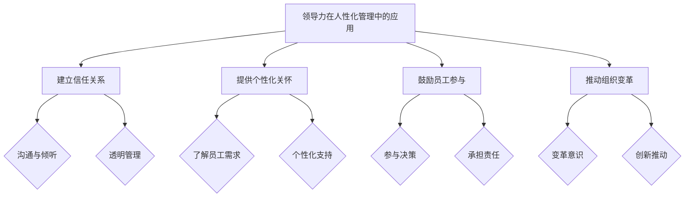

通过以上流程图，我们可以清晰地看到领导力在人性化管理中的应用场景和具体措施。这些措施不仅有助于提升员工的工作满意度和忠诚度，还能推动组织的可持续发展。

### 2.4 领导力发展的重要性

领导力发展是组织持续成功的关键。随着社会和经济的不断发展，组织面临着越来越多的挑战和变化，这要求领导者不断提升自身的领导力，以应对新的环境和需求。

**ER实体关系图架构**：

```mermaid
erDiagram
    Class Employee {
        +int employee_id
        +string name
        +string role
        +Manager manager { +int manager_id }
    }
    Class Leader {
        +int leader_id
        +string name
        +Employee employee
    }
    Leader ||--|{ Employee } Employee
```

在ER实体关系图中，我们定义了员工和领导者两个实体，并建立了领导者与员工之间的关联关系。这反映了领导力发展过程中，领导者与员工之间的互动和影响。

通过领导力的发展，组织能够培养一批具有高度领导力的员工，这些员工不仅能够在各自的岗位上发挥出色的表现，还能成为未来的领导者，为组织的持续发展提供源源不断的动力。

**小结**：

领导力在人性化管理中扮演着至关重要的角色。通过倾听与沟通、激励与鼓励、解决冲突、培养下属与授权等具体应用，领导者能够建立信任关系，提供个性化关怀，鼓励员工参与，推动组织变革。这不仅有助于提升员工的工作满意度和忠诚度，还能推动组织的可持续发展。因此，组织管理者应重视领导力的发展，为员工提供成长和发展的机会，打造一支高素质的领导团队。

### 2.5 领导力与人性化管理的关系

领导力与人性化管理之间存在密切的联系，二者相互促进、相辅相成。领导力是人性化管理的基础，而人性化管理则是领导力的具体实践。

**关系表格**：

| 关系特征 | 领导力 | 人性化管理 |
|----------|---------|-------------|
| 目标     | 引导团队实现目标 | 通过关怀和激励实现团队目标 |
| 方法     | 利用领导策略和方法 | 倡导人性化、个性化的管理方法 |
| 作用     | 激发员工潜能和积极性 | 满足员工需求，提高员工满意度和忠诚度 |
| 责任     | 负责团队的绩效和成长 | 负责营造和谐的工作环境，提升组织文化 |

通过以上表格，我们可以看出领导力与人性化管理之间的紧密关系。领导者通过发挥领导力，能够更好地实施人性化管理，提升组织的管理水平和员工的工作效率。

**Mermaid ER实体关系图**：

```mermaid
erDiagram
    Class Leader {
        +string name
        +int leader_id
    }
    Class Management {
        +string type
        +int management_id
    }
    Leader ||--|{ Management } Management
```

在ER实体关系图中，我们定义了领导者和管理两个实体，并建立了领导者与管理之间的关联关系。这反映了领导力与人性化管理之间的紧密联系，领导者通过实施人性化管理，推动组织的可持续发展。

**结论**：

领导力与人性化管理是相辅相成的，领导者需要具备强大的领导力，才能有效地实施人性化管理。同时，人性化管理也为领导力提供了广阔的舞台，使领导者的领导力得到充分体现和发挥。因此，组织管理者应重视领导力与人性化管理的关系，不断提升自身的领导力，推动组织的健康发展。

---

通过以上内容的阐述，我们可以看到领导力在人性化管理中的重要性。在下一部分，我们将深入探讨员工关怀的具体实践，为组织管理者提供更加具体的策略和方法。让我们继续深入思考，探索人性化管理模式的精髓。

## 第三部分：员工关怀的具体实践

### 3.1 员工关怀的核心要素

员工关怀的核心要素包括薪酬福利关怀、职业发展关怀、工作环境关怀、心理健康关怀和员工关系关怀。以下是对这些要素的详细解析：

#### 3.1.1 薪酬福利关怀

薪酬福利是员工最为关注的问题之一。合理的薪酬体系能够满足员工的经济需求，提高员工的工作积极性。同时，福利制度也是员工关怀的重要组成部分，如健康保险、退休金计划、带薪休假等。通过提供具有竞争力的薪酬和全面的福利，组织能够吸引和留住优秀人才。

**Mermaid表格**：

```mermaid
table
    | 薪酬福利项目 | 描述 |
    | :---         | :--- |
    | 基本工资     | 员工的基本收入 |
    | 奖金         | 员工的绩效奖励 |
    | 福利         | 员工的福利待遇 |
    | 补贴         | 员工的额外补贴 |
```

#### 3.1.2 职业发展关怀

职业发展关怀是员工长期关注的重点。组织应为员工提供明确的职业发展规划，包括培训、晋升机会和职业成长路径。通过定期的培训和发展计划，员工能够不断提升自身的技能和知识，实现个人价值和职业发展。此外，组织还应鼓励员工参与各种职业发展活动，如行业研讨会、专业认证等。

**Mermaid表格**：

```mermaid
table
    | 职业发展项目 | 描述 |
    | :---          | :--- |
    | 培训计划       | 提升员工专业技能 |
    | 晋升机制       | 员工的职业晋升路径 |
    | 职业规划       | 员工的职业发展目标 |
    | 跨部门交流     | 员工的多领域学习机会 |
```

#### 3.1.3 工作环境关怀

良好的工作环境能够提升员工的工作效率和满意度。组织应关注工作场所的硬件设施、办公环境、工作氛围等方面，确保员工能够在一个舒适、安全、高效的环境中工作。此外，组织还应倡导健康的工作方式，如定期组织员工进行体育锻炼、提供健康饮食等。

**Mermaid流程图**：

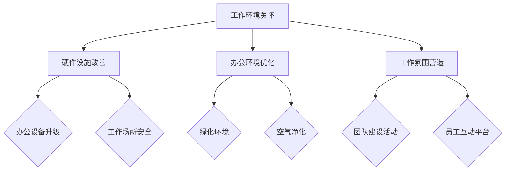

#### 3.1.4 心理健康关怀

心理健康关怀是员工关怀的重要环节。组织应关注员工的心理健康，提供心理辅导和咨询服务，帮助员工缓解工作压力，提升心理健康水平。此外，组织还可以通过举办心理健康讲座、提供心理测评等方式，提高员工的心理健康意识和应对能力。

**Mermaid流程图**：

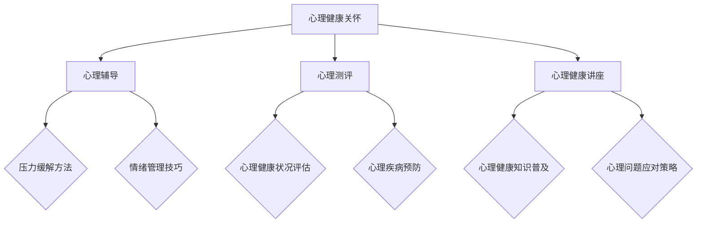

#### 3.1.5 员工关系关怀

员工关系关怀是构建和谐团队的基础。组织应关注员工之间的沟通与协作，建立良好的员工关系。通过定期的团队建设活动、员工座谈会等方式，组织可以增强员工的归属感和团队凝聚力。此外，组织还应建立完善的员工反馈机制，倾听员工的意见和建议，及时解决员工问题。

**Mermaid流程图**：

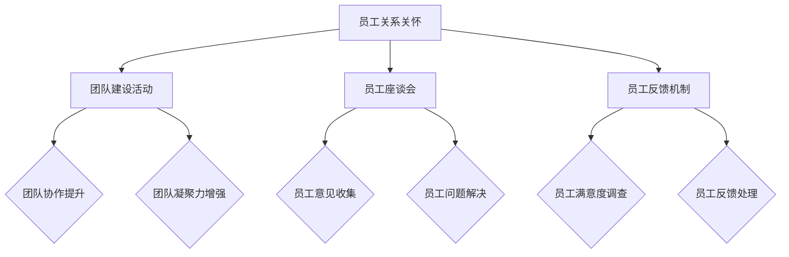

### 3.2 员工关怀策略的制定

制定有效的员工关怀策略是组织管理的重要任务。以下是一些关键步骤和方法：

#### 3.2.1 了解员工需求

组织应通过调查问卷、员工座谈会等方式，了解员工的需求和期望。这些信息将有助于制定有针对性的员工关怀策略。

**Mermaid表格**：

```mermaid
table
    | 需求类型 | 描述 |
    | :---     | :--- |
    | 薪酬福利 | 经济需求 |
    | 职业发展 | 职业成长 |
    | 工作环境 | 物理需求 |
    | 心理健康 | 心理需求 |
    | 员工关系 | 社交需求 |
```

#### 3.2.2 分析员工需求

组织应对收集到的员工需求进行深入分析，识别关键需求和优先级。这有助于确定哪些员工关怀措施最为迫切和有效。

**Mermaid流程图**：

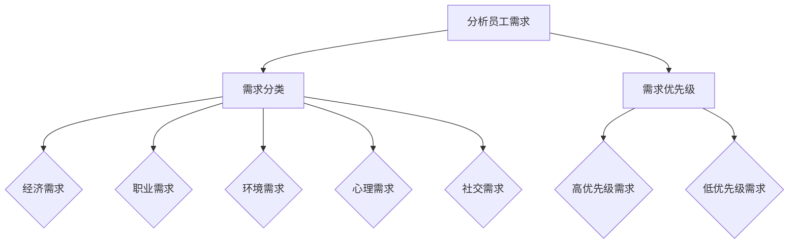

#### 3.2.3 制定关怀策略

基于员工需求分析，组织应制定具体的员工关怀策略。这些策略应包括薪酬福利、职业发展、工作环境、心理健康和员工关系等多个方面。

**Mermaid表格**：

```mermaid
table
    | 关怀项目 | 策略 |
    | :---      | :--- |
    | 薪酬福利 | 提供具有竞争力的薪酬和福利 |
    | 职业发展 | 提供培训和发展机会 |
    | 工作环境 | 优化办公环境和硬件设施 |
    | 心理健康 | 提供心理辅导和咨询服务 |
    | 员工关系 | 定期组织团队建设活动 |
```

#### 3.2.4 实施与评估

组织应实施制定的员工关怀策略，并定期进行评估和反馈。通过评估，组织可以了解员工关怀策略的实际效果，发现问题和不足，及时进行调整和改进。

**Mermaid流程图**：

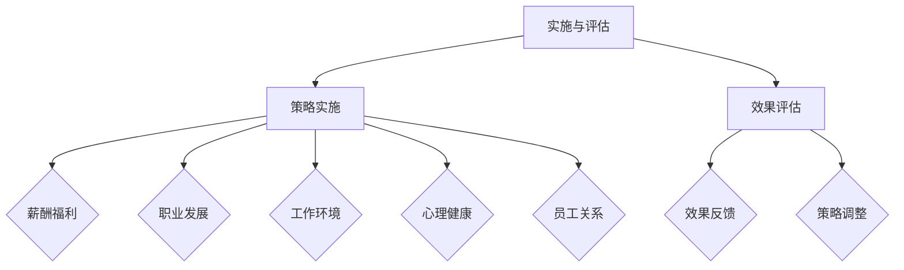

### 3.3 员工关怀的实施与评估

员工关怀的实施和评估是确保策略有效性的关键。以下是一些具体的实施步骤和评估方法：

#### 3.3.1 实施步骤

1. **制定详细计划**：明确员工关怀策略的具体内容和实施时间表。
2. **培训管理人员**：确保管理人员了解员工关怀策略，掌握实施方法。
3. **实施关怀措施**：按照计划，逐步实施各项关怀措施。
4. **跟踪与反馈**：及时跟踪关怀措施的执行情况，收集员工反馈，调整和优化措施。

**Mermaid流程图**：

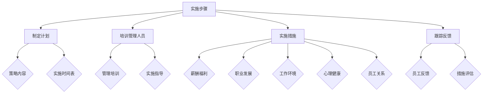

#### 3.3.2 评估方法

1. **员工满意度调查**：通过问卷调查、访谈等方式，了解员工对关怀措施的感受和满意度。
2. **关键绩效指标（KPI）**：设立相关指标，如员工流失率、员工满意度、工作绩效等，评估关怀措施的效果。
3. **员工反馈机制**：建立反馈渠道，收集员工对关怀措施的意见和建议，及时进行调整。

**Mermaid表格**：

```mermaid
table
    | 评估方法        | 描述                   |
    | :---            | :---                   |
    | 员工满意度调查  | 了解员工对关怀措施的感受 |
    | 关键绩效指标    | 评估关怀措施的效果     |
    | 员工反馈机制    | 收集员工意见和建议     |
```

**结论**：

员工关怀是人性化管理的重要组成部分，涉及薪酬福利、职业发展、工作环境、心理健康和员工关系等多个方面。通过制定有效的员工关怀策略，实施和评估关怀措施，组织可以提升员工的工作满意度和忠诚度，推动组织的可持续发展。在下一部分，我们将探讨人性化管理模式的构建与优化，为组织管理者提供更加深入的指导。

## 第四部分：人性化管理模式的构建与优化

### 4.1 人性化管理模式的设计原则

构建人性化管理模式需要遵循一系列原则，以确保管理策略的有效性和可持续性。以下是构建人性化管理模式时需要考虑的几个关键原则：

#### 4.1.1 尊重员工

尊重员工是人性化管理模式的核心原则之一。组织应尊重员工的个性、需求和权益，确保员工在工作中感受到被尊重和理解。这包括以下几个方面：

- **倾听与沟通**：领导者应主动倾听员工的意见和需求，建立双向沟通机制，确保员工的声音能够被听到。
- **公平对待**：在处理员工问题时，应公平、公正，避免偏私和歧视。
- **授权与支持**：给予员工足够的自主权和决策权，提供必要的支持和资源，鼓励员工发挥自身潜力。

**Mermaid流程图**：

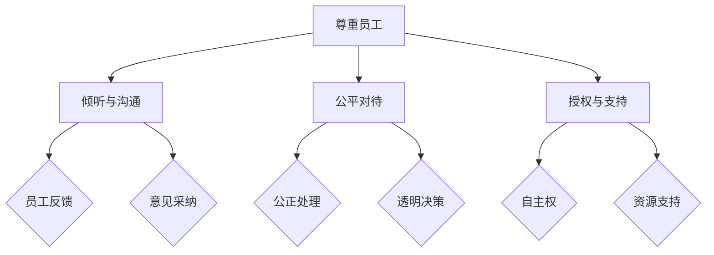

#### 4.1.2 满足需求

人性化管理模式应关注员工的多样性和需求，通过满足员工的需求来提高员工的满意度和忠诚度。以下是一些具体方法：

- **个性化关怀**：根据员工的个性和需求，提供个性化的关怀和支持，如职业发展机会、心理健康辅导等。
- **福利待遇**：提供具有竞争力的薪酬和福利，满足员工的经济需求。
- **工作与生活平衡**：关注员工的工作与生活平衡，提供灵活的工作安排和休假政策，帮助员工减轻工作压力。

**Mermaid表格**：

```mermaid
table
    | 关怀项目 | 方法 |
    | :---      | :--- |
    | 职业发展 | 个性化培训计划 |
    | 心理健康 | 心理辅导服务 |
    | 薪酬福利 | 具有竞争力的薪酬 |
    | 工作生活平衡 | 灵活的工作安排 |
```

#### 4.1.3 促进参与

促进员工的参与是提升员工满意度和团队凝聚力的重要手段。以下是一些促进员工参与的方法：

- **员工参与决策**：鼓励员工参与组织管理和决策过程，提高员工的参与感和责任感。
- **团队建设活动**：定期组织团队建设活动，增强员工之间的沟通与协作，提升团队凝聚力。
- **反馈机制**：建立有效的员工反馈机制，鼓励员工表达意见和建议，组织应及时回应和解决问题。

**Mermaid流程图**：

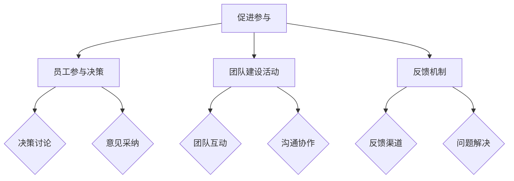

#### 4.1.4 持续改进

人性化管理模式不是一成不变的，而是一个持续改进的过程。组织应不断评估和优化管理策略，以适应不断变化的环境和员工需求。以下是一些持续改进的方法：

- **定期评估**：定期对员工关怀措施进行评估，了解其实际效果和员工满意度。
- **反馈与调整**：根据评估结果，及时调整和优化管理策略，确保员工关怀措施的持续有效性。
- **创新与尝试**：鼓励组织内部的创新和尝试，不断引入新的管理理念和方法。

**Mermaid流程图**：

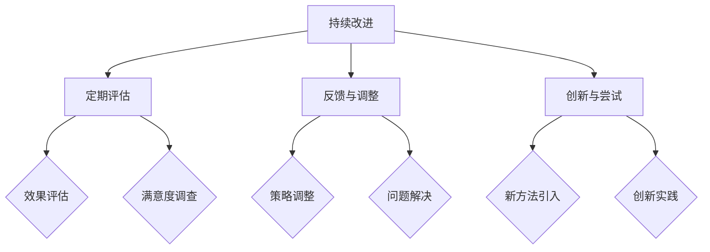

### 4.2 人性化管理模式的构建流程

构建人性化管理模式是一个系统的过程，需要经过多个阶段和步骤。以下是构建人性化管理模式的一般流程：

#### 4.2.1 确定管理目标

组织应明确人性化管理模式的目标，这些目标应与组织的整体战略和愿景相一致。目标可以是提高员工满意度、降低员工流失率、提升团队凝聚力等。

**Mermaid表格**：

```mermaid
table
    | 目标类型     | 描述                   |
    | :---         | :---                   |
    | 提高员工满意度  | 提升员工工作体验和幸福感 |
    | 降低员工流失率  | 增强员工忠诚度和归属感 |
    | 提升团队凝聚力  | 增强团队协作和合作能力 |
```

#### 4.2.2 分析员工需求

在确定管理目标后，组织应进行员工需求分析，了解员工的需求和期望。这可以通过问卷调查、访谈、员工座谈会等方式进行。

**Mermaid流程图**：

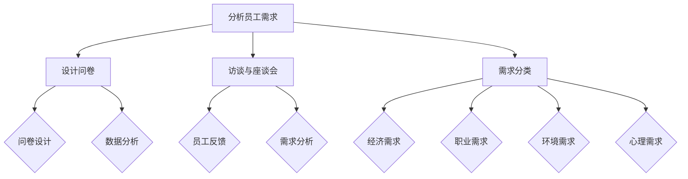

#### 4.2.3 制定管理策略

基于员工需求分析，组织应制定具体的人性化管理策略。这些策略应涵盖薪酬福利、职业发展、工作环境、心理健康和员工关系等方面。

**Mermaid表格**：

```mermaid
table
    | 关怀项目 | 策略 |
    | :---      | :--- |
    | 薪酬福利 | 提供具有竞争力的薪酬和福利 |
    | 职业发展 | 提供培训和发展机会 |
    | 工作环境 | 优化办公环境和硬件设施 |
    | 心理健康 | 提供心理辅导和咨询服务 |
    | 员工关系 | 定期组织团队建设活动 |
```

#### 4.2.4 实施与推广

在制定管理策略后，组织应实施和推广这些策略。这包括培训管理人员、制定详细计划、实施关怀措施等。

**Mermaid流程图**：

```mermaid
graph TD
    A[实施与推广] --> B[培训管理人员]
    A --> C[制定计划]
    A --> D[实施措施]
    B --> E{管理培训}
    B --> F{实施指导}
    C --> G{策略计划}
    C --> H{执行步骤}
    D --> I{薪酬福利}
    D --> J{职业发展}
    D --> K{工作环境}
    D --> L{心理健康}
    D --> M{员工关系}
```

#### 4.2.5 评估与优化

在实施人性化管理模式后，组织应定期评估管理策略的效果，收集员工反馈，并根据评估结果进行优化和调整。

**Mermaid流程图**：

```mermaid
graph TD
    A[评估与优化] --> B[效果评估]
    A --> C[反馈收集]
    A --> D[策略调整]
    B --> E{满意度调查}
    B --> F{KPI分析}
    C --> G{员工反馈}
    C --> H{问题识别}
    D --> I{策略优化}
    D --> J{问题解决}
```

**总结**：

构建人性化管理模式是一个系统性、持续性的过程，需要遵循尊重员工、满足需求、促进参与和持续改进的原则。通过明确管理目标、分析员工需求、制定管理策略、实施与推广、评估与优化等步骤，组织可以建立一套有效且可持续的人性化管理模式，提升员工满意度和组织竞争力。

在下一部分，我们将探讨人性化管理模式在不同组织中的应用与实践，为组织管理者提供具体的案例和经验。敬请期待！

### 4.3 人性化管理模式的应用与实践

人性化管理模式在不同组织中有着广泛的应用，通过具体的案例和实践，我们可以更好地理解其效果和意义。以下是一些具有代表性的案例：

#### 案例一：某大型企业的人性化管理实践

某大型企业通过实施人性化管理模式，取得了显著的效果。以下是该企业的具体实践：

1. **薪酬福利关怀**：该企业提供了具有竞争力的薪酬和全面的福利待遇，包括健康保险、退休金计划、带薪休假等。此外，企业还定期调整薪酬水平，以反映市场变化和员工贡献。

2. **职业发展关怀**：企业为员工提供了丰富的职业发展机会，包括内部培训、外部学习、职业晋升等。员工可以根据自己的兴趣和需求，选择合适的培训和发展路径。

3. **工作环境关怀**：企业注重工作环境的优化，提供了舒适、安全、高效的工作场所。企业还定期组织团队建设活动，增强员工之间的沟通与协作。

4. **心理健康关怀**：企业重视员工的心理健康，提供了心理辅导和咨询服务。员工可以通过电话、邮件等方式，随时获得专业的心理健康支持。

5. **员工关系关怀**：企业建立了良好的员工反馈机制，鼓励员工表达意见和建议。企业定期召开员工座谈会，倾听员工的声音，并及时解决员工问题。

通过以上措施，该企业显著提升了员工的工作满意度和忠诚度，员工流失率大幅降低，团队凝聚力显著增强。

#### 案例二：某创新型公司的人性化管理策略

某创新型公司通过创新的人性化管理策略，成功吸引了大量优秀人才，并保持了高效的工作氛围。以下是该公司的具体策略：

1. **个性化关怀**：公司根据员工的个性和需求，提供个性化的关怀和支持。例如，对于年轻的员工，公司提供了灵活的工作时间和远程工作机会；对于有家庭的员工，公司提供了托儿所和育儿假等福利。

2. **职业发展支持**：公司鼓励员工参与各种职业发展活动，如行业研讨会、专业认证等。公司还设立了内部晋升机制，为员工提供清晰的职业发展路径。

3. **创新文化**：公司倡导创新文化，鼓励员工提出新想法和解决方案。公司定期组织创新竞赛，为员工提供展示才华和获得奖励的机会。

4. **心理健康支持**：公司重视员工的心理健康，提供了心理辅导和咨询服务。公司还设立了员工支持小组，帮助员工解决工作和生活中的问题。

通过以上措施，该公司成功打造了一个创新、和谐的工作环境，吸引了大量优秀人才，并保持了高效的工作状态。

#### 案例三：某中小企业的人性化管理模式

某中小企业通过实施人性化管理模式，实现了快速的发展和员工的满意度提升。以下是该企业的具体实践：

1. **薪酬福利优化**：企业提供了具有竞争力的薪酬和福利待遇，包括绩效奖金、带薪休假、员工体检等。企业还定期调整薪酬结构，以反映市场变化和员工贡献。

2. **职业发展支持**：企业为员工提供了职业发展机会，包括内部培训、外部学习、职业晋升等。企业鼓励员工根据自己的兴趣和需求，制定职业发展规划。

3. **工作环境改善**：企业注重工作环境的优化，提供了舒适、安全、高效的工作场所。企业还定期组织团队建设活动，增强员工之间的沟通与协作。

4. **心理健康关注**：企业重视员工的心理健康，提供了心理辅导和咨询服务。企业还设立了员工支持小组，帮助员工解决工作和生活中的问题。

5. **员工关系和谐**：企业建立了良好的员工反馈机制，鼓励员工表达意见和建议。企业定期召开员工座谈会，倾听员工的声音，并及时解决员工问题。

通过以上措施，该企业成功提升了员工的工作满意度和忠诚度，员工流失率大幅降低，团队凝聚力显著增强。

**结论**：

人性化管理模式在不同组织中有着广泛的应用，通过具体的案例和实践，我们可以看到其显著的成效。无论是大型企业、创新型公司还是中小企业，人性化管理模式都能够提升员工的工作满意度和忠诚度，推动组织的可持续发展。组织管理者应重视人性化管理模式的应用，根据自身情况制定合适的策略，为员工提供全方位的关怀和支持。

在下一部分，我们将探讨人性化管理模式的优化与持续改进，为组织管理者提供更加深入和具体的指导。敬请期待！

### 4.4 人性化管理模式的优化

人性化管理模式的有效实施需要不断地优化与改进。以下是从多个方面提出的人性化管理模式优化策略：

#### 4.4.1 定期评估

定期评估是优化人性化管理模式的基础。组织应定期对员工关怀措施的效果进行评估，以了解员工的实际需求和满意度。评估可以通过员工满意度调查、绩效评估、员工反馈等多种方式进行。通过评估，组织可以识别出哪些措施有效，哪些需要改进，从而为优化提供依据。

**Mermaid流程图**：

```mermaid
graph TD
    A[定期评估] --> B[员工满意度调查]
    A --> C[绩效评估]
    A --> D[员工反馈]
    B --> E{满意度分析}
    B --> F{问题识别}
    C --> G{绩效对比}
    C --> H{改进建议}
    D --> I{反馈收集}
    D --> J{问题解决}
```

#### 4.4.2 持续改进

在评估的基础上，组织应持续改进人性化管理模式。改进措施可以包括调整薪酬福利、优化职业发展路径、改善工作环境、增强心理健康支持等。持续改进的关键在于及时响应员工的反馈和需求，确保管理策略始终与员工实际情况相匹配。

**Mermaid流程图**：

```mermaid
graph TD
    A[持续改进] --> B[策略调整]
    A --> C[措施优化]
    A --> D[员工反馈]
    B --> E{薪酬福利调整}
    B --> F{职业发展路径优化}
    B --> G{工作环境改善}
    B --> H{心理健康支持增强}
    D --> I{反馈响应}
    D --> J{问题解决}
```

#### 4.4.3 引入新技术

随着信息技术和人工智能的发展，人性化管理模式也可以通过引入新技术进行优化。例如，利用数据分析技术进行员工需求分析，利用人工智能进行个性化推荐，利用物联网技术改善工作环境等。新技术的引入可以提高管理效率，提升员工体验。

**Mermaid表格**：

| 技术应用          | 描述                                                         |
|-------------------|--------------------------------------------------------------|
| 数据分析          | 通过数据分析了解员工需求和满意度，优化管理策略                 |
| 人工智能          | 利用人工智能进行个性化推荐，提高员工关怀的精准性               |
| 物联网            | 通过物联网技术改善工作环境，提供更舒适、高效的工作体验         |

**Mermaid流程图**：

```mermaid
graph TD
    A[引入新技术] --> B[数据分析]
    A --> C[人工智能]
    A --> D[物联网]
    B --> E{需求分析}
    B --> F{满意度评估}
    C --> G{个性化推荐}
    C --> H{关怀优化}
    D --> I{环境监测}
    D --> J{工作体验提升}
```

#### 4.4.4 加强领导力培训

领导力在人性化管理中起着关键作用。组织应加强领导力培训，提升管理者的领导力水平，使其能够更好地实施人性化管理。培训内容可以包括倾听与沟通技巧、激励与鼓励策略、解决冲突能力等。

**Mermaid表格**：

| 培训内容        | 描述                                                         |
|-----------------|--------------------------------------------------------------|
| 倾听与沟通技巧  | 提高领导者与员工之间的沟通效果，增强信任和理解                 |
| 激励与鼓励策略  | 帮助领导者了解如何激励员工，提高员工的工作积极性和满意度       |
| 解决冲突能力    | 培训领导者如何处理和解决团队内部冲突，维护团队的和谐与稳定     |

**Mermaid流程图**：

```mermaid
graph TD
    A[领导力培训] --> B[倾听与沟通技巧]
    A --> C[激励与鼓励策略]
    A --> D[解决冲突能力]
    B --> E{沟通技巧培训}
    B --> F{信任建立}
    C --> G{激励方法培训}
    C --> H{满意度提升}
    D --> I{冲突处理培训}
    D --> J{团队稳定}
```

#### 4.4.5 建立反馈机制

建立有效的反馈机制是人性化管理模式优化的重要环节。组织应建立多渠道的反馈机制，包括定期员工满意度调查、匿名反馈平台、员工座谈会等，确保员工的意见和建议能够及时传达和得到回应。通过反馈机制，组织可以持续改进管理策略，提升员工的满意度和忠诚度。

**Mermaid流程图**：

```mermaid
graph TD
    A[建立反馈机制] --> B[满意度调查]
    A --> C[匿名反馈平台]
    A --> D[员工座谈会]
    B --> E{员工反馈}
    B --> F{问题识别}
    C --> G{匿名建议}
    C --> H{隐私保护}
    D --> I{意见收集}
    D --> J{问题解决}
```

**总结**：

人性化管理模式的优化是一个持续的过程，需要从定期评估、持续改进、引入新技术、加强领导力培训和建立反馈机制等多个方面进行。通过不断优化，组织可以更好地满足员工的需求，提升员工的工作满意度和忠诚度，实现组织的可持续发展。组织管理者应重视人性化管理模式的优化，根据实际情况制定合适的策略，为员工提供更加全面和人性化的关怀。

在下一部分，我们将探讨人性化管理模式与组织文化的融合，分析组织文化对人性化管理模式的影响。敬请期待！

### 4.5 人性化管理模式与组织文化的融合

人性化管理模式与组织文化的融合是提升管理效果和员工满意度的重要途径。组织文化是指组织内部共享的价值观、信念、行为规范和工作方式。它对人性化管理模式的实施具有深远影响，同时人性化管理模式也可以促进组织文化的建设与发展。

#### 4.5.1 组织文化对人性化管理模式的影响

1. **价值观导向**：组织文化中的核心价值观会影响管理者对人性化管理模式的认知和实践。例如，一个倡导“以人为本”的组织文化会更容易接受和实施人性化管理。

2. **行为规范**：组织文化中的行为规范会影响管理者的行为和决策。如果组织文化强调团队合作和员工关怀，管理者更可能采取人性化管理措施，如提供个性化关怀、促进员工参与等。

3. **组织氛围**：组织文化会影响组织氛围，进而影响员工的满意度和工作效率。一个开放、包容、支持性的组织文化能够营造良好的工作氛围，使员工感受到关怀和支持，从而提高工作满意度。

**Mermaid流程图**：

```mermaid
graph TD
    A[组织文化] --> B[价值观导向]
    A --> C[行为规范]
    A --> D[组织氛围]
    B --> E{影响人性化管理认知}
    B --> F{影响人性化管理实践}
    C --> G{影响管理行为}
    C --> H{影响管理决策}
    D --> I{影响员工满意度}
    D --> J{影响工作效率}
```

4. **员工行为**：组织文化会影响员工的行为和工作态度。例如，一个尊重创新和自主性的组织文化会鼓励员工积极提出建议和参与决策，从而提高员工的参与感和责任感。

**Mermaid表格**：

| 影响因素        | 描述                                                         |
|-----------------|--------------------------------------------------------------|
| 价值观导向      | 影响管理者对人性化管理模式的认同和实践                       |
| 行为规范        | 形成管理者的行为规范，影响人性化管理措施的实施               |
| 组织氛围        | 营造良好的工作氛围，提高员工的满意度和工作效率               |
| 员工行为        | 促进员工的积极行为和工作态度，提升团队协作和创新能力         |

#### 4.5.2 人性化管理模式对组织文化的建设与发展

1. **强化组织价值观**：人性化管理模式可以强化组织内部的价值观，如尊重员工、鼓励创新、促进团队合作等。通过人性化管理实践，组织能够将这些价值观内化为员工的共同信念，形成强大的组织文化。

2. **促进文化变革**：在组织面临外部环境变化时，人性化管理模式可以帮助组织进行文化变革，适应新的发展需求。例如，通过引入新的管理理念和方法，组织可以推动文化从传统的命令式管理向更加开放、包容、创新的方向转变。

3. **提升员工参与度**：人性化管理模式鼓励员工参与决策和管理，提升员工的参与度和责任感。这种参与不仅有助于员工个人发展，还能促进组织文化的建设，形成更加民主、开放的组织氛围。

4. **增强组织凝聚力**：通过人性化管理模式，组织能够建立和谐、支持的团队关系，增强员工的归属感和凝聚力。这种凝聚力是组织文化的重要组成部分，有助于形成强大的组织文化。

**Mermaid流程图**：

```mermaid
graph TD
    A[人性化管理模式] --> B[强化组织价值观]
    A --> C[促进文化变革]
    A --> D[提升员工参与度]
    A --> E[增强组织凝聚力]
    B --> F{价值观内化}
    B --> G{信念建设}
    C --> H{文化变革}
    C --> I{适应新需求}
    D --> J{决策参与}
    D --> K{责任提升}
    E --> L{归属感增强}
    E --> M{凝聚力提升}
```

**案例研究**：

以某高科技企业为例，该企业通过实施人性化管理模式，成功推动了组织文化的建设与发展。以下是该企业的具体实践：

1. **价值观建设**：企业强调“以人为本”，将员工视为企业最宝贵的财富。企业通过定期培训和宣传，将这一价值观深入到员工的内心，形成共同的信念。

2. **文化变革**：随着市场环境的变化，企业引入了新的管理理念，如敏捷管理、团队合作等。这些理念推动了组织文化的变革，使企业更加适应市场发展的需求。

3. **员工参与**：企业鼓励员工参与决策和管理，建立了员工代表会议制度，员工可以在会议中发表意见和建议。这种参与机制不仅提升了员工的积极性和责任感，还增强了组织凝聚力。

4. **团队建设**：企业定期组织团队建设活动，如团建、户外拓展等，增强员工之间的沟通与协作。这些活动有助于形成和谐、支持的团队氛围，提升了员工的归属感和凝聚力。

通过以上措施，该企业成功建立了强大的组织文化，推动了企业的持续发展和员工的满意度提升。

**结论**：

人性化管理模式与组织文化的融合是提升管理效果和员工满意度的重要途径。组织文化对人性化管理模式有深远影响，同时人性化管理模式也可以促进组织文化的建设与发展。组织管理者应重视组织文化与人性化管理模式的融合，通过强化价值观、促进文化变革、提升员工参与度和增强组织凝聚力，推动组织的可持续发展。

在下一部分，我们将探讨人性化管理模式的发展趋势，分析数字化背景下的变革。敬请期待！

### 4.6 人性化管理模式的发展趋势

随着数字化和知识经济的快速发展，人性化管理模式也面临着新的机遇和挑战。以下是人性化管理模式在未来可能的发展趋势：

#### 4.6.1 数字化背景下的变革

1. **数据驱动的员工关怀**：随着大数据技术的普及，组织可以通过收集和分析员工的数据，更准确地了解员工的需求和满意度。数据驱动的员工关怀可以帮助组织更有效地制定和调整管理策略，提高员工满意度和工作效率。

2. **人工智能的应用**：人工智能技术在员工关怀中的应用将日益广泛。例如，通过聊天机器人提供心理辅导、利用智能算法推荐个性化的培训和发展机会等。人工智能的应用可以提高管理效率，提升员工体验。

**Mermaid流程图**：

```mermaid
graph TD
    A[数字化背景] --> B[数据驱动的员工关怀]
    A --> C[人工智能的应用]
    B --> D{数据收集与分析}
    B --> E{策略调整与优化}
    C --> F{聊天机器人}
    C --> G{智能算法推荐}
```

3. **远程办公与灵活工作**：随着远程办公技术的成熟，越来越多的组织开始采用灵活的工作方式。这种趋势要求人性化管理模式适应远程办公环境，提供适合远程员工的关怀措施，如远程心理健康支持、在线团队建设活动等。

**Mermaid表格**：

| 关怀项目         | 描述                                                         |
|-------------------|--------------------------------------------------------------|
| 远程心理健康支持  | 为远程员工提供在线心理辅导和咨询服务                         |
| 在线团队建设活动  | 通过虚拟会议和在线平台组织团队建设活动，增强远程团队的凝聚力 |

**Mermaid流程图**：

```mermaid
graph TD
    A[远程办公与灵活工作] --> B[远程心理健康支持]
    A --> C[在线团队建设活动]
    B --> D{在线心理辅导}
    B --> E{在线咨询服务}
    C --> F{虚拟会议}
    C --> G{在线平台协作}
```

#### 4.6.2 知识经济与人才竞争

1. **人才争夺**：在知识经济时代，人才成为企业竞争力的关键。组织需要通过人性化管理模式吸引和留住优秀人才。这意味着组织需要在薪酬福利、职业发展、工作环境等方面提供更具吸引力的关怀措施。

2. **终身学习与职业发展**：知识更新速度快，员工需要不断学习和提升技能。人性化管理模式应鼓励员工进行终身学习，提供丰富的培训和发展机会，帮助员工适应快速变化的工作环境。

**Mermaid表格**：

| 职业发展项目     | 描述                                                         |
|-------------------|--------------------------------------------------------------|
| 终身学习计划      | 为员工提供持续学习和发展的机会                               |
| 职业发展通道      | 明确员工的职业发展路径，为员工提供清晰的晋升和发展机会       |

**Mermaid流程图**：

```mermaid
graph TD
    A[知识经济与人才竞争] --> B[人才争夺]
    A --> C[终身学习与职业发展]
    B --> D{薪酬福利吸引}
    B --> E{职业发展机会}
    C --> F{培训计划}
    C --> G{发展通道明确}
```

#### 4.6.3 社会责任与可持续发展

1. **社会责任**：在全球化背景下，企业越来越重视社会责任。人性化管理模式应融入社会责任，关注员工的全面发展和心理健康，同时推动组织的可持续发展。

2. **员工福利多样化**：随着员工需求的多样化，组织需要提供更加多样化的福利，如健康保险、家庭支持、社区参与等，以满足员工的不同需求。

**Mermaid表格**：

| 员工福利项目     | 描述                                                         |
|-------------------|--------------------------------------------------------------|
| 健康保险          | 提供全面的健康保障，减轻员工的健康负担                       |
| 家庭支持          | 提供家庭福利，如育儿假、家庭日等，帮助员工平衡工作与家庭生活 |

**Mermaid流程图**：

```mermaid
graph TD
    A[社会责任与可持续发展] --> B[社会责任]
    A --> C[员工福利多样化]
    B --> D{员工全面发展}
    B --> E{心理健康关注}
    C --> F{健康保险}
    C --> G{家庭支持}
```

**结论**：

数字化和知识经济的发展为人性化管理模式带来了新的机遇和挑战。通过数据驱动、人工智能应用、远程办公和灵活工作、终身学习与职业发展、社会责任与可持续发展等趋势，人性化管理模式将不断进化，为员工和组织创造更大的价值。组织管理者应密切关注这些趋势，积极调整管理策略，以应对未来发展的需求。

在下一部分，我们将探讨人性化管理模式面临的挑战及其应对策略。敬请期待！

### 4.7 人性化管理模式面临的挑战与应对策略

尽管人性化管理模式在提升员工满意度和组织绩效方面具有显著优势，但在实施过程中也面临着一系列挑战。以下是人性化管理模式面临的主要挑战及其应对策略：

#### 4.7.1 挑战一：组织适应性与变革阻力

**挑战描述**：在实施人性化管理模式时，许多组织可能会面临适应性和变革阻力。一些员工和管理者可能对新的管理方法不熟悉或不信任，担心失去既得利益或权力。

**应对策略**：

1. **领导层的支持**：组织领导层应积极倡导人性化管理理念，并提供必要的资源和支持，以确保变革的顺利进行。

2. **员工培训**：组织应提供针对人性化管理模式的培训，帮助员工和管理者了解和接受新的管理方法。

**Mermaid流程图**：

```mermaid
graph TD
    A[领导层支持] --> B[员工培训]
    A --> C[资源支持]
    B --> D{理念普及}
    B --> E{技能提升}
```

#### 4.7.2 挑战二：员工期望与实际关怀的平衡

**挑战描述**：在实施人性化管理模式时，组织可能面临员工期望与实际关怀之间的平衡问题。如果员工的期望过高而实际关怀不足，可能会导致员工的不满和失望。

**应对策略**：

1. **透明沟通**：组织应建立透明、开放的沟通机制，确保员工了解组织的关怀策略和实施计划。

2. **持续反馈**：组织应定期收集员工反馈，及时调整和优化关怀措施，确保实际关怀与员工期望相匹配。

**Mermaid流程图**：

```mermaid
graph TD
    A[透明沟通] --> B[持续反馈]
    A --> C[员工参与]
    B --> D{信息共享}
    B --> E{策略调整}
```

#### 4.7.3 挑战三：管理者的领导力培养

**挑战描述**：人性化管理模式对管理者的领导力提出了更高要求。许多组织可能缺乏具备人性化管理能力的领导者，这可能导致人性化管理模式的实施效果不佳。

**应对策略**：

1. **领导力培训**：组织应提供系统的领导力培训，帮助管理者提升人性化管理技能。

2. **选拔与激励**：组织应选拔具备人性化管理能力的人才担任领导职位，并通过激励措施鼓励他们积极实施人性化管理。

**Mermaid流程图**：

```mermaid
graph TD
    A[领导力培训] --> B[选拔与激励]
    A --> C[技能提升]
    B --> D{能力培养}
    B --> E{激励机制}
```

#### 4.7.4 挑战四：资源限制

**挑战描述**：实施人性化管理模式可能需要额外的资源投入，如培训费用、福利待遇等。一些组织可能因为资源限制而无法全面实施人性化管理。

**应对策略**：

1. **优先级排序**：组织应根据员工需求和实际情况，优先投资于最关键的关怀项目。

2. **创新解决方案**：组织可以通过创新解决方案，如内部资源整合、合作共赢等，以有限的资源实现最大的关怀效果。

**Mermaid流程图**：

```mermaid
graph TD
    A[优先级排序] --> B[创新解决方案]
    A --> C[资源整合]
    B --> D{关键项目投资}
    B --> E{合作共赢}
```

**结论**：

人性化管理模式在实施过程中面临着组织适应性、员工期望与实际关怀的平衡、管理者的领导力培养以及资源限制等挑战。通过领导层的支持、员工培训、透明沟通、持续反馈、领导力培养、优先级排序和创新解决方案等策略，组织可以有效地应对这些挑战，实现人性化管理模式的有效实施。

在下一部分，我们将总结文章，提出最佳实践建议，并对文章进行小结。敬请期待！

### 4.8 最佳实践建议

在实施人性化管理模式的过程中，组织可以借鉴以下最佳实践建议，以提升员工满意度和组织绩效：

1. **领导带头，全员参与**：领导层应率先践行人性化管理理念，通过行动示范带动全员参与，营造良好的管理氛围。

2. **定期培训，提升技能**：定期为员工和管理者提供培训，提升他们在人性化管理方面的技能和认知。

3. **透明沟通，及时反馈**：建立透明的沟通机制，确保员工和管理者之间的信息流通，及时收集和回应员工反馈，以优化管理策略。

4. **关注心理健康，提供支持**：重视员工的心理健康，提供心理辅导和咨询服务，帮助员工应对工作压力和挑战。

5. **灵活安排，支持工作与生活平衡**：根据员工需求，灵活安排工作时间和地点，提供带薪休假、家庭支持等福利，帮助员工平衡工作与生活。

6. **创新激励机制，提升员工积极性**：设计创新的激励机制，如员工推荐奖、项目奖金等，激发员工的工作积极性和创造力。

7. **持续优化，追求卓越**：不断评估和改进人性化管理模式，根据员工反馈和市场变化，调整和优化管理策略，追求卓越的管理效果。

通过以上最佳实践建议，组织可以更好地实施人性化管理模式，提升员工满意度和忠诚度，推动组织的可持续发展。

### 4.9 小结

本文深入探讨了人性化管理模式在现代组织中的重要性，从背景介绍、核心概念、领导力作用、员工关怀实践、模式构建与优化、应用与实践、趋势分析以及挑战应对等多个方面进行了详细阐述。通过本文的讨论，我们可以得出以下几点结论：

1. **人性化管理模式的核心价值**：人性化管理模式强调以人为中心，满足员工需求，提高员工满意度和忠诚度，从而推动组织的可持续发展。

2. **领导力在人性化管理中的关键作用**：领导者通过倾听与沟通、激励与鼓励、解决冲突、培养下属与授权等具体应用，能够建立信任关系，提供个性化关怀，鼓励员工参与，推动组织变革。

3. **员工关怀的具体实践**：薪酬福利关怀、职业发展关怀、工作环境关怀、心理健康关怀和员工关系关怀是员工关怀的核心要素，组织应通过个性化策略满足员工需求。

4. **人性化管理模式的构建与优化**：构建人性化管理模式需要遵循一系列原则，如尊重员工、满足需求、促进参与和持续改进，通过科学的设计和实施流程，确保管理策略的有效性。

5. **数字化背景下的变革趋势**：在数字化和知识经济时代，数据驱动的员工关怀、人工智能的应用、远程办公与灵活工作、终身学习与职业发展、社会责任与可持续发展等人性化管理模式的新趋势，为组织提供了新的发展机遇。

6. **面临的挑战与应对策略**：实施人性化管理模式面临组织适应性与变革阻力、员工期望与实际关怀的平衡、管理者的领导力培养和资源限制等挑战，组织应通过领导层的支持、员工培训、透明沟通、持续反馈、领导力培养、优先级排序和创新解决方案等策略来应对。

总之，人性化管理模式是一种科学且有效的人力资源管理策略，组织管理者应重视并积极实施，为员工提供全方位的关怀和支持，推动组织的持续发展和员工个人成长。

### 作者信息

作者：AI天才研究院/AI Genius Institute & 禅与计算机程序设计艺术 /Zen And The Art of Computer Programming

AI天才研究院（AI Genius Institute）致力于推动人工智能领域的研究和应用，为全球企业和组织提供先进的AI解决方案和技术支持。同时，研究院还专注于培养下一代人工智能专家，推动人工智能技术的发展和应用。

《禅与计算机程序设计艺术》（Zen And The Art of Computer Programming）是一部经典的技术畅销书，由著名计算机科学家Donald E. Knuth撰写。该书通过哲学和禅宗的智慧，探讨了计算机编程的本质和方法，为程序员提供了深刻的思考和启示。

本文结合了AI天才研究院在人工智能领域的专业知识和《禅与计算机程序设计艺术》中的哲学理念，旨在为组织管理者提供一种深入且全面的领导力和员工关怀管理策略。希望通过本文的分享，能够帮助读者更好地理解和应用人性化管理模式，推动组织的可持续发展。

