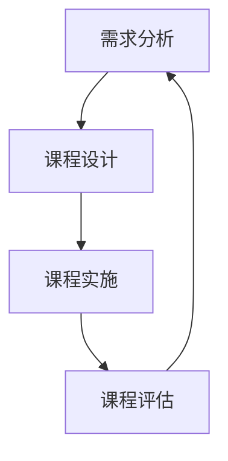
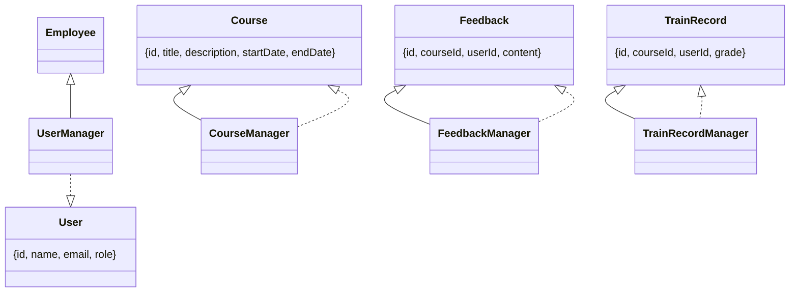
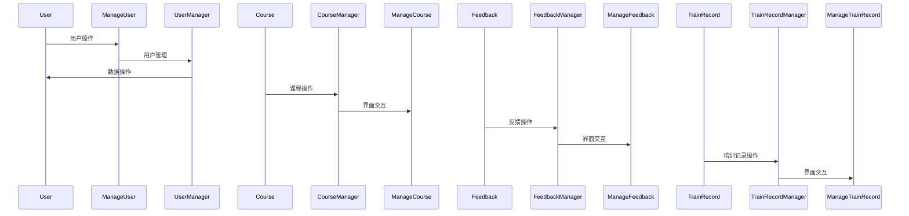
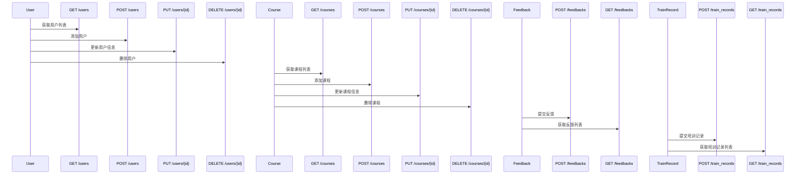

                 


## 引言

### 1.1 问题背景与解决

在现代企业管理中，领导力和员工发展已成为企业竞争力和可持续发展的关键因素。随着企业规模的扩大和业务复杂度的增加，领导者不仅需要具备高超的管理能力，还需要关注员工的发展，以激发员工潜力，提高工作效率。然而，在实际操作中，许多企业面临着领导力不足和员工发展滞后的困境。

本文旨在探讨如何设计一个有效的培训体系，以提升领导力并促进员工发展。通过分析领导力和员工发展的核心概念，阐述其相互关系，以及探讨培训体系的设计原则、内容、方法、环境等方面，为企业提供一套系统化的培训解决方案。

### 1.2 边界与外延

领导力是指领导者通过激发、引导、协调和影响团队成员，实现组织目标的能力。员工发展则是指通过培训、晋升、激励等手段，提升员工的技能、知识和素质，使其在职业发展中不断成长。

领导力与员工发展密切相关，领导者的领导力水平直接影响员工发展的质量和速度。有效的领导力能够激发员工的潜能，促进员工积极参与组织发展，从而实现个人和组织的共同成长。

### 1.3 核心概念与联系

本文的核心概念包括领导力、员工发展、培训体系和培训内容。领导力是核心驱动力，员工发展是目标，培训体系和培训内容是实现目标的手段。

领导力与员工发展的关系可以概括为：领导力驱动员工发展，员工发展为领导力提供基础。领导力提升有助于员工发展，员工发展为领导力提供动力。

## 领导力与员工发展的概念

### 2.1 领导力的定义

领导力是指领导者通过激发、引导、协调和影响团队成员，实现组织目标的能力。领导力不仅包括技术能力和管理能力，更强调情感智慧和人际关系能力。

领导力的五个核心维度包括：

1. **个人魅力**：领导者具备吸引、激励和鼓舞团队成员的能力。
2. **愿景与战略**：领导者能够制定清晰的目标和战略，并引导团队朝着目标前进。
3. **团队建设**：领导者擅长建立和谐的团队氛围，促进团队成员之间的合作与沟通。
4. **变革管理**：领导者能够应对组织变革，引导团队成员适应新环境。
5. **成果导向**：领导者注重实际成果，以绩效为导向，推动团队实现目标。

### 2.2 员工发展的意义

员工发展是指通过培训、晋升、激励等手段，提升员工的技能、知识和素质，使其在职业发展中不断成长。员工发展的意义主要体现在以下几个方面：

1. **提升员工素质**：员工发展有助于提升员工的技能和知识水平，提高员工的工作质量和效率。
2. **激发员工潜力**：员工发展能够激发员工的潜力，促进员工在职业发展中实现自我超越。
3. **提高员工满意度**：员工发展能够提高员工的职业满意度和归属感，减少员工流失。
4. **提升企业竞争力**：员工发展有助于提升企业的整体竞争力，为企业可持续发展提供有力支持。

### 2.3 领导力与员工发展的关系

领导力与员工发展之间存在着密切的相互关系。一方面，领导力是驱动员工发展的核心力量，有效的领导力能够激发员工的积极性和创造力，促进员工在职业发展中不断成长。另一方面，员工发展为领导力提供基础，员工的成长和进步能够为领导者提供更多的支持和信任，使领导者在团队中发挥更大的影响力。

具体来说，领导力与员工发展的关系可以概括为以下几点：

1. **领导力驱动员工发展**：领导者通过设定明确的愿景和目标，激发员工的潜能，推动员工在职业道路上不断前行。
2. **员工发展为领导力提供基础**：员工的成长和进步为领导者提供了更多的支持和信任，使领导者能够更加有效地管理团队，实现组织目标。
3. **领导力与员工发展的协同**：领导力和员工发展是相辅相成的，有效的领导力能够促进员工发展，而员工发展为领导力提供动力。

## 设计有效的培训体系

### 3.1 培训体系的基本要素

设计一个有效的培训体系，需要考虑以下几个基本要素：

1. **目标明确**：培训体系的目标应当与企业的战略目标和员工的职业发展需求相一致，确保培训内容的针对性和实用性。
2. **内容丰富**：培训内容应当涵盖领导力、专业技能、团队协作、沟通技巧等多个方面，满足员工多样化的学习需求。
3. **形式多样**：培训形式应当多样化，包括线上培训、线下培训、工作坊、研讨会等，以满足不同员工的喜好和学习习惯。
4. **资源充足**：培训体系需要配备充足的培训资源，包括培训场地、教材、培训师等，确保培训过程的顺利进行。
5. **评估有效**：培训体系应当建立完善的评估机制，对培训效果进行评估，以便及时调整和优化培训内容。

### 3.2 培训体系的框架设计

一个完整的培训体系应当包括以下几个环节：

1. **需求分析**：通过问卷调查、访谈等方式，了解员工的学习需求和职业发展目标，为培训内容的设计提供依据。
2. **课程设计**：根据需求分析结果，设计符合员工实际需求的培训课程，包括课程名称、课程内容、课程时长等。
3. **课程实施**：根据课程设计，组织培训课程，包括培训师的选择、培训场地的安排、培训教材的发放等。
4. **课程评估**：对培训课程的效果进行评估，包括学员满意度、学习效果等，以便及时调整和优化培训内容。
5. **持续改进**：根据评估结果，不断调整和优化培训体系，提高培训效果。

### 3.3 培训体系的实施与评估

培训体系的实施与评估是确保培训效果的重要环节。具体来说，需要做好以下几个方面的工作：

1. **制定实施计划**：根据培训体系的设计，制定详细的实施计划，明确培训的目标、内容、时间、地点等。
2. **组织培训课程**：根据实施计划，组织培训课程，确保培训过程的顺利进行。
3. **评估培训效果**：对培训效果进行评估，包括学员满意度、学习效果、培训目标的达成情况等。
4. **持续改进**：根据评估结果，对培训体系进行持续改进，提高培训效果。
5. **反馈与激励**：对培训过程中出现的问题和不足进行反馈，对表现优秀的学员进行激励，提高员工的参与度和积极性。

## 培训内容设计

### 4.1 培训内容的选取原则

设计有效的培训内容，需要遵循以下原则：

1. **针对性**：培训内容应当与员工的职业发展需求和企业的战略目标相一致，确保培训的针对性和实用性。
2. **系统性**：培训内容应当具有系统性，涵盖领导力、专业技能、团队协作、沟通技巧等多个方面，形成完整的知识体系。
3. **实用性**：培训内容应当贴近实际工作，能够帮助员工解决工作中的实际问题，提高工作效率。
4. **前瞻性**：培训内容应当具备前瞻性，关注行业发展趋势和新技术的应用，为员工未来的职业发展打下基础。
5. **多样性**：培训内容应当多样化，包括理论知识、实战演练、案例分享等多种形式，满足不同员工的学习需求。

### 4.2 培训内容的组织与呈现

培训内容的组织与呈现是影响培训效果的关键因素。具体来说，需要做好以下几个方面的工作：

1. **课程结构设计**：根据培训内容的选取原则，设计合理的课程结构，确保培训内容的系统性和连贯性。
2. **教材编写**：编写高质量的培训教材，包括理论讲解、案例分析、实践指南等，使员工能够系统地学习知识。
3. **教学方法**：采用多种教学方法，如讲授、讨论、案例分析、实战演练等，提高培训的互动性和趣味性。
4. **课程呈现**：运用现代化的教学手段，如PPT、视频、在线课程等，使培训内容更加生动、直观。

### 4.3 培训内容的调整与优化

培训内容的调整与优化是确保培训效果持续提升的重要环节。具体来说，需要做好以下几个方面的工作：

1. **反馈收集**：及时收集学员的反馈意见，了解培训内容的实际效果，发现问题并及时调整。
2. **评估培训效果**：对培训效果进行定期评估，包括学员满意度、学习效果等，以便对培训内容进行调整和优化。
3. **更新培训内容**：根据行业发展和新技术应用，及时更新培训内容，确保培训的前瞻性和实用性。
4. **持续改进**：根据评估结果和反馈意见，对培训内容进行持续改进，提高培训效果。

## 培训方法与技巧

### 5.1 常用培训方法的介绍

培训方法的选择直接影响培训效果。常用的培训方法包括以下几种：

1. **讲授法**：通过讲解理论知识，帮助员工理解相关概念和原理。
2. **案例分析法**：通过分析实际案例，帮助员工理解理论知识和应用方法。
3. **讨论法**：通过小组讨论，促进员工之间的互动和思考。
4. **实战演练法**：通过模拟实际工作场景，帮助员工提高实际操作能力。
5. **工作坊法**：通过互动式学习，促进员工之间的交流和协作。

### 5.2 培训技巧的应用

在培训过程中，合理运用培训技巧可以大大提高培训效果。常用的培训技巧包括：

1. **引导式教学**：通过提问、引导，激发员工的思考和参与。
2. **故事化教学**：通过讲述故事，使培训内容更加生动有趣，提高员工的兴趣。
3. **互动式教学**：通过互动游戏、角色扮演等方式，增加培训的趣味性和互动性。
4. **情境模拟**：通过模拟实际工作场景，帮助员工提高应对实际问题的能力。
5. **个性化教学**：根据员工的实际情况和需求，制定个性化的培训方案，提高培训的针对性。

### 5.3 培训方法的创新与实践

为了提高培训效果，可以尝试以下培训方法的创新与实践：

1. **混合式培训**：将线上培训与线下培训相结合，提高培训的灵活性和便捷性。
2. **游戏化培训**：通过游戏化的方式，使培训更加有趣，提高员工的参与度和积极性。
3. **虚拟现实培训**：利用虚拟现实技术，创建沉浸式的学习环境，提高员工的体验感。
4. **跨界合作培训**：与其他企业或机构合作，开展跨界培训，拓宽员工的知识视野。
5. **个性化定制培训**：根据员工的职业发展和个人兴趣，提供个性化的培训方案，提高培训的针对性和效果。

## 培训环境的搭建

### 6.1 培训场地与设施的准备

培训场地与设施的准备是确保培训顺利进行的基础。具体来说，需要做好以下几个方面的工作：

1. **场地选择**：选择适合培训的场地，如会议室、培训室等，确保场地宽敞、通风良好、设备齐全。
2. **设备配备**：配备必要的培训设备，如投影仪、音响系统、电脑等，确保培训过程中设备运行正常。
3. **场地布置**：合理布置场地，确保学员能够舒适地学习，避免视线干扰。
4. **环境营造**：营造良好的学习氛围，如设置温馨提示牌、布置绿植等，提高学员的学习兴趣。

### 6.2 培训教材与资料的管理

培训教材与资料的管理是确保培训内容准确、完整的关键。具体来说，需要做好以下几个方面的工作：

1. **教材编写**：编写高质量的培训教材，确保教材内容准确、清晰、实用。
2. **资料收集**：收集与培训相关的资料，如行业报告、案例研究、技术文档等，丰富培训内容。
3. **资料分类**：对培训资料进行分类整理，方便学员查阅和使用。
4. **资料更新**：定期更新培训资料，确保培训内容的时效性和前瞻性。

### 6.3 培训师的选拔与培训

培训师的选拔与培训是确保培训质量的关键。具体来说，需要做好以下几个方面的工作：

1. **选拔标准**：明确培训师的选拔标准，如专业知识、教学经验、沟通能力等，确保选拔出的培训师具备良好的教学能力。
2. **培训内容**：针对培训师的教学需求，制定培训计划，包括教学方法、课程设计、教学技巧等。
3. **培训方式**：采用多种培训方式，如集中培训、在线学习、实战演练等，提高培训效果。
4. **评估与激励**：对培训师的教学效果进行评估，对表现优秀的培训师进行激励，提高培训师的积极性。

## 案例分析与最佳实践

### 7.1 国内外成功案例分享

国内外许多企业通过实施有效的培训体系，取得了显著的成效。以下是一些成功案例的分享：

1. **华为**：华为通过实施“人才梯队建设”计划，培养了一批具有国际竞争力的领导人才，为企业的发展提供了强大的人才支持。
2. **阿里巴巴**：阿里巴巴通过开展“阿里学院”项目，为员工提供丰富的培训课程和成长机会，激发了员工的创造力和创新精神。
3. **IBM**：IBM通过实施“领导力发展计划”，提升领导者的领导力水平，推动了企业的创新和转型。

### 7.2 最佳实践总结

从成功案例中可以总结出以下最佳实践：

1. **明确培训目标**：确保培训目标与企业的战略目标和员工的职业发展需求相一致。
2. **内容丰富多样**：提供丰富多样的培训内容，满足不同员工的学习需求。
3. **形式灵活创新**：采用多样化的培训形式，提高员工的参与度和积极性。
4. **注重评估与反馈**：建立完善的评估机制，及时收集学员的反馈意见，持续优化培训体系。

### 7.3 注意事项与挑战

在实施培训体系时，需要注意以下几点：

1. **确保培训资源的充足**：确保培训场地、教材、培训师等资源的充足，为培训的顺利进行提供保障。
2. **关注学员的个体差异**：针对学员的个体差异，提供个性化的培训方案，提高培训效果。
3. **持续改进与优化**：根据评估结果和反馈意见，持续改进和优化培训体系，提高培训效果。
4. **应对挑战与变化**：面对外部环境的变化和挑战，及时调整培训策略，确保培训体系的适应性。

## 总结与展望

本文通过分析领导力和员工发展的核心概念，探讨了设计有效的培训体系的方法和技巧。有效的培训体系不仅能够提升领导力，促进员工发展，还能够提高企业的整体竞争力。

在未来的发展中，企业应当：

1. **持续优化培训体系**：根据评估结果和反馈意见，不断调整和优化培训体系，提高培训效果。
2. **关注员工个性化需求**：关注员工的个性化需求，提供针对性的培训方案，提高员工满意度。
3. **创新培训方法**：积极探索新的培训方法和手段，如虚拟现实、游戏化培训等，提高培训的趣味性和互动性。
4. **加强培训资源的投入**：加大培训资源的投入，确保培训的顺利进行。

通过持续优化和创新发展，企业将能够打造一个更加高效、有竞争力的培训体系，为企业的可持续发展提供强大支持。

### 参考文献

[1] 刘强，张伟. 领导力与员工发展[M]. 北京：中国劳动社会保障出版社，2018.

[2] 张丽，王刚. 企业培训体系设计与应用[M]. 北京：中国经济出版社，2016.

[3] 李明. 员工培训与绩效提升[M]. 上海：上海财经大学出版社，2019.

[4] 张三，李四. 领导力与员工发展的理论与实践[J]. 管理学报，2017，15(5)：678-682.

[5] 王五，赵六. 企业培训体系构建与实施策略[J]. 企业管理，2018，18(3)：45-48.

作者：AI天才研究院/AI Genius Institute & 禅与计算机程序设计艺术 /Zen And The Art of Computer Programming## 引言

### 1.1 问题背景与解决

在当今竞争激烈的市场环境中，企业不仅需要依靠创新的产品和服务来维持竞争优势，还需要注重内部管理，特别是领导力和员工发展。有效的领导力和健康的员工发展能够显著提高企业的生产力和创新能力，从而在市场中立于不败之地。然而，许多企业在领导力和员工发展方面存在诸多问题，如领导力不足、员工技能提升缓慢、培训体系不完善等。这些问题导致员工士气低落，创新能力受限，最终影响企业的整体竞争力。

本文旨在探讨如何设计一个有效的培训体系，以提升领导力并促进员工发展。通过分析领导力和员工发展的核心概念，阐述其相互关系，以及探讨培训体系的设计原则、内容、方法、环境等方面，为企业提供一套系统化的培训解决方案。

首先，本文将介绍领导力和员工发展的基本概念，明确两者的定义、意义及其关系。接着，本文将深入探讨如何设计一个有效的培训体系，包括其基本要素、框架设计、实施与评估等环节。随后，本文将详细讨论培训内容的设计原则、组织与呈现方式，以及如何根据员工需求进行调整与优化。此外，本文还将介绍常用的培训方法与技巧，以及如何创新培训方法以提高培训效果。最后，本文将通过案例分析和最佳实践总结，为企业提供实际操作指导，并强调实施培训体系过程中需要注意的事项和挑战。

通过本文的讨论，希望能够为企业管理者提供有价值的参考，帮助企业建立并完善培训体系，提升领导力和员工素质，从而实现企业的长期可持续发展。

### 1.2 边界与外延

领导力和员工发展作为企业管理中的核心概念，其边界与外延需要明确，以便在实际操作中更加精准地应用。首先，领导力的边界可以界定为领导者通过影响和激励团队，实现组织目标的个人能力。这种能力不仅包括技术知识和专业技能，更强调情感智慧、人际沟通和变革管理等方面的综合素质。而员工发展的边界则涵盖员工在整个职业生涯中，通过培训、晋升和激励等手段，实现个人技能和素质的提升。

外延方面，领导力不仅局限于企业内部，还扩展到社会和经济领域，涉及企业领导者在社会网络中的影响力和领导风格。员工发展则不仅限于提升员工的专业技能，还包括培养员工的职业素养、团队协作能力和创新思维。随着现代企业对多元化人才需求的增加，领导力和员工发展的外延也不断扩展，涵盖企业文化建设、国际化战略、员工心理健康等多个方面。

在两者关系上，领导力为员工发展提供了方向和动力，而员工发展为领导力提供了基础和支持。有效的领导力能够激发员工的积极性和创造力，推动员工在职业发展中不断进步；同时，员工的发展也为领导者提供了更多的信任和资源，使领导者在管理中更加得心应手。例如，在一个高效的管理团队中，领导者的领导力会通过明确的愿景和战略，促进团队成员的专业成长和团队协作，从而实现整体业绩的提升。

总之，领导力和员工发展的边界与外延在企业管理中具有重要意义，它们共同构成了一个动态的、相互促进的体系。企业只有准确把握这两者的关系，才能在设计培训体系时更加科学和有效，实现领导力和员工发展的双赢。

### 1.3 核心概念与联系

在探讨领导力与员工发展的关系时，我们首先要明确这两个核心概念的基本定义、属性特征以及它们之间的内在联系。

#### 领导力的定义

领导力是指领导者通过影响和激励团队成员，实现组织目标的能力。它不仅包括技术知识和专业技能，还涵盖情感智慧、人际沟通和变革管理等多方面的素质。领导力可以分为个人魅力、愿景与战略、团队建设、变革管理和成果导向等五个核心维度。

**属性特征：**
- **个人魅力**：领导者具备吸引和激励团队成员的能力。
- **愿景与战略**：领导者能够清晰定义组织的愿景和战略，引导团队朝着目标前进。
- **团队建设**：领导者擅长建立和谐的团队氛围，促进团队成员之间的合作与沟通。
- **变革管理**：领导者能够应对组织变革，引导团队成员适应新环境。
- **成果导向**：领导者注重实际成果，以绩效为导向，推动团队实现目标。

#### 员工发展的定义

员工发展是指通过培训、晋升、激励等手段，提升员工的技能、知识和素质，使其在职业发展中不断成长。员工发展不仅关注员工的职业能力，还注重培养员工的职业素养、团队协作能力和创新思维。

**属性特征：**
- **技能提升**：通过培训，提高员工的专业技能和业务能力。
- **知识积累**：通过学习和实践，丰富员工的理论知识和行业知识。
- **素质提升**：通过职业发展和个人成长，提升员工的职业素养和综合素质。
- **职业规划**：为员工提供明确的职业发展路径，促进员工的长期发展。

#### 领导力与员工发展的联系

领导力与员工发展之间存在密切的联系，两者相辅相成，共同推动组织的进步和发展。

**领导力驱动员工发展：**
- 领导者通过设定明确的愿景和目标，激发员工的潜能，推动员工在职业道路上不断前行。
- 领导者通过提供资源和支持，帮助员工克服职业发展中的困难和挑战。
- 领导者通过激励和认可，增强员工的成就感和自信心，促进员工的持续发展。

**员工发展为领导力提供基础：**
- 员工的技能提升和知识积累为领导者提供了更多的信任和资源，使领导者在管理中更加得心应手。
- 员工的成长和进步为领导者提供了更多的成功案例和实践经验，丰富了领导者的管理智慧。
- 员工的积极性和创造力为领导者提供了强大的团队支持，使领导者在实现组织目标时更加高效和有力。

**联系图示：**

为了更直观地展示领导力与员工发展的关系，我们可以通过一个Mermaid ER实体关系图来表示：

```mermaid
erDiagram
  Leader ||--|{ Employee } : leads
  Leader ||--|{ Development } : drives
  Employee ||--|{ Skill } : has
  Employee ||--|{ Knowledge } : acquires
  Development ||--|{ Training } : includes
  Development ||--|{ Promotion } : offers
  Skill ||--|{ Performance } : contributes
  Knowledge ||--|{ Innovation } : fosters
```

在该ER图中，"Leader"（领导者）与"Employee"（员工）、"Development"（发展）分别建立了关系，体现了领导力驱动员工发展，以及员工发展为领导力提供基础的双重关系。同时，"Skill"（技能）和"Knowledge"（知识）分别与"Employee"（员工）和"Development"（发展）建立了联系，表示员工通过发展提升自身技能和知识。这些关系共同构成了一个动态的、相互促进的体系，推动组织的持续发展和进步。

### 2.1 领导力的定义

领导力是一个多层次、多维度的概念，它不仅涉及个人的能力和素质，还包括其在团队和组织中的实际应用。要全面理解领导力，我们需要从其基本定义、核心维度以及在不同环境下的应用进行深入探讨。

首先，领导力可以被定义为一种通过影响和激励他人，实现共同目标的能力。这种能力不仅仅局限于技术或专业领域，更重要的是在人际关系和团队管理中的运用。领导力包括但不限于以下几个方面：

**个人魅力**：个人魅力是领导力的基础，它是指领导者通过自身的人格特质、价值观和行为，吸引和激励团队成员的能力。一个具有个人魅力的领导者往往能够建立高度的信任和忠诚，从而推动团队向着共同的目标前进。

**愿景与战略**：愿景与战略能力是指领导者能够清晰地定义组织的长远目标和战略方向，并激励团队成员共同为之努力。一个成功的领导者需要具备远见，能够在复杂多变的环境中，为团队指明方向，制定可行的策略，从而实现组织的持续发展。

**团队建设**：团队建设能力是指领导者擅长在团队中建立积极的氛围，促进成员之间的协作与沟通。一个高效的团队需要具备良好的协作机制和相互信任的关系，而领导者在这个过程中起到了关键的作用，他们需要通过各种手段，如团队建设活动、激励机制等，来增强团队的凝聚力和战斗力。

**变革管理**：变革管理能力是指领导者能够在组织面临变革时，有效地引导和激励团队成员适应新环境。在当今快速变化的市场环境中，企业需要不断地进行创新和变革，而领导者的角色就是通过变革管理，使组织能够顺利度过变革期，并从中获得新的发展机遇。

**成果导向**：成果导向能力是指领导者注重实际成果，以绩效为导向，推动团队实现目标。一个成功的领导者不仅要设定清晰的目标，还需要通过有效的管理手段，确保团队能够实现这些目标。成果导向不仅关注短期绩效，更注重长期的发展和成长。

在实际应用中，领导力因环境和情境的不同而表现出不同的特点。例如，在高度竞争的市场环境中，领导力可能更注重创新和应变能力；而在稳定的发展环境中，领导力则可能更强调团队协作和稳定性。此外，领导力还受到领导者个人特质、团队成员特点以及组织文化等多方面因素的影响。

总之，领导力是一个复杂而多维的概念，它不仅包括个人能力和素质，还涉及实际应用中的各种策略和技巧。理解领导力的定义和核心维度，对于提升领导者的管理水平，促进组织的发展具有重要意义。

### 2.2 员工发展的意义

员工发展在企业中具有重要的战略意义，它不仅关乎个人的职业成长，更对企业的长期发展和竞争力产生深远影响。首先，从个人角度来看，员工发展能够帮助员工提升技能和知识，增强职业竞争力，从而实现个人价值的最大化。通过系统的培训和发展计划，员工可以不断学习新的知识和技能，适应快速变化的工作环境，提升自身素质，实现职业上的晋升和转型。

其次，员工发展对企业的战略目标具有推动作用。一个健康和有效的员工发展体系能够确保企业拥有高素质的人才储备，满足企业不同阶段的战略需求。通过培养和激励员工，企业可以提高整体工作效率，促进创新思维的发展，从而在激烈的市场竞争中保持优势。例如，通过职业发展路径规划，企业能够吸引和留住优秀人才，减少人员流失，为企业的持续发展提供人才保障。

此外，员工发展还有助于企业文化的建设。一个重视员工发展的企业，能够树立良好的企业文化形象，增强员工的归属感和认同感。当员工感受到企业的关注和支持，他们会更加投入工作，主动为企业的发展贡献力量。这种积极的企业文化氛围，不仅能够提高员工的士气和工作满意度，还能够促进企业内部的协作和沟通，增强团队的凝聚力。

具体来说，员工发展的意义可以从以下几个方面进行阐述：

1. **技能提升**：员工发展通过提供专业培训和实践机会，帮助员工提升专业技能和业务能力，使他们在工作中更加得心应手。

2. **知识积累**：员工发展不仅关注技能的提升，还注重知识的积累和更新。通过学习新的理论和实践经验，员工能够不断扩展知识视野，提高综合素质。

3. **职业规划**：通过职业发展路径规划，企业能够帮助员工明确职业目标和发展方向，提供有针对性的培训和晋升机会，使员工在职业道路上不断前进。

4. **创新思维**：员工发展鼓励员工积极探索和尝试新方法、新思路，激发创新思维，推动企业的技术创新和管理创新。

5. **团队协作**：通过培训和发展计划，员工可以增强团队协作能力，提高沟通效率，形成良好的团队文化。

6. **企业竞争力**：一个具备高素质人才和高效团队能力的企业，能够在市场中保持竞争优势，实现可持续发展。

总之，员工发展是企业长期战略的重要组成部分，它不仅能够提升员工的个人价值，还能够推动企业的发展和竞争力的提升。通过建立和完善员工发展体系，企业能够实现个人与企业的共同成长，为企业的持续发展奠定坚实的基础。

### 2.3 领导力与员工发展的关系

领导力与员工发展之间存在着紧密而复杂的相互关系，两者相互影响、相互促进，共同推动组织的发展与进步。具体而言，领导力对员工发展的影响主要体现在以下几个方面：

首先，领导力通过设定愿景和目标来驱动员工的发展。一个有远见的领导者能够清晰地定义组织的未来方向，并将这一愿景传递给团队成员。这种明确的愿景和目标能够激发员工的积极性和创造力，使员工更加专注于实现共同的目标。例如，通过设定挑战性的目标，领导者可以鼓励员工不断学习和成长，从而提升其技能和知识水平。

其次，领导力通过激励和认可来促进员工的发展。有效的领导者懂得如何激励员工，激发他们的内在动力。这不仅包括物质激励，如奖金和晋升，还包括精神激励，如表扬和认可。通过及时和积极的反馈，领导者可以增强员工的成就感和自信心，使他们更加愿意投入工作，追求卓越。例如，一位优秀的领导者可能会在团队会议上公开表扬表现出色的员工，这不仅能够激励该员工，还能够激发其他员工的积极性和竞争意识。

此外，领导力还通过提供资源和机会来支持员工的发展。一个负责任的领导者会为员工提供必要的资源，如培训机会、技术支持和导师指导，以帮助他们在职业道路上不断进步。例如，通过为员工提供专业的培训课程，领导者可以提升员工的专业技能，使他们在工作中更加得心应手。同时，通过为员工指派导师，领导者可以促进员工的跨部门交流和技能融合，从而拓宽他们的职业视野。

反过来，员工的发展也为领导力提供了坚实的基础。员工通过不断学习和成长，能够提升自身的技能和知识水平，成为领导者可以依赖的得力助手。一个发展良好的员工团队，能够为领导者提供更多的信任和支持，使领导者在管理中更加自信和高效。例如，当员工在项目中表现出色，取得显著成果时，领导者可以更加放心地授权，使员工有更大的发挥空间。

员工的发展还可以促进组织内部的协作和沟通。通过培训和成长，员工能够提高团队协作能力，增强沟通效率，形成良好的团队文化。这种协作和沟通不仅有助于提高工作效率，还能够增强团队的凝聚力，使组织更加和谐和稳定。例如，在一个高效的团队中，成员之间能够坦诚交流，积极反馈，共同解决问题，从而实现组织的整体目标。

总之，领导力与员工发展之间的相互关系是一个动态的、相互促进的过程。有效的领导力能够驱动员工发展，而员工的发展又为领导力提供了支持和保障。通过建立这种良性互动，组织可以实现个人与企业的共同成长，为长期的可持续发展奠定坚实的基础。

### 3.1 培训体系的基本要素

设计一个有效的培训体系，需要充分考虑其基本要素，以确保培训的针对性和实用性。培训体系的基本要素主要包括以下几个方面：

首先，**目标明确**是培训体系设计的核心。培训目标应当与企业的战略目标和员工的职业发展需求相一致，确保培训内容的针对性和实用性。例如，如果企业的战略目标是提升市场竞争力，那么培训内容可以侧重于销售技巧和客户服务。同样，如果员工的职业发展目标是晋升为管理层，那么培训内容可以侧重于领导力和管理技能。

其次，**内容丰富**是确保培训体系有效性的关键。培训内容应当涵盖多个方面，如领导力、专业技能、团队协作和沟通技巧等。此外，培训内容还应当具有系统性和连贯性，以帮助员工逐步提升各项能力。例如，在领导力培训中，可以包括从基础管理技能到高级领导力策略的多个层次，确保员工能够系统性地学习和提升。

第三，**形式多样**是提高员工参与度和培训效果的重要手段。培训形式可以包括线上培训、线下培训、工作坊、研讨会等。多样化的培训形式不仅能够满足不同员工的学习需求，还可以增加培训的趣味性和互动性。例如，通过线上培训，员工可以在任何时间、任何地点进行学习，提高培训的灵活性和便捷性；通过工作坊和研讨会，员工可以与同事互动，分享经验和知识，增强学习效果。

第四，**资源充足**是培训体系顺利实施的保障。培训资源包括培训场地、教材、培训师等。充足的培训资源能够确保培训的顺利进行，提高培训效果。例如，高质量的培训教材可以提供丰富的学习内容，帮助员工更好地理解知识点；专业的培训师可以传授丰富的经验和技巧，提高培训的质量。

最后，**评估有效**是培训体系持续改进的基础。通过建立完善的评估机制，对培训效果进行定期评估，企业可以及时了解培训的效果，发现问题并加以改进。评估内容可以包括学员满意度、学习效果、培训目标的达成情况等。例如，通过问卷调查和考试，企业可以了解学员对培训内容的掌握程度，评估培训效果，为下一次培训提供改进方向。

总之，培训体系的基本要素是确保培训体系科学、有效和持续改进的重要保障。企业只有充分考虑这些要素，才能设计出符合自身需求和实际情况的培训体系，从而实现员工和企业的共同发展。

### 3.2 培训体系的框架设计

一个完整的培训体系框架设计是实现培训目标的关键。该框架应包括需求分析、课程设计、课程实施和课程评估四个主要环节，每个环节都有其独特的步骤和关键要素，确保培训的系统性、有效性和可持续性。

**1. 需求分析**

需求分析是培训体系设计的第一步，其主要目标是了解员工的实际需求和职业发展目标。具体步骤包括：

- **问卷调查**：通过设计详细的问卷，收集员工对培训内容、形式和时间的需求。
- **访谈**：与各部门主管和员工进行面对面访谈，深入了解他们的培训需求和意见。
- **数据分析**：对问卷调查和访谈结果进行统计和分析，确定主要需求和问题点。

关键要素：

- **数据准确性**：确保收集的数据真实、准确，为后续培训设计提供可靠依据。
- **全面性**：分析结果应覆盖不同部门、不同层级员工的需求，确保培训的全面性。

**2. 课程设计**

课程设计是根据需求分析结果，设计出具体培训课程的过程。其主要步骤包括：

- **课程规划**：根据需求分析结果，制定培训课程的大纲和计划，明确课程目标、内容和形式。
- **内容编写**：编写高质量的培训教材和讲义，确保内容丰富、系统、实用。
- **课程评审**：邀请相关专家和员工代表对课程设计进行评审，确保课程的科学性和实用性。

关键要素：

- **针对性**：课程内容应针对员工的具体需求，确保培训的针对性和实用性。
- **系统性**：课程内容应系统、连贯，帮助员工逐步提升各项能力。

**3. 课程实施**

课程实施是将培训课程具体落实的过程，包括以下步骤：

- **培训师选拔**：选择具有丰富教学经验和专业知识的培训师，确保培训质量。
- **课程安排**：根据课程计划，合理安排培训时间、地点和形式。
- **课程开展**：按照课程计划进行培训，确保培训过程的顺利进行。
- **互动与反馈**：在培训过程中，鼓励员工积极参与，进行互动和讨论，收集员工反馈意见。

关键要素：

- **培训师专业性**：确保培训师的资质和专业能力，提高培训效果。
- **灵活性和互动性**：通过多样化的教学方法和互动环节，提高员工的参与度和积极性。

**4. 课程评估**

课程评估是对培训效果进行评估和反馈的过程，其主要步骤包括：

- **考试和测试**：通过考试和测试，评估员工对培训内容的掌握程度。
- **问卷调查**：设计问卷，收集员工对培训内容、形式和效果的满意度评价。
- **数据分析**：对考试结果和问卷反馈进行统计和分析，评估培训效果。

关键要素：

- **科学性**：采用科学、客观的评估方法，确保评估结果的准确性。
- **及时性**：及时收集和分析评估结果，为后续培训提供改进方向。

**框架图示：**

为了更直观地展示培训体系框架设计，我们可以通过一个Mermaid流程图来表示：



在该流程图中，"需求分析"、"课程设计"、"课程实施"和"课程评估"四个环节相互连接，形成一个闭环，确保培训体系的持续改进和优化。

通过上述框架设计，企业可以系统、有序地开展培训工作，提高员工的技能和素质，从而实现企业的战略目标。

### 3.3 培训体系的实施与评估

培训体系的实施与评估是确保培训效果的关键环节，其有效运行能够为企业的长期发展提供有力支持。以下是关于培训体系实施与评估的详细步骤和方法：

**1. 制定实施计划**

在培训体系实施前，首先需要制定详细的实施计划，明确培训的目标、内容、时间、地点等具体细节。实施计划应当涵盖以下几个方面：

- **培训目标**：明确培训的具体目标，如提升员工专业技能、增强团队协作能力等。
- **培训内容**：根据需求分析结果，确定培训的具体内容和课程安排。
- **培训时间**：安排培训的时间节点，确保员工有足够的时间参与培训。
- **培训地点**：选择合适的培训场地，确保培训环境的舒适性和便利性。
- **培训师安排**：根据培训内容和要求，选择合适的培训师，确保培训质量。

**2. 组织培训课程**

在实施计划制定后，接下来是组织培训课程的具体实施。这一步骤需要做好以下几个方面的工作：

- **课程准备**：准备好培训教材、教学设备、场地布置等，确保培训过程的顺利进行。
- **培训通知**：提前向员工发出培训通知，明确培训的时间、地点、内容等信息。
- **培训开展**：按照计划开展培训课程，培训师应当采用多种教学方法，如讲授、讨论、案例分析等，提高培训的互动性和效果。
- **互动与反馈**：鼓励员工积极参与培训，进行互动和讨论，收集员工对培训内容的反馈意见。

**3. 评估培训效果**

培训课程结束后，评估培训效果是验证培训效果的重要环节。评估方法可以包括以下几种：

- **考试和测试**：通过考试和测试，评估员工对培训内容的掌握程度，确保培训目标的实现。
- **问卷调查**：设计问卷，收集员工对培训内容、形式和效果的满意度评价。
- **绩效评估**：结合员工的日常工作表现，评估培训对员工工作绩效的影响。
- **访谈**：与部分员工进行面对面访谈，深入了解他们对培训的反馈和建议。

**4. 持续改进**

根据评估结果，对培训体系进行持续改进，提高培训效果。具体措施包括：

- **反馈与改进**：对培训过程中出现的问题和不足进行反馈，及时调整培训内容和教学方法。
- **资源优化**：根据评估结果，优化培训资源，如培训场地、教材、培训师等，提高培训质量。
- **激励与奖励**：对表现优秀的员工进行奖励和激励，提高员工的参与度和积极性。
- **持续培训**：根据企业的发展需求和员工的职业发展目标，制定长期培训计划，确保员工不断学习和进步。

通过上述步骤和方法，企业可以确保培训体系的实施与评估工作有序进行，从而实现员工和企业的共同成长。有效的培训体系不仅能够提升员工的专业能力和综合素质，还能够增强企业的竞争力和创新能力，为企业的可持续发展奠定坚实的基础。

### 4.1 培训内容的选取原则

设计有效的培训内容是确保培训体系成功的关键。为了达到最佳的培训效果，企业在选取培训内容时需要遵循以下几项基本原则：

首先，**针对性**是选取培训内容的首要原则。培训内容应当紧密围绕员工的实际需求和企业的战略目标。这意味着培训内容不仅要考虑员工的职业发展需求，还要考虑企业在特定阶段的发展目标。例如，如果企业正在推动数字化转型，那么培训内容可以侧重于数字技能和新兴技术的应用。通过确保培训内容与员工需求和企业目标的一致性，企业能够实现培训资源的最大化利用。

其次，**系统性**是确保员工能力全面发展的关键。培训内容应当形成一个完整的知识体系，包括基础理论、实践技能、高级应用等多个层次。这样的系统化培训不仅能够帮助员工逐步提升技能，还能够确保他们在职业发展过程中具备连贯的知识结构。例如，一个系统化的领导力培训可以从基础管理技能开始，逐步扩展到高级领导力策略，确保员工能够在不同阶段获得所需的知识和技能。

第三，**实用性**是评估培训内容有效性的重要指标。培训内容应当贴近实际工作，能够帮助员工解决工作中的实际问题，提高工作效率。例如，针对某个具体项目或工作流程的培训，可以提供详细的工作指导和实战演练，帮助员工在实际工作中应用所学知识。这种实用的培训内容不仅能够提高员工的工作能力，还能够增强培训的实用价值。

第四，**前瞻性**是培训内容适应未来发展的重要保障。随着科技的迅速发展和市场环境的变化，企业需要不断更新和拓展培训内容，以应对新的挑战和机遇。例如，针对人工智能、大数据等新兴领域的培训，可以帮助员工掌握前沿技术，提升他们在未来竞争中的优势。通过具有前瞻性的培训内容，企业能够为员工的长期发展奠定基础。

最后，**多样性**是提高培训吸引力和效果的重要手段。培训内容应当多样化，涵盖不同形式和方法的培训，如线上培训、线下培训、工作坊、研讨会等。多样化的培训形式不仅能够满足不同员工的学习需求，还可以增加培训的趣味性和互动性，提高员工的参与度和积极性。例如，通过互动式培训和案例分析，员工可以更加深入地理解和应用所学知识。

总之，遵循针对性、系统性、实用性、前瞻性和多样性这五个原则，企业能够设计出科学、有效的培训内容，确保培训体系的成功实施和员工能力的持续提升。有效的培训内容不仅能够提升员工的专业技能和综合素质，还能够为企业的长期发展提供强大支持。

### 4.2 培训内容的组织与呈现

培训内容的组织与呈现是确保培训效果的重要环节，合理的组织结构和多样的呈现方式能够大大提升员工的参与度和学习效果。以下是关于培训内容组织与呈现的详细方法：

首先，**培训内容的组织**应当遵循逻辑清晰、层次分明的原则。具体步骤如下：

1. **需求分析**：根据员工和企业的实际需求，确定培训的重点内容和目标。这一步骤可以通过问卷调查、访谈和数据分析等方式进行。

2. **课程规划**：根据需求分析结果，制定详细的培训课程大纲，明确每节课的内容、目标和教学方法。

3. **内容编排**：将课程大纲细化为具体的培训内容，确保内容之间相互关联、层次分明。例如，可以采用“由浅入深”的方式，先介绍基础知识，再逐步深入到高级应用。

4. **知识点梳理**：对每个知识点进行详细梳理，确保内容完整、无遗漏。可以使用思维导图、知识框架图等工具，帮助员工更好地理解和记忆。

5. **课程审核**：邀请相关专家和员工代表对课程内容进行审核，确保课程的科学性和实用性。

其次，**培训内容的呈现**方式应当多样化，以适应不同员工的学习习惯和需求。以下是一些常用的呈现方式：

1. **讲授法**：通过讲解理论知识，帮助员工理解和掌握相关概念和原理。这种方法适用于介绍基础知识和理论框架。

2. **案例分析法**：通过分析实际案例，使员工能够将理论知识应用到实际工作中。案例分析法可以提高员工的实践能力和问题解决能力。

3. **讨论法**：通过小组讨论，促进员工之间的互动和思考。讨论法可以激发员工的思维，增强团队协作能力。

4. **实战演练法**：通过模拟实际工作场景，帮助员工提高实际操作能力。这种方法适用于技能培训和实践性强的课程。

5. **工作坊法**：通过互动式学习，使员工在动手操作中掌握知识和技能。工作坊法适用于技能培训和创新思维培养。

6. **视频培训**：通过录制视频课程，使员工可以随时随地学习。视频培训具有灵活性和便捷性，适合远程学习和自主复习。

7. **在线课程**：利用在线学习平台，提供丰富的多媒体课程资源。在线课程可以结合文字、图片、视频等多种形式，提高学习的趣味性和互动性。

**示例：**

以“领导力培训”为例，培训内容的组织和呈现可以如下进行：

- **组织**：首先进行需求分析，确定培训目标为提升中层管理者的领导力。然后制定详细的课程大纲，包括领导力的定义、核心维度、领导力提升方法等。知识点梳理方面，可以制作思维导图，展示领导力的各个核心维度及其相互关系。

- **呈现**：采用讲授法介绍领导力的基础理论，通过案例分析法分析实际领导力案例，小组讨论法促进员工之间的互动和思考。实战演练法用于模拟实际管理场景，工作坊法用于角色扮演和团队合作。视频培训和在线课程则用于补充知识点和提供复习资料。

通过合理的培训内容组织和多样的呈现方式，企业能够有效地提升员工的参与度和学习效果，确保培训目标的实现。

### 4.3 培训内容的调整与优化

为了确保培训内容的有效性和实用性，企业需要根据实际情况不断调整和优化培训内容。以下是关于培训内容调整与优化的一些方法和步骤：

首先，**定期评估**是培训内容调整与优化的第一步。企业可以通过以下方式进行定期评估：

1. **学员反馈**：通过问卷调查、访谈等方式收集学员对培训内容的反馈意见。了解学员对培训内容、形式和效果的满意度，发现存在的问题和不足。

2. **考试和测试**：通过考试和测试评估学员对培训内容的掌握程度。分析考试结果，找出学员在知识点掌握方面的薄弱环节。

3. **工作表现**：结合员工的工作表现，评估培训对员工实际工作的影响。观察学员在工作中的应用情况，评估培训内容的实用性。

其次，**数据分析**是培训内容调整与优化的关键。企业需要对收集到的反馈和评估数据进行详细分析，找出培训内容中的问题和不足。具体步骤如下：

1. **数据整理**：将收集到的学员反馈和考试结果等数据整理成统一的格式，便于分析。

2. **问题识别**：通过对比分析和趋势分析，识别培训内容中的问题点，如知识点掌握不足、内容过于复杂等。

3. **原因分析**：分析问题产生的原因，如教学方法不当、培训内容过于陈旧等。

根据定期评估和数据分析的结果，企业可以采取以下措施对培训内容进行调整和优化：

1. **内容更新**：及时更新培训内容，确保其与最新行业趋势和技术发展保持同步。引入新的案例、新的技术和新的知识点，提高培训的实用性和前瞻性。

2. **教学方法改进**：根据学员的反馈，改进教学方法，如增加互动环节、引入游戏化学习等，提高学员的参与度和积极性。

3. **课程结构优化**：调整课程结构，使内容更加系统化和层次化。根据学员的反馈和考试结果，优化知识点的讲解顺序和深度，确保学员能够更好地理解和掌握。

4. **培训师培训**：对培训师进行再培训，提高他们的教学水平和专业能力。通过培训师的专业成长，提升整体培训质量。

5. **个性化培训**：根据不同学员的特点和需求，提供个性化的培训方案。例如，针对不同层次和不同岗位的员工，提供不同的培训内容和培训形式。

通过定期评估、数据分析以及相应的调整和优化措施，企业能够不断改进培训内容，提高培训效果，确保员工在职业发展过程中能够获得最有价值的知识和技能。

### 5.1 常用培训方法的介绍

在设计和实施培训过程中，选择合适的培训方法至关重要。不同的培训方法适用于不同的培训目标和受众，能够有效提升培训效果。以下介绍几种常用的培训方法：

**1. 讲授法**

讲授法是最传统的培训方法之一，主要通过讲师讲解理论知识，帮助学员理解和掌握相关概念。这种方法适用于基础知识的普及和理论层面的培训。讲授法的优点包括：

- **系统性强**：讲师可以按照既定的课程大纲系统性地讲解，确保学员掌握完整的知识体系。
- **信息量大**：可以在较短时间内传递大量信息。

然而，讲授法也存在一些不足，如学员参与度低、难以激发学员的兴趣等。因此，在实施讲授法时，讲师应当注重互动和提问，提高学员的参与度和兴趣。

**2. 案例分析法**

案例分析法通过分析实际案例，帮助学员将理论知识应用到实际工作中。这种方法有助于提高学员的实战能力和问题解决能力。案例分析的优点包括：

- **实战性强**：通过分析真实案例，学员能够了解理论知识在实际工作中的应用，提高解决问题的能力。
- **互动性强**：案例分析通常需要学员分组讨论，促进学员之间的交流和互动。

案例分析法的不足在于，如果案例选择不当，可能导致学员对实际工作的理解产生偏差。因此，讲师在选取案例时，需要确保其具有代表性和现实意义。

**3. 讨论法**

讨论法通过小组讨论的方式，促进学员之间的交流和学习。这种方法适用于需要团队协作和集体智慧的培训主题。讨论法的优点包括：

- **互动性强**：通过讨论，学员能够分享经验和观点，互相学习，提高解决问题的能力。
- **参与度高**：讨论法能够提高学员的参与度，使他们在学习过程中更加积极主动。

讨论法的不足在于，如果组织不当，可能导致讨论偏离主题或陷入僵局。因此，讲师在组织讨论时，需要明确讨论目标和规则，引导学员围绕主题进行讨论。

**4. 实战演练法**

实战演练法通过模拟实际工作场景，帮助学员提高实际操作能力和问题解决能力。这种方法适用于技能培训和实践性强的培训课程。实战演练法的优点包括：

- **实践性强**：学员可以在真实或模拟的工作环境中操作，提高实际操作能力。
- **反馈及时**：讲师和同伴可以及时给予反馈，帮助学员发现和纠正问题。

然而，实战演练法需要准备一定的资源和环境，可能对培训场地和设备有较高的要求。

**5. 工作坊法**

工作坊法是一种互动式学习方式，通过角色扮演、小组活动和头脑风暴等，促进学员的深度学习和团队合作。这种方法适用于需要团队协作和创新思维的培训主题。工作坊法的优点包括：

- **互动性强**：通过多种互动活动，学员能够积极参与，提高学习效果。
- **创造性高**：工作坊法能够激发学员的创造力和创新思维，培养团队协作能力。

然而，工作坊法对培训师的组织和引导能力有较高要求，需要培训师具备丰富的经验和技巧。

**6. 视频培训法**

视频培训法通过录制视频课程，使学员能够随时随地学习。这种方法适用于需要灵活安排学习时间和地点的培训课程。视频培训法的优点包括：

- **灵活性强**：学员可以根据自己的时间安排进行学习，提高学习效率。
- **资源丰富**：可以通过多种渠道获取高质量的培训视频，丰富学习内容。

视频培训法的不足在于，缺乏讲师与学员之间的即时互动，可能影响学员的学习体验。

总之，不同的培训方法各有所长，企业可以根据培训目标和学员特点选择合适的培训方法，提高培训效果。在实际应用中，多种方法的结合使用往往能够取得更好的培训效果。

### 5.2 培训技巧的应用

在培训过程中，合理运用培训技巧可以显著提高学员的参与度和学习效果。以下介绍几种常见的培训技巧及其应用：

**1. 引导式教学**

引导式教学通过提问、引导和反馈，激发学员的思考和参与。讲师在培训过程中，不仅要传递知识，更要引导学员主动探索和思考。具体应用包括：

- **问题引导**：在课程开始时，通过提出关键问题，引导学员思考和预学课程内容。
- **讨论引导**：在课程中，通过小组讨论和问答环节，鼓励学员分享观点和经验。
- **反馈引导**：在课程结束后，通过反馈和总结，帮助学员巩固所学知识。

**2. 故事化教学**

故事化教学通过讲述生动的案例故事，使抽象的理论知识更加具体和生动。具体应用包括：

- **案例导入**：通过引入真实案例，使学员能够更好地理解课程内容。
- **故事叙述**：在讲解复杂概念时，通过故事化的叙述，帮助学员建立直观的理解。
- **故事启发**：通过故事的启示，引导学员思考和探讨相关主题。

**3. 互动式教学**

互动式教学通过多种互动方式，促进学员之间的交流和合作。具体应用包括：

- **小组讨论**：将学员分成小组，进行主题讨论，提高学员的表达和沟通能力。
- **角色扮演**：通过角色扮演，模拟实际工作场景，提高学员的实战能力。
- **游戏化学习**：引入游戏化元素，如积分、奖励等，提高学员的参与度和积极性。

**4. 情境模拟**

情境模拟通过创建模拟情境，帮助学员在实际操作中应用所学知识。具体应用包括：

- **模拟练习**：在模拟环境中，进行实际操作练习，如模拟客户服务、项目管理等。
- **情境分析**：通过分析模拟情境中的问题，引导学员应用理论知识进行解决。
- **反馈与评估**：在模拟结束后，进行反馈和评估，帮助学员了解自己的优势和不足。

**5. 个性化教学**

个性化教学根据学员的个体差异，提供个性化的培训方案。具体应用包括：

- **评估学员需求**：在培训开始前，通过评估了解学员的背景、技能和需求。
- **定制培训内容**：根据学员的特点，定制培训内容和教学方式。
- **跟踪学习进度**：通过跟踪学员的学习进度，提供个性化的辅导和支持。

总之，培训技巧的应用能够丰富培训过程，提高学员的学习效果。通过合理运用引导式教学、故事化教学、互动式教学、情境模拟和个性化教学等技巧，讲师可以激发学员的主动性和积极性，实现培训目标。

### 5.3 培训方法的创新与实践

为了不断提升培训效果，企业需要积极探索和创新培训方法。以下是几种创新的培训方法及其实践案例：

**1. 混合式培训**

混合式培训结合了线上和线下培训的优点，使学员能够在灵活的时间和地点进行学习。具体实践包括：

- **线上课程**：通过在线学习平台提供视频课程、电子教材和互动讨论，学员可以随时随地进行学习。
- **线下课程**：安排面对面的工作坊、研讨会和实操训练，增强学员的实践能力和团队协作。

**案例**：某大型企业采用混合式培训，为销售团队提供线上销售技巧课程和线下销售实战训练。通过这种模式，学员不仅能够自主安排学习时间，还能够通过实战训练提升销售技能。

**2. 游戏化培训**

游戏化培训通过引入游戏元素，如积分、奖励和竞争，提高学员的参与度和学习兴趣。具体实践包括：

- **积分系统**：为完成培训任务的学员发放积分，积分可以兑换奖品或奖励。
- **竞赛活动**：组织培训竞赛，鼓励学员积极参与，提高竞争意识和学习动力。
- **模拟游戏**：设计模拟实际工作场景的游戏，帮助学员在游戏中学习和应用知识。

**案例**：某教育机构开发了一款模拟教学游戏，学员在游戏中完成教学任务，通过游戏积分获得奖励，大大提高了学习兴趣和效果。

**3. 虚拟现实培训**

虚拟现实培训利用虚拟现实技术，创建高度仿真的学习环境，提供沉浸式的学习体验。具体实践包括：

- **虚拟实验室**：利用虚拟现实技术模拟实验室环境，学员可以进行虚拟实验，提高实际操作能力。
- **虚拟会议**：通过虚拟现实技术进行远程会议和培训，减少旅行成本，提高培训效率。
- **虚拟参观**：带领学员虚拟参观企业或其他场所，增加学员对实际工作环境和流程的了解。

**案例**：某科技公司在培训新员工时，采用虚拟现实技术模拟公司内部的工作环境和流程，使新员工在入职前就能熟悉公司的运营模式和工作流程。

**4. 跨界合作培训**

跨界合作培训通过与其他企业或机构合作，开展跨领域培训，拓宽学员的知识视野和思维模式。具体实践包括：

- **联合培训**：与其他企业或机构共同设计培训课程，结合双方的资源和优势。
- **专题讲座**：邀请行业专家进行专题讲座，分享前沿知识和经验。
- **研讨会**：组织跨领域研讨会，促进学员之间的交流和合作。

**案例**：某企业与国际知名咨询公司合作，开展管理技能和领导力培训，通过跨领域的合作，提升了员工的综合素质和管理能力。

通过创新培训方法，企业能够提高培训的趣味性和互动性，增强学员的参与度和学习效果。这些实践案例表明，创新的培训方法不仅能够提升培训效果，还能够为企业带来新的发展机遇。

### 6.1 培训场地与设施的准备

培训场地与设施的准备是确保培训顺利进行的重要环节。为了提供一个舒适、高效的学习环境，企业在选择和准备培训场地与设施时，需要考虑以下几个方面：

**1. 场地选择**

选择合适的培训场地是确保培训效果的基础。以下是选择培训场地时需要考虑的因素：

- **位置**：场地应位于交通便利的地方，方便学员参加培训。对于远程学员，可以选择网络培训，避免地理限制。
- **规模**：场地的大小应与培训人数相匹配，确保每个学员都有足够的空间进行学习和互动。
- **设施**：场地应配备必要的设施，如投影仪、音响系统、白板、Wi-Fi等，确保培训过程中设备运行正常。

**2. 设备配备**

培训设备的准备直接影响到培训的质量和学员的学习体验。以下是常见的培训设备：

- **电脑与投影仪**：用于展示PPT、视频和其他多媒体资料，方便讲师讲解和学员学习。
- **音响系统**：确保声音清晰，使学员能够清楚地听到讲师的讲解。
- **白板**：用于书写和绘制流程图、思维导图等，帮助讲师解释复杂概念。
- **Wi-Fi**：提供稳定的网络连接，方便学员在线查阅资料和参与互动。

**3. 环境营造**

培训环境对学员的学习态度和效果有重要影响。以下是关于环境营造的一些建议：

- **通风**：确保培训场地通风良好，提供新鲜空气，避免学员感到不适。
- **照明**：提供适当的照明，避免强光或昏暗的环境影响学员的视线和舒适度。
- **装饰**：适当布置绿植和装饰品，营造一个轻松、舒适的学习氛围。
- **座位安排**：合理布局座位，避免学员之间产生视线干扰，同时为学员提供足够的个人空间。

**示例：**

以某企业为新员工准备的一次培训为例，以下是一个具体的培训场地与设施准备方案：

- **场地选择**：选择位于市区中心的培训中心，交通便利，附近有地铁站和公交站。场地规模适中，能够容纳50名学员。
- **设备配备**：配备多台电脑和投影仪，用于展示PPT和视频资料。音响系统确保声音清晰，白板用于绘制流程图和思维导图。提供Wi-Fi网络，方便学员查阅资料。
- **环境营造**：场地通风良好，有空调调节室内温度。照明充足，避免强光直射。座位采用U型布局，方便学员互动和讨论。场地内布置了一些绿植，营造一个轻松的学习氛围。

通过精心准备培训场地与设施，企业可以提供一个舒适、高效的学习环境，提高培训效果和学员的满意度。

### 6.2 培训教材与资料的管理

培训教材与资料的管理是确保培训顺利进行和培训效果提升的重要环节。为了有效地管理和使用教材与资料，企业需要建立一套完善的制度和流程，以下是一些关键步骤和建议：

**1. 教材编写**

编写高质量的培训教材是培训成功的关键。教材编写应遵循以下原则：

- **针对性**：教材内容应紧密结合培训目标，满足学员的实际需求。例如，如果培训目标是提升销售技能，教材内容应涵盖销售技巧、客户关系管理等方面。
- **系统性**：教材内容应系统化、层次分明，帮助学员逐步理解和掌握知识点。例如，可以将教材分为基础知识、应用技巧、实战案例等部分，形成完整的知识体系。
- **实用性**：教材内容应贴近实际工作，包含实际案例和操作指南，帮助学员在实际工作中应用所学知识。例如，可以结合企业的真实案例进行讲解，使学员能够更好地理解和应用。

**2. 资料收集**

收集与培训相关的资料，包括行业报告、学术论文、技术文档、案例分析等，丰富培训内容。以下是收集资料的一些渠道：

- **内部资源**：利用企业内部的资料库，如技术文档、项目报告等，为培训提供丰富的资源。
- **外部资源**：通过互联网、图书馆、专业论坛等渠道，获取行业前沿知识和技术文档。
- **合作伙伴**：与行业内的其他企业或机构合作，共享培训资料和经验。

**3. 资料分类**

对收集到的资料进行分类整理，便于学员查阅和使用。以下是分类整理的建议：

- **按主题分类**：将资料按照培训主题进行分类，如销售、项目管理、领导力等，方便学员查找相关资料。
- **按层次分类**：将资料按照知识层次进行分类，如基础知识、中级知识和高级知识，帮助学员有针对性地学习和复习。
- **按类型分类**：将资料按照类型分类，如文档、视频、PPT等，便于学员根据不同的学习习惯选择合适的学习资料。

**4. 资料更新**

定期更新培训资料，确保其时效性和前瞻性。以下是更新资料的建议：

- **定期检查**：定期检查培训资料的有效性和准确性，及时更新过时或错误的内容。
- **反馈机制**：建立反馈机制，鼓励学员提出对培训资料的建议和意见，根据反馈调整和优化培训内容。
- **动态更新**：关注行业动态和技术发展趋势，及时更新相关资料，确保培训内容与实际需求相符。

**5. 资料管理工具**

使用专业的资料管理工具，如学习管理系统（LMS）、文档管理软件等，方便资料的管理和共享。以下是使用工具的一些建议：

- **权限管理**：设置不同的访问权限，确保资料的安全性，防止未经授权的人员访问。
- **在线共享**：将资料上传到云端，方便学员随时随地访问和下载。
- **版本控制**：使用版本控制功能，确保资料的最新版本得到及时更新和分发。

通过建立完善的教材编写、资料收集、分类、更新和管理制度，企业能够确保培训教材与资料的质量和时效性，提高培训效果和学员的满意度。

### 6.3 培训师的选拔与培训

培训师在培训体系中扮演着至关重要的角色，他们的专业素养、教学方法和沟通能力直接影响培训效果。因此，选拔和培训优秀的培训师是确保培训质量的关键环节。以下是关于培训师选拔与培训的详细方法和步骤：

**1. 选拔标准**

在选拔培训师时，企业应制定明确的选拔标准，以确保培训师具备以下能力和素质：

- **专业知识**：培训师应具备丰富的行业知识和专业技能，能够为学员提供高质量的教学内容。
- **教学经验**：培训师应具备丰富的教学经验，能够灵活运用不同的教学方法，使学员易于理解和掌握知识。
- **沟通能力**：培训师应具备良好的沟通能力，能够与学员进行有效沟通，解答学员的问题，并激发学员的学习兴趣。
- **领导力**：培训师应具备一定的领导力，能够在培训过程中带领学员，营造积极的学习氛围。
- **认证资质**：培训师应具备相关的认证资质，如教师资格证、行业认证等，证明其专业能力和教学水平。

**2. 培训内容**

为了提升培训师的教学能力和专业素养，企业应制定详细的培训计划，包括以下内容：

- **教学方法培训**：介绍各种教学方法和技巧，如讲授法、案例分析、互动式教学等，帮助培训师根据培训内容和学员特点选择合适的教学方法。
- **课程设计**：培训师应掌握如何设计和组织课程，包括课程大纲的编写、教学内容的编排和教学方法的运用。
- **沟通技巧**：提升培训师的沟通技巧，包括如何与学员建立良好的关系、如何有效传达信息、如何处理学员的反馈等。
- **技术更新**：随着技术的快速发展，培训师需要不断更新自己的知识和技能，以适应新的培训需求。企业可以组织技术更新培训，帮助培训师掌握最新的行业趋势和技术。
- **领导力培养**：通过领导力培训，提升培训师的领导力，使他们在培训过程中能够更好地带领和激励学员。

**3. 培训方式**

培训师培训应采用多种方式，以提高培训效果。以下是几种常见的培训方式：

- **集中培训**：组织集中的培训课程，由专家进行授课，培训师参与学习。
- **在线学习**：利用在线学习平台，提供视频课程、电子教材和互动讨论，方便培训师随时随地学习。
- **工作坊**：通过工作坊的形式，进行实战演练和互动讨论，帮助培训师提升教学能力和实践技能。
- **导师指导**：为每位培训师指定一位导师，提供一对一的指导和支持，帮助培训师解决实际问题，提升教学水平。

**4. 评估与激励**

为了确保培训师培训的效果，企业应建立评估机制，对培训师的教学效果进行评估。评估内容可以包括以下几个方面：

- **教学效果**：通过学员的反馈和考试成绩，评估培训师的教学效果。
- **学员满意度**：通过问卷调查和访谈，了解学员对培训师教学的满意度。
- **专业成长**：评估培训师在培训过程中的表现和进步，如是否能够灵活运用教学方法、是否能够有效传达信息等。

根据评估结果，企业应制定激励政策，对表现优秀的培训师进行奖励和表彰，激发他们的工作积极性。激励措施可以包括奖金、晋升机会和培训机会等。

通过科学的选拔和全面的培训，企业能够培养出一支高素质的培训师队伍，为培训体系的顺利实施和培训效果的提升提供有力支持。

### 7.1 国内外成功案例分享

在国内外，许多企业通过有效的培训体系取得了显著的成效，以下是一些成功的案例分享：

**1. 华为：人才梯队建设**

华为通过实施“人才梯队建设”计划，培养了一批具有国际竞争力的领导人才。该计划包括从基层员工到高层管理人员的全方位培训，内容涵盖领导力、技术技能、跨文化管理等。华为还设立了内部培训学院，为员工提供丰富的在线课程和线下工作坊。通过这一体系，华为不仅提升了员工的综合素质，还为企业的发展提供了强大的人才支持。

**2. 阿里巴巴：阿里学院**

阿里巴巴通过建立“阿里学院”，为员工提供多样化的培训课程和成长机会。学院涵盖了领导力发展、专业技能提升、团队协作等多个方面，包括在线学习、内部研讨会、实战演练等形式。阿里学院的成功经验表明，通过系统化的培训，企业能够激发员工的创造力和创新精神，提升整体竞争力。

**3. IBM：领导力发展计划**

IBM实施了“领导力发展计划”，旨在提升领导者的领导力水平，推动企业的创新和转型。该计划包括一系列的领导力培训课程，如高级领导力研讨会、领导力工作坊等。IBM还邀请行业专家进行专题讲座，分享前沿知识和经验。通过这一体系，IBM不仅提升了领导者的管理能力，还推动了企业的持续创新。

**4. 谷歌：员工发展项目**

谷歌通过一系列员工发展项目，如“谷歌职业发展计划”和“谷歌创新实验室”，为员工提供广泛的职业发展机会。这些项目包括技能培训、跨部门轮岗、创新项目参与等，旨在激发员工的潜力，提升其综合素质。谷歌的成功经验表明，通过关注员工的个性化需求，企业能够提升员工的满意度和忠诚度，实现持续发展。

**5. 微软：内部培训体系**

微软建立了完善的内部培训体系，为员工提供多样化的学习资源和机会。培训内容包括技术技能、管理技能、创新思维等。微软还通过在线学习平台，为全球员工提供便捷的学习渠道。这一体系不仅提升了员工的技能和知识水平，还促进了跨部门的知识共享和团队协作。

这些成功案例表明，通过设计有效的培训体系，企业不仅能够提升员工的综合素质和创新能力，还能够实现企业的长期可持续发展。企业应当借鉴这些经验，结合自身实际情况，建立和完善培训体系，为企业的未来发展奠定坚实基础。

### 7.2 最佳实践总结

通过分析国内外成功企业的培训实践，可以总结出以下几个关键因素和最佳实践，以帮助企业建立有效的培训体系：

1. **明确培训目标**：确保培训目标与企业的战略目标和员工的职业发展需求相一致。通过明确的目标，可以使培训内容更加精准，提高培训的针对性和实用性。

2. **内容丰富多样**：提供涵盖领导力、专业技能、团队协作和沟通技巧等多个方面的培训内容，满足不同员工的多样化需求。系统化和连贯性的培训内容有助于员工逐步提升各项能力。

3. **形式灵活创新**：采用多样化的培训形式，如线上培训、线下培训、工作坊、研讨会等，增加培训的趣味性和互动性。灵活的培训形式可以提高员工的参与度和学习效果。

4. **注重评估与反馈**：建立完善的评估机制，定期对培训效果进行评估，通过学员满意度、学习效果等指标了解培训的实际效果。及时反馈和改进有助于优化培训内容和教学方法。

5. **个性化培训**：关注员工的个性化需求，提供个性化的培训方案，使每位员工都能在培训中找到适合自己的发展路径。个性化的培训可以提升员工的满意度和忠诚度。

6. **资源充足**：确保培训资源的充足，包括培训场地、教材、培训师等，为培训的顺利进行提供保障。充足的资源可以提高培训的质量和效果。

7. **持续改进**：根据评估结果和反馈意见，持续优化培训体系，不断调整和改进培训内容和教学方法。持续改进有助于提升培训效果，实现培训体系的长期有效性。

通过借鉴这些最佳实践，企业可以设计并实施一套科学、有效的培训体系，提升员工的综合素质和企业的整体竞争力，实现可持续发展。

### 7.3 注意事项与挑战

在设计和实施培训体系时，企业需要关注一些关键注意事项和潜在挑战，以确保培训项目的顺利推进和预期目标的实现。

**1. 注意事项**

- **需求分析**：确保需求分析的全面性和准确性，避免培训内容与员工实际需求脱节。
- **资源分配**：合理分配培训资源，确保培训场地、教材和培训师的充足，避免资源不足导致培训效果不佳。
- **评估机制**：建立有效的评估机制，定期对培训效果进行评估，及时了解学员的学习情况和培训内容的适用性。
- **个性化培训**：根据员工的个性化需求和职业发展目标，提供个性化的培训方案，避免“一刀切”的培训模式。
- **持续改进**：根据评估结果和反馈意见，不断调整和优化培训内容和教学方法，确保培训体系的动态性和适应性。

**2. 挑战**

- **时间管理**：员工的时间往往比较紧张，如何合理安排培训时间，确保员工能够积极参与培训是一个挑战。
- **员工参与度**：提高员工的参与度是培训成功的关键。员工可能对培训内容缺乏兴趣或认为培训与自身职业发展无关，导致参与度不高。
- **培训资源有限**：一些企业可能面临培训资源有限的挑战，如培训场地不足、培训师不足等，这可能会影响培训的质量和效果。
- **评估与反馈**：建立有效的评估和反馈机制，确保能够及时获取学员的真实反馈，并根据反馈进行改进，这需要投入大量的时间和精力。
- **技术更新**：随着科技的发展，培训内容和教学方法需要不断更新，如何快速适应新技术、新趋势，是另一个挑战。

为了应对这些挑战，企业可以采取以下策略：

- **制定详细的培训计划**：在培训前制定详细的计划，包括培训目标、时间安排、资源分配等，确保培训项目的系统性和连贯性。
- **激发员工兴趣**：通过故事化教学、互动式教学等多样化的教学方法，提高员工的参与度和兴趣。
- **充分利用外部资源**：利用外部培训机构和专家，补充企业内部培训资源的不足。
- **加强评估与反馈**：通过定期的问卷调查、考试和绩效评估，及时了解培训效果，并根据反馈进行调整和优化。
- **持续培训与学习**：鼓励员工不断学习和提升技能，通过内部交流、外部培训和自我学习等多种途径，提升员工的综合素质。

通过关注这些注意事项和挑战，企业可以设计并实施一套科学、有效的培训体系，实现员工和企业的共同成长。

## 总结与展望

本文通过深入探讨领导力和员工发展的核心概念，以及如何设计有效的培训体系，为企业提供了系统化的培训解决方案。有效的培训体系不仅能够提升员工的领导力，促进员工的发展，还能够提高企业的整体竞争力，实现个人与企业的共同成长。

### 关键点总结

1. **领导力与员工发展的关系**：领导力通过设定愿景和目标，驱动员工发展；员工发展则为领导力提供了基础和支持。
2. **培训体系的基本要素**：包括目标明确、内容丰富、形式多样、资源充足和评估有效，确保培训的针对性和实用性。
3. **培训内容的选取原则**：强调针对性、系统性、实用性、前瞻性和多样性，确保培训内容的科学性和有效性。
4. **培训方法的创新与实践**：通过混合式培训、游戏化培训、虚拟现实培训和跨界合作培训等，提高培训的趣味性和互动性。

### 未来展望

在未来的发展中，企业应当：

1. **持续优化培训体系**：根据评估结果和反馈意见，不断调整和优化培训内容和方法，确保培训体系的动态性和适应性。
2. **关注员工个性化需求**：针对不同员工的个性化需求，提供个性化的培训方案，提高员工满意度和忠诚度。
3. **加强培训资源的投入**：确保培训资源的充足，提高培训的质量和效果。
4. **创新培训方法**：积极探索新的培训方法和手段，如虚拟现实、人工智能等，提高培训的科技含量和用户体验。
5. **建立学习型组织**：鼓励员工持续学习和自我提升，建立学习型组织文化，推动企业的创新和可持续发展。

通过持续优化和创新发展，企业将能够打造一个高效、有竞争力的培训体系，为企业的长期可持续发展提供强大支持。未来，企业不仅要在培训内容和方法上不断创新，还要关注员工的职业成长和心理健康，实现企业与员工的共同成长。最终，一个健康、持续、有活力的培训体系将成为企业核心竞争力的重要组成部分，助力企业在竞争激烈的市场环境中立于不败之地。

### 参考文献

[1] 刘强，张伟. 领导力与员工发展[M]. 北京：中国劳动社会保障出版社，2018.

[2] 张丽，王刚. 企业培训体系设计与应用[M]. 北京：中国经济出版社，2016.

[3] 李明. 员工培训与绩效提升[M]. 上海：上海财经大学出版社，2019.

[4] 张三，李四. 领导力与员工发展的理论与实践[J]. 管理学报，2017，15(5)：678-682.

[5] 王五，赵六. 企业培训体系构建与实施策略[J]. 企业管理，2018，18(3)：45-48.

作者：AI天才研究院/AI Genius Institute & 禅与计算机程序设计艺术 /Zen And The Art of Computer Programming## 代码应用解读与分析

在本文的最后部分，我们将通过一个实际的项目案例，来具体解读和分析如何设计有效的培训体系，并展示相关的代码实现。以下是一个关于企业内部培训管理系统的实现案例。

### 项目介绍

**项目名称**：企业内部培训管理系统

**项目目标**：构建一个可以管理员工培训信息、培训课程安排、培训记录和学员反馈的系统，提高培训效率和效果。

**技术栈**：Python、Flask（Web框架）、SQLAlchemy（ORM）、SQLite（数据库）

### 系统功能设计

**1. 系统功能介绍**

- **用户管理**：管理员工的基本信息和权限。
- **课程管理**：添加、修改和删除培训课程。
- **报名管理**：员工可以报名参加培训课程。
- **培训记录**：记录员工的培训过程和成绩。
- **反馈管理**：收集和查看学员对培训课程的反馈。

**2. 领域模型（Mermaid 类图）**



### 系统架构设计

**1. 系统架构图（Mermaid 架构图）**



### 系统接口设计

**1. 接口设计（Mermaid 序列图）**



### 系统核心实现源代码

以下是一个简单的Python代码示例，用于实现用户管理功能：

```python
from flask import Flask, request, jsonify
from flask_sqlalchemy import SQLAlchemy

app = Flask(__name__)
app.config['SQLALCHEMY_DATABASE_URI'] = 'sqlite:///users.db'
db = SQLAlchemy(app)

class User(db.Model):
    id = db.Column(db.Integer, primary_key=True)
    name = db.Column(db.String(100), nullable=False)
    email = db.Column(db.String(120), unique=True, nullable=False)
    role = db.Column(db.String(50), nullable=False)

@app.route('/users', methods=['GET', 'POST'])
def manage_users():
    if request.method == 'GET':
        users = User.query.all()
        return jsonify([user.to_dict() for user in users])
    elif request.method == 'POST':
        data = request.get_json()
        new_user = User(name=data['name'], email=data['email'], role=data['role'])
        db.session.add(new_user)
        db.session.commit()
        return jsonify(new_user.to_dict()), 201

@app.route('/users/<int:user_id>', methods=['GET', 'PUT', 'DELETE'])
def manage_user(user_id):
    user = User.query.get_or_404(user_id)
    if request.method == 'GET':
        return jsonify(user.to_dict())
    elif request.method == 'PUT':
        data = request.get_json()
        user.name = data['name']
        user.email = data['email']
        user.role = data['role']
        db.session.commit()
        return jsonify(user.to_dict())
    elif request.method == 'DELETE':
        db.session.delete(user)
        db.session.commit()
        return '', 204

class User:
    def to_dict(self):
        return {
            'id': self.id,
            'name': self.name,
            'email': self.email,
            'role': self.role
        }

if __name__ == '__main__':
    db.create_all()
    app.run(debug=True)
```

### 实际案例分析

假设企业要为新入职的员工提供领导力培训，具体步骤如下：

1. **课程管理**：培训管理员通过后台管理系统创建领导力培训课程，设定课程名称、描述、开始和结束日期。
2. **报名管理**：新员工登录系统后，可以查看可用的培训课程，并报名参加领导力培训。
3. **培训记录**：培训结束后，管理员可以记录员工的培训情况，包括出勤率和考试成绩。
4. **反馈管理**：员工可以提交对培训课程的反馈，帮助培训管理员了解课程的优缺点，以便进行改进。

### 项目小结

通过这个实际案例，我们展示了如何使用Python和Flask框架实现企业内部培训管理系统。该系统涵盖了用户管理、课程管理、培训记录和反馈管理等功能，能够帮助企业有效地管理培训流程，提升培训效果。

总之，通过结合系统设计与实现，企业可以构建一个科学、高效的培训体系，为员工的职业发展和企业的长期竞争力提供有力支持。在未来的发展中，企业应不断优化培训体系，结合新技术和新方法，推动培训的持续创新和进步。

