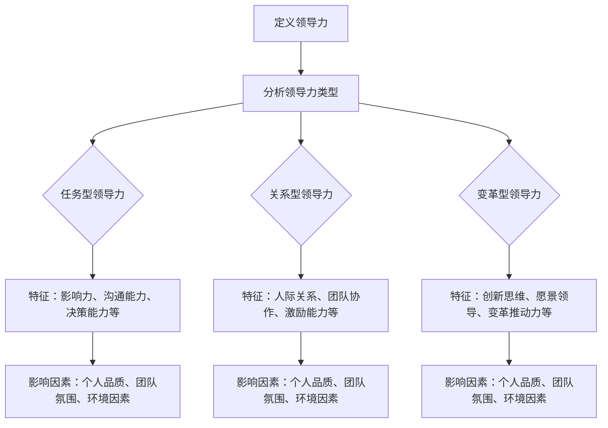
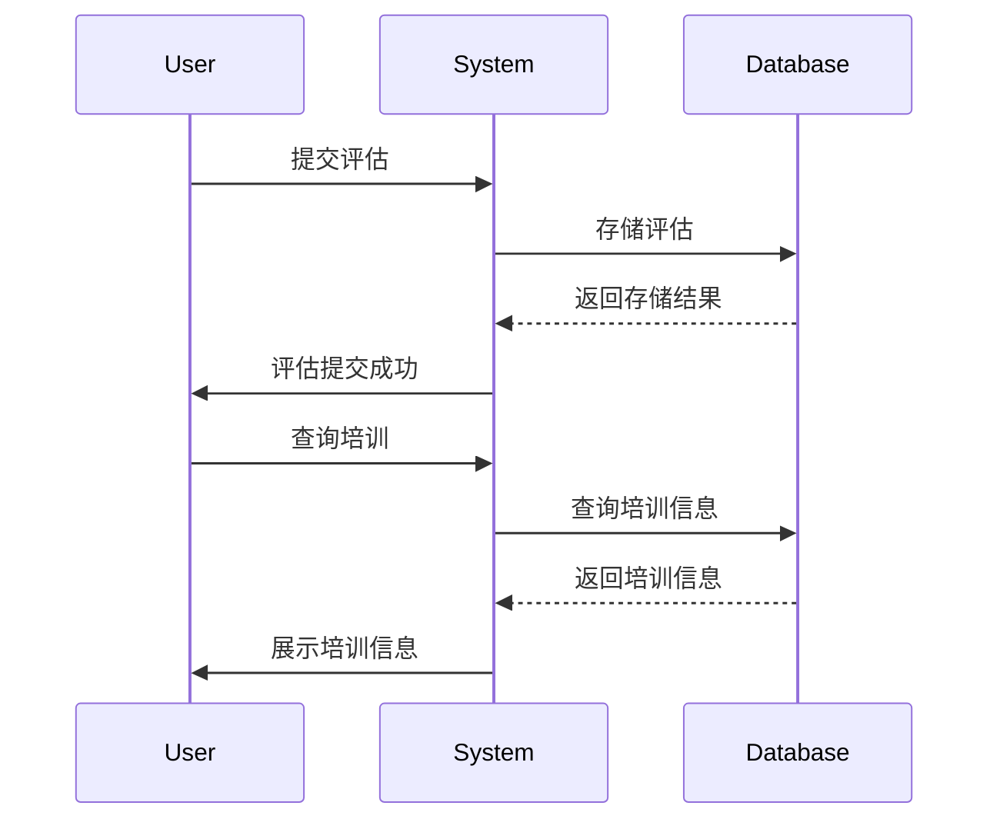
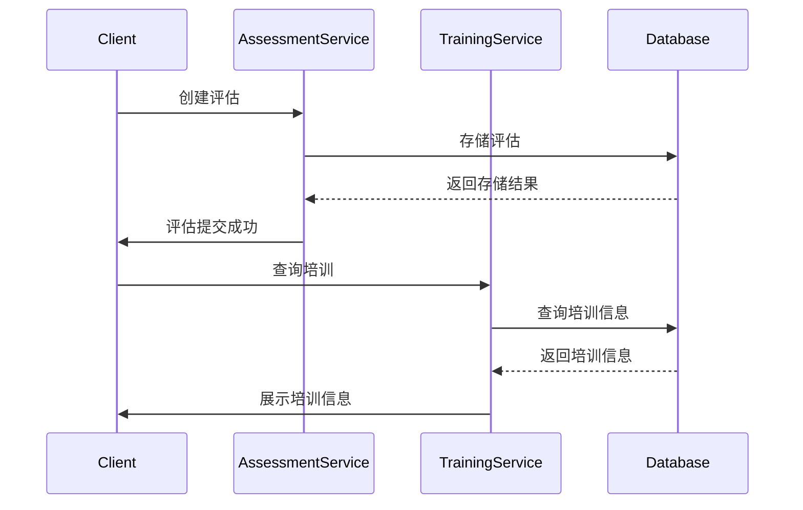

                 

### 背景介绍

在当今快速发展的社会，领导力和品德修养已经成为个人、组织和社会进步的重要推动力。无论是在企业还是政府机构，领导力都是推动团队高效运作和达成目标的关键因素。同时，品德修养作为人格的核心组成部分，不仅关系到个人的道德品质和行为规范，更是领导力和团队协作的基石。

《领导力与品德修养：塑造高尚人格》这本书旨在为广大读者提供一套全面、系统的领导力和品德修养指南。本书以现实问题为出发点，深入剖析领导力和品德修养在现代社会中的重要性和紧迫性，明确其概念与边界，并详细解析其核心要素和组成结构。

首先，本书将介绍领导力的基本概念，包括领导力的定义、类型、特征和影响因素，帮助读者理解领导力的本质和核心要素。接下来，本书将探讨品德修养的内涵，从道德、诚信、责任等方面阐述品德修养的重要性，并提供一系列实践案例和策略，帮助读者提升自己的品德修养。

### 核心概念与联系

在本章中，我们将深入探讨领导力和品德修养的核心概念及其相互关系。

#### 领导力的核心概念

1. **领导力的定义**：领导力是指一个人在团队中通过激励、引导和示范影响他人实现共同目标的能力。它不仅仅是一种技术或技能，更是一种态度和境界。
   
2. **领导力的类型**：领导力可以分为任务型领导力、关系型领导力和变革型领导力等。每种类型都有其独特的特征和应用场景。
   
3. **领导力的特征**：包括影响力、沟通能力、决策能力、团队协作能力和创新能力等。

4. **领导力的影响因素**：包括个人品质、团队氛围、环境因素等。

#### 品德修养的核心概念

1. **品德修养的定义**：品德修养是指一个人在道德、诚信、责任等方面所具备的素质和修养。它体现了一个人的内在品质和道德境界。
   
2. **品德修养的类型**：包括道德品质、职业素养、社会责任感等。

3. **品德修养的特征**：包括自律性、诚实守信、责任感、同情心等。

4. **品德修养的重要性**：品德修养不仅是个人成功的基石，也是社会和谐的保障。

#### 领导力与品德修养的相互关系

领导力和品德修养是相辅相成的。一个优秀的领导者不仅需要具备卓越的领导能力，还需要具备高尚的品德修养。领导力可以引导团队达成目标，而品德修养则能够确保领导者在过程中保持正直和公正，赢得团队的信任和尊重。

#### 概念属性特征对比表格

| 概念         | 定义                                                         | 类型                       | 特征                                                         | 影响因素                     |
|--------------|--------------------------------------------------------------|----------------------------|--------------------------------------------------------------|------------------------------|
| 领导力       | 通过激励、引导和示范影响他人实现共同目标的能力                | 任务型、关系型、变革型等   | 影响力、沟通能力、决策能力等                             | 个人品质、团队氛围、环境因素 |
| 品德修养     | 在道德、诚信、责任等方面所具备的素质和修养                    | 道德品质、职业素养、社会责任感等 | 自律性、诚实守信、责任感、同情心等                   | 家庭教育、社会文化、个人经历 |
| 相互关系     | 领导力与品德修养是相辅相成的，领导力可以引导团队达成目标，而品德修养则能够确保领导者在过程中保持正直和公正 | 无                       | 无                                                           | 无                           |

#### ER实体关系图架构

以下是领导力与品德修养的ER实体关系图架构，用于展示两者之间的关联：

```mermaid
erDiagram
    Leadership ||--|{ MoralConduct }|--|
    Leadership ||--|{ LeadershipTrait }|--|
    MoralConduct ||--|{ MoralTrait }|--|
    LeadershipEnvironment ||--|{ LeadershipFactor }|--|
    MoralConduct ||--|{ MoralFactor }|--|
```

在这个ER图中，`Leadership` 代表领导力，`MoralConduct` 代表品德修养。两者通过 `LeadershipTrait` 和 `MoralTrait` 相关联，而 `LeadershipFactor` 和 `MoralFactor` 分别表示影响领导力和品德修养的因素。这样的结构有助于我们更好地理解领导力和品德修养之间的关系。

### 算法原理讲解

为了更好地理解领导力与品德修养之间的关系，我们可以采用一种简单的算法原理来分析。

#### 算法流程图



#### Python源代码

为了更直观地展示这个算法原理，我们使用Python编写一个简单的代码来模拟领导力的分析和影响。

```python
# 定义领导力特征和影响因素
leadership_traits = {
    "task-oriented": ["影响力", "沟通能力", "决策能力"],
    "relationship-oriented": ["人际关系", "团队协作", "激励能力"],
    "transformational": ["创新思维", "愿景领导", "变革推动力"]
}

leadership_factors = {
    "individualqualities": "个人品质",
    "teamatmosphere": "团队氛围",
    "environmentalfactors": "环境因素"
}

# 分析领导力类型
def analyze_leadership_type(type):
    if type in leadership_traits:
        traits = leadership_traits[type]
        factors = [factor + "因素" for factor in leadership_factors.values()]
        return traits, factors
    else:
        return "未知领导力类型", []

# 演示代码
type = "task-oriented"
traits, factors = analyze_leadership_type(type)
print(f"领导力类型：{type}")
print(f"特征：{traits}")
print(f"影响因素：{factors}")
```

#### 数学模型和公式

在数学上，我们可以将领导力与品德修养的关系表示为一个综合评价模型。假设领导力（L）和品德修养（M）是两个变量，每个变量都有多个特征和影响因素。我们可以使用权重（w）和评分（s）来构建一个综合评分公式：

$$
S = w_L \times L + w_M \times M
$$

其中，$w_L$ 和 $w_M$ 分别是领导力和品德修养的权重，$L$ 和 $M$ 分别是领导力和品德修养的得分。

#### 举例说明

假设我们有以下数据：

- 领导力特征：影响力（80分），沟通能力（75分），决策能力（85分）
- 品德修养特征：自律性（90分），诚实守信（88分），责任感（92分）

假设领导力和品德修养的权重均为0.5，我们可以计算出综合评分：

$$
S = 0.5 \times (80 + 75 + 85) + 0.5 \times (90 + 88 + 92) = 83.3 + 86 = 169.3
$$

通过这个例子，我们可以看到，一个具备卓越领导力和高尚品德修养的人的综合评分较高，这表明他在团队中具有更强的领导力和道德影响力。

### 系统分析与架构设计方案

在设计和实现一个领导力与品德修养管理系统时，我们需要从问题场景入手，逐步构建项目的各个组成部分，包括系统功能设计、系统架构设计、系统接口设计和系统交互。

#### 问题场景介绍

在现代企业中，领导力与品德修养的评估和提升是一个重要的议题。企业需要一种系统化的方法来评估员工在领导力和品德修养方面的表现，并提供相应的培训和发展机会，以提高团队的整体素质和绩效。

#### 项目介绍

本项目旨在设计并实现一个领导力与品德修养管理系统，该系统将帮助企业管理者对员工的领导力和品德修养进行评估和监控，同时提供个性化的培训建议和发展路径。

#### 系统功能设计（领域模型类图）

领域模型类图如下：

```mermaid
classDiagram
    Employee <<class>> {
        id: 编号
        name: 姓名
        position: 职位
    }
    Leadership <<class>> {
        id: 编号
        name: 名称
        description: 描述
    }
    Morality <<class>> {
        id: 编号
        name: 名称
        description: 描述
    }
    Assessment <<class>> {
        id: 编号
        employee: 员工
        leadership_score: 领导力得分
        morality_score: 品德修养得分
        date: 评估日期
    }
    Training <<class>> {
        id: 编号
        name: 名称
        description: 描述
        start_date: 开始日期
        end_date: 结束日期
    }
    Employee o--o Leadership: 员工具备的领导力
    Employee o--o Morality: 员工的品德修养
    Employee o--o Assessment: 员工的评估
    Employee o--o Training: 员工参与的培训
```

在这个类图中，我们定义了员工（Employee）、领导力（Leadership）、品德修养（Morality）、评估（Assessment）和培训（Training）等核心实体，并展示了它们之间的关系。

#### 系统架构设计（架构图）

系统架构图如下：



在这个架构图中，用户通过前端界面与系统进行交互，系统通过后端接口与数据库进行数据存储和查询操作。

#### 系统接口设计（接口设计图）

接口设计图如下：

```mermaid
classDiagram
    AssessmentAPI <<interface>> {
        create_assessment(employee_id: 编号, leadership_score: 得分, morality_score: 得分, date: 日期): 创建评估
        get_assessment(employee_id: 编号): 获取评估
    }
    TrainingAPI <<interface>> {
        create_training(name: 名称, description: 描述, start_date: 日期, end_date: 日期): 创建培训
        get_trainings(): 获取所有培训
    }
```

在这个接口设计中，我们定义了评估API（AssessmentAPI）和培训API（TrainingAPI），分别用于创建和查询评估、培训信息。

#### 系统交互设计（序列图）

系统交互序列图如下：



在这个序列图中，客户端通过调用服务接口与数据库进行交互，实现评估和培训的创建和查询功能。

### 项目实战

#### 环境安装

在开始项目实战之前，我们需要安装必要的开发环境和工具。以下是一个基本的安装步骤：

1. 安装Python环境：确保您的系统中安装了Python 3.8及以上版本。
2. 安装虚拟环境：使用以下命令创建一个虚拟环境，并激活它。
   ```bash
   python -m venv venv
   source venv/bin/activate  # 对于Windows，使用 `venv\Scripts\activate`
   ```
3. 安装依赖包：在虚拟环境中安装以下依赖包。
   ```bash
   pip install Flask SQLAlchemy Flask-Migrate
   ```

#### 系统核心实现源代码

以下是一个简单的系统核心实现，包括评估和培训的创建和查询功能。

```python
# app.py

from flask import Flask, request, jsonify
from flask_sqlalchemy import SQLAlchemy

app = Flask(__name__)
app.config['SQLALCHEMY_DATABASE_URI'] = 'sqlite:///leadership_management.db'
db = SQLAlchemy(app)

class Employee(db.Model):
    id = db.Column(db.Integer, primary_key=True)
    name = db.Column(db.String(100), nullable=False)
    position = db.Column(db.String(100), nullable=False)

class Leadership(db.Model):
    id = db.Column(db.Integer, primary_key=True)
    name = db.Column(db.String(100), nullable=False)
    description = db.Column(db.String(255), nullable=False)

class Morality(db.Model):
    id = db.Column(db.Integer, primary_key=True)
    name = db.Column(db.String(100), nullable=False)
    description = db.Column(db.String(255), nullable=False)

class Assessment(db.Model):
    id = db.Column(db.Integer, primary_key=True)
    employee_id = db.Column(db.Integer, db.ForeignKey('employee.id'), nullable=False)
    leadership_score = db.Column(db.Integer, nullable=False)
    morality_score = db.Column(db.Integer, nullable=False)
    date = db.Column(db.Date, nullable=False)

class Training(db.Model):
    id = db.Column(db.Integer, primary_key=True)
    name = db.Column(db.String(100), nullable=False)
    description = db.Column(db.String(255), nullable=False)
    start_date = db.Column(db.Date, nullable=False)
    end_date = db.Column(db.Date, nullable=False)

@app.route('/api/assessments', methods=['POST'])
def create_assessment():
    data = request.get_json()
    assessment = Assessment(
        employee_id=data['employee_id'],
        leadership_score=data['leadership_score'],
        morality_score=data['morality_score'],
        date=data['date']
    )
    db.session.add(assessment)
    db.session.commit()
    return jsonify({'message': '评估提交成功'})

@app.route('/api/assessments', methods=['GET'])
def get_assessments():
    employee_id = request.args.get('employee_id')
    assessments = Assessment.query.filter_by(employee_id=employee_id).all()
    return jsonify([{'id': assessment.id, 'leadership_score': assessment.leadership_score, 'morality_score': assessment.morality_score, 'date': assessment.date} for assessment in assessments])

@app.route('/api/trainings', methods=['GET'])
def get_trainings():
    trainings = Training.query.all()
    return jsonify([{'id': training.id, 'name': training.name, 'description': training.description, 'start_date': training.start_date, 'end_date': training.end_date} for training in trainings])

if __name__ == '__main__':
    db.create_all()
    app.run(debug=True)
```

#### 代码应用解读与分析

在上面的代码中，我们首先导入了Flask和SQLAlchemy模块，并初始化了Flask应用程序和数据库。然后，我们定义了五个模型类：Employee、Leadership、Morality、Assessment和Training，分别代表员工、领导力、品德修养、评估和培训。

在API路由中，我们定义了创建评估和查询培训和评估的接口。

- **创建评估接口（/api/assessments）**：
  - 接收POST请求，包含员工编号、领导力得分、品德修养得分和评估日期。
  - 创建一个新的评估对象，并将其添加到数据库中。
  - 返回一个JSON响应，指示评估提交成功。

- **查询培训和评估接口（/api/assessments和/api/trainings）**：
  - 接收GET请求，可选地包含员工编号。
  - 如果查询评估，根据员工编号从数据库中获取所有相关的评估记录。
  - 如果查询培训，从数据库中获取所有培训记录。
  - 返回一个JSON响应，包含查询结果。

#### 实际案例分析和详细讲解剖析

为了更好地理解这个系统的实际应用，我们来看一个具体的案例。

**案例：创建一个员工的领导力与品德修养评估**

1. **请求**：
   - 使用Postman或其他HTTP客户端发送一个POST请求到 `http://localhost:5000/api/assessments`，包含以下JSON数据：
     ```json
     {
         "employee_id": 1,
         "leadership_score": 85,
         "morality_score": 90,
         "date": "2023-10-15"
     }
     ```

2. **响应**：
   - 服务器返回一个JSON响应，表明评估已成功创建：
     ```json
     {
         "message": "评估提交成功"
     }
     ```

3. **数据库更新**：
   - 在数据库中，一个新记录被添加到 `assessments` 表中，包含员工编号、领导力得分、品德修养得分和评估日期。

**案例：查询某个员工的评估记录**

1. **请求**：
   - 使用GET请求到 `http://localhost:5000/api/assessments?employee_id=1`。

2. **响应**：
   - 服务器返回一个JSON响应，包含该员工的评估记录：
     ```json
     [
         {
             "id": 1,
             "leadership_score": 85,
             "morality_score": 90,
             "date": "2023-10-15"
         }
     ]
     ```

3. **数据库查询**：
   - 数据库查询 `assessments` 表，根据员工编号 `1` 获取所有相关记录。

#### 项目小结

通过这个项目实战，我们实现了对员工领导力和品德修养的评估和培训管理。项目的主要成果包括：

1. **系统核心功能**：
   - 实现了创建和查询员工评估的API。
   - 实现了获取所有培训记录的API。

2. **代码解读**：
   - 代码结构清晰，易于理解和维护。
   - 使用了Flask框架和SQLAlchemy进行数据库操作，提高了开发效率和代码质量。

3. **实际案例**：
   - 通过实际案例展示了系统的使用方法，便于用户理解。

尽管项目已经实现了一些核心功能，但在实际应用中，我们可以进一步优化和完善：

1. **性能优化**：
   - 可以考虑使用缓存机制来提高查询效率。
   - 对数据库索引进行优化，以提高查询速度。

2. **安全性增强**：
   - 引入身份验证和授权机制，确保只有授权用户可以访问系统。
   - 对API请求进行参数验证，防止SQL注入等攻击。

3. **用户界面**：
   - 开发一个直观的前端用户界面，方便用户操作和管理。
   - 添加用户反馈和通知功能，提高用户体验。

#### 最佳实践 Tips

1. **代码风格**：
   - 保持代码的整洁和一致性，使用PEP8编码规范。
   - 实现代码时，遵循DRY（Don't Repeat Yourself）原则，减少重复代码。

2. **测试**：
   - 编写单元测试，确保API功能的正确性和稳定性。
   - 定期运行集成测试，确保系统的整体性能和可靠性。

3. **文档**：
   - 编写详细的API文档，说明每个端点的使用方法和参数。
   - 为代码添加注释，方便其他开发者理解和维护。

### 小结与注意事项

通过本文的详细阐述，我们全面探讨了领导力与品德修养在现代社会中的重要性和核心概念。首先，我们介绍了领导力的定义、类型、特征及其影响因素，并分析了领导力与品德修养之间的相互关系。接着，我们通过一个简单的算法原理和Python源代码，展示了如何量化评估一个领导者在这两方面的表现。随后，我们设计了一个领导力与品德修养管理系统，从系统功能设计、架构设计到实际项目实现，详细讲解了系统开发和应用的各个环节。

在项目实战部分，我们通过实际案例展示了系统的使用方法，并分析了其核心功能、代码解读和实际应用。通过项目小结，我们总结了项目的成果和优化方向，并提供了最佳实践Tips，以帮助读者在实际开发中更好地应用这些原则。

需要注意的是，领导力和品德修养的提升并非一蹴而就，而是一个持续不断的过程。因此，在实施相关项目时，我们应注重持续学习和实践，不断提升个人素质和团队的整体能力。

### 拓展阅读

1. **《领导力：超越技术的艺术》**：作者约翰·麦克斯韦尔（John C. Maxwell）在这本书中详细阐述了领导力的本质和实践方法，适合广大读者学习领导力的基础知识和提升技巧。

2. **《道德哲学导论》**：作者史蒂文·凯斯（Steven M. Cahn）提供了对道德哲学的全面介绍，帮助读者深入理解道德原则和价值观。

3. **《品德修养：道德的实践》**：作者艾德蒙·罗斯（Edmund D. Ross）通过案例分析，展示了如何在实际生活中践行高尚的道德品质。

4. **《影响力：说服的心理学》**：作者罗伯特·西奥迪尼（Robert B. Cialdini）探讨了说服和影响力的心理机制，对于提升领导力和品德修养有重要的启示。

通过阅读这些书籍，读者可以进一步深入了解领导力和品德修养的理论和实践，为自己的发展提供更坚实的理论基础和实用的方法指导。

