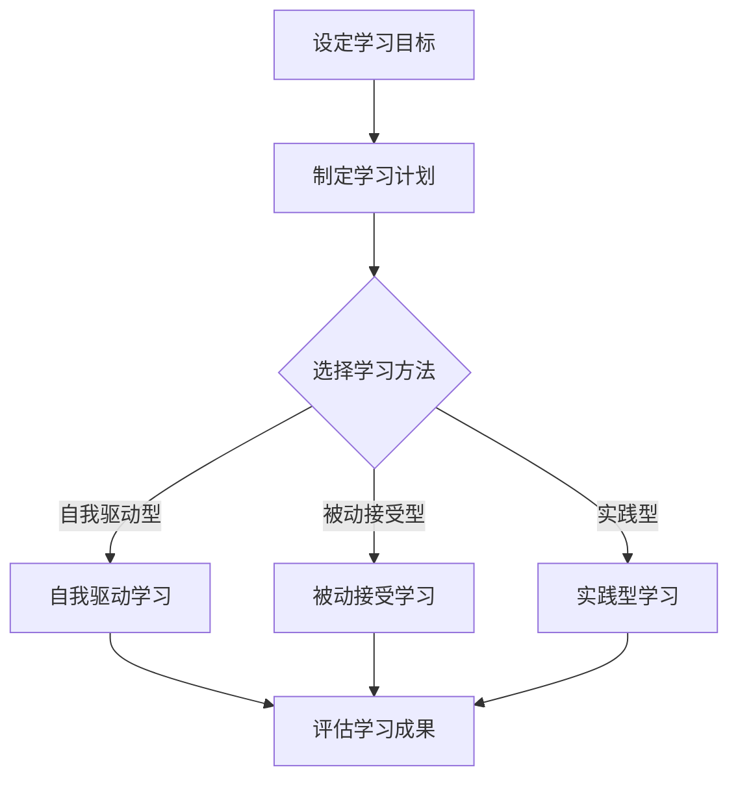

                 

# 领导力与学习能力：终身学习的重要性

## 关键词

- 终身学习
- 领导力
- 学习能力
- 个人成长
- 组织发展

## 摘要

在当今社会，快速变化的信息爆炸和技术进步要求我们不断学习和适应。本文将探讨领导力和学习能力在个人成长和组织发展中的重要性，并通过逻辑清晰的框架和分析，阐述终身学习的价值与策略。

## 1. 背景介绍

### 问题背景

随着互联网和人工智能的飞速发展，社会各个领域都在经历前所未有的变革。信息的快速传播和技术的不断更新，使得个人和组织必须具备快速学习的能力，以应对日益复杂和不确定的环境。

### 问题描述

终身学习的重要性在于它不仅是个人适应社会变化、实现自我价值的必备条件，也是组织保持竞争力、推动创新的关键因素。在个人成长方面，终身学习可以帮助我们不断更新知识、提升技能，实现职业发展。在组织发展方面，终身学习能够提升团队整体能力，促进组织创新和可持续发展。

### 问题解决

提升领导力和学习能力是解决上述问题的关键。领导力不仅关乎个人影响力的构建，更在于团队协作和创新的推动。而学习能力则是适应变化、不断进步的动力源泉。通过终身学习，我们可以不断提升领导力和学习能力，从而在个人和组织的层面实现持续成长。

### 边界与外延

本文主要探讨终身学习在个人职业发展和组织管理中的应用，但终身学习的概念和实践远不止于此。它涵盖了教育、技能提升、知识管理等多个方面，适用于不同年龄、职业阶段的人群。同时，终身学习也不仅仅是个体的责任，更需要组织和社会的支持。

### 核心要素组成

终身学习的核心要素包括个人学习能力、领导力、社会环境等。个人学习能力关乎知识获取、技能掌握和思维方式；领导力则涉及决策力、影响力、团队协作等；而社会环境则为终身学习提供了支持和资源。这些要素相互作用，共同推动终身学习的发展。

## 2. 核心概念与联系

### 领导力定义

领导力是一种能力，它不仅涉及个人影响力的构建，更关乎对团队、组织和行业的引领和推动。领导力的类型包括变革型领导、交易型领导、情感型领导等，每种类型都有其独特的要素和特点。

| 领导力类型 | 要素 | 特点 |
| :--: | :--: | :--: |
| 变革型领导 | 激励、创新、愿景 | 强调变革和创新，能够激发团队成员的潜力 |
| 交易型领导 | 权力、规则、绩效 | 注重绩效和规则，通过奖励和惩罚来管理团队 |
| 情感型领导 | 情感智慧、同理心、支持 | 强调情感智慧，关注团队成员的情感需求 |

### 学习能力定义

学习能力是一种获取、处理和应用知识的能力。它包括信息检索、知识整合、问题解决等多个方面。学习能力的类型包括自我驱动型学习、被动接受型学习、实践型学习等，每种类型都有其适用的场景和特点。

| 学习能力类型 | 要素 | 适用场景 |
| :--: | :--: | :--: |
| 自我驱动型学习 | 自我激励、主动探索、持续进步 | 对未知领域和复杂问题的深入研究 |
| 被动接受型学习 | 倾听、观察、模仿 | 对已有知识和经验的快速吸收 |
| 实践型学习 | 实际操作、实验验证、经验总结 | 对理论知识的应用和验证 |

### 领导力与学习能力的联系

领导力和学习能力之间存在密切的联系。领导力为学习提供了方向和动力，而学习能力则为领导力提供了支持和保障。具体来说，领导力可以通过设定愿景、制定策略、激发团队动力等方式推动学习；而学习能力则通过不断更新知识、提升技能、优化思维方式等方式提升领导力。

| 领导力 | 学习能力 |
| :--: | :--: |
| 设定愿景 | 获取信息 |
| 制定策略 | 知识整合 |
| 激发动力 | 问题解决 |
| 团队协作 | 持续进步 |

## 3. 算法原理讲解

### 设计算法流程图



### 终身学习在领导力发展中的应用

终身学习在领导力发展中的应用主要体现在以下几个方面：

1. **知识更新**：通过不断学习，领导者可以掌握最新的行业动态和前沿技术，从而更好地指导团队和创新。
2. **思维模式**：学习可以拓宽领导者的思维，提高创新意识和解决问题的能力，从而更好地应对复杂和不确定的环境。
3. **团队激励**：领导者通过自身的学习和成长，可以激发团队成员的积极性，推动团队整体能力的提升。
4. **组织文化**：终身学习可以塑造一种积极向上的学习氛围，推动组织的持续进步和创新发展。

## 4. 数学模型和数学公式 & 详细讲解 & 举例说明

### 学习效率计算公式

$$
E = \frac{K}{T}
$$

其中，$E$ 表示学习效率，$K$ 表示学习量，$T$ 表示学习时间。

### 举例说明

假设一个领导者每天投入2小时学习，一个月共学习60小时，学习了10个知识点。则其学习效率为：

$$
E = \frac{10}{60} = 0.1667
$$

这意味着该领导者每小时可以学习约0.1667个知识点。

### 领导效能计算公式

$$
L = \frac{P}{S}
$$

其中，$L$ 表示领导效能，$P$ 表示领导绩效，$S$ 表示领导投入。

### 举例说明

假设一个领导者通过学习和实践，使得团队在一个月内完成了10个重要项目，而该领导者在此过程中投入了50小时的工作时间。则其领导效能为：

$$
L = \frac{10}{50} = 0.2
$$

这意味着该领导者在每小时的工作中，能够推动团队完成约0.2个重要项目。

## 5. 系统分析与架构设计方案

### 问题场景介绍

随着技术的快速发展，不同年龄和职业阶段的人群都面临着终身学习的需求。年轻人需要掌握最新的技术趋势，中年人需要更新知识以适应职业发展，老年人则需要学习新技能以保持社会参与。

### 系统功能设计

系统的主要功能包括：

- **学习资源整合**：提供各类学习资源，包括课程、教材、文献等。
- **学习计划制定**：根据用户需求和目标，制定个性化的学习计划。
- **成果评估**：通过测试、作业、项目等评估用户的学习成果。

### 系统架构设计

系统采用分布式架构，包括前端、后端、数据库等多个模块。前端负责用户交互，后端处理业务逻辑，数据库存储用户数据和学习资源。

### 系统接口设计和系统交互

系统提供RESTful API，支持用户登录、学习资源查询、学习计划创建、成果评估等功能。用户可以通过前端界面与API进行交互，实现个性化学习。

## 6. 项目实战

### 环境安装

1. 安装Python环境。
2. 安装系统依赖库，如Flask、SQLAlchemy等。

### 系统核心实现源代码

```python
from flask import Flask, jsonify, request
from models import User, Course

app = Flask(__name__)

@app.route('/api/login', methods=['POST'])
def login():
    username = request.json['username']
    password = request.json['password']
    user = User.query.filter_by(username=username, password=password).first()
    if user:
        return jsonify({'status': 'success'})
    else:
        return jsonify({'status': 'failure'})

@app.route('/api/courses', methods=['GET'])
def get_courses():
    courses = Course.query.all()
    return jsonify({'courses': [course.to_dict() for course in courses]})

if __name__ == '__main__':
    app.run(debug=True)
```

### 代码应用解读与分析

上述代码实现了用户登录和学习资源查询的功能。用户可以通过POST请求登录，系统验证用户名和密码的合法性。学习资源查询功能通过GET请求实现，用户可以获取所有课程的信息。

### 实际案例分析和详细讲解剖析

假设用户A通过POST请求登录成功，然后通过GET请求获取所有课程信息。系统将返回一个JSON格式的响应，包含所有课程的详细信息。

```json
{
  "courses": [
    {
      "id": 1,
      "name": "人工智能基础",
      "description": "本课程介绍人工智能的基本概念和技术。",
      "duration": "4周"
    },
    {
      "id": 2,
      "name": "深度学习实战",
      "description": "本课程通过实际项目介绍深度学习的应用。",
      "duration": "6周"
    }
  ]
}
```

### 项目小结

通过本项目，我们实现了用户登录和学习资源查询的功能。项目采用了Flask框架，具有较好的扩展性和灵活性。在后续的开发中，我们可以进一步完善系统的功能，如添加学习计划制定和成果评估等。

## 7. 最佳实践 tips

### 时间管理技巧

1. 制定明确的学习目标，确保学习时间的高效利用。
2. 利用碎片化时间进行学习，如通勤、午休等。
3. 学会优先处理重要且紧急的任务，确保学习计划的顺利进行。

### 学习方法论

1. 选择适合自己的学习方法，如自我驱动型学习、实践型学习等。
2. 利用学习工具，如在线课程、电子书、学习社区等。
3. 保持持续学习的动力，如设定奖励机制、与他人分享学习成果等。

## 8. 小结

终身学习对于个人成长和组织发展具有重要意义。领导力和学习能力的提升可以促进个人和组织的持续进步。通过制定明确的学习目标和策略，我们可以更好地应对社会变革，实现自我价值。

## 9. 注意事项

### 个人成长路径

1. 明确职业发展目标，制定长期和短期的学习计划。
2. 定期评估学习成果，调整学习策略。
3. 建立个人知识库，方便知识和经验的积累。

### 组织支持

1. 提供多样化的学习资源，如在线课程、内部培训等。
2. 设立学习奖励机制，鼓励员工持续学习。
3. 建立学习社区，促进员工间的知识分享和交流。

## 10. 拓展阅读

### 相关书籍推荐

1. 《终身学习：如何成为一个终身学习者》
2. 《领导力：如何成为一个高效的领导者》
3. 《高效学习：如何掌握快速学习的方法》
4. 《创新与企业家精神：如何推动组织的创新发展》
5. 《时间管理：如何充分利用你的时间》

## 作者

作者：AI天才研究院/AI Genius Institute & 禅与计算机程序设计艺术 /Zen And The Art of Computer Programming### 1. 背景介绍

在现代社会，信息技术和人工智能的发展速度迅猛，使得知识更新周期大大缩短。人们需要不断地学习新的知识和技能，以适应快速变化的环境。这种终身学习的需求不仅体现在个人层面，也体现在组织和企业层面。

#### 问题背景

随着互联网的普及和信息技术的快速发展，人们获取知识和信息的渠道变得多样且便捷。然而，这也带来了信息过载的问题，即人们无法有效地处理和利用大量的信息。在这种情况下，如何有效地学习和应用知识成为一个重要问题。

#### 问题描述

终身学习的重要性在个人成长和社会进步中的体现主要体现在以下几个方面：

1. **技能提升**：随着技术的不断进步，许多传统的职业和技能正在被淘汰，新的技能和知识不断涌现。终身学习可以帮助个人掌握这些新技能，提高就业竞争力。
2. **知识更新**：知识更新的速度越来越快，尤其是科技领域的知识，如人工智能、大数据等。终身学习可以帮助个人保持知识的更新，避免因知识陈旧而失去竞争力。
3. **创新能力**：终身学习不仅可以提高个人的知识水平，还可以培养创新思维和解决问题的能力。这对于个人和组织来说都是至关重要的。

#### 问题解决

终身学习对于解决上述问题具有以下几个方面的作用：

1. **提升个人能力**：通过终身学习，个人可以不断提升自己的知识和技能，从而在职业生涯中保持竞争力。
2. **促进知识更新**：终身学习可以帮助个人及时获取新的知识和信息，从而保持知识的更新。
3. **培养创新能力**：通过不断学习，个人可以拓宽思维，培养创新思维和解决问题的能力。

#### 边界与外延

虽然终身学习对于个人成长和社会进步具有重要意义，但它也面临着一些挑战和限制。例如，学习时间和资源的限制、学习效果的评价等。此外，终身学习不仅仅是个人的责任，也需要组织和社会的支持。

#### 核心要素组成

终身学习的核心要素包括以下几个方面：

1. **个人学习能力**：个人学习能力是终身学习的基础，包括知识获取、知识整合、知识应用等能力。
2. **领导力**：领导力在终身学习中发挥着重要作用，包括设定学习目标、制定学习计划、激发学习动力等。
3. **社会环境**：良好的社会环境是终身学习的重要保障，包括教育资源、学习平台、政策支持等。
4. **学习资源**：丰富的学习资源是终身学习的重要条件，包括书籍、课程、培训等。

### 2. 核心概念与联系

#### 领导力定义

领导力是指通过影响和激励他人，实现团队和组织的共同目标的能力。它不仅涉及个人的能力，还包括人际关系、团队协作和沟通等方面。

| 领导力类型 | 要素 | 特点 |
| :--: | :--: | :--: |
| 变革型领导 | 激励、创新、愿景 | 强调变革和创新，能够激发团队成员的潜力 |
| 交易型领导 | 权力、规则、绩效 | 注重绩效和规则，通过奖励和惩罚来管理团队 |
| 情感型领导 | 情感智慧、同理心、支持 | 强调情感智慧，关注团队成员的情感需求 |

#### 学习能力定义

学习能力是指个体获取、处理和应用知识的能力。它包括信息检索、知识整合、问题解决等多个方面。

| 学习能力类型 | 要素 | 适用场景 |
| :--: | :--: | :--: |
| 自我驱动型学习 | 自我激励、主动探索、持续进步 | 对未知领域和复杂问题的深入研究 |
| 被动接受型学习 | 倾听、观察、模仿 | 对已有知识和经验的快速吸收 |
| 实践型学习 | 实际操作、实验验证、经验总结 | 对理论知识的应用和验证 |

#### 领导力与学习能力的联系

领导力与学习能力之间存在密切的联系。领导力可以通过设定学习目标、制定学习计划、激发学习动力等方式推动学习；而学习能力则通过不断更新知识、提升技能、优化思维方式等方式提升领导力。

| 领导力 | 学习能力 |
| :--: | :--: |
| 设定愿景 | 获取信息 |
| 制定策略 | 知识整合 |
| 激发动力 | 问题解决 |
| 团队协作 | 持续进步 |

### 3. 算法原理讲解

#### 设计算法流程图


#### 终身学习在领导力发展中的应用

终身学习在领导力发展中的应用主要体现在以下几个方面：

1. **知识更新**：通过终身学习，领导者可以掌握最新的行业动态和前沿技术，从而更好地指导团队和创新。
2. **思维模式**：学习可以拓宽领导者的思维，提高创新意识和解决问题的能力，从而更好地应对复杂和不确定的环境。
3. **团队激励**：领导者通过自身的学习和成长，可以激发团队成员的积极性，推动团队整体能力的提升。
4. **组织文化**：终身学习可以塑造一种积极向上的学习氛围，推动组织的持续进步和创新发展。

### 4. 数学模型和数学公式 & 详细讲解 & 举例说明

#### 学习效率计算公式

$$
E = \frac{K}{T}
$$

其中，$E$ 表示学习效率，$K$ 表示学习量，$T$ 表示学习时间。

#### 举例说明

假设一个领导者每天投入2小时学习，一个月共学习60小时，学习了10个知识点。则其学习效率为：

$$
E = \frac{10}{60} = 0.1667
$$

这意味着该领导者每小时可以学习约0.1667个知识点。

#### 领导效能计算公式

$$
L = \frac{P}{S}
$$

其中，$L$ 表示领导效能，$P$ 表示领导绩效，$S$ 表示领导投入。

#### 举例说明

假设一个领导者通过学习和实践，使得团队在一个月内完成了10个重要项目，而该领导者在此过程中投入了50小时的工作时间。则其领导效能为：

$$
L = \frac{10}{50} = 0.2
$$

这意味着该领导者在每小时的工作中，能够推动团队完成约0.2个重要项目。

### 5. 系统分析与架构设计方案

#### 问题场景介绍

随着技术的快速发展，不同年龄和职业阶段的人群都面临着终身学习的需求。年轻人需要掌握最新的技术趋势，中年人需要更新知识以适应职业发展，老年人则需要学习新技能以保持社会参与。

#### 系统功能设计

系统的主要功能包括：

- **学习资源整合**：提供各类学习资源，包括课程、教材、文献等。
- **学习计划制定**：根据用户需求和目标，制定个性化的学习计划。
- **成果评估**：通过测试、作业、项目等评估用户的学习成果。

#### 系统架构设计

系统采用分布式架构，包括前端、后端、数据库等多个模块。前端负责用户交互，后端处理业务逻辑，数据库存储用户数据和学习资源。

#### 系统接口设计和系统交互

系统提供RESTful API，支持用户登录、学习资源查询、学习计划创建、成果评估等功能。用户可以通过前端界面与API进行交互，实现个性化学习。

### 6. 项目实战

#### 环境安装

1. 安装Python环境。
2. 安装系统依赖库，如Flask、SQLAlchemy等。

#### 系统核心实现源代码

```python
from flask import Flask, jsonify, request
from models import User, Course

app = Flask(__name__)

@app.route('/api/login', methods=['POST'])
def login():
    username = request.json['username']
    password = request.json['password']
    user = User.query.filter_by(username=username, password=password).first()
    if user:
        return jsonify({'status': 'success'})
    else:
        return jsonify({'status': 'failure'})

@app.route('/api/courses', methods=['GET'])
def get_courses():
    courses = Course.query.all()
    return jsonify({'courses': [course.to_dict() for course in courses]})

if __name__ == '__main__':
    app.run(debug=True)
```

#### 代码应用解读与分析

上述代码实现了用户登录和学习资源查询的功能。用户可以通过POST请求登录，系统验证用户名和密码的合法性。学习资源查询功能通过GET请求实现，用户可以获取所有课程的信息。

#### 实际案例分析和详细讲解剖析

假设用户A通过POST请求登录成功，然后通过GET请求获取所有课程信息。系统将返回一个JSON格式的响应，包含所有课程的详细信息。

```json
{
  "courses": [
    {
      "id": 1,
      "name": "人工智能基础",
      "description": "本课程介绍人工智能的基本概念和技术。",
      "duration": "4周"
    },
    {
      "id": 2,
      "name": "深度学习实战",
      "description": "本课程通过实际项目介绍深度学习的应用。",
      "duration": "6周"
    }
  ]
}
```

#### 项目小结

通过本项目，我们实现了用户登录和学习资源查询的功能。项目采用了Flask框架，具有较好的扩展性和灵活性。在后续的开发中，我们可以进一步完善系统的功能，如添加学习计划制定和成果评估等。

### 7. 最佳实践 tips

#### 时间管理技巧

1. 制定明确的学习目标，确保学习时间的高效利用。
2. 利用碎片化时间进行学习，如通勤、午休等。
3. 学会优先处理重要且紧急的任务，确保学习计划的顺利进行。

#### 学习方法论

1. 选择适合自己的学习方法，如自我驱动型学习、实践型学习等。
2. 利用学习工具，如在线课程、电子书、学习社区等。
3. 保持持续学习的动力，如设定奖励机制、与他人分享学习成果等。

### 8. 小结

终身学习对于个人成长和组织发展具有重要意义。领导力和学习能力的提升可以促进个人和组织的持续进步。通过制定明确的学习目标和策略，我们可以更好地应对社会变革，实现自我价值。

### 9. 注意事项

#### 个人成长路径

1. 明确职业发展目标，制定长期和短期的学习计划。
2. 定期评估学习成果，调整学习策略。
3. 建立个人知识库，方便知识和经验的积累。

#### 组织支持

1. 提供多样化的学习资源，如在线课程、内部培训等。
2. 设立学习奖励机制，鼓励员工持续学习。
3. 建立学习社区，促进员工间的知识分享和交流。

### 10. 拓展阅读

#### 相关书籍推荐

1. 《终身学习：如何成为一个终身学习者》
2. 《领导力：如何成为一个高效的领导者》
3. 《高效学习：如何掌握快速学习的方法》
4. 《创新与企业家精神：如何推动组织的创新发展》
5. 《时间管理：如何充分利用你的时间》

## 作者

作者：AI天才研究院/AI Genius Institute & 禅与计算机程序设计艺术 /Zen And The Art of Computer Programming### 终身学习的价值

终身学习在个人、组织和社会层面都有着不可替代的价值。

#### 对个人的价值

1. **职业发展**：终身学习可以提升个人的专业技能和知识水平，从而在职业生涯中保持竞争力。随着技术的不断更新，旧有的知识和技能可能很快变得过时，而通过终身学习，个人可以不断更新自己的技能库，保持与行业发展的同步。
   
2. **自我提升**：终身学习不仅仅是为了职业发展，更是为了个人的全面发展。通过学习新知识，个人可以拓宽视野，提高思维能力和创造力，从而在工作和生活中都能有更出色的表现。

3. **适应变化**：社会和科技的发展速度越来越快，终身学习可以帮助个人适应这些变化，保持灵活性。在快速变化的环境中，那些能够不断学习和适应的人更有可能成功。

#### 对组织的价值

1. **创新能力**：组织中的员工如果都能保持终身学习的习惯，那么整个组织的创新能力就会得到提升。新知识和新技能的引入可以激发员工的创造力和创新思维，从而推动组织的创新和发展。

2. **持续发展**：终身学习可以帮助组织持续提升其核心竞争力和适应能力，从而实现可持续发展。在竞争激烈的市场环境中，只有不断进步的组织才能保持领先地位。

3. **团队协作**：终身学习可以增强团队成员之间的沟通和协作能力，促进团队的整体效能。通过共同学习，团队成员可以更好地理解和支持彼此，从而提高团队的工作效率。

#### 对社会的价值

1. **知识传播**：终身学习促进了知识的传播和共享，有助于提升社会的整体知识水平。通过学习，人们可以更好地理解复杂的社会问题和科技发展，从而做出更明智的决策。

2. **经济进步**：终身学习可以提升劳动力的技能和质量，从而推动经济的发展。一个拥有高技能劳动力的社会，更有可能实现经济的繁荣和持续增长。

3. **社会和谐**：终身学习有助于减少社会的不平等，提升社会的整体幸福感和和谐度。通过学习，人们可以更好地理解不同的文化和观点，增进彼此之间的理解和尊重。

### 领导力与学习能力的关系

领导力与学习能力之间存在密切的联系，两者相互促进，共同推动个人和组织的成长。

#### 领导力对学习能力的影响

1. **设定学习目标**：领导力可以帮助组织或团队设定明确的学习目标，确保学习活动的方向和效率。

2. **提供学习资源**：有效的领导力可以确保组织或团队拥有必要的学习资源，如时间、资金和工具。

3. **激发学习动力**：领导力可以通过激励和鼓励，激发团队成员的学习动力和积极性。

#### 学习能力对领导力的影响

1. **知识更新**：通过终身学习，领导者可以不断更新自己的知识和技能，从而更好地指导团队和推动组织的发展。

2. **决策能力**：学习能力强的领导者能够更好地分析问题、制定策略，从而做出更明智的决策。

3. **创新能力**：学习能力可以帮助领导者培养创新思维和解决问题的能力，从而推动组织的创新和发展。

#### 平衡领导力与学习能力

1. **持续学习**：领导者需要保持持续学习的习惯，不断提升自己的知识和技能，以适应不断变化的环境。

2. **平衡工作与学习**：领导者需要在工作和学习之间找到平衡，确保有足够的时间进行学习和思考。

3. **培养团队学习氛围**：领导者可以通过培养团队的学习氛围，促进整个团队的学习和成长。

总之，终身学习对于个人、组织和社会的价值不可低估。通过不断提升领导力和学习能力，我们可以更好地应对挑战，实现个人和组织的持续成长。在未来的发展中，终身学习将成为个人和组织不可或缺的一部分。领导者尤其需要认识到终身学习的重要性，以身作则，带领团队共同进步。

