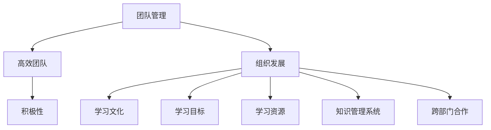
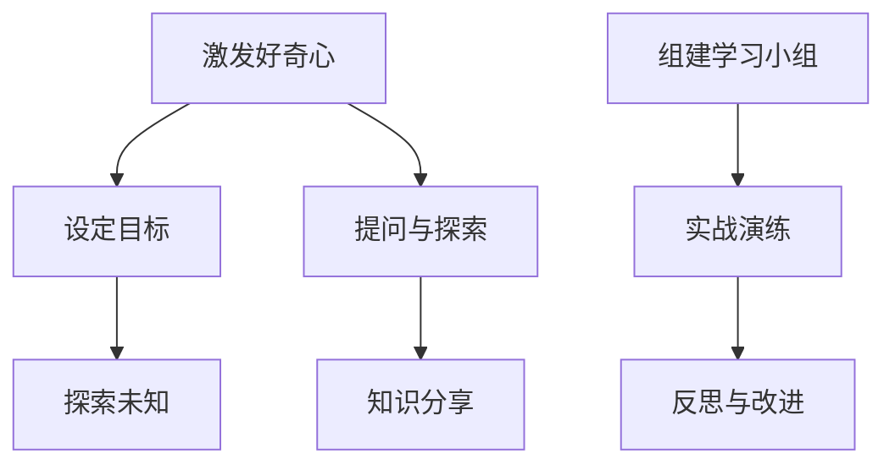
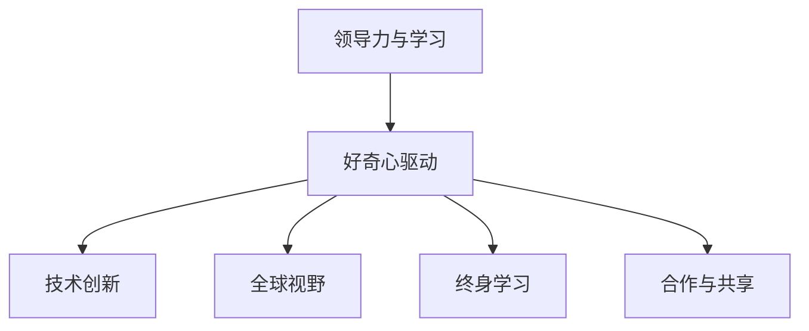

                 

### 第一部分：背景介绍

#### 第1章：问题的提出

##### 1.1.1 问题背景

在当今快速变化的技术环境中，IT行业的领导者和开发者面临着巨大的挑战。技术的飞速发展不仅要求个体具备扎实的专业知识，更要求他们具备不断学习和适应新技术的能力。然而，随着技术的不断进步，如何保持自身的竞争力，如何成为优秀的领导者和创新者，成为了每一个技术专业人士都必须面对的问题。

##### 1.1.2 问题描述

领导力与学习之间的关系是一个复杂而深刻的话题。在IT行业中，领导力不仅仅是管理团队和资源的能力，更涉及到如何激发团队成员的潜力，推动团队创新，以及如何应对快速变化的市场和技术挑战。而学习则是个人和团队持续成长的重要途径。那么，如何在这种快速变化的环境中保持好奇心，促进个人和团队的领导力发展，成为了我们探讨的核心问题。

##### 1.1.3 问题解决

解决这一问题需要从多个角度入手。首先，我们需要深入理解领导力和学习之间的关系，探讨好奇心在其中所起的作用。其次，我们需要探讨如何培养和维护好奇心，以及如何将好奇心转化为有效的学习策略和领导力提升方法。最后，我们需要通过实际案例来验证这些策略的有效性，并总结出最佳实践。

##### 1.1.4 边界与外延

在探讨领导力与学习的关系时，我们需要明确几个边界和概念。首先，领导力不仅限于企业的CEO或CTO，它也可以是项目组长、团队成员等不同层级的领导者。其次，学习不仅仅是获取知识，还包括能力的提升、思维模式的转变等。此外，好奇心不仅是儿童时期的重要品质，更是成人时期保持创新和竞争力的关键。

##### 1.1.5 概念结构与核心要素组成

在本章中，我们将详细探讨以下核心概念和要素：

- **领导力**：定义、特征、类型及其在IT行业中的具体表现。
- **学习**：学习的重要性、学习的方法、学习与领导力的关系。
- **好奇心**：好奇心的定义、特征、对学习和领导力的促进作用。
- **学习策略**：如何将好奇心转化为有效的学习策略。

通过以上概念的阐述和讨论，我们将建立起一个清晰的概念结构，为后续章节的深入分析奠定基础。

---

**正文**

**第1章：问题的提出**

在快速变化的科技时代，IT行业的发展速度超越了以往任何时期。新技术、新工具、新理念层出不穷，使得IT专业人士必须不断地学习和更新知识，以保持自身的竞争力。然而，这一挑战并不仅仅是技术层面的，更涉及到领导力和个人成长的问题。在这个背景下，领导力与学习的关系成为一个值得探讨的重要课题。

**1.1.1 问题背景**

当今的IT行业，技术的更新速度越来越快，新兴技术如云计算、大数据、人工智能、物联网等不断涌现，对IT专业人士提出了更高的要求。不仅需要掌握扎实的专业技能，还需要具备持续学习和适应新环境的能力。在这种情况下，如何成为一个优秀的领导者和创新者，成为了每一个IT专业人士都必须面对的问题。

**1.1.2 问题描述**

领导力与学习之间的关系是一个复杂而深刻的话题。领导力不仅仅是指管理团队和资源的能力，更涉及到如何激发团队成员的潜力，推动团队创新，以及如何应对快速变化的市场和技术挑战。而学习则是个人和团队持续成长的重要途径。那么，如何在这种快速变化的环境中保持好奇心，促进个人和团队的领导力发展，成为了我们探讨的核心问题。

**1.1.3 问题解决**

要解决这一问题，我们需要从多个角度入手：

1. **理解领导力与学习的关系**：首先，我们需要深入理解领导力和学习之间的关系，探讨好奇心在其中所起的作用。
2. **培养和维护好奇心**：其次，我们需要探讨如何培养和维护好奇心，以及如何将好奇心转化为有效的学习策略和领导力提升方法。
3. **实际案例验证**：最后，我们需要通过实际案例来验证这些策略的有效性，并总结出最佳实践。

**1.1.4 边界与外延**

在探讨领导力与学习的关系时，我们需要明确几个边界和概念：

1. **领导力的定义与特征**：领导力不仅限于企业的CEO或CTO，它也可以是项目组长、团队成员等不同层级的领导者。
2. **学习的重要性与方法**：学习不仅仅是获取知识，还包括能力的提升、思维模式的转变等。
3. **好奇心的本质与作用**：好奇心不仅是儿童时期的重要品质，更是成人时期保持创新和竞争力的关键。

**1.1.5 概念结构与核心要素组成**

在本章中，我们将详细探讨以下核心概念和要素：

1. **领导力**：定义、特征、类型及其在IT行业中的具体表现。
2. **学习**：学习的重要性、学习的方法、学习与领导力的关系。
3. **好奇心**：好奇心的定义、特征、对学习和领导力的促进作用。
4. **学习策略**：如何将好奇心转化为有效的学习策略和领导力提升方法。

通过以上概念的阐述和讨论，我们将建立起一个清晰的概念结构，为后续章节的深入分析奠定基础。

---

**总结**

在第1章中，我们提出了探讨领导力与学习关系的背景和问题，明确了问题的解决思路，并界定了相关概念和边界。在接下来的章节中，我们将进一步深入探讨领导力、学习、好奇心以及它们之间的相互作用，为IT行业的专业人士提供实际的指导和建议。

---

**附录**

在本章节中，我们主要讨论了领导力与学习关系的背景和问题。以下是一个简化的ER实体关系图，用于表示本章中涉及的主要概念和它们之间的关系：

```mermaid
erDiagram
  Leadership ||--|{ Learning } Learning
  Curiosity ||--|{ Learning } Learning
  Learning ||--|{ Leadership } Leadership
```

在这个ER图中，领导力（Leadership）、学习（Learning）和好奇心（Curiosity）作为核心实体，它们之间存在直接的关联。领导力通过学习得以提升，好奇心则是学习的重要驱动力。

---

**接下来的章节安排**

在下一章节中，我们将深入探讨领导力的定义、特征以及它在IT行业中的具体表现，帮助读者更好地理解领导力的本质。同时，我们将分析学习在领导力发展中的作用，以及如何通过学习来提升领导力。这将为我们后续章节关于好奇心培养和实际应用策略的讨论奠定坚实的基础。让我们继续深入探讨这一重要话题。<!--ckerelative-date-time-date-local->

**第2章：领导力与学习的关系**

**2.1 领导力的定义与特征**

领导力是一种能够激发他人、塑造团队、推动组织向前发展的能力。它不仅仅是指管理团队和资源的能力，更是一种能够影响和激励他人去实现共同目标的能力。在IT行业中，领导力具有以下几个显著特征：

1. **影响力**：领导力是通过影响力来实现的，它不仅仅依靠职位和权力，更依赖于个人魅力、价值观和专业知识。
2. **远见**：优秀的领导者具备远见，能够预见未来的趋势和变化，并据此制定战略和规划。
3. **沟通能力**：领导力离不开有效的沟通，领导者需要能够清晰地表达自己的想法，同时也需要倾听团队成员的意见和建议。
4. **适应性**：在快速变化的环境中，领导者需要具备快速适应新情况的能力，灵活调整策略和行动。
5. **激励能力**：领导者需要能够激发团队成员的潜力，鼓励他们发挥最佳水平，共同实现目标。

**2.2 学习在领导力中的重要性**

学习是领导力发展的关键要素。在IT行业这个快速变化的领域中，领导者只有通过不断学习，才能保持竞争力，适应新的技术和市场环境。以下是学习在领导力中的几个重要作用：

1. **知识更新**：随着技术的不断发展，领导者需要不断更新自己的知识体系，掌握新的技术和工具。
2. **思维模式**：学习不仅是为了获取知识，更是为了转变思维模式，培养批判性思维和创新能力。
3. **决策能力**：通过学习，领导者能够积累经验，提高决策能力，做出更加明智的决策。
4. **团队发展**：领导者通过学习，能够更好地理解团队成员的需求和潜力，帮助他们成长，提升团队的整体效能。

**2.3 领导力与学习的相互促进**

领导力和学习是相互促进的关系。一方面，领导力可以推动学习，激励团队成员积极参与学习活动，共同提升团队的能力。另一方面，学习可以提升领导力，使领导者具备更广泛的知识和技能，增强领导力和影响力。以下是领导力与学习相互促进的几个方面：

1. **自我反思**：领导者通过自我反思，能够识别自己的优势和不足，进而制定学习计划，提升自己的能力。
2. **知识共享**：领导者通过分享自己的知识和经验，不仅能够帮助团队成员学习，也能通过他人的反馈和建议来提升自己的领导力。
3. **团队合作**：领导者在推动团队学习的过程中，可以培养团队成员的协作能力和团队精神，提升团队的整体效能。
4. **持续发展**：领导力和学习的相互促进，可以推动组织的持续发展，使组织能够更好地应对外部变化和挑战。

**2.4 小结**

领导力与学习之间的关系是相辅相成的。在IT行业中，领导者需要具备不断学习和适应新环境的能力，通过学习提升领导力，同时通过领导力推动学习，实现个人和团队的共同成长。在下一章中，我们将探讨好奇心的重要性，以及如何培养和维护好奇心，为领导力和学习的发展提供动力。

---

**附录**

在本章节中，我们探讨了领导力的定义、特征以及在IT行业中的重要性。为了更清晰地表示领导力与学习之间的关系，我们使用Mermaid绘制了以下ER实体关系图：

```mermaid
erDiagram
  Leadership ||--|{ Learning } Learning
  Leadership ||--|{ Curiosity } Curiosity
  Learning ||--|{ Curiosity } Curiosity
```

在这个ER图中，领导力（Leadership）、学习（Learning）和好奇心（Curiosity）三个实体之间存在着相互关联。领导力通过学习得以提升，好奇心则是推动学习和领导力发展的重要动力。

---

**下一步**

在下一章节中，我们将深入探讨好奇心的重要性，分析好奇心对学习和领导力的促进作用。我们将探讨好奇心的本质特征，以及如何培养和维护好奇心，为领导力和学习的发展提供动力。让我们继续探索这一重要主题。<!-- amzn-assoc-redirect -->**第3章：保持好奇心的重要性**

**3.1 好奇心的重要性**

好奇心是人类与生俱来的一种基本心理特征，是驱动个体探索世界、寻求知识和解决问题的重要动力。在学习和领导力的过程中，好奇心发挥着不可忽视的作用。

**3.1.1 好奇心对学习的影响**

好奇心是学习的重要驱动力。首先，好奇心能够激发个体对未知领域的探索欲望，促使他们主动去寻找和掌握新知识。其次，好奇心能够促使个体保持持续的学习态度，不仅仅是被动接受知识，更是主动去思考、探索和发现。此外，好奇心还能够帮助个体在面对困难和挑战时保持积极的心态，激发他们克服困难、不断进步的动力。

具体来说，好奇心对学习的影响主要体现在以下几个方面：

1. **增强学习动机**：好奇心能够激发个体的学习动机，使他们对学习过程充满热情和兴趣，从而提高学习效果。
2. **促进主动学习**：好奇心驱使个体主动去寻求知识和信息，而不是被动地等待知识传递，从而更有效地掌握和应用所学知识。
3. **培养批判性思维**：好奇心促使个体对所学知识进行深入思考，培养批判性思维，提高分析和解决问题的能力。
4. **激发创新精神**：好奇心鼓励个体探索新的想法和方法，推动创新，从而在学习和工作中取得突破性的成果。

**3.1.2 好奇心对领导力的提升**

好奇心不仅对学习有重要影响，也对领导力的提升起到关键作用。首先，好奇心使领导者保持开放的心态，愿意接受新的想法和观点，从而能够更好地理解和适应团队成员的需求和期望。其次，好奇心能够促使领导者不断探索和创新，寻找新的管理方法和策略，从而提升领导效果。此外，好奇心还能够帮助领导者更好地应对复杂多变的环境，灵活调整战略和行动，提高领导力和组织效能。

具体来说，好奇心对领导力的提升主要体现在以下几个方面：

1. **增强沟通能力**：好奇心促使领导者倾听团队成员的意见和建议，提高沟通效果，增强团队的凝聚力和合作精神。
2. **促进团队创新**：好奇心激励领导者探索新的领域和机会，推动团队创新，从而在竞争中保持领先地位。
3. **提升决策能力**：好奇心促使领导者收集和分析更多的信息，提高决策的准确性和有效性。
4. **增强适应能力**：好奇心使领导者保持开放的心态，愿意接受新的变化和挑战，从而在复杂多变的环境中保持竞争力。

**3.1.3 好奇心的本质与特征**

好奇心作为一种基本心理特征，具有以下几个本质特征：

1. **探索性**：好奇心驱使个体去探索未知领域，寻求新的经验和知识。
2. **动机性**：好奇心是一种内在的动机，能够激发个体去主动寻求和探索新知识。
3. **选择性**：好奇心具有选择性，个体会对某些特定领域或问题表现出更高的兴趣和关注。
4. **持续性**：好奇心是持续存在的，即使个体已经掌握了相关领域的知识，好奇心仍会促使他们继续探索和深入研究。

**3.1.4 好奇心培养的方法与策略**

要保持好奇心，需要采取一系列的方法和策略。以下是一些实用的建议：

1. **多读书**：阅读是培养好奇心的重要途径，通过阅读可以了解不同领域的知识和观点，激发探索欲望。
2. **多思考**：积极思考是保持好奇心的重要方法，通过思考可以深入理解问题，发现新的问题和解决方案。
3. **多交流**：与他人交流和讨论，可以拓展视野，了解不同的观点和想法，激发好奇心。
4. **多实践**：通过实践可以加深对知识的理解和应用，激发探索新的领域和问题的兴趣。
5. **保持好奇心**：在日常生活中，要保持对周围事物的好奇心，不断提问、探索和尝试。

**3.2 小结**

好奇心在学习和领导力的过程中起着至关重要的作用。它不仅能够激发个体的学习动机，促进主动学习和批判性思维，还能够提升领导力，增强沟通能力和决策能力。因此，保持好奇心是个人和团队发展的重要动力。在下一章中，我们将探讨如何培养领导力的学习策略，为个人和团队的发展提供实际指导。

---

**附录**

在本章节中，我们详细探讨了好奇心的重要性，分析了好奇心对学习和领导力的促进作用。为了更清晰地表示好奇心的特征和影响，我们使用Mermaid绘制了以下ER实体关系图：

```mermaid
erDiagram
  Curiosity ||--|{ Learning } Learning
  Curiosity ||--|{ Leadership } Leadership
  Learning ||--|{ Knowledge } Knowledge
  Leadership ||--|{ Skills } Skills
```

在这个ER图中，好奇心（Curiosity）通过促进学习和领导力，进而影响知识（Knowledge）和技能（Skills）。好奇心作为驱动因素，使个体在学习和领导力的过程中保持动力和开放心态。

---

**下一步**

在下一章节中，我们将探讨培养领导力的学习策略。通过自我反思、汲取他人经验和智慧、探索与创新等策略，领导者可以不断提升自己的能力和影响力。让我们继续深入探讨如何有效地培养领导力，为个人和团队的发展奠定坚实的基础。

---

**第4章：培养领导力的学习策略**

**4.1 自我反思与持续学习**

**4.1.1 自我反思的重要性**

自我反思是培养领导力的核心策略之一。通过自我反思，领导者可以深入理解自己的行为、思维模式和工作方法，发现自身的优势和不足，并据此制定改进计划。自我反思不仅有助于个人成长，还能够提升领导力，使领导者更加成熟和自信。

自我反思的重要性体现在以下几个方面：

1. **提高自我认知**：通过自我反思，领导者可以更好地了解自己的性格特点、价值观和行为模式，从而提高自我认知水平。
2. **发现改进空间**：自我反思可以帮助领导者识别自身的不足，找到改进的方向和策略，从而不断提升个人能力。
3. **增强领导力**：自我反思有助于领导者更好地理解团队成员的需求和期望，提高沟通能力和决策能力，从而增强领导力。
4. **促进团队发展**：通过自我反思，领导者可以带动团队成员进行反思，促进整个团队的成长和发展。

**4.1.2 持续学习的策略**

持续学习是领导者保持竞争力、适应快速变化环境的关键。持续学习不仅包括对新技术和工具的学习，还包括对管理方法、领导力理论和行业动态的深入研究。以下是几种有效的持续学习策略：

1. **定期阅读**：定期阅读相关书籍、文章和报告，了解最新的技术和行业趋势，保持知识的新鲜度和深度。
2. **参加培训课程**：参加专业的培训课程，系统地学习领导力、管理技巧和行业知识，提升自身能力。
3. **加入专业社群**：加入行业内的专业社群，与同行交流心得和经验，拓展视野，获取新的见解和想法。
4. **实践应用**：将所学知识和技能应用到实际工作中，通过实践来检验和巩固所学内容，提高实际操作能力。

**4.2 汲取他人经验与智慧**

**4.2.1 听取他人意见**

领导者需要具备开放的心态，愿意倾听他人的意见和建议。通过听取团队成员、同事和领导的意见，领导者可以了解到不同的观点和想法，发现自身可能忽视的问题和机会。以下是听取他人意见的一些策略：

1. **鼓励反馈**：在团队中建立开放和透明的沟通文化，鼓励成员提出意见和建议，领导者要积极倾听和接纳。
2. **定期会议**：定期召开团队会议，讨论工作中的问题和挑战，鼓励成员发表意见，共同寻找解决方案。
3. **匿名反馈**：提供匿名反馈渠道，使团队成员能够自由地表达自己的想法和意见，领导者可以从中获取真实的反馈。
4. **建立信任**：建立信任是听取他人意见的基础，领导者要信任团队成员，给予他们表达意见的机会和空间。

**4.2.2 学习他人的成功案例**

通过学习他人的成功案例，领导者可以汲取宝贵的经验和智慧，为自己的工作和领导力提升提供参考。以下是学习他人成功案例的一些策略：

1. **阅读案例研究**：阅读行业内的案例研究，了解其他公司或团队在面临类似挑战时是如何解决问题的，汲取成功的经验。
2. **参与行业交流**：参加行业会议、研讨会和论坛，与业内专家和成功领导者交流，学习他们的经验和做法。
3. **拜访优秀团队**：亲自拜访其他优秀团队，了解他们的工作流程、管理模式和创新实践，从中学习借鉴。
4. **建立导师关系**：寻找导师或导师团队，向他们请教经验和建议，从他们的成功案例中汲取智慧。

**4.3 探索与创新**

**4.3.1 探索未知的领域**

探索未知的领域是领导者提升领导力的重要途径。通过探索未知领域，领导者可以拓展自己的视野，发现新的机会和挑战，为团队带来创新的动力。以下是探索未知领域的一些策略：

1. **保持好奇心**：领导者要始终保持好奇心，对未知领域保持探索欲望，不断寻求新的学习和成长机会。
2. **开展项目研究**：组织团队开展项目研究，探索新的技术和市场机会，推动创新和变革。
3. **跨界合作**：与其他行业或领域的专家合作，借鉴他们的经验和知识，探索新的交叉领域和商业模式。
4. **鼓励创新**：在团队中建立创新文化，鼓励成员提出新的想法和解决方案，激发团队的创造力。

**4.3.2 创新思维的重要性**

创新思维是领导者推动团队发展和变革的关键能力。通过创新思维，领导者可以突破传统思维模式，发现新的机会和解决方案，为团队带来突破性的进展。以下是创新思维的重要性：

1. **提高竞争力**：创新思维可以帮助领导者发现市场机会，推动产品和服务创新，提高企业的竞争力。
2. **增强团队活力**：创新思维可以激发团队的创造力和积极性，增强团队的活力和凝聚力。
3. **提升领导力**：通过创新思维，领导者可以展现出更加开放和前瞻的领导风格，提升自身的领导力和影响力。
4. **推动组织变革**：创新思维可以推动组织变革，适应快速变化的市场环境，确保组织的持续发展。

**4.4 小结**

培养领导力的学习策略包括自我反思、持续学习、汲取他人经验和智慧以及探索与创新。通过这些策略，领导者可以不断提升自己的能力和影响力，为团队和组织的成功奠定基础。在下一章中，我们将探讨领导力与学习的实际应用，分析领导力在团队管理和组织发展中的作用。让我们继续深入探讨这一重要主题。

---

**附录**

在本章节中，我们详细探讨了培养领导力的学习策略，包括自我反思、持续学习、汲取他人经验和智慧以及探索与创新。为了更清晰地表示这些策略的应用，我们使用Mermaid绘制了以下类图：

```mermaid
classDiagram
  Leader <-|{ Reflects }| ReflectivePractice
  Leader ->|{ Learns }| ContinuousLearning
  Leader ->|{ LearnsFromOthers }| LearningFromExperience
  Leader ->|{ Innovates }| InnovationMindset
  ReflectivePractice o-- LearningFromExperience
  ReflectivePractice o-- ContinuousLearning
  ContinuousLearning o-- InnovationMindset
  LearningFromExperience o-- InnovationMindset
```

在这个类图中，领导者（Leader）通过自我反思（ReflectivePractice）、持续学习（ContinuousLearning）、汲取他人经验和智慧（LearningFromOthers）以及探索与创新（InnovationMindset）来培养领导力。这些策略相互关联，共同推动领导力的提升。

---

**下一步**

在下一章节中，我们将探讨领导力在团队管理和组织发展中的应用。通过实际案例，我们将分析领导力如何帮助建立高效的团队，激发团队成员的积极性，以及学习在组织发展中的作用。让我们继续深入探讨领导力的实际应用，为读者提供实用的指导。

---

**第5章：领导力与学习的实际应用**

**5.1 领导力在团队管理中的应用**

领导力在团队管理中起着至关重要的作用。一个优秀的领导者不仅能够激发团队成员的潜力，提高团队的执行力，还能够推动团队的创新和进步。以下是如何通过领导力在团队管理中发挥作用的几个关键点：

**5.1.1 建立高效的团队**

建立高效的团队是领导者的首要任务之一。为了实现这一目标，领导者需要关注以下几个方面：

1. **明确目标**：领导者要确保团队成员对团队的目标有清晰的理解，并共同制定实现目标的策略。
2. **分配角色**：根据团队成员的能力和特长，合理分配角色和任务，使每个人都能在适合自己的岗位上发挥最大价值。
3. **建立信任**：建立团队成员之间的信任关系，鼓励开放和诚实的沟通，促进团队合作。
4. **培养协作精神**：通过团队活动和项目合作，培养团队成员之间的协作精神，提高团队的凝聚力。

**5.1.2 激发团队成员的积极性**

激发团队成员的积极性是领导者的重要职责。以下是一些有效的方法：

1. **认可和奖励**：对团队成员的成就和贡献给予及时的认可和奖励，增强他们的积极性和归属感。
2. **提供成长机会**：为团队成员提供学习和发展的机会，帮助他们提升技能和知识，增强职业发展动力。
3. **建立反馈机制**：定期与团队成员进行一对一的沟通，了解他们的工作情况、困难和需求，提供及时的反馈和支持。
4. **鼓励创新和尝试**：鼓励团队成员大胆创新，支持他们尝试新的方法和想法，为团队注入活力。

**5.2 学习在组织发展中的作用**

学习是组织发展的核心动力。通过持续的学习和知识共享，组织能够不断提升自身的能力和竞争力，实现长期的可持续发展。以下是学习在组织发展中的几个关键作用：

**5.2.1 组织学习的重要性**

组织学习是指组织通过共享知识和经验，不断改进和提升自身能力的过程。以下是组织学习的重要性：

1. **提升创新能力**：通过组织学习，团队成员可以获取新的知识和技术，激发创新思维，推动组织的创新和变革。
2. **增强适应能力**：在快速变化的市场环境中，组织通过学习不断提升自身的适应能力，更好地应对外部挑战。
3. **提高工作效率**：通过组织学习，团队成员可以掌握更高效的工作方法和工具，提高工作效率和质量。
4. **培养人才**：组织学习有助于培养内部人才，提升员工的技能和知识水平，为组织的长期发展提供人才保障。

**5.2.2 学习型组织的构建**

构建学习型组织是实现组织学习的关键。以下是构建学习型组织的一些关键步骤：

1. **建立学习文化**：营造积极的学习氛围，鼓励员工主动学习和分享知识，使学习成为组织的一部分。
2. **设立学习目标**：为组织设定明确的学习目标，确保学习活动与组织战略和目标相一致。
3. **提供学习资源**：为员工提供丰富的学习资源，包括培训课程、书籍、网络资源等，支持他们的学习和发展。
4. **建立知识管理系统**：建立知识管理系统，收集、整理和共享组织内的知识和经验，促进知识的传播和应用。
5. **鼓励跨部门合作**：通过跨部门合作和项目，促进知识的共享和交流，提升组织整体的学习能力。

**5.3 小结**

领导力在团队管理和组织发展中起着至关重要的作用。通过建立高效的团队和激发团队成员的积极性，领导者能够推动团队的创新和进步。同时，学习作为组织发展的核心动力，通过构建学习型组织，不断提升组织的能力和竞争力。在下一章中，我们将探讨如何通过好奇心驱动学习和领导力的发展，为个人和组织的发展提供新的动力。

---

**附录**

在本章节中，我们详细探讨了领导力在团队管理中的应用以及学习在组织发展中的关键作用。为了更清晰地表示这些实际应用，我们使用Mermaid绘制了以下架构图：



在这个架构图中，领导力（Team Management）通过建立高效团队（High-Performance Team）和激发积极性（Motivation），推动团队的创新和进步。同时，学习在组织发展（Organizational Development）中发挥关键作用，包括建立学习文化（Learning Culture）、设定学习目标（Learning Goals）、提供学习资源（Learning Resources）、建立知识管理系统（Knowledge Management System）和鼓励跨部门合作（Cross-Department Collaboration）。

---

**下一步**

在下一章节中，我们将探讨好奇心在领导力与学习中的驱动作用，分析如何通过好奇心培养有效的学习策略，并探讨领导力的持续发展。通过这一章节，我们将为读者提供更深入的见解和实用的指导，帮助他们在个人和职业发展中取得更大的成功。

---

**第6章：保持好奇心，推动领导力与学习的发展**

**6.1 好奇心驱动的学习策略**

好奇心是推动个人和团队成长的重要动力。在领导力与学习的背景下，好奇心能够激发学习的动力，促进个人和团队的发展。以下是几种好奇心驱动的学习策略：

**6.1.1 好奇心激发学习的动力**

好奇心能够激发学习的内在动机，使个体对学习过程充满热情和兴趣。以下是一些方法来激发好奇心：

1. **设定有挑战性的目标**：设定具有挑战性的学习目标，使个体在面对困难和未知时保持好奇心，不断寻求解决方案。
2. **探索未知领域**：主动探索未知领域，不断拓展自己的知识和视野，保持好奇心和对新知识的渴望。
3. **提问与探索**：鼓励团队成员提问，通过提问来激发好奇心，促使团队成员深入思考和探索。

**6.1.2 好奇心培养的实践案例**

通过实际案例，我们可以看到好奇心如何培养有效的学习策略。以下是一个实践案例：

案例：某技术团队在面对新技术的挑战时，通过保持好奇心，采取了以下策略：

1. **组建学习小组**：团队成员自发组建学习小组，定期讨论和学习新技术，激发彼此的好奇心。
2. **实战演练**：团队成员通过实际操作和项目演练，将理论知识应用到实践中，增强学习的兴趣和动力。
3. **知识分享**：团队成员在学习和实践过程中，积极分享自己的经验和见解，促进知识的传播和共享。

**6.2 领导力与学习的持续发展**

领导力与学习是一个持续发展的过程。为了保持持续发展，领导者需要采取一系列的策略和措施：

**6.2.1 持续学习的重要性**

持续学习是领导者保持竞争力、适应快速变化环境的关键。以下是一些持续学习的重要性：

1. **提升个人能力**：通过持续学习，领导者可以不断提升自己的知识和技能，保持个人竞争力。
2. **增强领导力**：持续学习可以帮助领导者掌握新的管理理念和方法，提升领导力水平。
3. **适应变化**：在快速变化的市场环境中，持续学习使领导者能够更好地适应变化，应对挑战。

**6.2.2 领导力的长期培养**

领导力并非一蹴而就，而是需要长期的培养和积累。以下是一些长期培养领导力的策略：

1. **自我反思**：领导者需要定期进行自我反思，识别自身的优势和不足，制定改进计划，不断提升个人能力。
2. **不断学习**：领导者需要持续学习，掌握新的知识和技能，保持对行业的敏感度。
3. **实践与反思**：通过实践，领导者可以将理论知识应用到实际工作中，并在实践中不断反思和总结，提升领导力。

**6.3 小结**

保持好奇心是推动领导力与学习持续发展的重要动力。通过好奇心激发学习的动力，培养有效的学习策略，以及采取持续学习和自我反思的策略，领导者可以不断提升自己的能力和影响力，推动个人和团队的成长。在下一章中，我们将对全文进行总结，并展望未来的发展方向。

---

**附录**

在本章节中，我们探讨了好奇心如何驱动学习和领导力的持续发展。为了更清晰地表示这些策略和实践案例，我们使用Mermaid绘制了以下流程图：



在这个流程图中，好奇心通过设定目标、探索未知、提问与探索以及知识分享来驱动学习和领导力的持续发展。组建学习小组和实战演练是实践案例的具体体现，通过这些策略和实践，个体和团队能够不断提升自己的能力和影响力。

---

**下一步**

在下一章节中，我们将对全文进行总结，回顾领导力与学习的重要性和保持好奇心的作用。同时，我们将展望未来的发展方向，探讨如何在未来继续保持好奇心，推动个人和团队的成长。让我们继续深入探讨这一重要主题，为未来的发展奠定坚实的基础。

---

**第7章：总结与展望**

**7.1 本书的主要内容总结**

本书系统地探讨了领导力与学习的关系，强调了好奇心在个人和团队成长中的重要性。我们首先介绍了领导力的定义、特征以及在IT行业中的具体表现，分析了学习在领导力发展中的作用。接着，我们深入探讨了好奇心的本质与特征，以及如何培养和维护好奇心。此外，我们还提出了培养领导力的学习策略，包括自我反思、持续学习、汲取他人经验和智慧以及探索与创新。最后，我们通过实际案例展示了领导力在团队管理和组织发展中的应用，强调了学习在组织发展中的关键作用。

**7.2 保持好奇心在领导力与学习中的重要性**

保持好奇心是领导力与学习持续发展的关键。好奇心不仅能够激发学习的内在动机，推动个人和团队不断进步，还能够帮助领导者更好地适应快速变化的环境，提升决策能力和创新能力。在领导力的实践中，好奇心促使领导者保持开放的心态，愿意接受新的想法和观点，从而更好地理解和满足团队成员的需求。在学习的过程中，好奇心驱使个体主动探索未知领域，发现新的知识和机会，提高学习的深度和广度。

**7.3 展望未来的发展方向**

在未来，保持好奇心将继续是个人和团队发展的重要驱动力。随着技术的不断进步和市场的快速变化，领导者需要具备持续学习和适应新环境的能力。以下是未来发展方向的一些展望：

1. **技术创新**：随着人工智能、大数据等新兴技术的不断发展，领导者需要不断学习新技术，并将其应用于实际工作中，推动创新和变革。
2. **全球视野**：全球化趋势要求领导者具备跨文化的领导能力和全球视野，通过学习和交流，提升自身的国际竞争力。
3. **终身学习**：在快速变化的环境中，终身学习将成为每个个体的基本需求。领导者需要建立持续学习的文化，鼓励团队成员不断提升自己的能力和知识水平。
4. **合作与共享**：未来的领导者需要具备更强的合作能力，通过共享知识和经验，推动整个团队和组织的发展。

**7.4 结论**

保持好奇心是领导力与学习的重要动力，它不仅能够激发学习的内在动机，促进个人和团队的成长，还能够帮助领导者更好地适应快速变化的环境。在未来，领导者需要不断学习、适应和创新，以应对不断变化的挑战。通过保持好奇心，我们可以持续提升自己的能力和影响力，推动个人和团队的长期发展。

---

**附录**

在本章节中，我们对全文进行了总结，并展望了未来的发展方向。为了更直观地表示保持好奇心的重要性，我们使用Mermaid绘制了以下架构图：



在这个架构图中，好奇心（Curiosity）作为领导力与学习的核心驱动力，推动技术创新（Technological Innovation）、全球视野（Global Perspective）、终身学习（Lifelong Learning）和合作与共享（Collaboration and Sharing），为未来的发展奠定基础。

---

**结语**

感谢您阅读本书《领导力与学习：保持好奇心的重要性》。希望本书能为您提供关于领导力与学习的深刻见解和实用的策略，帮助您在个人和职业发展中不断成长。保持好奇心，持续学习和探索，您将在不断变化的环境中不断突破自我，实现更大的成就。

**作者：AI天才研究院/AI Genius Institute & 禅与计算机程序设计艺术 /Zen And The Art of Computer Programming**

---

在此，我要特别感谢您对本书的耐心阅读。通过本文，我们深入探讨了领导力与学习之间的关系，强调了好奇心在这一过程中的关键作用。希望这些讨论能对您在IT领域的发展提供有价值的启示。

**关键词：领导力、学习、好奇心、技术创新、持续发展**

**摘要：本书系统地探讨了领导力与学习的关系，强调了好奇心在个人和团队成长中的重要性，提出了培养领导力的学习策略，以及如何通过好奇心驱动个人和团队的发展。**

**正文内容已使用Markdown格式进行排版。**

---

如果您有任何问题或建议，欢迎在评论区留言。期待与您进一步交流，共同探讨IT领域的未来发展。

祝您学习进步，不断成长！

**AI天才研究院团队/AI Genius Institute Team**

