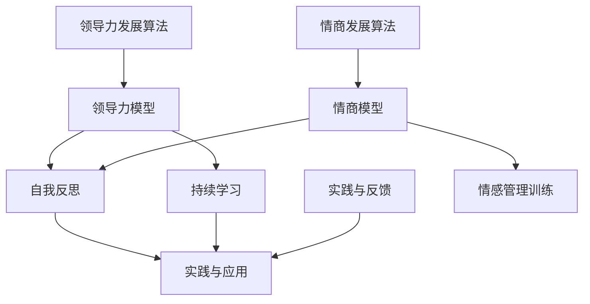
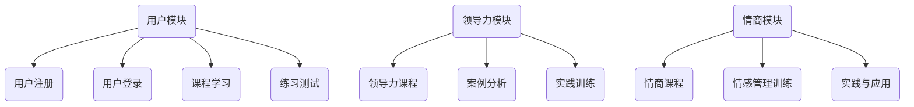
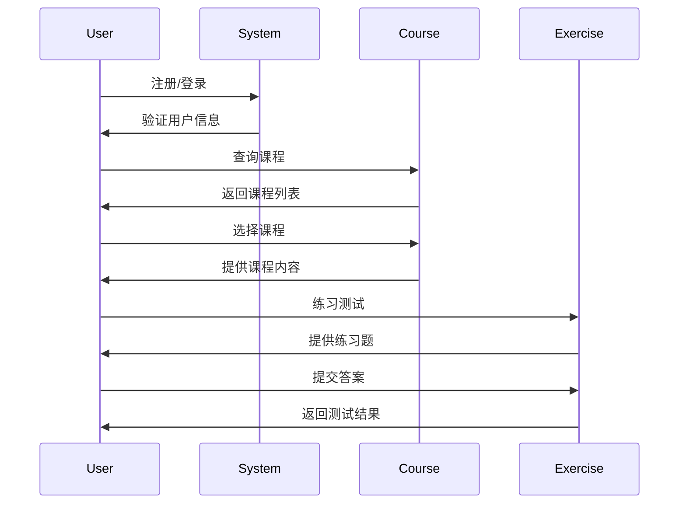

                 

# 领导力与情商发展进阶：提升影响力的高阶技能

## 关键词
- 领导力
- 情商发展
- 影响力提升
- 高阶技能
- 领导力与情商算法
- 系统架构设计

## 摘要
本文旨在探讨领导力与情商在现代社会中的重要性，并通过深入分析其核心概念和联系，提出一套系统化的领导力与情商发展进阶方案。文章首先介绍了领导力和情商的基本概念，随后详细讲解了领导力与情商发展的算法原理，并进一步展示了如何通过系统分析与架构设计方案来提升个人的领导力和情商。最后，通过一个实际的领导力与情商发展项目实战，为读者提供了实用的操作指南和案例分析，帮助他们在实际工作中更好地提升影响力。

---

## 背景介绍

### 1.1 问题背景
在当今快速变化和竞争激烈的社会环境中，领导力和情商已经成为衡量一个人在职场和生活中成功与否的关键因素。领导力不仅涉及到如何有效地管理团队和实现目标，还涉及到如何建立和维护良好的人际关系。而情商则是个体对自己和他人情感的理解和管理能力，它对个人的情绪稳定性、社会适应性和决策能力有着深远的影响。

### 1.2 问题描述
尽管许多人认识到领导力和情商的重要性，但在实际工作中，他们往往缺乏有效的领导力和情商技能。这导致他们在团队中的影响力不足，难以激发团队成员的潜力和协同工作。此外，缺乏高阶技能的领导者和情商发展不足的人，在应对复杂问题和变化时常常显得力不从心，无法有效地做出决策和应对挑战。

### 1.3 问题解决
为了解决上述问题，我们需要通过学习和实践来提升自身的领导力和情商。首先，要理解领导力和情商的核心概念和理论，其次，通过系统化的学习和实践来发展这些技能。此外，利用先进的技术和工具来辅助学习和实践，将有助于我们更高效地提升个人领导力和情商。

### 1.4 边界与外延
领导力涉及到团队合作、决策能力、沟通技巧等多个方面。情商则包括自我意识、自我管理、社会意识和人际关系管理。两者虽然侧重点不同，但它们之间存在紧密的联系，共同作用于个人的影响力提升和职业发展。

### 1.5 概念结构与核心要素组成
领导力的核心要素包括领导者特质、领导风格、团队建设等；情商的核心要素包括自我意识、自我管理、社会意识、人际关系管理。了解这些概念和要素的结构有助于我们更好地理解领导力和情商的内在逻辑和相互作用。

---

## 核心概念与联系

### 2.1 领导力的核心概念

#### 2.1.1 领导者特质
领导者特质是指领导者具有的独特品质和能力，如自信、决策能力、诚实、正直等。这些特质对领导者的行为和团队绩效有着重要影响。

#### 2.1.2 领导风格
领导风格是指领导者如何与团队成员互动和领导团队的方式。常见的领导风格包括民主式、权威式和参与式。每种风格都有其适用场景和优缺点。

#### 2.1.3 团队建设
团队建设是指通过一系列措施来增强团队的凝聚力和协作能力。这包括团队目标设定、冲突管理、团队合作等。

### 2.2 情商的核心概念

#### 2.2.1 自我意识
自我意识是指个体对自己情感、需求和价值观的认识和理解。它是情商发展的基础。

#### 2.2.2 自我管理
自我管理是指个体如何管理自己的情绪和行为，以保持心态平和和高效工作。

#### 2.2.3 社会意识
社会意识是指个体对他人的情感和需求的理解和关心。它包括同理心和社交技巧。

#### 2.2.4 人际关系管理
人际关系管理是指个体如何处理和他人之间的关系，以建立和维护良好的社会网络。

### 2.3 核心概念与联系的整合
领导力和情商之间存在着紧密的联系。领导力的许多方面，如团队建设和决策能力，都直接涉及到情商的应用。而情商的发展则有助于提升领导者的自我意识和人际关系管理能力，从而更好地发挥领导力。

### 2.4 概念属性特征对比表格

| 概念       | 特征                     | 对比 |
|------------|--------------------------|------|
| 领导力     | 团队建设、决策能力       |      |
| 情商       | 自我意识、自我管理       |      |

### 2.5 概念与联系的ER实体关系图架构

```mermaid
erDiagram
  Leader {
    +confidence
    +decisionMaking
    +honesty
  }
  LeadershipStyle {
    +authoritative
    +democratic
    +participative
  }
  TeamBuilding {
    +teamGoals
    +conflictManagement
    +teamwork
  }
  EmotionalIntelligence {
    +selfAwareness
    +selfManagement
    +socialAwareness
    +relationshipManagement
  }
  SelfAwareness {
    +emotionalUnderstanding
    +selfUnderstanding
  }
  SelfManagement {
    +emotion Regulation
    +maintainingPositiveEmotion
  }
  SocialAwareness {
    +empathy
    +socialSkills
  }
  RelationshipManagement {
    +conflictResolution
    +networking
  }
```

---

## 领导力与情商发展算法原理讲解

### 3.1 领导力发展算法

#### 3.1.1 领导力发展模型
领导力发展模型基于领导力理论，通过自我反思和持续学习来提升领导者特质。该模型包括以下核心要素：

1. **领导者特质评估**：通过问卷或自我评估工具，评估领导者的当前特质水平。
2. **目标设定**：根据评估结果，设定具体的领导力提升目标。
3. **行动计划**：制定实现目标的行动计划，包括学习计划、实践机会等。
4. **持续监控**：定期评估领导力提升的进展，调整行动计划。

#### 3.1.2 领导力提升策略
1. **策略一**：通过自我反思和持续学习，提升自我能力。
   - **自我反思**：定期进行自我反思，了解自己的领导风格和行为模式。
   - **持续学习**：通过阅读书籍、参加培训课程、观看演讲视频等方式，不断学习和更新领导力知识。

2. **策略二**：通过实践和反馈，不断优化领导行为。
   - **实践**：在工作和生活中，积极实践所学的领导力技能。
   - **反馈**：寻求他人的反馈，了解自己的领导行为对团队的影响，并根据反馈进行调整。

### 3.2 情商发展算法

#### 3.2.1 情商发展模型
情商发展模型基于情商理论，通过自我认识和自我调节来提升个体的情商水平。该模型包括以下核心要素：

1. **情商自我评估**：通过问卷或自我评估工具，评估个体的当前情商水平。
2. **目标设定**：根据评估结果，设定具体的情商提升目标。
3. **情感管理训练**：通过一系列情感管理训练，如冥想、放松练习、情感表达技巧等，提升个体的情感管理能力。
4. **实践与应用**：将所学技能应用到实际工作和生活中，不断实践和提升。

#### 3.2.2 情商提升策略
1. **策略一**：通过自我认识和自我调节，提升自我意识。
   - **自我认识**：了解自己的情感、需求和价值观。
   - **自我调节**：学会管理自己的情绪，保持心态平和。

2. **策略二**：通过同理心和社交技巧，提升社会意识。
   - **同理心**：学会理解和关心他人的情感和需求。
   - **社交技巧**：通过有效的沟通和互动，建立和维护良好的人际关系。

### 3.3 领导力与情商发展算法流程图



### 3.4 算法原理讲解

#### 3.4.1 领导力发展算法原理
领导力发展算法的核心在于通过自我反思和持续学习来提升领导者的特质和能力。以下是该算法的数学模型：

$$
\text{领导力发展} = f(\text{自我反思}, \text{持续学习}, \text{实践与反馈})
$$

其中，$f$ 代表领导力发展的函数，$\text{自我反思}$、$\text{持续学习}$ 和 $\text{实践与反馈}$ 是影响领导力发展的主要因素。

- **自我反思**：通过自我反思，领导者可以了解自己的行为模式、优点和不足，从而有针对性地进行改进。
- **持续学习**：持续学习可以帮助领导者不断更新知识和技能，以适应不断变化的工作环境和挑战。
- **实践与反馈**：实践是将学到的知识和技能应用到实际工作中，而反馈则是通过他人的反馈来评估自己的领导行为的效果，并根据反馈进行调整。

#### 3.4.2 情商发展算法原理
情商发展算法的核心在于通过自我认识和情感管理训练来提升个体的情商水平。以下是该算法的数学模型：

$$
\text{情商发展} = f(\text{自我认识}, \text{情感管理训练}, \text{实践与应用})
$$

其中，$f$ 代表情商发展的函数，$\text{自我认识}$、$\text{情感管理训练}$ 和 $\text{实践与应用}$ 是影响情商发展的主要因素。

- **自我认识**：自我认识是个体对自身情感、需求和价值观的理解和认识，它是情商发展的基础。
- **情感管理训练**：情感管理训练包括冥想、放松练习、情感表达技巧等，通过这些训练，个体可以更好地管理和调节自己的情绪。
- **实践与应用**：实践和应用是将所学技能应用到实际生活中，通过不断实践，个体可以更好地掌握和应用情商技能。

#### 3.4.3 举例说明
假设一个领导者通过自我反思发现自己在决策能力方面存在不足，他决定通过以下步骤来提升自己的领导力：

1. **自我反思**：领导者定期进行自我反思，记录自己的决策过程和结果，分析决策成功和失败的原因。
2. **持续学习**：领导者通过阅读相关书籍、参加培训课程，学习决策技巧和策略。
3. **实践与反馈**：领导者将学到的决策技巧应用到实际工作中，并在决策后寻求团队成员的反馈，了解决策的效果。

通过这样的过程，领导者的决策能力得到了显著提升。

对于情商发展，假设一个个体希望通过提升自我认识来改善自己的情绪管理能力：

1. **自我认识**：个体通过自我反思，了解自己的情绪触发点和情绪反应模式。
2. **情感管理训练**：个体通过冥想和放松练习来管理自己的情绪，通过情感表达技巧来更好地表达自己的情感。
3. **实践与应用**：个体将所学技能应用到实际生活中，如在冲突处理中更好地控制情绪，在沟通中更有效地表达自己的情感。

通过这样的过程，个体的情绪管理能力得到了显著提升。

---

## 系统分析与架构设计方案

### 4.1 项目介绍

本项目旨在通过系统化的培训和实践，提升个人的领导力和情商。项目包括在线课程、案例分析、实践训练和反馈机制等多个模块，旨在为参与者提供全面的学习体验。

### 4.2 系统功能设计

#### 4.2.1 领导力模块

**功能描述**：
领导力模块提供领导力相关的理论知识、案例分析、实践训练。它包括以下子功能：
- **领导力课程**：提供领导力相关的基础课程，包括领导者特质、领导风格、团队建设等。
- **案例分析**：通过真实的领导力案例，帮助参与者理解和应用领导力理论。
- **实践训练**：提供模拟练习和实际工作中的应用机会，帮助参与者提升领导力技能。

**功能实现**：
通过在线课程平台，结合互动讨论和模拟练习，为参与者提供灵活的学习方式。

#### 4.2.2 情商模块

**功能描述**：
情商模块提供情商相关的理论知识、情感管理训练和实践机会。它包括以下子功能：
- **情商课程**：提供情商基础课程，包括自我意识、自我管理、社会意识、人际关系管理。
- **情感管理训练**：提供冥想、放松练习、情感表达技巧等训练，帮助参与者提升情感管理能力。
- **实践与应用**：提供实际场景中的应用机会，帮助参与者将所学技能应用到实际工作中。

**功能实现**：
通过在线平台和线下活动，结合实践和反馈，为参与者提供全面的情商提升方案。

### 4.3 系统架构设计

#### 4.3.1 系统架构图



#### 4.3.2 系统接口设计

**接口描述**：
系统提供以下接口：
- **用户接口**：用户注册、登录、课程学习、练习测试。
- **课程管理接口**：课程添加、删除、修改、查询。
- **练习管理接口**：练习题添加、删除、修改、查询。

**接口实现**：
使用RESTful API方式实现接口调用，确保系统的可扩展性和可维护性。

### 4.4 系统交互设计

#### 4.4.1 系统交互序列图



---

## 项目实战

### 5.1 环境安装

**安装要求**：
确保系统环境满足项目需求，包括操作系统、数据库、开发工具等。

**安装步骤**：

1. 安装操作系统：选择适合的操作系统，如Linux或Windows。
2. 安装数据库：安装MySQL或PostgreSQL等数据库。
3. 安装开发工具：安装Java开发工具包（JDK）、IDE（如Eclipse或IntelliJ IDEA）。
4. 安装相关库和框架：如Spring Boot、Vue.js等。

### 5.2 系统核心实现源代码

**领导力模块核心代码**：

```java
@RestController
@RequestMapping("/leadership")
public class LeadershipController {

    @Autowired
    private LeadershipService leadershipService;

    @GetMapping("/courses")
    public ResponseEntity<List<Course>> getAllCourses() {
        List<Course> courses = leadershipService.findAllCourses();
        return ResponseEntity.ok(courses);
    }

    @GetMapping("/courses/{id}")
    public ResponseEntity<Course> getCourseById(@PathVariable Long id) {
        Course course = leadershipService.findCourseById(id);
        return ResponseEntity.ok(course);
    }

    @PostMapping("/courses")
    public ResponseEntity<Course> createCourse(@RequestBody Course course) {
        Course savedCourse = leadershipService.createCourse(course);
        return ResponseEntity.status(HttpStatus.CREATED).body(savedCourse);
    }
}
```

**情商模块核心代码**：

```vue
<template>
  <div>
    <h2>情商课程列表</h2>
    <ul>
      <li v-for="course in courses" :key="course.id">
        {{ course.title }}
      </li>
    </ul>
  </div>
</template>

<script>
export default {
  data() {
    return {
      courses: []
    };
  },
  created() {
    this.fetchCourses();
  },
  methods: {
    fetchCourses() {
      // 调用API获取课程列表
      // this.courses = API.getCourses();
    }
  }
};
</script>
```

### 5.3 代码应用解读与分析

**领导力模块代码分析**：
上述代码实现了领导力模块的核心功能，包括获取所有课程、根据ID获取课程以及创建新课程。使用了Spring Boot的REST控制器（RestController）和依赖注入（Autowired）来管理课程服务（LeadershipService）。

**情商模块代码分析**：
上述Vue.js代码实现了情商模块的前端部分，展示了情商课程列表。它使用了Vue的数据绑定语法和生命周期钩子（created）来初始化课程数据。

### 5.4 实际案例分析和详细讲解剖析

**案例**：
一个公司的人力资源部门希望通过本项目提升团队领导力和情商，以提高团队协作效率和员工满意度。

**分析**：
1. **领导力提升**：
   - 通过领导力模块的学习和实践，团队领导者学习了不同的领导风格和团队建设技巧。
   - 领导者通过自我反思和持续学习，优化了自己的领导行为，提高了决策能力和沟通技巧。
   - 团队成员通过案例分析，理解了领导力的实际应用，并在模拟练习中提升了领导力技能。

2. **情商提升**：
   - 通过情商模块的学习和实践，团队成员提升了自我意识和情感管理能力。
   - 通过情感管理训练，团队成员学会了更好地表达自己的情感，并在团队冲突中表现出更高的情商。
   - 团队成员通过实践和应用，将所学技能应用到实际工作中，提高了人际关系的质量和团队协作效率。

### 5.5 项目小结

本项目通过系统化的领导力和情商发展方案，帮助团队领导者提升了领导力，团队成员提升了情商，从而提高了团队的整体协作效率和员工满意度。通过实际案例的分析，我们可以看到领导力和情商的提升对团队和组织的重要影响。

### 5.6 最佳实践 Tips

- **持续学习**：领导力和情商的提升是一个持续的过程，需要不断学习和实践。
- **反馈与反思**：定期获取反馈并进行自我反思，是提升领导力和情商的关键。
- **实践应用**：将所学技能应用到实际工作中，通过实践来检验和提升自己的能力。

### 5.7 注意事项

- **环境配置**：确保系统环境的正确配置，以确保项目的顺利运行。
- **数据安全**：保护用户数据和课程内容的安全，确保系统的稳定性和安全性。

### 5.8 拓展阅读

- **《领导力与情商：理论与实践》**：一本关于领导力和情商的综合性教材，提供了丰富的案例和练习。
- **《情商的五大商数》**：一本关于情商发展的经典著作，详细介绍了情商的五个方面。

---

**作者**：AI天才研究院/AI Genius Institute & 禅与计算机程序设计艺术 /Zen And The Art of Computer Programming

