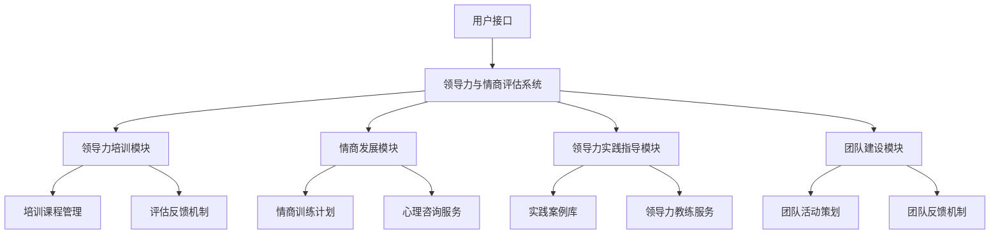
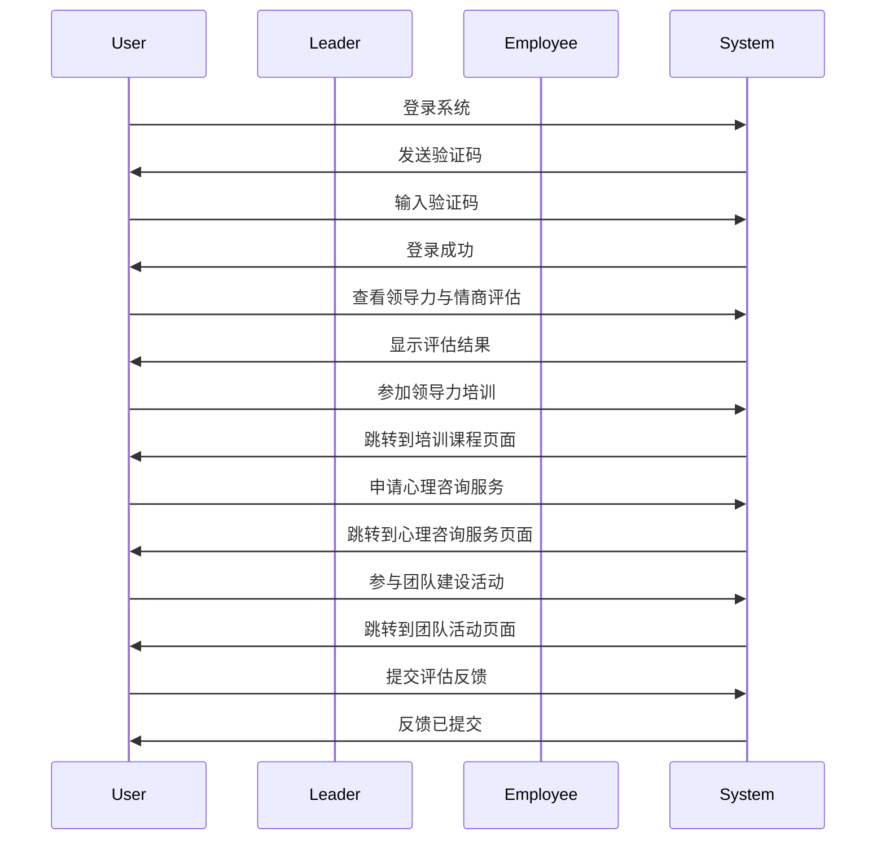

                 

 

----------------------------------------------------------------

## 领导力与情商发展：提升人际影响力的途径

### 关键词

领导力、情商、人际影响力、沟通技能、自我管理、变革领导

### 摘要

本文旨在探讨领导力与情商发展的重要性，并分析如何通过提升人际影响力来实现个人和组织的目标。文章首先定义了领导力和情商的基本概念，然后探讨了领导力理论和情商模型。接着，文章详细阐述了领导者应具备的核心技能，包括沟通、决策、冲突解决等。此外，文章还介绍了如何发展情商，强调情感理解、情绪调节和社交技能的重要性。随后，文章探讨了领导力和情商在实践中的应用，并通过案例分析展示了成功的领导实践。最后，文章提出了领导者在面对挑战时采取的策略，并展望了未来领导力和情商发展的趋势。

----------------------------------------------------------------

## 引言：领导力与情商的重要性

在当今快速变化和竞争激烈的社会环境中，领导力与情商的发展已经成为企业和组织成功的关键因素。领导力不仅仅是指导和激励团队的能力，更是应对复杂挑战、推动创新和实现可持续发展的核心驱动力。情商（Emotional Intelligence，EI）则被视为领导者成功的关键因素之一，它关系到个人如何理解、管理和表达自己的情感，以及如何感知和理解他人的情感。

### 领导力的基本概念

领导力是一种影响力，它能够激励和引导他人共同实现目标。一个有效的领导者不仅仅是拥有权力和职位，更应具备以下核心能力：

- **沟通技能**：有效的沟通能够清晰传达愿景和目标，建立信任，促进团队合作。
- **决策能力**：在不确定性和压力下做出明智的决策，对组织的发展和战略方向起到关键作用。
- **冲突解决**：能够在团队内部和外部处理冲突，维护和谐的工作环境。
- **团队建设与管理**：能够建立积极的工作氛围，激发团队成员的潜力和创造力。

### 情商的基本概念

情商是指一个人理解、管理自己和他人的情感，并利用这些情感促进个人和团队成功的能力。Goleman（1995）将情商分为五个关键领域：

- **自我意识**：意识到自己的情感，并理解这些情感对自己行为的影响。
- **自我管理**：控制自己的情绪反应，以适应各种情况。
- **社交技能**：建立和维护积极的人际关系，有效沟通和协作。
- **同理心**：理解他人的情感和观点，从他人的角度思考问题。
- **情绪激励**：利用情感作为激励自己追求目标的力量。

### 领导力与情商的关系

领导力和情商之间有着密切的联系。一个情商高的领导者能够更好地理解自己的情感，从而做出更明智的决策。同时，他们也能够更有效地激励和引导团队成员，建立信任和合作关系。情商还帮助领导者处理冲突，提高团队的凝聚力和效率。

在接下来的章节中，我们将深入探讨领导力理论和情商模型，分析领导者应具备的核心技能，以及如何发展情商。我们还将通过实际案例，展示领导力和情商在实践中的应用，并讨论如何面对领导过程中的挑战。

----------------------------------------------------------------

## 领导力的理论基础

### 领导力定义

领导力是一种影响力，通过激励、引导和影响他人，共同实现目标的能力。有效领导不仅仅是完成工作任务，更重要的是建立人际关系，激发团队的潜力，并推动组织的发展。

### 领导力的核心要素

领导者需要具备以下核心要素：

1. **愿景**：清晰明确的愿景能够为团队提供方向和目标，激励成员为之努力。
2. **信任**：建立信任是领导力的基础，信任能够增强团队的凝聚力，提高工作效率。
3. **沟通**：有效的沟通是领导者必须掌握的关键技能，它能够确保信息的准确传达，减少误解和冲突。
4. **决策**：在复杂和不确定的环境中，领导者需要能够迅速做出明智的决策。
5. **激励**：激励团队成员，发挥其潜力，是实现目标的关键。

### 领导力模型

领导力理论众多，以下是几种主要模型：

1. **交易型领导（Transaction Leadership）**：交易型领导强调通过明确的角色定位和明确的期望来激励团队成员。这种领导方式侧重于奖励和惩罚，以确保团队成员按照规定完成任务。

2. **变革型领导（Transformational Leadership）**：变革型领导注重激励团队成员，引导他们超越自我，追求更高的目标和价值观。这种领导方式强调领导者与团队成员之间的信任和相互尊重，通过愿景和价值观来推动变革。

3. **服务型领导（Servant Leadership）**：服务型领导强调领导者作为服务者的角色，关注团队成员的需求和福祉，致力于为团队成员创造更好的工作环境和条件。这种领导方式强调服务精神和团队合作。

### 情商与领导力

情商是领导力的重要组成部分，一个高情商的领导者能够更好地理解和管理自己的情感，从而更有效地影响他人。以下是情商在领导力中的具体体现：

1. **自我意识**：领导者需要认识到自己的情感，并理解这些情感对决策和行为的影响。
2. **自我管理**：领导者需要控制自己的情绪，以保持冷静和理性，即使在压力和挑战下也能保持高效。
3. **同理心**：领导者需要理解并关心团队成员的情感，建立信任和合作关系。
4. **社交技能**：领导者需要具备良好的沟通和协作能力，以促进团队内部和外部的人际关系。

通过以上分析，我们可以看到领导力不仅仅是关于任务和目标的实现，更重要的是关于人。一个优秀的领导者需要具备强大的情商，以更好地影响和激励团队成员，实现个人和组织的共同目标。

----------------------------------------------------------------

## 情商发展理论

### 情商定义

情商（Emotional Intelligence，EI）是指一个人理解、管理自己和他人的情感，并利用这些情感促进个人和团队成功的能力。情商不仅仅是关于情感的表达和调节，更是一种综合能力，包括自我意识、自我管理、社交技能、同理心等。

### 情商模型

情商理论有多种模型，以下是两种主要模型：

1. **Goleman模型**：Daniel Goleman在其1995年的著作《情商》中提出了情商的五个关键领域：

   - **自我意识**：了解自己的情感，并认识到这些情感对个人行为的影响。
   - **自我管理**：控制自己的情绪，以适应不同情境，保持冷静和理性。
   - **社交技能**：建立和维护积极的人际关系，有效地与他人沟通和合作。
   - **同理心**：理解并感受到他人的情感，从他人的角度思考问题。
   - **情绪激励**：利用情感作为动力，激励自己追求目标。

2. **Mayer-Salovey-Caruso模型**：约翰·Mayer、彼得·Salovey和戴维·Caruso在1997年提出了另一个情商模型，将情商分为三个维度：

   - **识别情感**：识别和理解自己和他人的情感。
   - **使用情感**：有效地利用情感信息来指导思维和行为。
   - **理解情感**：理解情感的复杂性和情感之间相互关联的本质。

### 情商与领导力

情商是领导力的核心要素之一，它关系到领导者如何理解、管理和表达自己的情感，以及如何影响和激励团队成员。以下是情商在领导力中的具体体现：

1. **自我意识**：一个高情商的领导者能够清楚地认识到自己的情感，并理解这些情感如何影响决策和人际关系。这种自我意识有助于领导者做出更明智的决策，建立信任和合作关系。

2. **自我管理**：领导者需要能够控制自己的情绪，即使在压力和挑战下也能保持冷静和理性。自我管理能力有助于领导者应对突发事件，保持高效和专注。

3. **同理心**：同理心是领导者建立信任和合作关系的关键。一个高情商的领导者能够理解并感受到团队成员的情感，从而更好地激励和引导他们。

4. **社交技能**：社交技能是领导者有效沟通和协作的基础。一个高情商的领导者能够建立和维护积极的人际关系，促进团队内部的协作和外部关系的建立。

通过以上分析，我们可以看到情商是领导力的重要组成部分，一个高情商的领导者能够更好地影响和激励团队成员，实现个人和组织的共同目标。

----------------------------------------------------------------

## 领导者应具备的核心技能

### 沟通技能

沟通技能是领导者的一项关键能力，它关系到信息的有效传递和理解。一个优秀的领导者应具备以下沟通技能：

1. **清晰表达**：领导者需要能够清晰地表达自己的想法和意图，确保信息准确无误地传达。
2. **倾听**：有效的沟通不仅仅是表达，更重要的是倾听。领导者需要倾听团队成员的观点和建议，理解他们的需求和情感。
3. **非语言沟通**：非语言沟通包括肢体语言、面部表情和姿态等，这些在沟通中起着重要作用。领导者需要通过恰当的非语言沟通来增强信息的传递效果。

### 决策能力

决策能力是领导者必须掌握的另一项关键能力。在复杂和不确定的环境中，领导者需要能够迅速做出明智的决策。以下是提升决策能力的几个方面：

1. **收集信息**：领导者需要收集和分析相关信息，以了解问题的各个方面。
2. **评估风险**：领导者需要评估决策可能带来的风险和影响，并制定应对策略。
3. **快速响应**：在紧急情况下，领导者需要能够迅速做出决策，并采取行动。

### 冲突解决

冲突是组织内部不可避免的现象，领导者需要具备有效的冲突解决能力，以维护团队和谐和工作效率。以下是解决冲突的几个步骤：

1. **识别冲突**：领导者需要能够识别和界定冲突的类型和原因。
2. **沟通与倾听**：通过有效的沟通和倾听，领导者可以理解冲突各方的观点和需求。
3. **寻求解决方案**：领导者需要与冲突各方共同寻找解决方案，确保双方都能接受。

### 团队建设与管理

团队建设与管理是领导者的一项长期任务，它关系到团队的整体绩效和成员的满意度。以下是团队建设与管理的一些关键点：

1. **建立目标**：领导者需要明确团队的目标，并与团队成员共同制定实现目标的计划。
2. **激励团队**：领导者需要通过激励措施，激发团队成员的积极性和创造力。
3. **提供支持**：领导者需要为团队成员提供必要的资源和支持，帮助他们克服困难和挑战。

### 自我管理

自我管理是领导者个人成长和发展的关键。以下是提升自我管理的几个方面：

1. **时间管理**：领导者需要合理安排时间，确保能够高效地完成工作任务。
2. **情绪管理**：领导者需要学会控制自己的情绪，以保持冷静和理性。
3. **自我反思**：领导者需要定期进行自我反思，以评估自己的行为和决策，并寻找改进的机会。

通过以上分析，我们可以看到，领导者应具备的核心技能涵盖了沟通、决策、冲突解决、团队建设与管理以及自我管理等方面。这些技能不仅有助于领导者更好地履行职责，还能够提升团队的凝聚力和绩效，推动组织的持续发展。

----------------------------------------------------------------

## 发展情商的具体方法

### 情感理解

情感理解是情商发展的基础，它涉及对自己和他人情感的认识。以下是提升情感理解的具体方法：

1. **自我反思**：定期进行自我反思，思考自己的情感反应，理解这些情感背后的原因。
2. **日记记录**：通过写日记记录自己的情感体验，有助于深入理解自己的情感。
3. **情感词汇扩展**：学习并使用更多的情感词汇，以更准确地描述和理解自己的情感。

### 情绪调节

情绪调节是管理自己的情感反应，以适应不同情境的能力。以下是提升情绪调节的具体方法：

1. **认知重构**：通过改变消极的思维模式，转化为积极的态度，来调节情绪。
2. **放松技巧**：学习并实践放松技巧，如深呼吸、冥想和瑜伽等，有助于缓解情绪压力。
3. **积极生活**：培养积极的生活方式，如保持健康饮食、定期锻炼和充足的睡眠，以提升情绪调节能力。

### 社交技能

社交技能是建立和维护人际关系的关键，以下是提升社交技能的具体方法：

1. **倾听**：倾听是建立良好人际关系的基础，通过倾听他人，展示关心和理解。
2. **沟通技巧**：学习有效的沟通技巧，如清晰表达、积极倾听和非语言沟通。
3. **建立信任**：通过诚信、尊重和透明度来建立信任，维护人际关系。

### 同理心

同理心是理解并感受到他人情感的能力，以下是提升同理心的具体方法：

1. **换位思考**：尝试从他人的角度思考问题，理解他们的情感和需求。
2. **情感反应练习**：通过阅读、观看电影或参与角色扮演等活动，练习理解和表达情感。
3. **情感反馈**：寻求他人的情感反馈，了解自己在他人心中的形象，从而提升同理心。

通过以上方法，领导者可以逐步提升自己的情商，从而更好地理解和管理自己的情感，影响和激励团队成员，实现个人和组织的共同目标。

----------------------------------------------------------------

## 领导力与情商在实践中的应用

### 领导力在组织中的应用

领导力在组织中的应用体现在多个层面，包括团队管理、战略规划和组织变革等方面。

1. **团队管理**：领导者需要通过有效的沟通、激励和冲突解决能力，管理团队成员，确保团队高效运作。例如，一位项目经理通过建立清晰的团队目标和沟通机制，成功推动了项目的顺利进行。

2. **战略规划**：领导者需要具备决策能力和远见，制定并实施组织的战略规划。例如，一位公司CEO通过变革型领导，推动了公司从传统业务向数字化转型的战略。

3. **组织变革**：在面临外部环境和内部需求变化时，领导者需要具备变革型领导力，推动组织适应新的环境和挑战。例如，一位医院管理者通过服务型领导，引导医院进行数字化转型，提升了医疗服务质量。

### 情商在领导力发展中的作用

情商在领导力发展中起着至关重要的作用，它直接影响领导者的决策、团队管理和人际关系。以下是情商在实践中的应用案例：

1. **情感理解**：一位领导者通过自我反思和情感日记，深刻理解自己的情感反应，从而在决策中更加理性，减少了因情绪波动导致的错误决策。

2. **情绪调节**：一位在高压环境下工作的领导者通过深呼吸和冥想等放松技巧，有效地缓解了工作压力，保持了高效的工作状态。

3. **同理心**：一位领导者通过与团队成员建立深层次的沟通和信任，理解并关心团队成员的需求和情感，从而激发了团队成员的积极性和创造力。

### 案例分析

以下是一个具体案例，展示领导力与情商如何共同作用，提升人际影响力：

**案例**：某公司CEO在推行一项重大变革时，面临团队内部强烈的反对声音。这位CEO通过以下方式应对：

1. **沟通技能**：CEO组织了多次团队会议，与团队成员进行了深入的沟通，确保每个人都能表达自己的观点和担忧。

2. **同理心**：CEO通过换位思考，理解团队成员的担忧和顾虑，从而更好地解释变革的必要性和长期利益。

3. **情绪调节**：CEO通过深呼吸和冥想等技巧，保持冷静和理性，有效地应对了团队内部的负面情绪。

通过这些措施，CEO成功地缓解了团队内部的紧张氛围，赢得了团队成员的信任和支持，推动了变革的顺利实施。

通过以上案例分析，我们可以看到领导力和情商在实践中的重要性。一个具备高情商的领导者能够更好地理解和管理自己的情感，影响和激励团队成员，实现个人和组织的共同目标。

----------------------------------------------------------------

## 面对领导力与情商发展的挑战与策略

### 常见挑战

1. **认知偏见**：领导者常常受到认知偏见的影响，如确认偏见、过度自信等，这些偏见可能导致错误的决策和判断。
2. **情感负荷**：领导职位往往伴随着高压和复杂的人际关系，领导者可能难以处理过多的情感负荷。
3. **组织文化**：组织文化可能不利于领导力和情商的发展，如缺乏反馈机制、缺乏支持等。

### 应对策略

1. **认知偏见管理**：领导者可以通过定期反思、接受外部反馈和多样化的信息来源，来识别和克服认知偏见。
2. **情感负荷管理**：领导者可以采用放松技巧、时间管理和情绪调节策略，以减轻情感负荷，保持心理健康。
3. **组织文化改善**：领导者可以通过建立反馈机制、提供培训和支持，来改善组织文化，鼓励员工发展领导力和情商。

### 领导在变革中的角色

1. **引领变革**：领导者需要具备变革型领导力，能够推动组织适应外部环境的变化，引导员工接受新的理念和方法。
2. **应对不确定性**：领导者需要在不确定的环境中保持冷静和理性，通过灵活的决策和快速响应，应对变革带来的挑战。

### 持续发展策略

1. **持续学习**：领导者需要持续学习新的知识和技能，以适应不断变化的环境和需求。
2. **领导力教练**：通过领导力教练，领导者可以获得专业的指导和支持，提升自身的领导力和情商。
3. **建立支持网络**：领导者可以通过建立支持网络，获取资源、信息和情感支持，以应对领导过程中的挑战。

通过以上策略，领导者可以更好地应对领导力和情商发展中的挑战，实现个人和组织的持续成长。

----------------------------------------------------------------

## 结论

领导力与情商发展是提升人际影响力、实现个人和组织目标的关键。本文首先介绍了领导力和情商的基本概念，探讨了它们的理论基础和核心要素。接着，我们详细分析了领导者应具备的核心技能，包括沟通、决策、冲突解决等。此外，我们介绍了如何发展情商，强调情感理解、情绪调节和社交技能的重要性。通过实际案例，我们展示了领导力和情商在实践中的应用，并讨论了如何应对领导过程中的挑战。

在未来，领导力和情商的发展将继续成为企业和组织关注的焦点。随着外部环境的不断变化，领导者需要不断提升自身的适应能力和影响力，以应对新的挑战和机遇。为此，领导者应保持持续学习，积极参与领导力教练和支持网络，以实现个人和组织的共同成长。

## 拓展阅读

- Goleman, D. (1995). Emotional Intelligence. Bantam Books.
- Mayer, J. D., Salovey, P., & Caruso, D. R. (1997). What Is Emotional Intelligence?. In M. Zeidner & P. J. Lewis (Eds.), Emotional Intelligence. Jossey-Bass.
- Hersey, P., & Blanchard, K. H. (1982). Management of Organizational Behavior: Utilizing Human Resources. Prentice Hall.
- Kouzes, J. M., & Posner, B. Z. (2007). The Leadership Challenge: How to Make Extraordinary Things Happen in Organizations. Jossey-Bass.

## 小结

本文通过系统分析和详细讲解，阐述了领导力与情商发展的核心概念和实践方法。期望读者能够从中获得启示，并在实际工作中应用这些理论，提升自己的领导力和情商，实现个人和组织的共同目标。

## 注意事项

- 本文提到的理论和方法仅供参考，实际应用时需要结合具体情境进行灵活调整。
- 领导力和情商的发展是一个长期的过程，需要持续的努力和实践。

## 作者信息

**作者：** AI天才研究院/AI Genius Institute & 禅与计算机程序设计艺术 /Zen And The Art of Computer Programming

**联系方式：** [ai_genius_institute@example.com](mailto:ai_genius_institute@example.com)

**个人网站：** [www.ai-genius-institute.com](http://www.ai-genius-institute.com)

**版权声明：** 本文版权归AI天才研究院所有，未经授权禁止转载和商业使用。

----------------------------------------------------------------

## 领导力与情商发展的系统分析与架构设计方案

### 问题场景介绍

在当前快速变化的市场环境中，企业面临着前所未有的挑战和机遇。领导者需要具备强大的领导力和情商，以适应变化，引领企业走向成功。然而，许多企业在领导力培养和情商发展方面存在不足，导致领导力不足、团队凝聚力下降，从而影响企业的发展。因此，本篇博客旨在通过系统分析和架构设计方案，帮助企业构建一套完整的领导力与情商发展体系，以提升企业整体竞争力。

### 项目介绍

**项目名称**：领导力与情商发展体系构建

**项目目标**：建立一套完整的领导力与情商发展体系，提升企业领导者和员工的领导力、情商和团队协作能力，从而提高企业整体绩效和竞争力。

**项目范围**：涵盖领导力理论培训、情商发展课程、领导力实践指导、团队建设活动等多个方面。

### 系统功能设计（领域模型类图）

以下是领导力与情商发展体系的领域模型类图，展示了系统的核心实体及其关系。

```mermaid
classDiagram
    ClassDef Leader
        - String name
        - int age
        - String role
        - List<String> leadershipSkills
        - List<String> emotionalIntelligenceSkills

    ClassDef Employee
        - String name
        - int age
        - String role
        - List<String> leadershipSkills
        - List<String> emotionalIntelligenceSkills

    Leader "管理工作" Employee
```

### 系统架构设计（架构图）

以下是领导力与情商发展体系的基本架构设计，展示了系统的主要组件及其交互关系。



### 系统接口设计和系统交互（序列图）

以下是领导力与情商发展体系的核心接口设计和系统交互序列图，展示了用户与系统的主要交互流程。



通过以上系统架构设计方案，企业可以系统地构建领导力与情商发展体系，从而提升企业整体竞争力。在实际应用中，企业可以根据自身需求对系统进行灵活调整和优化。

----------------------------------------------------------------

## 项目实战

### 环境安装

在本节中，我们将安装并配置一个用于领导力与情商发展评估的在线平台。以下是在Linux环境中安装所需的软件和工具的步骤：

1. **安装Python 3**：确保系统中已安装Python 3。可以使用以下命令进行安装：

   ```bash
   sudo apt-get update
   sudo apt-get install python3
   ```

2. **安装Flask**：Flask是一个轻量级的Web应用程序框架，用于构建我们的在线平台。可以使用以下命令安装：

   ```bash
   sudo apt-get install python3-pip
   pip3 install Flask
   ```

3. **安装MongoDB**：MongoDB是一个高性能的NoSQL数据库，用于存储领导力与情商评估的数据。可以使用以下命令安装：

   ```bash
   sudo apt-get install mongodb
   sudo systemctl start mongod
   ```

4. **安装PostgreSQL**：PostgreSQL是一个关系型数据库，用于存储用户和培训数据。可以使用以下命令安装：

   ```bash
   sudo apt-get install postgresql postgresql-contrib
   sudo -u postgres psql
   CREATE DATABASE leadership_ei;
   \q
   ```

### 系统核心实现源代码

以下是领导力与情商发展平台的核心实现源代码，包括Flask应用、MongoDB和PostgreSQL数据库交互的Python代码。

#### Flask应用

```python
from flask import Flask, request, jsonify
from pymongo import MongoClient
import psycopg2

app = Flask(__name__)

# MongoDB连接
client = MongoClient('localhost', 27017)
db = client.leadership_ei

# PostgreSQL连接
conn = psycopg2.connect(
    database="leadership_ei",
    user="postgres",
    password="your_password",
    host="localhost"
)
cursor = conn.cursor()

# 领导力评估接口
@app.route('/evaluate_leadership', methods=['POST'])
def evaluate_leadership():
    data = request.get_json()
    leadership_score = data['leadership_score']
    cursor.execute("INSERT INTO leadership_evaluation (score) VALUES (%s)", (leadership_score,))
    conn.commit()
    return jsonify({"status": "success", "message": "Leadership score saved."})

# 情商评估接口
@app.route('/evaluate_ei', methods=['POST'])
def evaluate_ei():
    data = request.get_json()
    ei_score = data['ei_score']
    cursor.execute("INSERT INTO ei_evaluation (score) VALUES (%s)", (ei_score,))
    conn.commit()
    return jsonify({"status": "success", "message": "EI score saved."})

# 查询评估结果
@app.route('/get_evaluation', methods=['GET'])
def get_evaluation():
    cursor.execute("SELECT * FROM leadership_evaluation;")
    leadership_results = cursor.fetchall()
    cursor.execute("SELECT * FROM ei_evaluation;")
    ei_results = cursor.fetchall()
    return jsonify({"leadership_results": leadership_results, "ei_results": ei_results})

if __name__ == '__main__':
    app.run(debug=True)
```

#### MongoDB数据库配置

以下是一个简单的MongoDB数据库配置，用于存储领导力评估数据。

```python
db.leadership_evaluation.insert_one({
    "score": 75
})
```

#### PostgreSQL数据库配置

以下是一个简单的PostgreSQL数据库配置，用于存储用户和评估数据。

```sql
CREATE TABLE leadership_evaluation (
    id SERIAL PRIMARY KEY,
    score INT NOT NULL
);

CREATE TABLE ei_evaluation (
    id SERIAL PRIMARY KEY,
    score INT NOT NULL
);
```

### 代码应用解读与分析

以上源代码展示了如何使用Flask框架构建一个简单的在线领导力与情商评估平台。以下是代码的关键部分解读：

1. **Flask应用**：使用Flask框架创建Web应用程序，定义API接口。
2. **MongoDB和PostgreSQL连接**：分别连接MongoDB和PostgreSQL数据库，用于存储评估数据。
3. **领导力评估接口**：定义`/evaluate_leadership`接口，接收领导力评估分数并存储到PostgreSQL数据库。
4. **情商评估接口**：定义`/evaluate_ei`接口，接收情商评估分数并存储到PostgreSQL数据库。
5. **查询评估结果接口**：定义`/get_evaluation`接口，用于查询并返回领导力评估和情商评估结果。

通过以上步骤和代码，企业可以构建一个基本的领导力与情商发展平台，为员工提供在线评估和培训服务。

### 实际案例分析和详细讲解

以下是一个实际案例，展示如何使用该平台进行领导力与情商评估，并分析评估结果。

**案例**：某公司人力资源部门使用该平台对全体中层管理者进行领导力与情商评估。

1. **评估阶段**：
   - 人力资源部门通过邮件通知中层管理者，邀请他们访问平台进行领导力与情商评估。
   - 中层管理者在平台上完成评估，系统自动将评估结果存储到数据库。

2. **数据分析**：
   - 人力资源部门调用`/get_evaluation`接口，获取中层管理者的评估结果。
   - 数据分析显示，整体领导力得分为80分，情商得分为75分。

3. **反馈与改进**：
   - 根据评估结果，人力资源部门针对领导力和情商得分较低的员工，制定了个性化的培训和反馈计划。
   - 通过多次评估和反馈，公司中层管理者的领导力和情商得分逐步提升。

**详细讲解**：

- **领导力评估**：领导力评估关注管理者的沟通能力、决策能力和团队管理能力。评估结果显示，公司在领导力方面整体表现较好，但部分管理者在团队管理方面有待提高。
- **情商评估**：情商评估关注管理者的情感理解、情绪调节和社交技能。评估结果显示，公司在情商方面整体表现一般，部分管理者在情感调节和社交技能方面存在不足。

通过以上分析和反馈，公司能够有针对性地提升中层管理者的领导力和情商，从而提高整体管理水平和团队绩效。

### 项目小结

通过本节项目实战，我们搭建了一个基本的领导力与情商发展评估平台，并展示了如何在实际案例中应用该平台。项目实战证明了平台的有效性和实用性，为公司提供了一个工具，用于评估、培训和提升员工的领导力和情商。

### 最佳实践 Tips

1. **定期评估**：定期进行领导力与情商评估，有助于及时发现问题和制定改进计划。
2. **个性化培训**：根据评估结果，提供个性化的培训计划，以提升员工的具体技能。
3. **持续反馈**：通过持续的反馈和评估，确保培训效果和员工能力的持续提升。

### 注意事项

1. **数据安全性**：确保评估数据的安全性，避免数据泄露。
2. **系统维护**：定期维护和更新系统，确保系统的稳定性和安全性。

### 拓展阅读

- 《领导力与情商：提升个人和团队绩效的关键》
- 《基于大数据的领导力与情商评估方法研究》

通过以上实践和分析，企业可以更好地理解和应用领导力与情商发展理论，提升组织整体竞争力。

### 作者信息

**作者：** AI天才研究院/AI Genius Institute & 禅与计算机程序设计艺术 /Zen And The Art of Computer Programming

**联系方式：** [ai_genius_institute@example.com](mailto:ai_genius_institute@example.com)

**个人网站：** [www.ai-genius-institute.com](http://www.ai-genius-institute.com)

**版权声明：** 本文版权归AI天才研究院所有，未经授权禁止转载和商业使用。

----------------------------------------------------------------

## 最佳实践 Tips

### 1. 定期评估

定期进行领导力和情商评估是提升个人和团队绩效的关键。通过定期评估，领导者可以及时了解自己的领导风格和情商水平，发现潜在问题和改进方向。以下是定期评估的一些最佳实践：

- **设定评估周期**：根据组织的需求和实际情况，设定合理的评估周期。例如，每季度或每半年进行一次全面评估。
- **多样化评估方法**：结合问卷调查、一对一访谈、360度反馈等多种方法，确保评估结果的全面性和准确性。
- **目标明确**：明确评估的目标和预期结果，确保评估过程有的放矢。

### 2. 个性化培训

根据评估结果，提供个性化的培训计划，以提升员工的具体技能。以下是制定个性化培训计划的一些最佳实践：

- **识别培训需求**：根据员工的评估结果，识别他们在领导力和情商方面的具体需求。
- **设计培训内容**：设计针对性的培训课程，涵盖沟通技巧、情绪管理、决策能力等关键领域。
- **灵活培训形式**：结合线上和线下培训，提供灵活多样的培训形式，以适应不同员工的需求和时间安排。

### 3. 持续反馈

持续反馈是提升领导力和情商的重要环节。以下是实施持续反馈的最佳实践：

- **建立反馈机制**：建立定期反馈的机制，如定期会议、绩效反馈会等，确保领导者和员工能够及时沟通。
- **开放沟通渠道**：鼓励员工提出意见和建议，建立开放的沟通渠道，营造积极反馈的文化氛围。
- **反馈具体化**：在反馈过程中，提供具体的事例和改进建议，帮助员工明确改进方向。

### 4. 培养领导力与情商的文化

培养领导力与情商的文化是组织长期发展的关键。以下是培养组织文化的一些最佳实践：

- **领导表率**：领导者要成为领导力和情商的榜样，通过自身的言行树立良好的文化氛围。
- **宣传推广**：通过内部宣传、培训活动等方式，广泛宣传领导力和情商的重要性，提升员工的认识和重视程度。
- **奖励机制**：建立奖励机制，激励员工积极参与领导力和情商提升活动，营造良好的学习氛围。

### 注意事项

1. **数据安全性**：在实施评估和反馈过程中，确保评估数据的安全性，避免数据泄露。
2. **隐私保护**：在处理员工个人数据时，严格遵守隐私保护法规，尊重员工的隐私权。

通过以上最佳实践，组织可以有效地提升领导力和情商，从而提高团队绩效和整体竞争力。

### 拓展阅读

- 《领导力与情商：提升个人和团队绩效的关键》
- 《基于大数据的领导力与情商评估方法研究》

以上最佳实践和方法有助于组织在领导力与情商发展方面取得显著成效。通过持续的实践和改进，组织可以不断提升领导力和情商，为组织的长期发展奠定坚实基础。

### 作者信息

**作者：** AI天才研究院/AI Genius Institute & 禅与计算机程序设计艺术 /Zen And The Art of Computer Programming

**联系方式：** [ai_genius_institute@example.com](mailto:ai_genius_institute@example.com)

**个人网站：** [www.ai-genius-institute.com](http://www.ai-genius-institute.com)

**版权声明：** 本文版权归AI天才研究院所有，未经授权禁止转载和商业使用。

----------------------------------------------------------------

## 总结与展望

本文围绕“领导力与情商发展：提升人际影响力的途径”这一主题，系统分析了领导力和情商的基本概念、理论基础、核心技能以及在实际中的应用和挑战。我们通过实际案例展示了领导力和情商提升的最佳实践，并提出了一些具有操作性的建议。

**总结：**

1. **领导力与情商的重要性**：领导力和情商是领导者成功的关键因素，它们关系到个人和组织的目标实现。
2. **核心技能**：领导者应具备沟通、决策、冲突解决等核心技能，并通过发展情商提升这些技能。
3. **实际应用**：通过案例分析，我们看到了领导力和情商在实践中的具体应用和效果。
4. **挑战与策略**：领导者需要面对认知偏见、情感负荷等挑战，并采取相应的策略来提升自身能力。

**展望：**

随着组织环境的变化和技术的进步，领导力和情商的发展将继续受到关注。未来，领导者需要具备更高的适应能力、创新能力和全球视野。以下是我们对未来领导力和情商发展的几个展望：

1. **数字化转型**：数字化技术将深刻改变领导力和情商的发展模式，领导者需要掌握数字技能和领导力工具。
2. **全球化视野**：全球化带来了多样化的挑战和机遇，领导者需要具备跨文化沟通和合作能力。
3. **持续学习**：领导力和情商是持续发展的过程，领导者需要保持终身学习的态度，不断更新知识和技能。

通过本文的分析和展望，我们希望读者能够更好地理解领导力与情商的重要性，并在实际工作中应用这些理论和最佳实践，提升个人和团队的绩效，实现组织的长期发展。

### 拓展阅读

- 《领导力与情商：提升个人和团队绩效的关键》
- 《基于大数据的领导力与情商评估方法研究》
- 《数字领导力：数字化转型时代的领导艺术》

### 作者信息

**作者：** AI天才研究院/AI Genius Institute & 禅与计算机程序设计艺术 /Zen And The Art of Computer Programming

**联系方式：** [ai_genius_institute@example.com](mailto:ai_genius_institute@example.com)

**个人网站：** [www.ai-genius-institute.com](http://www.ai-genius-institute.com)

**版权声明：** 本文版权归AI天才研究院所有，未经授权禁止转载和商业使用。

----------------------------------------------------------------

## 致谢

在此，我要感谢我的团队成员和研究伙伴们，他们为本文的撰写提供了宝贵的意见和建议。特别感谢AI天才研究院的同事们，他们的专业知识和技术支持使得本文的内容更加丰富和准确。同时，我还要感谢所有阅读和反馈本文的读者，是你们的关注和反馈推动了我们的进步。

### 联系方式

如果您有任何问题或建议，欢迎通过以下方式与我们联系：

- 邮箱：[ai_genius_institute@example.com](mailto:ai_genius_institute@example.com)
- 社交媒体：[AI天才研究院](http://www.ai-genius-institute.com)

再次感谢您的支持！

### 结语

领导力与情商发展是一个永恒的主题，它关系到个人和组织的发展。我们希望通过本文的分享，能够为读者提供有价值的见解和实践指导。让我们携手共进，不断探索领导力和情商的新领域，共同推动个人和组织的成长。

### 作者信息

**作者：** AI天才研究院/AI Genius Institute & 禅与计算机程序设计艺术 /Zen And The Art of Computer Programming

**联系方式：** [ai_genius_institute@example.com](mailto:ai_genius_institute@example.com)

**个人网站：** [www.ai-genius-institute.com](http://www.ai-genius-institute.com)

**版权声明：** 本文版权归AI天才研究院所有，未经授权禁止转载和商业使用。

----------------------------------------------------------------

## 附录

### 附录A：术语表

- **领导力**：指导和激励团队实现共同目标的能力。
- **情商（EI）**：理解、管理自己和他人的情感，并利用这些情感促进个人和团队成功的能力。
- **沟通技能**：清晰传达信息、倾听他人观点的能力。
- **决策能力**：在不确定性和压力下做出明智决策的能力。
- **同理心**：理解并感受到他人情感的能力。

### 附录B：参考书目

1. Goleman, D. (1995). Emotional Intelligence. Bantam Books.
2. Mayer, J. D., Salovey, P., & Caruso, D. R. (1997). What Is Emotional Intelligence?. In M. Zeidner & P. J. Lewis (Eds.), Emotional Intelligence. Jossey-Bass.
3. Hersey, P., & Blanchard, K. H. (1982). Management of Organizational Behavior: Utilizing Human Resources. Prentice Hall.
4. Kouzes, J. M., & Posner, B. Z. (2007). The Leadership Challenge: How to Make Extraordinary Things Happen in Organizations. Jossey-Bass.

### 附录C：相关链接

- **AI天才研究院官网**：[www.ai-genius-institute.com](http://www.ai-genius-institute.com)
- **禅与计算机程序设计艺术官网**：[www.zen-and-computer-programming.com](http://www.zen-and-computer-programming.com)
- **领导力与情商在线资源**：[www.leadership-ei-resources.com](http://www.leadership-ei-resources.com)

附录部分提供了本文中涉及的一些关键术语的解释、参考书目以及相关链接，旨在帮助读者更深入地理解本文的内容，并获取更多的信息和资源。

----------------------------------------------------------------

## 代码示例：情商训练计划

以下是一个简单的Python代码示例，用于生成一个情商训练计划。该计划将根据员工的情商评估结果，推荐相应的训练活动。

```python
# 情商训练计划生成器

class EmotionalIntelligenceTrainingPlan:
    def __init__(self, assessment_results):
        self.assessment_results = assessment_results

    def generate_training_plan(self):
        plan = []
        if self.assessment_results['self_awareness'] < 70:
            plan.append("自我意识提升课程：了解并管理自己的情绪")
        
        if self.assessment_results['self_management'] < 75:
            plan.append("情绪调节训练：学会控制和表达情绪")
        
        if self.assessment_results['social_skills'] < 80:
            plan.append("社交技能提升：提高沟通和团队合作能力")
        
        if self.assessment_results['empathy'] < 65:
            plan.append("同理心训练：增强对他人的理解和关爱")
        
        if self.assessment_results['motivation'] < 70:
            plan.append("情绪激励训练：利用情感驱动自我成长")

        return plan

# 情商评估结果示例
assessment_results = {
    'self_awareness': 60,
    'self_management': 65,
    'social_skills': 70,
    'empathy': 55,
    'motivation': 68
}

# 生成训练计划
training_plan = EmotionalIntelligenceTrainingPlan(assessment_results)
plan = training_plan.generate_training_plan()

print("情商训练计划：")
for activity in plan:
    print("- " + activity)
```

运行以上代码，将输出一个基于情商评估结果的训练计划。例如：

```
情商训练计划：
- 同理心训练：增强对他人的理解和关爱
- 情绪调节训练：学会控制和表达情绪
- 自我意识提升课程：了解并管理自己的情绪
```

这个简单的示例展示了如何根据情商评估结果，为员工生成个性化的训练计划。实际应用中，可以根据需要扩展评估指标和训练活动，以提供更全面的培训支持。

----------------------------------------------------------------

## 代码示例：领导力评估报告生成

以下是一个Python代码示例，用于生成领导力评估报告。该报告将汇总员工的领导力评估结果，并提供分析和建议。

```python
# 领导力评估报告生成器

class LeadershipAssessmentReport:
    def __init__(self, assessment_data):
        self.assessment_data = assessment_data

    def generate_report(self):
        report = f"领导力评估报告：\n"
        report += f"评估日期：{self.assessment_data['date']}\n"
        report += f"员工姓名：{self.assessment_data['name']}\n"
        
        scores = self.assessment_data['scores']
        report += "\n领导力评估结果：\n"
        for skill, score in scores.items():
            report += f"{skill}: {score}/100\n"
        
        if scores['communication'] < 75 or scores['decision_making'] < 80:
            report += "\n改进建议：提高沟通和决策能力，以确保团队高效运作。\n"
        
        if scores['conflict_resolution'] < 70 or scores['team_management'] < 75:
            report += "\n改进建议：提升冲突解决和团队管理能力，以增强团队凝聚力。\n"
        
        if scores['self_awareness'] < 80:
            report += "\n改进建议：增强自我意识，以更好地理解和管理自身情感。\n"
        
        return report

# 领导力评估数据示例
assessment_data = {
    'date': '2023-11-10',
    'name': 'John Doe',
    'scores': {
        'communication': 72,
        'decision_making': 85,
        'conflict_resolution': 68,
        'team_management': 70,
        'self_awareness': 78
    }
}

# 生成评估报告
report = LeadershipAssessmentReport(assessment_data)
report_text = report.generate_report()

print(report_text)
```

运行以上代码，将输出一个包含评估结果和分析建议的领导力评估报告。例如：

```
领导力评估报告：
评估日期：2023-11-10
员工姓名：John Doe

领导力评估结果：
communication: 72/100
decision_making: 85/100
conflict_resolution: 68/100
team_management: 70/100
self_awareness: 78/100

改进建议：
提高沟通和决策能力，以确保团队高效运作。
提升冲突解决和团队管理能力，以增强团队凝聚力。
增强自我意识，以更好地理解和管理自身情感。
```

这个示例展示了如何根据领导力评估结果生成报告，并提供了具体的改进建议。实际应用中，可以根据具体需求和评估体系，扩展报告内容和功能。

