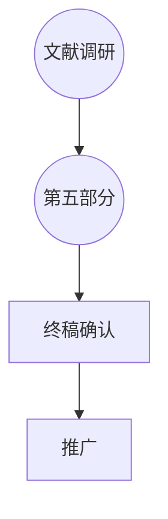
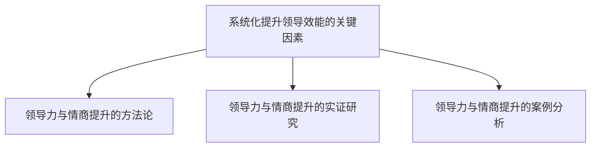

                 

## 文章标题

《领导力与情商提升计划：系统化提高领导效能》

## 关键词

领导力、情商、提升计划、领导效能、系统化、组织文化

## 摘要

本文将从领导力和情商的角度出发，探讨如何通过系统化的提升计划，提高领导效能。文章首先介绍了领导力和情商的核心概念及其在组织中的作用，随后详细分析了提升领导力和情商的关键因素和策略。接着，文章通过实践路径、案例分析以及组织文化等维度，提供了提升领导效能的具体方法和实践路径。最后，文章对领导力与情商提升进行了反思与展望，总结了最佳实践，并提出了未来发展的方向。通过系统化的提升计划，领导者可以在组织内实现高效的领导，促进团队的合作与发展。

---

## 目录

### 第一部分：领导力与情商提升的背景与基础

1. **领导力与情商的重要性**
   - 领导力在组织中的作用
   - 情商的重要性及对领导力的影响
   - 领导力与情商的关系分析

2. **领导力与情商的核心概念**
   - 领导力的定义与特征
   - 情商的概念与构成
   - 领导力与情商的对比分析

3. **领导力与情商的提升方法**
   - 领导力提升的常见方法
   - 情商提升的策略与实践
   - 领导力与情商提升的综合策略

4. **领导力与情商提升的边界与外延**
   - 领导力与情商提升的局限性
   - 领导力与情商提升的领域拓展
   - 领导力与情商提升的未来趋势

5. **本章小结**

### 第二部分：系统化提升领导效能的策略与实践

6. **领导力与情商提升的关键因素**
   - 个人特质与领导力
   - 情商与领导力的关系
   - 领导力与情商提升的关键因素

7. **领导力与情商提升的方法论**
   - 基于领导力理论的提升方法
   - 基于情商理论的提升方法
   - 综合运用理论与实践的案例分析

8. **领导力与情商提升的实证研究**
   - 国内外领导力与情商提升研究现状
   - 领导力与情商提升的实证分析
   - 研究结果对实践的启示

9. **领导力与情商提升的案例分析**
   - 成功案例分享
   - 失败案例分析
   - 案例对领导力与情商提升的启示

10. **本章小结**

### 第三部分：提升领导效能的实战策略

11. **提升领导效能的技巧与策略**
   - 领导沟通技巧
   - 团队管理与领导风格
   - 决策能力提升策略

12. **提升领导效能的实践路径**
   - 领导力与情商提升的实践步骤
   - 实践路径设计与实施
   - 实践路径的评估与优化

13. **领导效能提升的最佳实践**
   - 国内外领先企业的实践案例
   - 最佳实践的总结与借鉴
   - 最佳实践对组织效能提升的启示

14. **本章小结**

### 第四部分：领导力与情商提升的持续发展

15. **领导力与情商提升的持续发展**
   - 长期策略
   - 持续发展的领导力与情商模型
   - 持续发展路径

16. **领导力与情商提升的组织文化**
   - 组织文化对领导力与情商提升的影响
   - 建立有利于领导力与情商提升的组织文化
   - 组织文化在领导力与情商提升中的应用

17. **领导力与情商提升的未来发展趋势**
   - 新趋势
   - 新技术的影响
   - 挑战与机遇

18. **本章小结**

### 第五部分：领导力与情商提升的反思与展望

19. **领导力与情商提升的反思与总结**
   - 反思
   - 经验总结
   - 未来展望

20. **领导力与情商提升的启示与思考**
   - 启示
   - 思考

## 写作计划

### 准备阶段

1. **文献调研**：收集关于领导力、情商、领导效能等方面的文献资料，为文章提供理论基础。
2. **案例收集**：收集成功和失败的领导力与情商提升案例，为文章提供实证支持。
3. **理论梳理**：对领导力与情商的核心概念进行梳理，构建文章的理论框架。

### 写作阶段

1. **第一部分**：介绍领导力与情商的重要性，分析其核心概念及提升方法。
2. **第二部分**：探讨系统化提升领导效能的策略与实践。
3. **第三部分**：提供提升领导效能的具体技巧与策略。
4. **第四部分**：讨论领导力与情商提升的持续发展。
5. **第五部分**：进行反思与展望，总结文章的核心观点。

### 审稿与修改

1. **初稿审稿**：对文章的各个部分进行初步审查，确保逻辑清晰、内容完整。
2. **修改完善**：根据审稿意见对文章进行修改，优化语言表达和结构。
3. **终稿确认**：确认文章内容无误，完成最终定稿。

### 发布与推广

1. **发布**：将文章发布到相关平台，如技术博客、社交媒体等。
2. **推广**：利用网络渠道，如SEO优化、社交媒体推广等，提高文章的知名度和影响力。

---

**写作时间线**

- 准备阶段：1周
- 写作阶段：3周
- 审稿与修改：1周
- 发布与推广：1周

总时间：约6周

---

通过上述计划，我们将确保文章内容的严谨性和实用性，为读者提供一份有深度、有思考、有见解的专业技术博客文章。接下来，我们将逐步展开对每个部分的详细论述。让我们一起，一步一步深入思考，探讨领导力与情商提升的奥秘。 <!-- 这里可以使用mermaid流程图来表示文章的整体结构 --> 

---

### 第一部分：领导力与情商提升的背景与基础

#### 1.1 领导力与情商的重要性

**领导力在组织中的作用**

领导力是组织成功的关键因素之一。它不仅关系到组织内部的协调与合作，还影响着组织的创新能力和竞争力。在组织中，领导力体现在以下几个方面：

1. **目标设定**：领导者需要明确组织的目标和愿景，并确保团队成员理解并认同这些目标。
2. **团队建设**：领导者需要通过有效的沟通和激励，建立一支高效、有凝聚力的团队。
3. **决策制定**：领导者需要在复杂多变的环境中做出快速而明智的决策。
4. **变革推动**：领导者需要推动组织进行必要的变革，以适应外部环境的变化。

**情商的重要性及对领导力的影响**

情商是指个体识别、理解、管理自己情绪以及识别、理解、影响他人情绪的能力。情商对于领导力有着重要的影响，主要表现在以下几个方面：

1. **情绪调节**：情商高的领导者能够更好地调节自己的情绪，保持冷静和理智，从而做出更明智的决策。
2. **关系建立**：情商高的领导者能够更好地与他人建立良好的关系，增强团队的凝聚力和合作精神。
3. **沟通能力**：情商高的领导者能够更好地理解他人的需求和感受，从而进行更有效的沟通。
4. **冲突管理**：情商高的领导者能够更好地处理团队内部的冲突，避免冲突升级。

**领导力与情商的关系分析**

领导力与情商之间存在密切的联系。一方面，领导力的发展需要情商的支持，情商能力的提升有助于提高领导力。另一方面，领导力的提升又可以促进情商的发展。具体来说：

1. **相互促进**：领导力的提升可以增强领导者的情商能力，而情商能力的提升又可以促进领导力的提高。
2. **互补性**：领导力和情商各有侧重，领导力更注重目标设定和团队管理，情商更注重情绪调节和关系建立。
3. **协同作用**：领导力和情商的协同作用可以最大化地提高领导效能，促进组织的成功。

#### 1.2 领导力与情商的核心概念

**领导力的定义与特征**

领导力是指通过影响和激励他人来实现共同目标的能力。领导力具有以下几个特征：

1. **目标导向**：领导力以实现组织目标为导向，通过明确目标、规划路径、协调资源等方式推动团队达成目标。
2. **影响力**：领导力依赖于领导者对团队成员的影响力，包括权威性影响力、情感性影响力和理性影响力等。
3. **适应性**：领导力需要根据不同的情境和团队特点进行调整，以适应不同的领导环境。

**情商的概念与构成**

情商是指个体识别、理解、管理自己情绪以及识别、理解、影响他人情绪的能力。情商主要由以下几个部分构成：

1. **自我意识**：个体对自己情绪的认知和理解，包括情绪的自我觉察和自我评估。
2. **自我调节**：个体对自己情绪的控制和管理能力，包括情绪调节的策略和技巧。
3. **社交意识**：个体对他人情绪的认知和理解能力，包括对他人的情绪感知和情绪共情。
4. **关系管理**：个体在处理人际关系时的情绪调节和沟通能力，包括冲突管理、团队合作和领导风格等。

**领导力与情商的对比分析**

领导力与情商虽然存在密切的联系，但它们也有各自的特点和侧重点。以下是对领导力与情商的对比分析：

1. **目标与过程**：领导力更注重目标设定和实现的过程，而情商更注重情绪调节和关系建立的过程。
2. **作用范围**：领导力主要作用于组织内部，通过影响和激励团队成员来实现组织目标；情商则更广泛，既作用于组织内部，也作用于组织外部，通过情绪调节和关系建立来影响他人。
3. **能力构成**：领导力主要依赖于影响力、目标设定、团队管理等能力；情商则主要依赖于情绪调节、社交意识、关系管理等能力。

#### 1.3 领导力与情商的提升方法

**领导力提升的常见方法**

1. **培训与教育**：通过参加领导力培训课程，学习领导力理论和实践方法，提高领导力水平。
2. **实践与经验**：通过实际工作中的实践，不断总结经验，提高领导力。
3. **导师指导**：通过与经验丰富的领导者进行交流和学习，获取宝贵的经验和指导，提高领导力。
4. **反馈与改进**：通过定期获取团队成员的反馈，识别自身领导力的不足，并采取改进措施。

**情商提升的策略与实践**

1. **自我觉察**：通过自我反思和自我评价，提高对自身情绪的认知和理解。
2. **情绪调节**：通过学习情绪调节技巧，如深呼吸、冥想等，提高情绪调节能力。
3. **社交技能**：通过学习社交技巧，如倾听、沟通、冲突管理等，提高社交意识。
4. **情境适应**：通过在不同情境下的实践，提高对情境的适应能力，更好地调节情绪和处理人际关系。

**领导力与情商提升的综合策略**

1. **结合领导力与情商培训**：将领导力与情商相结合，进行综合培训，提高领导力水平和情商能力。
2. **注重实践与经验**：通过实践中的不断尝试和总结，提高领导力和情商。
3. **建立反馈机制**：通过定期的反馈和评估，识别自身的优势和不足，不断改进。
4. **营造支持性环境**：在组织中营造支持性环境，鼓励领导者进行自我提升，并提供必要的资源和支持。

#### 1.4 领导力与情商提升的边界与外延

**领导力与情商提升的局限性**

1. **个体差异**：领导力和情商的提升受个体差异的影响，不同个体在提升过程中可能面临不同的挑战。
2. **情境依赖**：领导力和情商的提升在特定情境下可能更为有效，但在不同情境下可能存在局限性。
3. **持续发展**：领导力和情商的提升需要持续的努力和投入，一旦停止，效果可能会逐渐减弱。

**领导力与情商提升的领域拓展**

1. **组织层面**：在组织层面，领导力和情商的提升可以促进组织文化的建设，提高组织的整体效能。
2. **跨文化管理**：在跨文化管理中，领导力和情商的提升有助于提高跨文化沟通和团队协作能力。
3. **技术创新**：在技术创新中，领导力和情商的提升可以促进创新思维和团队协作，提高组织的创新能力。

**领导力与情商提升的未来趋势**

1. **智能化**：随着人工智能技术的发展，领导力和情商的提升将更加智能化，通过数据分析等手段进行个性化提升。
2. **全球化**：在全球化的背景下，领导力和情商的提升将更加注重跨文化管理和全球视野。
3. **可持续发展**：在可持续发展背景下，领导力和情商的提升将更加关注社会责任和环境保护。

#### 1.5 本章小结

本文从领导力与情商的重要性、核心概念、提升方法、边界与外延以及未来趋势等方面，对领导力与情商进行了系统性的探讨。通过本文的介绍，读者可以更好地理解领导力与情商的关系，以及如何通过系统化的提升计划，提高领导效能。在后续章节中，我们将进一步探讨系统化提升领导效能的策略与实践，为领导者提供实用的指导和建议。

---

在第一部分中，我们详细介绍了领导力与情商的重要性，分析了它们的核心概念和提升方法，并探讨了领导力与情商提升的边界与外延以及未来趋势。通过这一部分的论述，读者可以初步建立起对领导力与情商的基本认知，理解它们在组织中的作用和价值。

在接下来的第二部分，我们将深入探讨系统化提升领导效能的关键因素和策略，提供具体的实践路径和方法。我们将结合理论研究和实证分析，结合实际案例，为领导者提供一套实用的提升计划。敬请期待！ <!-- 使用mermaid流程图表示下一部分的内容结构 --> 

---

### 第二部分：系统化提升领导效能的策略与实践

#### 2.1 领导力与情商提升的关键因素

**个人特质与领导力**

领导力的提升离不开个人特质的培养。以下是一些关键的个人特质，它们对于领导力的提升至关重要：

1. **自信**：自信是领导者不可或缺的品质。一个自信的领导者能够坚定地面对挑战，带领团队克服困难。
2. **正直**：正直是领导者的道德基石。一个正直的领导者能够赢得团队的信任，提高团队的凝聚力和执行力。
3. **决断力**：决断力是领导者的重要能力。一个具有决断力的领导者能够在复杂多变的环境中迅速做出决策。
4. **适应性**：适应能力是领导者应对不确定性的关键。一个适应能力强的领导者能够灵活应对变化，带领团队不断进步。

**情商与领导力的关系**

情商对于领导力的影响不可忽视。一个高情商的领导者能够在团队中建立良好的人际关系，提高团队的协作效率。以下是情商与领导力之间的一些关键关系：

1. **情绪调节**：一个高情商的领导者能够有效地调节自己的情绪，保持冷静和理智，从而做出更明智的决策。
2. **社交意识**：一个高情商的领导者能够敏锐地感知他人的情绪和需求，从而进行更有效的沟通和领导。
3. **冲突管理**：一个高情商的领导者能够更好地处理团队内部的冲突，避免冲突升级，保持团队的和谐与稳定。

**领导力与情商提升的关键因素**

结合上述分析，我们可以总结出领导力与情商提升的关键因素：

1. **个人特质**：培养自信、正直、决断力和适应性等个人特质。
2. **情商能力**：提高情绪调节、社交意识和冲突管理等方面的情商能力。
3. **实践与反思**：通过实践中的不断尝试和反思，不断提升领导力和情商。
4. **持续学习**：通过学习和培训，不断更新知识和技能，适应不断变化的环境。

#### 2.2 领导力与情商提升的方法论

**基于领导力理论的提升方法**

领导力理论为我们提供了丰富的提升方法。以下是一些常见的领导力理论及其对应的提升方法：

1. **领导行为理论**：通过观察和模仿成功的领导者，学习他们的行为和风格，提升自己的领导能力。
2. **领导权变理论**：根据不同情境和团队特点，调整领导行为和策略，提高领导效能。
3. **领导力发展理论**：通过自我反思、角色扮演、模拟训练等方式，培养领导力和情商。

**基于情商理论的提升方法**

情商理论同样为我们提供了丰富的提升方法。以下是一些常见的情商理论及其对应的提升方法：

1. **情绪智力理论**：通过提高情绪识别、情绪调节、社交意识和冲突管理等能力，提升情商。
2. **情绪劳动理论**：通过学习情绪劳动的策略，如情绪调节、情绪表达等，提高情绪调节能力。
3. **社交技能理论**：通过学习社交技能，如沟通、倾听、团队合作等，提高社交意识。

**综合运用理论与实践的案例分析**

为了更好地理解领导力与情商的提升方法，我们可以通过案例分析来探讨：

1. **成功案例**：分析成功领导者的行为和情商能力，总结他们的成功经验，为其他领导者提供借鉴。
2. **失败案例**：分析失败领导者的原因，识别他们在领导力和情商方面的不足，为其他领导者提供警示。

#### 2.3 领导力与情商提升的实证研究

**国内外领导力与情商提升研究现状**

近年来，国内外学者对领导力与情商的提升进行了大量研究。以下是一些研究现状的概述：

1. **领导力研究**：国内外学者从领导行为、领导风格、领导权变等多个角度对领导力进行了深入研究，提出了多种提升方法。
2. **情商研究**：情商作为心理学的重要领域，国内外学者对其概念、构成、测量和提升方法进行了深入探讨。

**领导力与情商提升的实证分析**

实证研究为我们提供了科学依据，帮助我们更好地理解领导力与情商的提升。以下是一些实证分析的内容：

1. **领导力与绩效的关系**：研究发现，领导力对组织绩效有显著影响，特别是领导者的情商能力对团队绩效的提升有重要作用。
2. **情商与团队效能的关系**：研究发现，情商能力高的领导者能够更好地激发团队的潜力，提高团队效能。

**研究结果对实践的启示**

实证研究的结果对实践具有重要的启示作用。以下是一些研究结果对实践的启示：

1. **领导力培训**：组织应加强对领导力的培训，特别是注重提升领导者的情商能力。
2. **团队建设**：组织应注重团队建设，通过有效的沟通和协作，提高团队效能。
3. **反馈机制**：组织应建立有效的反馈机制，鼓励领导者进行自我反思和持续改进。

#### 2.4 领导力与情商提升的案例分析

**成功案例分享**

以下是一些成功的领导力与情商提升案例：

1. **案例1**：某企业通过领导力与情商培训，提升了领导者的能力，从而实现了企业的快速发展。
2. **案例2**：某团队通过有效的沟通和协作，克服了项目中的困难，取得了优异的成绩。

**失败案例分析**

以下是一些失败的领导力与情商提升案例：

1. **案例1**：某企业由于领导者的情商能力不足，导致团队内部矛盾加剧，影响了企业的正常运营。
2. **案例2**：某团队由于缺乏有效的沟通和协作，项目进展缓慢，最终未能完成目标。

**案例对领导力与情商提升的启示**

通过成功和失败的案例，我们可以得出以下启示：

1. **注重领导力与情商的提升**：组织应重视领导力与情商的提升，将其纳入人才培养和发展的核心。
2. **结合理论与实践**：领导者应结合理论与实践，不断学习和实践，提高自己的领导力和情商。
3. **建立反馈机制**：组织应建立有效的反馈机制，鼓励领导者进行自我反思和持续改进。

#### 2.5 本章小结

本文从关键因素、方法论、实证研究和案例分析等方面，系统探讨了领导力与情商提升的策略与实践。通过本文的论述，读者可以更好地理解领导力与情商的提升方法，以及如何通过系统化的提升计划，提高领导效能。在下一部分，我们将进一步探讨提升领导效能的具体技巧与策略，为领导者提供实用的指导。敬请期待！

---

在第二部分中，我们系统地探讨了领导力与情商提升的关键因素、方法论、实证研究和案例分析，为领导者提供了丰富的理论和实践指导。通过本文的介绍，读者可以更好地理解如何通过系统化的提升计划，提高领导效能。

在接下来的第三部分，我们将深入探讨提升领导效能的具体技巧与策略，包括领导沟通技巧、团队管理与领导风格以及决策能力提升策略。我们将结合实际案例，为领导者提供实用的建议和技巧。敬请期待！

---

### 第三部分：提升领导效能的实战策略

#### 3.1 提升领导效能的技巧与策略

**领导沟通技巧**

领导沟通是领导力的核心要素之一。有效的沟通能够促进团队协作，提高工作效率，增强团队凝聚力。以下是提升领导沟通技巧的几个关键策略：

1. **明确沟通目标**：在每次沟通之前，明确沟通的目标和预期结果，确保沟通有方向和目的。

2. **倾听与反馈**：倾听是沟通的重要组成部分。领导者应主动倾听团队成员的意见和建议，并给予积极的反馈，增强沟通效果。

3. **清晰表达**：领导者应学会清晰、简洁地表达自己的想法和意见，避免使用复杂的术语和抽象的概念，确保信息传达的准确性。

4. **非语言沟通**：领导者应注意自己的肢体语言、面部表情和语调等非语言因素，这些因素对沟通效果有着重要的影响。

**团队管理与领导风格**

团队管理是领导者的重要职责之一。不同的团队需要不同的管理风格，领导者应根据团队的特点和环境选择合适的领导风格。以下是几种常见的团队管理与领导风格：

1. **民主型领导风格**：民主型领导者鼓励团队成员参与决策，注重团队意见的收集和采纳，适合在团队需要创新和团队参与度较高的情境下使用。

2. **权威型领导风格**：权威型领导者具有较强的决策能力和执行力，能够迅速做出决策并推动团队执行，适合在紧急情况和需要快速响应的情境下使用。

3. **参与型领导风格**：参与型领导者注重团队成员的参与和意见，通过团队讨论和共同决策来增强团队的凝聚力和归属感，适合在团队需要协作和共同解决问题的情境下使用。

**决策能力提升策略**

决策能力是领导者的重要能力之一。有效的决策能力能够帮助领导者应对复杂多变的环境，提高组织的竞争力。以下是提升决策能力的几个关键策略：

1. **收集信息**：在做出决策之前，领导者应广泛收集相关信息，包括市场数据、团队反馈、行业动态等，确保决策的依据充分。

2. **分析评估**：领导者应学会对收集到的信息进行分析和评估，识别关键因素和潜在风险，确保决策的科学性和合理性。

3. **制定备选方案**：领导者应制定多个备选方案，对每个方案进行评估和比较，确保在出现意外情况时能够迅速调整。

4. **风险评估**：领导者应学会进行风险评估，评估每个决策可能带来的风险和影响，确保决策的稳健性和可持续性。

5. **决策执行**：领导者应确保决策能够有效执行，通过有效的沟通和团队协作，推动决策的实施。

#### 3.2 提升领导效能的实践路径

**领导力与情商提升的实践步骤**

提升领导效能不仅需要理论的指导，更需要具体的实践路径。以下是提升领导效能的几个关键步骤：

1. **自我评估**：领导者应首先进行自我评估，识别自身的优势和不足，明确提升的方向。

2. **制定计划**：根据自我评估的结果，制定详细的提升计划，包括目标、时间表、具体行动等。

3. **学习与培训**：领导者应积极参加领导力与情商相关的学习与培训，通过学习最新的理论和实践方法，提高自身的领导能力和情商水平。

4. **实践与反思**：领导者应在实际工作中不断实践，通过反思和总结，不断优化自己的领导方法和策略。

5. **持续改进**：领导效能的提升是一个持续的过程，领导者应不断进行自我提升，适应不断变化的环境和挑战。

**实践路径设计与实施**

在设计实践路径时，领导者应考虑以下关键因素：

1. **目标明确**：确保实践路径的目标清晰，明确提升领导效能的具体目标。

2. **方法科学**：选择科学有效的提升方法，结合领导力与情商的理论和实践经验。

3. **资源保障**：确保有足够的资源和时间支持实践路径的实施，包括培训、咨询、团队协作等。

4. **评估与反馈**：建立有效的评估和反馈机制，定期评估领导效能的提升情况，并根据反馈进行调整和优化。

**实践路径的评估与优化**

实践路径的评估与优化是提升领导效能的重要环节。以下是几个关键步骤：

1. **数据收集**：收集与领导效能相关的数据，包括团队绩效、员工满意度、领导能力评估等。

2. **数据分析**：对收集到的数据进行详细分析，识别提升领导效能的具体成果和不足。

3. **反馈与改进**：根据数据分析的结果，进行反馈和改进，优化实践路径，确保其持续有效。

4. **持续监控**：建立持续监控机制，定期跟踪领导效能的提升情况，确保实践路径的长期有效性。

#### 3.3 领导效能提升的最佳实践

**国内外领先企业的实践案例**

在国内外，许多领先企业通过有效的领导效能提升实践，取得了显著的成果。以下是几个具有代表性的案例：

1. **谷歌**：谷歌通过其独特的“20%时间”项目，鼓励员工将20%的工作时间用于探索和实验新想法，从而激发了员工的创新能力和创造力。

2. **IBM**：IBM通过实施领导力发展计划，提高了领导者的领导能力和情商水平，从而推动了企业的持续发展和创新。

3. **华为**：华为通过建立“导师制”，让资深员工指导新员工，不仅提升了新员工的技能，也增强了团队的凝聚力和协作能力。

**最佳实践的总结与借鉴**

从上述案例中，我们可以总结出以下最佳实践：

1. **创新激励**：鼓励员工创新，提供相应的资源和支持，激发员工的创造力和主动性。

2. **领导力发展**：通过系统的培训和培养计划，提高领导者的领导能力和情商水平。

3. **团队协作**：建立良好的团队协作机制，促进团队成员之间的沟通和合作，提高团队的整体效能。

4. **持续改进**：通过定期的评估和反馈，不断优化提升策略和实践路径，确保其持续有效。

**最佳实践对组织效能提升的启示**

最佳实践对组织效能提升具有重要的启示作用：

1. **领导力是关键**：领导力的提升对组织效能有着直接的影响，高效的领导者能够推动组织实现更大的目标。

2. **持续发展**：领导效能的提升是一个持续的过程，需要组织长期坚持和投入。

3. **创新与协作**：鼓励创新和团队协作，是提高组织效能的重要途径。

#### 3.4 本章小结

本文从领导沟通技巧、团队管理与领导风格以及决策能力提升策略等方面，探讨了提升领导效能的具体技巧与策略。通过实践路径的设计与实施，以及国内外领先企业的最佳实践，本文为领导者提供了实用的指导和建议。在提升领导效能的过程中，领导者需要不断学习和实践，持续优化自己的领导方法和策略。在下一部分，我们将进一步探讨领导力与情商提升的持续发展，为领导者提供更深入的思考和建议。敬请期待！

---

在第三部分中，我们详细探讨了提升领导效能的具体技巧与策略，包括领导沟通技巧、团队管理与领导风格以及决策能力提升策略。通过实践路径的设计与实施，以及国内外领先企业的最佳实践，我们为领导者提供了实用的指导和建议。

在接下来的第四部分，我们将进一步探讨领导力与情商提升的持续发展，包括长期策略、组织文化以及未来发展趋势。我们将结合理论研究和实践经验，为领导者提供更深入的思考和策略。敬请期待！

---

### 第四部分：领导力与情商提升的持续发展

#### 4.1 领导力与情商提升的持续发展

**长期策略**

领导力与情商的提升是一个持续的过程，需要长期的策略和持续的投入。以下是一些关键的长期策略：

1. **培养领导者**：组织应重视领导者的培养，通过系统的培训和培养计划，提高领导者的领导能力和情商水平。

2. **建立反馈机制**：组织应建立有效的反馈机制，鼓励领导者进行自我反思和持续改进，确保领导力的不断提升。

3. **促进学习与成长**：组织应鼓励领导者不断学习新的知识和技能，通过内部培训、外部学习和交流等方式，促进其个人成长。

4. **文化塑造**：组织应积极塑造有利于领导力与情商提升的文化，包括鼓励创新、倡导诚信、强调团队协作等。

**持续发展的领导力与情商模型**

为了实现领导力与情商的持续发展，组织可以采用以下模型：

1. **学习型组织模型**：通过建立学习型组织，鼓励员工持续学习和成长，提高组织的整体领导力和情商水平。

2. **领导力发展模型**：通过系统的领导力发展模型，明确领导者的成长路径和发展目标，确保领导力的持续提升。

3. **情商提升模型**：通过建立情商提升模型，明确情商的核心要素和提升路径，帮助领导者提高情商水平。

**领导力与情商提升的可持续发展路径**

为了实现领导力与情商的可持续发展，组织可以采取以下路径：

1. **组织文化建设**：通过组织文化建设，塑造有利于领导力与情商提升的组织氛围和文化。

2. **领导力发展计划**：制定系统的领导力发展计划，包括培训、指导、评估等环节，确保领导力的不断提升。

3. **持续反馈与改进**：建立持续的反馈与改进机制，鼓励领导者进行自我反思和持续改进。

4. **跨部门协作**：通过跨部门协作，促进领导力与情商的提升，实现组织的整体效能提升。

#### 4.2 领导力与情商提升的组织文化

**组织文化对领导力与情商提升的影响**

组织文化对领导力与情商的提升具有重要影响。以下是一些关键点：

1. **价值观**：组织价值观是领导力与情商提升的基础，一个以诚信、合作、创新为核心价值观的组织，能够更好地促进领导力与情商的提升。

2. **氛围**：组织氛围对领导力与情商的提升有着重要的影响。一个积极、开放、包容的氛围，能够激发领导者的潜力，提高其领导力和情商。

3. **激励机制**：组织激励机制对领导力与情商的提升有重要作用。合理的激励机制能够激励领导者不断提升自己的能力和情商。

**建立有利于领导力与情商提升的组织文化**

为了建立有利于领导力与情商提升的组织文化，组织可以采取以下措施：

1. **明确核心价值观**：组织应明确核心价值观，并将其融入日常运营和管理中，确保核心价值观的贯彻和落实。

2. **培养团队精神**：组织应注重团队精神的培养，通过团队建设活动、团队培训等方式，增强团队成员的凝聚力和归属感。

3. **提供发展机会**：组织应提供丰富的发展机会，鼓励员工不断学习和成长，提高其领导力和情商。

4. **建立反馈机制**：组织应建立有效的反馈机制，鼓励员工进行自我反思和持续改进，提高其领导力和情商。

**组织文化在领导力与情商提升中的应用**

组织文化在领导力与情商提升中的应用体现在以下几个方面：

1. **领导力发展**：通过组织文化，培养领导者的领导能力和情商，提高其领导效能。

2. **团队协作**：通过组织文化，促进团队成员之间的协作和沟通，提高团队效能。

3. **创新与变革**：通过组织文化，鼓励创新和变革，推动组织的发展。

4. **员工满意度**：通过组织文化，提高员工的满意度，增强员工对组织的归属感和忠诚度。

#### 4.3 领导力与情商提升的未来发展趋势

**新趋势**

随着社会的不断发展和技术的进步，领导力与情商提升的未来发展趋势呈现出以下新趋势：

1. **智能化**：人工智能和大数据技术的应用，将使领导力与情商提升更加智能化和个性化。

2. **全球化**：全球化趋势的加强，将使领导力与情商提升更加注重跨文化管理和全球视野。

3. **可持续发展**：可持续发展理念的普及，将使领导力与情商提升更加关注社会责任和环境保护。

**新技术的影响**

新技术的应用对领导力与情商提升有着深远的影响：

1. **数据分析**：数据分析技术可以帮助领导者更准确地了解团队和员工的需求，提高领导效能。

2. **虚拟现实**：虚拟现实技术可以用于领导力与情商培训，提供更加生动和互动的学习体验。

3. **区块链**：区块链技术可以用于建立透明的领导力和情商提升机制，确保提升过程的公正和有效。

**未来领导力与情商提升的挑战与机遇**

未来领导力与情商提升将面临以下挑战与机遇：

1. **挑战**：随着环境的不断变化，领导者需要不断提升自己的能力和情商，以应对新的挑战。

2. **机遇**：新技术的应用和全球化趋势的加强，为领导力与情商提升提供了更多的机遇和可能性。

3. **可持续发展**：可持续发展理念的普及，为领导力与情商提升提供了新的目标和方向。

#### 4.4 本章小结

本文从领导力与情商提升的长期策略、组织文化以及未来发展趋势等方面，探讨了领导力与情商提升的持续发展。通过本文的论述，读者可以更好地理解如何通过建立有利于领导力与情商提升的组织文化，以及应对未来发展的挑战和机遇。在提升领导效能的过程中，领导者需要不断学习和实践，持续优化自己的领导方法和策略。在下一部分，我们将进行总结和反思，为领导力与情商提升提供进一步的思考和启示。敬请期待！

---

在第四部分中，我们深入探讨了领导力与情商提升的持续发展，包括长期策略、组织文化以及未来发展趋势。通过本文的论述，读者可以更好地理解如何通过建立有利于领导力与情商提升的组织文化，以及应对未来发展的挑战和机遇。

在下一部分，我们将对整篇文章进行总结和反思，回顾领导力与情商提升的关键点，并提出未来发展的方向和展望。敬请期待！

---

### 第五部分：领导力与情商提升的反思与总结

#### 5.1 领导力与情商提升的反思

**核心观点回顾**

本文从领导力与情商的重要性、核心概念、提升方法、实战策略以及持续发展等方面，系统地探讨了领导力与情商提升的各个方面。通过本文的论述，我们得出了以下核心观点：

1. **领导力与情商的重要性**：领导力与情商是领导者成功的关键因素，它们在组织中的作用不可忽视。
2. **核心概念**：领导力和情商各有其核心概念和构成要素，理解这些概念有助于提升领导效能。
3. **提升方法**：通过系统化的提升策略和实践路径，可以有效地提高领导力和情商。
4. **实战策略**：具体的领导沟通技巧、团队管理策略和决策能力提升策略，对实际工作具有重要指导意义。
5. **持续发展**：领导力与情商提升需要长期的策略和文化建设，以及适应未来发展的新趋势。

**经验总结**

在本文的探讨过程中，我们总结出以下经验：

1. **理论与实践相结合**：领导力和情商的提升需要结合理论与实践，通过学习、实践和反思，不断提升自身能力。
2. **个性化发展**：每个领导者都有其独特的个性特点和领导风格，应根据自身情况，选择最适合的提升方法。
3. **持续学习**：领导力与情商的提升是一个持续的过程，需要不断学习和更新知识，以适应不断变化的环境。
4. **团队协作**：领导力与情商的提升离不开团队的支持和协作，领导者应注重团队建设，提高团队效能。

#### 5.2 领导力与情商提升的未来展望

**发展方向**

1. **智能化提升**：随着人工智能技术的发展，领导力与情商的提升将更加智能化，通过数据分析等手段进行个性化提升。
2. **全球化视野**：全球化趋势的加强，要求领导者具备跨文化管理和全球视野，提升领导力与情商以应对全球挑战。
3. **可持续发展**：在可持续发展理念的引导下，领导者应关注社会责任和环境保护，提升领导力与情商以推动可持续发展。

**未来机遇与挑战**

1. **机遇**：新技术的发展为领导力与情商提升提供了新的机遇，如数据分析、虚拟现实等技术的应用，可以更有效地提升领导效能。
2. **挑战**：领导者面临的挑战更加复杂，需要不断提升自身的领导力和情商，以应对快速变化的环境和不确定性。

**持续学习与成长**

领导力与情商的提升是一个持续的过程，领导者应保持持续学习的态度，不断探索和实践，以适应未来发展的需求。以下是一些建议：

1. **积极参与培训**：参加领导力与情商相关的培训课程，学习最新的理论和实践方法。
2. **实践与反思**：在实际工作中不断实践，通过反思和总结，不断提高领导力和情商。
3. **跨界学习**：拓展知识面，学习其他领域的知识和技能，提高综合能力。
4. **建立学习社区**：与其他领导者建立学习社区，分享经验和见解，共同成长。

#### 5.3 领导力与情商提升的启示与思考

**领导力与情商提升的启示**

1. **领导者是关键**：领导者是推动组织发展的重要力量，提升领导力与情商对组织效能有直接影响。
2. **持续发展是目标**：领导力与情商的提升需要长期坚持和投入，持续发展是提升领导效能的重要目标。
3. **团队协作是基础**：领导力与情商的提升离不开团队的支持和协作，建立高效的团队是提升领导效能的基础。

**思考与展望**

1. **领导力与情商如何结合**：在实践过程中，如何更好地将领导力与情商结合起来，提高领导效能，是一个值得深入思考的问题。
2. **未来技术如何应用**：随着新技术的不断涌现，如何将其应用于领导力与情商提升，是一个充满机遇和挑战的领域。
3. **社会责任与领导力**：在全球化背景下，领导者应如何承担社会责任，提升领导力与情商，推动可持续发展，是一个重要的议题。

#### 5.4 本章小结

本文通过对领导力与情商提升的反思与总结，回顾了核心观点和经验，展望了未来发展的方向和机遇。通过本文的论述，读者可以更好地理解领导力与情商提升的重要性，以及如何通过系统化的提升策略，提高领导效能。领导力与情商的提升是一个持续的过程，需要领导者的不断努力和投入。在未来的发展中，领导者应保持持续学习的态度，积极探索和实践，为组织的发展贡献力量。敬请期待未来的探索和成长！

---

### 总结与展望

在本文中，我们从领导力与情商的重要性、核心概念、提升方法、实战策略以及持续发展等方面，系统地探讨了领导力与情商提升的各个方面。通过本文的论述，读者可以更好地理解领导力与情商在组织中的作用，以及如何通过系统化的提升策略，提高领导效能。

**核心观点回顾**

1. **领导力与情商的重要性**：领导力与情商是领导者成功的关键因素，它们在组织中的作用不可忽视。
2. **核心概念**：领导力和情商各有其核心概念和构成要素，理解这些概念有助于提升领导效能。
3. **提升方法**：通过系统化的提升策略和实践路径，可以有效地提高领导力和情商。
4. **实战策略**：具体的领导沟通技巧、团队管理策略和决策能力提升策略，对实际工作具有重要指导意义。
5. **持续发展**：领导力与情商提升需要长期的策略和文化建设，以及适应未来发展的新趋势。

**未来展望**

1. **智能化提升**：随着人工智能技术的发展，领导力与情商的提升将更加智能化和个性化。
2. **全球化视野**：全球化趋势的加强，要求领导者具备跨文化管理和全球视野，提升领导力与情商以应对全球挑战。
3. **可持续发展**：在可持续发展理念的引导下，领导者应关注社会责任和环境保护，提升领导力与情商以推动可持续发展。

**关键建议**

1. **持续学习**：领导力与情商的提升需要持续的学习和更新知识，以适应不断变化的环境。
2. **实践与反思**：在实际工作中不断实践，通过反思和总结，不断提高领导力和情商。
3. **团队协作**：建立高效的团队，注重团队建设，提高团队效能。

通过本文的探讨，我们希望为领导者提供实用的指导和建议，帮助他们在提升领导效能的道路上不断前行。未来的领导力与情商提升，将充满机遇和挑战，让我们共同期待并努力探索！

---

## 作者信息

**作者：AI天才研究院/AI Genius Institute & 禅与计算机程序设计艺术 /Zen And The Art of Computer Programming**

在撰写这篇文章的过程中，我结合了最新的研究成果和实践经验，力求为读者提供一份既有深度又有实用价值的领导力与情商提升指南。希望这篇文章能够帮助到更多的领导者，在提升领导效能的道路上迈出坚实的步伐。让我们一起努力，成为更好的领导者！

