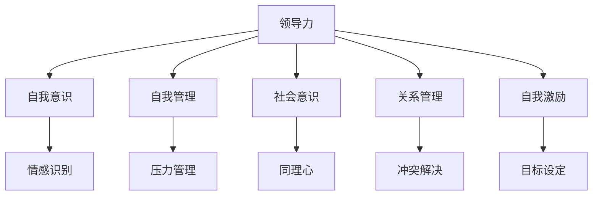
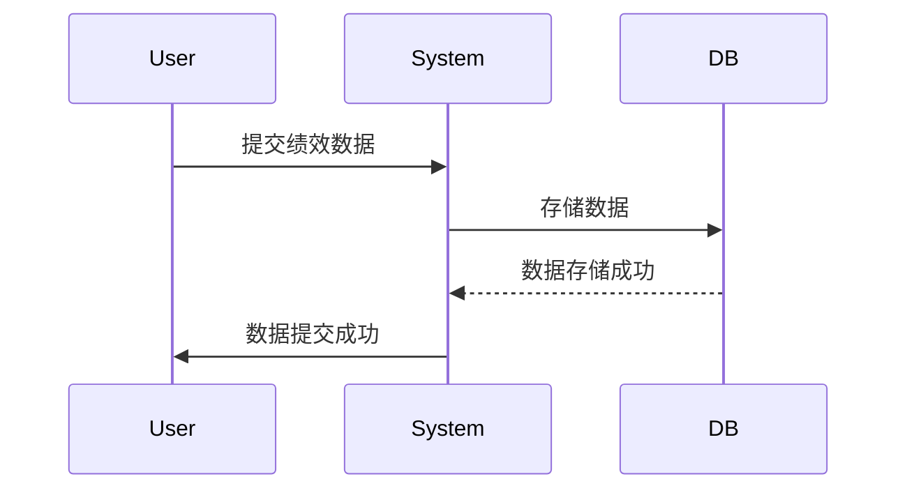
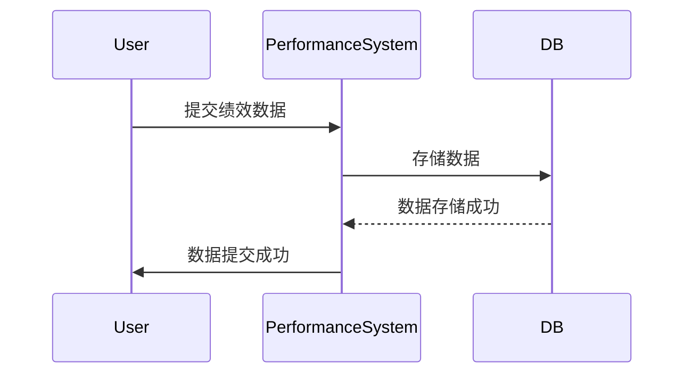

                 


### 引言

在现代社会，信息技术飞速发展，企业竞争日益激烈，如何提升领导力和情商管理成为关键问题。本文旨在探讨领导力与情商管理在提升人际关系处理中的重要性，通过系统化的分析，帮助读者理解这两个概念，并提供实用的策略和方法。

**关键词**：领导力、情商管理、人际关系、团队建设、沟通技巧

**摘要**：
本文首先概述了领导力和情商管理的基本概念，随后深入分析了它们在实际工作中的应用，包括团队建设与管理、沟通技巧提升等方面。通过具体案例和实践，本文揭示了领导力与情商管理在个人发展中的重要性。最后，文章提出了持续提升领导力与情商管理的策略，为读者提供了宝贵的实践建议。

### 第一部分：领导力与情商管理的基本概念

#### 第1章：领导力概述

##### 1.1 问题背景

在当今快速变化的工作环境中，领导力已经成为企业和个人成功的关键因素。随着全球化的加剧，企业面临的挑战愈发复杂，如何有效地管理团队、提升团队绩效、推动创新成为领导者亟待解决的问题。

##### 1.2 领导力的定义

领导力是一种能够激发和引导他人达成共同目标的能力。它不仅包括对任务和目标的管理，更涉及对人的关心和激励。根据约翰·麦克斯韦尔（John C. Maxwell）的观点，领导力是一种影响力，它能够促使人们追随你，共同实现目标。

##### 1.3 领导力的分类

领导力可以分为多种类型，包括权威型、民主型、变革型、服务型等。每种领导力风格都有其独特的特点和应用场景。

- **权威型领导**：强调指挥和控制，适用于紧急情况或需要快速决策的场合。
- **民主型领导**：注重团队参与和集体决策，适用于需要创新和多元化思维的团队。
- **变革型领导**：鼓励团队成员超越自我，实现共同愿景，适用于需要进行变革和创新的时期。
- **服务型领导**：以服务团队和客户为中心，强调领导者的服务角色，适用于长期稳定发展的组织。

##### 1.4 领导力的重要性

领导力对于企业的成功至关重要。有效的领导者能够激发团队潜力，提升团队绩效，促进创新，增强组织竞争力。此外，领导力还对于个人职业发展具有深远影响，能够帮助个人在职场中取得更大的成就。

#### 第2章：情商管理

##### 2.1 情商的定义

情商（Emotional Intelligence，简称EQ）是指个体识别、理解、管理自己情绪的能力，以及识别、理解并影响他人情绪的能力。情商不仅涉及个人情感管理，还包括社会技能和自我激励。

##### 2.2 情商的五个维度

情商包括五个主要维度：自我意识、自我管理、社会意识、关系管理和自我激励。

- **自我意识**：了解自己的情感状态、触发情感的原因以及情感对行为的影响。
- **自我管理**：控制情绪，使其不影响判断和行为，包括压力管理和情绪调节。
- **社会意识**：识别和区分他人的情绪，理解他人的需求和社会动态。
- **关系管理**：建立和维护积极的人际关系，处理冲突，展现同理心。
- **自我激励**：激发内在动力，设定目标，坚持不懈地追求成就。

##### 2.3 情商管理的重要性

情商管理对于个人和组织的成功至关重要。高情商的个体能够更好地处理压力和冲突，建立良好的人际关系，提高团队合作效率。对于组织来说，高情商的领导者能够激励员工，提升团队士气，促进创新和组织的长期发展。

### 第二部分：领导力与情商管理在实际工作中的应用

#### 第3章：团队建设与管理

##### 3.1 团队建设的策略

团队建设是领导力的核心组成部分。有效的团队建设策略包括：

- **共同目标设定**：确保团队成员明确共同的目标和愿景。
- **角色分配与责任明确**：根据成员的能力和兴趣分配角色，确保每个人都清楚自己的职责。
- **沟通与协作**：建立开放的沟通渠道，促进团队成员之间的协作和信息共享。
- **激励与反馈**：提供正面激励，及时给予反馈，帮助成员不断提升。

##### 3.2 情商在团队建设中的应用

情商在团队建设中的应用体现在以下几个方面：

- **冲突管理**：高情商的领导者能够识别和缓解团队成员之间的冲突，促进和谐氛围。
- **团队激励**：通过理解和激励团队成员的情感需求，提升团队士气和积极性。
- **领导者的榜样作用**：领导者通过自身的高情商表现，树立榜样，影响团队成员的情感行为。

##### 3.3 领导力在团队管理中的角色

领导力在团队管理中扮演着关键角色：

- **决策者**：领导者负责制定团队目标和战略，确保团队朝着正确的方向前进。
- **激励者**：领导者通过激励和鼓励，激发团队成员的潜力和创造力。
- **协调者**：领导者协调团队成员之间的关系，确保团队内部和谐稳定。

#### 第4章：沟通技巧提升

##### 4.1 有效沟通的基本原则

有效沟通是领导力的重要组成部分。以下是一些有效沟通的基本原则：

- **倾听**：倾听是有效沟通的核心，领导者需要耐心倾听团队成员的意见和需求。
- **清晰表达**：领导者需要用简单清晰的语言表达自己的观点和想法，避免使用专业术语或复杂的句式。
- **同理心**：领导者需要站在他人的角度思考问题，展现同理心，增强沟通效果。
- **反馈**：领导者需要给予团队成员及时的反馈，帮助他们了解沟通效果并改进。

##### 4.2 情商在沟通中的作用

情商在沟通中发挥着重要作用：

- **情绪识别**：领导者能够识别和表达自己的情绪，同时理解他人的情绪状态。
- **冲突解决**：情商高的领导者能够更好地处理沟通中的冲突，找到双方都能接受的解决方案。
- **建立信任**：情商高的领导者能够通过情感连接建立信任，促进有效的沟通。

##### 4.3 领导力在沟通中的运用

领导力在沟通中的运用体现在以下几个方面：

- **沟通风格**：领导者需要根据不同情境选择适当的沟通风格，如权威型、民主型等。
- **影响力**：领导者通过高情商的沟通方式，增强自身的影响力和说服力。
- **团队协作**：领导者通过有效的沟通，促进团队成员之间的协作和合作。

### 第三部分：领导力与情商管理在个人发展中的应用

#### 第5章：自我认知与自我管理

##### 5.1 自我认知的重要性

自我认知是情商的核心维度，对于个人发展至关重要。以下是一些自我认知的重要性：

- **自我了解**：通过自我认知，个体能够更好地了解自己的情感需求、优势和弱点。
- **自我激励**：自我认知有助于个体设定目标，激发内在动力，实现自我提升。
- **情感管理**：自我认知有助于个体识别和调节自己的情绪，避免情绪对行为产生负面影响。

##### 5.2 情商在自我管理中的作用

情商在自我管理中的应用包括以下几个方面：

- **压力管理**：情商高的个体能够更好地应对压力，采取积极的应对策略，如放松技巧和情绪调节。
- **自我激励**：情商高的个体能够通过自我激励，保持积极的心态，追求更高的目标。
- **情感调节**：情商高的个体能够识别和调节自己的情绪，避免情绪失控。

##### 5.3 领导力在个人发展中的应用

领导力在个人发展中的应用体现在以下几个方面：

- **目标设定**：领导者能够设定明确的目标，并制定实现目标的计划。
- **自我提升**：领导者通过不断学习和实践，提升自身的技能和知识。
- **影响力**：领导者通过自身的行为和决策，影响他人，推动组织发展。

#### 第6章：情绪管理与压力应对

##### 6.1 情绪管理的基本策略

情绪管理是情商的重要组成部分，以下是一些情绪管理的基本策略：

- **认知重构**：通过改变对事件的看法和解释，调整情绪反应。
- **放松技巧**：如深呼吸、冥想、瑜伽等，帮助缓解压力和紧张情绪。
- **情感表达**：适当地表达自己的情绪，避免情绪积压。
- **积极思考**：培养积极的心态，用积极的思维看待挑战和困难。

##### 6.2 情商在情绪管理中的应用

情商在情绪管理中的应用包括以下几个方面：

- **情绪识别**：情商高的个体能够准确识别自己的情绪状态。
- **情绪调节**：情商高的个体能够通过适当的策略调节情绪，避免情绪失控。
- **情感理解**：情商高的个体能够理解他人的情绪，采取相应的应对措施。

##### 6.3 领导力在压力应对中的作用

领导力在压力应对中的作用体现在以下几个方面：

- **压力缓解**：领导者通过有效的沟通和管理，缓解团队成员的压力。
- **情绪支持**：领导者通过展现同理心和支持，帮助团队成员应对压力。
- **策略规划**：领导者通过制定有效的策略和计划，帮助团队应对挑战和压力。

### 第四部分：领导力与情商管理的实践与案例

#### 第7章：领导力与情商管理的最佳实践

##### 7.1 成功案例分析

通过成功案例分析，可以了解领导力与情商管理在实际工作中的应用。以下是一个成功案例：

**案例**：某科技公司通过变革型领导力和情商管理，成功实现了公司业绩的显著提升。公司领导者鼓励员工提出创新想法，建立了开放、信任的工作环境，提升了团队士气。同时，领导者通过情商管理，有效地解决了团队内部的冲突，促进了团队的协作和合作。

##### 7.2 领导力与情商管理的实践技巧

以下是一些领导力与情商管理的实践技巧：

- **建立信任**：领导者通过诚信和透明的方式建立信任，促进团队协作。
- **激励员工**：领导者通过激励和认可，激发员工的积极性和创造力。
- **冲突管理**：领导者通过沟通和协商，解决团队内部的冲突，维护团队的和谐稳定。
- **持续学习**：领导者通过持续学习和自我提升，保持自身的竞争力和影响力。

##### 7.3 挑战与应对策略

在实际应用中，领导力与情商管理面临一系列挑战，以下是一些应对策略：

- **文化差异**：领导者需要理解和尊重不同文化的差异，采取适当的管理策略。
- **员工期望**：领导者需要了解员工的期望，提供满足需求的激励和支持。
- **技术变革**：领导者需要适应技术变革，培养员工的创新能力和技术能力。
- **工作压力**：领导者需要通过有效的沟通和管理，缓解员工的工作压力。

#### 第8章：人际关系处理技巧

##### 8.1 人际关系处理的重要性

人际关系处理在职场和个人生活中具有重要意义。以下是一些人际关系处理的重要性：

- **团队合作**：良好的人际关系有助于提升团队合作效率，实现共同目标。
- **职业发展**：良好的人际关系有助于个人在职场中获得更多的机会和资源。
- **心理健康**：良好的人际关系有助于缓解压力，提升心理健康。

##### 8.2 情商在人际关系处理中的应用

情商在人际关系处理中的应用包括以下几个方面：

- **情感识别**：情商高的个体能够准确识别他人的情绪状态，采取相应的应对措施。
- **同理心**：情商高的个体能够站在他人的角度思考问题，展现同理心。
- **冲突解决**：情商高的个体能够通过有效的沟通和协商，解决人际冲突。

##### 8.3 领导力在人际关系处理中的作用

领导力在人际关系处理中的作用体现在以下几个方面：

- **团队建设**：领导者通过有效的团队建设，提升团队凝聚力和合作效率。
- **员工关怀**：领导者通过关心和关注员工，建立良好的人际关系。
- **冲突管理**：领导者通过有效的冲突管理，维护团队的和谐稳定。

### 第五部分：领导力与情商管理的持续提升

#### 第9章：持续学习与自我提升

##### 9.1 持续学习的重要性

持续学习是领导力与情商管理提升的关键。以下是一些持续学习的重要性：

- **知识更新**：随着技术变革的加速，领导者需要不断学习新知识和技能，以保持竞争力。
- **自我提升**：持续学习有助于领导者提升自身的素质和能力，实现自我超越。
- **适应变化**：持续学习帮助领导者适应快速变化的工作环境，应对挑战和机遇。

##### 9.2 提升情商的方法

以下是一些提升情商的方法：

- **自我反思**：通过自我反思，领导者可以识别自身的情绪状态和行为模式，进行自我改进。
- **情感训练**：通过情感训练，领导者可以提升对自身和他人情绪的识别和管理能力。
- **情感交流**：通过积极地进行情感交流，领导者可以增强与团队成员的情感连接，提升沟通效果。

##### 9.3 领导力提升的途径

以下是一些领导力提升的途径：

- **学习与实践**：通过学习领导力理论和实践案例，领导者可以提升自身的领导能力。
- **导师指导**：通过导师指导，领导者可以获取宝贵的经验和建议，加速自身成长。
- **反馈与评估**：通过定期进行反馈与评估，领导者可以识别自身的优势和不足，制定改进计划。

#### 第10章：总结与展望

##### 10.1 总结回顾

本文从领导力与情商管理的基本概念出发，分析了它们在实际工作中的应用，以及个人发展中的应用。通过实践案例和最佳实践，本文揭示了领导力与情商管理在提升人际关系处理中的重要性。

##### 10.2 展望未来发展趋势

未来，领导力与情商管理将继续成为企业和个人发展的重要方向。随着全球化、技术变革和员工多样化趋势的加剧，领导者需要不断提升自身的领导力和情商管理能力，以应对不断变化的挑战和机遇。

##### 10.3 对读者的建议

对于读者，本文提出以下建议：

- **持续学习**：不断学习新的知识和技能，提升自身的领导力和情商管理能力。
- **实践应用**：将领导力与情商管理理论应用于实际工作中，不断提升实践能力。
- **自我反思**：定期进行自我反思，识别自身的优势和不足，制定改进计划。
- **互动交流**：积极与他人互动交流，建立良好的人际关系，提升团队合作效率。

作者：AI天才研究院/AI Genius Institute & 禅与计算机程序设计艺术 /Zen And The Art of Computer Programming

----------------------------------------------------------------

---

### 附录

为了更好地理解本文中的核心概念和联系，以下是一些补充内容：

#### 附录A：核心概念术语说明

- **领导力**：一种激发和引导他人达成共同目标的能力。
- **情商管理**：个体识别、理解、管理自己情绪的能力，以及识别、理解并影响他人情绪的能力。

#### 附录B：问题背景

在现代职场中，领导力与情商管理成为企业和个人成功的关键因素。随着全球化的加剧，企业面临复杂多变的挑战，如何有效地管理团队、提升团队绩效、推动创新成为领导者亟待解决的问题。

#### 附录C：概念属性特征对比表格

| 概念           | 定义                                                         | 属性特征对比               |
| -------------- | ------------------------------------------------------------ | -------------------------- |
| 领导力         | 激发和引导他人达成共同目标的能力                               | 指挥、激励、影响力         |
| 情商管理       | 识别、理解、管理自己情绪的能力，以及识别、理解并影响他人情绪的能力 | 自我意识、自我管理、同理心 |

#### 附录D：ER实体关系图架构



#### 附录E：算法原理讲解

假设我们有一个简单的算法用于计算团队绩效，算法原理如下：

1. **收集数据**：收集团队成员的工作绩效数据。
2. **数据分析**：分析数据，计算团队的整体绩效。
3. **反馈**：根据分析结果，提供反馈和建议，以提升团队绩效。

以下是算法的Python实现：

```python
# 导入必需的库
import pandas as pd

# 收集数据
data = pd.read_csv('team_performance.csv')

# 数据分析
total_performance = data['performance'].sum()

# 反馈
if total_performance > 100:
    print("团队绩效优秀！")
else:
    print("团队绩效较低，需要改进。")
```

#### 附录F：数学公式

以下是一个简单的数学公式：

$$
F = ma
$$

其中，\( F \) 是力，\( m \) 是质量，\( a \) 是加速度。

#### 附录G：系统分析与架构设计方案

##### 问题场景介绍

在一家大型科技公司中，为了提升团队绩效，需要设计一个系统来管理团队成员的工作绩效。

##### 项目介绍

该项目旨在开发一个团队绩效管理系统，该系统可以收集、分析和反馈团队成员的工作绩效。

##### 系统功能设计（领域模型）

以下是一个简单的领域模型：

```mermaid
classDiagram
Class::TeamMember {
  +str name
  +int performance
}

Class::Team {
  +list<TeamMember> members
}

TeamMember <|-- Team
```

##### 系统架构设计

以下是一个简单的系统架构设计：



##### 系统接口设计

以下是一个简单的接口设计：

```python
class PerformanceSystem:
  def submit_performance(self, data):
    # 提交绩效数据
    pass
  
  def analyze_performance(self):
    # 分析绩效数据
    pass
  
  def feedback(self):
    # 提供反馈
    pass
```

##### 系统交互

以下是一个简单的系统交互序列图：



#### 附录H：项目实战

##### 环境安装

```bash
pip install pandas
```

##### 系统核心实现源代码

```python
import pandas as pd

# 收集数据
data = pd.read_csv('team_performance.csv')

# 数据分析
total_performance = data['performance'].sum()

# 反馈
if total_performance > 100:
    print("团队绩效优秀！")
else:
    print("团队绩效较低，需要改进。")
```

##### 代码应用解读与分析

该代码通过Pandas库读取CSV文件，收集团队成员的工作绩效数据。然后，计算总绩效，并根据总绩效提供反馈。

##### 实际案例分析和详细讲解剖析

假设我们有一个包含100个团队成员的绩效数据文件，其中绩效得分从0到100不等。通过上述代码，我们可以计算总绩效，并根据总绩效提供反馈。

##### 项目小结

通过该项目，我们实现了对团队绩效的管理和分析，为提升团队绩效提供了有效的手段。然而，该项目还存在一些不足，如数据来源单一、分析功能有限等。未来，我们可以进一步优化系统功能，提高团队绩效管理的效率。

### 最佳实践 Tips

1. **定期培训**：定期组织领导力和情商管理的培训，提升团队成员的能力。
2. **个性化激励**：根据团队成员的特点和需求，提供个性化的激励措施。
3. **反馈机制**：建立有效的反馈机制，及时了解团队成员的工作情况和需求。
4. **跨部门协作**：鼓励跨部门协作，提升团队整体协作效率。

### 小结

本文系统地阐述了领导力与情商管理在提升人际关系处理中的重要性。通过分析其在团队建设、沟通技巧、个人发展等方面的应用，提供了实用的策略和方法。希望读者能够将所学应用于实际工作中，提升自身的领导力和情商管理能力。

### 注意事项

1. 领导力与情商管理需要持续学习和实践，不能一蹴而就。
2. 在实践中，要结合具体情境，灵活运用领导力与情商管理策略。
3. 领导者要关注团队成员的情感需求，建立良好的人际关系。

### 拓展阅读

1. 拉里·博西迪、拉姆·查兰，《执行：如何实施战略》
2. 丹尼尔·戈尔曼，《情商：为什么情商比智商更重要》
3. 约翰·麦克斯韦尔，《领导力21法则》

### 总结

本文通过系统的分析和案例实践，揭示了领导力与情商管理在提升人际关系处理中的重要性。希望读者能够结合自身实际情况，运用本文提供的策略和方法，不断提升自身的领导力和情商管理能力，实现个人和组织的共同发展。作者：AI天才研究院/AI Genius Institute & 禅与计算机程序设计艺术 /Zen And The Art of Computer Programming

