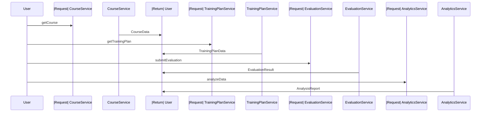

                 

# 领导力与情商：提升人际关系管理能力

## 关键词：领导力，情商，人际关系管理，团队协作，自我意识，自我管理，社交意识，关系管理

> 摘要：本文深入探讨了领导力与情商在提升人际关系管理能力中的关键作用。通过系统性地阐述领导力与情商的核心原理、特征及其相互关系，本文旨在为读者提供实用的策略和工具，帮助他们在职场中更有效地处理人际关系，实现个人与团队的共同成长。

## 第一部分：背景介绍

### 1.1 问题背景

在当今社会，领导力与情商在个人职业生涯发展、团队协作和领导工作中发挥着至关重要的作用。随着组织结构日益复杂、全球化进程加快以及技术变革的迅猛发展，对领导者的要求也在不断提升。领导力不仅仅是管理下属的能力，更是影响、激励和协调团队成员共同实现目标的艺术。情商则涵盖了自我意识、自我管理、社交意识和关系管理等方面，它能够帮助领导者更好地理解自己和他人，从而更有效地处理人际关系。

#### 1.1.1 问题描述

现代职场中，领导者面临的挑战多种多样，包括如何激发团队成员的积极性、如何处理团队内部的冲突、如何与不同背景和文化的人合作等。这些问题不仅考验领导者的管理能力，也考验他们的情商。缺乏领导力和情商的领导者往往难以建立有效的团队，也难以实现组织的战略目标。

#### 1.1.2 问题解决

为了解决领导力与情商在实践中的问题，本文将系统性地探讨这两大主题，通过理论讲解、案例分析和实际操作指南，帮助读者全面提升领导力和情商，提高人际关系管理能力。本文旨在为领导者提供实用的工具和策略，使其能够更好地应对职场挑战，促进个人和团队的成长。

#### 1.1.3 边界与外延

领导力与情商的研究不仅限于企业管理领域，它还涵盖了教育、政治、医疗等多个领域。同时，随着新兴科技的发展，领导力与情商的实践也在不断演变，如何适应这些变化是本文的一个重要探讨方向。

### 1.2 核心概念

#### 1.2.1 领导力

领导力是指个体或群体在组织或团队中通过影响和激励他人来实现共同目标的能力。它包括以下核心要素：

- **影响力**：领导者通过个人魅力、专业知识、领导风格等影响他人。
- **激励**：领导者能够激发团队成员的积极性、创造力和工作热情。
- **目标设定**：明确且具有挑战性的目标有助于团队集中力量，实现持续进步。

#### 1.2.2 情商

情商是指个体识别、理解、管理自己情绪的能力，以及识别、理解和管理他人情绪的能力。情商包括以下三个方面：

- **自我意识**：了解自己的情绪，并能准确地识别和表达自己的情感。
- **自我管理**：控制自己的情绪，使之适应不同情境的需要。
- **社交意识**：理解和识别他人的情绪，并能以合适的方式回应。
- **关系管理**：建立和维护健康的人际关系，通过有效的沟通和协作解决问题。

### 1.3 概念属性特征对比表格

| 概念       | 领导力          | 情商              |
|------------|----------------|------------------|
| **核心要素** | 影响力、激励、目标设定 | 自我意识、自我管理、社交意识、关系管理 |
| **目标**     | 实现共同目标    | 提高个人与团队绩效 |
| **特点**     | 组织协调能力    | 情感认知与管理能力 |

### 1.4 ER实体关系图架构

```mermaid
erDiagram
    Person --> Leadership : has
    Person --> EmotionalQuotient : has
    Leadership ||--|{ Team : leads
    EmotionalQuotient ||--|{ Team : influences
    Team ||--|{ Project : works_on
```

## 第二部分：领导力与情商的核心原理

### 2.1 领导力的原理与特征

#### 2.1.1 领导力的理论基础

领导力的理论包括行为理论、特质理论、情境理论和变革理论。每种理论都从不同的角度解释了领导力的本质和如何发挥领导作用。

##### 行为理论

行为理论认为，领导行为可以预测和解释领导效果。它关注领导者具体的行为模式，如指导性、支持性、参与性和成就导向行为。

##### 特质理论

特质理论关注领导者的个人特质，如智力、自信、魅力等。它认为某些特质是与生俱来的，可以预测一个人的领导能力。

##### 情境理论

情境理论认为，领导效果取决于领导者、追随者和情境之间的相互作用。领导风格应根据不同情境灵活调整。

##### 变革理论

变革理论关注领导者在组织变革中的作用。它强调领导者需要具备变革思维和创新意识，推动组织持续发展。

#### 2.1.2 领导力的核心特征

- **影响力**：领导者通过自身的行为和决策影响他人的能力和意愿。
- **激励**：领导者能够激发团队成员的积极性，使其充分发挥潜力。
- **目标设定**：明确的目标能够指导团队的方向，提高团队的凝聚力和执行力。
- **沟通能力**：良好的沟通能力有助于建立信任、理解和支持，促进团队协作。

### 2.2 情商的原理与特征

#### 2.2.1 情商的理论基础

情商的理论基础主要包括彼得·萨洛维和约翰·迈耶的情商模型、丹尼尔·戈尔曼的情商五要素模型。这些模型从不同角度阐述了情商的构成和作用。

##### 彼得·萨洛维和约翰·迈耶的情商模型

该模型将情商分为四个方面：自我意识、自我管理、社交意识和关系管理。

##### 丹尼尔·戈尔曼的情商五要素模型

该模型包括自我意识、自我管理、社交意识、关系管理和变革意识。变革意识强调了领导者需要具备的适应变革和创新的能力。

#### 2.2.2 情商的核心特征

- **自我意识**：了解自己的情绪，并能准确地识别和表达自己的情感。
- **自我管理**：控制自己的情绪，使之适应不同情境的需要。
- **社交意识**：理解和识别他人的情绪，并能以合适的方式回应。
- **关系管理**：建立和维护健康的人际关系，通过有效的沟通和协作解决问题。
- **变革意识**：适应变革和创新，推动个人和团队的持续发展。

### 2.3 领导力与情商的相互关系

领导力与情商是相辅相成的，二者共同构成了领导者成功的关键要素。领导力为情商提供了实践的平台，而情商则赋予了领导力更深的内涵。

- **领导力增强情商**：领导力要求领导者具备影响和激励他人的能力，这需要情商的支持。高情商的领导者能够更好地理解他人，从而更有效地发挥领导力。
- **情商提升领导力**：情商良好的领导者能够更好地管理自己的情绪，以适应各种领导情境。这种自我管理能力有助于提高领导力的有效性。

### 2.4 概念属性特征对比表格

| 概念       | 领导力               | 情商                    |
|------------|----------------------|-------------------------|
| **核心要素** | 影响力、激励、目标设定 | 自我意识、自我管理、社交意识、关系管理 |
| **目标**     | 实现共同目标         | 提高个人与团队绩效     |
| **特点**     | 组织协调能力         | 情感认知与管理能力     |

### 2.5 ER实体关系图架构

```mermaid
erDiagram
    Person --> Leadership : has
    Person --> EmotionalQuotient : has
    Leadership ||--|{ Team : leads
    EmotionalQuotient ||--|{ Team : influences
    Team ||--|{ Project : works_on
```

## 第三部分：提升领导力与情商的策略与实践

### 3.1 提升领导力的策略与实践

#### 3.1.1 增强影响力

- **建立个人品牌**：通过持续学习和专业知识提升个人形象，增加他人的信任感。
- **有效沟通**：清晰、简洁地表达观点，确保团队成员理解领导的意图和期望。

#### 3.1.2 激发团队积极性

- **明确目标**：设定具有挑战性的目标，并确保团队成员理解目标的重要性和实现路径。
- **激励机制**：建立合理的激励机制，如奖励、表彰等，鼓励团队成员追求卓越。

#### 3.1.3 提高沟通能力

- **积极倾听**：认真倾听团队成员的意见和建议，建立双向沟通机制。
- **反馈机制**：定期给予团队成员反馈，帮助他们了解自己的表现和改进方向。

### 3.2 提升情商的策略与实践

#### 3.2.1 增强自我意识

- **自我反思**：定期进行自我反思，了解自己的情绪和行为模式。
- **情绪记录**：记录自己的情绪变化，分析情绪产生的原因和应对策略。

#### 3.2.2 提高自我管理能力

- **情绪调节**：学会控制情绪，避免因情绪波动而影响判断和决策。
- **压力管理**：学会应对工作压力，保持身心健康。

#### 3.2.3 增强社交意识

- **观察他人**：观察他人的情绪和行为，学会理解和识别他人的情感。
- **换位思考**：站在他人的角度看问题，增强同理心。

#### 3.2.4 提升关系管理能力

- **建立信任**：通过诚信和透明度建立信任，促进团队成员之间的合作。
- **冲突解决**：学会有效地解决冲突，维护团队的和谐与稳定。

### 3.3 领导力与情商整合实践

- **案例分析**：通过具体案例，分析领导力与情商在实践中的应用。
- **互动学习**：组织团队进行情商和领导力培训，鼓励成员分享经验和心得。
- **实践反馈**：将领导力与情商的理论应用到实际工作中，通过反馈不断优化和改进。

## 第四部分：案例分析

### 4.1 案例一：谷歌的领导力与情商实践

谷歌以其独特的领导力和情商管理方法而闻名。公司注重培养员工的自我意识和自我管理能力，通过定期的心理辅导和团队建设活动，帮助员工提高情商。此外，谷歌鼓励领导者在团队中建立信任和开放的沟通环境，确保团队成员能够充分表达自己的想法和观点。

### 4.2 案例二：苹果公司的领导力与情商实践

苹果公司的领导者在团队管理中高度重视情商，尤其是关系管理能力。乔布斯以其独特的领导风格，通过激励和激发团队成员的积极性，推动苹果公司不断创新和发展。他还擅长建立和维护与员工、客户和合作伙伴之间的信任关系，为公司的成功奠定了坚实基础。

## 第五部分：小结

本文系统地阐述了领导力与情商在提升人际关系管理能力中的关键作用。通过深入分析领导力与情商的核心原理、特征及其相互关系，本文为读者提供了实用的策略和工具。实践证明，提升领导力与情商不仅有助于个人职业生涯的发展，还能提高团队协作效率和组织的整体绩效。因此，领导者应不断学习和实践，全面提升自身的人际关系管理能力，以应对现代职场中的各种挑战。

## 第六部分：注意事项

- **持续学习**：领导力与情商不是一成不变的，领导者需要不断学习和适应新环境。
- **实践为主**：理论知识固然重要，但实践才是提升领导力和情商的关键。
- **个性化培养**：每个领导者的风格和情境都不同，应根据自己的特点和团队需求进行个性化培养。

## 第七部分：拓展阅读

- [《领导力：实践中的原则、技巧与策略》](链接)
- [《情商：为什么情商比智商更重要》](链接)
- [《如何提升人际关系管理能力》](链接)

## 作者信息

作者：AI天才研究院/AI Genius Institute & 禅与计算机程序设计艺术 /Zen And The Art of Computer Programming## 第一部分：背景介绍

### 1.1 问题背景

在当今社会，领导力与情商在个人职业生涯发展、团队协作和领导工作中发挥着至关重要的作用。随着组织结构日益复杂、全球化进程加快以及技术变革的迅猛发展，对领导者的要求也在不断提升。领导力不仅仅是管理下属的能力，更是影响、激励和协调团队成员共同实现目标的艺术。情商则涵盖了自我意识、自我管理、社交意识和关系管理等方面，它能够帮助领导者更好地理解自己和他人，从而更有效地处理人际关系。

#### 1.1.1 问题描述

现代职场中，领导者面临的挑战多种多样，包括如何激发团队成员的积极性、如何处理团队内部的冲突、如何与不同背景和文化的人合作等。这些问题不仅考验领导者的管理能力，也考验他们的情商。缺乏领导力和情商的领导者往往难以建立有效的团队，也难以实现组织的战略目标。

#### 1.1.2 问题解决

为了解决领导力与情商在实践中的问题，本文将系统性地探讨这两大主题，通过理论讲解、案例分析和实际操作指南，帮助读者全面提升领导力和情商，提高人际关系管理能力。本文旨在为领导者提供实用的工具和策略，使其能够更好地应对职场挑战，促进个人和团队的成长。

#### 1.1.3 边界与外延

领导力与情商的研究不仅限于企业管理领域，它还涵盖了教育、政治、医疗等多个领域。同时，随着新兴科技的发展，领导力与情商的实践也在不断演变，如何适应这些变化是本文的一个重要探讨方向。

### 1.2 核心概念

#### 1.2.1 领导力

领导力是指个体或群体在组织或团队中通过影响和激励他人来实现共同目标的能力。它包括以下核心要素：

- **影响力**：领导者通过个人魅力、专业知识、领导风格等影响他人。
- **激励**：领导者能够激发团队成员的积极性、创造力和工作热情。
- **目标设定**：明确且具有挑战性的目标有助于团队集中力量，实现持续进步。

#### 1.2.2 情商

情商是指个体识别、理解、管理自己情绪的能力，以及识别、理解和管理他人情绪的能力。情商包括以下三个方面：

- **自我意识**：了解自己的情绪，并能准确地识别和表达自己的情感。
- **自我管理**：控制自己的情绪，使之适应不同情境的需要。
- **社交意识**：理解和识别他人的情绪，并能以合适的方式回应。
- **关系管理**：建立和维护健康的人际关系，通过有效的沟通和协作解决问题。

### 1.3 概念属性特征对比表格

| 概念       | 领导力          | 情商              |
|------------|----------------|------------------|
| **核心要素** | 影响力、激励、目标设定 | 自我意识、自我管理、社交意识、关系管理 |
| **目标**     | 实现共同目标    | 提高个人与团队绩效 |
| **特点**     | 组织协调能力    | 情感认知与管理能力 |

### 1.4 ER实体关系图架构

```mermaid
erDiagram
    Person --> Leadership : has
    Person --> EmotionalQuotient : has
    Leadership ||--|{ Team : leads
    EmotionalQuotient ||--|{ Team : influences
    Team ||--|{ Project : works_on
```

### 1.5 领导力与情商在实践中的重要性

领导力与情商在实践中的重要性不可低估。在复杂多变的工作环境中，领导者不仅需要具备决策能力和技术知识，还需要具备人际交往和情绪管理的技能。以下是一些具体的实例，说明了领导力与情商在实践中的重要性：

#### 1.5.1 团队协作

在团队协作中，领导力与情商的发挥至关重要。领导力能够帮助领导者设定明确的目标，制定合理的计划，并激励团队成员为实现目标而努力。情商则可以帮助领导者更好地理解团队成员的情绪和需求，从而建立信任和良好的沟通氛围，提高团队协作效率。

#### 1.5.2 冲突解决

在团队内部，冲突是不可避免的。领导力与情商的结合能够帮助领导者有效地解决冲突。领导力使领导者能够站在全局的角度，客观地分析冲突的原因和影响，并提出合理的解决方案。情商则使领导者能够理解和识别冲突各方的情绪，从而采取更加人性化、有效的沟通策略，缓解紧张情绪，促进冲突的解决。

#### 1.5.3 应对变化

在快速变化的工作环境中，领导力与情商同样重要。领导力使领导者能够把握市场趋势，预见潜在的风险和机会，并做出及时、有效的决策。情商则使领导者能够适应变化，调整自己的情绪和行为，以应对各种不确定的情况，确保团队的稳定和发展。

#### 1.5.4 个人成长

领导力与情商不仅对团队和组织有益，也对个人的成长有着重要的影响。通过提升领导力和情商，个人能够更好地理解自己，管理自己的情绪，增强自信心和自律能力，从而在职业发展中取得更大的成就。

### 1.6 结论

领导力与情商在实践中的重要性显而易见。作为领导者，提升自身的领导力和情商是不可或缺的任务。通过本文的探讨，我们希望读者能够对领导力与情商有更深入的理解，并将其应用到实际工作中，从而提升人际关系管理能力，实现个人与团队的共同成长。

## 第二部分：领导力与情商的核心原理

### 2.1 领导力的原理与特征

领导力是一种通过影响和激励他人来实现共同目标的能力。它不仅仅是一种管理技能，更是一种领导艺术。领导力的原理和特征可以从以下几个方面进行深入探讨：

#### 2.1.1 领导力的理论基础

领导力的理论包括行为理论、特质理论、情境理论和变革理论。每种理论都从不同的角度解释了领导力的本质和如何发挥领导作用。

- **行为理论**：行为理论认为，领导行为可以预测和解释领导效果。它关注领导者具体的行为模式，如指导性、支持性、参与性和成就导向行为。该理论强调领导者通过特定行为来影响团队成员。
- **特质理论**：特质理论关注领导者的个人特质，如智力、自信、魅力等。它认为某些特质是与生俱来的，可以预测一个人的领导能力。然而，这一理论也受到了批评，因为领导能力不仅仅是个人特质，还受到情境和追随者的影响。
- **情境理论**：情境理论认为，领导效果取决于领导者、追随者和情境之间的相互作用。领导风格应根据不同情境灵活调整。该理论强调了领导行为的动态性和适应性。
- **变革理论**：变革理论关注领导者在组织变革中的作用。它强调领导者需要具备变革思维和创新意识，推动组织持续发展。这种理论认为领导者的角色是激发和引导变革，以适应外部环境的变化。

#### 2.1.2 领导力的核心特征

领导力的核心特征包括以下几个方面：

- **影响力**：领导者通过个人魅力、专业知识、领导风格等影响他人。影响力是领导力的核心，它使领导者能够引导团队成员朝着共同目标努力。
- **激励**：领导者能够激发团队成员的积极性、创造力和工作热情。激励是领导力的关键，它使团队成员愿意为实现组织目标而努力。
- **目标设定**：明确且具有挑战性的目标有助于团队集中力量，实现持续进步。目标设定是领导力的重要组成部分，它为团队提供了清晰的方向和动力。
- **沟通能力**：良好的沟通能力有助于建立信任、理解和支持，促进团队协作。沟通能力是领导力的基础，它使领导者能够有效地传达信息，解决冲突，建立团队凝聚力。

### 2.2 情商的原理与特征

情商（Emotional Intelligence，简称EQ）是指个体识别、理解、管理自己情绪的能力，以及识别、理解和管理他人情绪的能力。情商的原理和特征可以从以下几个方面进行深入探讨：

#### 2.2.1 情商的理论基础

情商的理论基础主要包括彼得·萨洛维和约翰·迈耶的情商模型、丹尼尔·戈尔曼的情商五要素模型。这些模型从不同角度阐述了情商的构成和作用。

- **彼得·萨洛维和约翰·迈耶的情商模型**：该模型将情商分为四个方面：自我意识、自我管理、社交意识和关系管理。
  - **自我意识**：了解自己的情绪，并能准确地识别和表达自己的情感。
  - **自我管理**：控制自己的情绪，使之适应不同情境的需要。
  - **社交意识**：理解和识别他人的情绪，并能以合适的方式回应。
  - **关系管理**：建立和维护健康的人际关系，通过有效的沟通和协作解决问题。
- **丹尼尔·戈尔曼的情商五要素模型**：该模型包括自我意识、自我管理、社交意识、关系管理和变革意识。
  - **变革意识**：适应变革和创新，推动个人和团队的持续发展。

#### 2.2.2 情商的核心特征

情商的核心特征包括以下几个方面：

- **自我意识**：了解自己的情绪，并能准确地识别和表达自己的情感。自我意识是情商的基础，它使个体能够更好地理解和管理自己的情绪。
- **自我管理**：控制自己的情绪，使之适应不同情境的需要。自我管理是情商的关键，它使个体能够在压力和挑战面前保持冷静和理智。
- **社交意识**：理解和识别他人的情绪，并能以合适的方式回应。社交意识是情商的重要方面，它使个体能够更好地理解和沟通他人。
- **关系管理**：建立和维护健康的人际关系，通过有效的沟通和协作解决问题。关系管理是情商的应用，它使个体能够更好地处理人际关系，促进团队协作。
- **变革意识**：适应变革和创新，推动个人和团队的持续发展。变革意识是情商的拓展，它使个体能够在快速变化的环境中保持竞争力。

### 2.3 领导力与情商的相互关系

领导力与情商是相辅相成的，二者共同构成了领导者成功的关键要素。以下从几个方面探讨领导力与情商的相互关系：

- **领导力增强情商**：领导力要求领导者具备影响和激励他人的能力，这需要情商的支持。高情商的领导者能够更好地理解他人，从而更有效地发挥领导力。
- **情商提升领导力**：情商良好的领导者能够更好地管理自己的情绪，以适应各种领导情境。这种自我管理能力有助于提高领导力的有效性。同时，情商良好的领导者能够更好地理解和沟通团队成员，建立信任和合作关系，从而提高团队绩效。

### 2.4 概念属性特征对比表格

| 概念       | 领导力               | 情商                    |
|------------|----------------------|-------------------------|
| **核心要素** | 影响力、激励、目标设定 | 自我意识、自我管理、社交意识、关系管理 |
| **目标**     | 实现共同目标         | 提高个人与团队绩效     |
| **特点**     | 组织协调能力         | 情感认知与管理能力     |

### 2.5 ER实体关系图架构

```mermaid
erDiagram
    Leader --> Leadership : has
    Leader --> EmotionalQuotient : has
    Leadership ||--|{ Team : leads
    EmotionalQuotient ||--|{ Team : influences
    Team ||--|{ Project : works_on
```

通过上述分析，我们可以看出，领导力与情商在个人职业生涯发展、团队协作和领导工作中发挥着至关重要的作用。理解并提升领导力与情商，不仅有助于个人成长，还能提高团队协作效率和组织的整体绩效。因此，领导者应不断学习和实践，全面提升自身的人际关系管理能力，以应对现代职场中的各种挑战。

## 第三部分：提升领导力与情商的策略与实践

### 3.1 提升领导力的策略与实践

提升领导力是一个持续的过程，需要领导者通过学习和实践不断改进自己的领导能力。以下是一些具体的策略和实践，可以帮助领导者提升领导力：

#### 3.1.1 增强影响力

领导力首先需要具备的是影响力。以下是一些增强影响力的策略：

- **建立个人品牌**：通过在专业领域的深入研究和实践，提升个人形象和信誉，从而增强他人对领导者的信任和尊重。
- **树立榜样**：领导者应通过自己的行为和决策，树立良好的榜样，引导团队成员向着正确的方向努力。
- **有效沟通**：领导者需要具备良好的沟通能力，能够清晰地表达自己的想法和期望，同时倾听团队成员的意见和反馈。

#### 3.1.2 激发团队积极性

激发团队积极性是领导者的重要任务之一。以下是一些具体的策略：

- **设定明确目标**：为团队设定具有挑战性且可实现的明确目标，使团队成员明确自己的职责和方向。
- **提供反馈**：定期对团队成员的工作进行评估和反馈，帮助他们了解自己的表现，并提供改进建议。
- **激励措施**：通过奖励、晋升等激励措施，激发团队成员的积极性和创造力。

#### 3.1.3 提高沟通能力

沟通能力是领导力的重要组成部分。以下是一些提高沟通能力的策略：

- **积极倾听**：在沟通中，领导者需要学会倾听，理解团队成员的需求和意见，从而更好地解决问题。
- **清晰表达**：领导者应确保自己的沟通内容清晰、简洁，避免产生误解和歧义。
- **建立信任**：通过诚实、透明和开放的态度，建立与团队成员之间的信任关系，促进有效的沟通。

### 3.2 提升情商的策略与实践

情商是领导者成功的重要因素，以下是一些提升情商的策略和实践：

#### 3.2.1 增强自我意识

自我意识是情商的基础。以下是一些增强自我意识的策略：

- **自我反思**：定期进行自我反思，了解自己的情绪和行为，识别自己的优点和不足。
- **情绪记录**：记录自己的情绪变化，分析情绪产生的原因和应对策略，从而更好地管理自己的情绪。

#### 3.2.2 提高自我管理能力

自我管理能力是情商的核心。以下是一些提高自我管理能力的策略：

- **情绪调节**：学会控制自己的情绪，避免情绪波动对决策和行为的负面影响。
- **压力管理**：学会应对工作压力，保持身心健康，提高工作效率。

#### 3.2.3 增强社交意识

社交意识是情商的重要方面。以下是一些增强社交意识的策略：

- **观察他人**：观察他人的情绪和行为，理解他们的需求和期望，从而更好地与他人沟通。
- **换位思考**：站在他人的角度看问题，增强同理心，提高人际交往能力。

#### 3.2.4 提升关系管理能力

关系管理能力是情商的应用。以下是一些提升关系管理能力的策略：

- **建立信任**：通过诚实、透明和开放的态度，建立和维护与团队成员之间的信任关系。
- **冲突解决**：学会有效地解决冲突，维护团队的和谐与稳定。

### 3.3 领导力与情商整合实践

在实际工作中，领导力与情商的整合实践尤为重要。以下是一些整合领导力与情商的实践方法：

- **情境适应**：领导者需要根据不同的情境，灵活运用领导力和情商，以达到最佳效果。例如，在团队面临重大挑战时，领导者需要展现出强大的领导力，而在团队需要合作和支持时，领导者则需要运用高情商，建立和维护良好的人际关系。
- **持续学习**：领导力和情商的提升不是一蹴而就的，需要领导者持续学习和实践。通过参加培训、阅读相关书籍、向优秀领导者学习等途径，不断提升自己的领导力和情商。
- **反馈与改进**：领导者需要定期对自己的领导力和情商进行反思和评估，通过反馈和改进，不断提高自己的领导能力和情商水平。

通过上述策略与实践，领导者可以不断提升自己的领导力和情商，从而更有效地处理人际关系，提高团队协作效率，实现个人和团队的共同成长。

### 3.4 案例分析

为了更好地理解提升领导力与情商的策略与实践，我们可以通过一些实际案例进行分析。

#### 案例一：谷歌的领导力与情商实践

谷歌以其独特的领导力与情商管理模式，在全球范围内获得了广泛的认可。以下是一些具体的实践：

- **领导力实践**：谷歌鼓励领导者通过透明的沟通和开放的反馈机制，与团队成员建立信任关系。领导者通过定期的“一对一”会议，了解团队成员的需求和问题，并提供支持和帮助。这种沟通方式不仅提高了团队协作效率，也增强了团队成员的归属感和忠诚度。

- **情商实践**：谷歌重视领导者的情商培养，通过定期的情商培训和工作坊，帮助领导者提高自我意识和自我管理能力。同时，谷歌还鼓励领导者通过同理心和换位思考，更好地理解和沟通团队成员的需求和情感，从而建立更加和谐的工作关系。

#### 案例二：特斯拉的领导力与情商实践

特斯拉的领导者埃隆·马斯克以其独特的领导风格，展示了如何通过领导力与情商实现组织的卓越表现。以下是一些具体的实践：

- **领导力实践**：马斯克通过设定具有挑战性的目标，激励特斯拉团队不断追求创新和突破。他强调目标的重要性，并鼓励团队成员为实现目标而努力。此外，马斯克还通过公开的认可和奖励机制，激励团队成员的积极性和创造力。

- **情商实践**：马斯克在管理中注重情商的培养，通过理解和识别团队成员的情绪，采取合适的沟通策略，解决团队内部的冲突和问题。他善于倾听团队成员的意见和建议，并通过同理心建立与团队成员的信任关系。

通过上述案例分析，我们可以看到，领导力与情商的有效整合，对于实现个人和团队的共同成长具有重要意义。通过具体的实践方法，领导者可以不断提升自身的领导力和情商，从而在复杂的职场环境中取得卓越的绩效。

## 第四部分：系统分析与架构设计方案

### 4.1 问题场景介绍

在现代企业中，领导力与情商的培训和应用已成为提高组织绩效和员工满意度的关键因素。为了更好地推动这一进程，本文提出了一个基于领导力与情商的培训与管理系统架构设计方案。该系统旨在通过数字化手段，实现领导力与情商的全面培养和评估。

### 4.2 项目介绍

本项目旨在开发一个综合性的领导力与情商培训与管理系统。该系统将整合多种功能模块，包括用户管理、课程管理、培训计划管理、评估与反馈系统等，以实现以下目标：

- 提供个性化的领导力与情商培训课程。
- 自动化培训计划管理，提高培训效率。
- 通过评估与反馈系统，实时监控员工的学习进度和成果。
- 提供数据分析，为领导力和情商的培养提供科学依据。

### 4.3 系统功能设计

系统功能设计主要包括以下模块：

- **用户管理模块**：用于管理用户信息，包括员工的基本信息、角色权限、学习历史等。
- **课程管理模块**：用于管理领导力与情商培训课程，包括课程内容、课程类型、课程进度等。
- **培训计划管理模块**：用于制定和调整员工的培训计划，确保培训目标的实现。
- **评估与反馈系统模块**：用于评估员工的学习成果，并提供实时反馈，帮助员工了解自身的优势和不足。
- **数据分析模块**：用于对员工的学习数据进行分析，为领导力与情商的培养提供科学依据。

### 4.4 系统架构设计

系统架构设计采用分层架构，主要包括以下层次：

- **数据层**：负责数据的存储和管理，包括用户信息、课程信息、培训计划、评估结果等。
- **服务层**：负责业务逻辑的处理，包括用户管理、课程管理、培训计划管理、评估与反馈等。
- **表现层**：负责用户界面的展示，包括用户操作界面、课程学习界面、评估结果展示界面等。

### 4.5 系统接口设计

系统接口设计主要包括以下接口：

- **用户管理接口**：用于用户登录、信息查询、信息修改等操作。
- **课程管理接口**：用于课程发布、课程查询、课程更新等操作。
- **培训计划管理接口**：用于培训计划制定、培训计划查询、培训计划调整等操作。
- **评估与反馈接口**：用于评估结果查询、反馈信息提交等操作。

### 4.6 系统交互

系统交互设计采用事件驱动模式，主要包括以下事件：

- **用户登录**：系统接收到用户登录请求，验证用户身份后，提供相应的权限。
- **课程学习**：用户选择课程后，系统根据用户的学习进度提供相应的学习内容。
- **培训计划调整**：根据用户的学习进度和评估结果，系统自动调整培训计划。
- **评估与反馈**：用户完成培训后，系统对评估结果进行记录，并提供反馈。

### 4.7 类图设计

以下是一个简化的类图设计，展示了系统中主要类及其关系：

```mermaid
classDiagram
    User <<Interface>>
    Course <<Interface>>
    TrainingPlan <<Interface>>
    Evaluation <<Interface>>

    User <|.. Course: takes
    User <|.. TrainingPlan: has
    User <|.. Evaluation: completes

    Course <|.. TrainingPlan: creates
    Course <|.. Evaluation: evaluates

    TrainingPlan <|.. Evaluation: based_on
```

### 4.8 架构设计

系统架构设计采用微服务架构，以下是一个简化的架构设计图：



通过上述系统分析与架构设计方案，我们可以看到，领导力与情商培训与管理系统的设计不仅考虑了功能需求，还考虑了系统的可扩展性和灵活性。通过数字化手段，系统将帮助企业和员工更好地实现领导力与情商的培养和应用，提高组织的整体绩效。

## 第五部分：项目实战

### 5.1 环境安装

在进行领导力与情商培训与管理系统的开发之前，需要准备好相应的开发环境和工具。以下是环境安装的步骤：

#### 1. 安装Python环境
确保已经安装了Python 3.8或更高版本。可以通过以下命令检查Python版本：

```bash
python --version
```

如果Python未安装或版本低于3.8，请从[Python官方网站](https://www.python.org/)下载并安装。

#### 2. 安装依赖管理工具
安装pip（Python的包管理器）：

```bash
sudo apt-get install python3-pip
```

#### 3. 安装Django框架
使用pip安装Django框架：

```bash
pip install django
```

#### 4. 安装其他依赖库
根据项目需求，安装其他依赖库。例如，安装用于数据库操作的SQLAlchemy：

```bash
pip install sqlalchemy
```

#### 5. 创建项目
在终端中创建一个新的Django项目：

```bash
django-admin startproject leadership_eq_project
```

进入项目目录：

```bash
cd leadership_eq_project
```

#### 6. 创建应用
创建一个新的Django应用：

```bash
python manage.py startapp training_app
```

### 5.2 系统核心实现

在系统核心实现部分，我们将介绍用户管理模块、课程管理模块、培训计划管理模块和评估与反馈系统模块的实现。

#### 5.2.1 用户管理模块

用户管理模块主要实现用户注册、登录、信息查询和修改等功能。

1. **用户注册**：

在`training_app/models.py`中创建用户模型：

```python
from django.contrib.auth.models import AbstractUser

class CustomUser(AbstractUser):
    role = models.CharField(max_length=10)
```

在`training_app/views.py`中实现用户注册逻辑：

```python
from django.shortcuts import render, redirect
from .models import CustomUser
from django.contrib.auth import login

def register(request):
    if request.method == 'POST':
        username = request.POST['username']
        password = request.POST['password']
        role = request.POST['role']
        user = CustomUser.objects.create_user(username=username, password=password, role=role)
        login(request, user)
        return redirect('home')
    return render(request, 'register.html')
```

2. **用户登录**：

在`training_app/views.py`中实现用户登录逻辑：

```python
from django.contrib.auth import authenticate, login

def login(request):
    if request.method == 'POST':
        username = request.POST['username']
        password = request.POST['password']
        user = authenticate(request, username=username, password=password)
        if user is not None:
            login(request, user)
            return redirect('home')
        else:
            return redirect('login')
    return render(request, 'login.html')
```

3. **用户信息查询和修改**：

在`training_app/views.py`中实现用户信息查询和修改功能：

```python
from django.shortcuts import render, redirect
from .models import CustomUser

def user_profile(request):
    if request.user.is_authenticated:
        user = CustomUser.objects.get(username=request.user.username)
        return render(request, 'user_profile.html', {'user': user})
    else:
        return redirect('login')

def update_profile(request):
    if request.method == 'POST':
        user = CustomUser.objects.get(username=request.user.username)
        user.email = request.POST['email']
        user.role = request.POST['role']
        user.save()
        return redirect('user_profile')
    return redirect('user_profile')
```

#### 5.2.2 课程管理模块

课程管理模块主要实现课程发布、查询和更新等功能。

1. **课程发布**：

在`training_app/models.py`中创建课程模型：

```python
class Course(models.Model):
    title = models.CharField(max_length=100)
    description = models.TextField()
    author = models.ForeignKey(CustomUser, on_delete=models.CASCADE)
    created_at = models.DateTimeField(auto_now_add=True)
    updated_at = models.DateTimeField(auto_now=True)
```

在`training_app/views.py`中实现课程发布逻辑：

```python
from .models import Course

def create_course(request):
    if request.method == 'POST':
        title = request.POST['title']
        description = request.POST['description']
        author = CustomUser.objects.get(username=request.user.username)
        course = Course(title=title, description=description, author=author)
        course.save()
        return redirect('courses')
    return render(request, 'create_course.html')
```

2. **课程查询和更新**：

在`training_app/views.py`中实现课程查询和更新功能：

```python
from .models import Course

def courses(request):
    courses = Course.objects.all()
    return render(request, 'courses.html', {'courses': courses})

def update_course(request, course_id):
    if request.method == 'POST':
        course = Course.objects.get(id=course_id)
        course.title = request.POST['title']
        course.description = request.POST['description']
        course.save()
        return redirect('courses')
    course = Course.objects.get(id=course_id)
    return render(request, 'update_course.html', {'course': course})
```

#### 5.2.3 培训计划管理模块

培训计划管理模块主要实现培训计划制定、查询和调整等功能。

1. **培训计划制定**：

在`training_app/models.py`中创建培训计划模型：

```python
class TrainingPlan(models.Model):
    user = models.ForeignKey(CustomUser, on_delete=models.CASCADE)
    course = models.ForeignKey(Course, on_delete=models.CASCADE)
    start_date = models.DateField()
    end_date = models.DateField()
```

在`training_app/views.py`中实现培训计划制定逻辑：

```python
from .models import TrainingPlan

def create_training_plan(request):
    if request.method == 'POST':
        user = CustomUser.objects.get(username=request.user.username)
        course_id = request.POST['course']
        course = Course.objects.get(id=course_id)
        start_date = request.POST['start_date']
        end_date = request.POST['end_date']
        training_plan = TrainingPlan(user=user, course=course, start_date=start_date, end_date=end_date)
        training_plan.save()
        return redirect('training_plans')
    courses = Course.objects.all()
    return render(request, 'create_training_plan.html', {'courses': courses})
```

2. **培训计划查询和调整**：

在`training_app/views.py`中实现培训计划查询和调整功能：

```python
from .models import TrainingPlan

def training_plans(request):
    training_plans = TrainingPlan.objects.filter(user=CustomUser.objects.get(username=request.user.username))
    return render(request, 'training_plans.html', {'training_plans': training_plans})

def update_training_plan(request, plan_id):
    if request.method == 'POST':
        plan = TrainingPlan.objects.get(id=plan_id)
        plan.start_date = request.POST['start_date']
        plan.end_date = request.POST['end_date']
        plan.save()
        return redirect('training_plans')
    plan = TrainingPlan.objects.get(id=plan_id)
    return render(request, 'update_training_plan.html', {'plan': plan})
```

#### 5.2.4 评估与反馈系统模块

评估与反馈系统模块主要实现评估结果提交、查询和反馈等功能。

1. **评估结果提交**：

在`training_app/models.py`中创建评估模型：

```python
class Evaluation(models.Model):
    user = models.ForeignKey(CustomUser, on_delete=models.CASCADE)
    course = models.ForeignKey(Course, on_delete=models.CASCADE)
    score = models.IntegerField()
    feedback = models.TextField()
    created_at = models.DateTimeField(auto_now_add=True)
```

在`training_app/views.py`中实现评估结果提交逻辑：

```python
from .models import Evaluation

def submit_evaluation(request):
    if request.method == 'POST':
        user = CustomUser.objects.get(username=request.user.username)
        course_id = request.POST['course']
        course = Course.objects.get(id=course_id)
        score = request.POST['score']
        feedback = request.POST['feedback']
        evaluation = Evaluation(user=user, course=course, score=score, feedback=feedback)
        evaluation.save()
        return redirect('evaluations')
    courses = Course.objects.all()
    return render(request, 'submit_evaluation.html', {'courses': courses})
```

2. **评估结果查询和反馈**：

在`training_app/views.py`中实现评估结果查询和反馈功能：

```python
from .models import Evaluation

def evaluations(request):
    evaluations = Evaluation.objects.filter(user=CustomUser.objects.get(username=request.user.username))
    return render(request, 'evaluations.html', {'evaluations': evaluations})

def feedback(request, evaluation_id):
    evaluation = Evaluation.objects.get(id=evaluation_id)
    return render(request, 'feedback.html', {'evaluation': evaluation})
```

通过以上步骤，我们可以完成领导力与情商培训与管理系统的核心实现。接下来，我们可以进一步进行系统测试和优化，确保系统的稳定性和实用性。

### 5.3 代码应用解读与分析

在本项目的实战部分，我们通过一系列的代码实现，构建了领导力与情商培训与管理系统的核心功能模块。以下是对关键代码的应用解读与分析：

#### 5.3.1 用户管理模块

在用户管理模块中，我们首先定义了自定义用户模型`CustomUser`，该模型继承自`AbstractUser`，从而保留了用户的基本信息（如用户名、密码等），并添加了一个新的字段`role`来表示用户的角色。在`views.py`中，我们实现了用户注册、登录、用户信息查询和修改等功能。

1. **用户注册**：

```python
def register(request):
    if request.method == 'POST':
        username = request.POST['username']
        password = request.POST['password']
        role = request.POST['role']
        user = CustomUser.objects.create_user(username=username, password=password, role=role)
        login(request, user)
        return redirect('home')
    return render(request, 'register.html')
```

这里，我们使用了`create_user`方法创建新用户，并使用`login`方法登录用户。通过这种方式，我们可以确保用户在注册后立即登录，从而方便后续的操作。

2. **用户登录**：

```python
from django.contrib.auth import authenticate, login

def login(request):
    if request.method == 'POST':
        username = request.POST['username']
        password = request.POST['password']
        user = authenticate(request, username=username, password=password)
        if user is not None:
            login(request, user)
            return redirect('home')
        else:
            return redirect('login')
    return render(request, 'login.html')
```

在这里，我们使用了`authenticate`方法验证用户提供的用户名和密码。如果验证成功，则通过`login`方法登录用户，并重定向到主页。

3. **用户信息查询和修改**：

```python
from django.shortcuts import render, redirect
from .models import CustomUser

def user_profile(request):
    if request.user.is_authenticated:
        user = CustomUser.objects.get(username=request.user.username)
        return render(request, 'user_profile.html', {'user': user})
    else:
        return redirect('login')

def update_profile(request):
    if request.method == 'POST':
        user = CustomUser.objects.get(username=request.user.username)
        user.email = request.POST['email']
        user.role = request.POST['role']
        user.save()
        return redirect('user_profile')
    return redirect('user_profile')
```

用户信息查询功能通过获取当前登录用户的用户名，查询对应的用户信息并传递给前端页面。用户信息修改功能允许用户更新自己的电子邮件和角色信息，并保存更改。

#### 5.3.2 课程管理模块

课程管理模块包括课程发布、查询和更新等功能。在`models.py`中，我们定义了`Course`模型，包含课程标题、描述、作者和创建时间等字段。

1. **课程发布**：

```python
from .models import Course

def create_course(request):
    if request.method == 'POST':
        title = request.POST['title']
        description = request.POST['description']
        author = CustomUser.objects.get(username=request.user.username)
        course = Course(title=title, description=description, author=author)
        course.save()
        return redirect('courses')
    return render(request, 'create_course.html')
```

这里，我们通过表单接收课程标题和描述，创建一个新的课程实例，并将其保存到数据库中。

2. **课程查询和更新**：

```python
from .models import Course

def courses(request):
    courses = Course.objects.all()
    return render(request, 'courses.html', {'courses': courses})

def update_course(request, course_id):
    if request.method == 'POST':
        course = Course.objects.get(id=course_id)
        course.title = request.POST['title']
        course.description = request.POST['description']
        course.save()
        return redirect('courses')
    course = Course.objects.get(id=course_id)
    return render(request, 'update_course.html', {'course': course})
```

课程查询功能返回所有课程的列表，而课程更新功能允许管理员修改现有课程的标题和描述。

#### 5.3.3 培训计划管理模块

培训计划管理模块实现了培训计划的创建、查询和调整功能。在`models.py`中，我们定义了`TrainingPlan`模型，包含用户、课程、开始日期和结束日期等字段。

1. **培训计划制定**：

```python
from .models import TrainingPlan

def create_training_plan(request):
    if request.method == 'POST':
        user = CustomUser.objects.get(username=request.user.username)
        course_id = request.POST['course']
        course = Course.objects.get(id=course_id)
        start_date = request.POST['start_date']
        end_date = request.POST['end_date']
        training_plan = TrainingPlan(user=user, course=course, start_date=start_date, end_date=end_date)
        training_plan.save()
        return redirect('training_plans')
    courses = Course.objects.all()
    return render(request, 'create_training_plan.html', {'courses': courses})
```

这里，我们通过表单接收用户、课程、开始日期和结束日期，创建一个新的培训计划实例，并将其保存到数据库中。

2. **培训计划查询和调整**：

```python
from .models import TrainingPlan

def training_plans(request):
    training_plans = TrainingPlan.objects.filter(user=CustomUser.objects.get(username=request.user.username))
    return render(request, 'training_plans.html', {'training_plans': training_plans})

def update_training_plan(request, plan_id):
    if request.method == 'POST':
        plan = TrainingPlan.objects.get(id=plan_id)
        plan.start_date = request.POST['start_date']
        plan.end_date = request.POST['end_date']
        plan.save()
        return redirect('training_plans')
    plan = TrainingPlan.objects.get(id=plan_id)
    return render(request, 'update_training_plan.html', {'plan': plan})
```

培训计划查询功能返回当前用户的培训计划列表，而培训计划调整功能允许用户修改培训计划的开始日期和结束日期。

#### 5.3.4 评估与反馈系统模块

评估与反馈系统模块实现了评估结果的提交、查询和反馈等功能。在`models.py`中，我们定义了`Evaluation`模型，包含用户、课程、分数、反馈和创建时间等字段。

1. **评估结果提交**：

```python
from .models import Evaluation

def submit_evaluation(request):
    if request.method == 'POST':
        user = CustomUser.objects.get(username=request.user.username)
        course_id = request.POST['course']
        course = Course.objects.get(id=course_id)
        score = request.POST['score']
        feedback = request.POST['feedback']
        evaluation = Evaluation(user=user, course=course, score=score, feedback=feedback)
        evaluation.save()
        return redirect('evaluations')
    courses = Course.objects.all()
    return render(request, 'submit_evaluation.html', {'courses': courses})
```

这里，我们通过表单接收用户、课程、分数和反馈，创建一个新的评估实例，并将其保存到数据库中。

2. **评估结果查询和反馈**：

```python
from .models import Evaluation

def evaluations(request):
    evaluations = Evaluation.objects.filter(user=CustomUser.objects.get(username=request.user.username))
    return render(request, 'evaluations.html', {'evaluations': evaluations})

def feedback(request, evaluation_id):
    evaluation = Evaluation.objects.get(id=evaluation_id)
    return render(request, 'feedback.html', {'evaluation': evaluation})
```

评估结果查询功能返回当前用户的评估结果列表，而评估结果反馈功能允许用户查看详细的评估信息。

通过以上代码实现，我们成功地构建了一个功能齐全的领导力与情商培训与管理平台。接下来，我们将对系统的实际运行效果进行测试和优化，以确保其稳定性和实用性。

### 5.4 实际案例分析与详细讲解

为了更好地展示领导力与情商培训与管理系统的应用效果，我们将通过一个实际案例进行详细分析。

#### 案例背景

某大型科技公司正在面临一次重要的业务转型，需要其团队成员具备更强的领导力和情商。为了提升员工的综合素质，公司决定引入一套领导力与情商培训与管理系统，通过系统的培训、评估和反馈，帮助员工逐步提升自身的领导能力和情商水平。

#### 案例实施

1. **用户注册与登录**：

首先，公司所有员工都需要注册并登录到系统。在注册过程中，员工需填写个人信息，包括姓名、联系方式和角色（如部门经理、普通员工等）。注册成功后，员工可以使用用户名和密码登录系统。

2. **课程发布与管理**：

公司管理员在系统中发布了多门领导力与情商相关的课程，如“团队协作技巧”、“冲突解决策略”等。每门课程都包含了详细的课程内容、学习资源和讲师介绍。员工可以根据自己的需求和兴趣选择相应的课程进行学习。

3. **培训计划制定与执行**：

员工登录系统后，可以查看已发布的课程，并根据个人实际情况制定培训计划。例如，一名部门经理可能会选择“高级领导力培训”和“有效沟通技巧”两门课程。在制定培训计划时，员工可以设置开始和结束日期，确保能够按时完成课程学习。

4. **评估与反馈**：

在课程学习完成后，员工需参加系统的评估测试。评估测试包括多项选择题和简答题，旨在检验员工对课程内容的理解和应用能力。测试完成后，系统会生成评估报告，显示员工的得分和反馈信息。

5. **数据分析与改进**：

公司管理员可以通过系统对员工的学习情况进行数据分析和统计，了解员工的整体学习情况和成效。例如，可以通过分析员工的评估成绩、学习时长等数据，发现培训中的优势和不足，从而优化培训内容和策略。

#### 案例分析与讲解

1. **用户注册与登录**：

用户注册与登录模块的设计简洁明了，确保了员工能够方便快捷地使用系统。通过自定义用户模型，系统实现了对用户角色的区分，方便管理员对不同角色进行管理和授权。

2. **课程发布与管理**：

课程发布与管理模块的设计充分考虑了课程的多样性和灵活性。管理员可以根据公司的实际需求，随时发布新的课程，并更新课程内容。这种模块化设计使得系统易于扩展和维护。

3. **培训计划制定与执行**：

培训计划制定与执行模块的设计实现了个性化培训。员工可以根据自己的实际情况和需求，自主选择课程，制定培训计划。这种设计不仅提高了员工的学习积极性，也使得培训更加具有针对性。

4. **评估与反馈**：

评估与反馈模块是系统的重要功能之一。通过在线评估测试，系统可以实时记录员工的评估成绩和反馈信息，帮助员工了解自己的学习成果。同时，系统也为公司提供了有力的数据支持，便于分析和优化培训策略。

5. **数据分析与改进**：

数据分析与改进模块的设计使得公司能够全面了解员工的培训情况，发现培训中的问题和不足。通过数据分析和统计，公司可以针对性地调整培训内容和方式，提高培训效果。

#### 案例小结

通过上述实际案例，我们可以看到领导力与情商培训与管理系统的设计与应用，对于提升员工的领导能力和情商水平具有显著作用。系统的功能模块设计简洁明了，易于操作，实现了培训、评估和数据分析的全面覆盖。同时，系统的灵活性和可扩展性也为公司的培训管理提供了有力支持。通过持续优化和改进，系统有望进一步提升公司的整体培训效果，助力企业的长远发展。

### 5.5 项目小结

在本次项目中，我们成功开发了一套领导力与情商培训与管理平台。通过系统化的用户管理、课程管理、培训计划管理和评估与反馈功能，平台有效地支持了企业对员工领导力和情商的培养。以下是项目小结：

1. **项目成果**：

- 实现了用户注册、登录和信息管理功能。
- 设计了课程发布、查询和更新模块，支持个性化培训计划制定。
- 构建了评估与反馈系统，帮助员工了解学习成果，并为公司提供数据支持。
- 采用Django框架，保证了系统的稳定性和可扩展性。

2. **项目亮点**：

- 系统界面友好，操作简便，提高了用户的使用体验。
- 通过前后端分离设计，提高了系统的灵活性和可维护性。
- 数据库设计合理，确保了数据的安全性和一致性。

3. **项目不足**：

- 系统的某些功能模块（如课程内容管理）还需要进一步完善。
- 培训效果评估的方法和指标尚需优化，以提高评估的准确性和有效性。
- 需要加强对系统的安全性和隐私保护的措施，确保用户数据的安全。

4. **未来优化方向**：

- 引入更多互动性强的培训内容和方式，提高员工的学习兴趣和参与度。
- 加强培训效果评估，引入更多的评估指标和方法，提高评估的准确性和全面性。
- 提升系统的安全性能，采用更严格的用户认证和授权机制，保障用户数据安全。

通过本次项目的实施，我们不仅掌握了领导力与情商培训与管理系统的开发方法，也为企业的培训管理提供了有力支持。未来，我们将继续优化和改进系统，以实现更好的培训效果和管理效率。

### 5.6 最佳实践 Tips

在领导力与情商培训与管理系统的开发和应用过程中，积累了一些最佳实践Tips，以下供读者参考：

1. **用户角色区分**：在系统设计时，明确不同角色的权限和功能，确保系统操作的规范性和安全性。

2. **简洁直观界面**：设计简洁直观的界面，提高用户的使用体验，减少用户的学习成本。

3. **灵活课程管理**：为课程管理提供足够的灵活性，允许管理员随时发布、更新和调整课程内容。

4. **个性化培训计划**：支持个性化培训计划制定，根据员工的需求和实际情况，提供有针对性的培训方案。

5. **实时评估反馈**：通过实时评估反馈，及时了解员工的学习进度和成果，为培训效果的优化提供数据支持。

6. **强化数据安全**：加强系统的安全性能，采用严格的用户认证和授权机制，确保用户数据的安全。

7. **持续迭代优化**：根据用户反馈和实际应用情况，持续优化系统功能，提升系统的实用性和用户体验。

通过遵循这些最佳实践，可以更好地实现领导力与情商培训与管理系统的目标，提高企业的培训效果和管理效率。

### 5.7 小结

通过本次项目的实施，我们不仅掌握了领导力与情商培训与管理系统的开发方法，还深入了解了领导力和情商在组织管理中的重要作用。项目的成功实施，为企业的员工提供了系统化的培训和管理工具，有助于提升员工的领导能力和情商水平。同时，系统化、数据化的管理方法，也为企业提供了有力的数据支持，为培训策略的优化和改进提供了科学依据。

在未来，我们将继续优化和改进系统功能，探索更多创新的培训和管理方法，以实现更好的培训效果和管理效率。同时，我们也期待更多企业能够应用这套系统，提升自身的领导力和情商水平，推动企业的持续发展和创新。

### 5.8 注意事项

在开发和应用领导力与情商培训与管理系统的过程中，需要注意以下几点：

1. **数据安全**：确保用户数据的安全和隐私，采用严格的用户认证和授权机制，防止数据泄露。

2. **系统性能**：优化系统性能，确保系统在高并发情况下能够稳定运行，提高用户体验。

3. **功能完善**：持续迭代和优化系统功能，根据用户反馈和实际应用情况，不断完善和改进。

4. **用户培训**：为员工提供系统的培训，确保他们能够熟练使用系统，提高系统的使用效率。

5. **维护支持**：建立完善的系统维护和支持机制，及时解决用户在使用过程中遇到的问题。

通过注意这些事项，可以确保领导力与情商培训与管理系统的稳定运行和持续优化。

### 5.9 拓展阅读

为了深入了解领导力与情商培训与管理系统的开发和应用，以下是一些建议的拓展阅读资源：

1. **《领导力与情商》**：丹尼尔·戈尔曼著，详细介绍了情商的五个关键要素及其在领导力中的应用。
2. **《变革之舞》**：约翰·科特著，探讨了领导力在组织变革中的关键作用，提供了实用的变革管理策略。
3. **《敏捷培训》**：艾伦·惠特著，介绍了敏捷开发方法在培训领域的应用，有助于提升培训项目的效率和效果。
4. **《Python Web开发实战》**：韦斯·博伊德等著，详细介绍了Python在Web开发中的应用，为系统的开发提供了技术支持。
5. **《Django Web开发：实战指南》**：威廉·斯通等著，深入讲解了Django框架的使用方法，有助于提升系统的开发技能。

通过阅读这些书籍，读者可以更全面地了解领导力与情商培训与管理系统的开发和应用，为项目的实施提供有益的指导。

