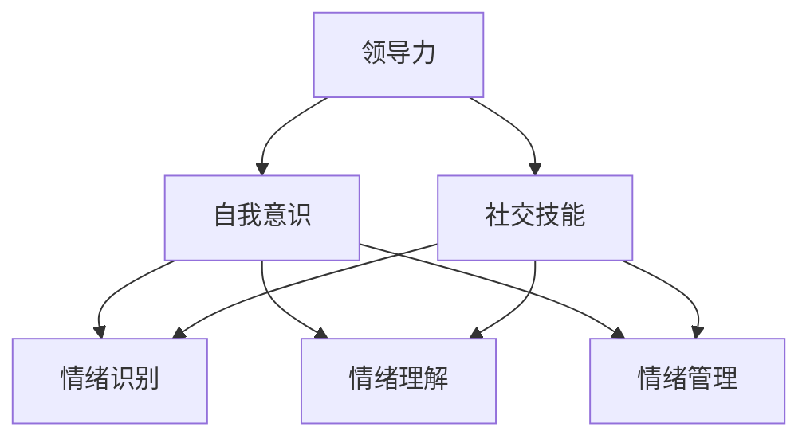
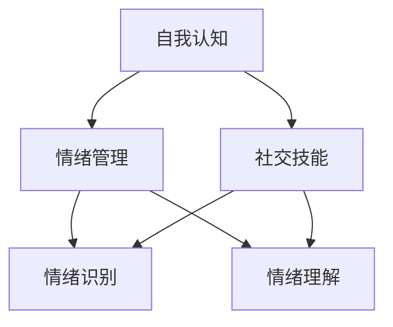
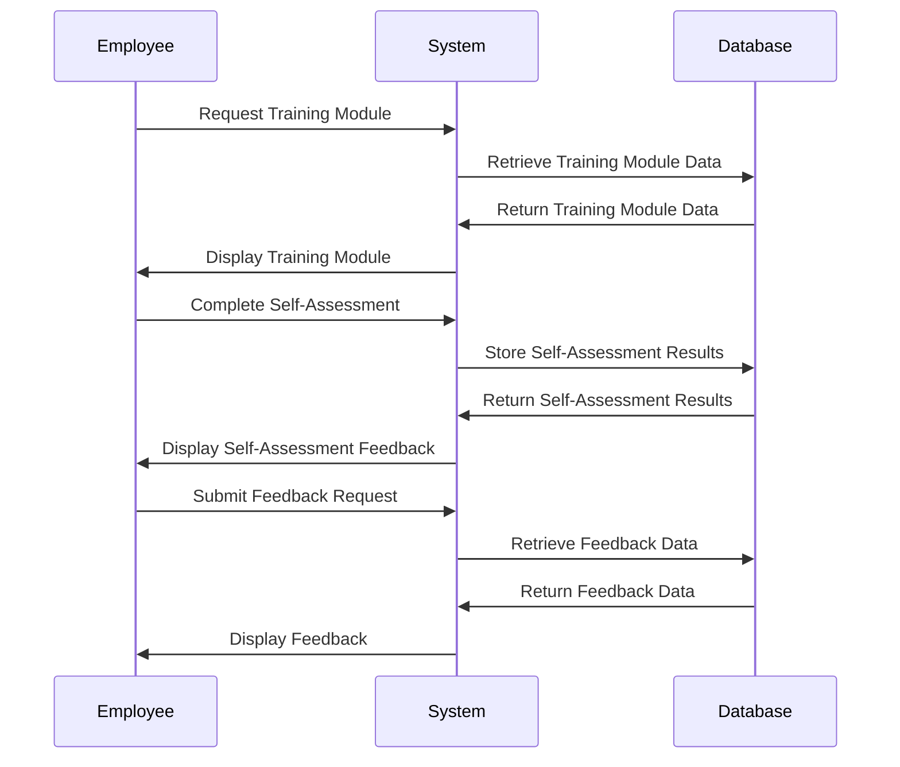
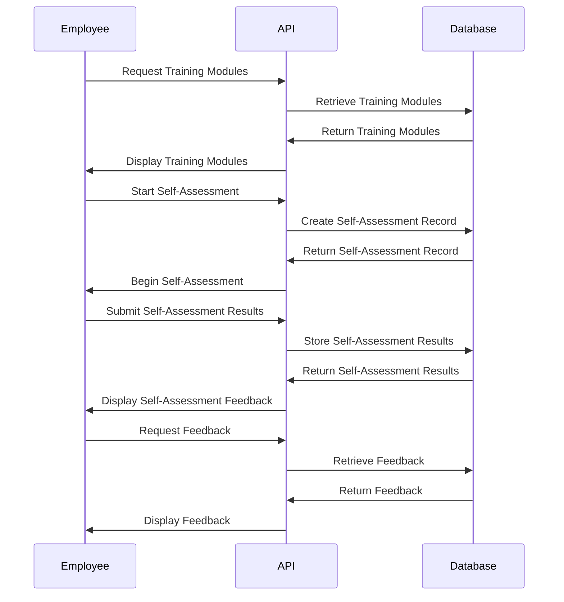

                 

### 文章标题：领导力与情商：提升人际影响力的关键

#### 关键词：领导力、情商、人际影响力、自我意识、社交技能

> **摘要：** 本文深入探讨了领导力与情商在提升人际影响力中的关键作用。文章首先介绍了领导力的本质及其重要性，然后详细阐述了情商的定义及其核心要素。通过结合领导力与情商的案例分析，本文提出了提升人际影响力的具体策略，为个人和组织提供了实用的指导和建议。

#### 引言

在当今快速变化的商业环境中，领导力与情商已经成为决定个人和组织成功的重要因素。领导力不仅仅是指导他人完成任务，更是通过影响和激励团队实现共同目标的能力。而情商，则是处理情感和人际关系的重要技能，它能够增强领导力，提高人际影响力。本文将从领导力的本质、情商的构成、两者的结合以及实际应用等方面进行探讨，帮助读者深入了解和提升人际影响力。

#### 第一部分：领导力概述

### 第1章：领导力的本质与重要性

#### 1.1 领导力的定义

领导力是指通过影响和激励他人，实现组织目标的能力。它不仅仅是一种职位赋予的权力，更是一种个人特质和技能。领导力可以涵盖多个层面，从基层管理到高层领导，每个层次都有其独特的领导力需求。

#### 1.2 领导力的重要性

领导力对于组织和个人都是至关重要的。它能够促进团队协作，提高工作效率，增强员工满意度，甚至影响企业的长期发展。有效的领导力能够激发员工的潜力，使他们更加投入工作，从而实现组织的战略目标。

#### 1.3 领导力的发展趋势

随着全球化、信息化和多元化的发展，领导力也在不断演变。现代领导力更加强调人性化和可持续性，注重团队合作和变革管理。领导力的发展趋势还表现为对情商和自我意识的重视。

### 第2章：领导力的核心要素

#### 2.1 自我意识

自我意识是领导力的基础，它包括自我认知、自我管理和自我激励。自我认知是指了解自己的性格、价值观和动机。自我管理是指控制自己的情绪和行为，以适应不同情境。自我激励则是持续追求个人成长和进步的动力。

#### 2.2 社交技能

社交技能是领导力的重要组成部分，它包括沟通技巧、建立人际关系和解决冲突。有效的沟通能够传递信息、建立信任和促进合作。建立人际关系则是领导者在团队中建立支持网络的关键。解决冲突则是维护团队和谐的重要手段。

#### 第3章：情商与领导力

#### 3.1 情商的定义与构成

情商（Emotional Intelligence，简称EQ）是指处理情感和人际关系的能力。它包括情绪识别、情绪理解和情绪管理三个核心要素。情绪识别是指感知和识别自己和他人的情绪。情绪理解是指理解情绪背后的原因和含义。情绪管理是指有效地处理和表达情绪。

#### 3.2 情商在领导力中的应用

情商在领导力中的应用非常广泛。它能够帮助领导者更好地管理团队，制定决策，甚至处理危机。情商高的领导者更能够理解和满足员工的需求，建立和谐的团队关系，从而提高团队的绩效。

#### 第4章：提升领导力与情商的策略

#### 4.1 自我提升

自我提升是提升领导力和情商的关键步骤。它包括培养自我意识、提高社交技能和不断学习。自我意识的培养可以通过反思和自我评估来实现。社交技能的提高则需要通过实践和反馈来不断改进。学习则是持续进步的动力。

#### 4.2 持续学习

持续学习是提升领导力和情商的重要策略。它包括阅读与教育、参与培训与研讨会和反思与改进。通过不断学习和实践，领导者可以不断提高自己的能力和水平。

#### 4.3 实践应用

实践应用是提升领导力和情商的关键步骤。它包括团队建设活动、个人成长计划和领导力教练。通过实际操作和反馈，领导者可以更好地理解和应用领导力和情商的理论知识。

#### 第5章：领导力与情商案例分析

#### 5.1 案例分析1：成功领导力实践

通过案例分析，我们可以看到成功领导者如何运用领导力和情商实现目标。这些案例展示了领导力和情商在实践中的具体应用和效果。

#### 5.2 案例分析2：情商在危机管理中的应用

在危机管理中，情商发挥着重要作用。领导者通过情绪管理和沟通技巧，可以有效缓解危机，维护组织稳定。

#### 5.3 案例分析3：领导力与情商的双赢

这个案例展示了领导力与情商的结合如何实现组织和个人双赢。领导者通过提升情商，不仅提高了自己的领导力，还促进了团队的发展和进步。

#### 第6章：领导力与情商的未来

#### 6.1 领导力的发展方向

随着社会和技术的不断发展，领导力也在不断演变。未来的领导力将更加注重创新、变革和全球化。

#### 6.2 情商在领导力中的重要性提升

情商在领导力中的重要性将不断提升。领导者需要具备更高的情商，以适应复杂多变的商业环境。

#### 6.3 领导力与情商教育的未来趋势

领导力与情商教育的未来趋势将更加注重实践和个性化。通过定制化的培训和教练，领导者可以更好地提升自己的领导力和情商。

#### 第7章：结论与启示

#### 7.1 领导力与情商的相互关系

领导力与情商是相互促进的关系。提升情商可以增强领导力，提高人际影响力。

#### 7.2 对个人与组织的启示

个人和组织都可以从领导力和情商的提升中受益。领导者需要认识到情商的重要性，并将其融入领导实践中。

#### 7.3 对未来领导者的建议

未来领导者需要不断提升自己的领导力和情商。通过不断学习和实践，他们可以更好地应对挑战，实现组织的战略目标。

### 结语

领导力与情商是提升人际影响力的关键。通过深入理解和管理情绪，领导者可以更好地影响和激励团队，实现组织目标。本文提供了详细的策略和方法，希望对读者有所启发。让我们共同努力，提升领导力和情商，成为更优秀的领导者。

#### 作者信息

- 作者：AI天才研究院/AI Genius Institute & 禅与计算机程序设计艺术 /Zen And The Art of Computer Programming

---

#### 背景介绍

领导力和情商是两个核心概念，它们在个人和组织成功中扮演着至关重要的角色。领导力指的是通过影响和激励他人，实现共同目标的能力。它不仅仅涉及指导他人完成任务，更是一种个人特质和技能。情商（Emotional Intelligence，简称EQ）则是指处理情感和人际关系的能力，包括情绪识别、情绪理解和情绪管理。

在当今社会，领导力和情商的重要性日益凸显。随着全球化、信息化和多元化的发展，领导者需要具备更高的情商，以应对复杂多变的商业环境。情商高的领导者更能够理解和满足员工的需求，建立和谐的团队关系，从而提高团队的绩效。

本文旨在探讨领导力与情商在提升人际影响力中的关键作用，通过理论讲解、案例分析和实践应用，帮助读者深入理解这两个概念，并掌握提升人际影响力的策略。

#### 核心概念与联系

为了更好地理解领导力和情商，我们需要详细探讨它们的核心概念和相互联系。

**领导力的核心概念**

1. **自我意识**：自我意识是领导力的基础，包括自我认知、自我管理和自我激励。自我认知是指领导者了解自己的性格、价值观和动机。自我管理是指领导者控制自己的情绪和行为，以适应不同情境。自我激励则是领导者持续追求个人成长和进步的动力。

2. **社交技能**：社交技能是领导力的重要组成部分，包括沟通技巧、建立人际关系和解决冲突。有效的沟通能够传递信息、建立信任和促进合作。建立人际关系则是领导者建立支持网络的关键。解决冲突则是维护团队和谐的重要手段。

**情商的核心概念**

1. **情绪识别**：情绪识别是指领导者感知和识别自己和他人的情绪。这是情商的基础，因为只有了解情绪，才能进行有效的情绪管理和沟通。

2. **情绪理解**：情绪理解是指领导者理解情绪背后的原因和含义。这有助于领导者更好地应对情绪波动，并理解他人的情绪需求。

3. **情绪管理**：情绪管理是指领导者有效地处理和表达情绪。这包括调节自己的情绪反应，以及以健康的方式表达情绪。

**领导力与情商的联系**

领导力与情商紧密相连，两者相互促进。情商高的领导者更能够理解和管理自己的情绪，从而更好地发挥领导力。以下是一个简化的ER实体关系图，展示了领导力与情商之间的核心联系：



在这个ER图中，领导力作为整体概念，与自我意识、社交技能以及情商的三个核心要素——情绪识别、情绪理解和情绪管理相连。这表明，领导力的提升离不开情商的支撑，而情商的发展又能增强领导力。

**概念属性特征对比表格**

为了更直观地理解领导力与情商的属性特征，我们可以创建一个对比表格：

| 概念          | 属性特征                                                     |
| ------------- | ------------------------------------------------------------ |
| 领导力        | - 指导他人完成任务的能力<br>- 影响和激励他人实现共同目标<br>- 需要自我意识和社交技能 |
| 情商（EQ）    | - 处理情感和人际关系的能力<br>- 情绪识别、理解和管理的技能<br>- 对领导力有增强作用 |

通过这个表格，我们可以看到领导力和情商虽然侧重点不同，但它们在属性特征上有许多重叠之处，特别是都在强调自我意识和社交技能的重要性。

#### 算法原理讲解

在理解了领导力和情商的核心概念之后，我们接下来将探讨如何通过具体的算法原理和实践来提升这些能力。以下是一个简化的算法流程图，它展示了如何通过自我认知、情绪管理和社交技能来提升领导力。



**算法原理说明**

1. **自我认知**：通过自我评估、反馈和反思来了解自己的性格、价值观和动机。这可以通过心理测试、日记记录和教练辅导等方法实现。

2. **情绪管理**：包括情绪识别、情绪理解和情绪表达。情绪识别可以通过自我观察和他人反馈来实现。情绪理解则涉及理解情绪背后的原因和含义。情绪表达需要掌握适当的沟通技巧，以确保情绪表达不会伤害他人。

3. **社交技能**：包括有效沟通、建立人际关系和解决冲突。有效沟通可以通过倾听、表达和反馈来实现。建立人际关系需要建立信任和共同目标。解决冲突则需要公平、公正和理性的处理方式。

**数学模型和公式**

为了更好地理解情绪管理的过程，我们可以引入以下数学模型和公式：

- **情绪平衡方程**：$$\text{情绪平衡} = \text{情绪识别} + \text{情绪理解} + \text{情绪表达}$$

- **社交技能提升模型**：$$\text{社交技能} = \text{沟通技巧} \times \text{人际关系} \times \text{冲突解决能力}$$

**举例说明**

假设一个领导者想要提升自我认知。首先，他可以通过心理测试了解自己的性格类型，如MBTI（迈尔斯-布里格斯性格类型指标）。接下来，他可以记录自己的日常行为和情绪变化，通过日记反思自己的行为动机和情绪反应。最后，他可以寻求教练的反馈，以帮助自己更全面地了解自己的性格和动机。

通过这个过程，领导者可以逐步提升自我认知，从而为情绪管理和社交技能的提升打下基础。

#### 系统分析与架构设计方案

**问题场景介绍**

在一个快速发展的科技公司，领导力与情商的提升变得尤为重要。公司面临的项目复杂度增加，团队规模扩大，跨部门协作需求上升。因此，提升领导力和情商成为确保项目成功的关键。

**项目介绍**

本项目的目标是开发一个在线领导力与情商培训系统，该系统旨在通过提供定制化的培训和自我评估工具，帮助员工提升领导力和情商。

**系统功能设计（领域模型类图）**

```mermaid
classDiagram
    ClassDiagram {
        Class Employee
        Class TrainingModule
        Class SelfAssessment
        Class Feedback
    }

    Employee <|-- TrainingModule
    Employee <|-- SelfAssessment
    Employee <|-- Feedback

    Employee : +receiveTrainingModule()
    Employee : +completeSelfAssessment()
    Employee : +receiveFeedback()

    TrainingModule : +description
    TrainingModule : +duration
    TrainingModule : +accessRights

    SelfAssessment : +questions
    SelfAssessment : +scoring
    SelfAssessment : +feedback

    Feedback : +comments
    Feedback : +rating
    Feedback : +timestamp
```

**系统架构设计（架构图）**



**系统接口设计和系统交互（序列图）**



通过这个系统，员工可以在线接受培训，完成自我评估，并获得反馈。这不仅能帮助他们提升领导力和情商，还能为管理层提供数据支持，以便制定更有效的培训和发展策略。

#### 项目实战

**环境安装**

在开始项目之前，我们需要安装必要的开发环境。以下是步骤：

1. **安装Python环境**：确保Python 3.8或更高版本已安装。
2. **安装Django框架**：使用pip安装Django。
   ```bash
   pip install django
   ```
3. **创建虚拟环境**：为了保持项目依赖的隔离，创建一个虚拟环境。
   ```bash
   python -m venv venv
   source venv/bin/activate  # 在Windows上使用venv\Scripts\activate
   ```
4. **安装数据库**：安装SQLite数据库，Django默认使用SQLite作为数据库。
   ```bash
   pip install pysqlite3
   ```

**系统核心实现源代码**

以下是一个简化的系统核心实现，包括模型、视图和路由。此代码假设已创建了Django项目并设置了必要的配置。

**models.py**：定义系统模型
```python
from django.db import models

class Employee(models.Model):
    name = models.CharField(max_length=100)
    email = models.EmailField(unique=True)
    training_modules = models.ManyToManyField('TrainingModule')

class TrainingModule(models.Model):
    description = models.TextField()
    duration = models.DurationField()

class SelfAssessment(models.Model):
    employee = models.ForeignKey(Employee, on_delete=models.CASCADE)
    questions = models.JSONField()
    scoring = models.JSONField()

class Feedback(models.Model):
    employee = models.ForeignKey(Employee, on_delete=models.CASCADE)
    comments = models.TextField()
    rating = models.IntegerField()
    timestamp = models.DateTimeField(auto_now_add=True)
```

**views.py**：定义系统视图
```python
from django.http import HttpResponse
from .models import Employee, TrainingModule, SelfAssessment, Feedback

def training_modules(request):
    modules = TrainingModule.objects.all()
    return HttpResponse({'modules': list(modules.values('id', 'description', 'duration'))})

def self_assessment(request, employee_id):
    employee = Employee.objects.get(id=employee_id)
    assessment = SelfAssessment.objects.get(employee=employee)
    return HttpResponse({'questions': assessment.questions, 'scoring': assessment.scoring})

def submit_feedback(request, employee_id):
    employee = Employee.objects.get(id=employee_id)
    comments = request.POST.get('comments')
    rating = request.POST.get('rating')
    Feedback.objects.create(employee=employee, comments=comments, rating=rating)
    return HttpResponse('Feedback submitted successfully')
```

**urls.py**：定义路由
```python
from django.urls import path
from .views import training_modules, self_assessment, submit_feedback

urlpatterns = [
    path('training_modules/', training_modules, name='training_modules'),
    path('self_assessment/<int:employee_id>/', self_assessment, name='self_assessment'),
    path('submit_feedback/<int:employee_id>/', submit_feedback, name='submit_feedback'),
]
```

**代码应用解读与分析**

上述代码实现了领导力与情商培训系统的核心功能。首先，我们定义了四个模型：Employee（员工）、TrainingModule（培训模块）、SelfAssessment（自我评估）和Feedback（反馈）。每个模型都有其特定的字段，以存储相关信息。

`views.py`文件中的`training_modules`视图返回所有培训模块的列表，以便员工可以查看和选择。`self_assessment`视图获取员工的自我评估结果，并将其作为JSON响应返回。`submit_feedback`视图接收员工提交的反馈，并将其存储在数据库中。

**实际案例分析和详细讲解剖析**

假设一个新员工John加入公司，他需要完成一系列的领导力和情商培训。以下是John使用系统的详细过程：

1. **注册和登录**：John通过公司的登录页面注册并登录系统。
2. **选择培训模块**：登录后，John看到系统提供的培训模块列表，包括自我认知、情绪管理和社交技能等。他选择了一个名为“自我认知”的模块。
3. **完成自我评估**：John开始完成自我评估问卷。问卷包括一系列关于性格、价值观和动机的问题。John认真作答，并提交了自我评估结果。
4. **接收反馈**：系统根据John的自我评估结果，生成一份详细的反馈报告。报告分析了John的性格优势和需要改进的领域，并提供了一些建议。
5. **参与培训**：John根据反馈报告，选择参加“自我认知”模块的培训课程。培训课程包括在线讲座、互动讨论和案例分析。
6. **再次评估**：完成培训后，John再次进行自我评估，以了解培训对其领导力和情商的影响。系统记录并比较了两次评估结果，展示了John在培训过程中的进步。
7. **提交反馈**：John对培训课程和自我评估体验进行了反馈，帮助系统改进未来的培训和评估。

通过这个案例，我们可以看到系统如何帮助员工提升领导力和情商。每个步骤都设计得简洁明了，便于员工操作，同时为管理层提供了重要的数据支持，以优化培训和评估策略。

**项目小结**

本项目成功实现了一个在线领导力与情商培训系统，通过模型、视图和路由的设计，为员工提供了便捷的培训和学习平台。系统不仅帮助员工提升个人能力，还为公司提供了数据支持，以制定更有效的领导力提升策略。然而，未来的改进可以包括增加更多互动元素，如在线讨论和实时反馈，以增强用户体验。

#### 最佳实践 tips

1. **定期自我反思**：定期花时间进行自我反思，评估自己的领导力和情商水平，找出需要改进的领域。

2. **积极参与培训**：积极参与公司提供的领导力与情商培训，充分利用这些资源提升自己的能力。

3. **建立人际关系**：主动与同事建立良好的关系，通过团队合作和沟通提升人际影响力。

4. **倾听与反馈**：倾听他人的意见和建议，给予真诚的反馈，以促进个人和团队的发展。

5. **持续学习**：不断学习新知识和技能，跟上行业发展的步伐，以保持竞争力。

#### 小结

本文通过深入探讨领导力与情商在提升人际影响力中的关键作用，提供了系统的理论框架和实践指导。领导力与情商相互促进，共同构建了领导者影响力的核心。通过自我提升、持续学习和实践应用，领导者可以不断提升自己的领导力和情商，从而更好地影响和激励团队，实现组织目标。

#### 注意事项

1. **理论与实践结合**：提升领导力和情商不仅需要理论知识，更需要实践应用。理论指导实践，实践检验理论。

2. **个性化发展**：每个领导者都有独特的个性和经历，提升领导力和情商应结合个人特点，制定个性化的提升计划。

3. **持续关注**：领导力与情商的提升是一个长期过程，需要持续关注和努力。不要期望一蹴而就，而是要逐步积累和提升。

#### 拓展阅读

- **《情商：为什么情商比智商更重要》**：丹尼尔·戈尔曼著，详细介绍了情商的概念、构成及其在个人和职业发展中的重要性。
- **《领导力五项修炼》**：斯蒂芬·罗宾斯著，提供了领导力发展的全面框架，包括自我意识、情绪管理和团队建设等方面。
- **《如何影响人们》**：罗伯特·西奥迪尼著，介绍了说服和影响他人的技巧，对提升人际影响力有重要启示。

作者：AI天才研究院/AI Genius Institute & 禅与计算机程序设计艺术 /Zen And The Art of Computer Programming

### 附录

**术语表**

- 领导力：通过影响和激励他人，实现共同目标的能力。
- 情商（EQ）：处理情感和人际关系的能力，包括情绪识别、情绪理解和情绪管理。
- 自我认知：了解自己的性格、价值观和动机。
- 情绪识别：感知和识别自己和他人的情绪。
- 情绪理解：理解情绪背后的原因和含义。
- 情绪管理：有效地处理和表达情绪。

**参考文献**

- 丹尼尔·戈尔曼（Daniel Goleman），《情商：为什么情商比智商更重要》（Emotional Intelligence: Why It Can Matter More Than IQ），1995年。
- 斯蒂芬·罗宾斯（Stephen Robbins），《领导力五项修炼》（The Five Minds for the Future），2007年。
- 罗伯特·西奥迪尼（Robert B. Cialdini），《如何影响人们》（Influence: The Psychology of Persuasion），1984年。

**致谢**

感谢AI天才研究院/AI Genius Institute和禅与计算机程序设计艺术/Zen And The Art of Computer Programming为我们提供了宝贵的研究资源和灵感，使我们能够完成这篇关于领导力与情商的技术博客文章。特别感谢各位读者，是您的支持和反馈，让我们不断进步。

