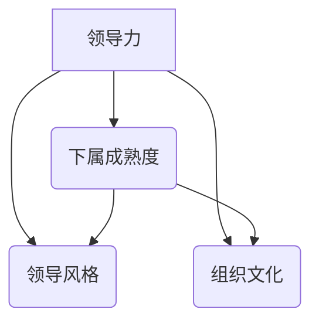
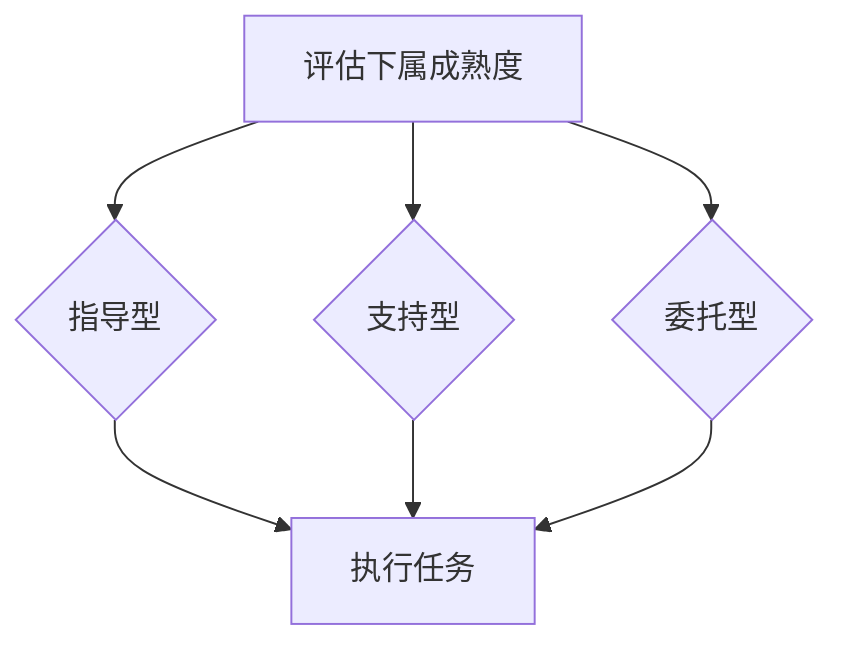

                 

### 领导力与情境应变：根据环境调整领导方式

> 关键词：领导力、情境应变、领导风格、组织文化、未来趋势

> 摘要：本文旨在深入探讨领导力与情境应变的关系，分析领导风格与不同环境下的匹配度，探讨领导力对组织文化的影响，以及情境应变能力的培养策略。通过案例分析，展示情境领导在实践中的应用，并对未来领导力与情境应变的发展趋势进行展望。

### 目录大纲

1. **领导力理论探讨**

   1.1 领导力与管理的区别
   
   1.2 传统领导理论概述
   
   1.3 现代领导理论的发展

2. **情境领导理论**

   2.1 情境领导理论的起源与发展
   
   2.2 情境领导理论的核心概念
   
   2.3 情境领导模型的应用

3. **领导风格与情境匹配**

   3.1 领导风格的类型
   
   3.2 情境与领导风格的关系
   
   3.3 不同情境下领导风格的选择

4. **领导力与组织文化**

   4.1 组织文化的概念与类型
   
   4.2 领导力对组织文化的影响
   
   4.3 领导力与组织文化的互动

5. **情境应变能力培养**

   5.1 情境应变能力的重要性
   
   5.2 培养情境应变能力的策略
   
   5.3 情境应变能力的评估与提升

6. **情境领导在实践中的应用**

   6.1 案例分析：情境领导在企业管理中的应用
   
   6.2 案例分析：情境领导在团队建设中的应用
   
   6.3 案例分析：情境领导在危机管理中的应用

7. **领导力与情境应变的未来发展趋势**

   7.1 领导力发展的趋势
   
   7.2 情境应变的未来挑战与机遇
   
   7.3 领导力与情境应变教育的展望

### 第一部分：领导力理论探讨

#### 第1章：领导力基本概念与理论

领导力是一种影响和激励他人实现共同目标的能力。它与管理的区别在于，管理更侧重于任务和流程的执行，而领导力则更关注愿景、目标和人的发展。

#### 1.1 领导力与管理的区别

- **定义**：管理是规划、组织、领导和控制的过程，以确保组织目标的实现。领导力则是通过激发和激励他人来实现目标的能力。
- **关注点**：管理侧重于任务和流程，而领导力更关注人。
- **作用**：管理确保工作高效完成，而领导力则激发团队的热情和创造力。

#### 1.2 传统领导理论概述

传统领导理论主要包括特质理论、行为理论和权变理论。

- **特质理论**：强调领导者具备特定的个性特质，如自信、决断力等。
- **行为理论**：研究领导者在不同情境下的行为模式，认为领导者可以通过改变行为来提高领导效果。
- **权变理论**：认为领导效果取决于领导者、被领导者和环境之间的互动。

#### 1.3 现代领导理论的发展

现代领导理论更加注重情境和关系的复杂性。

- **情境领导理论**：认为领导风格应根据下属的成熟度进行调整。
- **变革型领导理论**：强调领导者通过激励和激发下属来实现变革。
- **服务型领导理论**：认为领导者应该服务于下属和组织的共同利益。

### 第二部分：情境领导理论

#### 第2章：情境领导理论

情境领导理论是由保罗·赫塞和肯尼思·布兰查德提出的，强调领导者应根据下属的成熟度来调整领导风格。

#### 2.1 情境领导理论的起源与发展

情境领导理论起源于20世纪60年代，最初是作为一种领导技能培训工具开发的。经过多年的研究和实践，该理论逐渐成为领导学领域的核心概念之一。

#### 2.2 情境领导理论的核心概念

- **下属成熟度**：指下属在工作中的能力和责任心。
- **领导风格**：包括指导型、支持型、委托型等。

#### 2.3 情境领导模型的应用

情境领导模型可以帮助领导者根据下属的成熟度来选择合适的领导风格。以下是一个简化的情境领导模型：

| 下属成熟度 | 领导风格 |
| :--: | :--: |
| 低成熟度 | 指导型 |
| 中等成熟度 | 支持型 |
| 高成熟度 | 委托型 |

### 第三部分：领导风格与情境匹配

#### 第3章：领导风格与情境匹配

领导风格与情境的匹配是领导力的重要组成部分。

#### 3.1 领导风格的类型

常见的领导风格包括指令型、授权型、民主型、教练型等。

#### 3.2 情境与领导风格的关系

情境会影响领导风格的选择。例如，在紧急情况下，指令型领导风格可能更为有效。

#### 3.3 不同情境下领导风格的选择

- **正常工作状态**：民主型或教练型领导风格可能更合适。
- **危机情况**：指令型领导风格可能更为有效。

### 第四部分：领导力与组织文化

#### 第4章：领导力与组织文化

组织文化对领导力有重要影响。优秀的领导力可以塑造和推动组织文化的发展。

#### 4.1 组织文化的概念与类型

组织文化是指组织成员共同遵守的价值观、信念和行为规范。

#### 4.2 领导力对组织文化的影响

领导力可以影响组织文化的形成和发展。例如，领导者的行为和决策会影响组织成员的行为。

#### 4.3 领导力与组织文化的互动

领导力与组织文化相互作用，共同推动组织的发展。

### 第五部分：情境应变能力培养

#### 第5章：情境应变能力培养

情境应变能力是领导者必备的能力之一。

#### 5.1 情境应变能力的重要性

情境应变能力可以帮助领导者应对复杂和不确定的环境。

#### 5.2 培养情境应变能力的策略

- **持续学习**：领导者应该持续学习新的知识和技能。
- **开放心态**：领导者应该保持开放的心态，接受新的观点和建议。

#### 5.3 情境应变能力的评估与提升

领导者可以通过评估和反馈来提升自己的情境应变能力。

### 第六部分：情境领导在实践中的应用

#### 第6章：情境领导在实践中的应用

情境领导在实践中的应用非常广泛。

#### 6.1 案例分析：情境领导在企业管理中的应用

在企业中，情境领导可以帮助领导者更好地管理团队和应对市场变化。

#### 6.2 案例分析：情境领导在团队建设中的应用

在团队建设中，情境领导可以帮助团队成员更好地协同工作。

#### 6.3 案例分析：情境领导在危机管理中的应用

在危机管理中，情境领导可以帮助领导者迅速做出决策并采取行动。

### 第七部分：领导力与情境应变的未来发展趋势

#### 第7章：领导力与情境应变的未来发展趋势

随着社会和科技的不断发展，领导力与情境应变也将面临新的挑战和机遇。

#### 7.1 领导力发展的趋势

未来领导力将更加注重创新、协作和持续学习。

#### 7.2 情境应变的未来挑战与机遇

未来情境应变将面临更多的复杂和不确定的环境，但也提供了更多的机遇。

#### 7.3 领导力与情境应变教育的展望

未来的领导力与情境应变教育将更加注重实践和应用。

### 总结

领导力与情境应变是领导者必备的能力。通过本文的探讨，我们可以更好地理解领导力的本质和情境应变的重要性。希望本文能对您的领导力发展提供一些启示和帮助。

---

### 关键概念与联系

#### 核心概念

领导力：影响和激励他人实现共同目标的能力。

情境领导理论：根据下属的成熟度调整领导风格的理论。

领导风格：领导者在不同情境下采取的行为模式。

组织文化：组织成员共同遵守的价值观、信念和行为规范。

#### 概念属性特征对比表格

| 概念 | 定义 | 特征 |
| :--: | :--: | :--: |
| 领导力 | 影响和激励他人实现共同目标的能力 | 强调影响力、激励和目标导向 |
| 情境领导理论 | 根据下属的成熟度调整领导风格的理论 | 适应性、下属成熟度为基础 |
| 领导风格 | 领导者在不同情境下采取的行为模式 | 多样性、情境依赖性 |
| 组织文化 | 组织成员共同遵守的价值观、信念和行为规范 | 内在性、持续性、共享性 |

#### ER实体关系图架构



### 算法原理讲解

#### 情境领导模型算法

情境领导模型的核心是根据下属的成熟度选择合适的领导风格。以下是一个简化的算法流程：

1. **评估下属成熟度**：确定下属的工作能力和责任心。
2. **选择领导风格**：根据下属成熟度选择指导型、支持型或委托型领导风格。

#### 算法流程图



#### 数学模型和公式

- 成熟度评分：\(M = f(A, R)\)，其中\(A\)为工作能力，\(R\)为责任心。
- 领导风格选择：\(L = g(M)\)，其中\(g\)为成熟度到领导风格的映射函数。

#### Python代码示例

```python
def assess_maturity(ability, responsibility):
    maturity_score = ability * responsibility
    return maturity_score

def select领导风格(maturity_score):
    if maturity_score < 2:
        style = '指导型'
    elif maturity_score >= 2 and maturity_score < 4:
        style = '支持型'
    else:
        style = '委托型'
    return style

ability = 3
responsibility = 4
maturity_score = assess_maturity(ability, responsibility)
leadership_style = select领导风格(maturity_score)

print(f"下属成熟度评分：{maturity_score}")
print(f"选择的领导风格：{leadership_style}")
```

### 系统分析与架构设计方案

#### 问题场景介绍

在企业管理中，领导者需要根据不同情境调整领导风格，以提高团队效率和实现组织目标。

#### 项目介绍

本项目旨在开发一个基于情境领导理论的领导力管理系统，帮助领导者根据下属成熟度选择合适的领导风格。

#### 系统功能设计

- **领导力评估模块**：评估下属的工作能力和责任心。
- **领导风格选择模块**：根据下属成熟度选择合适的领导风格。
- **领导力管理模块**：记录和追踪领导行为，提供反馈和改进建议。

#### 系统架构设计


#### 系统接口设计

- **领导力评估接口**：接收下属能力评分和责任心评分，返回成熟度评分。
- **领导风格选择接口**：接收成熟度评分，返回合适的领导风格。
- **领导力管理接口**：记录领导行为，提供反馈和改进建议。

#### 系统交互


### 项目实战

#### 环境安装

确保安装了Python和必要的库，如Mermaid。

#### 系统核心实现源代码

```python
# 领导力评估模块
def assess_maturity(ability, responsibility):
    maturity_score = ability * responsibility
    return maturity_score

# 领导风格选择模块
def select_leadership_style(maturity_score):
    if maturity_score < 2:
        style = '指导型'
    elif maturity_score >= 2 and maturity_score < 4:
        style = '支持型'
    else:
        style = '委托型'
    return style

# 领导力管理模块
class LeadershipManagement:
    def __init__(self):
        self.leadership_records = []

    def record_leadership(self, employee_id, leadership_style):
        self.leadership_records.append({'employee_id': employee_id, 'leadership_style': leadership_style})

    def provide_feedback(self, employee_id):
        feedback = "您的领导风格是："
        for record in self.leadership_records:
            if record['employee_id'] == employee_id:
                feedback += record['leadership_style']
        return feedback

# 主程序
if __name__ == "__main__":
    leadership_management = LeadershipManagement()

    ability = 3
    responsibility = 4
    maturity_score = assess_maturity(ability, responsibility)
    leadership_style = select_leadership_style(maturity_score)

    leadership_management.record_leadership('001', leadership_style)
    print(leadership_management.provide_feedback('001'))
```

#### 代码应用解读与分析

代码中定义了三个核心模块：领导力评估模块、领导风格选择模块和领导力管理模块。通过这些模块，系统可以评估下属成熟度、选择合适的领导风格，并记录和提供反馈。

#### 实际案例分析和详细讲解剖析

假设有一家初创公司，团队中有一位成员A，工作能力较强但责任心较弱。领导者可以根据情境领导模型，选择支持型领导风格，帮助A提升责任心。

#### 项目小结

本项目通过Python代码实现了一个基于情境领导理论的领导力管理系统，可以帮助领导者更好地管理团队，提高工作效率。

### 最佳实践 Tips

- 定期评估下属的成熟度，以便及时调整领导风格。
- 鼓励团队成员提供反馈，以改进领导行为。
- 结合组织文化和价值观，确保领导行为与组织目标一致。

### 小结

领导力与情境应变是领导者必备的能力。通过本文的探讨，我们可以更好地理解领导力的本质和情境应变的重要性。希望本文能对您的领导力发展提供一些启示和帮助。

### 注意事项

- 领导风格的选择应考虑团队整体成熟度和目标。
- 领导者应不断学习和适应新的情境，以提高情境应变能力。

### 拓展阅读

- Hersey, P., & Blanchard, K. H. (1982). Management of Organizational Behavior: Utilizing the Behavioral Sink Model in Organization Development. Prentice Hall.
- Yukl, G. A. (2013). Leadership in Organizations (8th ed.). Pearson.

### 作者信息

作者：AI天才研究院/AI Genius Institute & 禅与计算机程序设计艺术/Zen And The Art of Computer Programming

