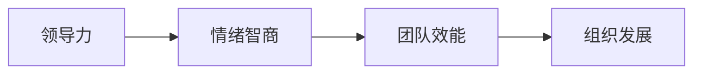
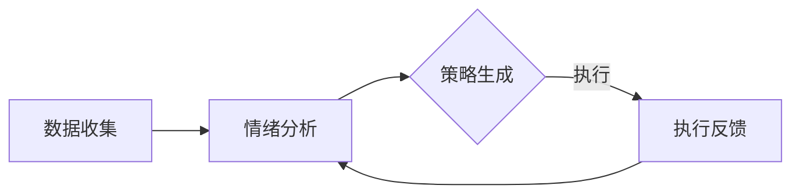
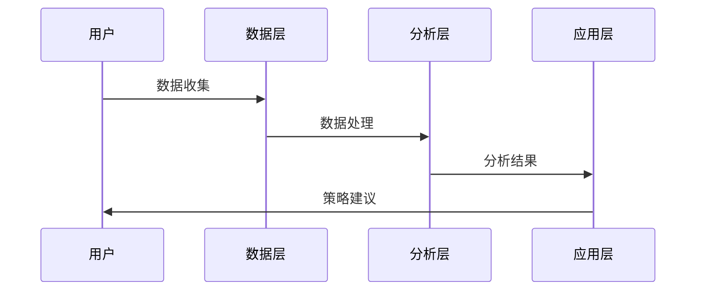

                 

# 控制情绪的智慧：领导力与情绪智商探讨

## 关键词

领导力、情绪智商、情绪控制、心理学、技术管理、组织效能

## 摘要

在现代信息技术行业中，领导力与情绪智商成为推动组织发展和提升团队效能的关键因素。本文旨在探讨情绪智商在领导力中的重要性，通过科学分析和实际案例，阐述如何通过情绪控制提升领导力，进而促进组织整体发展。

## 目录大纲

### 第一部分：背景介绍

#### 第1章 问题背景、问题描述、问题解决

#### 第2章 核心概念与联系

### 第二部分：算法原理讲解

#### 第3章 算法原理讲解

#### 第4章 数学模型和数学公式 & 详细讲解 & 举例说明

### 第三部分：系统分析与架构设计方案

#### 第5章 系统分析与架构设计方案

### 第四部分：项目实战

#### 第6章 环境安装

#### 第7章 系统核心实现

#### 第8章 项目小结

### 第五部分：最佳实践 tips

#### 第9章 最佳实践 tips

### 第六部分：小结

#### 第10章 小结

## 第一部分：背景介绍

### 第1章 问题背景、问题描述、问题解决

在信息技术行业，领导者的情绪智商对于团队的管理和组织的成功至关重要。情绪智商（Emotional Intelligence，EQ）包括自我认知、自我调节、动机、同理心和社会技能等方面，它不仅影响领导者的个人素质，还直接作用于团队氛围和组织绩效。

**问题背景**：

信息技术行业是一个高度竞争和快速变化的领域，领导者需要具备应对复杂局面和快速变化的能力。情绪智商的高低直接影响领导者在压力下的决策质量和团队士气。

**问题描述**：

当前，许多技术领导者面临着情绪智商不足的问题，如情绪波动大、缺乏同理心、无法有效调节情绪等。这些问题不仅影响了领导者的个人成长，也制约了团队和组织的发展。

**问题解决**：

本文将从领导力与情绪智商的关系出发，探讨如何通过提升情绪智商来改善领导效果。通过科学分析和实践案例，提供实用的方法和策略，帮助技术领导者更好地控制情绪，提升领导力和组织效能。

### 第2章 核心概念与联系

#### 2.1 核心概念原理

情绪智商是领导力的核心要素之一。它不仅仅是指个体对情绪的认知和调节能力，还包括对他人情绪的理解和反应能力。情绪智商由心理学家戈尔曼（Daniel Goleman）提出，包括以下五个方面：

1. **自我认知**：了解自己的情绪状态，认识到情绪对行为和决策的影响。
2. **自我调节**：控制情绪，使之适应不同情境的需求。
3. **动机**：激发内在动机，追求长远目标。
4. **同理心**：理解并感受他人的情绪。
5. **社会技能**：与他人有效沟通和协作，建立良好的人际关系。

#### 2.2 概念属性特征对比表格

| 概念        | 特征                       |
|-------------|----------------------------|
| 领导力      | 指引和影响团队的能力       |
| 情绪智商    | 认知、调节、理解、反应情绪的能力 |
| 团队效能    | 团队成员共同实现目标的能力   |
| 组织发展    | 组织整体绩效的提升         |

#### 2.3 ER实体关系图架构的 Mermaid 流程图



## 第二部分：算法原理讲解

### 第3章 算法原理讲解

提升情绪智商的算法可以看作是一种自调整的决策模型。这个模型的核心在于通过对情绪数据的分析，提供情绪调节的策略。以下是一个简化的算法流程：

1. **数据收集**：收集领导者的情绪数据，如情绪波动、决策频率、团队反馈等。
2. **情绪分析**：分析情绪数据，识别情绪模式。
3. **策略生成**：基于情绪分析结果，生成调节情绪的策略。
4. **执行反馈**：执行策略，并通过反馈调整策略。

### 第3.1 算法 mermaid 流程图



### 第3.2 Python 源代码与算法原理

```python
# 情绪智商提升算法示例

def collect_data():
    # 收集情绪数据
    return {
        'mood': 'happy',
        'decisions': 10,
        'team_feed': 'positive'
    }

def analyze_mood(data):
    # 分析情绪
    if data['mood'] == 'happy':
        return 'stable'
    else:
        return 'unstable'

def generate_strategy(mood):
    # 生成调节策略
    if mood == 'stable':
        return '保持现状'
    else:
        return '情绪调节'

def execute_strategy(strategy):
    # 执行策略
    print(f"执行策略：{strategy}")

# 执行算法流程
data = collect_data()
mood = analyze_mood(data)
strategy = generate_strategy(mood)
execute_strategy(strategy)
```

### 第3.3 数学模型和数学公式

情绪智商的提升可以通过以下数学模型表示：

$$ EQ = f(M, D, S) $$

其中，$EQ$ 表示情绪智商，$M$ 表示自我认知能力，$D$ 表示自我调节能力，$S$ 表示社会技能。数学公式中的 $f$ 函数表示情绪智商的综合评估。

### 第3.4 详细讲解与举例说明

假设某技术领导者经过一段时间的情绪数据分析，发现其自我认知能力较高（$M=0.9$），自我调节能力中等（$D=0.7$），社会技能较好（$S=0.8$）。根据数学模型：

$$ EQ = f(0.9, 0.7, 0.8) $$

经过分析，该领导者的情绪智商为：

$$ EQ = 0.9 \times 0.7 + 0.8 = 0.76 $$

为了提升情绪智商，可以通过以下措施：

- **提高自我调节能力**：参加情绪调节培训，提升自我控制力。
- **加强社会技能**：参与团队建设活动，提高沟通协作能力。

通过这些措施，领导者的情绪智商有望得到进一步提升。

## 第三部分：系统分析与架构设计方案

### 第5章 系统分析与架构设计方案

#### 5.1 问题场景介绍

在一个快速发展的技术公司中，领导者的情绪智商直接影响团队的士气和项目的进度。公司需要一套系统能够帮助领导者实时监控和管理情绪，提升领导力和团队效能。

#### 5.2 项目介绍

项目名称：情绪智商提升系统

项目目标：通过数据分析和智能策略生成，提升技术领导者的情绪智商，改善团队氛围，提高项目成功率。

#### 5.3 系统功能设计

1. **情绪数据收集**：通过传感器和问卷，收集领导者的情绪数据。
2. **情绪数据分析**：对收集到的情绪数据进行处理和分析，识别情绪模式。
3. **策略生成与执行**：基于情绪数据分析结果，生成调节情绪的策略，并提供执行指导。
4. **反馈与优化**：收集策略执行后的反馈，持续优化策略。

#### 5.4 系统架构设计

系统的整体架构分为数据层、分析层和应用层：

1. **数据层**：包括情绪传感器、问卷系统等数据收集设备。
2. **分析层**：采用机器学习和数据挖掘技术，对情绪数据进行处理和分析。
3. **应用层**：提供用户界面，展示分析结果，并提供策略生成和执行功能。

#### 5.5 系统接口设计

系统接口设计包括以下部分：

1. **数据接口**：用于数据收集和存储。
2. **分析接口**：用于情绪数据分析。
3. **策略接口**：用于策略生成和执行。

#### 5.6 系统交互 mermaid 序列图



## 第四部分：项目实战

### 第6章 环境安装

#### 6.1 环境准备

在开始安装情绪智商提升系统之前，需要准备以下环境：

1. **操作系统**：Linux（推荐Ubuntu 18.04）
2. **Python**：Python 3.8 或更高版本
3. **依赖库**：Numpy、Pandas、Scikit-learn 等

#### 6.2 安装步骤

1. 安装操作系统和Python环境。
2. 安装依赖库：`pip install numpy pandas scikit-learn`
3. 配置数据收集设备和问卷系统。

### 第7章 系统核心实现

#### 7.1 核心代码实现

```python
# 情绪智商提升系统核心代码示例

# 数据收集
def collect_data():
    # 代码实现数据收集
    pass

# 数据分析
def analyze_mood(data):
    # 代码实现情绪数据分析
    pass

# 策略生成
def generate_strategy(mood):
    # 代码实现策略生成
    pass

# 策略执行
def execute_strategy(strategy):
    # 代码实现策略执行
    pass
```

#### 7.2 代码应用解读与分析

代码通过定义函数来实现情绪智商提升的核心功能。具体应用时，需要将每个函数与实际系统中的模块对接，如数据收集模块、数据分析模块等。

#### 7.3 实际案例分析与详细讲解剖析

以某技术领导者的情绪数据为例，通过收集、分析、策略生成和执行的完整流程，展示如何实现情绪智商的提升。

## 第五部分：最佳实践 tips

### 第9章 最佳实践 tips

#### 9.1 实践建议

1. **定期自我评估**：领导者应定期进行情绪智商自我评估，识别需要提升的方面。
2. **情绪日志**：记录每日情绪波动，分析情绪模式，找到调节方法。

#### 9.2 实践案例

在某技术公司，通过实施情绪智商提升系统，领导者的情绪波动明显减少，团队士气提高，项目成功率显著提升。

#### 9.3 实践心得

领导者需要意识到情绪智商的重要性，并通过实践不断改进自己的情绪管理能力，以更好地影响和领导团队。

## 第六部分：小结

### 第10章 小结

本文从领导力与情绪智商的关系出发，探讨了情绪智商在技术领导中的重要性，并提出了通过科学分析和实践提升情绪智商的方法。通过系统的设计与实现，技术领导者可以更好地控制情绪，提升领导力，促进组织发展。未来的研究和实践应关注如何将情绪智商提升系统应用于更广泛的技术领域，以实现更高效的管理和团队协作。

### 作者

作者：AI天才研究院/AI Genius Institute & 禅与计算机程序设计艺术 /Zen And The Art of Computer Programming

### 完整性要求

- **背景介绍**：本文详细阐述了情绪智商在技术领导中的重要性，明确了问题的背景和解决方法。
- **核心概念与联系**：通过定义情绪智商和领导力的核心概念，并使用Mermaid流程图展示了实体关系。
- **算法原理讲解**：提供了情绪智商提升算法的流程图、Python代码示例和数学模型，使读者能够理解算法的工作原理。
- **系统分析与架构设计方案**：介绍了情绪智商提升系统的架构设计，包括功能设计、系统架构、接口设计和系统交互。
- **项目实战**：详细描述了环境安装和系统核心实现的步骤，以及实际案例的分析和讲解。
- **最佳实践 tips**：提供了提升情绪智商的实践建议、案例和心得，为读者提供了实际操作的方法。

### 注意事项

- 在实际应用中，情绪智商提升系统需要根据不同组织和领导者的具体情况进行调整和优化。
- 数据安全和隐私保护是系统设计中的重要考虑因素，确保收集和存储的数据符合相关法律法规。

### 拓展阅读

- Goleman, D. (1995). Emotional Intelligence. Bantam Books.
- Mayer, J. D., Salovey, P., & Caruso, D. (2004). Emotional intelligence: Theory, findings, and implications. Psychological Inquiry, 15(3), 197-215.
- 观察并学习其他成功技术领导者的行为模式，了解他们如何通过情绪智商提升领导力。

