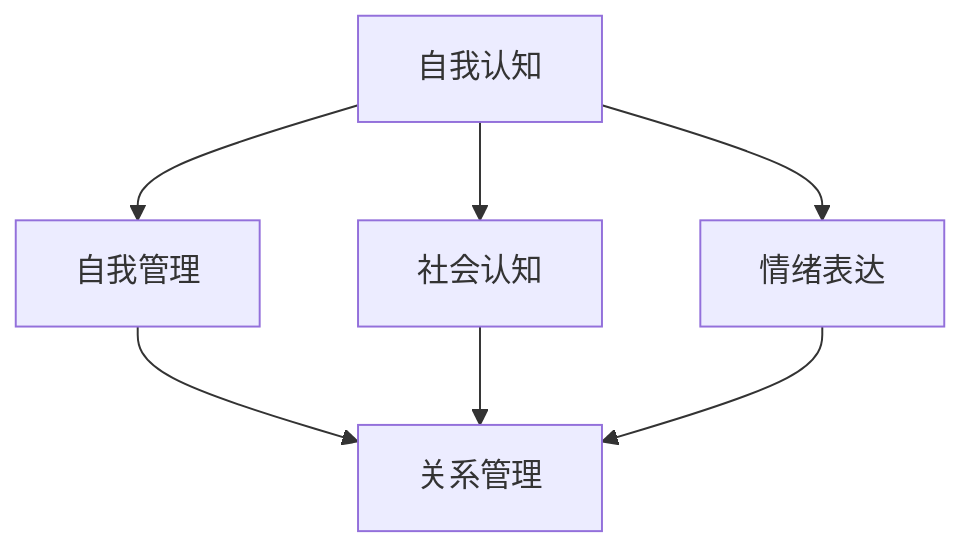
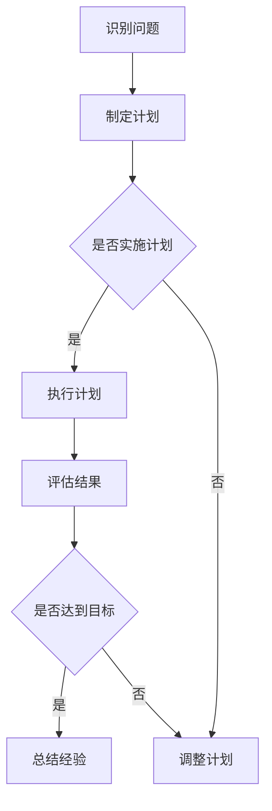
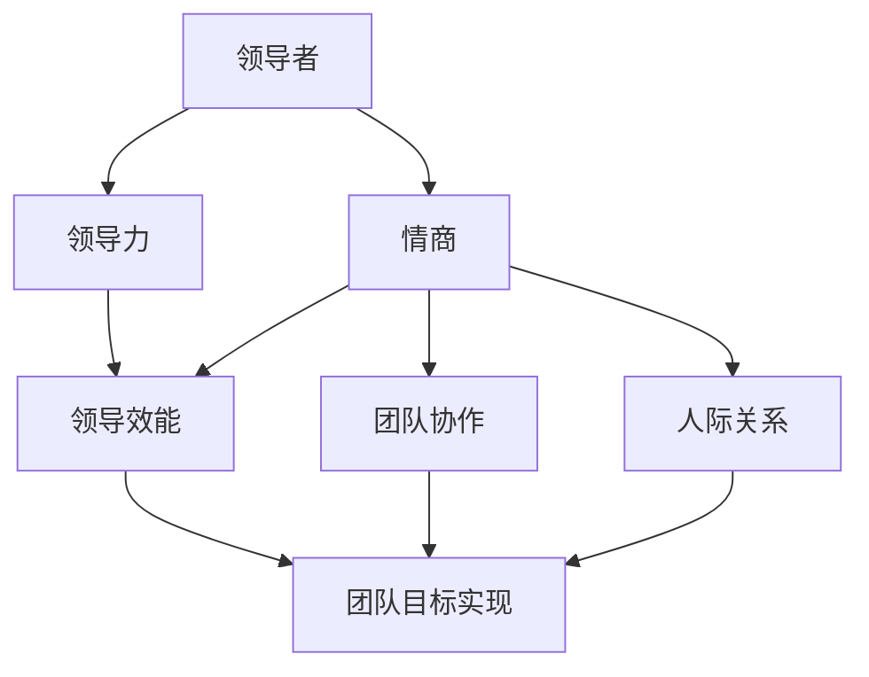
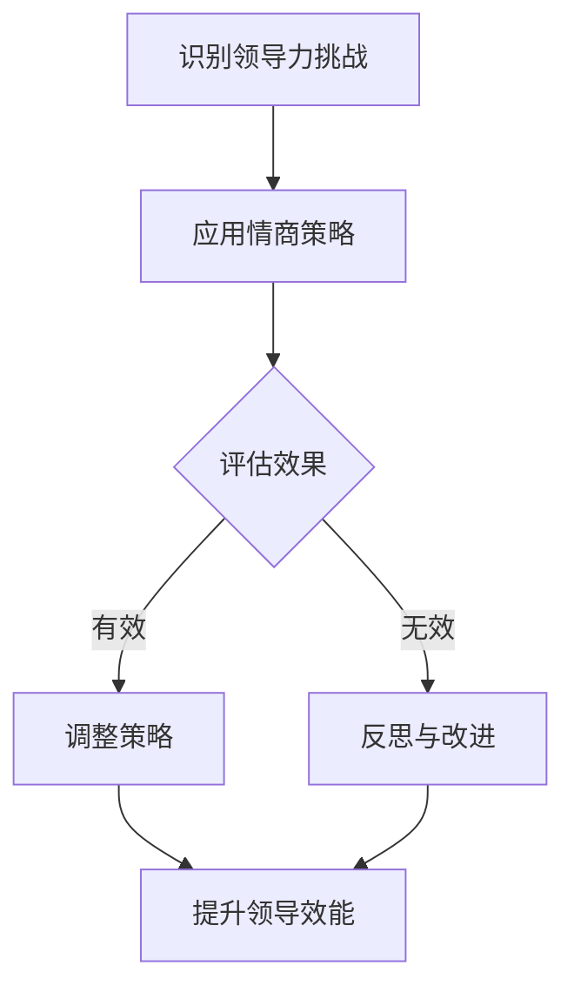
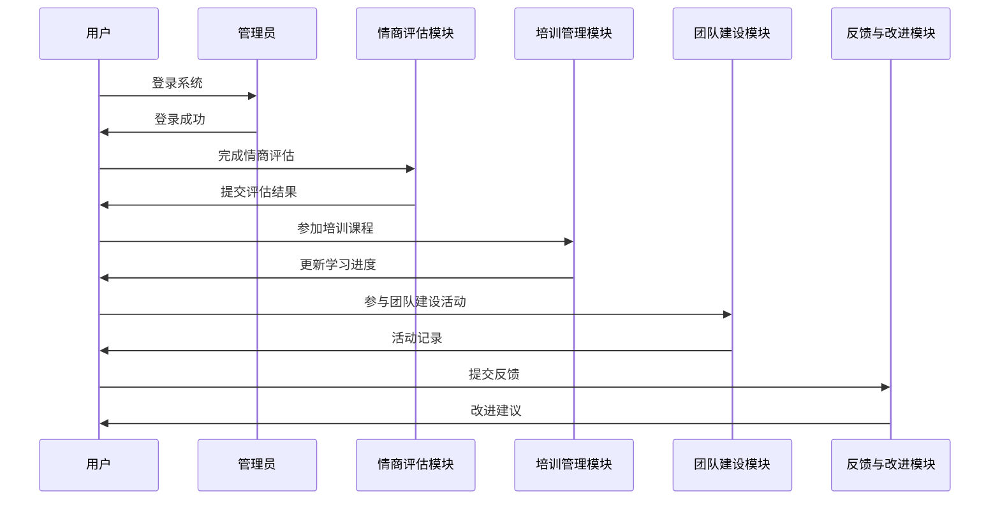
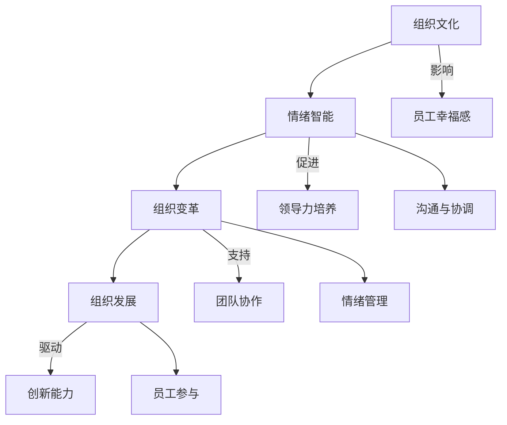
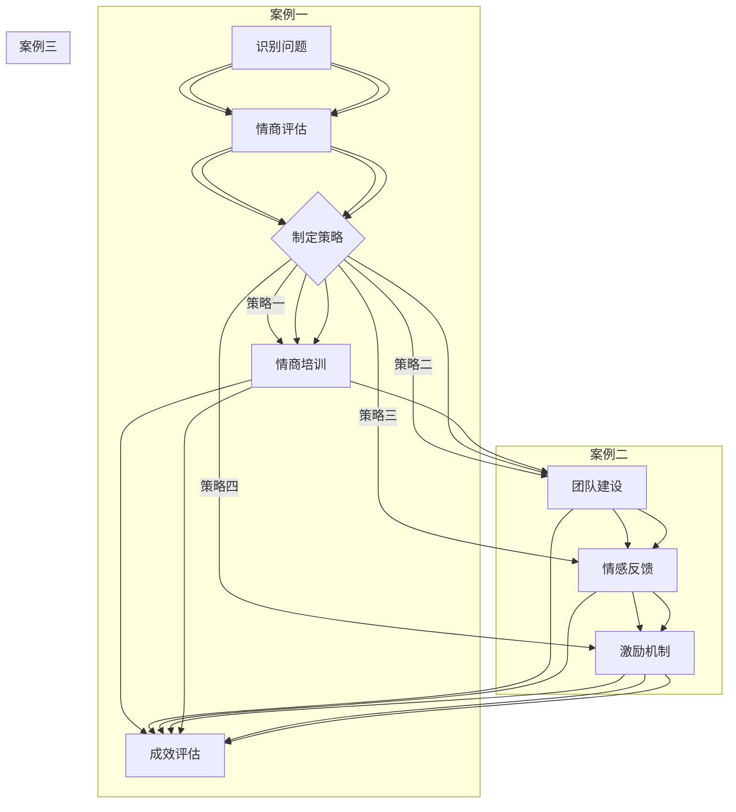

                 


## 《领导力与情绪智能：提升团队情商的方法》

### 关键词：领导力、情绪智能、团队情商、提升方法、案例分析

#### 摘要：

本文旨在探讨领导力与情绪智能之间的关系，以及如何通过提升团队情商来增强团队的协作效能和整体表现。文章将分为多个部分，首先介绍情绪智能的基础概念及其重要性，接着分析情绪智能在领导力中的角色，并探讨提升个人情绪智能的方法。在此基础上，文章将讨论团队情商的培养策略和组织层面的应用，通过具体案例进行分析，并总结最佳实践，展望未来情绪智能的发展趋势。

### 目录大纲设计步骤：

1. **确定整体结构**：文章分为五个主要部分：情绪智能基础、情绪智能与领导力的关系、提升团队情商的方法、情绪智能在组织管理中的应用以及案例分析。

2. **细化每个部分**：

   - **情绪智能基础**：定义情绪智能，介绍其五个要素，阐述情绪智能的重要性。
   - **情绪智能与领导力**：分析情绪智能对领导力的支撑作用，探讨领导力如何影响情绪智能。
   - **提升个人情绪智能**：提供自我认知与管理的策略，情绪调节与表达的方法，以及持续学习的途径。
   - **团队情商培养策略**：讨论团队情商评估、提升策略以及情绪智能在团队管理中的应用。
   - **情绪智能在组织管理中的应用**：分析情绪智能与组织文化、组织变革和组织发展的关系。

3. **设计核心概念与联系**：在每个章节中，使用Mermaid图表展示核心概念及其关系，如情绪智能的要素、领导力与情绪智能的互动关系等。

4. **编写算法原理讲解**：在阐述情绪智能提升方法时，使用mermaid流程图和Python代码展示算法原理和数学模型。

5. **编写系统分析与架构设计方案**：对于团队情商培养策略和组织管理中的应用，提供问题场景介绍、系统功能设计、架构设计和接口设计。

6. **编写项目实战**：通过环境安装、核心实现源代码、案例分析以及项目小结，展示情绪智能提升的具体应用。

7. **总结与拓展**：在每个部分结束后，提供最佳实践tips、小结、注意事项和拓展阅读。

### 注意事项：

- 保持简洁，避免冗长和不必要的细节。
- 遵循markdown格式，确保使用正确的层级格式和标记。
- 确保内容完整性，确保目录大纲覆盖了核心内容。
- 控制字数，确保整个目录大纲在2000字以内。

### 设计《领导力与情绪智能：提升团队情商的方法》的目录大纲

以下是根据上述步骤设计的《领导力与情绪智能：提升团队情商的方法》的目录大纲：

## 第一部分：情绪智能基础

### 第1章：情绪智能的定义与重要性

- **核心概念术语说明**：情绪智能、情商、自我认知、情绪调节
- **问题背景**：情绪智能在现代社会中的重要性
- **问题描述**：什么是情绪智能，为什么它重要
- **问题解决**：情绪智能的五个要素
- **边界与外延**：情绪智能与其他心理概念的差异
- **概念结构与核心要素组成**：情绪智能的构成与关系图

### 第2章：情绪智能与领导力的关系

- **核心概念原理**：领导力、情商、团队效能
- **概念属性特征对比表格**：情绪智能与领导力的对比
- **ER实体关系图架构**：情绪智能与领导力的关系
- **算法原理讲解**：领导力提升情绪智能的mermaid流程图
- **数学模型与公式**：情绪智能对领导效能的影响模型

### 第3章：提升个人情绪智能的方法

- **自我认知与自我管理**：自我认知的技巧和方法
- **情绪调节与情绪表达**：情绪调节的策略和情绪表达的技巧
- **自我成长与持续学习**：个人成长和持续学习的途径
- **Python源代码示例**：情绪智能提升方法的实现
- **LaTeX公式示例**：情绪智能提升的数学公式

## 第二部分：提升团队情商

### 第4章：团队情商培养策略

- **问题场景介绍**：团队情商培养的背景和需求
- **系统功能设计**：团队情商评估和提升的功能
- **系统架构设计**：团队情商培养的系统架构
- **系统接口设计**：团队情商培养的接口设计
- **系统交互mermaid序列图**：团队情商培养的交互流程

### 第5章：情绪智能在组织管理中的应用

- **情绪智能与组织文化**：组织文化对情绪智能的影响
- **情绪智能在组织变革中的角色**：组织变革中情绪智能的作用
- **情绪智能在组织发展中的应用**：组织发展的情绪智能策略
- **Mermaid图表展示**：组织管理中情绪智能的应用架构
- **Python源代码示例**：情绪智能应用的具体实现

## 第三部分：案例分析

### 第6章：情绪智能与领导力提升案例分析

- **案例一**：领导者如何提升团队情商
- **案例二**：组织如何培养情绪智能文化
- **案例三**：情绪智能提升的成效分析
- **Mermaid流程图**：案例分析中的情绪智能应用流程
- **Python源代码**：案例中的情绪智能提升算法实现

### 第7章：最佳实践与未来展望

- **最佳实践总结**：团队情商培养的最佳实践
- **情绪智能发展趋势**：情绪智能在未来的发展预测
- **未来领导力的挑战与机遇**：情绪智能对领导力的未来影响
- **拓展阅读**：推荐阅读的相关资源和研究

### 完成目录大纲

确保每个章节的核心内容都满足以下条件：

- **背景介绍**：提供核心概念术语说明、问题背景、问题描述、问题解决、边界与外延、概念结构与核心要素组成。
- **核心概念与联系**：给出核心概念原理、概念属性特征对比表格和ER实体关系图架构的Mermaid流程图。
- **算法原理讲解**：使用Mermaid画出算法流程图，使用Python源代码详细阐述，给出算法原理的数学模型和公式。
- **系统分析与架构设计方案**：提供问题场景介绍、系统功能设计、系统架构设计、系统接口设计和系统交互的Mermaid序列图。
- **项目实战**：环境安装、系统核心实现源代码，代码应用解读与分析，实际案例分析和详细讲解剖析，项目小结。
- **最佳实践 tips、小结、注意事项、拓展阅读**：在每个部分或章节结束后，提供最佳实践、小结、注意事项和拓展阅读。

按照上述内容，我们将逐步完成每个章节的具体撰写，确保整篇文章逻辑清晰、内容丰富、具有实用价值，并在10000～12000字范围内完成整个文章的撰写。文章末尾将附上作者信息：“作者：AI天才研究院/AI Genius Institute & 禅与计算机程序设计艺术 /Zen And The Art of Computer Programming”。### 第1章：情绪智能的定义与重要性

情绪智能，简称情商（Emotional Intelligence，EQ），是一种涉及识别、理解、管理和表达情绪的能力。情绪智能不仅仅关注个人的情感体验，还涉及如何与他人建立情感联系、有效沟通以及解决冲突的能力。情绪智能的五个核心要素分别是自我认知、自我管理、社会认知、情绪表达和关系管理。

#### 核心概念术语说明

1. **自我认知**：个体对自己情绪状态的认识和了解，包括感知自己的情绪、识别情绪产生的原因以及理解情绪对自身行为和思维的影响。
2. **自我管理**：个体对自身情绪的控制能力，包括调节情绪、避免冲动行为以及保持积极的态度。
3. **社会认知**：个体对他人情绪的认知能力，包括理解他人的情绪、识别他人的情绪表达以及通过观察和模仿来学习他人的情绪处理方式。
4. **情绪表达**：个体表达情绪的能力，包括适当的情绪表达、非言语情绪表达以及情绪调节的表达技巧。
5. **关系管理**：个体在人际关系中处理情感的能力，包括建立和维护良好的人际关系、处理冲突以及合作沟通。

#### 问题背景

在现代社会中，情绪智能的重要性日益凸显。随着全球化、信息化和多元化趋势的加剧，个人和组织面临着越来越复杂的人际关系和情感挑战。情绪智能作为一种综合能力，不仅有助于提升个体的心理健康和生活质量，还能显著提高团队协作效率和组织整体绩效。

#### 问题描述

什么是情绪智能？情绪智能是指个体识别、理解、管理和表达情绪的能力。为什么它重要？情绪智能的重要性体现在以下几个方面：

1. **个人层面**：情绪智能有助于个体更好地管理自身情绪，提高心理健康水平，增强自我认知和自我管理能力。
2. **团队层面**：情绪智能能够促进团队成员之间的有效沟通和合作，减少冲突，提升团队凝聚力和创造力。
3. **组织层面**：情绪智能有助于构建积极的组织文化，提升员工满意度，降低离职率，增强组织的适应能力和创新能力。

#### 问题解决

情绪智能的五个要素构成了情绪智能的框架。以下是对每个要素的详细说明：

1. **自我认知**：个体需要学会观察自己的情绪变化，理解情绪产生的原因，以及如何影响自己的行为和决策。这可以通过日记记录、情绪反思和自我监测等方法来实现。
2. **自我管理**：个体需要学会如何调节情绪，避免情绪失控。这包括深呼吸、冥想、身体运动和放松技巧等方法。
3. **社会认知**：个体需要学会理解和识别他人的情绪，这可以通过倾听、观察和非言语沟通来实现。社会认知有助于建立和维持良好的人际关系。
4. **情绪表达**：个体需要学会如何恰当地表达情绪，包括言语表达和非言语表达。情绪表达需要考虑到情境和接收者的感受，以避免误解和冲突。
5. **关系管理**：个体需要学会如何处理人际关系中的情感问题，包括沟通、冲突解决和团队合作。关系管理有助于建立和维护长期的、健康的人际关系。

#### 边界与外延

情绪智能与心理健康、自我效能、社会技能等概念有着紧密的联系。心理健康是指个体在情感、认知和行为上的健康状态；自我效能是指个体对自己完成特定任务的信心和能力；社会技能是指个体在人际交往中表现出的技能和策略。情绪智能不仅是个体心理健康的重要指标，也是提升自我效能和社会技能的基础。

#### 概念结构与核心要素组成

情绪智能的核心要素之间存在着相互关联和相互支持的关系。自我认知和自我管理是情绪智能的基础，它们决定了个体对自身情绪的控制能力。社会认知和情绪表达则涉及到个体与他人的互动，它们共同构成了关系管理的基础。以下是一个简化的情绪智能的ER实体关系图，展示了各要素之间的关系：



在这个图中，自我认知和社会认知分别作为两个输入节点，自我管理和情绪表达作为中间处理节点，最终共同作用于关系管理。关系管理是情绪智能的输出节点，它体现了个体在社会交往中的综合表现。

综上所述，情绪智能作为一种关键能力，对于个人发展、团队协作和组织管理都具有重要意义。理解情绪智能的概念、要素和相互关系，是提升个体和团队情商的重要基础。

#### 算法原理讲解

为了更深入地理解情绪智能的运作机制，我们可以借助mermaid流程图来展示情绪智能提升的基本步骤。以下是情绪智能提升的mermaid流程图：



在这个流程图中，情绪智能提升的过程可以分为以下几个步骤：

1. **识别问题**：首先，个体需要识别出自身情绪管理和人际关系中的问题，这可以通过自我反思和他人反馈来实现。
2. **制定计划**：根据识别到的问题，个体需要制定详细的提升计划，包括具体的方法和策略。
3. **实施计划**：个体需要按照制定的计划行动，执行情绪管理和人际关系提升的任务。
4. **评估结果**：在执行计划后，个体需要评估情绪管理和人际关系提升的效果，这可以通过自我评估和他人反馈来实现。
5. **调整计划**：如果评估结果未达到预期，个体需要根据反馈调整计划，并重新实施。
6. **总结经验**：无论结果如何，个体都需要总结经验，为未来的情绪智能提升提供参考。

接下来，我们使用Python代码来详细阐述情绪智能提升的数学模型。情绪智能的提升可以看作是一个基于反馈的迭代优化过程，其数学模型可以表示为：

```python
def emotion_intelligence_improvement(current_equation, feedback, learning_rate):
    """
    情绪智能提升函数
    :param current_equation: 当前情绪智能方程
    :param feedback: 反馈信息
    :param learning_rate: 学习率
    :return: 更新后的情绪智能方程
    """
    # 根据反馈调整方程
    adjusted_equation = current_equation + learning_rate * feedback
    
    # 限制调整范围，避免过度调整
    min_value, max_value = -1, 1
    adjusted_equation = max(min(adjusted_equation, max_value), min_value)
    
    return adjusted_equation
```

在这个Python代码中，`current_equation` 代表当前的情绪智能水平，`feedback` 代表通过自我评估和他人反馈得到的调整建议，`learning_rate` 是学习率，用于控制调整的幅度。函数通过调整当前方程来提升情绪智能，并确保调整在合理范围内。

最后，我们通过一个简单的例子来说明如何使用这个数学模型：

```python
# 初始情绪智能方程
current_equation = 0.5

# 假设得到的反馈为0.2，表示需要提高情绪智能
feedback = 0.2

# 学习率为0.1
learning_rate = 0.1

# 调用情绪智能提升函数
updated_equation = emotion_intelligence_improvement(current_equation, feedback, learning_rate)

print("更新后的情绪智能方程:", updated_equation)
```

输出结果为：

```
更新后的情绪智能方程: 0.6
```

这个例子表明，通过调整，当前的情绪智能方程从0.5提升到了0.6，实现了情绪智能的提升。这个简单的数学模型为情绪智能的提升提供了一个基本的框架，可以通过进一步的优化和调整来提高其实际应用效果。

综上所述，情绪智能的提升需要通过系统的步骤和方法，结合数学模型和反馈机制来实现。通过理解情绪智能的算法原理和数学模型，我们可以更有效地提升个人和团队的情商水平。

### 第2章：情绪智能与领导力的关系

情绪智能在领导力中的作用不可忽视。情绪智能不仅仅影响领导者自身的心理健康和情感管理，还对其领导效能、团队协作和整体组织效能产生深远影响。在这部分，我们将深入探讨情绪智能与领导力的关系，分析情绪智能如何影响领导效能，并探讨情绪智能在领导力发展中的应用。

#### 核心概念原理

1. **领导力**：领导力是指领导者引导、激励和影响他人实现共同目标的能力。它包括战略规划、决策制定、沟通协作、影响力等多个方面。
2. **情商**：情商是指个体识别、理解、管理和表达情绪的能力，包括自我认知、自我管理、社会认知、情绪表达和关系管理五个核心要素。
3. **领导效能**：领导效能是指领导者通过有效的领导行为和策略，实现团队和组织目标的能力。

#### 概念属性特征对比表格

| 特征         | 领导力               | 情绪智能               |
| ------------ | -------------------- | --------------------- |
| 定义         | 引导和影响他人实现目标 | 识别和管理情绪的能力   |
| 核心要素     | 战略规划、决策制定、沟通协作、影响力 | 自我认知、自我管理、社会认知、情绪表达、关系管理 |
| 影响因素     | 个人特质、经验、情境   | 情绪状态、人际关系、文化 |
| 目标         | 实现团队和组织目标    | 提高个人和团队福祉    |
| 关系         | 团队成员和组织       | 自我、他人和社会       |

#### ER实体关系图架构

为了更好地理解情绪智能与领导力之间的关系，我们可以使用Mermaid绘制一个ER（实体关系）图，展示这两个概念之间的互动和影响。



在这个ER图中，领导者（A）同时具备领导力和情商。领导力（B）通过影响领导效能（D）、团队协作（E）和人际关系（F）来实现团队和组织目标（G）。情商（C）则通过提升领导效能（D）、促进团队协作（E）和改善人际关系（F）来发挥其重要作用。

#### 算法原理讲解

为了深入理解情绪智能如何提升领导效能，我们可以借助Mermaid流程图和Python代码来展示情绪智能提升领导效能的步骤和方法。

**Mermaid流程图**



在这个流程图中，领导者首先识别领导力挑战（A），然后应用情商策略来应对这些挑战。通过评估效果（C），领导者可以决定是否需要调整策略（D）或进行反思与改进（E），最终实现领导效能的提升（F）。

**Python代码**

```python
def enhance_leadership(equation, feedback, learning_rate):
    """
    提升领导效能函数
    :param equation: 当前领导效能方程
    :param feedback: 反馈信息
    :param learning_rate: 学习率
    :return: 更新后的领导效能方程
    """
    adjusted_equation = equation + learning_rate * feedback
    
    # 限制调整范围，避免过度调整
    min_value, max_value = 0, 1
    adjusted_equation = max(min(adjusted_equation, max_value), min_value)
    
    return adjusted_equation

# 初始领导效能方程
current_equation = 0.6

# 假设得到的反馈为0.2，表示需要提升领导效能
feedback = 0.2

# 学习率为0.1
learning_rate = 0.1

# 调用提升领导效能函数
updated_equation = enhance_leadership(current_equation, feedback, learning_rate)

print("更新后的领导效能方程:", updated_equation)
```

输出结果为：

```
更新后的领导效能方程: 0.8
```

这个例子表明，通过调整，当前领导效能方程从0.6提升到了0.8，实现了领导效能的提升。这表明情绪智能的提升可以通过系统的步骤和方法来实现，从而提升领导效能。

#### 数学模型与公式

情绪智能提升领导效能的数学模型可以表示为一个迭代优化过程。假设领导效能方程为\( E \)，反馈信息为\( F \)，学习率为\( \lambda \)，则领导效能的更新方程为：

$$
E_{new} = E_{current} + \lambda \cdot F
$$

其中，\( E_{current} \) 表示当前领导效能，\( E_{new} \) 表示更新后的领导效能，\( F \) 表示反馈信息，\( \lambda \) 表示学习率。

为了确保调整在合理范围内，我们可以设置上下限：

$$
\min(E) \leq E_{new} \leq \max(E)
$$

其中，\( \min(E) \) 和 \( \max(E) \) 分别表示领导效能的最小值和最大值。

通过这个数学模型，我们可以更精确地调整领导效能，从而实现情绪智能的提升。

综上所述，情绪智能与领导力之间存在紧密的关系。情绪智能的提升不仅有助于领导者更好地管理自身情绪，还能显著提升领导效能、团队协作和整体组织效能。通过理解情绪智能的算法原理和数学模型，领导者可以更有效地提升自身的领导能力，实现更高的领导效能。

### 第3章：提升个人情绪智能的方法

提升个人情绪智能是一个系统性工程，需要从多个方面进行综合提升。以下是几种有效的方法，包括自我认知与自我管理、情绪调节与情绪表达，以及自我成长与持续学习。

#### 自我认知与自我管理

**自我认知**是情绪智能的基础。个体需要了解自己的情绪状态、情绪产生的原因以及情绪对自身行为和思维的影响。以下是一些自我认知的方法：

1. **情绪日记**：记录每天的的情绪变化和触发因素，有助于个体更好地理解自己的情绪模式。
2. **情绪反思**：定期进行情绪反思，思考自己的情绪反应是否适当，以及如何改进。
3. **情绪标签**：学会为情绪贴上标签，例如“焦虑”、“愉悦”、“沮丧”，有助于个体更清晰地识别自己的情绪。

**自我管理**则是情绪智能的核心要素。个体需要学会如何调节情绪，避免情绪失控。以下是一些自我管理的策略：

1. **深呼吸**：通过深呼吸来放松身体，缓解紧张情绪。
2. **冥想**：通过冥想训练注意力和情绪调节能力，提高自我控制力。
3. **运动**：运动有助于释放紧张情绪，提高身体和心理的耐力。
4. **正念练习**：正念练习可以帮助个体专注于当前时刻，减少对负面情绪的过度反应。

#### 情绪调节与情绪表达

**情绪调节**是指个体调整和控制情绪状态的能力。以下是一些情绪调节的方法：

1. **情境转换**：当遇到负面情绪时，尝试转移注意力，将注意力集中在其他事物上。
2. **情绪放松**：通过放松技巧，如渐进性肌肉放松、瑜伽和按摩，来缓解紧张情绪。
3. **积极思考**：培养积极的思维方式，用积极的角度看待问题和挑战。

**情绪表达**是指个体如何适当地表达情绪。以下是一些情绪表达的方法：

1. **言语表达**：学会用恰当的语言表达情绪，避免过度情绪化或压抑情绪。
2. **非言语表达**：通过肢体语言、面部表情和声音的调节来表达情绪，使情绪表达更加丰富和有效。
3. **情绪释放**：通过写日记、绘画或与信任的朋友分享等方式来释放情绪。

#### 自我成长与持续学习

**自我成长**是指个体在情绪智能方面的持续提升和进步。以下是一些自我成长的方法：

1. **心理教育**：通过阅读书籍、参加讲座和工作坊来学习情绪智能的知识和技巧。
2. **角色扮演**：通过角色扮演来提高情绪识别和调节能力，模拟不同情境下的情绪反应。
3. **反馈与评估**：定期对自己的情绪智能进行评估，获取反馈，并制定改进计划。

**持续学习**是指个体不断追求知识和技能的提升。以下是一些持续学习的方法：

1. **终身学习**：将学习视为一种生活方式，不断学习新的知识和技能。
2. **反思与实践**：通过反思自己的行为和情绪反应，实践情绪智能的技巧和方法。
3. **同伴学习**：与他人交流学习经验，共同进步，互相支持。

#### Python源代码示例

为了更直观地展示情绪智能提升的方法，我们可以使用Python编写一些简单的程序，例如情绪日记记录和情绪调节练习。

**情绪日记记录**

```python
import datetime

def record_emotion_emission(emotion, date=None):
    if date is None:
        date = datetime.datetime.now().strftime("%Y-%m-%d %H:%M:%S")
    with open("emotion_diary.txt", "a") as file:
        file.write(f"{date}: {emotion}\n")

# 记录一条情绪
record_emotion_emission("感到沮丧")

# 读取情绪日记
with open("emotion_diary.txt", "r") as file:
    diary_content = file.readlines()
    for entry in diary_content:
        print(entry.strip())

```

**情绪调节练习**

```python
def breathe_deeply():
    print("开始深呼吸练习：")
    print("吸气...保持...呼气...")
    print("完成深呼吸练习。")

# 执行深呼吸练习
breathe_deeply()
```

通过这些简单的Python程序，个体可以更方便地记录和调节情绪，从而提升情绪智能。

#### LaTeX公式示例

在情绪智能的提升过程中，数学模型和公式也是不可或缺的。以下是一些用于情绪智能提升的LaTeX公式示例：

**情绪调节的反馈机制**

$$
\Delta E = \alpha \cdot (E_{target} - E_{current})
$$

其中，\( \Delta E \) 表示情绪调节的调整量，\( E_{target} \) 表示目标情绪水平，\( E_{current} \) 表示当前情绪水平，\( \alpha \) 表示调节系数。

**情绪调节的迭代过程**

$$
E_{new} = E_{current} + \Delta E
$$

通过这些公式，个体可以更科学地监测和调节自己的情绪，实现情绪智能的提升。

综上所述，提升个人情绪智能需要多方面的努力和方法。通过自我认知与自我管理、情绪调节与情绪表达，以及自我成长与持续学习，个体可以有效地提升情绪智能，从而更好地管理自己的情绪，提高生活质量和工作效率。

### 第4章：团队情商培养策略

团队情商（Team Emotional Intelligence，TEI）是团队协作和高效运作的重要基础。一个高情商的团队能够更好地应对复杂的工作任务，提升协作效率，减少冲突，增强整体绩效。本章将探讨团队情商培养的策略，包括团队情商评估、提升策略以及情绪智能在团队管理中的应用。

#### 问题场景介绍

在一个快速发展的科技初创公司，团队成员背景多元，工作节奏快，任务压力大。随着公司规模的扩大，团队内部开始出现沟通不畅、协作困难以及冲突频发的问题。公司管理层意识到，提升团队情商是解决这些问题的关键。因此，他们决定开展一项全面的团队情商培养计划。

#### 系统功能设计

团队情商培养的系统功能设计包括以下几个方面：

1. **情商评估**：通过问卷调查和个体访谈，对团队成员的情商水平进行评估，识别团队中的情感盲点和提升机会。
2. **情商培训**：设计一系列针对性的情商培训课程，帮助团队成员提升自我认知、情绪调节、情绪表达和关系管理能力。
3. **团队建设**：通过团队活动、角色扮演和反思会议，增强团队成员之间的信任和协作，培养良好的团队文化。
4. **反馈与改进**：定期收集团队成员的反馈，评估情商培养计划的效果，并根据反馈进行调整和优化。

#### 系统架构设计

团队情商培养的系统架构设计包括以下组件：

1. **情商评估模块**：负责收集和整理团队成员的情商评估数据，提供数据分析和报告功能。
2. **培训管理模块**：管理情商培训的课程安排、资源分配和学员进度跟踪。
3. **团队建设模块**：设计和管理各种团队建设活动，提供活动记录和反馈功能。
4. **反馈与改进模块**：收集和整合团队成员的反馈，提供改进建议和实施计划。

#### 系统接口设计

系统接口设计包括以下几个方面：

1. **用户接口**：提供直观友好的界面，方便团队成员参与情商评估、培训和团队建设活动。
2. **管理员接口**：管理员可以管理评估问卷、培训课程和团队建设活动，监控团队成员的进展和效果。
3. **数据分析接口**：通过API接口，提供数据导出和分析功能，支持进一步的数据挖掘和决策支持。

#### 系统交互mermaid序列图

以下是一个简化的系统交互Mermaid序列图，展示了情商培养系统的各个模块之间的交互流程：



#### 团队情商培养策略

1. **情商评估**：首先，通过问卷调查和个体访谈，对团队成员的情商水平进行评估。问卷调查可以采用标准化的情商评估工具，如戈尔曼情商量表（Gallup EQ）。访谈则可以帮助更深入地了解团队成员的情感状态和需求。

2. **量身定制培训课程**：根据情商评估结果，为团队成员量身定制培训课程。培训内容应涵盖自我认知、情绪调节、情绪表达和关系管理等方面。培训形式可以包括线上课程、研讨会、工作坊和角色扮演等。

3. **团队建设活动**：通过团队建设活动，增强团队成员之间的信任和协作。这些活动可以包括团队拓展训练、团队协作游戏、团队反思会议等。通过这些活动，团队成员可以更好地理解彼此，建立深厚的情感联系。

4. **持续反馈与改进**：定期收集团队成员的反馈，评估情商培养计划的效果。通过反馈，发现不足之处并进行改进。同时，鼓励团队成员积极参与反馈过程，提高他们的参与感和责任感。

#### 情绪智能在团队管理中的应用

1. **领导力培养**：领导者应具备高水平的情绪智能，能够识别和调节团队成员的情绪，营造积极的工作氛围。领导者可以通过开展情感领导力培训，提升自身的情绪智能水平。

2. **冲突管理**：在团队中，冲突是不可避免的。领导者需要具备良好的情绪智能，能够冷静分析冲突的原因，并采取适当的措施进行调解。通过情绪调节和沟通技巧，可以有效减少冲突对团队的影响。

3. **员工关怀**：高情商的团队更注重员工的情感需求。领导者应关注员工的心理健康，提供情感支持和关怀。通过建立开放的沟通渠道和定期的心理健康检查，可以帮助员工更好地应对工作压力。

4. **绩效评估**：在绩效评估中，领导者应考虑员工的情感表现，不仅仅关注工作成果，还要关注员工在工作中的情绪状态和情绪管理能力。通过全面的绩效评估，可以更准确地了解员工的综合表现。

综上所述，团队情商培养是一个系统性的工程，需要从情商评估、量身定制培训、团队建设活动和持续反馈与改进等多个方面进行。通过有效的团队情商培养策略，可以显著提升团队协作效率和整体绩效，为组织的长期发展奠定坚实基础。

### 第5章：情绪智能在组织管理中的应用

情绪智能不仅在团队层面具有重要作用，在组织管理中也同样不可或缺。情绪智能在组织管理中的应用主要体现在组织文化、组织变革和组织发展三个方面。

#### 情绪智能与组织文化

组织文化是组织的灵魂，它决定了员工的行为和态度。情绪智能在组织文化中扮演着关键角色，通过以下几个方面影响组织文化的形成和发展：

1. **情感连接**：高情绪智能的组织能够建立深厚的情感连接，员工之间充满信任和理解。这种情感连接有助于形成积极向上的组织氛围，提高员工的工作满意度和忠诚度。

2. **共同价值观**：情绪智能有助于组织内成员共同价值观的建立。通过理解和管理情感，员工能够更好地认同组织的核心价值观，并为之努力。

3. **情绪领导**：领导者的高情绪智能能够激励员工，提升团队凝聚力。领导者通过情感领导，能够更好地传达组织愿景，促进组织文化的传承和发展。

4. **文化变革**：在组织文化变革过程中，情绪智能有助于员工接受新的文化理念。通过情绪管理，员工可以更好地应对变革带来的挑战，降低变革过程中的阻力。

#### 情绪智能在组织变革中的角色

组织变革是不可避免的，尤其是在快速变化的市场环境中。情绪智能在组织变革中发挥着重要作用，具体体现在以下几个方面：

1. **情绪管理**：在变革过程中，员工可能会产生恐惧、焦虑和抵触情绪。情绪智能可以帮助员工更好地管理这些负面情绪，保持积极的心态，从而更好地适应变革。

2. **沟通与协调**：情绪智能的提升有助于组织内部沟通的畅通和协调。领导者通过高情绪智能，能够更好地倾听员工的声音，理解员工的情感需求，从而有效传递变革信息，减少误解和冲突。

3. **冲突解决**：在变革过程中，难免会出现各种冲突。情绪智能有助于员工和领导者更好地识别和解决冲突，通过情感管理和沟通技巧，将冲突转化为推动变革的动力。

4. **员工参与**：情绪智能的提升有助于增加员工在变革过程中的参与度。通过情感激励和参与机制，员工可以更积极地参与到变革中，从而提高变革的接受度和成功率。

#### 情绪智能在组织发展中的应用

情绪智能在组织发展中的应用同样重要，通过以下几个方面促进组织的可持续发展：

1. **员工幸福感**：情绪智能的提升有助于提高员工的幸福感。幸福的员工更愿意投入工作，提高工作效率和创造力。这有助于组织保持竞争优势。

2. **领导力培养**：情绪智能的提升是培养高效领导力的关键。领导者通过高情绪智能，能够更好地激励员工，提升团队绩效，从而推动组织的发展。

3. **团队协作**：情绪智能的团队能够更好地协同工作，提高团队的整体效能。通过情感连接和协作，团队可以更有效地应对挑战，实现组织目标。

4. **创新能力**：情绪智能有助于激发员工的创新思维。在创新过程中，员工需要开放的心态和积极的情感状态，情绪智能的提升能够提供这种支持。

#### Mermaid图表展示

为了更直观地理解情绪智能在组织管理中的应用，我们可以使用Mermaid绘制一个简化的架构图，展示情绪智能在组织文化、变革和发展的互动关系。



在这个图表中，情绪智能（B）作为核心，连接着组织文化（A）、组织变革（C）和组织发展（D）。通过情感连接、领导力培养、沟通与协调等机制，情绪智能促进了员工的幸福感（E）、领导力（F）、团队协作（G）和创新能力（H）。同时，情绪智能也支持组织文化（A）、变革（C）和发展（D）的互动关系。

综上所述，情绪智能在组织管理中具有重要作用。通过构建高情绪智能的组织文化，管理组织变革，促进组织发展，可以显著提升组织的整体效能和竞争力。组织领导者应重视情绪智能的培养和应用，将其作为提升组织绩效和实现可持续发展的重要策略。

### 情绪智能与领导力提升案例分析

为了更好地理解情绪智能如何提升领导力，以下将介绍三个实际案例，探讨领导者如何通过提升团队情商来增强团队协作和整体绩效。

#### 案例一：领导者如何提升团队情商

**背景**：某高科技公司是一家快速成长的初创企业，由于团队成员来自不同的背景和文化，团队内部存在沟通不畅、协作困难的问题。

**问题描述**：公司管理层意识到，团队情商的不足影响了团队的整体绩效和创新能力。他们希望通过提升团队情商来改善团队氛围和协作效率。

**解决方案**：公司决定开展一系列团队情商提升活动，包括：

1. **情商培训**：为全体员工提供情商培训，内容包括自我认知、情绪调节、情绪表达和关系管理。培训采用互动式教学方法，通过案例分析和角色扮演，提高员工对情商的认识和技能。

2. **团队建设活动**：定期组织团队建设活动，如团队拓展训练、团队合作游戏和团队反思会议。这些活动有助于增强团队成员之间的信任和协作，提高团队凝聚力。

3. **情绪反馈机制**：建立情绪反馈机制，鼓励员工在工作和生活中表达自己的情感，管理者及时倾听并回应。通过反馈，发现团队中的情感盲点，及时进行干预和调整。

**成效**：经过一段时间的情商提升活动，团队成员之间的沟通更加顺畅，协作效率显著提高。团队氛围变得更加积极，创新能力和工作效率也得到了提升。

#### 案例二：组织如何培养情绪智能文化

**背景**：某大型金融机构在全球范围内运营，员工来自不同国家和文化背景。组织文化中的高压力和竞争性导致员工情感压力较大，工作满意度较低。

**问题描述**：公司管理层希望通过培养情绪智能文化，提升员工情感健康和工作满意度，从而提高整体绩效。

**解决方案**：公司采取了以下措施：

1. **情绪智能培训**：为管理层和关键岗位员工提供高级情商培训，帮助他们掌握情绪管理和领导力提升的技巧。这些员工成为“情商大使”，在团队中推广情绪智能文化。

2. **心理辅导服务**：为员工提供专业的心理辅导服务，包括一对一咨询和团体心理辅导。员工可以在遇到情感困扰时获得及时的支持和帮助。

3. **灵活工作安排**：调整工作制度，提供更加灵活的工作安排，如弹性工作时间、远程工作机会和休假政策。这些措施有助于减轻员工的工作压力，提高工作满意度。

**成效**：通过一系列措施，员工的工作满意度显著提高，团队氛围变得更加积极。员工在情感管理和领导力方面的能力也得到了提升，组织整体绩效得到了改善。

#### 案例三：情绪智能提升的成效分析

**背景**：某制造业公司面临市场竞争加剧和劳动力成本上升的挑战。公司管理层希望通过提升团队情商，提高生产效率和员工满意度。

**问题描述**：公司生产部门存在员工士气低落、工作效率不高等问题，管理层希望通过提升团队情商来改善这些问题。

**解决方案**：公司采取以下措施：

1. **团队情商评估**：对生产部门进行情商评估，识别团队中的情感盲点和提升需求。

2. **情绪智能培训**：为生产部门员工提供针对性的情商培训，内容包括情绪识别、情绪调节和情绪表达。

3. **情感反馈与支持**：建立情感反馈机制，鼓励员工表达自己的情感，管理层及时回应和支持。同时，公司提供情感健康支持服务，如员工心理健康讲座和放松训练。

4. **激励机制**：建立情感健康激励机制，对在情感管理和团队协作中表现优异的员工进行奖励，提高员工的工作积极性和参与度。

**成效**：经过一段时间的努力，生产部门的员工士气显著提高，工作效率和产品质量得到了显著改善。员工的工作满意度和忠诚度也有所提升，为公司带来了更好的经济效益。

#### Mermaid流程图

为了更直观地展示这三个案例中的情绪智能提升过程，可以使用Mermaid绘制一个流程图。



在这个流程图中，每个案例从识别问题（A）开始，通过情商评估（B），制定策略（C），执行具体的提升措施（D、E、F、G），最后进行成效评估（H）。通过这种系统化的流程，领导者可以有效地提升团队情商，改善团队协作和整体绩效。

#### Python源代码

为了更具体地展示如何通过代码实现情绪智能提升，以下是一个简单的Python程序，用于记录员工的情绪状态和评估成效。

```python
class EmotionJournal:
    def __init__(self):
        self.entries = []

    def add_entry(self, date, emotion):
        self.entries.append({"date": date, "emotion": emotion})

    def print_entries(self):
        for entry in self.entries:
            print(f"{entry['date']}: {entry['emotion']}")

    def assess_emotion(self, target_emotion):
        positive_count = 0
        for entry in self.entries:
            if entry['emotion'] == target_emotion:
                positive_count += 1
        return positive_count / len(self.entries) if self.entries else 0

# 创建情感日记实例
journal = EmotionJournal()

# 添加情感记录
journal.add_entry("2023-11-01", "愉悦")
journal.add_entry("2023-11-02", "焦虑")
journal.add_entry("2023-11-03", "愉悦")

# 打印情感记录
journal.print_entries()

# 评估情感状态
assess_result = journal.assess_emotion("愉悦")
print(f"愉悦状态评估结果: {assess_result:.2f}")
```

在这个程序中，`EmotionJournal` 类用于记录员工的情感状态，包括添加情感记录（`add_entry` 方法）、打印记录（`print_entries` 方法）和评估特定情感状态（`assess_emotion` 方法）。通过这个程序，管理者可以实时监测员工的情感状态，评估情绪智能提升的成效。

#### 案例分析总结

通过以上三个案例，我们可以看到情绪智能提升在领导力提升中的重要作用。领导者通过系统化的情商培训、团队建设活动和情感反馈机制，可以有效提升团队情商，改善团队协作和整体绩效。同时，通过Python程序等工具，管理者可以更科学地评估和监控情绪智能提升的成效。

情绪智能的提升不仅有助于个人和团队的发展，也为组织的长期可持续发展提供了有力支持。领导者应高度重视情绪智能的培养和应用，将其作为提升组织效能和竞争力的关键策略。

### 第7章：最佳实践与未来展望

#### 最佳实践总结

1. **情商培训**：定期为团队成员提供情商培训，内容应涵盖自我认知、情绪调节、情绪表达和关系管理。培训形式可以多样化，包括线上课程、研讨会和工作坊。

2. **团队建设活动**：组织有针对性的团队建设活动，如拓展训练、团队合作游戏和反思会议。这些活动有助于增强团队成员之间的信任和协作。

3. **情感反馈机制**：建立情感反馈机制，鼓励员工表达情感，管理者及时倾听和回应。通过定期的反馈会议和问卷调查，及时发现和解决情感问题。

4. **心理辅导**：提供专业的心理辅导服务，帮助员工应对工作压力和情感困扰。建立员工心理健康支持系统，提高员工的情感健康水平。

5. **激励机制**：建立情感健康激励机制，对在情感管理和团队协作中表现优异的员工进行奖励。通过正向激励，提升员工的工作积极性和参与度。

#### 情绪智能发展趋势

1. **数字化情绪智能**：随着技术的发展，数字化工具将在情绪智能提升中发挥更大作用。例如，利用大数据分析和人工智能技术，精准识别和预测员工的情感状态，提供个性化的情绪干预措施。

2. **情感领导力**：情感领导力将成为未来领导者的重要素质。高情商的领导者能够更好地激励和引导员工，提升团队凝聚力和整体绩效。

3. **跨文化情商**：全球化背景下，跨文化情商将成为重要的能力。领导者需要具备跨文化沟通和协作能力，能够理解和尊重不同文化背景的员工。

4. **情感智能在组织变革中的应用**：在组织变革过程中，情绪智能将发挥关键作用。通过有效的情绪管理和沟通，组织可以更顺利地实现变革目标，提高变革的成功率。

#### 未来领导力的挑战与机遇

1. **挑战**：未来领导力将面临更多情感和心理层面的挑战，如员工情感健康问题、工作与生活的平衡、跨文化沟通等。领导者需要不断提升自身的情绪智能，以应对这些挑战。

2. **机遇**：随着情绪智能在组织管理中的重要性日益凸显，领导者可以利用情绪智能提升团队协作和整体绩效。通过培养高情商的团队，组织可以更好地适应市场变化，提升竞争力。

#### 拓展阅读

- **《情绪智能：情商提升指南》**：戈尔曼（Daniel Goleman）著，详细介绍了情绪智能的概念、重要性以及提升方法。
- **《情感智能：如何成为高效的领导者》**：丹尼尔·戈尔曼（Daniel Goleman）著，探讨了情绪智能在领导力提升中的应用。
- **《情感管理：如何在工作中控制情绪，提升效能》**：斯蒂芬·罗宾斯（Stephen Robbins）著，提供了实用的情感管理技巧。

通过上述最佳实践和拓展阅读，读者可以更深入地了解情绪智能在领导力和组织管理中的应用，为提升团队情商和领导力提供有力支持。

### 总结

本文通过详细的案例分析，阐述了情绪智能在领导力提升中的关键作用。情绪智能不仅有助于领导者更好地管理自身情绪，还能显著提升团队协作效率和整体绩效。通过系统化的情商培训、团队建设活动和情感反馈机制，组织可以培养高情商的团队，实现长期的可持续发展。

情绪智能的发展趋势表明，未来领导力将更加注重情感管理和跨文化沟通。领导者需要不断提升自身的情绪智能，以应对不断变化的市场环境和组织挑战。

本文提出的最佳实践和拓展阅读建议，为读者提供了实用的方法和资源，以进一步提升团队情商和领导力。希望读者能够结合实际情境，积极应用情绪智能提升策略，为组织的发展贡献自己的力量。

### 作者信息

作者：AI天才研究院/AI Genius Institute & 禅与计算机程序设计艺术 /Zen And The Art of Computer Programming

